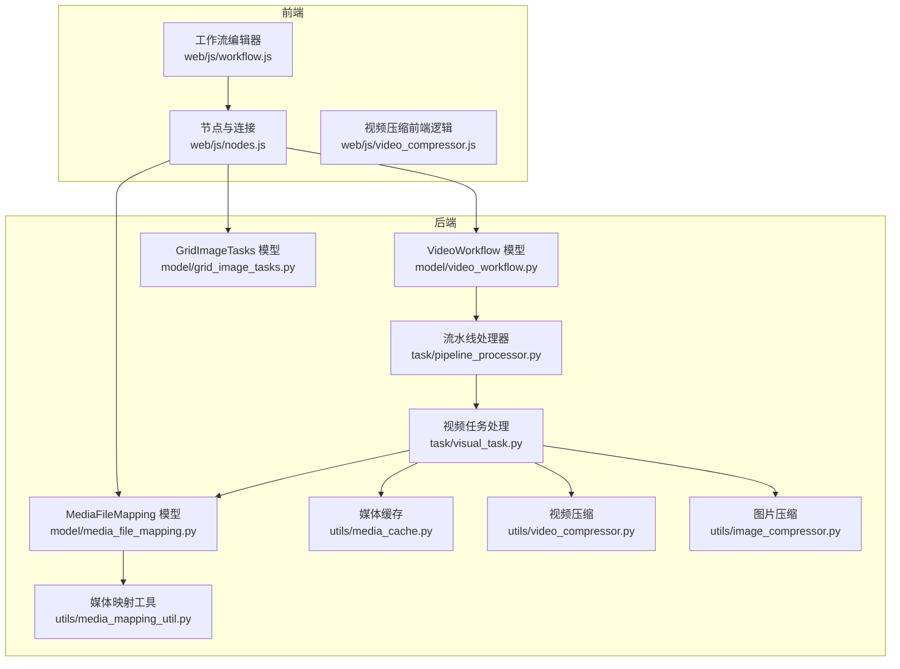
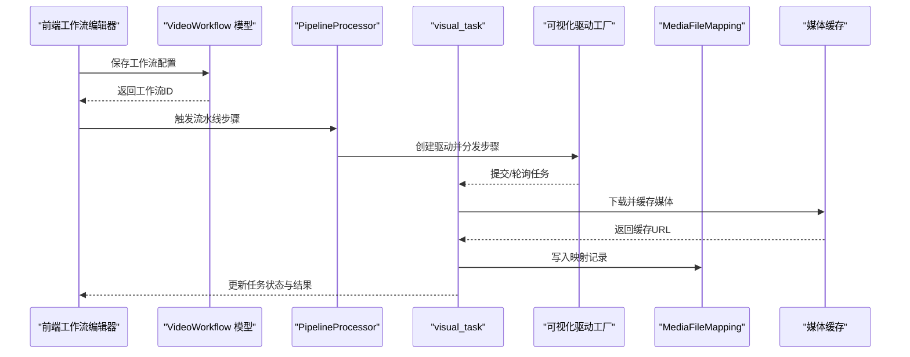
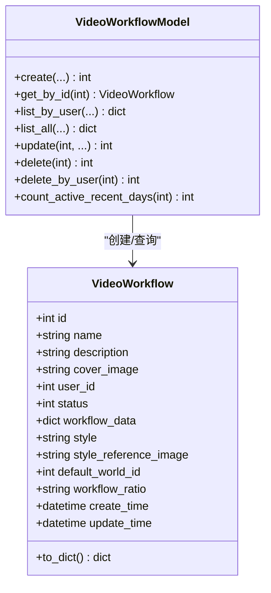
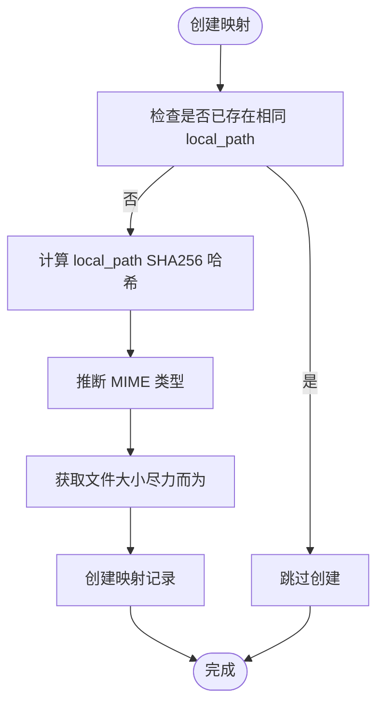
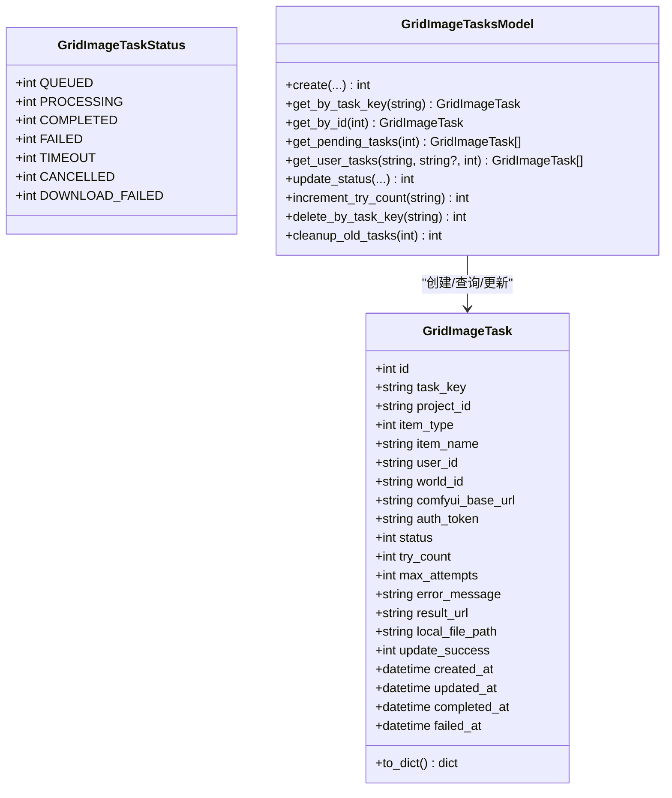
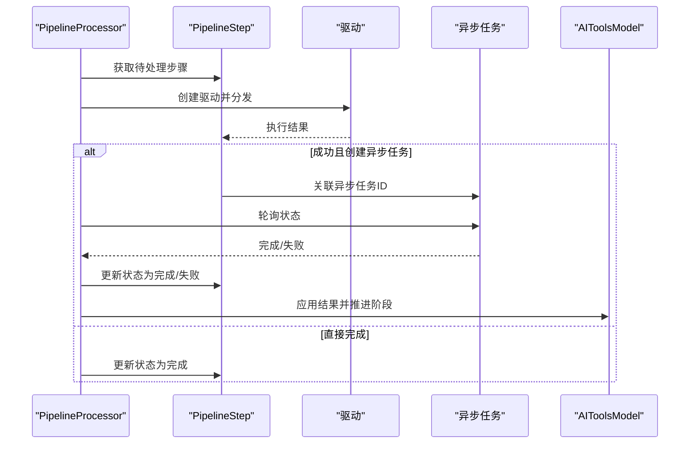
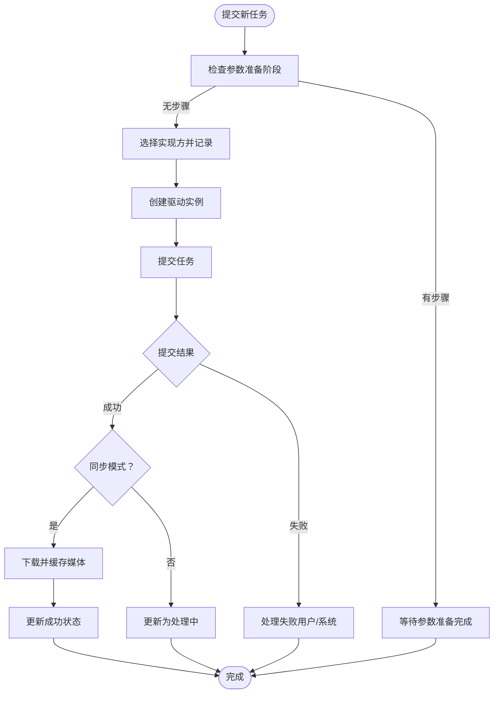
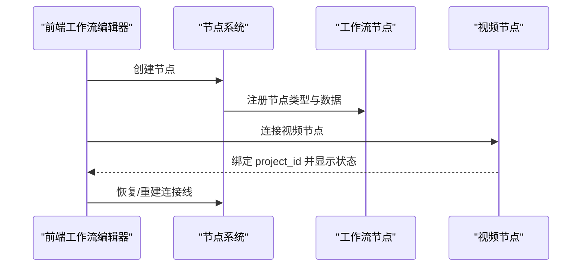
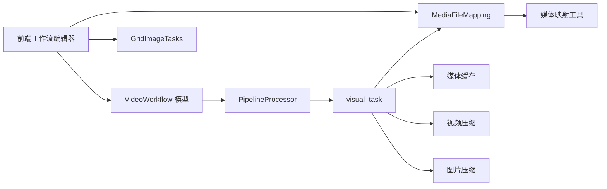

# 工作流媒体模型

<cite>
**本文档引用的文件**
- [model/video_workflow.py](file://model/video_workflow.py)
- [model/media_file_mapping.py](file://model/media_file_mapping.py)
- [model/grid_image_tasks.py](file://model/grid_image_tasks.py)
- [task/pipeline_processor.py](file://task/pipeline_processor.py)
- [task/visual_task.py](file://task/visual_task.py)
- [utils/media_mapping_util.py](file://utils/media_mapping_util.py)
- [utils/media_cache.py](file://utils/media_cache.py)
- [utils/video_compressor.py](file://utils/video_compressor.py)
- [utils/image_compressor.py](file://utils/image_compressor.py)
- [alembic/versions/20260519_add_local_path_hash_to_media_file_mapping.py](file://alembic/versions/20260519_add_local_path_hash_to_media_file_mapping.py)
- [docs/媒体文件缓存管理方案.md](file://docs/媒体文件缓存管理方案.md)
- [docs/视频/extract_frame_node.md](file://docs/视频/extract_frame_node.md)
- [web/js/workflow.js](file://web/js/workflow.js)
- [web/js/nodes.js](file://web/js/nodes.js)
- [web/js/video_compressor.js](file://web/js/video_compressor.js)
</cite>

## 目录
1. [简介](#简介)
2. [项目结构](#项目结构)
3. [核心组件](#核心组件)
4. [架构总览](#架构总览)
5. [详细组件分析](#详细组件分析)
6. [依赖关系分析](#依赖关系分析)
7. [性能考量](#性能考量)
8. [故障排查指南](#故障排查指南)
9. [结论](#结论)
10. [附录](#附录)

## 简介
本文件面向工作流媒体模型，围绕以下目标展开：  
- 详述 VideoWorkflow 视频工作流的节点配置、连接关系与执行顺序  
- 解释 MediaFileMapping 媒体文件映射的存储路径、CDN 同步与缓存策略  
- 阐述 GridImageTasks 网格图片任务的生成参数、尺寸规格与质量控制  
- 提供媒体处理的流水线设计与并行执行机制  
- 包含文件格式转换、压缩优化与存储成本控制策略  

## 项目结构
本项目采用分层架构：前端工作流编辑器负责节点编排与连接；后端模型层负责数据持久化；任务调度层负责异步执行与状态推进；工具层提供媒体处理与缓存能力。

**图表来源**
- [web/js/workflow.js:1891-1928](file://web/js/workflow.js#L1891-L1928)
- [web/js/nodes.js:4291-4323](file://web/js/nodes.js#L4291-L4323)
- [model/video_workflow.py:13-54](file://model/video_workflow.py#L13-L54)
- [model/media_file_mapping.py:49-88](file://model/media_file_mapping.py#L49-L88)
- [model/grid_image_tasks.py:24-70](file://model/grid_image_tasks.py#L24-L70)
- [task/pipeline_processor.py:24-395](file://task/pipeline_processor.py#L24-L395)
- [task/visual_task.py:1-800](file://task/visual_task.py#L1-L800)
- [utils/media_mapping_util.py:81-121](file://utils/media_mapping_util.py#L81-L121)
- [utils/media_cache.py](file://utils/media_cache.py)
- [utils/video_compressor.py](file://utils/video_compressor.py)
- [utils/image_compressor.py](file://utils/image_compressor.py)

**章节来源**
- [web/js/workflow.js:1891-1928](file://web/js/workflow.js#L1891-L1928)
- [web/js/nodes.js:4291-4323](file://web/js/nodes.js#L4291-L4323)
- [model/video_workflow.py:13-54](file://model/video_workflow.py#L13-L54)
- [model/media_file_mapping.py:49-88](file://model/media_file_mapping.py#L49-L88)
- [model/grid_image_tasks.py:24-70](file://model/grid_image_tasks.py#L24-L70)
- [task/pipeline_processor.py:24-395](file://task/pipeline_processor.py#L24-L395)
- [task/visual_task.py:1-800](file://task/visual_task.py#L1-L800)

## 核心组件
- VideoWorkflow：视频工作流的数据库模型与操作封装，支持创建、查询、分页、更新与删除，并提供活跃工作流统计等管理功能。
- MediaFileMapping：媒体文件映射模型，记录本地路径、云存储路径、策略代码、实体关联、媒体类型、文件大小、标签与状态等，支撑 CDN 重定向与缓存管理。
- GridImageTasks：宫格图片任务模型，支持任务创建、状态管理、重试与清理，配合多进程环境下的任务状态共享。
- PipelineProcessor：流水线编排器，负责创建参数准备与收尾重试步骤、分发步骤给驱动执行、轮询处理中步骤、应用结果并推进 AI Tool 状态。
- visual_task：视频生成任务处理，基于驱动工厂提交/轮询任务，处理成功/失败分支，进行媒体下载与缓存、CDN 同步与退款等。

**章节来源**
- [model/video_workflow.py:57-418](file://model/video_workflow.py#L57-L418)
- [model/media_file_mapping.py:91-518](file://model/media_file_mapping.py#L91-L518)
- [model/grid_image_tasks.py:73-405](file://model/grid_image_tasks.py#L73-L405)
- [task/pipeline_processor.py:24-395](file://task/pipeline_processor.py#L24-L395)
- [task/visual_task.py:171-378](file://task/visual_task.py#L171-L378)

## 架构总览
整体流程从前端工作流编辑器开始，节点间通过连接关系表达数据与控制流；后端接收工作流配置，通过 VideoWorkflow 持久化；任务执行由 PipelineProcessor 与 visual_task 协调，结合 MediaFileMapping 与媒体缓存工具完成存储与 CDN 同步。

**图表来源**
- [model/video_workflow.py:60-104](file://model/video_workflow.py#L60-L104)
- [task/pipeline_processor.py:92-187](file://task/pipeline_processor.py#L92-L187)
- [task/visual_task.py:171-378](file://task/visual_task.py#L171-L378)
- [utils/media_cache.py](file://utils/media_cache.py)
- [model/media_file_mapping.py:101-146](file://model/media_file_mapping.py#L101-L146)

## 详细组件分析

### VideoWorkflow 视频工作流
- 数据结构：包含工作流基本信息、样式与参考图、默认世界ID、宽高比、状态与时间戳等。
- 关键操作：
  - 创建：序列化 workflow_data，插入记录并返回ID。
  - 查询：按ID、用户ID分页查询，支持状态与关键词过滤。
  - 更新：安全字段白名单更新，JSON字段自动序列化。
  - 删除：按ID或用户ID批量删除。
  - 统计：管理员统计最近N天活跃工作流数量。
- 执行顺序：前端保存工作流后，由流水线处理器创建参数准备步骤，再进入可视化任务处理阶段。

**图表来源**
- [model/video_workflow.py:13-54](file://model/video_workflow.py#L13-L54)
- [model/video_workflow.py:57-418](file://model/video_workflow.py#L57-L418)

**章节来源**
- [model/video_workflow.py:57-418](file://model/video_workflow.py#L57-L418)

### MediaFileMapping 媒体文件映射
- 实体类型枚举：缓存、AI工具、角色、地点、道具、工作流上传等。
- 关键能力：
  - 创建映射：计算 local_path 的 SHA256 哈希，写入策略代码、实体类型、源ID、媒体类型、文件大小、标签与状态。
  - 查询：按ID、本地路径、哈希、实体组合查询；支持分页与统计。
  - 状态管理：更新云路径、状态切换、删除映射。
  - 过期清理：按策略与过期天数筛选过期文件。
  - 引用检测：检查是否被 ai_tools 引用，必要时清理引用。
- CDN 与缓存：
  - 通过 local_path_hash 快速定位记录，支持 CDN 重定向。
  - 媒体映射工具负责创建/更新映射，自动推断 MIME 类型与文件大小。
  - 媒体缓存负责下载与缓存，失败时回退至原始URL。

**图表来源**
- [utils/media_mapping_util.py:81-121](file://utils/media_mapping_util.py#L81-L121)
- [model/media_file_mapping.py:94-146](file://model/media_file_mapping.py#L94-L146)
- [alembic/versions/20260519_add_local_path_hash_to_media_file_mapping.py:25-77](file://alembic/versions/20260519_add_local_path_hash_to_media_file_mapping.py#L25-L77)

**章节来源**
- [model/media_file_mapping.py:91-518](file://model/media_file_mapping.py#L91-L518)
- [utils/media_mapping_util.py:81-121](file://utils/media_mapping_util.py#L81-L121)
- [alembic/versions/20260519_add_local_path_hash_to_media_file_mapping.py:31-77](file://alembic/versions/20260519_add_local_path_hash_to_media_file_mapping.py#L31-L77)

### GridImageTasks 网格图片任务
- 任务状态：队列中、处理中、完成、失败、超时、取消、下载失败。
- 关键操作：
  - 创建：基于任务键、项目ID、用户与世界观信息创建任务，初始状态为队列中。
  - 查询：按任务键、ID、用户与世界ID查询；获取待处理任务列表。
  - 状态更新：支持更新状态、错误信息、结果URL、本地文件路径与成功标志。
  - 重试：递增尝试次数；清理旧任务。
- 参数与尺寸：
  - 任务键唯一标识；项目ID指向 ComfyUI；支持自定义最大尝试次数。
  - 尺寸与质量：由上游可视化驱动与统一配置决定，网格生图通常使用模型支持的最大尺寸。

**图表来源**
- [model/grid_image_tasks.py:13-70](file://model/grid_image_tasks.py#L13-L70)
- [model/grid_image_tasks.py:73-405](file://model/grid_image_tasks.py#L73-L405)

**章节来源**
- [model/grid_image_tasks.py:73-405](file://model/grid_image_tasks.py#L73-L405)

### 流水线设计与并行执行
- 步骤创建：委托给 PipelineDriverFactory，自动创建参数准备与收尾重试步骤。
- 步骤分发：为每一步骤创建驱动，更新状态为处理中，执行后根据结果更新状态或安排重试。
- 轮询与推进：对处理中的步骤轮询异步任务状态，完成后应用结果并推进 AI Tool 阶段状态。
- 并行机制：限制每次分发与轮询的数量，避免资源争用；槽位满时采用指数退避重试。

**图表来源**
- [task/pipeline_processor.py:92-187](file://task/pipeline_processor.py#L92-L187)
- [task/pipeline_processor.py:293-343](file://task/pipeline_processor.py#L293-L343)
- [task/pipeline_processor.py:344-395](file://task/pipeline_processor.py#L344-L395)

**章节来源**
- [task/pipeline_processor.py:24-395](file://task/pipeline_processor.py#L24-L395)

### 视频生成任务处理与媒体缓存
- 提交新任务：根据任务类型创建驱动，处理失败分支（用户错误/系统错误），必要时释放槽位并退款。
- 状态检查：优先使用记录的实现方驱动，确保一致性；处理成功/失败/运行中三种状态。
- 成功处理：下载并缓存媒体文件，更新 AI Tool 与任务状态，释放槽位。
- 失败处理：创建 before_finish 重试步骤，进入重试阶段或最终失败，执行退款。

**图表来源**
- [task/visual_task.py:171-378](file://task/visual_task.py#L171-L378)
- [task/visual_task.py:380-501](file://task/visual_task.py#L380-L501)
- [task/visual_task.py:583-630](file://task/visual_task.py#L583-L630)

**章节来源**
- [task/visual_task.py:171-378](file://task/visual_task.py#L171-L378)
- [task/visual_task.py:380-501](file://task/visual_task.py#L380-L501)
- [task/visual_task.py:583-630](file://task/visual_task.py#L583-L630)

### 节点配置、连接关系与执行顺序
- 节点创建与连接：前端工作流编辑器支持节点创建、连接视频与图片节点、恢复视频连接线等。
- 视频节点：创建后立即绑定 project_id，初始化状态显示，便于跟踪生成进度。
- 提取帧节点：支持首帧/尾帧提取，自动创建图片节点并建立连接，避免重复下载。

**图表来源**
- [web/js/workflow.js:1891-1928](file://web/js/workflow.js#L1891-L1928)
- [web/js/nodes.js:4291-4323](file://web/js/nodes.js#L4291-L4323)
- [docs/视频/extract_frame_node.md:1-62](file://docs/视频/extract_frame_node.md#L1-L62)

**章节来源**
- [web/js/workflow.js:1891-1928](file://web/js/workflow.js#L1891-L1928)
- [web/js/nodes.js:4291-4323](file://web/js/nodes.js#L4291-L4323)
- [docs/视频/extract_frame_node.md:1-62](file://docs/视频/extract_frame_node.md#L1-L62)

## 依赖关系分析
- 模型层依赖数据库访问封装，提供 CRUD 与统计能力。
- 任务层依赖驱动工厂与异步任务模型，实现任务生命周期管理。
- 工具层提供媒体处理与缓存，支撑存储成本控制与性能优化。
- 前端依赖节点系统与工作流编辑器，负责可视化配置与交互。

**图表来源**
- [model/video_workflow.py:57-418](file://model/video_workflow.py#L57-L418)
- [task/pipeline_processor.py:24-395](file://task/pipeline_processor.py#L24-L395)
- [task/visual_task.py:1-800](file://task/visual_task.py#L1-L800)
- [model/media_file_mapping.py:91-518](file://model/media_file_mapping.py#L91-L518)
- [utils/media_mapping_util.py:81-121](file://utils/media_mapping_util.py#L81-L121)
- [utils/media_cache.py](file://utils/media_cache.py)
- [utils/video_compressor.py](file://utils/video_compressor.py)
- [utils/image_compressor.py](file://utils/image_compressor.py)

**章节来源**
- [model/video_workflow.py:57-418](file://model/video_workflow.py#L57-L418)
- [task/pipeline_processor.py:24-395](file://task/pipeline_processor.py#L24-L395)
- [task/visual_task.py:1-800](file://task/visual_task.py#L1-L800)
- [model/media_file_mapping.py:91-518](file://model/media_file_mapping.py#L91-L518)
- [utils/media_mapping_util.py:81-121](file://utils/media_mapping_util.py#L81-L121)
- [utils/media_cache.py](file://utils/media_cache.py)
- [utils/video_compressor.py](file://utils/video_compressor.py)
- [utils/image_compressor.py](file://utils/image_compressor.py)

## 性能考量
- 并发控制：流水线处理器限制每次分发与轮询数量，避免资源争用；槽位满时采用指数退避重试。
- 缓存策略：媒体缓存根据 URL 扩展名判断媒体类型，下载后缓存，失败回退至原始URL，减少重复下载。
- 压缩优化：前端与后端均提供压缩逻辑，依据最短边阈值、文件大小与时长判断是否需要压缩，降低带宽与存储成本。
- 索引与查询：MediaFileMapping 表新增 local_path_hash 索引，加速 CDN 重定向查找。

**章节来源**
- [task/pipeline_processor.py:188-204](file://task/pipeline_processor.py#L188-L204)
- [task/visual_task.py:317-337](file://task/visual_task.py#L317-L337)
- [web/js/video_compressor.js:38-70](file://web/js/video_compressor.js#L38-L70)
- [utils/video_compressor.py](file://utils/video_compressor.py)
- [alembic/versions/20260519_add_local_path_hash_to_media_file_mapping.py:31-77](file://alembic/versions/20260519_add_local_path_hash_to_media_file_mapping.py#L31-L77)

## 故障排查指南
- 任务提交失败：检查驱动创建错误、网络异常与实现方配置；必要时释放槽位并执行退款。
- 状态检查异常：确认任务是否在同步执行器中运行；若无 project_id 且不在执行器中，重置为队列状态。
- 媒体下载失败：回退至原始URL；检查缓存目录权限与磁盘空间。
- 映射冲突：当 local_path 不同时，先删除旧映射再创建新映射；确保实体标签唯一性。
- 过期清理：定期清理过期文件，避免存储膨胀。

**章节来源**
- [task/visual_task.py:232-302](file://task/visual_task.py#L232-L302)
- [task/visual_task.py:407-454](file://task/visual_task.py#L407-L454)
- [task/visual_task.py:632-785](file://task/visual_task.py#L632-L785)
- [model/media_file_mapping.py:282-307](file://model/media_file_mapping.py#L282-L307)
- [utils/media_mapping_util.py:81-121](file://utils/media_mapping_util.py#L81-L121)

## 结论
本工作流媒体模型通过清晰的分层设计与完善的工具链，实现了从节点配置、连接关系到任务执行与媒体处理的全链路闭环。借助流水线编排、并行执行与缓存策略，系统在保证稳定性的同时兼顾性能与成本控制。建议持续关注实现方配置、压缩阈值与缓存策略的动态调整，以适应不同业务场景的需求。

## 附录
- 相关文档与规范：媒体文件缓存管理方案、视频提取帧节点说明等。
- 前端交互：工作流编辑器、节点系统与视频压缩前端逻辑。

**章节来源**
- [docs/媒体文件缓存管理方案.md](file://docs/媒体文件缓存管理方案.md)
- [docs/视频/extract_frame_node.md:1-62](file://docs/视频/extract_frame_node.md#L1-L62)
- [web/js/video_compressor.js:38-70](file://web/js/video_compressor.js#L38-L70)