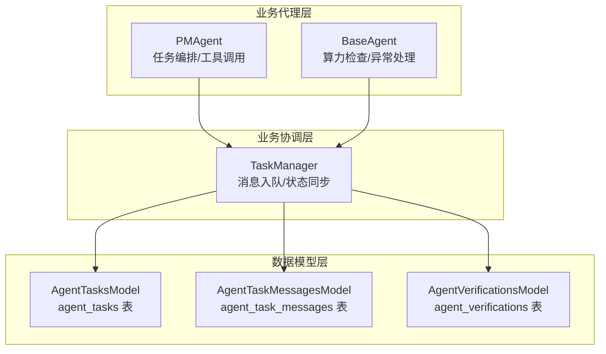
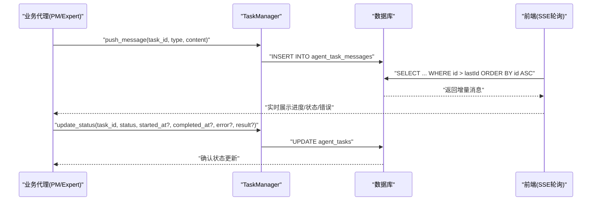
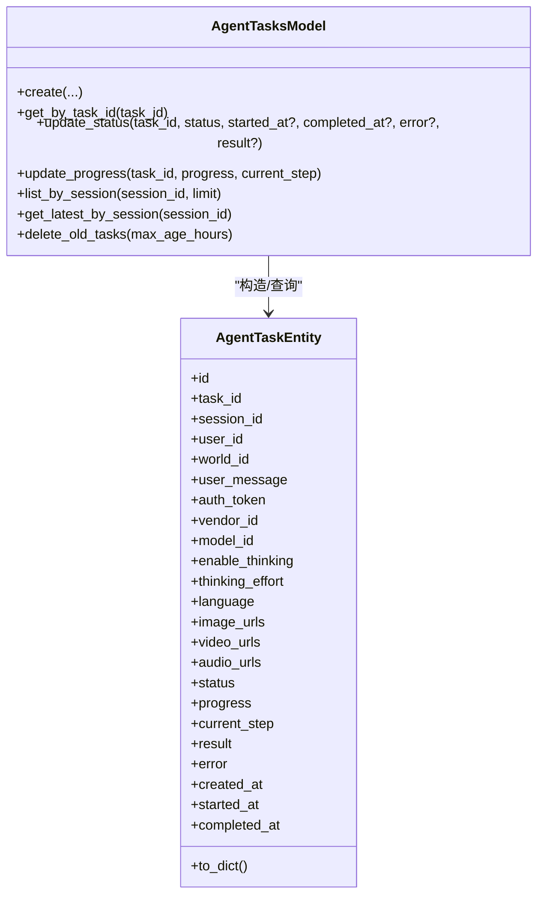
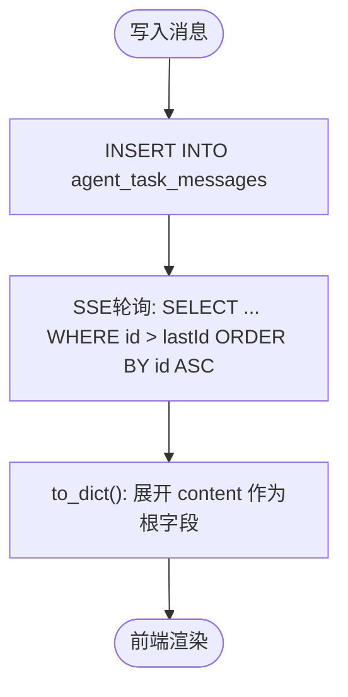
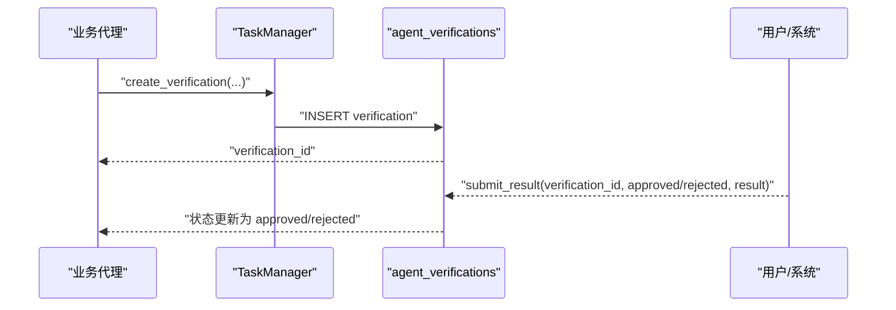
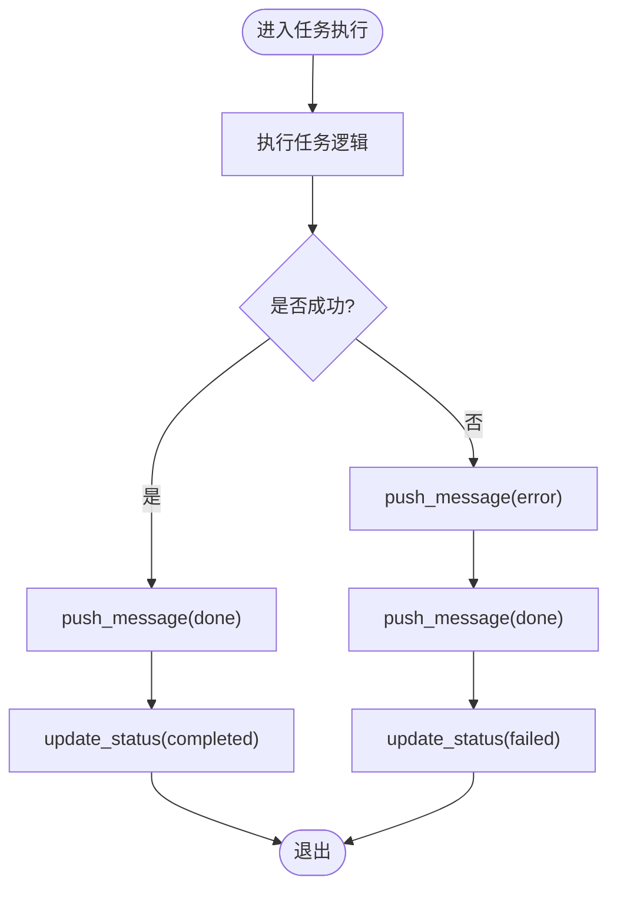
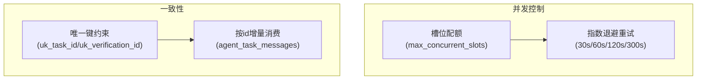

# 智能体任务模型

<cite>
**本文引用的文件**
- [model/agent_tasks.py](file://model/agent_tasks.py)
- [model/agent_task_messages.py](file://model/agent_task_messages.py)
- [model/agent_verifications.py](file://model/agent_verifications.py)
- [alembic/versions/20260406_create_agent_tasks.py](file://alembic/versions/20260406_create_agent_tasks.py)
- [alembic/versions/20260427_create_agent_verifications.py](file://alembic/versions/20260427_create_agent_verifications.py)
- [script_writer_core/agents/task_manager.py](file://script_writer_core/agents/task_manager.py)
- [api/test_ask_user.py](file://api/test_ask_user.py)
- [script_writer_core/agents/pm_agent.py](file://script_writer_core/agents/pm_agent.py)
- [script_writer_core/agents/base_agent.py](file://script_writer_core/agents/base_agent.py)
- [docs/backend/runninghub_concurrency_control.md](file://docs/backend/runninghub_concurrency_control.md)
- [docs/backend/pipeline_steps.md](file://docs/backend/pipeline_steps.md)
</cite>

## 目录
1. [简介](#简介)
2. [项目结构](#项目结构)
3. [核心组件](#核心组件)
4. [架构总览](#架构总览)
5. [详细组件分析](#详细组件分析)
6. [依赖分析](#依赖分析)
7. [性能考虑](#性能考虑)
8. [故障排查指南](#故障排查指南)
9. [结论](#结论)
10. [附录](#附录)

## 简介
本文件围绕智能体任务模型进行系统化文档化，重点覆盖以下方面：
- AgentTask 实体的任务状态管理：从创建、执行进度到完成状态的全生命周期。
- AgentTaskMessage 消息模型的消息传递机制：如何通过数据库驱动的流式消息实现跨进程共享与 SSE 轮询。
- AgentVerification 验证模型的身份验证与审核流程：如何在任务执行中引入人工/系统验证，并保证幂等与一致性。
- 任务调度、状态同步与错误处理的实现细节：结合数据库层、任务管理器与业务代理的协作。
- 智能体协作的并发控制与数据一致性保证：基于槽位管理与重试机制，确保跨进程、跨服务的一致性。

## 项目结构
智能体任务模型由三层组成：
- 数据模型层：AgentTask、AgentTaskMessage、AgentVerification 的实体与数据库操作封装。
- 业务协调层：任务管理器（TaskManager）负责消息入队与状态同步。
- 业务代理层：PM Agent、基础 Agent 等在执行过程中写入消息与状态。



图表来源
- [model/agent_tasks.py:116-358](file://model/agent_tasks.py#L116-L358)
- [model/agent_task_messages.py:45-207](file://model/agent_task_messages.py#L45-L207)
- [model/agent_verifications.py:75-260](file://model/agent_verifications.py#L75-L260)
- [script_writer_core/agents/task_manager.py:319-350](file://script_writer_core/agents/task_manager.py#L319-L350)

章节来源
- [model/agent_tasks.py:116-358](file://model/agent_tasks.py#L116-L358)
- [model/agent_task_messages.py:45-207](file://model/agent_task_messages.py#L45-L207)
- [model/agent_verifications.py:75-260](file://model/agent_verifications.py#L75-L260)
- [script_writer_core/agents/task_manager.py:319-350](file://script_writer_core/agents/task_manager.py#L319-L350)

## 核心组件
- AgentTask 实体与模型：封装任务字段、序列化/反序列化、状态更新、进度更新、查询与清理。
- AgentTaskMessage 实体与模型：封装消息类型、内容、插入、轮询读取、计数与清理。
- AgentVerification 实体与模型：封装验证请求、结果提交、状态变更与查询。
- 任务管理器：统一推送消息、更新任务状态、与数据库交互。
- 业务代理：在执行过程中写入消息、触发验证、处理异常与重试。

章节来源
- [model/agent_tasks.py:15-113](file://model/agent_tasks.py#L15-L113)
- [model/agent_tasks.py:116-358](file://model/agent_tasks.py#L116-L358)
- [model/agent_task_messages.py:15-43](file://model/agent_task_messages.py#L15-L43)
- [model/agent_task_messages.py:45-207](file://model/agent_task_messages.py#L45-L207)
- [model/agent_verifications.py:16-73](file://model/agent_verifications.py#L16-L73)
- [model/agent_verifications.py:75-260](file://model/agent_verifications.py#L75-L260)
- [script_writer_core/agents/task_manager.py:319-350](file://script_writer_core/agents/task_manager.py#L319-L350)

## 架构总览
整体架构以数据库为中心，实现跨进程共享与一致性：
- 任务状态与结果持久化于 agent_tasks。
- 流式消息持久化于 agent_task_messages，前端通过 SSE 轮询消费。
- 验证请求持久化于 agent_verifications，支持人工/系统审核与幂等提交。
- 业务代理通过 TaskManager 写入消息与更新状态，确保一致性。



图表来源
- [script_writer_core/agents/task_manager.py:343-350](file://script_writer_core/agents/task_manager.py#L343-L350)
- [model/agent_tasks.py:190-237](file://model/agent_tasks.py#L190-L237)
- [model/agent_task_messages.py:49-80](file://model/agent_task_messages.py#L49-L80)

## 详细组件分析

### AgentTask 实体与状态管理
- 字段与序列化：支持 image_urls/video_urls/audio_urls/result 的 JSON 反序列化；时间字段统一为 ISO 字符串输出。
- 状态与进度：提供状态更新（含开始/完成时间戳）、进度更新（含当前步骤描述）。
- 查询与清理：按会话查询、获取最新任务、删除旧任务（仅限完成/失败/取消）。



图表来源
- [model/agent_tasks.py:15-113](file://model/agent_tasks.py#L15-L113)
- [model/agent_tasks.py:116-358](file://model/agent_tasks.py#L116-L358)

章节来源
- [model/agent_tasks.py:15-113](file://model/agent_tasks.py#L15-L113)
- [model/agent_tasks.py:116-358](file://model/agent_tasks.py#L116-L358)

### AgentTaskMessage 消息模型与消息传递机制
- 消息类型：message/progress/done/error/status/heartbeat/connected。
- 内容结构：content 为 JSON 对象，to_dict 输出时展开为消息根级字段。
- 读写接口：创建消息、按 ID 增量读取、获取最新消息、计数与清理。



图表来源
- [model/agent_task_messages.py:49-80](file://model/agent_task_messages.py#L49-L80)
- [model/agent_task_messages.py:82-135](file://model/agent_task_messages.py#L82-L135)

章节来源
- [model/agent_task_messages.py:15-43](file://model/agent_task_messages.py#L15-L43)
- [model/agent_task_messages.py:45-207](file://model/agent_task_messages.py#L45-L207)

### AgentVerification 验证模型与身份验证/审核流程
- 验证类型：目前支持 ask_user 类型，包含标题、描述、选项与上下文。
- 状态机：pending/approved/rejected/cancelled，提交结果时要求状态为 pending 以保证幂等。
- 查询接口：按 verification_id 查询、按任务获取最新已完成/待处理验证。



图表来源
- [model/agent_verifications.py:79-110](file://model/agent_verifications.py#L79-L110)
- [model/agent_verifications.py:131-166](file://model/agent_verifications.py#L131-L166)

章节来源
- [model/agent_verifications.py:16-73](file://model/agent_verifications.py#L16-L73)
- [model/agent_verifications.py:75-260](file://model/agent_verifications.py#L75-L260)

### 任务调度、状态同步与错误处理
- 状态同步：业务代理通过 TaskManager 将任务状态更新写入 agent_tasks，确保跨进程可见。
- 错误处理：在代理循环中捕获异常，推送 error 消息与 done 结束消息，并更新任务状态为 failed 或 completed。
- 验证超时与恢复：当验证超时，将状态置为 cancelled，并恢复任务状态为 running，保证流程可控。



图表来源
- [script_writer_core/agents/pm_agent.py:335-364](file://script_writer_core/agents/pm_agent.py#L335-L364)
- [api/test_ask_user.py:202-236](file://api/test_ask_user.py#L202-L236)
- [model/agent_tasks.py:190-237](file://model/agent_tasks.py#L190-L237)

章节来源
- [script_writer_core/agents/pm_agent.py:335-364](file://script_writer_core/agents/pm_agent.py#L335-L364)
- [api/test_ask_user.py:202-236](file://api/test_ask_user.py#L202-L236)
- [model/agent_tasks.py:190-237](file://model/agent_tasks.py#L190-L237)

### 智能体协作的并发控制与数据一致性
- 槽位管理：异步任务与旧任务系统共享槽位配额，避免并发超限；后台重试采用指数退避策略。
- 一致性保障：通过数据库事务与唯一键约束（如 task_id、verification_id）保证幂等；消息表按 id 顺序保证增量消费。
- 算力检查：基础代理在执行前检查算力，不足时抛出特定异常，避免无效资源消耗。



图表来源
- [docs/backend/runninghub_concurrency_control.md:37-72](file://docs/backend/runninghub_concurrency_control.md#L37-L72)
- [model/agent_tasks.py:329-358](file://model/agent_tasks.py#L329-L358)
- [model/agent_verifications.py:240-259](file://model/agent_verifications.py#L240-L259)
- [script_writer_core/agents/base_agent.py:39-79](file://script_writer_core/agents/base_agent.py#L39-L79)

章节来源
- [docs/backend/runninghub_concurrency_control.md:37-72](file://docs/backend/runninghub_concurrency_control.md#L37-L72)
- [script_writer_core/agents/base_agent.py:39-79](file://script_writer_core/agents/base_agent.py#L39-L79)

## 依赖分析
- 数据表定义：agent_tasks、agent_task_messages、agent_verifications 的迁移脚本定义了字段、索引与注释。
- 业务依赖：TaskManager 依赖三个模型进行消息与状态管理；业务代理依赖 TaskManager 与模型进行状态更新与消息推送。

```mermaid
graph LR
M1["agent_tasks 表"] <- --> T1["AgentTasksModel"]
M2["agent_task_messages 表"] <- --> T2["AgentTaskMessagesModel"]
M3["agent_verifications 表"] <- --> T3["AgentVerificationsModel"]
T1 --- TM["TaskManager"]
T2 --- TM
T3 --- TM
```

图表来源
- [alembic/versions/20260406_create_agent_tasks.py:34-50](file://alembic/versions/20260406_create_agent_tasks.py#L34-L50)
- [alembic/versions/20260427_create_agent_verifications.py:31-50](file://alembic/versions/20260427_create_agent_verifications.py#L31-L50)
- [model/agent_tasks.py:329-358](file://model/agent_tasks.py#L329-L358)
- [model/agent_task_messages.py:195-206](file://model/agent_task_messages.py#L195-L206)
- [model/agent_verifications.py:240-259](file://model/agent_verifications.py#L240-L259)

章节来源
- [alembic/versions/20260406_create_agent_tasks.py:34-50](file://alembic/versions/20260406_create_agent_tasks.py#L34-L50)
- [alembic/versions/20260427_create_agent_verifications.py:31-50](file://alembic/versions/20260427_create_agent_verifications.py#L31-L50)
- [model/agent_tasks.py:329-358](file://model/agent_tasks.py#L329-L358)
- [model/agent_task_messages.py:195-206](file://model/agent_task_messages.py#L195-L206)
- [model/agent_verifications.py:240-259](file://model/agent_verifications.py#L240-L259)

## 性能考虑
- 索引优化：agent_tasks 的 idx_session_id、idx_user_world、idx_status、idx_created_at；agent_task_messages 的 idx_task_id、idx_created_at；agent_verifications 的 idx_task_id、idx_status、idx_created_at。
- 增量消息：SSE 轮询基于 id 增量，减少无关数据传输。
- 清理策略：定期删除旧任务与消息，避免表膨胀。
- 并发控制：通过槽位与重试策略限制并发，避免系统过载。

## 故障排查指南
- 任务状态未更新：检查 TaskManager 是否正确调用 AgentTasksModel.update_status，以及数据库连接与权限。
- 消息未到达前端：确认 agent_task_messages 的增量查询条件与 lastId 是否正确传递；检查数据库写入是否成功。
- 验证结果未生效：确认提交时状态仍为 pending；若已被处理，日志会提示已处理或不存在。
- 算力不足导致中断：基础代理会在算力不足时抛出特定异常，需检查外部算力服务可用性与阈值设置。

章节来源
- [script_writer_core/agents/task_manager.py:343-350](file://script_writer_core/agents/task_manager.py#L343-L350)
- [model/agent_tasks.py:190-237](file://model/agent_tasks.py#L190-L237)
- [model/agent_task_messages.py:82-135](file://model/agent_task_messages.py#L82-L135)
- [model/agent_verifications.py:131-166](file://model/agent_verifications.py#L131-L166)
- [script_writer_core/agents/base_agent.py:39-79](file://script_writer_core/agents/base_agent.py#L39-L79)

## 结论
智能体任务模型通过数据库为中心的设计，实现了跨进程共享、一致的状态与消息流转。AgentTask 提供完整的任务生命周期管理；AgentTaskMessage 支持 SSE 增量消息；AgentVerification 提供可幂等的人工/系统验证。配合并发控制与重试机制，系统在高并发场景下仍能保持稳定与一致性。

## 附录
- 数据库表结构参考：见各迁移脚本中的 CREATE TABLE 定义。
- 文档补充：并发控制与流水线调度的背景文档。

章节来源
- [alembic/versions/20260406_create_agent_tasks.py:34-50](file://alembic/versions/20260406_create_agent_tasks.py#L34-L50)
- [alembic/versions/20260427_create_agent_verifications.py:31-50](file://alembic/versions/20260427_create_agent_verifications.py#L31-L50)
- [docs/backend/runninghub_concurrency_control.md:37-72](file://docs/backend/runninghub_concurrency_control.md#L37-L72)
- [docs/backend/pipeline_steps.md:134-180](file://docs/backend/pipeline_steps.md#L134-L180)