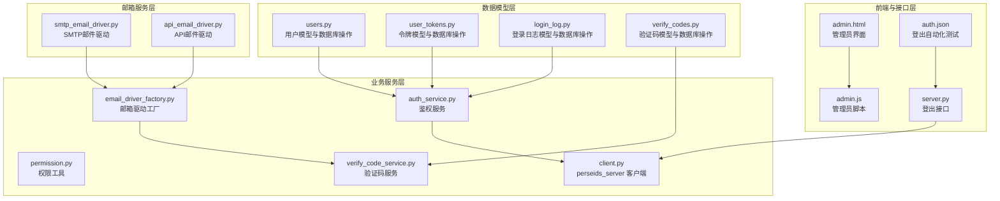
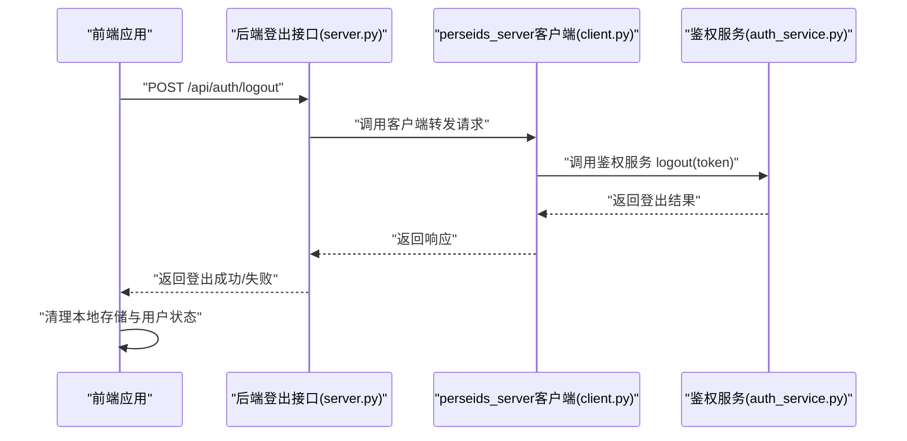
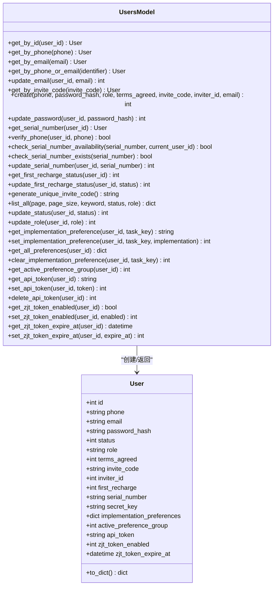
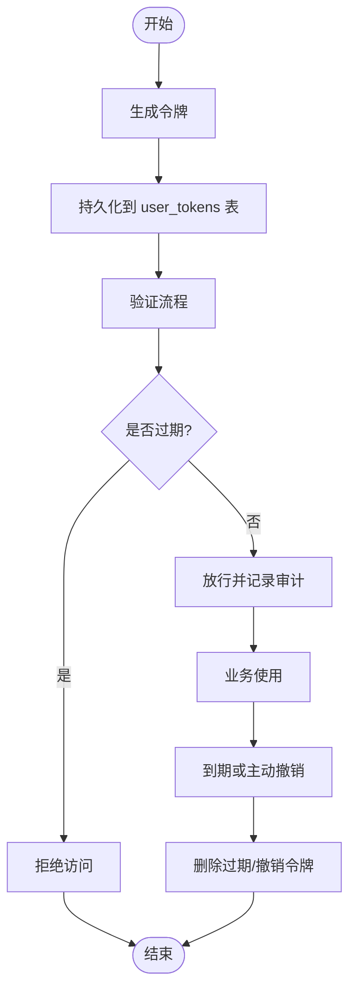
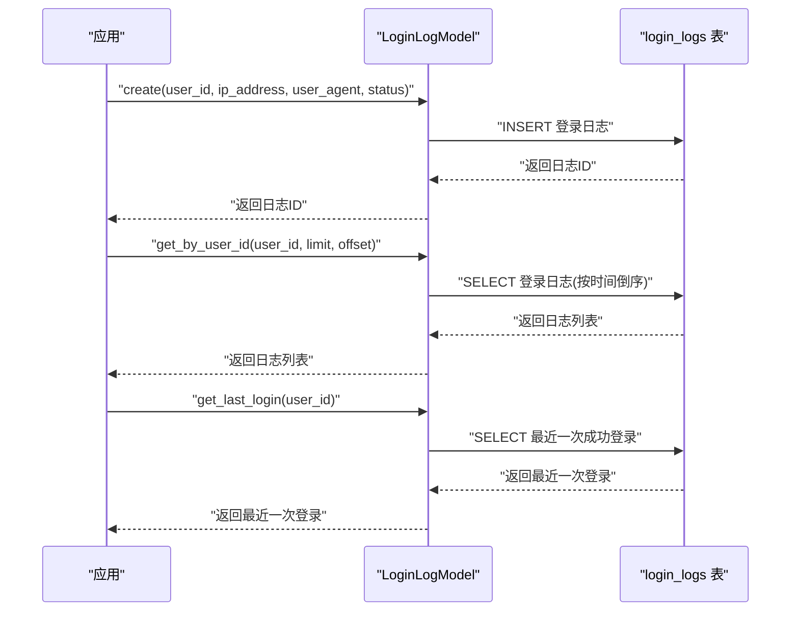
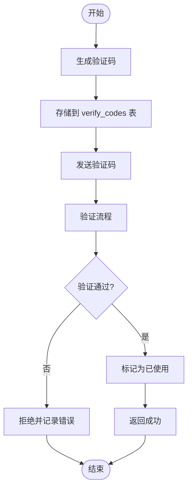
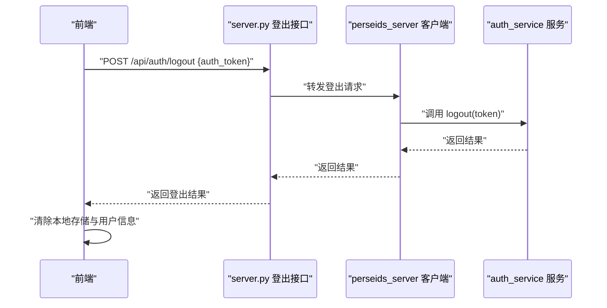

# 用户模型

<cite>
**本文引用的文件**
- [users.py](file://model/users.py)
- [user_tokens.py](file://model/user_tokens.py)
- [login_log.py](file://model/login_log.py)
- [verify_codes.py](file://model/verify_codes.py)
- [20260401_add_api_token_to_users.py](file://alembic/versions/20260401_add_api_token_to_users.py)
- [20260603_add_email_support.py](file://alembic/versions/20260603_add_email_support.py)
- [admin.html](file://web/admin.html)
- [admin.js](file://web/js/admin.js)
- [server.py](file://server.py)
- [client.py](file://perseids_server/client.py)
- [auth_service.py](file://perseids_server/services/auth_service.py)
- [permission.py](file://perseids_server/utils/permission.py)
- [auth.json](file://auto_test/test_modules/auth.json)
</cite>

## 更新摘要
**变更内容**
- 新增邮箱认证支持，扩展用户登录方式
- 统一登录入口支持手机号/邮箱双重匹配
- 更新API Token迁移脚本以支持邮箱字段
- 扩展验证码系统以支持邮箱验证
- 增强用户管理功能，支持邮箱搜索和筛选

## 目录
1. [简介](#简介)
2. [项目结构](#项目结构)
3. [核心组件](#核心组件)
4. [架构总览](#架构总览)
5. [详细组件分析](#详细组件分析)
6. [依赖分析](#依赖分析)
7. [性能考虑](#性能考虑)
8. [故障排查指南](#故障排查指南)
9. [结论](#结论)
10. [附录](#附录)

## 简介
本文件围绕用户模型进行系统化文档化，涵盖以下方面：
- User 实体的核心字段定义与用途，包括用户标识、认证信息、权限级别与状态管理
- UserToken 模型的令牌管理机制，包括令牌生成、验证与过期处理
- LoginLog 模型的日志记录功能，包括登录时间、IP 地址与用户代理追踪
- VerifyCodes 模型的验证码管理，支持手机号和邮箱双重验证
- 用户生命周期管理、权限验证与安全审计的实现细节
- 用户数据的隐私保护与合规要求

## 项目结构
用户相关能力由四层组成：
- 数据模型层：用户表、令牌表、登录日志表、验证码表的 Python 模型与 SQL 定义
- 业务服务层：鉴权服务、权限工具、验证码服务等
- 前端与接口层：管理员界面、登出接口、自动化测试校验
- 邮箱服务层：邮箱驱动、SMTP配置、邮件模板



**图表来源**
- [users.py](file://model/users.py)
- [user_tokens.py](file://model/user_tokens.py)
- [login_log.py](file://model/login_log.py)
- [verify_codes.py](file://model/verify_codes.py)
- [auth_service.py](file://perseids_server/services/auth_service.py)
- [permission.py](file://perseids_server/utils/permission.py)
- [client.py](file://perseids_server/client.py)
- [admin.html](file://web/admin.html)
- [admin.js](file://web/js/admin.js)
- [server.py](file://server.py)
- [auth.json](file://auto_test/test_modules/auth.json)
- [smtp_email_driver.py](file://perseids_server/utils/email_drivers/smtp_email_driver.py)
- [api_email_driver.py](file://perseids_server/utils/email_drivers/api_email_driver.py)
- [email_driver_factory.py](file://perseids_server/utils/email_drivers/email_driver_factory.py)

**章节来源**
- [users.py](file://model/users.py)
- [user_tokens.py](file://model/user_tokens.py)
- [login_log.py](file://model/login_log.py)
- [verify_codes.py](file://model/verify_codes.py)
- [admin.html](file://web/admin.html)
- [admin.js](file://web/js/admin.js)
- [server.py](file://server.py)

## 核心组件
- User 实体：封装用户标识、认证信息、角色与状态、邀请与首充等属性，并提供序列号、实现方偏好、API Token、智剧通 Token 等扩展能力
- UserToken 实体：封装令牌、用户关联、设备 UUID、过期时间等字段，并提供过期判定与数据库操作
- LoginLog 实体：封装登录时间、IP 地址、用户代理、状态等字段，并提供创建、查询最近一次登录等操作
- VerifyCode 实体：封装验证码、手机号/邮箱、标识类型、过期时间等字段，并提供创建、验证、使用状态管理等操作

**章节来源**
- [users.py](file://model/users.py)
- [user_tokens.py](file://model/user_tokens.py)
- [login_log.py](file://model/login_log.py)
- [verify_codes.py](file://model/verify_codes.py)

## 架构总览
用户模型在系统中的交互路径如下：
- 前端通过登出接口提交认证令牌，后端调用 perseids_server 客户端转发到鉴权服务进行登出
- 鉴权服务执行登出逻辑并返回结果，前端据此清理本地存储与状态
- 管理员界面可对用户状态、角色、智剧通 Token 启用与过期时间进行调整
- 邮箱验证码服务支持邮箱注册、登录、重置密码等场景



**图表来源**
- [server.py](file://server.py)
- [client.py](file://perseids_server/client.py)
- [auth_service.py](file://perseids_server/services/auth_service.py)

**章节来源**
- [server.py](file://server.py)
- [client.py](file://perseids_server/client.py)
- [auth_service.py](file://perseids_server/services/auth_service.py)
- [admin.html](file://web/admin.html)
- [admin.js](file://web/js/admin.js)

## 详细组件分析

### User 实体与用户生命周期
- 核心字段
  - 标识与凭证：id、phone、email、password_hash
  - 状态与角色：status、role、terms_agreed
  - 邀请与推广：invite_code、inviter_id
  - 首充标记：first_recharge
  - 序列号与密钥：serial_number、secret_key
  - 智剧通 Token：zjt_token_enabled、zjt_token_expire_at
  - 实现方偏好：implementation_preferences（JSON）、active_preference_group
  - API Token：api_token（唯一索引）
- 生命周期关键操作
  - 创建：create(...) 插入用户记录，支持手机号和邮箱
  - 查询：按 id、phone、email、邀请码查询；统一登录入口按手机号/邮箱匹配
  - 更新：更新邮箱、密码哈希、序列号、首充状态、角色、状态
  - 邀请码：generate_unique_invite_code() 生成唯一六位推荐码
  - 管理员视图：list_all(...) 支持分页与关键词/状态/角色筛选，关键词支持手机号和邮箱
  - 实现方偏好：按用户与任务 key 维度读写偏好，支持组切换与清空
  - API Token：get/set/delete
  - 智剧通 Token：启用开关与过期时间管理



**图表来源**
- [users.py](file://model/users.py)

**章节来源**
- [users.py](file://model/users.py)
- [20260401_add_api_token_to_users.py](file://alembic/versions/20260401_add_api_token_to_users.py)
- [20260603_add_email_support.py](file://alembic/versions/20260603_add_email_support.py)

### UserToken 令牌管理机制
- 字段定义
  - id、user_id、token、device_uuid、expire_time、created_at
- 关键能力
  - is_expired()：基于当前时间与过期时间判断是否过期
  - 数据库操作：创建、按 token 查询、获取有效 token、按 token 删除、按用户删除、删除过期、按用户获取最新有效 token
- 业务流程
  - 令牌生成：由上层服务负责生成并持久化
  - 令牌验证：get_valid_token(token) 或 get_user_id_by_token(token) 仅允许未过期的令牌通过
  - 过期处理：定时任务或后台清理 delete_expired()



**图表来源**
- [user_tokens.py](file://model/user_tokens.py)

**章节来源**
- [user_tokens.py](file://model/user_tokens.py)

### LoginLog 日志记录功能
- 字段定义
  - id、user_id、ip_address、user_agent、status、created_at
- 关键能力
  - create(...)：创建登录日志
  - get_by_user_id(user_id, limit, offset)：分页查询用户登录历史
  - get_last_login(user_id)：查询最近一次成功登录记录
- 审计要点
  - 记录登录时间、来源 IP、用户代理、状态（成功/失败）
  - 支持按用户聚合与检索，便于安全审计与异常追踪



**图表来源**
- [login_log.py](file://model/login_log.py)

**章节来源**
- [login_log.py](file://model/login_log.py)

### VerifyCodes 验证码管理机制
- 字段定义
  - id、phone、email、identifier_type、code、type、expire_time、used、created_at
- 关键能力
  - 手机验证码：create(phone, code, code_type)、get_latest_by_phone(phone)、verify(phone, code, code_type)
  - 邮箱验证码：create_for_email(email, code, code_type)、get_latest_by_email(email)、verify_for_email(email, code, code_type)
  - 状态管理：mark_used(phone/code)、mark_used_for_email(email/code)、delete_by_phone(phone)、delete_by_email(email)
  - 过期清理：delete_expired()
- 业务流程
  - 验证码生成：支持手机号和邮箱两种标识类型
  - 验证流程：检查验证码正确性、未过期、未使用状态
  - 使用状态：验证成功后标记为已使用
  - 清理机制：定时清理过期验证码



**图表来源**
- [verify_codes.py](file://model/verify_codes.py)

**章节来源**
- [verify_codes.py](file://model/verify_codes.py)

### 用户生命周期管理与权限验证
- 用户状态管理
  - 状态枚举：正常/待审核/禁用（由管理员通过 update_status(...) 修改）
  - 管理员界面：支持按状态/角色筛选、批量操作启用/禁用、设置管理员角色
  - 搜索功能：管理员界面支持按手机号和邮箱关键词搜索
- 权限验证
  - 接口权限：登出接口标注 require_permission("user:logout")，确保具备相应权限才可调用
  - 权限工具：permission.py 提供通用权限校验能力
- 登出流程
  - 前端调用 /api/auth/logout 并携带 auth_token
  - 后端转发至 perseids_server 客户端，再调用鉴权服务 logout(...)
  - 成功后清理本地存储与用户态
- 邮箱认证支持
  - 动态配置：通过动态配置系统启用/禁用邮箱登录功能
  - 统一登录：支持手机号和邮箱双重登录方式
  - 验证码：邮箱注册、登录、重置密码等场景支持邮箱验证码



**图表来源**
- [server.py](file://server.py)
- [client.py](file://perseids_server/client.py)
- [auth_service.py](file://perseids_server/services/auth_service.py)
- [permission.py](file://perseids_server/utils/permission.py)

**章节来源**
- [admin.html](file://web/admin.html)
- [admin.js](file://web/js/admin.js)
- [server.py](file://server.py)
- [client.py](file://perseids_server/client.py)
- [auth_service.py](file://perseids_server/services/auth_service.py)
- [permission.py](file://perseids_server/utils/permission.py)
- [auth.json](file://auto_test/test_modules/auth.json)

## 依赖分析
- 外部依赖
  - 数据库：users、user_tokens、login_logs、verify_codes 表，分别由 users.py、user_tokens.py、login_log.py、verify_codes.py 中的 CREATE_TABLE_SQL 定义
  - 迁移：20260401_add_api_token_to_users.py 为 users 表新增 api_token 字段并建立唯一索引；20260603_add_email_support.py 为用户表和验证码表新增邮箱字段支持
- 内部依赖
  - 用户模型依赖数据库访问工具（execute_query/execute_update/execute_insert）
  - 登出接口依赖 perseids_server 客户端与鉴权服务
  - 管理员界面依赖前端脚本与后端接口
  - 邮箱服务依赖邮箱驱动工厂和多种邮件传输方式

```mermaid
graph LR
DB_USERS["users 表"] <- --> U["users.py"]
DB_TOKENS["user_tokens 表"] <- --> UT["user_tokens.py"]
DB_LOGS["login_logs 表"] <- --> LL["login_log.py"]
DB_CODES["verify_codes 表"] <- --> VC["verify_codes.py"]
MIG_API["迁移: 添加 api_token"] --> DB_USERS
MIG_EMAIL["迁移: 添加邮箱支持"] --> DB_USERS
MIG_EMAIL_CODES["迁移: 添加邮箱验证码"] --> DB_CODES
API["登出接口 server.py"] --> CLI["perseids_server 客户端"]
CLI --> SVC["auth_service 服务"]
ADMIN["管理员界面"] --> API
EMAIL["邮箱服务"] --> EDF["邮箱驱动工厂"]
EDF --> SMTP["SMTP驱动"]
EDF --> API["API驱动"]
```

**图表来源**
- [users.py](file://model/users.py)
- [user_tokens.py](file://model/user_tokens.py)
- [login_log.py](file://model/login_log.py)
- [verify_codes.py](file://model/verify_codes.py)
- [20260401_add_api_token_to_users.py](file://alembic/versions/20260401_add_api_token_to_users.py)
- [20260603_add_email_support.py](file://alembic/versions/20260603_add_email_support.py)
- [server.py](file://server.py)
- [client.py](file://perseids_server/client.py)
- [auth_service.py](file://perseids_server/services/auth_service.py)
- [admin.html](file://web/admin.html)
- [email_driver_factory.py](file://perseids_server/utils/email_drivers/email_driver_factory.py)
- [smtp_email_driver.py](file://perseids_server/utils/email_drivers/smtp_email_driver.py)
- [api_email_driver.py](file://perseids_server/utils/email_drivers/api_email_driver.py)

**章节来源**
- [users.py](file://model/users.py)
- [user_tokens.py](file://model/user_tokens.py)
- [login_log.py](file://model/login_log.py)
- [verify_codes.py](file://model/verify_codes.py)
- [20260401_add_api_token_to_users.py](file://alembic/versions/20260401_add_api_token_to_users.py)
- [20260603_add_email_support.py](file://alembic/versions/20260603_add_email_support.py)
- [server.py](file://server.py)
- [client.py](file://perseids_server/client.py)
- [auth_service.py](file://perseids_server/services/auth_service.py)
- [admin.html](file://web/admin.html)

## 性能考虑
- 索引与查询
  - users 表对 phone/email/serial_number/api_token 建有唯一索引，提升去重与快速查找效率
  - user_tokens 表对 token、user_id、expire_time、device_uuid 建有索引，支持高效查询与清理
  - login_logs 表对 user_id 建有索引，便于按用户检索登录历史
  - verify_codes 表对 phone/type、email/type、expire_time 建有索引，支持高效验证码查询与清理
- 分页与筛选
  - UsersModel.list_all(...) 支持关键词/状态/角色筛选与分页，关键词支持手机号和邮箱，避免一次性加载全量数据
- 过期清理
  - UserTokensModel.delete_expired() 可定期清理过期令牌，保持表规模可控
  - VerifyCodesModel.delete_expired() 可定期清理过期验证码，防止垃圾数据积累
- 缓存策略
  - 邮箱验证码可考虑使用Redis缓存，减少数据库压力
  - 用户会话令牌可考虑分布式缓存，支持多节点共享

## 故障排查指南
- 登出失败
  - 检查前端是否正确传递 auth_token
  - 查看后端 /api/auth/logout 返回状态与消息
  - 核对鉴权服务返回结果与日志
- 令牌无法验证
  - 确认 token 未过期（is_expired()）
  - 检查 get_valid_token(token) 是否返回记录
  - 核对 token 是否被删除或撤销
- 登录审计缺失
  - 确认 create(...) 已被调用且参数正确
  - 检查 get_by_user_id(...) 的分页与排序是否符合预期
- 用户状态异常
  - 管理员界面确认状态/角色是否正确更新
  - 核对 update_status(...) 与 update_role(...) 的返回值
- 邮箱验证码问题
  - 检查邮箱驱动配置是否正确
  - 确认验证码类型是否在支持范围内
  - 核对验证码是否过期或已被使用
- 统一登录失败
  - 确认输入的标识符格式是否正确（手机号或邮箱）
  - 检查邮箱登录功能是否已启用
  - 核对用户是否存在且状态正常

**章节来源**
- [server.py](file://server.py)
- [client.py](file://perseids_server/client.py)
- [auth_service.py](file://perseids_server/services/auth_service.py)
- [user_tokens.py](file://model/user_tokens.py)
- [login_log.py](file://model/login_log.py)
- [verify_codes.py](file://model/verify_codes.py)
- [admin.html](file://web/admin.html)
- [admin.js](file://web/js/admin.js)

## 结论
用户模型通过清晰的数据结构与完善的数据库操作，支撑了用户身份、令牌、登录审计和验证码验证的全链路能力。新增的邮箱认证支持进一步增强了系统的灵活性和用户体验，统一登录入口使得用户可以通过手机号或邮箱进行认证。配合权限控制、邮箱服务和验证码管理，实现了可审计、可治理、可扩展的用户管理体系。建议持续关注令牌过期清理、登录日志归档、验证码时效管理和用户状态变更的审计留痕，以满足安全与合规要求。

## 附录
- 数据库迁移
  - users 表新增 api_token 字段并建立唯一索引，便于外部系统授权
  - users 表新增 email 字段和唯一索引，支持邮箱认证
  - verify_codes 表新增 email 和 identifier_type 字段，支持邮箱验证码
- 管理员操作
  - 支持用户状态/角色调整、智剧通 Token 启用与过期时间设置
  - 支持按手机号和邮箱关键词搜索用户
- 自动化测试
  - 登出流程包含断言本地存储清理与页面状态恢复
  - 邮箱验证码发送和验证流程包含完整的错误处理测试
- 邮箱服务集成
  - 支持SMTP和API两种邮件传输方式
  - 提供动态配置管理，支持启用/禁用邮箱功能
  - 集成人机验证，防止垃圾邮件和滥用

**章节来源**
- [20260401_add_api_token_to_users.py](file://alembic/versions/20260401_add_api_token_to_users.py)
- [20260603_add_email_support.py](file://alembic/versions/20260603_add_email_support.py)
- [admin.html](file://web/admin.html)
- [admin.js](file://web/js/admin.js)
- [auth.json](file://auto_test/test_modules/auth.json)
- [email_driver_factory.py](file://perseids_server/utils/email_drivers/email_driver_factory.py)
- [smtp_email_driver.py](file://perseids_server/utils/email_drivers/smtp_email_driver.py)
- [api_email_driver.py](file://perseids_server/utils/email_drivers/api_email_driver.py)