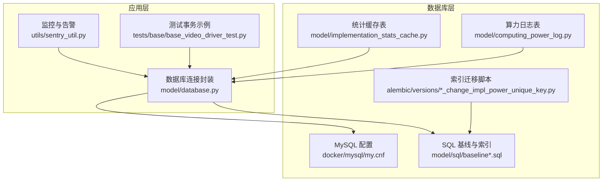
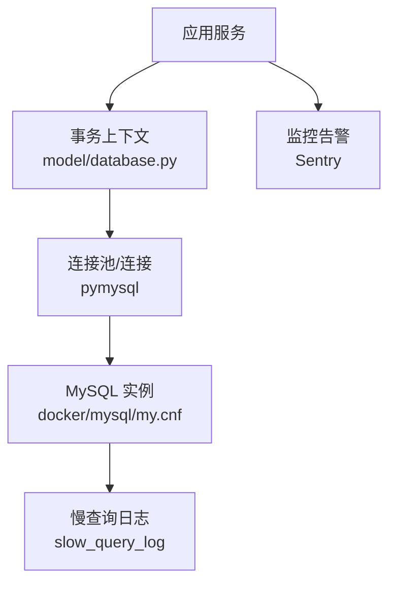
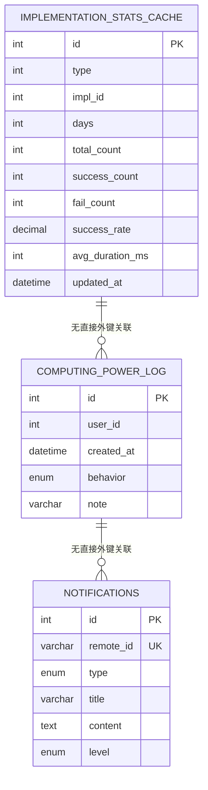
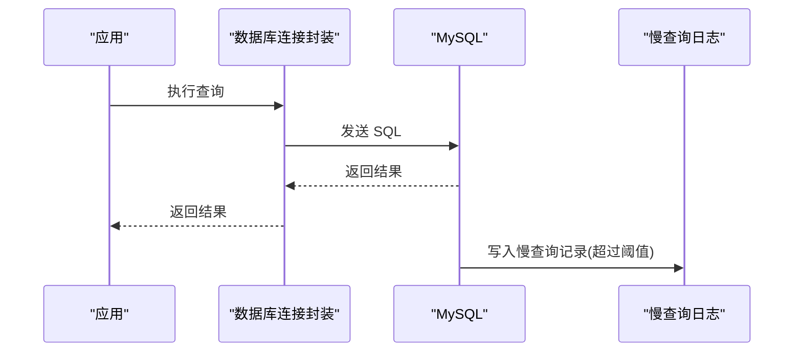
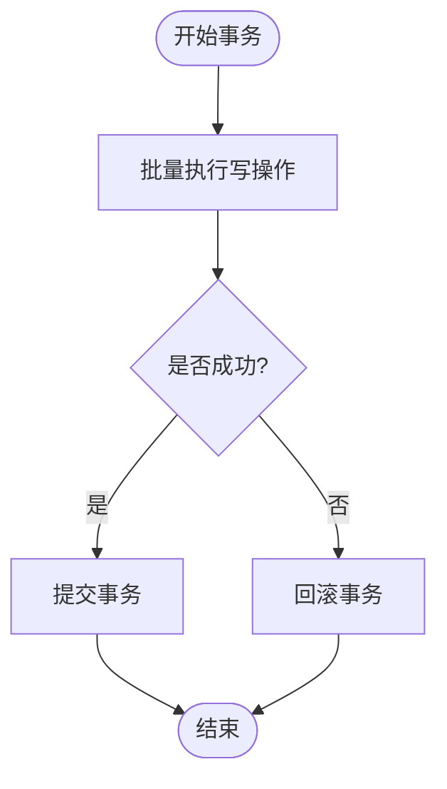
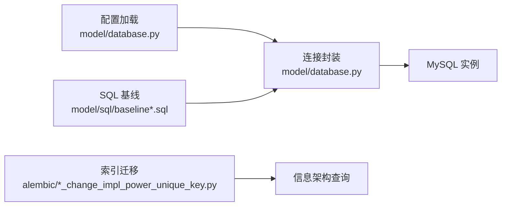

# 数据库性能优化

<cite>
**本文引用的文件**
- [docker/mysql/my.cnf](file://docker/mysql/my.cnf)
- [model/database.py](file://model/database.py)
- [model/sql/baseline.sql](file://model/sql/baseline.sql)
- [model/sql/baseline_with_db.sql](file://model/sql/baseline_with_db.sql)
- [alembic/versions/20260323_change_impl_power_unique_key.py](file://alembic/versions/20260323_change_impl_power_unique_key.py)
- [model/implementation_stats_cache.py](file://model/implementation_stats_cache.py)
- [model/computing_power_log.py](file://model/computing_power_log.py)
- [.claude/skills/database-migration/SKILL.md](file://.claude/skills/database-migration/SKILL.md)
- [utils/sentry_util.py](file://utils/sentry_util.py)
- [tests/base/base_video_driver_test.py](file://tests/base/base_video_driver_test.py)
</cite>

## 目录
1. [简介](#简介)
2. [项目结构](#项目结构)
3. [核心组件](#核心组件)
4. [架构总览](#架构总览)
5. [详细组件分析](#详细组件分析)
6. [依赖关系分析](#依赖关系分析)
7. [性能考量](#性能考量)
8. [故障排查指南](#故障排查指南)
9. [结论](#结论)
10. [附录](#附录)

## 简介
本文件面向 ZhiJuTong 平台的数据库性能优化，围绕索引设计原则与查询优化策略、慢查询分析方法、数据库连接优化、分片与读写分离实施方案、数据库参数调优、缓存策略与监控告警机制，以及高并发场景下的性能保障措施进行系统化梳理。文档结合仓库中现有数据库配置、迁移脚本、SQL 基线与连接封装等代码，给出可落地的优化建议与最佳实践。

## 项目结构
与数据库性能优化直接相关的关键目录与文件如下：
- 数据库配置与容器化：docker/mysql/my.cnf
- 数据库连接封装与事务：model/database.py
- SQL 基线与索引定义：model/sql/baseline*.sql
- 索引变更迁移：alembic/versions/*_change_impl_power_unique_key.py
- 统计缓存表与复合索引：model/implementation_stats_cache.py
- 计算算力日志与多字段索引：model/computing_power_log.py
- 数据库迁移技能说明：.claude/skills/database-migration/SKILL.md
- 监控与告警：utils/sentry_util.py
- 测试中的事务与连接示例：tests/base/base_video_driver_test.py

图表来源
- [docker/mysql/my.cnf:1-39](file://docker/mysql/my.cnf#L1-L39)
- [model/database.py:1-176](file://model/database.py#L1-L176)
- [model/sql/baseline.sql:354-379](file://model/sql/baseline.sql#L354-L379)
- [model/sql/baseline_with_db.sql:353-379](file://model/sql/baseline_with_db.sql#L353-L379)
- [alembic/versions/20260323_change_impl_power_unique_key.py:42-137](file://alembic/versions/20260323_change_impl_power_unique_key.py#L42-L137)
- [model/implementation_stats_cache.py:124-141](file://model/implementation_stats_cache.py#L124-L141)
- [model/computing_power_log.py:205-236](file://model/computing_power_log.py#L205-L236)
- [utils/sentry_util.py:162-202](file://utils/sentry_util.py#L162-L202)
- [tests/base/base_video_driver_test.py:37-69](file://tests/base/base_video_driver_test.py#L37-L69)

章节来源
- [docker/mysql/my.cnf:1-39](file://docker/mysql/my.cnf#L1-L39)
- [model/database.py:1-176](file://model/database.py#L1-L176)
- [model/sql/baseline.sql:354-379](file://model/sql/baseline.sql#L354-L379)
- [model/sql/baseline_with_db.sql:353-379](file://model/sql/baseline_with_db.sql#L353-L379)
- [alembic/versions/20260323_change_impl_power_unique_key.py:42-137](file://alembic/versions/20260323_change_impl_power_unique_key.py#L42-L137)
- [model/implementation_stats_cache.py:124-141](file://model/implementation_stats_cache.py#L124-L141)
- [model/computing_power_log.py:205-236](file://model/computing_power_log.py#L205-L236)
- [.claude/skills/database-migration/SKILL.md:158-206](file://.claude/skills/database-migration/SKILL.md#L158-L206)
- [utils/sentry_util.py:162-202](file://utils/sentry_util.py#L162-L202)
- [tests/base/base_video_driver_test.py:37-69](file://tests/base/base_video_driver_test.py#L37-L69)

## 核心组件
- 数据库连接与事务封装：提供统一的连接获取、异常处理、自动提交/回滚控制，支持在单个事务中批量执行插入/更新。
- SQL 基线与索引：基线 SQL 定义了多张表及索引，包括计算算力日志表的复合索引、通知表的唯一索引等。
- 索引迁移：通过 Alembic 迁移脚本对表结构进行索引调整，例如将单一唯一索引改为复合唯一索引，并添加普通索引以满足不同查询需求。
- 统计缓存表：采用复合唯一键避免重复统计，减少热点写入冲突。
- 慢查询与监控：启用慢查询日志并结合 Sentry 进行告警与上下文追踪。

章节来源
- [model/database.py:31-91](file://model/database.py#L31-L91)
- [model/sql/baseline.sql:354-379](file://model/sql/baseline.sql#L354-L379)
- [model/sql/baseline_with_db.sql:353-379](file://model/sql/baseline_with_db.sql#L353-L379)
- [alembic/versions/20260323_change_impl_power_unique_key.py:42-137](file://alembic/versions/20260323_change_impl_power_unique_key.py#L42-L137)
- [model/implementation_stats_cache.py:124-141](file://model/implementation_stats_cache.py#L124-L141)

## 架构总览
数据库性能优化涉及“配置—连接—索引—查询—监控”全链路。下图展示了应用层与数据库层的交互关系及关键优化点。

图表来源
- [model/database.py:31-91](file://model/database.py#L31-L91)
- [docker/mysql/my.cnf:25-28](file://docker/mysql/my.cnf#L25-L28)
- [utils/sentry_util.py:162-202](file://utils/sentry_util.py#L162-L202)

## 详细组件分析

### 索引设计原则与应用场景
- 复合索引
  - 计算算力日志表定义了多个复合索引，覆盖常用查询模式（如按用户+时间、行为+时间等），提升范围扫描与排序效率。
  - 参考路径：[model/sql/baseline.sql:366-368](file://model/sql/baseline.sql#L366-L368)、[model/sql/baseline_with_db.sql:372-374](file://model/sql/baseline_with_db.sql#L372-L374)
- 唯一索引
  - 通知表定义了唯一索引，保证业务去重；统计缓存表使用复合唯一键，避免重复统计写入。
  - 参考路径：[model/sql/baseline.sql](file://model/sql/baseline.sql#L353)、[model/implementation_stats_cache.py](file://model/implementation_stats_cache.py#L139)
- 全文索引
  - 当前仓库未发现显式全文索引定义。若存在大文本检索需求，可在迁移脚本中添加全文索引并同步更新模型文件。
  - 参考路径：[alembic/versions/20260323_change_impl_power_unique_key.py:160-166](file://alembic/versions/20260323_change_impl_power_unique_key.py#L160-L166)、[.claude/skills/database-migration/SKILL.md:158-206](file://.claude/skills/database-migration/SKILL.md#L158-L206)

图表来源
- [model/sql/baseline.sql:354-379](file://model/sql/baseline.sql#L354-L379)
- [model/sql/baseline_with_db.sql:353-379](file://model/sql/baseline_with_db.sql#L353-L379)
- [model/implementation_stats_cache.py:124-141](file://model/implementation_stats_cache.py#L124-L141)

章节来源
- [model/sql/baseline.sql:354-379](file://model/sql/baseline.sql#L354-L379)
- [model/sql/baseline_with_db.sql:353-379](file://model/sql/baseline_with_db.sql#L353-L379)
- [model/implementation_stats_cache.py:124-141](file://model/implementation_stats_cache.py#L124-L141)
- [alembic/versions/20260323_change_impl_power_unique_key.py:42-137](file://alembic/versions/20260323_change_impl_power_unique_key.py#L42-L137)
- [.claude/skills/database-migration/SKILL.md:158-206](file://.claude/skills/database-migration/SKILL.md#L158-L206)

### 查询优化策略
- 利用现有复合索引
  - 计算算力日志表的复合索引可支撑按用户+时间、行为+时间等常见查询，避免全表扫描。
  - 参考路径：[model/sql/baseline.sql:366-368](file://model/sql/baseline.sql#L366-L368)
- 避免选择性差的过滤条件
  - 对低选择性的列（如枚举字段）进行过滤时，应配合高选择性的列构建复合索引。
  - 参考路径：[model/sql/baseline_with_db.sql:372-374](file://model/sql/baseline_with_db.sql#L372-L374)
- 批量写入与去重
  - 统计缓存表使用复合唯一键与“ON DUPLICATE KEY UPDATE”，降低重复写入成本。
  - 参考路径：[model/implementation_stats_cache.py:41-52](file://model/implementation_stats_cache.py#L41-L52)

章节来源
- [model/sql/baseline.sql:366-368](file://model/sql/baseline.sql#L366-L368)
- [model/sql/baseline_with_db.sql:372-374](file://model/sql/baseline_with_db.sql#L372-L374)
- [model/implementation_stats_cache.py:41-52](file://model/implementation_stats_cache.py#L41-L52)

### 慢查询分析方法
- 启用慢查询日志
  - 在 MySQL 配置中开启慢查询日志并设置阈值，便于定位慢查询。
  - 参考路径：[docker/mysql/my.cnf:25-28](file://docker/mysql/my.cnf#L25-L28)
- 结合执行计划
  - 使用 EXPLAIN 分析 SQL 执行计划，关注是否使用索引、是否发生临时表与文件排序。
  - 参考路径：[model/computing_power_log.py:205-218](file://model/computing_power_log.py#L205-L218)
- 监控与告警
  - 通过 Sentry 记录慢查询与异常上下文，辅助定位问题根因。
  - 参考路径：[utils/sentry_util.py:162-202](file://utils/sentry_util.py#L162-L202)

图表来源
- [model/database.py:62-91](file://model/database.py#L62-L91)
- [docker/mysql/my.cnf:25-28](file://docker/mysql/my.cnf#L25-L28)

章节来源
- [docker/mysql/my.cnf:25-28](file://docker/mysql/my.cnf#L25-L28)
- [model/computing_power_log.py:205-218](file://model/computing_power_log.py#L205-L218)
- [utils/sentry_util.py:162-202](file://utils/sentry_util.py#L162-L202)

### 数据库连接优化
- 连接池配置
  - 通过统一的连接封装与环境变量覆盖，确保连接参数可配置；生产环境建议结合连接池中间件（如 PyMySQL 的连接池或应用层连接池）进一步优化。
  - 参考路径：[model/database.py:13-28](file://model/database.py#L13-L28)
- 事务优化
  - 将相关写操作放入同一事务中，减少锁竞争与提交次数；异常时自动回滚，保证一致性。
  - 参考路径：[model/database.py:136-144](file://model/database.py#L136-L144)、[tests/base/base_video_driver_test.py:52-69](file://tests/base/base_video_driver_test.py#L52-L69)
- 批处理
  - 对批量插入/更新使用参数化语句，减少网络往返与解析开销。
  - 参考路径：[model/implementation_stats_cache.py:41-52](file://model/implementation_stats_cache.py#L41-L52)

图表来源
- [model/database.py:136-144](file://model/database.py#L136-L144)
- [tests/base/base_video_driver_test.py:52-69](file://tests/base/base_video_driver_test.py#L52-L69)

章节来源
- [model/database.py:13-28](file://model/database.py#L13-L28)
- [model/database.py:136-144](file://model/database.py#L136-L144)
- [model/implementation_stats_cache.py:41-52](file://model/implementation_stats_cache.py#L41-L52)
- [tests/base/base_video_driver_test.py:52-69](file://tests/base/base_video_driver_test.py#L52-L69)

### 数据分片与读写分离
- 分片策略
  - 用户维度分片：按 user_id 哈希或范围分片，将不同用户的数据分布到不同库表，降低热点。
  - 时间维度分片：对日志类表按月份/季度切分，提升归档与清理效率。
- 读写分离
  - 主库负责写入（事务），从库负责读取（报表/查询），通过路由中间件或 ORM 层配置实现。
  - 参考现有索引与查询模式，优先将只读查询迁移到从库，避免阻塞主库。
- 迁移与一致性
  - 使用迁移脚本逐步引入分片键与新索引，保持向后兼容；写入时确保幂等与补偿机制。

[本节为概念性方案，不直接分析具体文件，故无章节来源]

### 数据库参数调优
- 连接与缓冲
  - 最大连接数、表打开缓存、Innodb 缓冲池大小等参数需根据实例规格与负载调优。
  - 参考路径：[docker/mysql/my.cnf:16-23](file://docker/mysql/my.cnf#L16-L23)
- 慢查询阈值
  - 合理设置 long_query_time，平衡可观测性与日志开销。
  - 参考路径：[docker/mysql/my.cnf](file://docker/mysql/my.cnf#L28)
- SQL 模式
  - 根据业务需求调整 sql_mode，兼顾兼容性与数据完整性。
  - 参考路径：[docker/mysql/my.cnf](file://docker/mysql/my.cnf#L14)

章节来源
- [docker/mysql/my.cnf:14-28](file://docker/mysql/my.cnf#L14-L28)

### 缓存策略
- 应用层缓存
  - 对热点查询结果进行短期缓存，降低数据库压力；注意缓存失效与一致性。
  - 参考路径：[model/implementation_stats_cache.py:124-141](file://model/implementation_stats_cache.py#L124-L141)
- 统计缓存表
  - 使用复合唯一键与去重更新，减少重复统计写入，提高写入吞吐。
  - 参考路径：[model/implementation_stats_cache.py:41-52](file://model/implementation_stats_cache.py#L41-L52)

章节来源
- [model/implementation_stats_cache.py:124-141](file://model/implementation_stats_cache.py#L124-L141)
- [model/implementation_stats_cache.py:41-52](file://model/implementation_stats_cache.py#L41-L52)

### 监控告警机制
- 慢查询与异常上报
  - 通过 Sentry 记录慢查询与异常上下文，便于快速定位与复现。
  - 参考路径：[utils/sentry_util.py:162-202](file://utils/sentry_util.py#L162-L202)
- 告警分级
  - 按错误等级与标签分类，区分紧急与一般问题，避免告警风暴。

章节来源
- [utils/sentry_util.py:162-202](file://utils/sentry_util.py#L162-L202)

## 依赖关系分析
- 连接封装依赖配置加载与环境变量覆盖，确保运行时参数可调。
- 索引迁移脚本依赖 Alembic 与信息架构表，动态判断索引是否存在并执行创建/删除。
- SQL 基线定义了表结构与索引，为查询优化提供基础。

图表来源
- [model/database.py:13-28](file://model/database.py#L13-L28)
- [alembic/versions/20260323_change_impl_power_unique_key.py:54-82](file://alembic/versions/20260323_change_impl_power_unique_key.py#L54-L82)
- [model/sql/baseline.sql:354-379](file://model/sql/baseline.sql#L354-L379)

章节来源
- [model/database.py:13-28](file://model/database.py#L13-L28)
- [alembic/versions/20260323_change_impl_power_unique_key.py:54-82](file://alembic/versions/20260323_change_impl_power_unique_key.py#L54-L82)
- [model/sql/baseline.sql:354-379](file://model/sql/baseline.sql#L354-L379)

## 性能考量
- 索引选择性与覆盖性：优先为高选择性列建立索引，并尽量让查询走覆盖索引，减少回表。
- 批量写入与去重：使用复合唯一键与“ON DUPLICATE KEY UPDATE”降低重复写入成本。
- 事务粒度：将相关写操作合并到单事务，减少锁竞争；异常时及时回滚。
- 慢查询治理：结合慢查询日志与执行计划，持续优化热点查询与索引。
- 参数调优：根据实例规格与负载调整连接数、缓冲区与慢查询阈值。

[本节提供通用指导，不直接分析具体文件，故无章节来源]

## 故障排查指南
- 连接失败/超时
  - 检查连接封装中的主机、端口、用户名、密码与字符集配置，确认环境变量覆盖生效。
  - 参考路径：[model/database.py:13-28](file://model/database.py#L13-L28)
- 事务未提交/回滚
  - 确认事务上下文是否正确提交或回滚，异常时应触发回滚。
  - 参考路径：[model/database.py:136-144](file://model/database.py#L136-L144)、[tests/base/base_video_driver_test.py:52-69](file://tests/base/base_video_driver_test.py#L52-L69)
- 慢查询定位
  - 查看慢查询日志文件，结合 EXPLAIN 分析执行计划，针对性补充索引。
  - 参考路径：[docker/mysql/my.cnf:25-28](file://docker/mysql/my.cnf#L25-L28)、[model/computing_power_log.py:205-218](file://model/computing_power_log.py#L205-L218)
- 告警与上下文
  - 通过 Sentry 查看告警详情与上下文，快速定位问题根因。
  - 参考路径：[utils/sentry_util.py:162-202](file://utils/sentry_util.py#L162-L202)

章节来源
- [model/database.py:13-28](file://model/database.py#L13-L28)
- [model/database.py:136-144](file://model/database.py#L136-L144)
- [tests/base/base_video_driver_test.py:52-69](file://tests/base/base_video_driver_test.py#L52-L69)
- [docker/mysql/my.cnf:25-28](file://docker/mysql/my.cnf#L25-L28)
- [model/computing_power_log.py:205-218](file://model/computing_power_log.py#L205-L218)
- [utils/sentry_util.py:162-202](file://utils/sentry_util.py#L162-L202)

## 结论
通过对现有数据库配置、连接封装、SQL 基线与索引迁移脚本的分析，ZhiJuTong 平台已具备良好的索引与事务基础。建议在此基础上进一步完善慢查询治理、连接池与批处理策略、缓存与监控体系，并在高并发场景下推进分片与读写分离，持续优化数据库整体性能与稳定性。

[本节为总结性内容，不直接分析具体文件，故无章节来源]

## 附录
- 数据库迁移最佳实践
  - 迁移脚本中添加/删除索引时，需先检查是否存在并记录日志，确保幂等。
  - 参考路径：[alembic/versions/20260323_change_impl_power_unique_key.py:42-137](file://alembic/versions/20260323_change_impl_power_unique_key.py#L42-L137)、[.claude/skills/database-migration/SKILL.md:158-206](file://.claude/skills/database-migration/SKILL.md#L158-L206)

章节来源
- [alembic/versions/20260323_change_impl_power_unique_key.py:42-137](file://alembic/versions/20260323_change_impl_power_unique_key.py#L42-L137)
- [.claude/skills/database-migration/SKILL.md:158-206](file://.claude/skills/database-migration/SKILL.md#L158-L206)