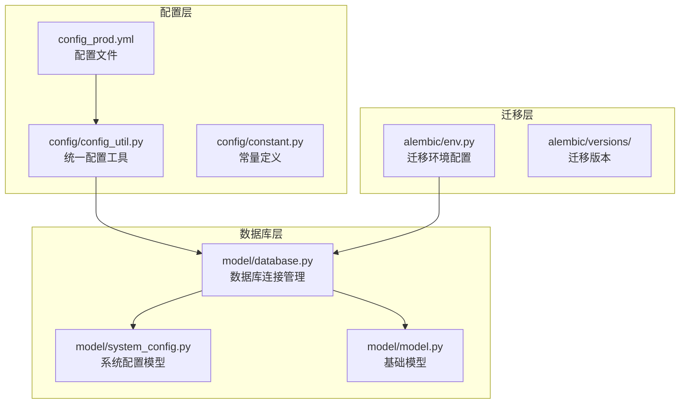
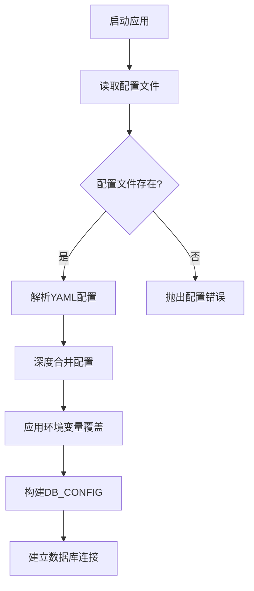
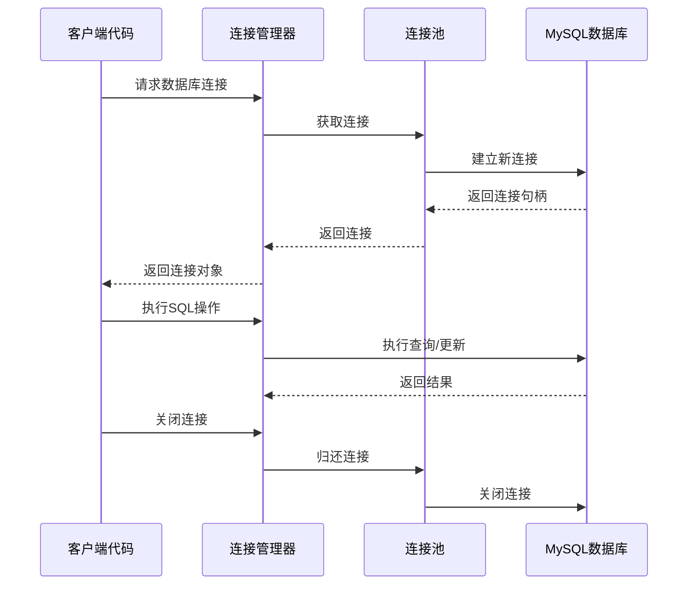
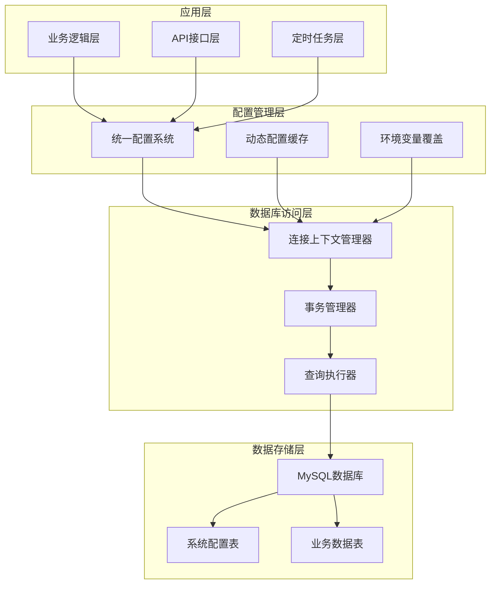
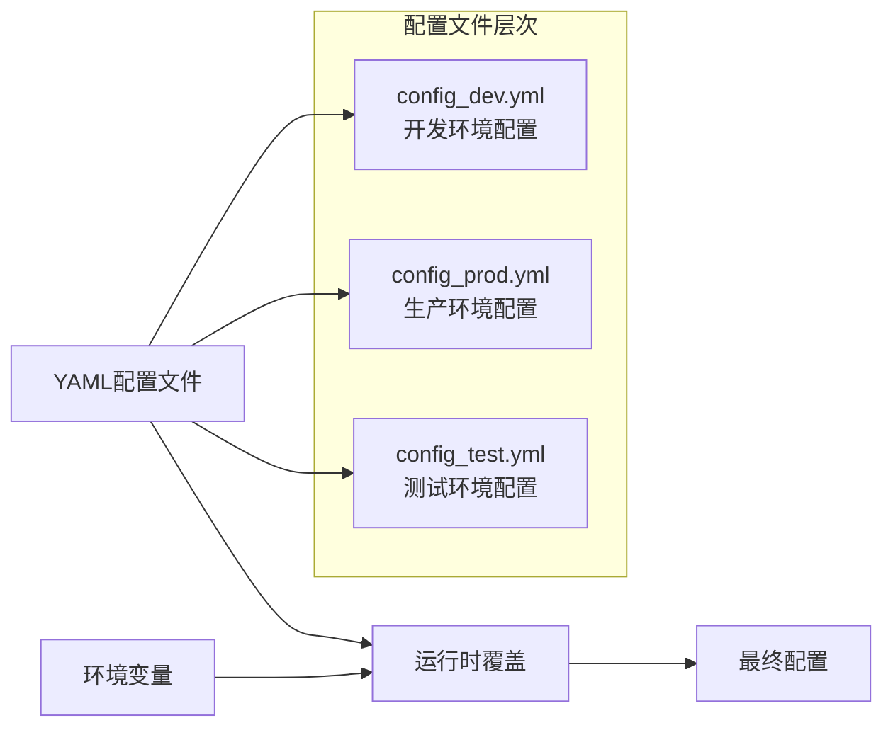
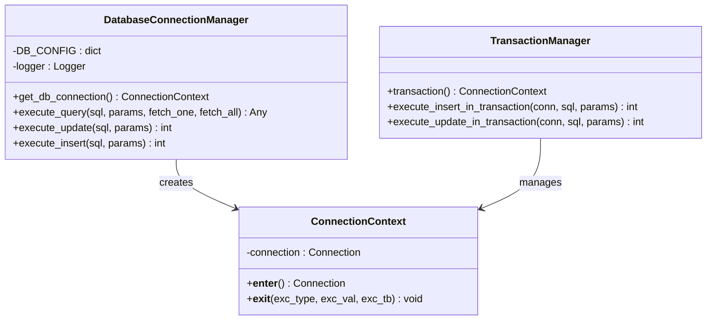
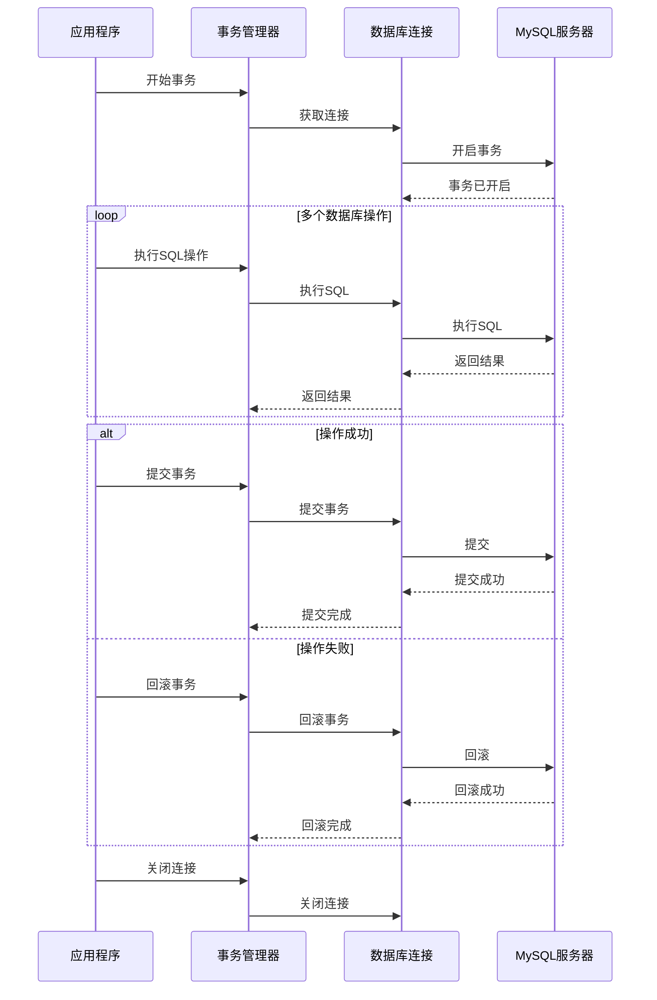
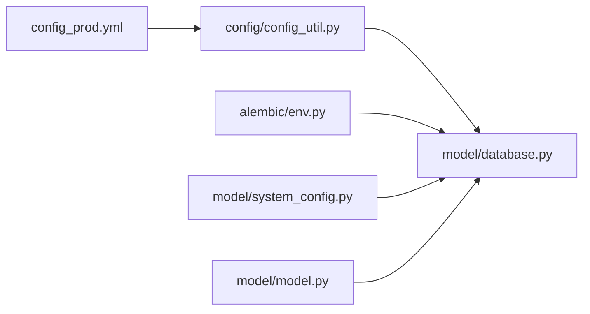
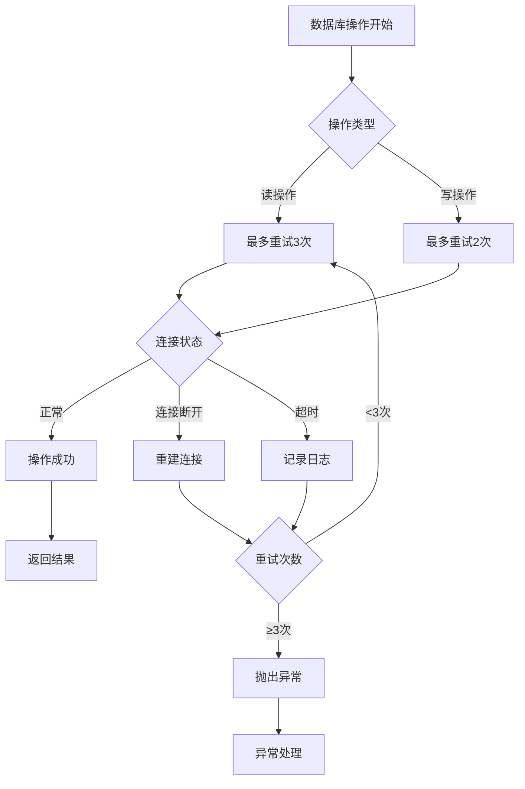

# 数据库架构设计

<cite>
**本文档引用的文件**
- [model/database.py](file://model/database.py)
- [config/config_util.py](file://config/config_util.py)
- [alembic/env.py](file://alembic/env.py)
- [config_prod.yml](file://config_prod.yml)
- [requirements.txt](file://requirements.txt)
- [model/system_config.py](file://model/system_config.py)
- [model/model.py](file://model/model.py)
</cite>

## 目录
1. [引言](#引言)
2. [项目结构](#项目结构)
3. [核心组件](#核心组件)
4. [架构概览](#架构概览)
5. [详细组件分析](#详细组件分析)
6. [依赖关系分析](#依赖关系分析)
7. [性能考虑](#性能考虑)
8. [故障排除指南](#故障排除指南)
9. [结论](#结论)

## 引言

本文档为ZhiJuTong平台的数据库架构设计文档，详细描述了数据库连接配置机制、连接上下文管理器实现原理、配置层次结构以及最佳实践。该平台采用Python + MySQL的技术栈，通过统一配置系统集成数据库连接配置，并提供了完整的连接池管理和事务处理机制。

## 项目结构

ZhiJuTong平台的数据库相关文件组织结构如下：



**图表来源**
- [model/database.py:1-177](file://model/database.py#L1-L177)
- [config/config_util.py:1-433](file://config/config_util.py#L1-L433)
- [alembic/env.py:1-92](file://alembic/env.py#L1-L92)

**章节来源**
- [model/database.py:1-177](file://model/database.py#L1-L177)
- [config/config_util.py:75-137](file://config/config_util.py#L75-L137)
- [alembic/env.py:28-40](file://alembic/env.py#L28-L40)

## 核心组件

### 数据库连接配置系统

平台采用统一配置系统来管理数据库连接配置，支持配置文件和环境变量的双重覆盖机制。

#### 配置加载流程



**图表来源**
- [config/config_util.py:75-137](file://config/config_util.py#L75-L137)
- [model/database.py:12-28](file://model/database.py#L12-L28)

#### 环境变量覆盖策略

| 环境变量 | 配置键 | 默认值 | 用途 |
|---------|--------|--------|------|
| DB_HOST | database.host | localhost | 数据库主机地址 |
| DB_PORT | database.port | 3306 | 数据库端口号 |
| DB_USER | database.user | root | 数据库用户名 |
| DB_PASSWORD | database.password | 空 | 数据库密码 |
| DB_NAME | database.database | 测试数据库 | 数据库名称 |

**章节来源**
- [model/database.py:19-24](file://model/database.py#L19-L24)
- [config_prod.yml:41-47](file://config_prod.yml#L41-L47)

### 连接上下文管理器

平台实现了完整的数据库连接上下文管理器，确保连接的正确创建、使用和清理。

#### 连接生命周期管理



**图表来源**
- [model/database.py:31-60](file://model/database.py#L31-L60)

**章节来源**
- [model/database.py:31-60](file://model/database.py#L31-L60)

## 架构概览

### 整体架构设计



**图表来源**
- [config/config_util.py:254-330](file://config/config_util.py#L254-L330)
- [model/database.py:122-144](file://model/database.py#L122-L144)

### 数据库连接池管理

平台采用pymysql驱动程序提供的连接池机制，通过上下文管理器确保连接的生命周期管理。

#### 连接池配置要点

- **字符集设置**: 默认使用utf8mb4字符集
- **游标类型**: 使用DictCursor返回字典格式结果
- **自动提交**: 默认关闭自动提交，需要手动控制事务
- **连接超时**: 通过环境变量配置连接超时时间

**章节来源**
- [model/database.py:43-52](file://model/database.py#L43-L52)
- [requirements.txt:13](file://requirements.txt#L13)

## 详细组件分析

### 统一配置系统

#### 配置层次结构



**图表来源**
- [config/config_util.py:207-241](file://config/config_util.py#L207-L241)
- [config/config_util.py:139-175](file://config/config_util.py#L139-L175)

#### 动态配置机制

平台实现了数据库优先的动态配置系统，支持配置的热更新和缓存机制。

##### 配置优先级规则

1. **数据库配置** (最高优先级)
2. **环境变量覆盖**
3. **YAML配置文件** (最低优先级)

##### 缓存策略

- **缓存键**: `{环境}:{配置键}`
- **缓存时长**: 30秒
- **缓存失效**: 自动过期和手动失效

**章节来源**
- [config/config_util.py:254-330](file://config/config_util.py#L254-L330)
- [config/config_util.py:407-433](file://config/config_util.py#L407-L433)

### 数据库连接上下文管理器

#### 连接管理器实现



**图表来源**
- [model/database.py:31-177](file://model/database.py#L31-L177)

#### 事务处理机制

平台提供了完整的事务处理机制，支持多语句原子性操作。

##### 事务执行流程



**图表来源**
- [model/database.py:122-144](file://model/database.py#L122-L144)

**章节来源**
- [model/database.py:122-177](file://model/database.py#L122-L177)

### 数据库迁移系统

#### Alembic迁移配置

平台使用Alembic进行数据库迁移管理，通过统一的配置系统获取数据库连接信息。

##### 迁移配置流程

```mermaid
flowchart TD
A[Alembic启动] --> B[导入DB_CONFIG]
B --> C[构建数据库URL]
C --> D[配置迁移环境]
D --> E[离线/在线模式]
E --> F[执行迁移]
subgraph "数据库URL构建"
G[pymysql驱动]
H[用户名:密码@主机:端口/数据库]
I[charset=utf8mb4]
end
C --> G
C --> H
C --> I
```

**图表来源**
- [alembic/env.py:28-40](file://alembic/env.py#L28-L40)
- [alembic/env.py:63-92](file://alembic/env.py#L63-L92)

**章节来源**
- [alembic/env.py:1-92](file://alembic/env.py#L1-L92)

## 依赖关系分析

### 外部依赖关系

```mermaid
graph TB
subgraph "核心依赖"
A[PyMySQL>=1.1.0]
B[SQLAlchemy>=2.0.0]
C[Alembic>=1.13.0]
end
subgraph "应用层依赖"
D[FastAPI==0.111.0]
E[Uvicorn[Standard]==0.30.1]
F[Gunicorn>=21.2.0]
end
subgraph "数据库访问层"
G[PyMySQL连接管理]
H[SQLAlchemy迁移]
I[自定义查询执行器]
end
A --> G
B --> H
C --> H
D --> I
E --> I
F --> I
```

**图表来源**
- [requirements.txt:1-36](file://requirements.txt#L1-L36)

### 内部模块依赖



**图表来源**
- [model/database.py:12-13](file://model/database.py#L12-L13)
- [alembic/env.py:16](file://alembic/env.py#L16)

**章节来源**
- [requirements.txt:13-22](file://requirements.txt#L13-L22)

## 性能考虑

### 连接复用策略

1. **连接池管理**: 使用PyMySQL内置连接池机制
2. **上下文管理**: 通过with语句确保连接及时释放
3. **连接复用**: 同一请求内的多次操作共享同一连接

### 超时设置建议

| 配置项 | 建议值 | 说明 |
|--------|--------|------|
| 连接超时 | 30秒 | 防止长时间占用连接 |
| 读超时 | 60秒 | 适用于复杂查询 |
| 写超时 | 120秒 | 适用于大事务操作 |
| 连接池大小 | 10-20 | 根据并发需求调整 |

### 错误重试策略



### 监控指标建议

#### 连接池指标

| 指标类型 | 监控项 | 目标值 | 告警阈值 |
|----------|--------|--------|----------|
| 连接使用率 | 连接池使用百分比 | <80% | >90% |
| 连接等待时间 | 平均等待时间 | <100ms | >500ms |
| 连接失败率 | 连接失败次数 | 0% | >1% |
| 事务成功率 | 成功提交的事务 | >99% | <95% |

#### 性能指标

| 指标类型 | 监控项 | 目标值 | 告警阈值 |
|----------|--------|--------|----------|
| 查询响应时间 | P95响应时间 | <500ms | >1000ms |
| 数据库CPU使用率 | CPU使用率 | <70% | >85% |
| 数据库内存使用率 | 内存使用率 | <80% | >90% |
| 锁等待时间 | 平均锁等待 | <10ms | >100ms |

## 故障排除指南

### 常见连接问题

#### 连接超时问题

**症状**: 数据库操作超时异常
**排查步骤**:
1. 检查网络连通性
2. 验证数据库服务状态
3. 查看连接池配置
4. 监控数据库负载情况

**解决方案**:
- 增加连接超时时间
- 优化慢查询SQL
- 调整连接池大小
- 检查防火墙设置

#### 连接池耗尽

**症状**: 获取连接超时或连接池满
**排查步骤**:
1. 检查是否有未关闭的连接
2. 分析长时间运行的事务
3. 监控连接使用情况

**解决方案**:
- 优化事务处理逻辑
- 增加连接池大小
- 实施连接超时回收机制

#### 事务死锁

**症状**: 事务执行过程中出现死锁异常
**排查步骤**:
1. 分析死锁发生的时间点
2. 检查涉及的表和索引
3. 分析事务执行顺序

**解决方案**:
- 重新设计事务执行顺序
- 优化索引设计
- 减少事务持有时间

**章节来源**
- [model/database.py:54-59](file://model/database.py#L54-L59)
- [model/database.py:141-143](file://model/database.py#L141-L143)

### 配置问题诊断

#### 配置加载失败

**症状**: 应用启动时报配置错误
**排查步骤**:
1. 检查配置文件语法
2. 验证配置键的有效性
3. 确认环境变量设置

**解决方案**:
- 修复YAML语法错误
- 验证配置键拼写
- 检查环境变量权限

#### 动态配置不生效

**症状**: 修改数据库配置后未生效
**排查步骤**:
1. 检查缓存是否过期
2. 验证配置键的正确性
3. 确认缓存清理操作

**解决方案**:
- 手动清理配置缓存
- 重启应用服务
- 检查数据库连接权限

## 结论

ZhiJuTong平台的数据库架构设计采用了现代化的配置管理和连接管理机制，通过统一配置系统实现了灵活的配置覆盖策略，通过上下文管理器确保了连接的安全使用，通过事务管理器提供了可靠的事务处理能力。

该架构的主要优势包括：

1. **灵活性**: 支持多层配置覆盖，适应不同部署环境
2. **可靠性**: 完善的连接管理和异常处理机制
3. **可维护性**: 清晰的模块划分和职责分离
4. **可扩展性**: 支持动态配置热更新和连接池优化

建议在生产环境中重点关注连接池配置、监控指标设置和性能优化，以确保系统的稳定性和高性能运行。