# 数据库设计

<cite>
**本文引用的文件**
- [docs/database_migration.md](file://docs/database_migration.md)
- [alembic/env.py](file://alembic/env.py)
- [alembic/versions/20260603_add_email_support.py](file://alembic/versions/20260603_add_email_support.py)
- [tests/base/base_db_test.py](file://tests/base/base_db_test.py)
- [tests/base/db_test_config.py](file://tests/base/db_test_config.py)
- [model/database.py](file://model/database.py)
- [model/migration.py](file://model/migration.py)
- [model/sql/baseline.sql](file://model/sql/baseline.sql)
- [model/sql/baseline_with_db.sql](file://model/sql/baseline_with_db.sql)
- [model/users.py](file://model/users.py)
- [model/ai_tools.py](file://model/ai_tools.py)
- [model/media_file_mapping.py](file://model/media_file_mapping.py)
- [model/agent_tasks.py](file://model/agent_tasks.py)
- [model/chat_sessions.py](file://model/chat_sessions.py)
- [model/computing_power.py](file://model/computing_power.py)
- [model/computing_power_log.py](file://model/computing_power_log.py)
- [model/token_log.py](file://model/token_log.py)
- [model/system_config.py](file://model/system_config.py)
- [model/notifications.py](file://model/notifications.py)
- [model/user_preferences.py](file://model/user_preferences.py)
- [model/daily_checkin.py](file://model/daily_checkin.py)
- [model/vendor.py](file://model/vendor.py)
- [model/vendor_model.py](file://model/vendor_model.py)
- [model/implementation_power.py](file://model/implementation_power.py)
- [model/implementation_power_config.py](file://model/implementation_power_config.py)
- [model/implementation_stats_cache.py](file://model/implementation_stats_cache.py)
- [model/runninghub_slots.py](file://model/runninghub_slots.py)
- [model/grid_image_tasks.py](file://model/grid_image_tasks.py)
- [model/location_multi_angle_tasks.py](file://model/location_multi_angle_tasks.py)
- [model/async_tasks.py](file://model/async_tasks.py)
- [model/skill_definitions.py](file://model/skill_definitions.py)
- [model/agent_verifications.py](file://model/agent_verifications.py)
- [model/verify_codes.py](file://model/verify_codes.py)
- [model/world.py](file://model/world.py)
- [model/script.py](file://model/script.py)
- [model/character.py](file://model/character.py)
- [model/location.py](file://model/location.py)
- [model/props.py](file://model/props.py)
- [model/voice.py](file://model/voice.py)
- [model/ai_audio.py](file://model/ai_audio.py)
- [model/video_workflow.py](file://model/video_workflow.py)
- [model/tasks.py](file://model/tasks.py)
- [model/agent_task_messages.py](file://model/agent_task_messages.py)
- [model/uncalculated_power.py](file://model/uncalculated_power.py)
- [model/uncalculated_token.py](file://model/uncalculated_token.py)
- [model/user_tokens.py](file://model/user_tokens.py)
- [model/login_log.py](file://model/login_log.py)
- [model/payment_orders.py](file://model/payment_orders.py)
</cite>

## 更新摘要
**所做更改**
- 新增邮箱认证功能支持章节，详细说明20260603_add_email_support.py迁移脚本的实现
- 更新用户与鉴权模型部分，增加邮箱字段的详细说明
- 更新数据库迁移管理机制，说明新增邮箱支持的迁移流程
- 新增邮箱认证相关的索引设计原则和查询优化策略

## 目录
1. [简介](#简介)
2. [项目结构](#项目结构)
3. [核心组件](#核心组件)
4. [架构总览](#架构总览)
5. [详细组件分析](#详细组件分析)
6. [邮箱认证功能支持](#邮箱认证功能支持)
7. [依赖分析](#依赖分析)
8. [性能考虑](#性能考虑)
9. [故障排查指南](#故障排查指南)
10. [结论](#结论)
11. [附录](#附录)

## 简介
本文件面向ZhiJuTong平台的数据库设计与实现，围绕用户、AI工具、智能体任务、媒体文件等核心业务实体，系统阐述数据库架构、实体关系模型、ORM模型继承体系、字段与关系映射策略，并深入说明数据库迁移管理机制（Alembic）、索引与查询优化、数据一致性与事务控制、并发控制、备份恢复与数据生命周期管理等主题。文档同时提供可视化图示与流程图，帮助读者快速理解并落地实施。

**最新更新**：平台现已支持邮箱认证功能，通过新增的20260603_add_email_support.py迁移脚本为users和verify_codes表添加了email字段和相关索引，为后续的邮箱登录和验证码验证提供了数据库层面的支持。

## 项目结构
ZhiJuTong采用"SQL基线 + Alembic迁移"的双轨初始化方式：
- SQL基线：通过model/sql/baseline.sql一次性创建所有基础表结构与初始版本标记。
- Alembic迁移：在基线基础上，按时间顺序维护增量迁移脚本，支持升级、降级与版本标记。
- 测试基类：在测试环境中自动检测并初始化数据库，确保每次测试前的数据库状态一致。
- 邮箱认证支持：通过专门的迁移脚本为现有表添加邮箱字段和索引支持。

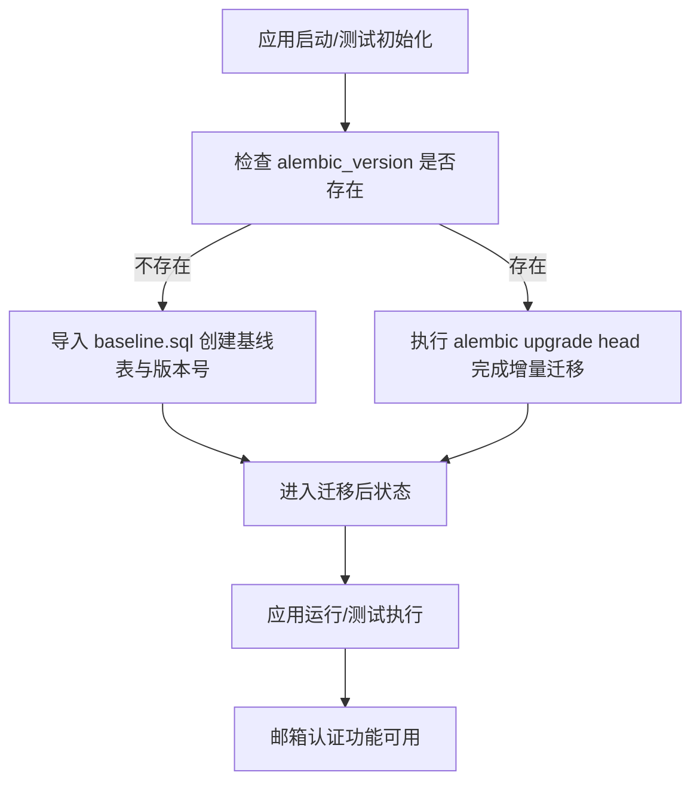

**图表来源**
- [tests/base/base_db_test.py:14-187](file://tests/base/base_db_test.py#L14-L187)
- [model/sql/baseline.sql](file://model/sql/baseline.sql)
- [alembic/env.py:28-40](file://alembic/env.py#L28-L40)
- [alembic/versions/20260603_add_email_support.py:44-140](file://alembic/versions/20260603_add_email_support.py#L44-L140)

**章节来源**
- [docs/database_migration.md:1-95](file://docs/database_migration.md#L1-L95)
- [tests/base/base_db_test.py:14-187](file://tests/base/base_db_test.py#L14-L187)
- [alembic/env.py:1-48](file://alembic/env.py#L1-L48)
- [alembic/versions/20260603_add_email_support.py:1-140](file://alembic/versions/20260603_add_email_support.py#L1-L140)

## 核心组件
本节聚焦于数据库层的核心实体与模型职责，涵盖用户、AI工具、媒体文件、智能体任务、算力与计费、系统配置、通知与偏好、签到与统计、供应商与模型、运行槽位与异步任务、技能与验证、工作流与脚本、角色/地点/道具/语音/音频/视频等。

- 用户与鉴权
  - 用户表：存储用户基本信息、登录态、令牌与偏好，现支持邮箱认证。
  - 登录日志：记录登录行为与设备信息。
  - 用户令牌：外部API令牌与过期控制。
  - 验证码：短信/邮件验证码，支持邮箱认证。
- AI工具与媒体
  - AI工具：工具元数据、CDN映射、尺寸、音频/视频路径等。
  - 媒体文件映射：本地路径哈希、标签、路径与媒体类型关联。
- 智能体任务与会话
  - 智能体任务：任务状态、输入输出、语言、图片/音视频URL、思考字段等。
  - 代理任务消息：任务消息链路。
  - 代理验证：验证记录。
  - 技能定义：技能能力与参数。
- 算力与计费
  - 实施算力与配置：不同站点/供应商/模型的算力配置与分档计费。
  - 统计缓存：实施统计聚合缓存。
  - 未计算算力/令牌：待结算数据。
  - 计费日志与令牌日志：消费明细与计费追踪。
- 系统与运营
  - 系统配置与历史：统一配置与变更历史。
  - 通知：站内通知。
  - 用户偏好：个性化设置。
  - 签到：每日签到。
- 世界与创作
  - 世界、脚本、角色、地点、道具、语音、音频、视频工作流等。
  - 运行槽位：并发资源占用与清理。
  - 异步任务：后台异步处理与重试驱动。
- 供应商与模型
  - 供应商与模型：供应商标识、模型列表、上下文窗口、工具支持等。

**章节来源**
- [model/users.py](file://model/users.py)
- [model/media_file_mapping.py](file://model/media_file_mapping.py)
- [model/ai_tools.py](file://model/ai_tools.py)
- [model/agent_tasks.py](file://model/agent_tasks.py)
- [model/agent_task_messages.py](file://model/agent_task_messages.py)
- [model/agent_verifications.py](file://model/agent_verifications.py)
- [model/skill_definitions.py](file://model/skill_definitions.py)
- [model/implementation_power.py](file://model/implementation_power.py)
- [model/implementation_power_config.py](file://model/implementation_power_config.py)
- [model/implementation_stats_cache.py](file://model/implementation_stats_cache.py)
- [model/uncalculated_power.py](file://model/uncalculated_power.py)
- [model/uncalculated_token.py](file://model/uncalculated_token.py)
- [model/computing_power_log.py](file://model/computing_power_log.py)
- [model/token_log.py](file://model/token_log.py)
- [model/system_config.py](file://model/system_config.py)
- [model/notifications.py](file://model/notifications.py)
- [model/user_preferences.py](file://model/user_preferences.py)
- [model/daily_checkin.py](file://model/daily_checkin.py)
- [model/vendor.py](file://model/vendor.py)
- [model/vendor_model.py](file://model/vendor_model.py)
- [model/runninghub_slots.py](file://model/runninghub_slots.py)
- [model/async_tasks.py](file://model/async_tasks.py)
- [model/world.py](file://model/world.py)
- [model/script.py](file://model/script.py)
- [model/character.py](file://model/character.py)
- [model/location.py](file://model/location.py)
- [model/props.py](file://model/props.py)
- [model/voice.py](file://model/voice.py)
- [model/ai_audio.py](file://model/ai_audio.py)
- [model/video_workflow.py](file://model/video_workflow.py)
- [model/tasks.py](file://model/tasks.py)
- [model/login_log.py](file://model/login_log.py)
- [model/user_tokens.py](file://model/user_tokens.py)
- [model/verify_codes.py](file://model/verify_codes.py)

## 架构总览
下图展示数据库层的整体架构与关键模块交互：应用通过model层ORM访问数据库；迁移通过Alembic管理；测试基类负责初始化与幂等迁移；配置中心提供数据库连接信息；新增邮箱认证功能通过专门的迁移脚本支持。

```mermaid
graph TB
subgraph "应用层"
APP["业务服务与控制器"]
EMAIL["邮箱认证服务"]
end
subgraph "模型层"
ORM["ORM 模型与关系映射"]
MIG["迁移执行模块"]
END
subgraph "迁移层"
ALEMBIC["Alembic 环境配置"]
SCRIPTS["迁移脚本集合"]
EMAIL_SCRIPT["20260603_add_email_support.py"]
end
subgraph "数据库"
MYSQL["MySQL 实例"]
BASE["baseline.sql 基线"]
USERS["users 表"]
VERIFY["verify_codes 表"]
END
APP --> ORM
EMAIL --> EMAIL_SCRIPT
ORM --> MYSQL
MIG --> ALEMBIC
ALEMBIC --> SCRIPTS
SCRIPTS --> EMAIL_SCRIPT
EMAIL_SCRIPT --> USERS
EMAIL_SCRIPT --> VERIFY
BASE --> MYSQL
USERS --> VERIFY
```

**图表来源**
- [alembic/env.py:1-48](file://alembic/env.py#L1-L48)
- [model/migration.py](file://model/migration.py)
- [model/sql/baseline.sql](file://model/sql/baseline.sql)
- [alembic/versions/20260603_add_email_support.py:44-140](file://alembic/versions/20260603_add_email_support.py#L44-L140)

## 详细组件分析

### 用户与鉴权模型
- 用户表：包含用户标识、登录态、扩展字段、国际化与过期控制等，现支持邮箱字段。
- 登录日志：记录登录事件、设备与IP等审计信息。
- 用户令牌：外部API令牌与过期时间。
- 验证码：短信/邮件验证码，支持时效与校验。

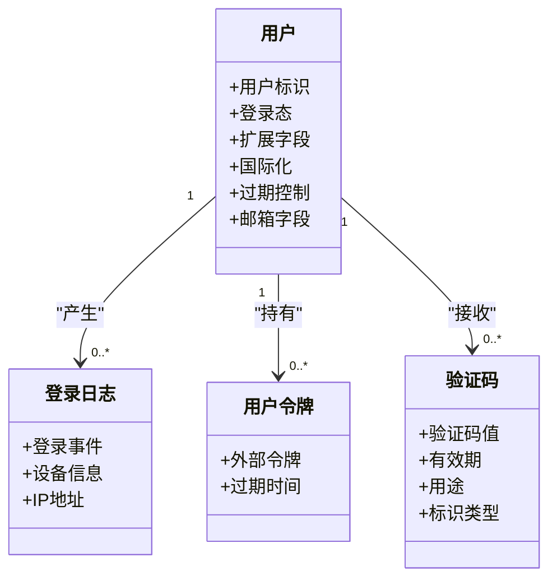

**图表来源**
- [model/users.py](file://model/users.py)
- [model/login_log.py](file://model/login_log.py)
- [model/user_tokens.py](file://model/user_tokens.py)
- [model/verify_codes.py](file://model/verify_codes.py)

**章节来源**
- [model/users.py](file://model/users.py)
- [model/login_log.py](file://model/login_log.py)
- [model/user_tokens.py](file://model/user_tokens.py)
- [model/verify_codes.py](file://model/verify_codes.py)

### AI工具与媒体文件映射
- AI工具：工具元数据、CDN映射、尺寸、音频/视频路径、实现偏好等。
- 媒体文件映射：本地路径哈希、标签、路径与媒体类型关联。

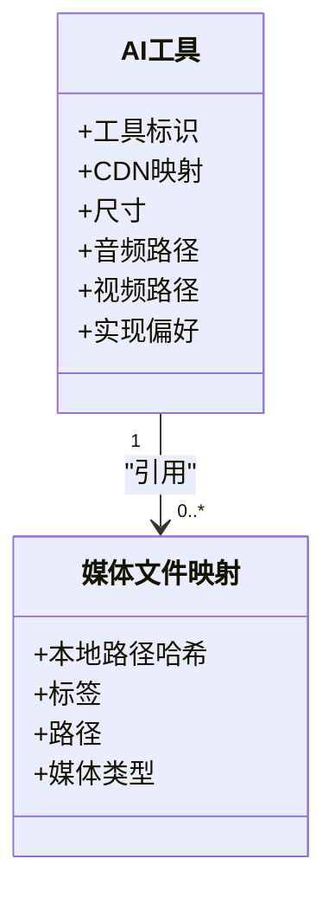

**图表来源**
- [model/ai_tools.py](file://model/ai_tools.py)
- [model/media_file_mapping.py](file://model/media_file_mapping.py)

**章节来源**
- [model/ai_tools.py](file://model/ai_tools.py)
- [model/media_file_mapping.py](file://model/media_file_mapping.py)

### 智能体任务与会话
- 智能体任务：任务状态、输入输出、语言、图片/音视频URL、思考字段等。
- 代理任务消息：任务消息链路。
- 代理验证：验证记录。
- 技能定义：技能能力与参数。

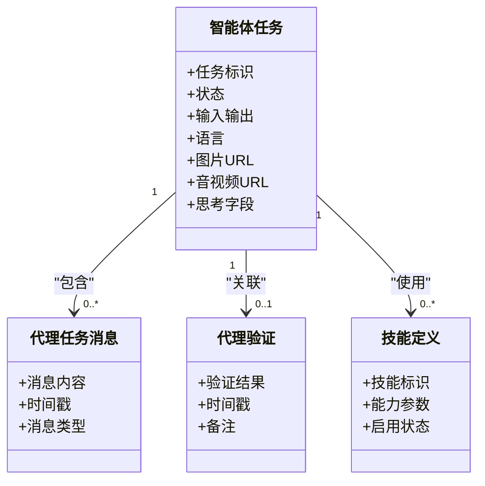

**图表来源**
- [model/agent_tasks.py](file://model/agent_tasks.py)
- [model/agent_task_messages.py](file://model/agent_task_messages.py)
- [model/agent_verifications.py](file://model/agent_verifications.py)
- [model/skill_definitions.py](file://model/skill_definitions.py)

**章节来源**
- [model/agent_tasks.py](file://model/agent_tasks.py)
- [model/agent_task_messages.py](file://model/agent_task_messages.py)
- [model/agent_verifications.py](file://model/agent_verifications.py)
- [model/skill_definitions.py](file://model/skill_definitions.py)

### 算力与计费模型
- 实施算力与配置：不同站点/供应商/模型的算力配置与分档计费。
- 统计缓存：实施统计聚合缓存。
- 未计算算力/令牌：待结算数据。
- 计费日志与令牌日志：消费明细与计费追踪。

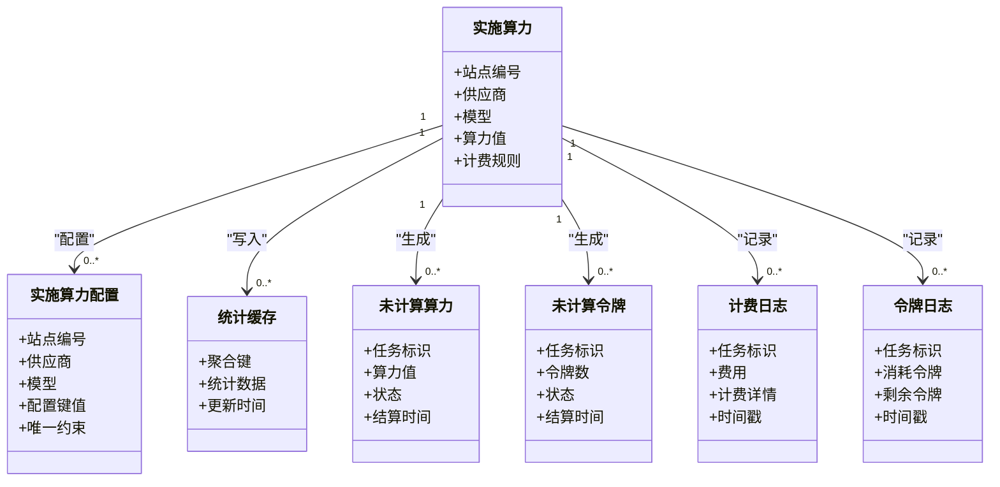

**图表来源**
- [model/implementation_power.py](file://model/implementation_power.py)
- [model/implementation_power_config.py](file://model/implementation_power_config.py)
- [model/implementation_stats_cache.py](file://model/implementation_stats_cache.py)
- [model/uncalculated_power.py](file://model/uncalculated_power.py)
- [model/uncalculated_token.py](file://model/uncalculated_token.py)
- [model/computing_power_log.py](file://model/computing_power_log.py)
- [model/token_log.py](file://model/token_log.py)

**章节来源**
- [model/implementation_power.py](file://model/implementation_power.py)
- [model/implementation_power_config.py](file://model/implementation_power_config.py)
- [model/implementation_stats_cache.py](file://model/implementation_stats_cache.py)
- [model/uncalculated_power.py](file://model/uncalculated_power.py)
- [model/uncalculated_token.py](file://model/uncalculated_token.py)
- [model/computing_power_log.py](file://model/computing_power_log.py)
- [model/token_log.py](file://model/token_log.py)

### 系统配置与运营
- 系统配置与历史：统一配置与变更历史。
- 通知：站内通知。
- 用户偏好：个性化设置。
- 签到：每日签到。

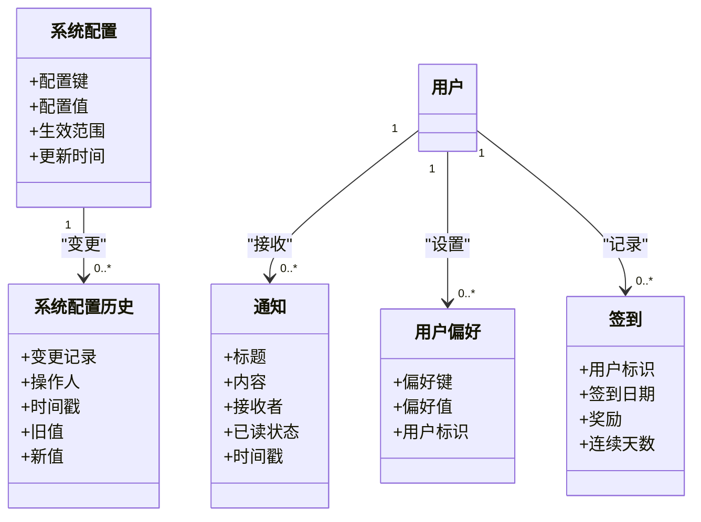

**图表来源**
- [model/system_config.py](file://model/system_config.py)
- [model/system_config_history.py](file://model/system_config_history.py)
- [model/notifications.py](file://model/notifications.py)
- [model/user_preferences.py](file://model/user_preferences.py)
- [model/daily_checkin.py](file://model/daily_checkin.py)

**章节来源**
- [model/system_config.py](file://model/system_config.py)
- [model/system_config_history.py](file://model/system_config_history.py)
- [model/notifications.py](file://model/notifications.py)
- [model/user_preferences.py](file://model/user_preferences.py)
- [model/daily_checkin.py](file://model/daily_checkin.py)

### 供应商与模型
- 供应商与模型：供应商标识、模型列表、上下文窗口、工具支持等。

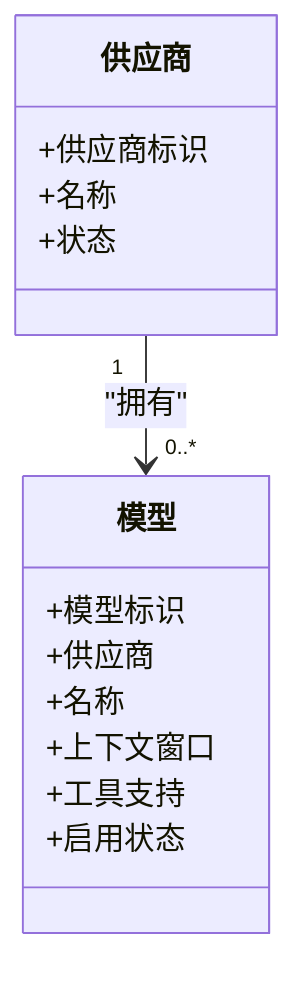

**图表来源**
- [model/vendor.py](file://model/vendor.py)
- [model/vendor_model.py](file://model/vendor_model.py)

**章节来源**
- [model/vendor.py](file://model/vendor.py)
- [model/vendor_model.py](file://model/vendor_model.py)

### 运行槽位与异步任务
- 运行槽位：并发资源占用与清理。
- 异步任务：后台异步处理与重试驱动。

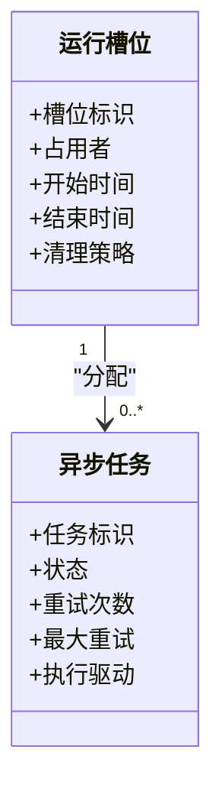

**图表来源**
- [model/runninghub_slots.py](file://model/runninghub_slots.py)
- [model/async_tasks.py](file://model/async_tasks.py)

**章节来源**
- [model/runninghub_slots.py](file://model/runninghub_slots.py)
- [model/async_tasks.py](file://model/async_tasks.py)

### 创作与工作流
- 世界、脚本、角色、地点、道具、语音、音频、视频工作流等。
- 任务与网格图像任务：任务状态与网格图像生成任务。
- 多角度任务：多角度拍摄任务。
- 视频工作流：视频生成与合并流程。

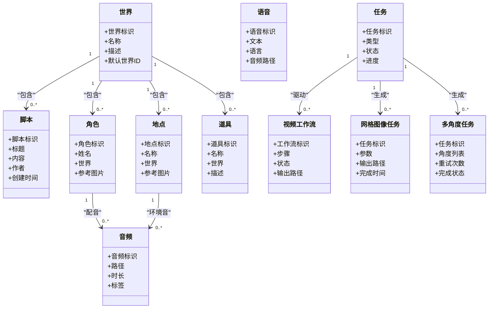

**图表来源**
- [model/world.py](file://model/world.py)
- [model/script.py](file://model/script.py)
- [model/character.py](file://model/character.py)
- [model/location.py](file://model/location.py)
- [model/props.py](file://model/props.py)
- [model/voice.py](file://model/voice.py)
- [model/ai_audio.py](file://model/ai_audio.py)
- [model/video_workflow.py](file://model/video_workflow.py)
- [model/tasks.py](file://model/tasks.py)
- [model/grid_image_tasks.py](file://model/grid_image_tasks.py)
- [model/location_multi_angle_tasks.py](file://model/location_multi_angle_tasks.py)

**章节来源**
- [model/world.py](file://model/world.py)
- [model/script.py](file://model/script.py)
- [model/character.py](file://model/character.py)
- [model/location.py](file://model/location.py)
- [model/props.py](file://model/props.py)
- [model/voice.py](file://model/voice.py)
- [model/ai_audio.py](file://model/ai_audio.py)
- [model/video_workflow.py](file://model/video_workflow.py)
- [model/tasks.py](file://model/tasks.py)
- [model/grid_image_tasks.py](file://model/grid_image_tasks.py)
- [model/location_multi_angle_tasks.py](file://model/location_multi_angle_tasks.py)

## 邮箱认证功能支持

### 迁移脚本实现分析
新增的20260603_add_email_support.py迁移脚本为平台添加了完整的邮箱认证支持，具体实现包括：

- **users表邮箱字段**：向用户表添加email列，字符集为utf8mb4_unicode_ci，长度255，允许为空
- **users表邮箱索引**：创建唯一索引idx_email，确保邮箱地址的唯一性
- **verify_codes表邮箱字段**：向验证码表添加email列，字符集为utf8mb4_0900_ai_ci，长度255，允许为空
- **verify_codes表邮箱+类型索引**：创建复合索引idx_email_type，优化邮箱+类型组合查询

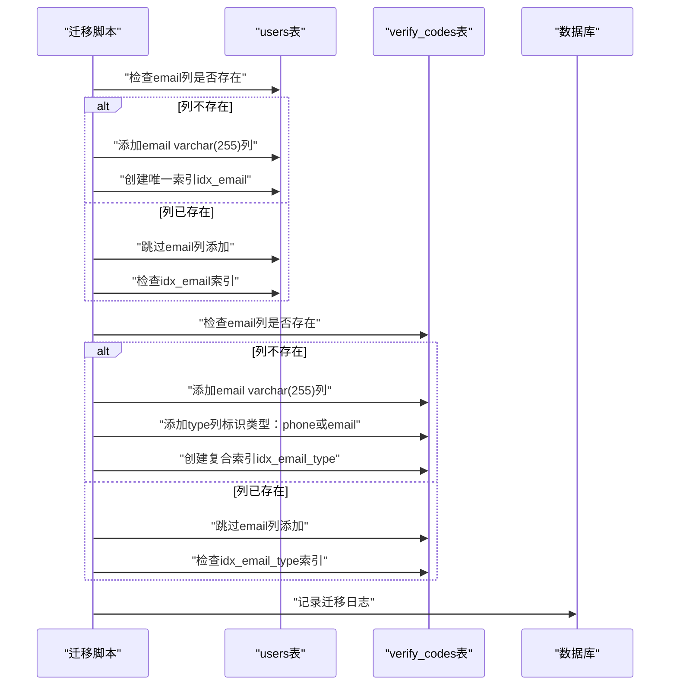

**图表来源**
- [alembic/versions/20260603_add_email_support.py:66-136](file://alembic/versions/20260603_add_email_support.py#L66-L136)

### 邮箱认证索引设计
邮箱认证功能的索引设计遵循以下原则：

- **唯一性约束**：users表的idx_email唯一索引确保每个邮箱地址只能注册一次
- **复合查询优化**：verify_codes表的idx_email_type索引优化邮箱+类型组合查询
- **字符集兼容性**：users表使用utf8mb4_unicode_ci，verify_codes表使用utf8mb4_0900_ai_ci，确保字符集兼容性

### 邮箱认证流程
邮箱认证功能支持完整的邮箱注册、登录和验证码验证流程：

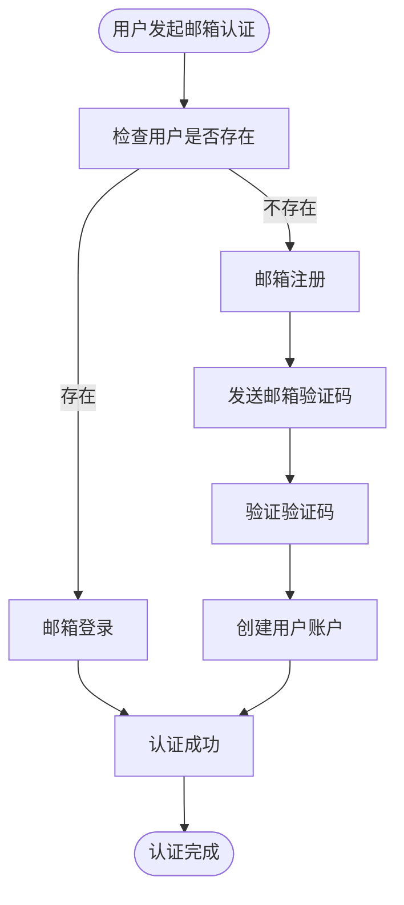

**章节来源**
- [alembic/versions/20260603_add_email_support.py:1-140](file://alembic/versions/20260603_add_email_support.py#L1-L140)

## 依赖分析
- 组件耦合
  - 模型层依赖数据库连接配置（DB_CONFIG），迁移层通过env.py统一构建连接。
  - 测试基类依赖baseline.sql与Alembic，确保初始化与迁移幂等。
  - 邮箱认证功能依赖专门的迁移脚本，确保数据库结构的正确性。
- 外部依赖
  - Alembic：迁移管理。
  - PyMySQL/SQLAlchemy：连接与ORM。
  - MySQL：存储引擎与索引优化。
  - 邮箱服务：SMTP或其他邮件传输服务。

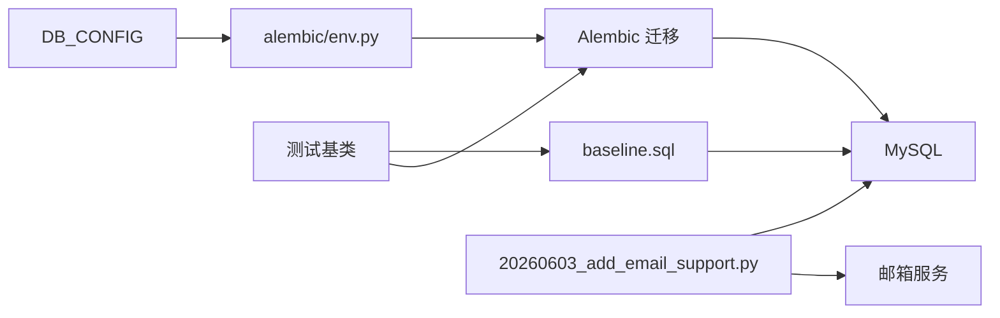

**图表来源**
- [alembic/env.py:16-40](file://alembic/env.py#L16-L40)
- [model/sql/baseline.sql](file://model/sql/baseline.sql)
- [tests/base/base_db_test.py:14-187](file://tests/base/base_db_test.py#L14-L187)
- [alembic/versions/20260603_add_email_support.py:44-140](file://alembic/versions/20260603_add_email_support.py#L44-L140)

**章节来源**
- [alembic/env.py:1-48](file://alembic/env.py#L1-L48)
- [tests/base/base_db_test.py:14-187](file://tests/base/base_db_test.py#L14-L187)
- [alembic/versions/20260603_add_email_support.py:1-140](file://alembic/versions/20260603_add_email_support.py#L1-L140)

## 性能考虑
- 索引与查询
  - 对高频过滤字段建立合适索引，避免全表扫描。
  - 邮箱认证相关的索引设计：users表的idx_email唯一索引，verify_codes表的idx_email_type复合索引。
  - 使用EXPLAIN分析慢查询，定位索引缺失或回表问题。
- 写入优化
  - 批量写入与事务合并，减少锁竞争。
  - 异步结算与统计缓存，降低写放大。
  - 邮箱验证码的批量发送和验证。
- 并发控制
  - 运行槽位与异步任务重试驱动，避免超卖与死锁。
  - 邮箱唯一性的并发控制，防止重复注册。
- 缓存与归档
  - 热点数据放入统计缓存，冷数据归档至历史表。
  - 邮箱认证日志的定期归档。

**章节来源**
- [model/implementation_power_config.py](file://model/implementation_power_config.py)
- [model/implementation_stats_cache.py](file://model/implementation_stats_cache.py)
- [model/implementation_power.py](file://model/implementation_power.py)
- [model/uncalculated_power.py](file://model/uncalculated_power.py)
- [model/uncalculated_token.py](file://model/uncalculated_token.py)
- [alembic/versions/20260603_add_email_support.py:78-136](file://alembic/versions/20260603_add_email_support.py#L78-L136)

## 故障排查指南
- 迁移失败
  - 现象：应用启动时迁移失败直接退出。
  - 排查：查看alembic stdout/stderr，确认权限与连接配置。
  - 处理：在测试环境演练回滚，修复后再升级。
- 邮箱认证异常
  - 现象：邮箱注册或登录失败。
  - 排查：检查users表的idx_email唯一索引是否正常，verify_codes表的idx_email_type索引是否有效。
  - 处理：重新执行20260603_add_email_support.py迁移脚本。
- 测试数据库误删
  - 现象：测试库被清空或删除。
  - 排查：确认数据库名以_test/_unittest结尾，避免生产库误操作。
  - 处理：重新导入baseline.sql并执行增量迁移。
- 并发冲突
  - 现象：运行槽位冲突或任务重复执行。
  - 排查：检查运行槽位占用与异步任务重试策略。
  - 处理：调整并发阈值与重试间隔。

**章节来源**
- [docs/database_migration.md:77-95](file://docs/database_migration.md#L77-L95)
- [tests/base/db_test_config.py:146-163](file://tests/base/db_test_config.py#L146-L163)
- [tests/base/base_db_test.py:59-74](file://tests/base/base_db_test.py#L59-L74)
- [alembic/versions/20260603_add_email_support.py:66-136](file://alembic/versions/20260603_add_email_support.py#L66-L136)

## 结论
ZhiJuTong的数据库设计以"SQL基线 + Alembic迁移"为核心，配合完善的测试基类与幂等迁移流程，确保初始化与演进的稳定性。通过清晰的实体关系模型、合理的索引与查询优化策略、严格的事务与并发控制、以及备份恢复与生命周期管理，平台能够在高并发与复杂业务场景下保持数据一致性与高性能。

**最新进展**：新增的邮箱认证功能通过专门的迁移脚本实现了完整的邮箱支持，包括用户表和验证码表的邮箱字段添加、唯一索引和复合索引的创建，为平台的邮箱登录和验证码验证功能奠定了坚实的数据库基础。

## 附录
- 迁移命令与配置
  - 查看历史、当前版本、升级/降级、创建迁移、标记版本等。
  - Alembic配置与权限要求。
- 基线SQL与增量迁移
  - baseline.sql包含所有基线表与版本号，增量迁移脚本按时间顺序维护。
- 邮箱认证迁移脚本
  - 20260603_add_email_support.py：为users和verify_codes表添加邮箱字段和索引。

**章节来源**
- [docs/database_migration.md:29-95](file://docs/database_migration.md#L29-L95)
- [model/sql/baseline.sql](file://model/sql/baseline.sql)
- [model/sql/baseline_with_db.sql](file://model/sql/baseline_with_db.sql)
- [alembic/versions/20260603_add_email_support.py:1-140](file://alembic/versions/20260603_add_email_support.py#L1-L140)