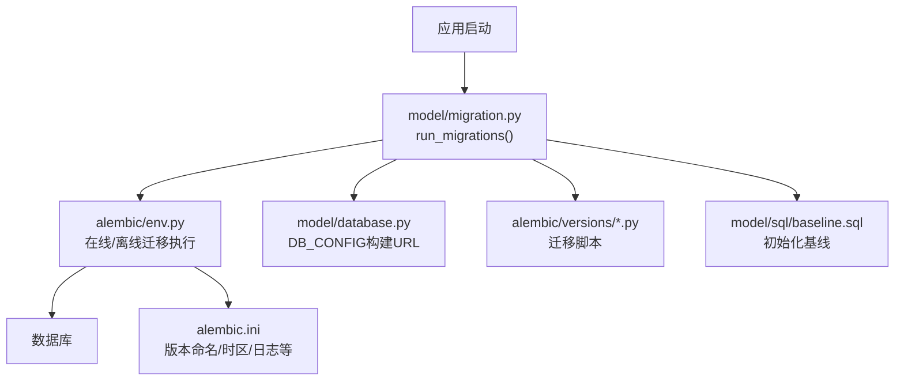
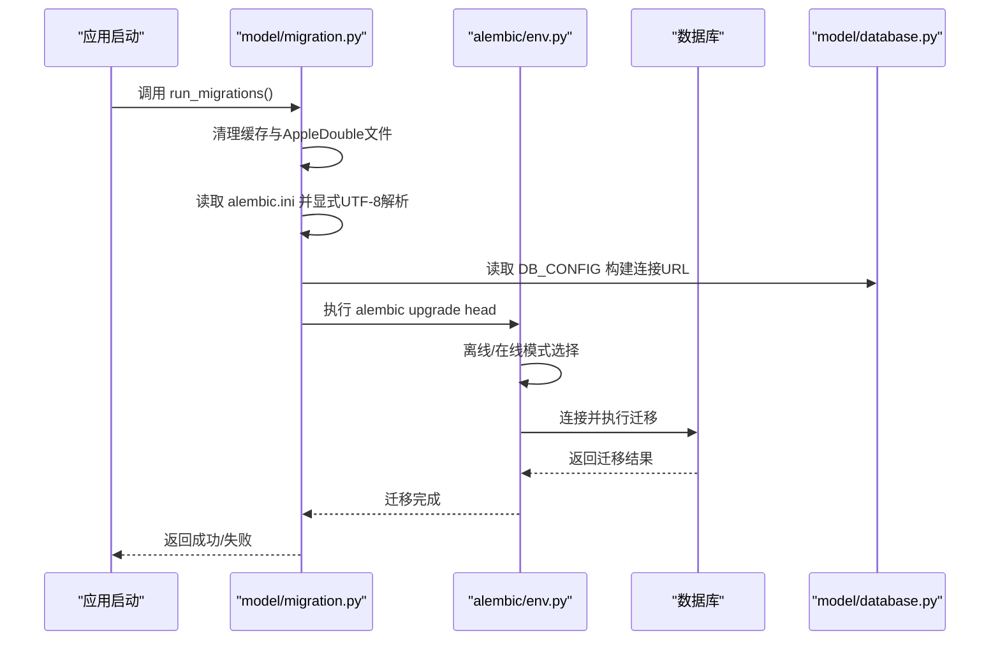
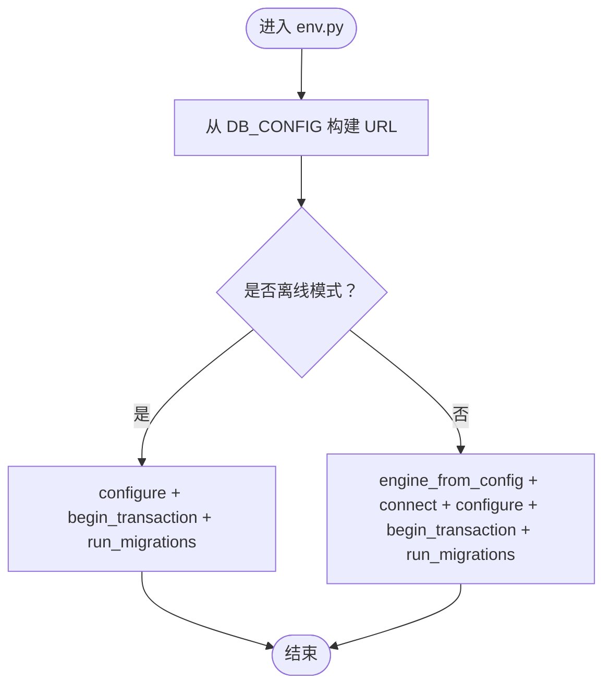
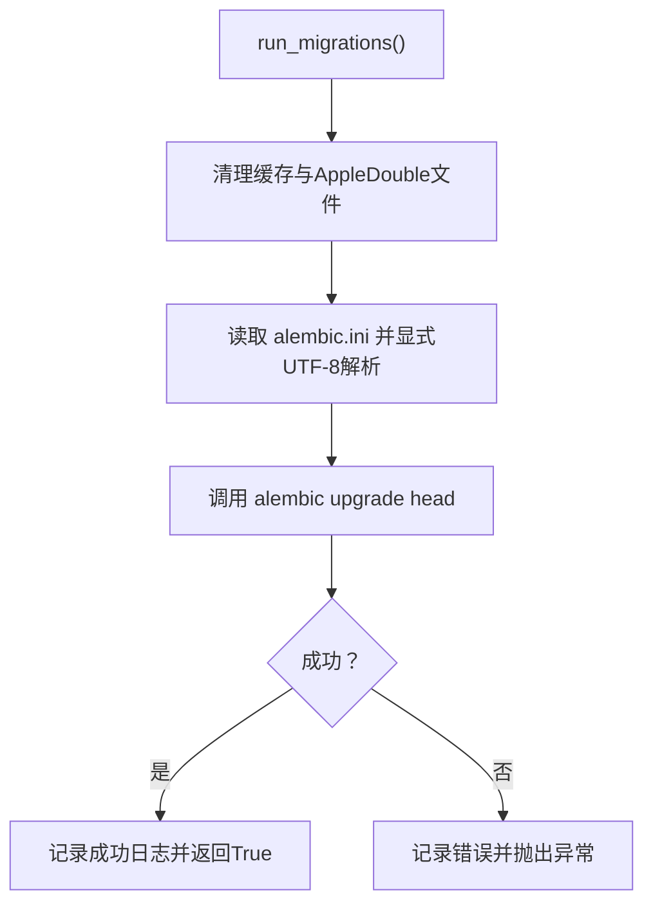
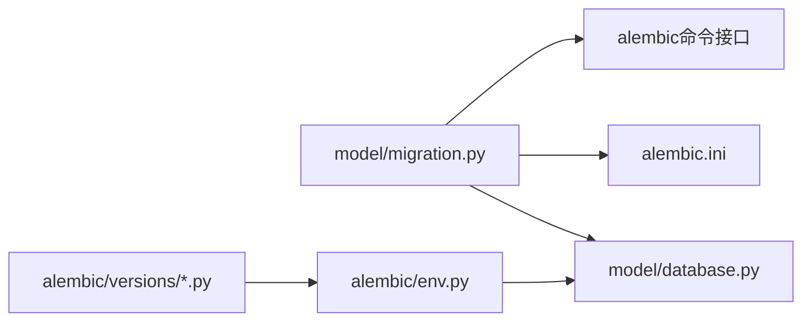

# 数据库迁移管理

<cite>
**本文引用的文件**
- [alembic/env.py](file://alembic/env.py)
- [alembic.ini](file://alembic.ini)
- [model/migration.py](file://model/migration.py)
- [docs/database_migration.md](file://docs/database_migration.md)
- [model/database.py](file://model/database.py)
- [model/sql/baseline.sql](file://model/sql/baseline.sql)
- [config_prod.yml](file://config_prod.yml)
- [config_unit.base.yml](file://config_unit.base.yml)
- [alembic/versions/20260224_69f38f419eb6_create_test_table.py](file://alembic/versions/20260224_69f38f419eb6_create_test_table.py)
- [alembic/versions/20260224_dba3eea917cf_drop_test_table.py](file://alembic/versions/20260224_dba3eea917cf_drop_test_table.py)
</cite>

## 目录
1. [简介](#简介)
2. [项目结构](#项目结构)
3. [核心组件](#核心组件)
4. [架构总览](#架构总览)
5. [详细组件分析](#详细组件分析)
6. [依赖分析](#依赖分析)
7. [性能考虑](#性能考虑)
8. [故障排除指南](#故障排除指南)
9. [结论](#结论)
10. [附录](#附录)

## 简介
本文件面向ZhiJuTong平台的数据库迁移管理，系统性阐述基于Alembic的迁移框架配置与使用方法，涵盖迁移环境设置、版本控制策略、迁移脚本生成与组织、数据库演进策略（表结构变更、索引优化、数据迁移）、最佳实践（回滚策略、测试方法、生产部署流程）、故障排除与数据安全保护。文档同时结合项目中现有的迁移脚本与配置，帮助开发者在不同环境下正确、安全地进行数据库演进。

## 项目结构
ZhiJuTong采用Alembic作为数据库迁移框架，并通过应用层模块在启动时自动执行迁移。关键位置如下：
- 迁移配置与环境：alembic.ini、alembic/env.py
- 迁移脚本目录：alembic/versions/
- 应用侧迁移执行：model/migration.py
- 数据库连接配置：model/database.py
- 基线SQL（初始化已有数据库）：model/sql/baseline.sql
- 配置文件（含alembic配置项）：config_prod.yml、config_unit.base.yml
- 文档：docs/database_migration.md

图表来源
- [model/migration.py:69-98](file://model/migration.py#L69-L98)
- [alembic/env.py:46-91](file://alembic/env.py#L46-L91)
- [alembic.ini:8-28](file://alembic.ini#L8-L28)
- [model/database.py:15-28](file://model/database.py#L15-L28)

章节来源
- [alembic/env.py:1-92](file://alembic/env.py#L1-L92)
- [alembic.ini:1-65](file://alembic.ini#L1-L65)
- [model/migration.py:1-163](file://model/migration.py#L1-L163)
- [docs/database_migration.md:1-95](file://docs/database_migration.md#L1-L95)
- [model/database.py:1-177](file://model/database.py#L1-L177)
- [model/sql/baseline.sql:1-200](file://model/sql/baseline.sql#L1-L200)
- [config_prod.yml:1-194](file://config_prod.yml#L1-L194)
- [config_unit.base.yml:56-59](file://config_unit.base.yml#L56-L59)

## 核心组件
- Alembic环境配置（env.py）
  - 动态从项目配置加载数据库连接参数，构建MySQL连接字符串
  - 支持离线模式（生成SQL脚本）与在线模式（直接连接数据库执行）
  - 日志配置支持从INI文件读取并按需覆盖
- Alembic主配置（alembic.ini）
  - 定义脚本目录、版本文件命名模板、时区、slug截断长度、revision_environment等
  - 日志级别与输出格式配置
- 应用侧迁移执行（model/migration.py）
  - 提供自动迁移、获取当前版本、标记为head等能力
  - 启动时清理字节码缓存与AppleDouble文件，提升跨平台兼容性
  - 通过UTF-8显式读取alembic.ini，避免Windows系统默认编码问题
- 数据库连接配置（model/database.py）
  - 统一从配置文件加载DB_CONFIG，并支持环境变量覆盖
  - 提供连接上下文管理与事务封装
- 基线SQL（model/sql/baseline.sql）
  - 包含初始表结构与alembic_version基线记录，用于初始化已有数据库
- 配置文件（config_prod.yml、config_unit.base.yml）
  - alembic.auto_migrate控制应用启动时是否自动执行迁移
  - alembic.script_location定义迁移脚本目录

章节来源
- [alembic/env.py:29-40](file://alembic/env.py#L29-L40)
- [alembic/env.py:46-91](file://alembic/env.py#L46-L91)
- [alembic.ini:8-28](file://alembic.ini#L8-L28)
- [model/migration.py:42-66](file://model/migration.py#L42-L66)
- [model/migration.py:69-98](file://model/migration.py#L69-L98)
- [model/migration.py:100-134](file://model/migration.py#L100-L134)
- [model/migration.py:136-163](file://model/migration.py#L136-L163)
- [model/database.py:15-28](file://model/database.py#L15-L28)
- [model/sql/baseline.sql:79-93](file://model/sql/baseline.sql#L79-L93)
- [config_prod.yml:1-4](file://config_prod.yml#L1-L4)
- [config_unit.base.yml:56-59](file://config_unit.base.yml#L56-L59)

## 架构总览
下图展示从应用启动到数据库迁移执行的关键交互：

图表来源
- [model/migration.py:69-98](file://model/migration.py#L69-L98)
- [alembic/env.py:46-91](file://alembic/env.py#L46-L91)
- [model/database.py:15-28](file://model/database.py#L15-L28)

## 详细组件分析

### Alembic环境配置（env.py）
- 动态构建数据库URL：从DB_CONFIG读取host/port/user/password/database/charset，拼接mysql+pymysql连接串
- 在线/离线模式：
  - 离线：生成SQL脚本但不执行
  - 在线：建立连接后执行迁移
- 日志：支持从INI文件读取并覆盖默认日志配置

图表来源
- [alembic/env.py:29-40](file://alembic/env.py#L29-L40)
- [alembic/env.py:46-91](file://alembic/env.py#L46-L91)

章节来源
- [alembic/env.py:1-92](file://alembic/env.py#L1-L92)

### Alembic主配置（alembic.ini）
- script_location：迁移脚本目录
- file_template：版本文件命名模板（年月日_修订版_描述）
- timezone：Asia/Shanghai
- truncate_slug_length：slug截断长度
- revision_environment：是否启用revision_environment
- 日志配置：root/sqlalchemy/alembic分类与console处理器

章节来源
- [alembic.ini:8-28](file://alembic.ini#L8-L28)
- [alembic.ini:30-65](file://alembic.ini#L30-L65)

### 应用侧迁移执行（model/migration.py）
- run_migrations：清理缓存后执行alembic upgrade head；异常捕获并记录
- get_current_revision：通过独立引擎查询当前数据库版本
- stamp_head：将数据库标记为head（不执行迁移）
- _create_alembic_cfg：显式UTF-8读取alembic.ini，修复Windows中文系统默认编码问题
- _clean_pycache：清理__pycache__与AppleDouble文件，避免跨平台字节码与资源分支干扰

图表来源
- [model/migration.py:69-98](file://model/migration.py#L69-L98)

章节来源
- [model/migration.py:15-40](file://model/migration.py#L15-L40)
- [model/migration.py:42-66](file://model/migration.py#L42-L66)
- [model/migration.py:69-98](file://model/migration.py#L69-L98)
- [model/migration.py:100-134](file://model/migration.py#L100-L134)
- [model/migration.py:136-163](file://model/migration.py#L136-L163)

### 数据库连接配置（model/database.py）
- DB_CONFIG统一加载，支持环境变量覆盖
- 提供连接上下文管理、事务封装、插入/更新辅助方法

章节来源
- [model/database.py:15-28](file://model/database.py#L15-L28)
- [model/database.py:31-177](file://model/database.py#L31-L177)

### 基线SQL（model/sql/baseline.sql）
- 包含初始表结构与alembic_version基线记录
- 适用于初始化已有数据库场景

章节来源
- [model/sql/baseline.sql:79-93](file://model/sql/baseline.sql#L79-L93)

### 配置文件（config_prod.yml、config_unit.base.yml）
- alembic.auto_migrate：控制应用启动时是否自动执行迁移
- alembic.script_location：迁移脚本目录

章节来源
- [config_prod.yml:1-4](file://config_prod.yml#L1-L4)
- [config_unit.base.yml:56-59](file://config_unit.base.yml#L56-L59)

### 迁移脚本示例（alembic/versions）
- 版本命名：采用“年月日_修订版_描述”的模板，如20260224_69f38f419eb6_create_test_table.py
- 结构：包含revision标识、down_revision、upgrade()/downgrade()函数
- 示例脚本展示了创建/删除测试表的完整流程

章节来源
- [alembic/versions/20260224_69f38f419eb6_create_test_table.py:1-35](file://alembic/versions/20260224_69f38f419eb6_create_test_table.py#L1-L35)
- [alembic/versions/20260224_dba3eea917cf_drop_test_table.py:1-35](file://alembic/versions/20260224_dba3eea917cf_drop_test_table.py#L1-L35)

## 依赖分析
- model/migration.py依赖：
  - alembic命令接口（upgrade/stamp）
  - alembic.ini（显式UTF-8读取）
  - model/database.py（DB_CONFIG构建URL）
- alembic/env.py依赖：
  - alembic配置与上下文
  - model/database.py（DB_CONFIG）
- 迁移脚本依赖：
  - alembic/versions目录下的具体脚本文件
  - alembic.ini中的命名模板与时区设置

图表来源
- [model/migration.py:69-98](file://model/migration.py#L69-L98)
- [alembic/env.py:16](file://alembic/env.py#L16)
- [alembic/versions/20260224_69f38f419eb6_create_test_table.py:14-35](file://alembic/versions/20260224_69f38f419eb6_create_test_table.py#L14-L35)

章节来源
- [model/migration.py:69-98](file://model/migration.py#L69-L98)
- [alembic/env.py:16](file://alembic/env.py#L16)
- [alembic/versions/20260224_69f38f419eb6_create_test_table.py:14-35](file://alembic/versions/20260224_69f38f419eb6_create_test_table.py#L14-L35)

## 性能考虑
- 迁移执行前清理缓存与AppleDouble文件，减少跨平台兼容性问题带来的额外开销
- 在线迁移直接连接数据库执行，避免中间层转换成本
- 建议在生产环境使用离线模式预生成SQL脚本，再在维护窗口执行，降低在线迁移对业务的影响
- 大表变更建议分批执行或在低峰期进行，配合索引优化与分区策略

## 故障排除指南
- 迁移失败导致应用退出：为避免数据库结构不一致引发异常，迁移失败时系统会立即退出。请先修复迁移脚本或回滚后再启动
- 编码问题：确保alembic.ini使用UTF-8保存，避免Windows系统默认编码导致的读取失败
- 跨平台字节码与资源分支：迁移前清理__pycache__与AppleDouble文件，避免加载失败
- 权限不足：确认数据库用户具备创建表、修改表结构、更新版本信息等权限
- 多实例并发：确保只由单一实例执行迁移，避免并发冲突

章节来源
- [docs/database_migration.md:91-95](file://docs/database_migration.md#L91-L95)
- [model/migration.py:15-40](file://model/migration.py#L15-L40)
- [alembic.ini:4-6](file://alembic.ini#L4-L6)

## 结论
ZhiJuTong通过Alembic实现规范化的数据库迁移管理，结合应用层自动迁移与基线SQL初始化，形成完整的演进闭环。遵循本文的版本命名、脚本组织、回滚策略、测试与生产部署流程，可在保障数据安全的前提下高效推进数据库演进。

## 附录

### 迁移脚本组织与版本控制策略
- 版本命名规则：年月日_修订版_描述（file_template）
- 依赖关系：每个脚本通过down_revision声明前置版本，形成单链式演进
- 操作类型：DDL（表/索引/约束变更）、DML（数据迁移/回填）

章节来源
- [alembic.ini:12-13](file://alembic.ini#L12-L13)
- [alembic/versions/20260224_69f38f419eb6_create_test_table.py:14-18](file://alembic/versions/20260224_69f38f419eb6_create_test_table.py#L14-L18)
- [alembic/versions/20260224_dba3eea917cf_drop_test_table.py:14-18](file://alembic/versions/20260224_dba3eea917cf_drop_test_table.py#L14-L18)

### 数据库演进策略
- 表结构变更：优先使用非阻塞性ALTER语句，必要时拆分为多步迁移
- 索引优化：在大批量数据导入后重建索引，避免频繁写入导致的索引碎片
- 数据迁移：尽量在离线模式下生成SQL脚本，评估执行时间与锁竞争

### 最佳实践
- 回滚策略：为复杂变更提供downgrade路径；生产环境建议先离线生成SQL再执行
- 测试方法：在测试环境复现迁移流程，验证数据一致性与性能影响
- 生产部署：关闭auto_migrate，人工执行迁移；维护窗口执行，提前备份

### 生产环境部署流程
- 初始化：使用baseline.sql创建表结构，执行stamp head标记版本
- 迁移：手动执行upgrade head；离线模式预生成SQL脚本
- 监控：记录迁移日志，监控执行耗时与错误

章节来源
- [docs/database_migration.md:72-76](file://docs/database_migration.md#L72-L76)
- [docs/database_migration.md:77-79](file://docs/database_migration.md#L77-L79)
- [docs/database_migration.md:89-95](file://docs/database_migration.md#L89-L95)
- [model/sql/baseline.sql:79-93](file://model/sql/baseline.sql#L79-L93)