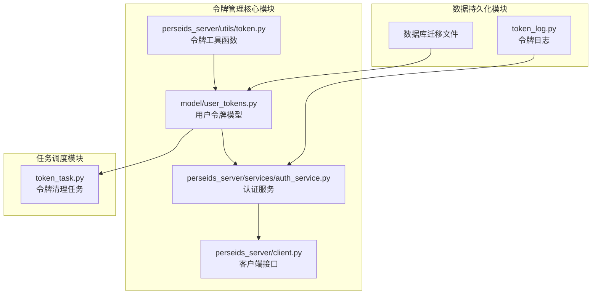
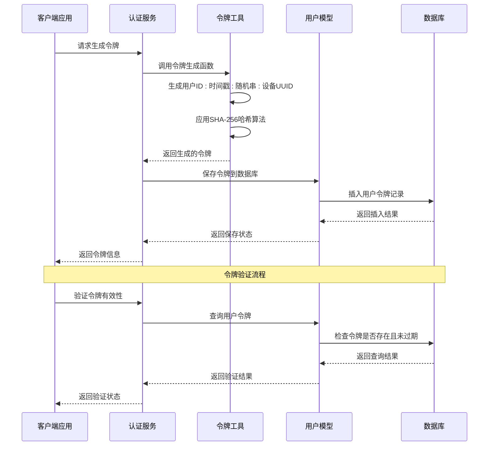
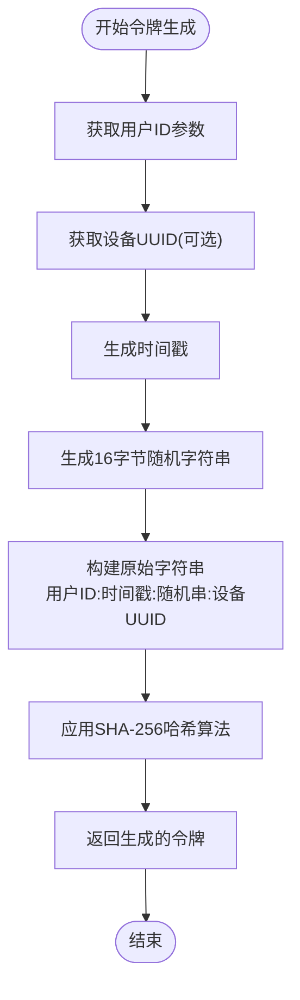
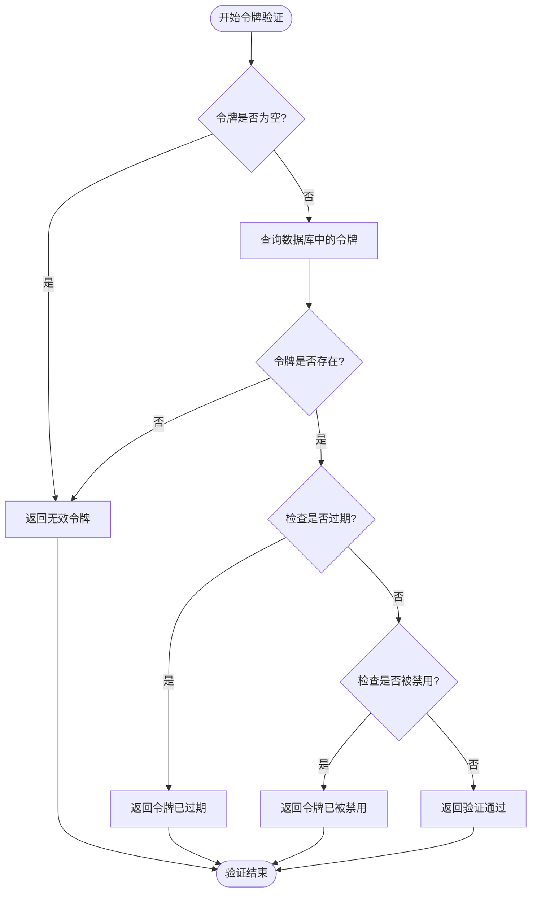
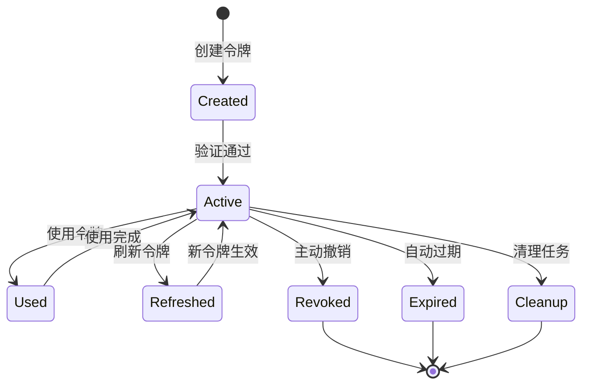
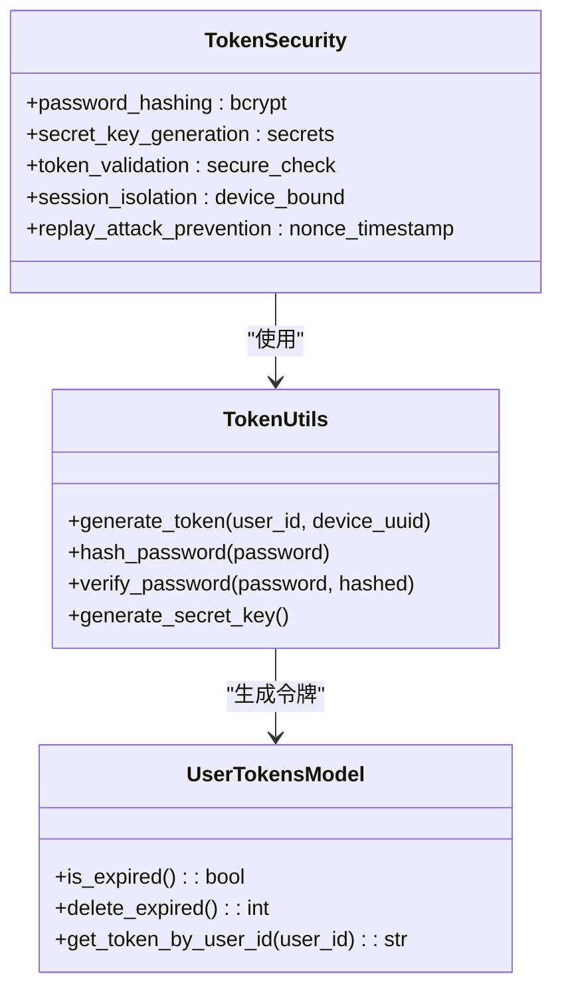
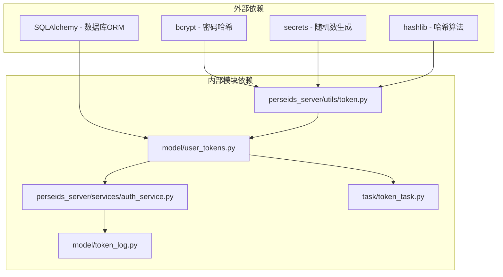
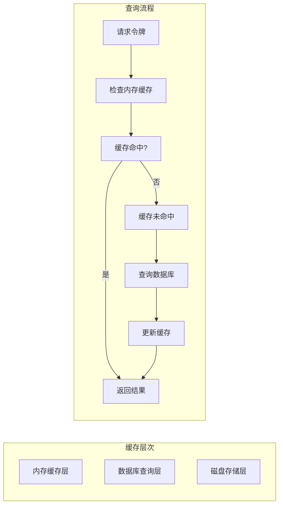

# 令牌管理系统

<cite>
**本文档引用的文件**
- [perseids_server/utils/token.py](file://perseids_server/utils/token.py)
- [model/user_tokens.py](file://model/user_tokens.py)
- [perseids_server/services/auth_service.py](file://perseids_server/services/auth_service.py)
- [perseids_server/client.py](file://perseids_server/client.py)
- [task/token_task.py](file://task/token_task.py)
- [model/token_log.py](file://model/token_log.py)
- [alembic/versions/20260401_add_api_token_idx.py](file://alembic/versions/20260401_add_api_token_idx.py)
- [alembic/versions/20260401_add_api_token_to_users.py](file://alembic/versions/20260401_add_api_token_to_users.py)
- [alembic/versions/20260401_add_zjt_token_config.py](file://alembic/versions/20260401_add_zjt_token_config.py)
- [alembic/versions/20260409_add_raw_input_token_to_token_log.py](file://alembic/versions/20260409_add_raw_input_token_to_token_log.py)
</cite>

## 目录
1. [简介](#简介)
2. [项目结构](#项目结构)
3. [核心组件](#核心组件)
4. [架构概览](#架构概览)
5. [详细组件分析](#详细组件分析)
6. [依赖关系分析](#依赖关系分析)
7. [性能考虑](#性能考虑)
8. [故障排除指南](#故障排除指南)
9. [结论](#结论)

## 简介

本项目实现了基于JWT的令牌管理系统，提供了完整的令牌生命周期管理功能，包括令牌生成、验证、刷新、撤销和自动清理机制。系统支持多设备登录、令牌并发管理和冲突处理，并具备完善的安全机制和性能优化策略。

## 项目结构

令牌管理系统主要分布在以下模块中：

**图表来源**
- [perseids_server/utils/token.py:1-72](file://perseids_server/utils/token.py#L1-L72)
- [model/user_tokens.py:1-157](file://model/user_tokens.py#L1-L157)
- [perseids_server/services/auth_service.py:572-616](file://perseids_server/services/auth_service.py#L572-L616)

**章节来源**
- [perseids_server/utils/token.py:1-72](file://perseids_server/utils/token.py#L1-L72)
- [model/user_tokens.py:1-157](file://model/user_tokens.py#L1-L157)

## 核心组件

### 令牌生成组件

系统实现了基于SHA-256的令牌生成机制，确保令牌的唯一性和安全性：

- **令牌结构**: 用户ID + 时间戳 + 随机字符串 + 设备UUID
- **签名算法**: SHA-256哈希算法
- **有效期管理**: 支持自定义过期时间设置
- **设备关联**: 可选的设备UUID绑定

### 用户令牌模型

用户令牌模型提供了完整的数据库操作接口：

- **数据表结构**: 包含用户ID、令牌值、创建时间、过期时间、设备UUID
- **索引优化**: 多字段索引支持高效查询
- **外键约束**: 与用户表建立关联关系

### 认证服务

认证服务提供了令牌管理的核心业务逻辑：

- **令牌获取**: 支持按用户ID查询有效令牌
- **令牌日志**: 记录令牌使用情况和统计信息
- **权限验证**: 提供令牌验证和权限检查功能

**章节来源**
- [perseids_server/utils/token.py:12-30](file://perseids_server/utils/token.py#L12-L30)
- [model/user_tokens.py:13-39](file://model/user_tokens.py#L13-L39)
- [perseids_server/services/auth_service.py:572-596](file://perseids_server/services/auth_service.py#L572-L596)

## 架构概览

**图表来源**
- [perseids_server/services/auth_service.py:572-616](file://perseids_server/services/auth_service.py#L572-L616)
- [perseids_server/utils/token.py:12-30](file://perseids_server/utils/token.py#L12-L30)
- [model/user_tokens.py:127-139](file://model/user_tokens.py#L127-L139)

## 详细组件分析

### 令牌生成算法

**图表来源**
- [perseids_server/utils/token.py:12-30](file://perseids_server/utils/token.py#L12-L30)

令牌生成过程具有以下特点：
- **唯一性保证**: 基于时间戳和随机字符串确保令牌唯一性
- **安全性**: SHA-256哈希算法提供强加密保护
- **可追溯性**: 包含用户ID和设备信息便于审计
- **灵活性**: 支持设备绑定和非绑定两种模式

### 令牌验证机制

**图表来源**
- [model/user_tokens.py:24-28](file://model/user_tokens.py#L24-L28)
- [model/user_tokens.py:127-139](file://model/user_tokens.py#L127-L139)

### 令牌生命周期管理

**图表来源**
- [model/user_tokens.py:109-125](file://model/user_tokens.py#L109-L125)
- [task/token_task.py](file://task/token_task.py)

### 多设备登录管理

系统支持多设备同时登录，通过设备UUID实现令牌关联：

- **设备绑定**: 每个令牌可关联特定设备UUID
- **并发管理**: 同一用户可在多个设备上拥有有效令牌
- **冲突处理**: 当设备变更时可选择性地撤销旧令牌
- **会话隔离**: 不同设备的令牌相互独立，互不影响

### 令牌安全机制

**图表来源**
- [perseids_server/utils/token.py:33-72](file://perseids_server/utils/token.py#L33-L72)
- [model/user_tokens.py:13-39](file://model/user_tokens.py#L13-L39)

系统采用多层次安全防护：

- **密码哈希**: 使用bcrypt算法对敏感信息进行哈希存储
- **随机密钥**: 生成32字节随机密钥增强安全性
- **设备绑定**: 通过UUID绑定设备，防止令牌滥用
- **过期控制**: 实现精确的过期时间和自动清理机制

**章节来源**
- [perseids_server/utils/token.py:33-72](file://perseids_server/utils/token.py#L33-L72)
- [model/user_tokens.py:13-39](file://model/user_tokens.py#L13-L39)

## 依赖关系分析

**图表来源**
- [perseids_server/utils/token.py:4-10](file://perseids_server/utils/token.py#L4-L10)
- [model/user_tokens.py:7](file://model/user_tokens.py#L7](file://model/user_tokens.py#L7))

**章节来源**
- [perseids_server/utils/token.py:4-10](file://perseids_server/utils/token.py#L4-L10)
- [model/user_tokens.py:7](file://model/user_tokens.py#L7)

## 性能考虑

### 数据库优化策略

系统通过多字段索引优化查询性能：

- **主键索引**: `user_tokens.id` - 主键查询
- **唯一索引**: `user_tokens.token` - 令牌快速查找
- **用户索引**: `user_tokens.user_id` - 用户令牌查询
- **过期索引**: `user_tokens.expire_time` - 过期清理优化
- **设备索引**: `user_tokens.device_uuid` - 设备关联查询

### 缓存策略

**图表来源**
- [model/user_tokens.py:127-139](file://model/user_tokens.py#L127-L139)

### 批量操作优化

系统支持批量令牌清理和维护操作：

- **定时清理**: 自动删除过期令牌
- **批量撤销**: 支持按用户或设备批量撤销令牌
- **索引维护**: 定期优化数据库索引性能

## 故障排除指南

### 常见问题及解决方案

| 问题类型 | 症状描述 | 可能原因 | 解决方案 |
|---------|---------|---------|---------|
| 令牌验证失败 | 返回"无效令牌" | 令牌不存在或已过期 | 检查令牌有效性，重新生成令牌 |
| 多设备冲突 | 同一账户在多个设备异常登出 | 设备UUID不匹配 | 检查设备绑定，清理冲突令牌 |
| 性能问题 | 令牌查询响应缓慢 | 缺少必要索引 | 添加数据库索引优化 |
| 内存泄漏 | 长时间运行后内存占用增加 | 缓存未及时清理 | 实施缓存清理策略 |

### 调试工具和监控

- **令牌日志**: 记录所有令牌操作和使用情况
- **性能监控**: 监控数据库查询性能和缓存命中率
- **错误追踪**: 记录令牌相关的异常和错误信息

**章节来源**
- [model/token_log.py](file://model/token_log.py)
- [task/token_task.py](file://task/token_task.py)

## 结论

本令牌管理系统实现了完整的JWT令牌生命周期管理，具有以下优势：

1. **安全性**: 采用多层安全防护机制，包括哈希加密、设备绑定和过期控制
2. **可扩展性**: 支持多设备登录和灵活的令牌管理策略
3. **高性能**: 通过索引优化和缓存策略提升系统性能
4. **可维护性**: 清晰的代码结构和完善的日志记录机制

系统为API访问、页面访问和第三方集成提供了统一的令牌管理解决方案，能够满足不同认证场景的需求。通过持续的性能优化和安全加固，系统能够在高并发环境下稳定运行。