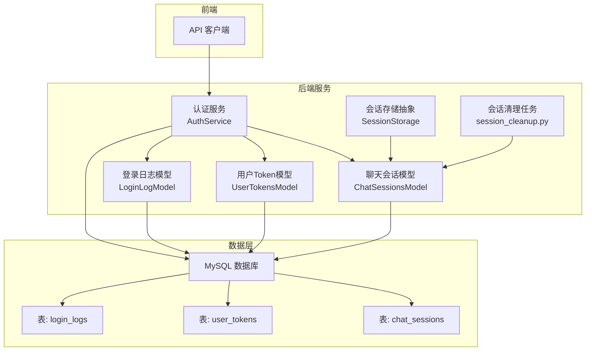
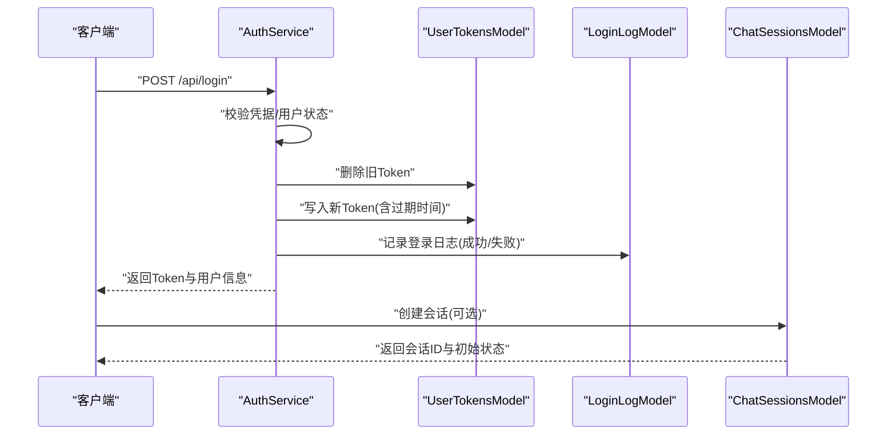
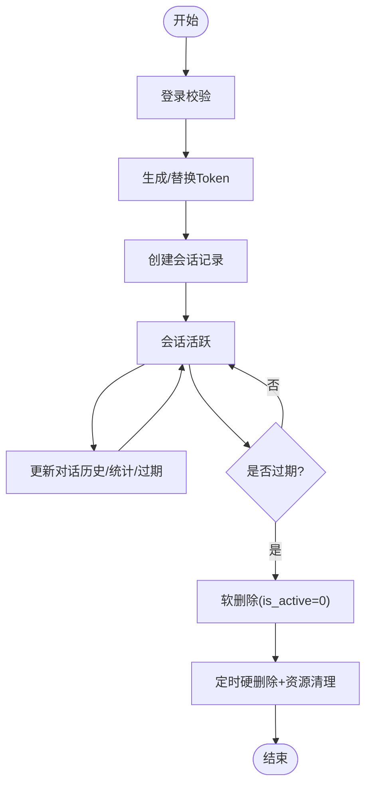
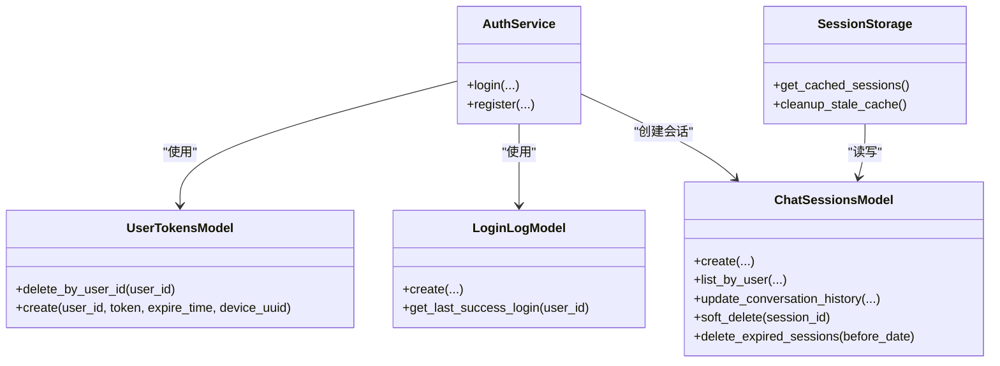

# 会话控制管理

<cite>
**本文引用的文件**
- [server.py](file://server.py)
- [auth_service.py](file://perseids_server/services/auth_service.py)
- [login_log.py](file://model/login_log.py)
- [user_tokens.py](file://model/user_tokens.py)
- [chat_sessions.py](file://model/chat_sessions.py)
- [session_storage.py](file://script_writer_core/session_storage.py)
- [test_chat_sessions_crud.py](file://tests/crud/test_chat_sessions_crud.py)
- [test_session_cleanup.py](file://tests/utils/test_session_cleanup.py)
- [test_marketing_agent_api.py](file://auto_test/e2e/test_marketing_agent_api.py)
- [conftest.py](file://auto_test/e2e/conftest.py)
- [baseline_with_db.sql](file://model/sql/baseline_with_db.sql)
- [session_cleanup.py](file://task/session_cleanup.py)
</cite>

## 目录
1. [引言](#引言)
2. [项目结构](#项目结构)
3. [核心组件](#核心组件)
4. [架构总览](#架构总览)
5. [详细组件分析](#详细组件分析)
6. [依赖关系分析](#依赖关系分析)
7. [性能考量](#性能考量)
8. [故障排查指南](#故障排查指南)
9. [结论](#结论)
10. [附录](#附录)

## 引言
本文件围绕会话控制管理展开，系统性阐述用户会话的建立、维护与销毁机制，覆盖会话状态管理、超时与自动续期、登录日志追踪、会话安全（会话固定、CSRF、会话劫持）、多设备会话管理（并发设备上限、设备切换通知、强制下线）、会话清理与垃圾回收（过期会话、异常检测、内存优化），以及在审计与合规中的应用（行为追踪、异常登录检测、安全事件响应）。内容基于仓库现有实现进行归纳与可视化，帮助读者快速理解并落地相关功能。

## 项目结构
会话控制涉及多个层次：
- 后端服务层：认证与授权服务负责登录、Token发放与校验、登录日志记录。
- 数据模型层：会话与Token持久化、登录日志表、会话历史与统计字段。
- 任务调度层：定时清理过期会话与相关资源。
- 测试与自动化：端到端测试验证会话创建、删除与列表过滤；单元测试验证会话软/硬删除与过期逻辑。
- 前端交互层：通过API接口创建、列出与删除会话，支持按用户与会话类型过滤。

图表来源
- [server.py](file://server.py)
- [auth_service.py](file://perseids_server/services/auth_service.py)
- [login_log.py](file://model/login_log.py)
- [user_tokens.py](file://model/user_tokens.py)
- [chat_sessions.py](file://model/chat_sessions.py)
- [session_storage.py](file://script_writer_core/session_storage.py)
- [session_cleanup.py](file://task/session_cleanup.py)

章节来源
- [server.py](file://server.py)
- [auth_service.py](file://perseids_server/services/auth_service.py)
- [chat_sessions.py](file://model/chat_sessions.py)
- [login_log.py](file://model/login_log.py)
- [user_tokens.py](file://model/user_tokens.py)
- [session_storage.py](file://script_writer_core/session_storage.py)
- [session_cleanup.py](file://task/session_cleanup.py)

## 核心组件
- 认证服务（AuthService）：负责登录、注册、Token生成与替换、登录日志记录、用户状态校验。
- 登录日志模型（LoginLogModel）：记录登录时间、IP、UA、登录状态。
- 用户Token模型（UserTokensModel）：持久化用户Token、过期时间、设备UUID。
- 聊天会话模型（ChatSessionsModel）：会话创建、查询、更新、软/硬删除、过期清理、会话统计。
- 会话存储抽象（SessionStorage）：会话缓存、失效与清理。
- 会话清理任务（session_cleanup.py）：定时清理过期会话及营销会话图片资源。

章节来源
- [auth_service.py](file://perseids_server/services/auth_service.py)
- [login_log.py](file://model/login_log.py)
- [user_tokens.py](file://model/user_tokens.py)
- [chat_sessions.py](file://model/chat_sessions.py)
- [session_storage.py](file://script_writer_core/session_storage.py)
- [session_cleanup.py](file://task/session_cleanup.py)

## 架构总览
会话生命周期从“登录”开始，生成Token并持久化，随后创建或关联会话记录。会话在运行期间可更新对话历史、令牌统计与过期时间；到期后由清理任务执行软/硬删除，并清理相关资源。登录日志贯穿始终，用于审计与风控。

图表来源
- [auth_service.py](file://perseids_server/services/auth_service.py)
- [login_log.py](file://model/login_log.py)
- [user_tokens.py](file://model/user_tokens.py)
- [chat_sessions.py](file://model/chat_sessions.py)

## 详细组件分析

### 1) 会话建立与维护
- 登录流程：认证服务根据手机号/邮箱校验用户，验证密码与状态，生成Token并持久化，记录登录日志。
- 会话创建：前端通过API创建会话，后端写入会话表，设置过期时间与会话类型。
- 会话更新：支持更新对话历史、模型、标题、令牌统计与过期时间，便于自动续期与统计。
- 会话状态：采用软删除（is_active字段）与硬删除（清理任务），并区分会话类型（脚本写作/营销代理）。

图表来源
- [auth_service.py](file://perseids_server/services/auth_service.py)
- [chat_sessions.py](file://model/chat_sessions.py)
- [session_cleanup.py](file://task/session_cleanup.py)

章节来源
- [auth_service.py](file://perseids_server/services/auth_service.py)
- [chat_sessions.py](file://model/chat_sessions.py)
- [test_chat_sessions_crud.py](file://tests/crud/test_chat_sessions_crud.py)

### 2) 会话状态管理、超时与自动续期
- 过期时间：会话记录包含过期时间字段，支持按时间清理。
- 自动续期：更新会话时可传入新的过期时间，实现自动续期。
- 软删除：标记is_active=0，保留历史与审计数据。
- 硬删除：清理任务批量删除过期且活跃的会话记录，并清理营销会话图片资源。

章节来源
- [chat_sessions.py](file://model/chat_sessions.py)
- [session_cleanup.py](file://task/session_cleanup.py)
- [test_chat_sessions_crud.py](file://tests/crud/test_chat_sessions_crud.py)

### 3) 登录日志记录系统
- 字段：用户ID、登录时间、IP地址、User-Agent、登录状态（成功/失败）。
- 写入时机：登录成功/失败均记录；注册成功亦记录。
- 查询：可按用户查询最近一次成功登录记录，用于风控与审计。

章节来源
- [login_log.py](file://model/login_log.py)
- [baseline_with_db.sql](file://model/sql/baseline_with_db.sql)
- [auth_service.py](file://perseids_server/services/auth_service.py)

### 4) 会话安全机制
- 会话固定攻击防护：登录时删除旧Token并生成新Token，确保会话唯一性。
- CSRF防护：当前实现未见显式CSRF令牌处理，建议在后续版本引入同源策略与CSRF令牌校验。
- 会话劫持防范：通过设备UUID绑定与Token过期控制降低风险；建议结合IP/UA绑定与二次校验。

章节来源
- [auth_service.py](file://perseids_server/services/auth_service.py)
- [user_tokens.py](file://model/user_tokens.py)

### 5) 多设备会话管理
- 设备绑定：Token记录包含设备UUID，登录时可选择设备标识。
- 并发设备：当前未见明确的“同时在线设备数量限制”实现，建议在认证服务中引入设备计数与上限控制。
- 设备切换通知：可在更换设备登录时记录日志并触发通知（建议扩展）。
- 强制下线：可通过删除指定设备UUID的Token实现强制下线。

章节来源
- [user_tokens.py](file://model/user_tokens.py)
- [auth_service.py](file://perseids_server/services/auth_service.py)

### 6) 会话清理与垃圾回收
- 过期会话清理：定时任务扫描过期会话，软删除后批量硬删除。
- 营销会话资源清理：对营销会话类型，额外清理上传图片目录。
- 缓存清理：会话存储支持缓存失效与过期清理，避免内存膨胀。

章节来源
- [session_cleanup.py](file://task/session_cleanup.py)
- [chat_sessions.py](file://model/chat_sessions.py)
- [session_storage.py](file://script_writer_core/session_storage.py)
- [test_session_cleanup.py](file://tests/utils/test_session_cleanup.py)

### 7) 审计与合规应用
- 行为追踪：会话历史与令牌统计可用于行为分析。
- 异常登录检测：登录日志包含IP与UA，可作为异常登录识别依据。
- 安全事件响应：结合登录日志与会话状态变更，触发告警与处置流程。

章节来源
- [login_log.py](file://model/login_log.py)
- [chat_sessions.py](file://model/chat_sessions.py)

## 依赖关系分析
- 认证服务依赖用户模型、Token模型与登录日志模型。
- 会话模型依赖数据库表与清理任务。
- 会话存储抽象依赖会话模型与缓存锁。
- 定时任务依赖会话模型与文件系统清理。

图表来源
- [auth_service.py](file://perseids_server/services/auth_service.py)
- [login_log.py](file://model/login_log.py)
- [user_tokens.py](file://model/user_tokens.py)
- [chat_sessions.py](file://model/chat_sessions.py)
- [session_storage.py](file://script_writer_core/session_storage.py)

章节来源
- [auth_service.py](file://perseids_server/services/auth_service.py)
- [chat_sessions.py](file://model/chat_sessions.py)
- [session_storage.py](file://script_writer_core/session_storage.py)

## 性能考量
- 数据库索引：登录日志按用户ID索引，Token表按用户ID/过期时间/设备UUID索引，提升查询与清理效率。
- 缓存策略：会话存储支持缓存与过期清理，减少数据库压力。
- 定时任务：分批清理过期会话，避免高峰时段抖动。
- 日志与审计：登录日志与会话统计可能产生大量数据，建议定期归档与分区。

章节来源
- [login_log.py](file://model/login_log.py)
- [user_tokens.py](file://model/user_tokens.py)
- [session_storage.py](file://script_writer_core/session_storage.py)
- [session_cleanup.py](file://task/session_cleanup.py)

## 故障排查指南
- 登录失败：检查登录日志状态与用户状态；确认密码哈希与用户状态。
- 会话无法创建/查询：确认会话表结构与索引；检查会话类型与活跃状态过滤。
- 过期会话未清理：核对定时任务执行情况与清理阈值；检查营销会话图片清理逻辑。
- 缓存异常：检查缓存开关与过期清理函数；确认并发锁与清理统计。

章节来源
- [auth_service.py](file://perseids_server/services/auth_service.py)
- [chat_sessions.py](file://model/chat_sessions.py)
- [login_log.py](file://model/login_log.py)
- [session_storage.py](file://script_writer_core/session_storage.py)
- [test_chat_sessions_crud.py](file://tests/crud/test_chat_sessions_crud.py)
- [test_session_cleanup.py](file://tests/utils/test_session_cleanup.py)
- [test_marketing_agent_api.py](file://auto_test/e2e/test_marketing_agent_api.py)
- [conftest.py](file://auto_test/e2e/conftest.py)

## 结论
本项目在会话控制方面具备完整的登录、会话与清理闭环：认证服务负责登录与Token管理，登录日志提供审计基础，会话模型支撑会话生命周期管理，定时任务保障资源回收。建议后续增强CSRF防护、多设备并发控制与设备切换通知能力，以进一步提升安全性与用户体验。

## 附录
- API端点参考（来自测试用例）：
  - 创建会话：POST /api/session/create（支持会话类型）
  - 删除会话：DELETE /api/session/{id}
  - 列出会话：GET /api/sessions（支持按用户与会话类型过滤）

章节来源
- [test_marketing_agent_api.py](file://auto_test/e2e/test_marketing_agent_api.py)
- [conftest.py](file://auto_test/e2e/conftest.py)