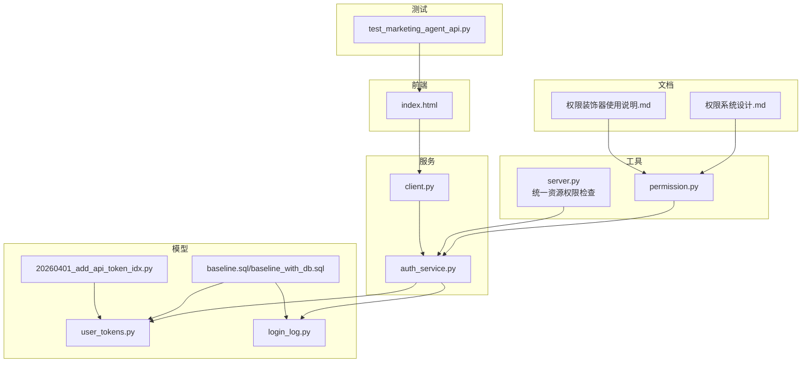
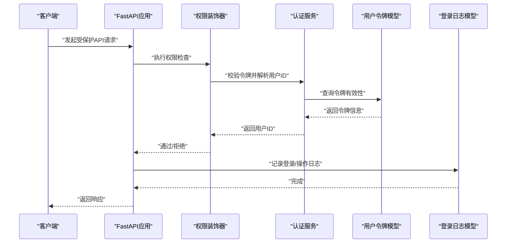
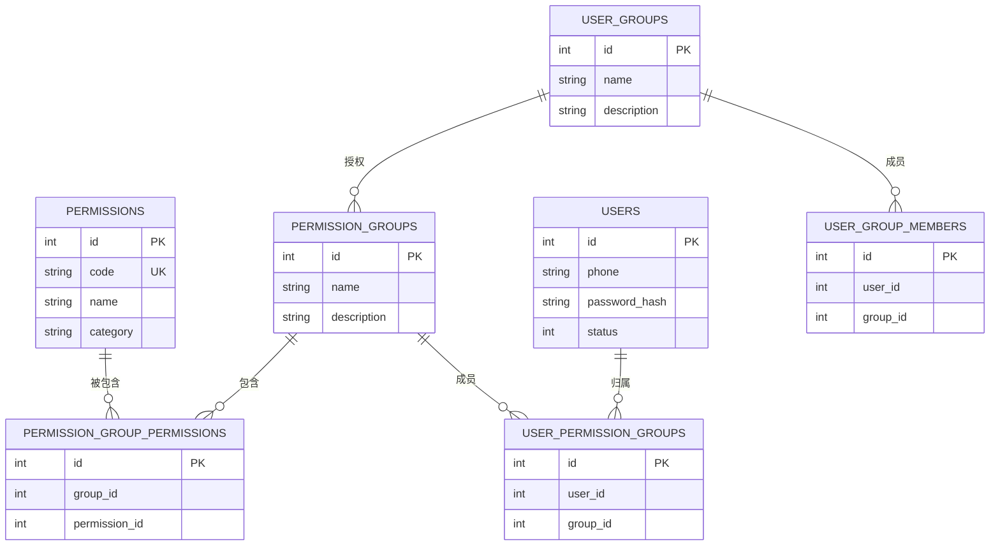
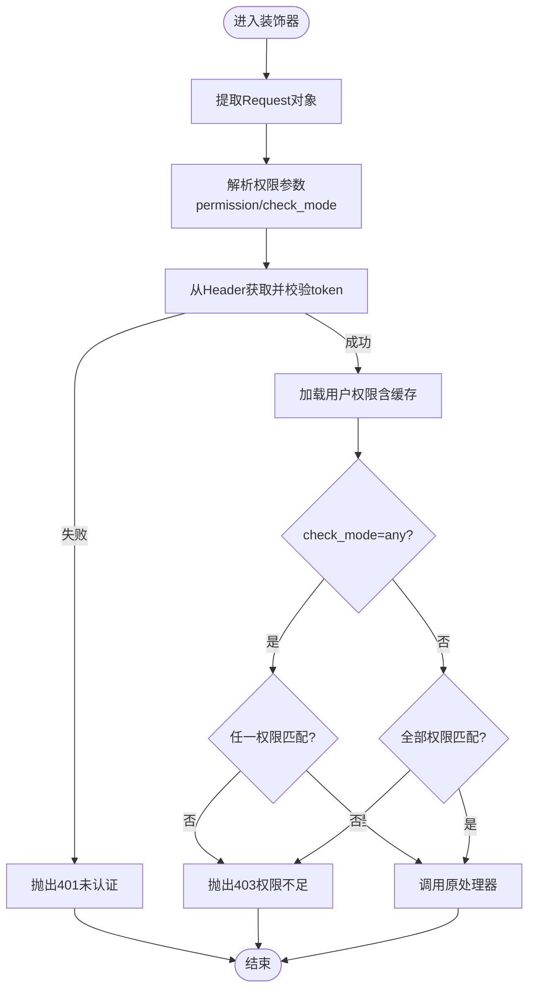
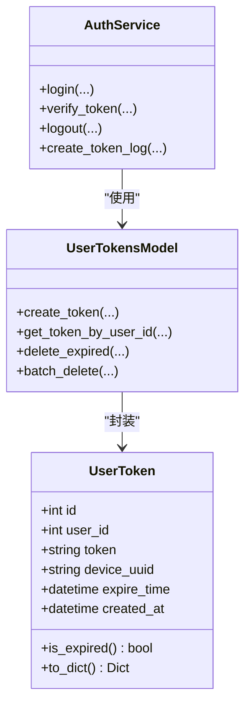
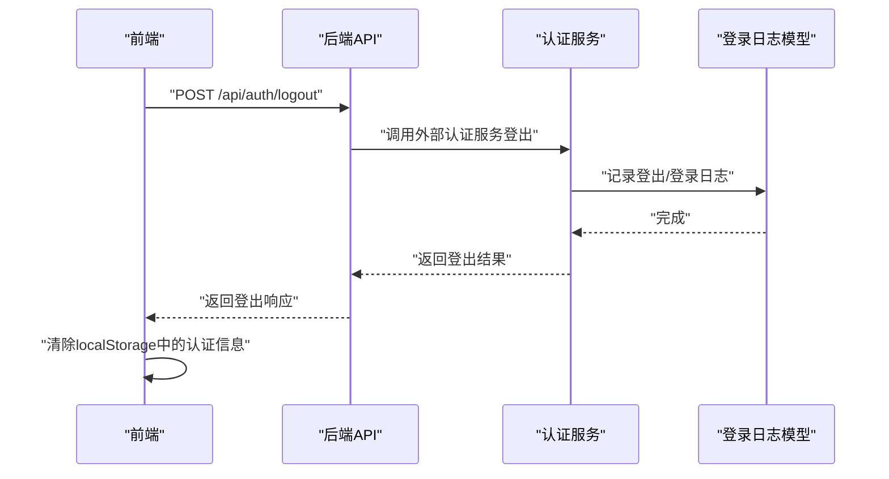
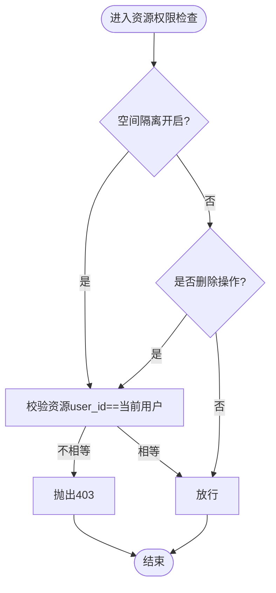
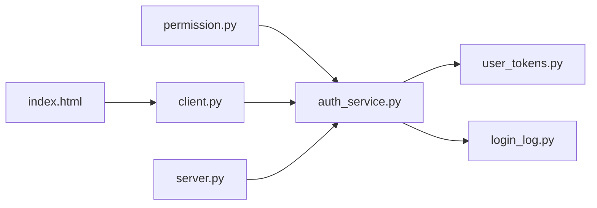

# 权限控制系统

<cite>
**本文引用的文件**
- [权限系统设计.md](file://docs/权限系统/权限系统设计.md)
- [权限装饰器使用说明.md](file://docs/权限系统/权限装饰器使用说明.md)
- [permission.py](file://perseids_server/utils/permission.py)
- [auth_service.py](file://perseids_server/services/auth_service.py)
- [client.py](file://perseids_server/client.py)
- [server.py](file://server.py)
- [user_tokens.py](file://model/user_tokens.py)
- [login_log.py](file://model/login_log.py)
- [baseline.sql](file://model/sql/baseline.sql)
- [baseline_with_db.sql](file://model/sql/baseline_with_db.sql)
- [20260401_add_api_token_idx.py](file://alembic/versions/20260401_add_api_token_idx.py)
- [index.html](file://web/index.html)
- [test_marketing_agent_api.py](file://auto_test/e2e/test_marketing_agent_api.py)
</cite>

## 目录
1. [引言](#引言)
2. [项目结构](#项目结构)
3. [核心组件](#核心组件)
4. [架构总览](#架构总览)
5. [详细组件分析](#详细组件分析)
6. [依赖关系分析](#依赖关系分析)
7. [性能考虑](#性能考虑)
8. [故障排查指南](#故障排查指南)
9. [结论](#结论)
10. [附录](#附录)

## 引言
本文件面向ZhiJuTong权限控制系统的使用者与维护者，系统性阐述基于角色的访问控制（RBAC）模型、权限装饰器实现与使用、JWT令牌机制与刷新策略、会话管理与登录日志审计、以及扩展开发与最佳实践。文档以仓库中的权限系统设计文档、装饰器实现、认证服务、令牌模型与日志模型为依据，结合前端会话清理逻辑与E2E测试，形成从架构到落地的完整说明。

## 项目结构
权限控制相关能力分布在以下模块：
- 文档层：权限系统设计与装饰器使用说明，定义RBAC模型、权限代码规范与API接口规划
- 服务层：认证服务（含令牌生成、校验、日志）、外部认证客户端封装
- 工具层：权限装饰器（待完善），统一资源访问控制辅助函数
- 模型层：用户令牌、登录日志、算力日志、用户表等数据库模型与迁移脚本
- 前端层：登录/登出流程与本地存储清理
- 测试层：E2E测试覆盖会话创建/删除与权限相关接口

图表来源
- [权限系统设计.md:74-156](file://docs/权限系统/权限系统设计.md#L74-L156)
- [权限装饰器使用说明.md:1-72](file://docs/权限系统/权限装饰器使用说明.md#L1-L72)
- [permission.py:14-42](file://perseids_server/utils/permission.py#L14-L42)
- [auth_service.py:21-41](file://perseids_server/services/auth_service.py#L21-L41)
- [client.py:115-144](file://perseids_server/client.py#L115-L144)
- [server.py:148-189](file://server.py#L148-L189)
- [user_tokens.py:14-40](file://model/user_tokens.py#L14-L40)
- [login_log.py:93-105](file://model/login_log.py#L93-L105)
- [baseline.sql:387-453](file://model/sql/baseline.sql#L387-L453)
- [baseline_with_db.sql:376-461](file://model/sql/baseline_with_db.sql#L376-L461)
- [20260401_add_api_token_idx.py:21-34](file://alembic/versions/20260401_add_api_token_idx.py#L21-L34)
- [index.html:7225-7755](file://web/index.html#L7225-L7755)
- [test_marketing_agent_api.py:183-214](file://auto_test/e2e/test_marketing_agent_api.py#L183-L214)

章节来源
- [权限系统设计.md:74-156](file://docs/权限系统/权限系统设计.md#L74-L156)
- [权限装饰器使用说明.md:1-72](file://docs/权限系统/权限装饰器使用说明.md#L1-L72)

## 核心组件
- RBAC模型与权限矩阵
  - 权限、权限组、用户组三层结构，支持用户-权限组、权限组-权限的多对多关联
  - 权限代码采用“模块:操作”规范，便于细粒度控制
- 权限装饰器
  - 提供通用权限装饰器与管理员装饰器，支持“任意满足/全部满足”的检查模式
  - 当前装饰器为占位实现，后续将接入认证与权限查询
- JWT与令牌管理
  - 用户令牌模型包含用户ID、令牌值、过期时间、设备UUID等字段
  - 认证服务负责令牌生成、校验、日志记录与算力变动
- 会话管理与审计
  - 登录日志记录IP、UA、状态；token历史表支持令牌生命周期追踪
  - 统一资源权限检查函数支持空间隔离与删除权限约束
- 前端会话清理
  - 登出时清除本地存储的认证信息与用户态

章节来源
- [权限系统设计.md:46-70](file://docs/权限系统/权限系统设计.md#L46-L70)
- [权限装饰器使用说明.md:11-53](file://docs/权限系统/权限装饰器使用说明.md#L11-L53)
- [user_tokens.py:14-40](file://model/user_tokens.py#L14-L40)
- [auth_service.py:21-41](file://perseids_server/services/auth_service.py#L21-L41)
- [login_log.py:93-105](file://model/login_log.py#L93-L105)
- [server.py:148-189](file://server.py#L148-L189)
- [index.html:7225-7755](file://web/index.html#L7225-L7755)

## 架构总览
下图展示权限控制从API入口到认证服务、令牌与日志的全链路交互，以及前端会话清理流程。

图表来源
- [permission.py:14-42](file://perseids_server/utils/permission.py#L14-L42)
- [auth_service.py:32-41](file://perseids_server/services/auth_service.py#L32-L41)
- [user_tokens.py:142-157](file://model/user_tokens.py#L142-L157)
- [login_log.py:93-105](file://model/login_log.py#L93-L105)

## 详细组件分析

### RBAC模型与权限矩阵
- 权限实体：权限代码、描述、分类
- 权限组：权限集合，支持批量授权
- 用户组：用户集合，支持向用户组分配权限组
- 关联关系：
  - 用户-权限组：多对多，支持用户继承多个权限组
  - 权限组-权限：多对多，支持权限组聚合细粒度权限
  - 用户组-权限组：多对多，支持按组织/团队维度授权
- 权限验证流程：
  - 登录后获取用户信息
  - 查询用户所属权限组
  - 获取权限组对应权限代码并缓存至会话
  - API请求时中间件校验所需权限

图表来源
- [权限系统设计.md:46-70](file://docs/权限系统/权限系统设计.md#L46-L70)
- [权限系统设计.md:158-307](file://docs/权限系统/权限系统设计.md#L158-L307)

章节来源
- [权限系统设计.md:74-156](file://docs/权限系统/权限系统设计.md#L74-L156)
- [权限系统设计.md:158-307](file://docs/权限系统/权限系统设计.md#L158-L307)

### 权限装饰器实现与使用
- 装饰器类型
  - require_permission：通用权限装饰器，支持单权限或多权限，check_mode支持“any/all”
  - admin_required：管理员专用装饰器（占位，当前为空实现）
- 使用要点
  - 装饰器顺序：路由装饰器在前，权限装饰器在后
  - 函数签名需接收Request对象，异步函数支持async def
  - 权限代码采用“模块:操作”格式
  - 权限变更后需调用缓存清理函数
- 当前状态
  - 装饰器框架已就绪，后续需实现从请求提取token、验证token、查询用户权限与缓存集成

图表来源
- [权限装饰器使用说明.md:14-40](file://docs/权限系统/权限装饰器使用说明.md#L14-L40)
- [permission.py:14-42](file://perseids_server/utils/permission.py#L14-L42)

章节来源
- [权限装饰器使用说明.md:1-72](file://docs/权限系统/权限装饰器使用说明.md#L1-L72)
- [permission.py:14-42](file://perseids_server/utils/permission.py#L14-L42)

### JWT令牌机制与刷新策略
- 令牌结构
  - 字段：用户ID、令牌值、创建时间、过期时间、设备UUID
  - 过期策略：默认30天，到期需重新登录
- 令牌管理
  - 生成：认证服务生成新令牌并写入user_tokens表
  - 校验：外部认证客户端调用认证服务验证token
  - 刷新：当前未实现自动刷新，建议在前端检测401时触发重新登录
- 审计与历史
  - token_history表记录令牌创建与时间索引，便于审计
  - login_logs记录登录事件（IP、UA、状态）

图表来源
- [user_tokens.py:13-40](file://model/user_tokens.py#L13-L40)
- [user_tokens.py:142-157](file://model/user_tokens.py#L142-L157)
- [auth_service.py:32-41](file://perseids_server/services/auth_service.py#L32-L41)
- [client.py:115-144](file://perseids_server/client.py#L115-L144)
- [baseline.sql:387-453](file://model/sql/baseline.sql#L387-L453)
- [baseline_with_db.sql:376-461](file://model/sql/baseline_with_db.sql#L376-L461)

章节来源
- [user_tokens.py:14-40](file://model/user_tokens.py#L14-L40)
- [auth_service.py:21-41](file://perseids_server/services/auth_service.py#L21-L41)
- [client.py:115-144](file://perseids_server/client.py#L115-L144)
- [baseline.sql:387-453](file://model/sql/baseline.sql#L387-L453)
- [baseline_with_db.sql:376-461](file://model/sql/baseline_with_db.sql#L376-L461)

### 会话管理、登录日志与审计追踪
- 会话管理
  - 登录成功后，前端从URL参数处理登录态，优先处理login=1场景并清理本地存储
  - 登出接口调用外部认证服务，成功后清除本地认证信息
- 登录日志
  - login_logs表记录用户登录时间、IP地址、User-Agent与状态
  - 支持查询最近一次成功登录记录
- 审计追踪
  - token_log与token_history支撑令牌使用与历史追踪
  - computing_power_log记录算力增减行为，支持按用户/行为/时间范围查询

图表来源
- [server.py:2812-2857](file://server.py#L2812-L2857)
- [client.py:115-144](file://perseids_server/client.py#L115-L144)
- [login_log.py:76-105](file://model/login_log.py#L76-L105)
- [index.html:7225-7755](file://web/index.html#L7225-L7755)

章节来源
- [server.py:2812-2857](file://server.py#L2812-L2857)
- [client.py:115-144](file://perseids_server/client.py#L115-L144)
- [login_log.py:76-105](file://model/login_log.py#L76-L105)
- [index.html:7225-7755](file://web/index.html#L7225-L7755)

### 统一资源权限检查
- 设计目标
  - 在多空间/隔离场景下，限制资源访问范围
  - 删除操作仅允许资源创建者执行
- 核心逻辑
  - 空间隔离模式下，资源user_id需与当前用户一致
  - 非删除操作在隔离模式下仍要求创建者身份
- 异常处理
  - 无权限时抛出403，区分删除与非删除场景的错误消息

图表来源
- [server.py:148-189](file://server.py#L148-L189)

章节来源
- [server.py:148-189](file://server.py#L148-L189)

### 权限系统扩展开发指南
- 自定义权限检查
  - 在业务逻辑中调用has_permission与get_user_permissions进行细粒度判断
  - 权限变更后调用clear_user_permission_cache清理缓存
- 第三方认证集成
  - 通过client.py封装的外部认证服务对接第三方登录/令牌校验
  - 登录成功后返回令牌，后续由装饰器与认证服务完成权限校验
- 权限代码规范
  - 采用“模块:操作”格式，避免冲突并提升可读性
- API接口规划
  - 参考权限系统设计文档中的权限管理与用户组管理API，逐步实现

章节来源
- [权限装饰器使用说明.md:165-195](file://docs/权限系统/权限装饰器使用说明.md#L165-L195)
- [client.py:115-144](file://perseids_server/client.py#L115-L144)
- [权限系统设计.md:124-156](file://docs/权限系统/权限系统设计.md#L124-L156)

## 依赖关系分析
- 组件耦合
  - 权限装饰器依赖认证服务进行token校验与用户解析
  - 认证服务依赖用户令牌模型与登录日志模型
  - 前端通过外部认证客户端间接依赖认证服务
- 外部依赖
  - 数据库：MySQL（用户、令牌、日志、历史表）
  - Redis：权限缓存（装饰器使用说明中提及）
- 潜在循环依赖
  - 当前未发现直接循环导入；装饰器占位实现避免了与模型层的耦合

图表来源
- [permission.py:14-42](file://perseids_server/utils/permission.py#L14-L42)
- [auth_service.py:21-41](file://perseids_server/services/auth_service.py#L21-L41)
- [user_tokens.py:142-157](file://model/user_tokens.py#L142-L157)
- [login_log.py:93-105](file://model/login_log.py#L93-L105)
- [client.py:115-144](file://perseids_server/client.py#L115-L144)
- [server.py:148-189](file://server.py#L148-L189)
- [index.html:7225-7755](file://web/index.html#L7225-L7755)

章节来源
- [permission.py:14-42](file://perseids_server/utils/permission.py#L14-L42)
- [auth_service.py:21-41](file://perseids_server/services/auth_service.py#L21-L41)
- [user_tokens.py:142-157](file://model/user_tokens.py#L142-L157)
- [login_log.py:93-105](file://model/login_log.py#L93-L105)
- [client.py:115-144](file://perseids_server/client.py#L115-L144)
- [server.py:148-189](file://server.py#L148-L189)
- [index.html:7225-7755](file://web/index.html#L7225-L7755)

## 性能考虑
- 权限缓存
  - 建议在装饰器中集成Redis缓存用户权限列表，减少数据库查询
  - 缓存键建议采用“user_permissions:{user_id}”，合理设置TTL（如1小时）
- 数据库索引
  - user_tokens表已建立token、user_id、expire_time、device_uuid索引，有利于快速查找与过期清理
  - users表存在api_token唯一索引，便于API Token检索
- 日志查询
  - login_logs与token_history按时间与用户维度建立索引，支持高效分页与范围查询

章节来源
- [user_tokens.py:142-157](file://model/user_tokens.py#L142-L157)
- [baseline.sql:387-453](file://model/sql/baseline.sql#L387-L453)
- [baseline_with_db.sql:376-461](file://model/sql/baseline_with_db.sql#L376-L461)
- [20260401_add_api_token_idx.py:21-34](file://alembic/versions/20260401_add_api_token_idx.py#L21-L34)

## 故障排查指南
- 权限装饰器无效
  - 现状：装饰器为空实现，所有请求均通过
  - 排查：确认装饰器已替换为完整实现；检查请求头Authorization是否携带Bearer token
- 401未认证
  - 检查token是否过期、是否与设备UUID匹配
  - 确认认证服务返回的token有效且未被撤销
- 403权限不足
  - 检查用户是否具备所需权限代码
  - 若使用“all”模式，确认同时具备所有权限
- 登出后本地状态未清理
  - 检查前端登出流程是否执行localStorage清理
  - 确认后端登出接口返回成功后再清理本地状态
- 会话创建/删除异常
  - 参考E2E测试中的会话创建与删除流程，确认返回状态码与会话ID一致性

章节来源
- [权限装饰器使用说明.md:243-251](file://docs/权限系统/权限装饰器使用说明.md#L243-L251)
- [server.py:2812-2857](file://server.py#L2812-L2857)
- [index.html:7225-7755](file://web/index.html#L7225-L7755)
- [test_marketing_agent_api.py:183-214](file://auto_test/e2e/test_marketing_agent_api.py#L183-L214)

## 结论
ZhiJuTong权限控制系统以RBAC为核心，结合权限装饰器、JWT令牌与登录日志审计，构建了可扩展的访问控制体系。当前装饰器处于占位实现，后续需完善认证与权限查询逻辑；令牌与日志模型已具备良好基础，配合Redis缓存与索引优化可满足生产环境需求。建议优先完成装饰器实现与缓存集成，再推进用户组与权限矩阵的数据库落地与API开发。

## 附录
- 权限代码规范
  - 采用“模块:操作”格式，如video_workflow:create、user:manage_all
- 管理员与超级权限
  - 管理员装饰器预留，当前为空实现；超级权限与审计权限建议通过权限组与专门的权限代码实现
- 最佳实践
  - 严格区分“any/all”两种检查模式
  - 权限变更后及时清理缓存
  - 登录/登出均记录日志，令牌过期与撤销需同步处理

章节来源
- [权限装饰器使用说明.md:64-72](file://docs/权限系统/权限装饰器使用说明.md#L64-L72)
- [权限系统设计.md:74-156](file://docs/权限系统/权限系统设计.md#L74-L156)