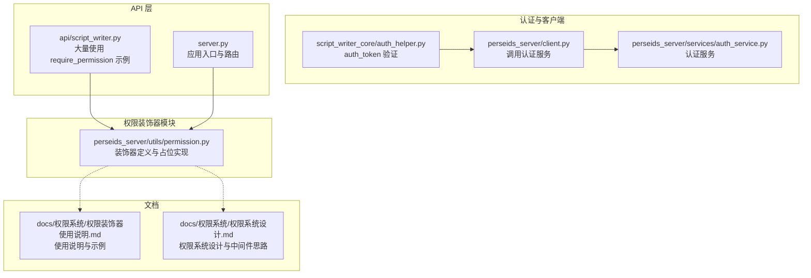
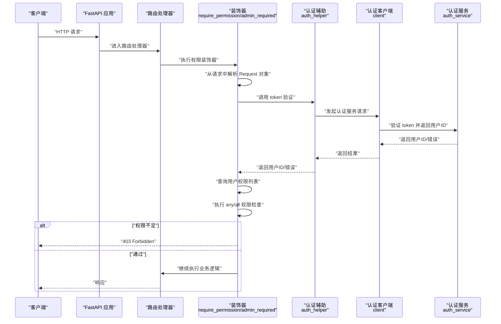
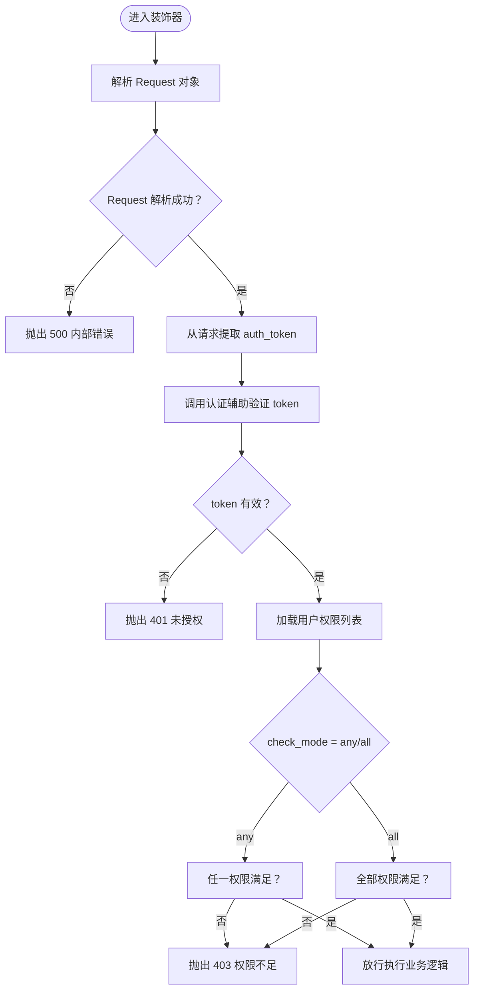
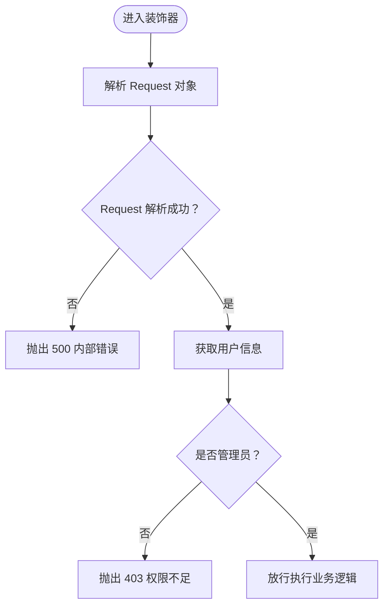
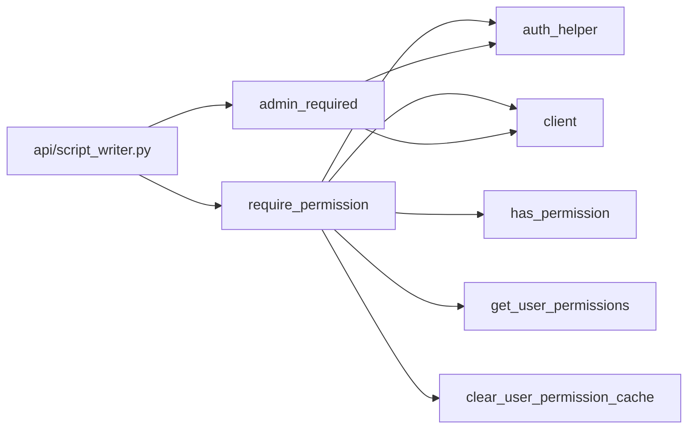

# 权限装饰器

<cite>
**本文引用的文件**
- [权限装饰器使用说明.md](file://docs/权限系统/权限装饰器使用说明.md)
- [权限系统设计.md](file://docs/权限系统/权限系统设计.md)
- [permission.py](file://perseids_server/utils/permission.py)
- [auth_helper.py](file://script_writer_core/auth_helper.py)
- [auth_service.py](file://perseids_server/services/auth_service.py)
- [client.py](file://perseids_server/client.py)
- [script_writer.py](file://api/script_writer.py)
- [server.py](file://server.py)
</cite>

## 目录
1. [简介](#简介)
2. [项目结构](#项目结构)
3. [核心组件](#核心组件)
4. [架构总览](#架构总览)
5. [组件详解](#组件详解)
6. [依赖关系分析](#依赖关系分析)
7. [性能考量](#性能考量)
8. [故障排查指南](#故障排查指南)
9. [结论](#结论)
10. [附录](#附录)

## 简介
本文件面向后端开发者与测试工程师，系统化阐述权限装饰器的设计与实现，重点覆盖：
- require_permission 装饰器的实现原理与使用方法，包括权限检查模式（any/all）、权限代码格式与参数传递机制
- admin_required 管理员装饰器的特殊用途与实现方式
- 在 FastAPI 路由中的使用示例与最佳实践
- 权限装饰器的工作流程：从请求对象提取 token、验证用户身份、查询权限列表、执行权限检查
- 错误处理机制、日志记录与调试技巧
- 常见问题与排障建议

## 项目结构
权限装饰器位于 perseids_server/utils/permission.py，配套的认证与权限查询逻辑在其他模块中实现或待实现。相关使用示例分布在 API 层与文档中。

**图表来源**
- [permission.py:1-162](file://perseids_server/utils/permission.py#L1-L162)
- [auth_helper.py:1-40](file://script_writer_core/auth_helper.py#L1-L40)
- [client.py:115-144](file://perseids_server/client.py#L115-L144)
- [auth_service.py:1-41](file://perseids_server/services/auth_service.py#L1-L41)
- [script_writer.py:17-297](file://api/script_writer.py#L17-L297)
- [server.py:70-85](file://server.py#L70-L85)
- [权限装饰器使用说明.md:1-270](file://docs/权限系统/权限装饰器使用说明.md#L1-L270)
- [权限系统设计.md:1-366](file://docs/权限系统/权限系统设计.md#L1-L366)

**章节来源**
- [permission.py:1-162](file://perseids_server/utils/permission.py#L1-L162)
- [权限装饰器使用说明.md:1-270](file://docs/权限系统/权限装饰器使用说明.md#L1-L270)
- [权限系统设计.md:1-366](file://docs/权限系统/权限系统设计.md#L1-L366)

## 核心组件
- require_permission：通用权限验证装饰器，支持单权限与多权限组合校验，支持“任意一个满足”（any）与“全部满足”（all）两种模式。
- admin_required：管理员专用装饰器，要求用户具备管理员身份。
- has_permission / get_user_permissions / clear_user_permission_cache：权限查询与缓存清理的占位实现，后续将接入权限模型与缓存层。
- 认证链路：auth_helper 与 client 负责通过认证服务验证 token 并获取用户信息，为装饰器提供用户上下文。

**章节来源**
- [permission.py:14-162](file://perseids_server/utils/permission.py#L14-L162)
- [auth_helper.py:11-40](file://script_writer_core/auth_helper.py#L11-L40)
- [client.py:115-144](file://perseids_server/client.py#L115-L144)

## 架构总览
下图展示权限装饰器在 FastAPI 请求生命周期中的位置与调用关系，以及与认证服务的交互路径。

**图表来源**
- [permission.py:36-67](file://perseids_server/utils/permission.py#L36-L67)
- [auth_helper.py:14-40](file://script_writer_core/auth_helper.py#L14-L40)
- [client.py:120-144](file://perseids_server/client.py#L120-L144)
- [auth_service.py:31-41](file://perseids_server/services/auth_service.py#L31-L41)

## 组件详解

### require_permission 装饰器
- 功能定位：对 FastAPI 路由进行权限校验，支持单权限与多权限组合。
- 参数与行为：
  - permission：str 或 List[str]，权限代码，格式为“模块:操作”，如 “video_workflow:create”
  - check_mode：str，取值 "any" 或 "all"，默认 "any"
- 请求对象解析：装饰器会尝试从函数参数或 kwargs 中解析 Request 对象；若无法解析则记录错误并返回 500。
- 工作流程（占位实现）：
  1) 从请求对象提取 auth_token
  2) 验证 token 并获取用户ID
  3) 查询用户的权限列表
  4) 按 any/all 模式执行权限检查
  5) 通过后放行，否则抛出 401/403/500
- 使用示例（来自文档与 API 文件）：
  - 单权限：在路由上标注 require_permission("video_workflow:create")
  - 多权限 any：require_permission(["user:manage_all", "user:admin_switch"], check_mode="any")
  - 多权限 all：require_permission(["user:manage_all", "system:admin"], check_mode="all")

**图表来源**
- [permission.py:36-67](file://perseids_server/utils/permission.py#L36-L67)

**章节来源**
- [permission.py:14-67](file://perseids_server/utils/permission.py#L14-L67)
- [权限装饰器使用说明.md:11-40](file://docs/权限系统/权限装饰器使用说明.md#L11-L40)
- [script_writer.py:869-931](file://api/script_writer.py#L869-L931)

### admin_required 管理员装饰器
- 功能定位：强制要求用户具备管理员身份，常用于后台管理类接口。
- 工作流程（占位实现）：
  1) 解析 Request 对象
  2) 获取用户信息
  3) 检查用户是否为管理员
  4) 通过后放行，否则抛出 401/403/500
- 使用示例：在路由上标注 @admin_required，典型场景为管理员查看/修改系统配置。

**图表来源**
- [permission.py:127-162](file://perseids_server/utils/permission.py#L127-L162)

**章节来源**
- [permission.py:127-162](file://perseids_server/utils/permission.py#L127-L162)
- [权限装饰器使用说明.md:42-53](file://docs/权限系统/权限装饰器使用说明.md#L42-L53)

### 权限代码格式与参数传递机制
- 权限代码格式：模块:操作，如 "video_workflow:view"、"user:manage_all"、"computing:manage_config"
- 参数传递：装饰器通过函数参数或 kwargs 中的 request 获取 FastAPI Request 对象；被装饰函数必须接收 Request 对象；装饰器支持异步函数（async def）

**章节来源**
- [权限装饰器使用说明.md:55-72](file://docs/权限系统/权限装饰器使用说明.md#L55-L72)
- [权限装饰器使用说明.md:253-268](file://docs/权限系统/权限装饰器使用说明.md#L253-L268)

### 权限查询与缓存（占位实现）
- has_permission：检查用户是否拥有指定权限（占位）
- get_user_permissions：获取用户权限列表（占位）
- clear_user_permission_cache：清除用户权限缓存（占位）
- 设计建议：结合 Redis 缓存与数据库查询，实现权限列表的高效获取与更新

**章节来源**
- [permission.py:70-124](file://perseids_server/utils/permission.py#L70-L124)
- [权限系统设计.md:81-122](file://docs/权限系统/权限系统设计.md#L81-L122)

### FastAPI 路由中的使用示例
- 单权限示例：在路由上标注 require_permission("video_workflow:create")，实现创建视频工作流的权限控制
- 多权限 any 示例：require_permission(["user:manage_all", "user:admin_switch"], check_mode="any")
- 多权限 all 示例：require_permission(["user:manage_all", "system:admin"], check_mode="all")
- 管理员示例：@admin_required 用于后台管理接口
- 组合权限示例：导出世界需要同时拥有 "world:view" 与 "world:view_files" 权限；内容管理只需任一 "character:list"、"location:list"、"prop:list"

**章节来源**
- [权限装饰器使用说明.md:74-162](file://docs/权限系统/权限装饰器使用说明.md#L74-L162)
- [script_writer.py:869-931](file://api/script_writer.py#L869-L931)

## 依赖关系分析
- require_permission 依赖于：
  - FastAPI Request 对象解析
  - 认证辅助模块（auth_helper）与认证客户端（client）以完成 token 验证与用户信息获取
  - 权限查询与缓存（has_permission、get_user_permissions、clear_user_permission_cache）
- admin_required 依赖于：
  - 认证辅助模块与认证客户端以判断管理员身份
- API 层（如 script_writer.py）广泛使用 require_permission 进行权限控制

**图表来源**
- [permission.py:14-162](file://perseids_server/utils/permission.py#L14-L162)
- [auth_helper.py:14-40](file://script_writer_core/auth_helper.py#L14-L40)
- [client.py:120-144](file://perseids_server/client.py#L120-L144)
- [script_writer.py:869-931](file://api/script_writer.py#L869-L931)

**章节来源**
- [permission.py:14-162](file://perseids_server/utils/permission.py#L14-L162)
- [auth_helper.py:14-40](file://script_writer_core/auth_helper.py#L14-L40)
- [client.py:120-144](file://perseids_server/client.py#L120-L144)
- [script_writer.py:869-931](file://api/script_writer.py#L869-L931)

## 性能考量
- 缓存策略：建议将用户权限列表缓存至 Redis，设置合理过期时间，降低数据库压力
- 批量权限检查：在一次请求中一次性验证多个权限，减少重复查询
- 主动失效：当用户权限发生变更时，调用 clear_user_permission_cache 清除缓存，确保权限一致性

**章节来源**
- [权限系统设计.md:333-348](file://docs/权限系统/权限系统设计.md#L333-L348)
- [权限装饰器使用说明.md:243-241](file://docs/权限系统/权限装饰器使用说明.md#L243-L241)

## 故障排查指南
- 401 未登录/无效 token：检查请求头 Authorization 与 token 有效性；确认认证服务可用
- 403 权限不足：核对用户权限列表与所需权限；确认 check_mode 设置是否符合预期
- 500 内部错误：检查装饰器是否能正确解析 Request 对象；确认函数签名包含 request 参数
- 日志与调试：
  - 装饰器内部已记录关键日志（如 Request 解析失败、权限检查占位日志），便于定位问题
  - 建议在认证辅助与客户端层增加更详细的日志输出，便于追踪 token 验证与用户信息获取过程

**章节来源**
- [permission.py:50-52](file://perseids_server/utils/permission.py#L50-L52)
- [permission.py:150-152](file://perseids_server/utils/permission.py#L150-L152)
- [权限装饰器使用说明.md:243-251](file://docs/权限系统/权限装饰器使用说明.md#L243-L251)

## 结论
- require_permission 与 admin_required 提供了在 FastAPI 中进行细粒度权限控制的基础能力
- 当前装饰器为占位实现，实际生产环境需完善权限查询、缓存与认证链路
- 建议结合 Redis 缓存与完善的错误处理机制，确保权限控制的安全性与性能

## 附录

### 最佳实践
- 装饰器顺序：权限装饰器置于路由装饰器之后
- 函数签名：被装饰函数必须接收 Request 对象；推荐使用异步函数
- 权限代码规范：严格遵循“模块:操作”的命名约定
- 缓存更新：权限变更后及时调用缓存清理函数

**章节来源**
- [权限装饰器使用说明.md:253-269](file://docs/权限系统/权限装饰器使用说明.md#L253-L269)