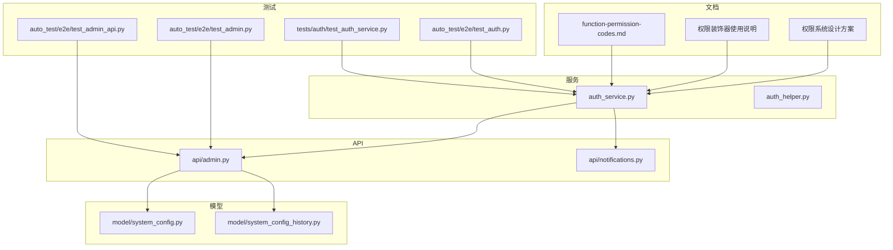
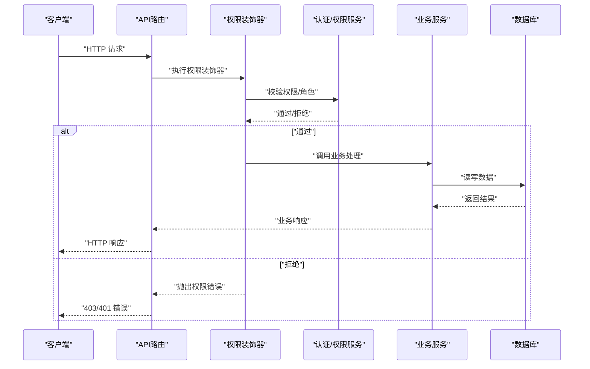
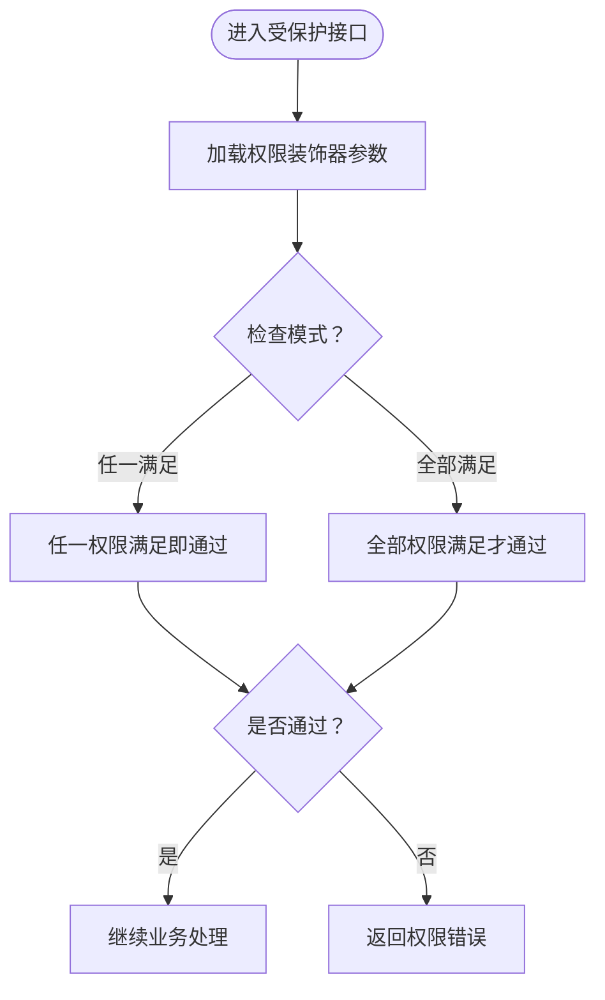
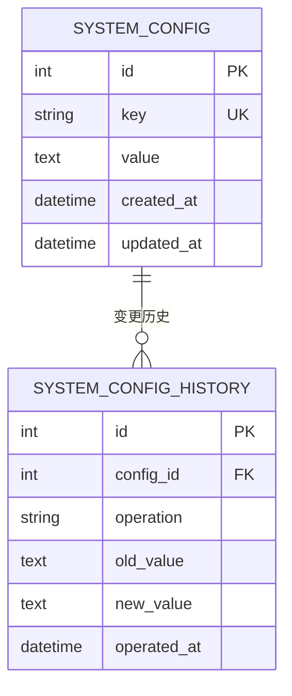
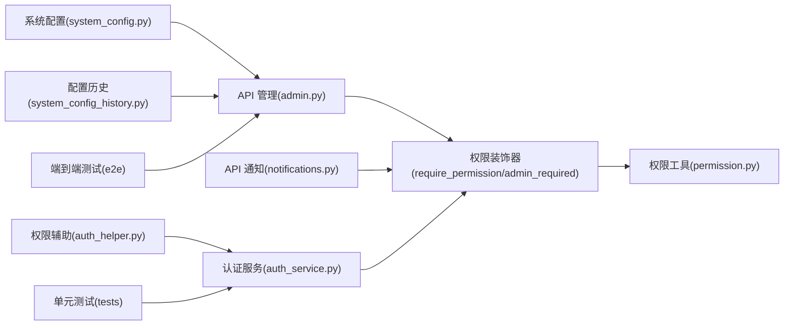

# 权限配置管理

<cite>
**本文引用的文件**
- [权限系统设计方案](file://docs/权限系统/权限系统设计.md)
- [权限装饰器使用说明](file://docs/权限系统/权限装饰器使用说明.md)
- [function-permission-codes.md](file://docs/权限系统/function-permission-codes.md)
- [permission.py](file://perseids_server/utils/permission.py)
- [auth_service.py](file://perseids_server/services/auth_service.py)
- [auth_helper.py](file://script_writer_core/auth_helper.py)
- [admin.py](file://api/admin.py)
- [notifications.py](file://api/notifications.py)
- [system_config_history.py](file://model/system_config_history.py)
- [system_config.py](file://model/system_config.py)
- [test_auth.py](file://auto_test/e2e/test_auth.py)
- [test_admin.py](file://auto_test/e2e/test_admin.py)
- [test_admin_api.py](file://auto_test/e2e/test_admin_api.py)
- [test_auth_service.py](file://tests/auth/test_auth_service.py)
</cite>

## 目录
1. [引言](#引言)
2. [项目结构](#项目结构)
3. [核心组件](#核心组件)
4. [架构总览](#架构总览)
5. [详细组件分析](#详细组件分析)
6. [依赖分析](#依赖分析)
7. [性能考虑](#性能考虑)
8. [故障排查指南](#故障排查指南)
9. [结论](#结论)
10. [附录](#附录)

## 引言
本文件面向权限配置管理的技术文档，围绕权限系统的配置架构、权限代码定义、权限分类与层级结构展开；结合现有代码库中的权限装饰器、管理员权限控制、以及系统配置历史等能力，给出权限配置的管理方式（新增、修改、删除、批量）、权限与功能模块映射关系（API 接口、页面访问、操作按钮）、版本管理与配置同步、导入导出与迁移备份、跨环境管理策略及最佳实践。

## 项目结构
权限相关能力主要分布在以下区域：
- 文档层：权限系统设计方案、权限装饰器使用说明、权限代码清单
- 服务层：认证与权限辅助工具
- API 层：管理员接口、通知接口等
- 模型层：系统配置与配置历史
- 测试层：认证与管理员相关端到端测试

图表来源
- [权限系统设计方案](file://docs/权限系统/权限系统设计.md)
- [权限装饰器使用说明](file://docs/权限系统/权限装饰器使用说明.md)
- [function-permission-codes.md](file://docs/权限系统/function-permission-codes.md)
- [auth_service.py](file://perseids_server/services/auth_service.py)
- [auth_helper.py](file://script_writer_core/auth_helper.py)
- [admin.py](file://api/admin.py)
- [notifications.py](file://api/notifications.py)
- [system_config.py](file://model/system_config.py)
- [system_config_history.py](file://model/system_config_history.py)
- [test_auth.py](file://auto_test/e2e/test_auth.py)
- [test_admin.py](file://auto_test/e2e/test_admin.py)
- [test_admin_api.py](file://auto_test/e2e/test_admin_api.py)
- [test_auth_service.py](file://tests/auth/test_auth_service.py)

章节来源
- [权限系统设计方案](file://docs/权限系统/权限系统设计.md)
- [权限装饰器使用说明](file://docs/权限系统/权限装饰器使用说明.md)
- [function-permission-codes.md](file://docs/权限系统/function-permission-codes.md)

## 核心组件
- 权限装饰器与权限检查：通过装饰器在 API 层实现细粒度权限控制，支持“任一满足”和“全部满足”的检查模式。
- 管理员权限控制：在 API 层对管理员专属接口进行角色校验，拒绝非管理员访问。
- 认证与权限辅助：提供认证服务与脚本作者权限辅助工具，支撑权限上下文构建。
- 系统配置与历史：系统配置表与配置历史表为权限配置的持久化与版本化提供基础。
- 端到端测试：覆盖认证流程与管理员接口的测试用例，保障权限控制行为正确性。

章节来源
- [权限装饰器使用说明](file://docs/权限系统/权限装饰器使用说明.md)
- [admin.py](file://api/admin.py)
- [auth_service.py](file://perseids_server/services/auth_service.py)
- [auth_helper.py](file://script_writer_core/auth_helper.py)
- [system_config.py](file://model/system_config.py)
- [system_config_history.py](file://model/system_config_history.py)
- [test_auth.py](file://auto_test/e2e/test_auth.py)
- [test_admin.py](file://auto_test/e2e/test_admin.py)
- [test_admin_api.py](file://auto_test/e2e/test_admin_api.py)
- [test_auth_service.py](file://tests/auth/test_auth_service.py)

## 架构总览
下图展示从请求进入 API 层，到权限装饰器与管理员校验、再到业务处理的整体流程。

图表来源
- [permission.py](file://perseids_server/utils/permission.py)
- [auth_service.py](file://perseids_server/services/auth_service.py)
- [admin.py](file://api/admin.py)

## 详细组件分析

### 权限代码定义与分类
- 权限代码采用“模块:动作”命名规范，便于按功能模块归类与检索。
- 权限清单覆盖系统配置、文件管理、AI 工具历史等多个模块，形成完整的权限矩阵。
- 权限具备状态字段，支持启用/禁用，便于灰度与回滚。

章节来源
- [function-permission-codes.md](file://docs/权限系统/function-permission-codes.md)
- [权限系统设计方案](file://docs/权限系统/权限系统设计.md)

### 权限层级结构
- 初版权限模型（用户-权限组-权限）：用户通过权限组间接获得权限，权限组可集中管理与分配。
- 加强版权限模型（增加用户组）：用户组作为用户集合，进一步提升权限分配的灵活性与可维护性。

章节来源
- [权限系统设计方案](file://docs/权限系统/权限系统设计.md)

### 权限装饰器与管理员校验
- require_permission：支持单个或多个权限代码，支持“任一满足/全部满足”两种检查模式。
- admin_required：对管理员专属接口进行角色校验，拒绝非管理员访问，并避免管理员自我降权等边界情况。

图表来源
- [权限装饰器使用说明](file://docs/权限系统/权限装饰器使用说明.md)
- [permission.py](file://perseids_server/utils/permission.py)
- [admin.py](file://api/admin.py)

章节来源
- [权限装饰器使用说明](file://docs/权限系统/权限装饰器使用说明.md)
- [permission.py](file://perseids_server/utils/permission.py)
- [admin.py](file://api/admin.py)

### 权限与功能模块映射
- API 接口权限：通过 require_permission 装饰器绑定到具体接口，实现接口级权限控制。
- 页面访问权限：前端页面通过后端接口返回的权限信息决定显示与交互能力。
- 操作按钮权限：按钮级权限可通过接口返回的权限集合动态控制按钮可用性。

章节来源
- [权限装饰器使用说明](file://docs/权限系统/权限装饰器使用说明.md)
- [admin.py](file://api/admin.py)

### 权限配置管理方式
- 新增：在权限清单中定义新权限代码，必要时扩展权限组/用户组以承载新权限。
- 修改：调整权限状态（启用/禁用）或权限组成员，影响用户实际权限。
- 删除：禁用不再使用的权限或移除权限组成员，避免权限泄露。
- 批量操作：通过权限组/用户组进行批量权限分配与回收，降低运维成本。

章节来源
- [权限系统设计方案](file://docs/权限系统/权限系统设计.md)
- [function-permission-codes.md](file://docs/权限系统/function-permission-codes.md)

### 版本管理与配置同步
- 系统配置历史：系统配置表与配置历史表为权限相关配置的变更提供持久化与审计基础。
- 配置同步：通过系统配置表统一管理权限相关开关与参数，结合历史表追踪变更轨迹。
- 回滚策略：基于配置历史表的变更记录，可快速定位并回滚到上一个稳定版本。

图表来源
- [system_config.py](file://model/system_config.py)
- [system_config_history.py](file://model/system_config_history.py)

章节来源
- [system_config.py](file://model/system_config.py)
- [system_config_history.py](file://model/system_config_history.py)

### 导入导出与迁移备份
- 导出：可将权限清单、权限组/用户组配置与系统配置导出为结构化数据，便于备份与迁移。
- 迁移：在不同环境间迁移权限配置时，先导入目标环境的基线，再应用差异变更。
- 备份：结合系统配置历史表，定期备份权限相关配置快照，确保可恢复性。

章节来源
- [system_config.py](file://model/system_config.py)
- [system_config_history.py](file://model/system_config_history.py)

### 不同环境下的管理策略
- 开发环境：权限配置可灵活调整，便于联调与测试；建议开启更多调试与预览权限。
- 测试环境：与生产保持一致的权限基线，重点验证权限组合与边界场景。
- 生产环境：严格遵循最小权限原则，限制敏感接口访问，强化审计与告警。

章节来源
- [权限系统设计方案](file://docs/权限系统/权限系统设计.md)

### 最佳实践
- 权限最小化：仅授予完成任务所需的最小权限集合。
- 定期审查：定期清理长期未使用的权限与权限组，降低攻击面。
- 安全审计：启用权限变更审计日志，对敏感操作进行二次确认。
- 自动化测试：通过端到端测试覆盖关键权限路径，防止回归问题。

章节来源
- [test_auth.py](file://auto_test/e2e/test_auth.py)
- [test_admin.py](file://auto_test/e2e/test_admin.py)
- [test_admin_api.py](file://auto_test/e2e/test_admin_api.py)
- [test_auth_service.py](file://tests/auth/test_auth_service.py)

## 依赖分析
权限系统各组件之间的依赖关系如下：

图表来源
- [permission.py](file://perseids_server/utils/permission.py)
- [admin.py](file://api/admin.py)
- [notifications.py](file://api/notifications.py)
- [auth_service.py](file://perseids_server/services/auth_service.py)
- [auth_helper.py](file://script_writer_core/auth_helper.py)
- [system_config.py](file://model/system_config.py)
- [system_config_history.py](file://model/system_config_history.py)
- [test_auth.py](file://auto_test/e2e/test_auth.py)
- [test_admin.py](file://auto_test/e2e/test_admin.py)
- [test_admin_api.py](file://auto_test/e2e/test_admin_api.py)
- [test_auth_service.py](file://tests/auth/test_auth_service.py)

章节来源
- [permission.py](file://perseids_server/utils/permission.py)
- [admin.py](file://api/admin.py)
- [notifications.py](file://api/notifications.py)
- [auth_service.py](file://perseids_server/services/auth_service.py)
- [auth_helper.py](file://script_writer_core/auth_helper.py)
- [system_config.py](file://model/system_config.py)
- [system_config_history.py](file://model/system_config_history.py)
- [test_auth.py](file://auto_test/e2e/test_auth.py)
- [test_admin.py](file://auto_test/e2e/test_admin.py)
- [test_admin_api.py](file://auto_test/e2e/test_admin_api.py)
- [test_auth_service.py](file://tests/auth/test_auth_service.py)

## 性能考虑
- 权限检查开销：在高频接口上谨慎使用复杂权限组合，优先采用“任一满足”模式减少判断成本。
- 缓存策略：对权限清单与用户权限集合进行短期缓存，降低数据库查询压力。
- 批量操作优化：权限组/用户组的批量分配与回收应采用事务与批量写入，避免多次往返。

## 故障排查指南
- 权限不足：确认请求用户是否具备所需权限代码，检查权限组/用户组是否正确分配。
- 管理员接口报错：检查用户角色是否为管理员，避免自我降权等边界逻辑触发。
- 权限装饰器不生效：确认装饰器参数与检查模式设置正确，核对权限代码拼写与模块归属。
- 配置未生效：检查系统配置表与历史表的变更记录，确认同步流程与回滚策略是否正确执行。

章节来源
- [admin.py](file://api/admin.py)
- [notifications.py](file://api/notifications.py)
- [permission.py](file://perseids_server/utils/permission.py)
- [system_config.py](file://model/system_config.py)
- [system_config_history.py](file://model/system_config_history.py)

## 结论
本权限配置管理体系以“权限代码+装饰器+管理员校验+配置历史”为核心，实现了从权限定义、分配、控制到审计与回滚的闭环。结合最小权限、定期审查与自动化测试的最佳实践，可在保证安全性的同时提升运维效率与系统稳定性。

## 附录
- 权限代码清单参考：[function-permission-codes.md](file://docs/权限系统/function-permission-codes.md)
- 权限装饰器使用参考：[权限装饰器使用说明](file://docs/权限系统/权限装饰器使用说明.md)
- 权限系统设计参考：[权限系统设计方案](file://docs/权限系统/权限系统设计.md)