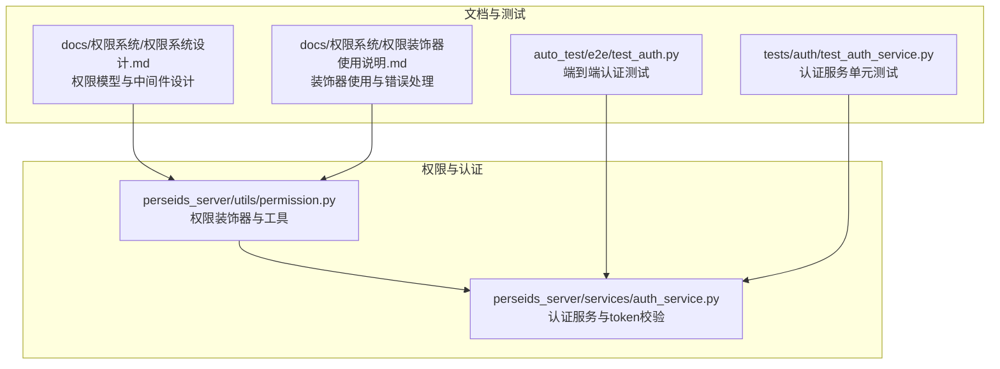
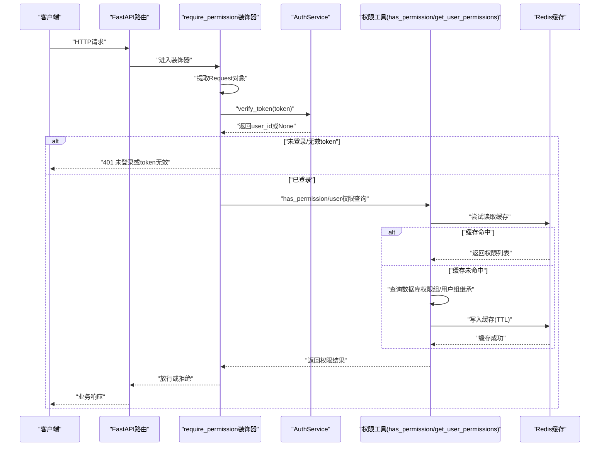
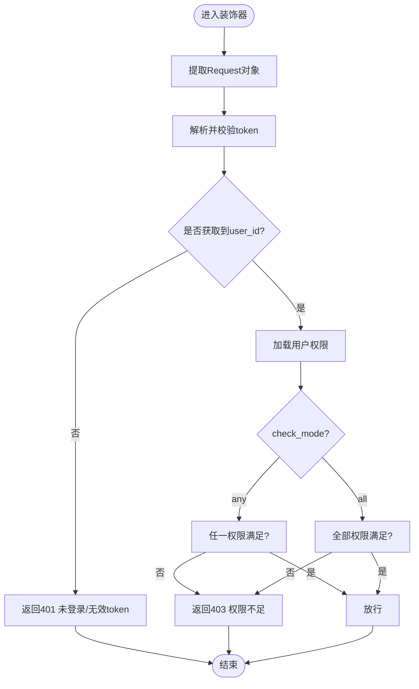
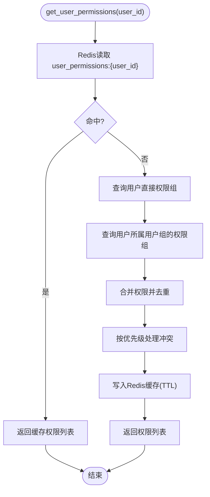
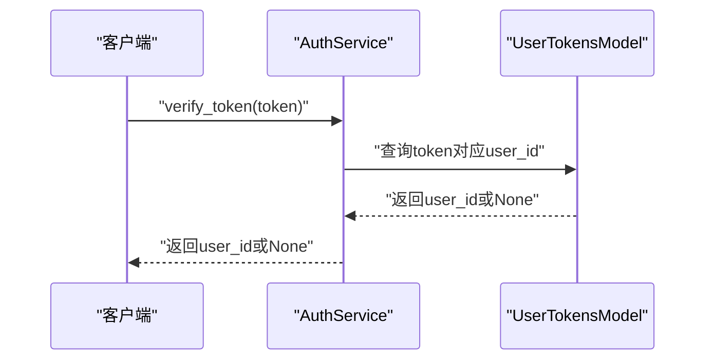
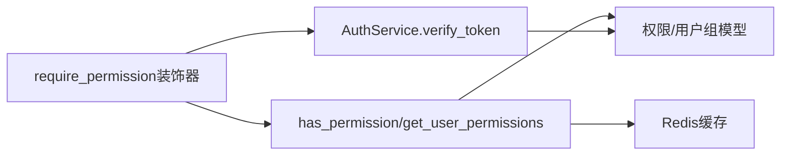

# 权限验证机制

<cite>
**本文引用的文件**
- [perseids_server/utils/permission.py](file://perseids_server/utils/permission.py)
- [perseids_server/services/auth_service.py](file://perseids_server/services/auth_service.py)
- [docs/权限系统/权限系统设计.md](file://docs/权限系统/权限系统设计.md)
- [docs/权限系统/权限装饰器使用说明.md](file://docs/权限系统/权限装饰器使用说明.md)
- [auto_test/e2e/test_auth.py](file://auto_test/e2e/test_auth.py)
- [tests/auth/test_auth_service.py](file://tests/auth/test_auth_service.py)
</cite>

## 目录
1. [引言](#引言)
2. [项目结构](#项目结构)
3. [核心组件](#核心组件)
4. [架构总览](#架构总览)
5. [详细组件分析](#详细组件分析)
6. [依赖分析](#依赖分析)
7. [性能考虑](#性能考虑)
8. [故障排查指南](#故障排查指南)
9. [结论](#结论)
10. [附录](#附录)

## 引言
本文件面向权限验证机制的技术文档，围绕 has_permission 与 get_user_permissions 两个核心函数，系统阐述用户权限查询、权限组继承与权限合并算法；深入解析权限缓存机制的设计思路（含Redis策略、失效与一致性）；完整梳理权限验证流程（token解析、身份确认、权限查询、权限检查、结果缓存）；并给出性能优化策略（批量查询、缓存预热、查询优化）、错误处理与日志记录机制，以及在API接口保护、资源访问控制、操作权限验证等场景中的应用。

## 项目结构
权限相关能力主要分布在以下模块：
- 权限装饰器与工具：perseids_server/utils/permission.py
- 认证服务与token校验：perseids_server/services/auth_service.py
- 权限系统设计与中间件参考：docs/权限系统/权限系统设计.md
- 装饰器使用与错误处理说明：docs/权限系统/权限装饰器使用说明.md
- 测试用例：auto_test/e2e/test_auth.py、tests/auth/test_auth_service.py

图表来源
- [perseids_server/utils/permission.py:1-163](file://perseids_server/utils/permission.py#L1-L163)
- [perseids_server/services/auth_service.py:1-685](file://perseids_server/services/auth_service.py#L1-L685)
- [docs/权限系统/权限系统设计.md:1-222](file://docs/权限系统/权限系统设计.md#L1-L222)
- [docs/权限系统/权限装饰器使用说明.md:1-270](file://docs/权限系统/权限装饰器使用说明.md#L1-L270)
- [auto_test/e2e/test_auth.py](file://auto_test/e2e/test_auth.py)
- [tests/auth/test_auth_service.py](file://tests/auth/test_auth_service.py)

章节来源
- [perseids_server/utils/permission.py:1-163](file://perseids_server/utils/permission.py#L1-L163)
- [perseids_server/services/auth_service.py:1-685](file://perseids_server/services/auth_service.py#L1-L685)
- [docs/权限系统/权限系统设计.md:1-222](file://docs/权限系统/权限系统设计.md#L1-L222)
- [docs/权限系统/权限装饰器使用说明.md:1-270](file://docs/权限系统/权限装饰器使用说明.md#L1-L270)
- [auto_test/e2e/test_auth.py](file://auto_test/e2e/test_auth.py)
- [tests/auth/test_auth_service.py](file://tests/auth/test_auth_service.py)

## 核心组件
- 权限装饰器 require_permission 与 admin_required：提供API层的权限拦截与校验入口，当前为占位实现，后续需接入token解析与权限查询。
- 权限工具函数 has_permission 与 get_user_permissions：提供权限判定与用户权限列表查询的抽象接口，当前为占位实现，后续需实现权限组继承与合并算法。
- 认证服务 AuthService：提供 token 校验、用户信息获取、登录/登出、token日志等能力，是权限验证流程中的身份确认环节。
- 权限系统设计文档：定义了权限模型、权限组与用户组的关系、权限合并与优先级规则，以及Redis缓存策略与中间件参考实现。

章节来源
- [perseids_server/utils/permission.py:14-163](file://perseids_server/utils/permission.py#L14-L163)
- [perseids_server/services/auth_service.py:493-520](file://perseids_server/services/auth_service.py#L493-L520)
- [docs/权限系统/权限系统设计.md:72-222](file://docs/权限系统/权限系统设计.md#L72-L222)

## 架构总览
权限验证的整体流程如下：
- 请求进入：FastAPI路由接收请求，权限装饰器提取Request对象。
- 身份确认：AuthService.verify_token 解析并校验token，返回用户ID。
- 权限查询：has_permission/get_user_permissions 查询用户权限（占位实现，后续接入数据库与Redis）。
- 权限检查：根据 check_mode（any/all）进行权限判定。
- 结果缓存：将用户权限列表写入Redis缓存，设置合理TTL。
- 返回响应：通过装饰器或中间件放行或返回401/403/500。

图表来源
- [perseids_server/utils/permission.py:36-67](file://perseids_server/utils/permission.py#L36-L67)
- [perseids_server/services/auth_service.py:493-520](file://perseids_server/services/auth_service.py#L493-L520)
- [docs/权限系统/权限系统设计.md:81-122](file://docs/权限系统/权限系统设计.md#L81-L122)

## 详细组件分析

### 权限装饰器与中间件
- require_permission：支持单权限或多权限（any/all），当前为占位实现，需补充token解析、用户ID获取、权限查询与判定逻辑。
- admin_required：管理员权限占位实现，后续需接入管理员判定。
- 权限中间件参考：文档提供了基于Redis缓存与数据库回退的中间件实现思路，可作为装饰器实现的参考。

图表来源
- [perseids_server/utils/permission.py:36-67](file://perseids_server/utils/permission.py#L36-L67)
- [docs/权限系统/权限系统设计.md:81-122](file://docs/权限系统/权限系统设计.md#L81-L122)

章节来源
- [perseids_server/utils/permission.py:14-163](file://perseids_server/utils/permission.py#L14-L163)
- [docs/权限系统/权限系统设计.md:81-122](file://docs/权限系统/权限系统设计.md#L81-L122)

### 权限工具函数：has_permission 与 get_user_permissions
- has_permission：对单个权限进行判定，当前为占位实现，后续需实现“用户直接权限组”与“用户组权限组”的继承查询，并结合Redis缓存。
- get_user_permissions：返回用户权限列表，当前为占位实现，后续需实现：
  - 从缓存读取（Redis key=user_permissions:{user_id}）
  - 缓存未命中时，查询用户直接绑定的权限组，再查询用户所属用户组对应的权限组
  - 合并去重，按优先级处理冲突（用户直接权限优先于用户组权限）
  - 写入缓存并设置TTL
- clear_user_permission_cache：清理用户权限缓存，权限变更后调用以保证一致性。

图表来源
- [perseids_server/utils/permission.py:90-124](file://perseids_server/utils/permission.py#L90-L124)
- [docs/权限系统/权限系统设计.md:211-222](file://docs/权限系统/权限系统设计.md#L211-L222)

章节来源
- [perseids_server/utils/permission.py:70-124](file://perseids_server/utils/permission.py#L70-L124)
- [docs/权限系统/权限系统设计.md:211-222](file://docs/权限系统/权限系统设计.md#L211-L222)

### 认证服务与token解析
- AuthService.verify_token：从UserTokensModel中解析并校验token，返回user_id或None。
- AuthService.get_user_by_token：在verify_token基础上获取用户对象。
- 登录/登出/重置密码等流程：提供完整的认证生命周期支持，为权限验证提供基础。

图表来源
- [perseids_server/services/auth_service.py:493-520](file://perseids_server/services/auth_service.py#L493-L520)

章节来源
- [perseids_server/services/auth_service.py:493-520](file://perseids_server/services/auth_service.py#L493-L520)

### 权限系统设计与数据模型
- 权限表、权限组表、权限组-权限关联表、用户-权限组关联表：构成初版权限模型。
- 用户组表、用户-用户组关联表、用户组-权限组关联表：构成加强版权限模型，支持用户组继承与更复杂的权限合并。
- 权限验证中间件参考：展示了Redis缓存与数据库回退的实现思路。

章节来源
- [docs/权限系统/权限系统设计.md:1-222](file://docs/权限系统/权限系统设计.md#L1-L222)

### 装饰器使用与错误处理
- 装饰器使用示例：require_permission、admin_required的基本用法与多权限校验模式（any/all）。
- 错误处理：装饰器可能抛出401、403、500等HTTP异常，需在上层统一捕获与记录。

章节来源
- [docs/权限系统/权限装饰器使用说明.md:1-270](file://docs/权限系统/权限装饰器使用说明.md#L1-L270)

## 依赖分析
- 权限装饰器依赖：
  - FastAPI Request对象提取
  - AuthService.verify_token 进行身份确认
  - 权限工具函数 has_permission/get_user_permissions 进行权限查询
  - Redis 缓存（后续实现）
- 权限工具函数依赖：
  - 权限模型（权限表、权限组表、用户-权限组关联表、用户组相关表）
  - Redis 缓存
- 认证服务依赖：
  - UsersModel、UserTokensModel、VerifyCodesModel 等模型

图表来源
- [perseids_server/utils/permission.py:36-67](file://perseids_server/utils/permission.py#L36-L67)
- [perseids_server/services/auth_service.py:493-520](file://perseids_server/services/auth_service.py#L493-L520)
- [docs/权限系统/权限系统设计.md:81-122](file://docs/权限系统/权限系统设计.md#L81-L122)

章节来源
- [perseids_server/utils/permission.py:14-163](file://perseids_server/utils/permission.py#L14-L163)
- [perseids_server/services/auth_service.py:1-685](file://perseids_server/services/auth_service.py#L1-L685)
- [docs/权限系统/权限系统设计.md:1-222](file://docs/权限系统/权限系统设计.md#L1-L222)

## 性能考虑
- 批量查询：在高并发场景下，建议对用户权限进行批量预热，减少缓存抖动。
- 缓存预热：在用户登录成功后，主动调用 get_user_permissions 预热Redis缓存。
- 查询优化：
  - 使用索引：权限表按模块与状态索引，权限组-权限关联表按(group_id, permission_id)唯一索引。
  - 合并去重：采用集合运算，避免重复扫描。
  - 优先级处理：用户直接权限优先于用户组权限，减少不必要的查询。
- 缓存策略：
  - TTL设置：建议1小时，结合业务热点与变更频率动态调整。
  - 缓存失效：权限变更时调用 clear_user_permission_cache 清理缓存，确保一致性。
  - 缓存穿透：对不存在权限的用户也写入空列表或短TTL，防止持续击穿。

## 故障排查指南
- 401 未登录/无效token
  - 检查请求头中token是否正确传递
  - 核对 AuthService.verify_token 的返回值
- 403 权限不足
  - 检查用户是否拥有所需权限（any/all模式）
  - 确认权限组与用户组继承链是否正确
- 500 内部错误
  - 装饰器无法获取Request对象时会抛出500，需检查路由装饰器顺序与参数传递
- 日志记录
  - 装饰器与工具函数均包含日志输出，便于定位问题
  - 建议在生产环境开启DEBUG级别日志，配合统一日志平台检索

章节来源
- [perseids_server/utils/permission.py:50-52](file://perseids_server/utils/permission.py#L50-L52)
- [docs/权限系统/权限装饰器使用说明.md:243-251](file://docs/权限系统/权限装饰器使用说明.md#L243-L251)

## 结论
当前权限验证框架已具备装饰器与工具函数的骨架，认证服务提供token解析能力。下一步的关键任务是完善权限工具函数的实现，接入权限模型与Redis缓存，建立完善的权限继承与合并算法，并配套批量预热、缓存失效与一致性保障机制。通过上述改进，可在保证安全性的前提下显著提升权限验证的性能与稳定性。

## 附录
- 场景应用
  - API接口保护：在路由上添加 require_permission 装饰器，按模块与操作粒度控制访问。
  - 资源访问控制：结合用户组权限组继承，实现跨模块的资源授权。
  - 操作权限验证：在业务方法内调用 has_permission 进行细粒度权限判定。
- 测试参考
  - 自动化测试覆盖认证流程与权限装饰器行为，确保变更不破坏既有功能。

章节来源
- [auto_test/e2e/test_auth.py](file://auto_test/e2e/test_auth.py)
- [tests/auth/test_auth_service.py](file://tests/auth/test_auth_service.py)