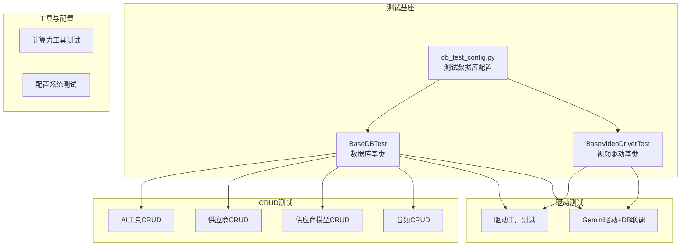
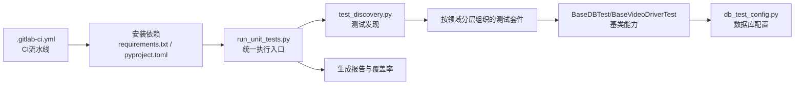
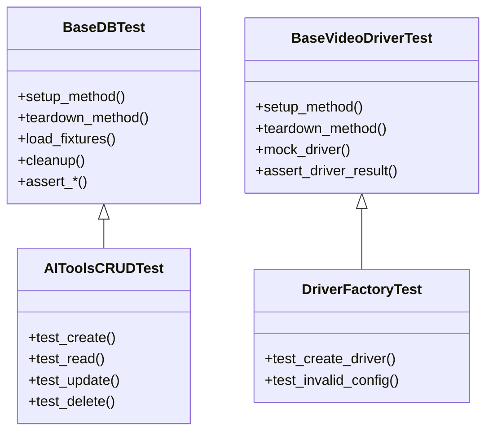
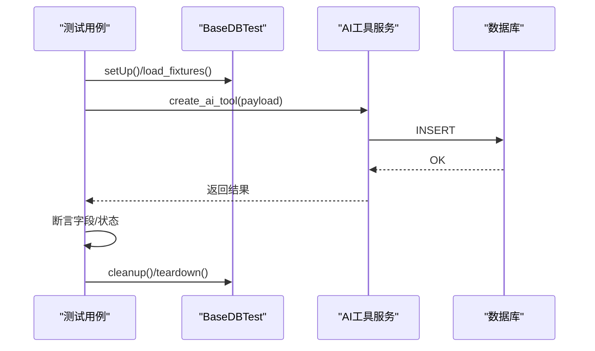
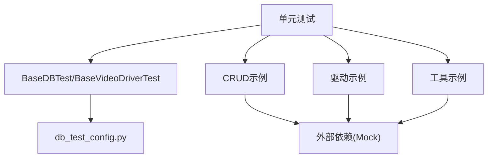

# 单元测试

<cite>
**本文引用的文件**
- [tests/base/base_db_test.py](file://tests/base/base_db_test.py)
- [tests/base/base_video_driver_test.py](file://tests/base/base_video_driver_test.py)
- [tests/base/db_test_config.py](file://tests/base/db_test_config.py)
- [tests/test_db_connection.py](file://tests/test_db_connection.py)
- [tests/crud/test_ai_tools_crud.py](file://tests/crud/test_ai_tools_crud.py)
- [tests/crud/test_ai_audio_crud.py](file://tests/crud/test_ai_audio_crud.py)
- [tests/crud/test_vendor_crud.py](file://tests/crud/test_vendor_crud.py)
- [tests/crud/test_vendor_model_crud.py](file://tests/crud/test_vendor_model_crud.py)
- [tests/drivers/test_driver_factory.py](file://tests/drivers/test_driver_factory.py)
- [tests/driver_integration/test_gemini_driver_with_db.py](file://tests/driver_integration/test_gemini_driver_with_db.py)
- [tests/utils/test_computing_power.py](file://tests/utils/test_computing_power.py)
- [scripts/testing/run_unit_tests.py](file://scripts/testing/run_unit_tests.py)
- [scripts/testing/test_discovery.py](file://scripts/testing/test_discovery.py)
- [scripts/testing/run_docker_tests.sh](file://scripts/testing/run_docker_tests.sh)
- [scripts/testing/run_driver_tests.sh](file://scripts/testing/run_driver_tests.sh)
- [.gitlab-ci.yml](file://.gitlab-ci.yml)
- [config_unit.base.yml](file://config_unit.base.yml)
- [requirements.txt](file://requirements.txt)
- [pyproject.toml](file://pyproject.toml)
</cite>

## 目录
1. [引言](#引言)
2. [项目结构](#项目结构)
3. [核心组件](#核心组件)
4. [架构总览](#架构总览)
5. [详细组件分析](#详细组件分析)
6. [依赖分析](#依赖分析)
7. [性能考虑](#性能考虑)
8. [故障排查指南](#故障排查指南)
9. [结论](#结论)
10. [附录](#附录)

## 引言
本文件面向ZhiJuTong项目的单元测试体系，系统性阐述测试设计理念与测试金字塔原则在本项目中的落地方式；明确测试用例的编写规范、命名约定与组织结构；详解测试基类（BaseDBTest、BaseVideoDriverTest）的设计模式与共享能力；说明Mock策略（外部依赖、数据库连接、API响应）；给出断言策略与测试数据准备（夹具与清理机制）；并通过AI工具CRUD、配置管理、计算力服务等核心功能的测试示例，帮助读者快速上手并高质量完成单元测试。

## 项目结构
单元测试主要位于tests目录下，按领域分层组织：
- base：测试基础设施与通用基类
- crud：核心业务CRUD测试
- drivers：驱动工厂与具体驱动测试
- driver_integration：驱动与数据库联调测试
- utils：通用工具函数测试
- config：配置系统测试
- model：模型相关测试
- services：服务层测试
- llm：大模型客户端测试
- 其他：认证、统计、任务等专项测试

**图表来源**
- [tests/base/base_db_test.py](file://tests/base/base_db_test.py)
- [tests/base/base_video_driver_test.py](file://tests/base/base_video_driver_test.py)
- [tests/base/db_test_config.py](file://tests/base/db_test_config.py)
- [tests/crud/test_ai_tools_crud.py](file://tests/crud/test_ai_tools_crud.py)
- [tests/crud/test_vendor_crud.py](file://tests/crud/test_vendor_crud.py)
- [tests/crud/test_vendor_model_crud.py](file://tests/crud/test_vendor_model_crud.py)
- [tests/drivers/test_driver_factory.py](file://tests/drivers/test_driver_factory.py)
- [tests/driver_integration/test_gemini_driver_with_db.py](file://tests/driver_integration/test_gemini_driver_with_db.py)
- [tests/utils/test_computing_power.py](file://tests/utils/test_computing_power.py)

**章节来源**
- [tests/README_UNIT_TESTS.md](file://tests/README_UNIT_TESTS.md)
- [tests/base/base_db_test.py](file://tests/base/base_db_test.py)
- [tests/base/base_video_driver_test.py](file://tests/base/base_video_driver_test.py)
- [tests/base/db_test_config.py](file://tests/base/db_test_config.py)

## 核心组件
- 测试基类与共享能力
  - BaseDBTest：提供数据库连接、事务回滚、会话管理、测试夹具加载与清理等通用能力，确保每个测试用例隔离且可重复。
  - BaseVideoDriverTest：提供视频驱动测试通用能力，如驱动实例化、参数校验、异步任务模拟等。
  - db_test_config.py：集中定义测试数据库连接字符串、迁移开关、回滚策略等配置项。
- 测试发现与执行
  - run_unit_tests.py：统一入口，负责收集测试、过滤标签、生成报告。
  - test_discovery.py：辅助扫描测试模块，支持按目录/文件规则自动发现。
  - run_docker_tests.sh / run_driver_tests.sh：容器化与驱动专项测试脚本。
- 持续集成
  - .gitlab-ci.yml：定义CI流水线，包含安装依赖、运行单元测试、覆盖率统计与报告上传。
  - config_unit.base.yml：单元测试环境配置模板，便于本地与CI复用。

**章节来源**
- [tests/base/base_db_test.py](file://tests/base/base_db_test.py)
- [tests/base/base_video_driver_test.py](file://tests/base/base_video_driver_test.py)
- [tests/base/db_test_config.py](file://tests/base/db_test_config.py)
- [scripts/testing/run_unit_tests.py](file://scripts/testing/run_unit_tests.py)
- [scripts/testing/test_discovery.py](file://scripts/testing/test_discovery.py)
- [.gitlab-ci.yml](file://.gitlab-ci.yml)
- [config_unit.base.yml](file://config_unit.base.yml)

## 架构总览
单元测试采用“基类+领域分层”的架构，通过基类抽象公共逻辑，避免重复；各领域测试专注于自身业务边界，确保职责单一、耦合度低。

**图表来源**
- [.gitlab-ci.yml](file://.gitlab-ci.yml)
- [scripts/testing/run_unit_tests.py](file://scripts/testing/run_unit_tests.py)
- [scripts/testing/test_discovery.py](file://scripts/testing/test_discovery.py)
- [tests/base/base_db_test.py](file://tests/base/base_db_test.py)
- [tests/base/base_video_driver_test.py](file://tests/base/base_video_driver_test.py)
- [tests/base/db_test_config.py](file://tests/base/db_test_config.py)
- [requirements.txt](file://requirements.txt)
- [pyproject.toml](file://pyproject.toml)

## 详细组件分析

### 测试基类设计模式：BaseDBTest 与 BaseVideoDriverTest
- 设计要点
  - 统一生命周期：setUp/tearDown中建立连接、开启事务、注册夹具、清理数据。
  - 隔离性保障：每个测试用例在独立事务中运行，失败后回滚，避免相互污染。
  - 可扩展性：通过钩子方法（如load_fixtures、cleanup）允许子类定制数据准备与清理。
  - 复用性：数据库连接、会话、工厂方法在基类中集中管理，减少重复代码。
- 继承关系
  - CRUD与工具类测试通常继承BaseDBTest。
  - 视频驱动相关测试可选择继承BaseVideoDriverTest或直接组合基类能力。
- 共享功能
  - 数据库连接与迁移控制（由db_test_config.py注入）
  - 事务回滚策略
  - 夹具加载与清理
  - 断言辅助方法（如断言字段存在、状态码、错误信息等）

**图表来源**
- [tests/base/base_db_test.py](file://tests/base/base_db_test.py)
- [tests/base/base_video_driver_test.py](file://tests/base/base_video_driver_test.py)
- [tests/crud/test_ai_tools_crud.py](file://tests/crud/test_ai_tools_crud.py)
- [tests/drivers/test_driver_factory.py](file://tests/drivers/test_driver_factory.py)

**章节来源**
- [tests/base/base_db_test.py](file://tests/base/base_db_test.py)
- [tests/base/base_video_driver_test.py](file://tests/base/base_video_driver_test.py)
- [tests/base/db_test_config.py](file://tests/base/db_test_config.py)

### Mock策略：外部依赖、数据库连接与API响应
- 外部依赖模拟
  - 使用unittest.mock对第三方HTTP客户端、存储客户端进行替换，确保测试不依赖真实网络或外部服务。
  - 对于驱动层，优先使用进程内Mock，避免真实硬件或云端服务波动影响测试稳定性。
- 数据库连接模拟
  - 在测试环境中使用独立的测试数据库实例或内存数据库，通过db_test_config.py切换连接串。
  - 所有写操作在事务中执行，失败即回滚，保证测试前后数据库状态一致。
- API响应模拟
  - 使用Mock对象返回预设响应，覆盖正常、异常、超时等场景，确保断言覆盖全面。
  - 对于异步任务，使用时间轴推进或回调触发，验证状态流转与幂等性。

**章节来源**
- [tests/base/db_test_config.py](file://tests/base/db_test_config.py)
- [tests/test_db_connection.py](file://tests/test_db_connection.py)

### 断言策略与测试数据准备
- 断言策略
  - 结构断言：断言返回结构字段完整性、类型正确性、枚举值范围。
  - 行为断言：断言函数调用次数、参数匹配、异常抛出、状态变更。
  - 性能断言：断言关键路径耗时阈值（如查询超时、批量处理耗时）。
- 测试数据准备
  - 夹具（Fixture）：在load_fixtures中加载最小必要数据，确保测试可重复。
  - 清理机制：在cleanup中删除新增记录，重置序列或索引，避免跨用例污染。
  - 参数化：使用pytest.mark.parametrize对边界值、非法输入、组合场景进行覆盖。

**章节来源**
- [tests/base/base_db_test.py](file://tests/base/base_db_test.py)
- [tests/crud/test_ai_tools_crud.py](file://tests/crud/test_ai_tools_crud.py)

### 测试金字塔原则在本项目的实践
- 单元层（最底层）：针对函数、工具方法、纯逻辑模块进行测试，强调快速、稳定、可重复。
- 集成层：针对服务、驱动与数据库交互进行测试，关注接口契约与数据一致性。
- 端到端层：针对关键业务流程（如AI工具工作流）进行测试，关注用户体验与业务闭环。
- 本项目现状：单元层与集成层占主导，端到端测试以自动化测试目录为主，形成完整金字塔。

**章节来源**
- [tests/README_UNIT_TESTS.md](file://tests/README_UNIT_TESTS.md)

### 具体测试示例

#### 示例一：AI工具CRUD测试
- 覆盖点
  - 创建：校验必填字段、唯一约束、默认值。
  - 查询：分页、排序、过滤条件。
  - 更新：字段更新、并发冲突处理。
  - 删除：软删除/硬删除策略、关联清理。
- 关键步骤
  - 继承BaseDBTest，准备夹具数据。
  - 使用Mock模拟外部依赖（如CDN、存储）。
  - 断言返回结构与数据库状态一致。
  - 清理测试数据，回滚事务。

**图表来源**
- [tests/base/base_db_test.py](file://tests/base/base_db_test.py)
- [tests/crud/test_ai_tools_crud.py](file://tests/crud/test_ai_tools_crud.py)

**章节来源**
- [tests/crud/test_ai_tools_crud.py](file://tests/crud/test_ai_tools_crud.py)
- [tests/base/base_db_test.py](file://tests/base/base_db_test.py)

#### 示例二：配置管理测试
- 覆盖点
  - 默认值与合并策略。
  - 环境变量覆盖优先级。
  - 配置热更新与缓存失效。
- 关键步骤
  - 使用Mock替换配置源（文件/远程），构造不同场景。
  - 断言最终生效配置与预期一致。
  - 验证异常配置的错误提示与降级行为。

**章节来源**
- [tests/config/test_unified_config_frontend.py](file://tests/config/test_unified_config_frontend.py)
- [tests/config/test_implementation_config.py](file://tests/config/test_implementation_config.py)

#### 示例三：计算力服务测试
- 覆盖点
  - 计费规则计算、阶梯价格、折扣叠加。
  - 退款与修改后的重新计费。
  - 并发场景下的幂等性与一致性。
- 关键步骤
  - 准备多笔交易与修改记录作为夹具。
  - 使用时间轴推进或Mock回调，验证最终账单。
  - 断言日志与余额变化符合预期。

**章节来源**
- [tests/utils/test_computing_power.py](file://tests/utils/test_computing_power.py)

#### 示例四：驱动工厂与驱动集成测试
- 覆盖点
  - 工厂根据配置创建正确驱动实例。
  - 驱动参数校验与异常处理。
  - 驱动与数据库联调：槽位占用、释放、并发竞争。
- 关键步骤
  - 继承BaseVideoDriverTest，Mock外部API。
  - 断言驱动行为与状态机一致。
  - 验证数据库侧槽位状态与日志记录。

**章节来源**
- [tests/drivers/test_driver_factory.py](file://tests/drivers/test_driver_factory.py)
- [tests/driver_integration/test_gemini_driver_with_db.py](file://tests/driver_integration/test_gemini_driver_with_db.py)
- [tests/base/base_video_driver_test.py](file://tests/base/base_video_driver_test.py)

### 测试用例编写规范、命名约定与组织结构
- 编写规范
  - 一个测试只验证一个行为或一条路径，保持简单明确。
  - 使用前置条件（Given）、操作（When）、期望（Then）三段式注释。
  - 对异常路径与边界值进行显式断言。
- 命名约定
  - 文件：test_xxx.py
  - 类：TestXxx（首字母大写）
  - 方法：test_xxx_behavior（动词短语）
- 组织结构
  - tests/<领域>/<模块>_test.py
  - 基础设施置于tests/base，避免重复

**章节来源**
- [tests/README_UNIT_TESTS.md](file://tests/README_UNIT_TESTS.md)

## 依赖分析
- 内部依赖
  - 测试基类依赖数据库配置与会话管理。
  - CRUD与驱动测试依赖工厂与Mock框架。
- 外部依赖
  - 第三方HTTP客户端、存储SDK、驱动SDK。
  - CI环境依赖Docker镜像与Python运行时。
- 耦合与风险
  - 过度依赖真实外部服务会降低稳定性与速度。
  - 数据库schema变更需同步更新夹具与断言。

**图表来源**
- [tests/base/base_db_test.py](file://tests/base/base_db_test.py)
- [tests/base/db_test_config.py](file://tests/base/db_test_config.py)
- [tests/crud/test_ai_tools_crud.py](file://tests/crud/test_ai_tools_crud.py)
- [tests/drivers/test_driver_factory.py](file://tests/drivers/test_driver_factory.py)
- [tests/utils/test_computing_power.py](file://tests/utils/test_computing_power.py)

**章节来源**
- [requirements.txt](file://requirements.txt)
- [pyproject.toml](file://pyproject.toml)

## 性能考虑
- 测试执行效率
  - 将I/O密集型测试（如外部API）全部Mock，避免真实等待。
  - 使用参数化与并发策略（在CI中合理拆分）提升吞吐。
- 数据准备效率
  - 复用夹具，减少重复插入；对大表使用增量数据。
- 报告与覆盖率
  - 仅对核心路径与分支进行覆盖率统计，避免过度追求100%导致维护成本上升。

## 故障排查指南
- 数据库连接失败
  - 检查db_test_config.py中的连接串与权限。
  - 确认测试数据库已初始化并可访问。
- 测试数据污染
  - 确保每个用例均在事务中运行并回滚。
  - 检查cleanup是否正确删除新增记录。
- Mock未生效
  - 确认替换路径与导入位置一致。
  - 检查是否遗漏side_effect或return_value设置。
- CI执行异常
  - 查看.gitlab-ci.yml中的步骤顺序与环境变量。
  - 核对requirements.txt与pyproject.toml版本一致性。

**章节来源**
- [tests/test_db_connection.py](file://tests/test_db_connection.py)
- [tests/base/base_db_test.py](file://tests/base/base_db_test.py)
- [.gitlab-ci.yml](file://.gitlab-ci.yml)
- [requirements.txt](file://requirements.txt)
- [pyproject.toml](file://pyproject.toml)

## 结论
本项目的单元测试体系以测试基类为核心，结合清晰的领域分层与Mock策略，实现了高隔离、高可重复、高可维护的测试工程化实践。建议在后续迭代中持续完善端到端覆盖与性能断言，同时保持测试金字塔的平衡，确保质量与效率的双重提升。

## 附录
- 测试执行流程
  - 本地：python -m pytest tests/<领域>/<模块>_test.py
  - 统一入口：scripts/testing/run_unit_tests.py
  - 容器化：scripts/testing/run_docker_tests.sh
  - 驱动专项：scripts/testing/run_driver_tests.sh
- 覆盖率与质量标准
  - 建议核心模块（CRUD、驱动、工具）覆盖率≥80%，关键路径≥90%。
  - 代码风格遵循项目pep8/pylint规则，提交前通过本地检查。
- 持续集成
  - .gitlab-ci.yml定义了安装、测试、覆盖率与报告的完整流程。

**章节来源**
- [scripts/testing/run_unit_tests.py](file://scripts/testing/run_unit_tests.py)
- [scripts/testing/run_docker_tests.sh](file://scripts/testing/run_docker_tests.sh)
- [scripts/testing/run_driver_tests.sh](file://scripts/testing/run_driver_tests.sh)
- [.gitlab-ci.yml](file://.gitlab-ci.yml)
- [config_unit.base.yml](file://config_unit.base.yml)