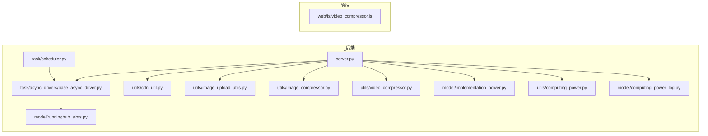
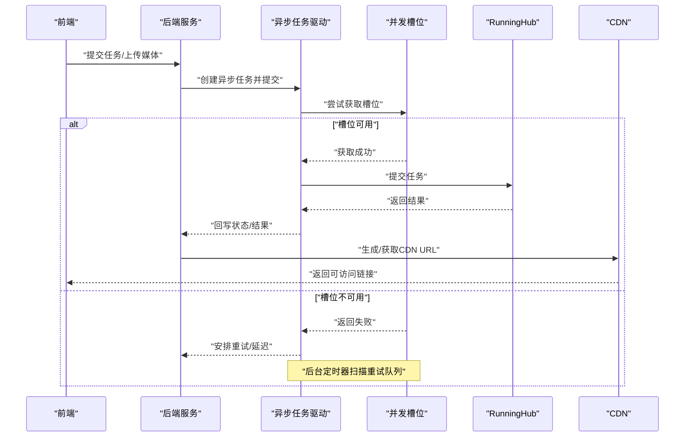
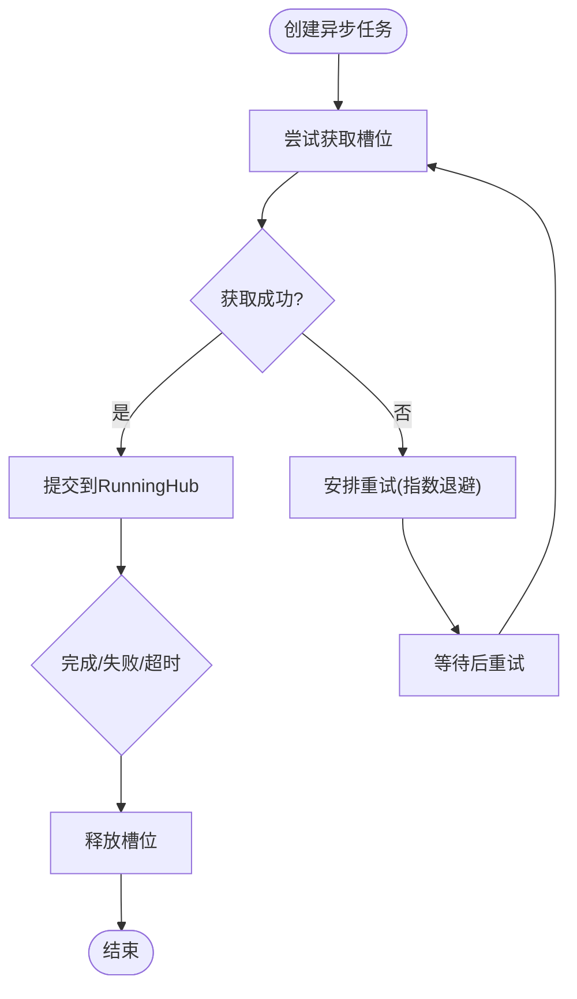
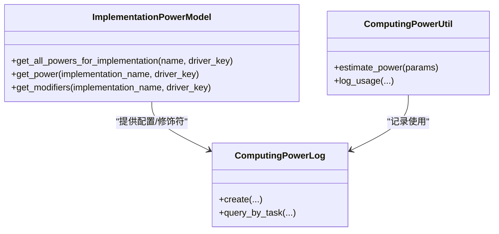
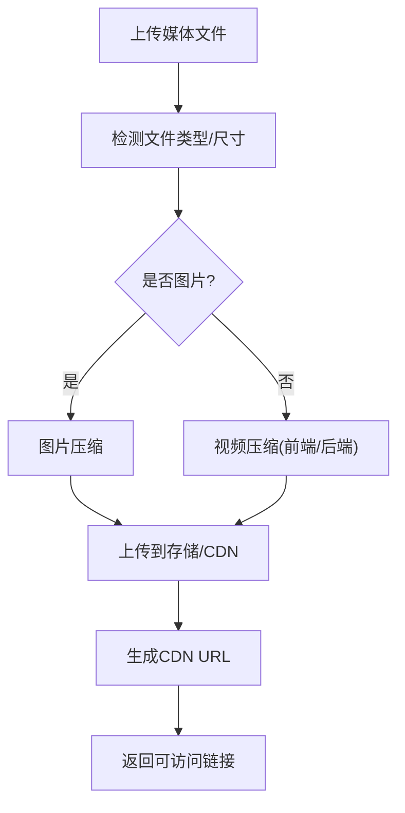
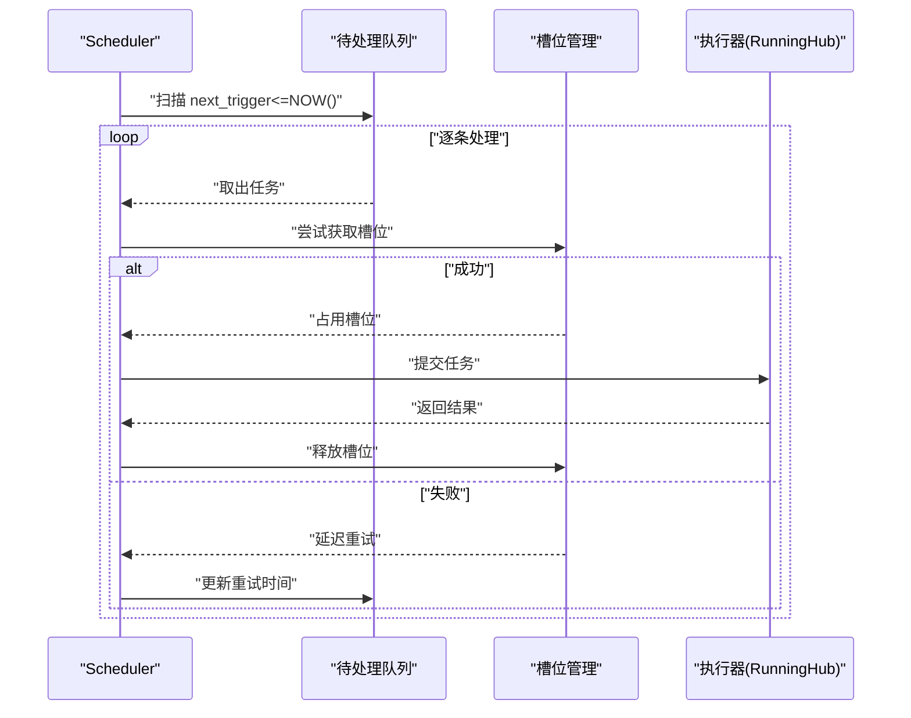
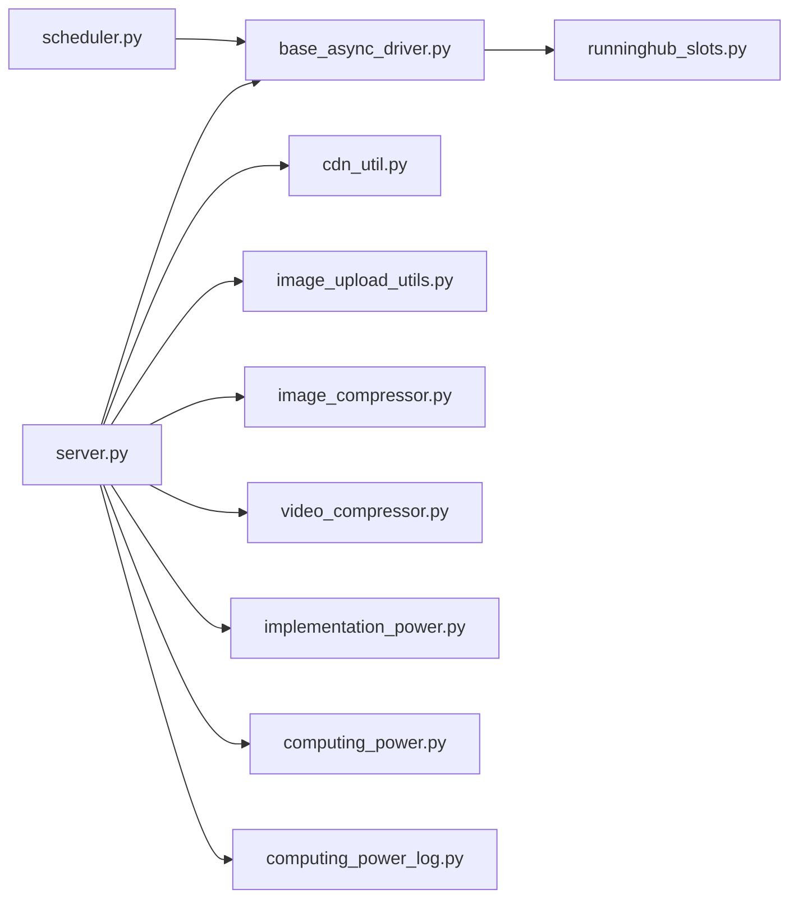

# 性能测试

<cite>
**本文引用的文件**
- [server.py](file://server.py)
- [runninghub_concurrency_control.md](file://docs/backend/runninghub_concurrency_control.md)
- [base_async_driver.py](file://task/async_drivers/base_async_driver.py)
- [runninghub_slots.py](file://model/runninghub_slots.py)
- [scheduler.py](file://task/scheduler.py)
- [video_compressor.js](file://web/js/video_compressor.js)
- [cdn_util.py](file://utils/cdn_util.py)
- [test_implementation_config.py](file://tests/config/test_implementation_config.py)
- [implementation_power.py](file://model/implementation_power.py)
- [test_cdn_storage.py](file://tests/cdn/test_cdn_storage.py)
- [test_ai_tools_cdn_sync.py](file://tests/cdn/test_ai_tools_cdn_sync.py)
- [test_ai_tools_cdn_integration.py](file://tests/cdn/test_ai_tools_cdn_integration.py)
- [test_image_upload_utils.py](file://tests/utils/test_image_upload_utils.py)
- [image_upload_utils.py](file://utils/image_upload_utils.py)
- [test_computing_power.py](file://tests/utils/test_computing_power.py)
- [test_computing_power_log.py](file://tests/model/test_computing_power_log.py)
- [test_async_task_submission.py](file://tests/task/test_async_task_submission.py)
- [test_pipeline_processor.py](file://tests/task/test_pipeline_processor.py)
- [test_driver_factory.py](file://tests/drivers/test_driver_factory.py)
- [test_runninghub_slot_release.py](file://tests/driver_integration/test_runninghub_slot_release.py)
- [run_unit_tests.py](file://scripts/testing/run_unit_tests.py)
- [unified_config.py](file://config/unified_config.py)
- [computing_power.py](file://utils/computing_power.py)
- [computing_power_log.py](file://model/computing_power_log.py)
- [media_file_mapping.py](file://model/media_file_mapping.py)
- [media_cache.py](file://utils/media_cache.py)
- [image_compressor.py](file://utils/image_compressor.py)
- [video_compressor.py](file://utils/video_compressor.py)
</cite>

## 目录
1. [引言](#引言)
2. [项目结构](#项目结构)
3. [核心组件](#核心组件)
4. [架构总览](#架构总览)
5. [详细组件分析](#详细组件分析)
6. [依赖关系分析](#依赖关系分析)
7. [性能考量](#性能考量)
8. [故障排查指南](#故障排查指南)
9. [结论](#结论)
10. [附录](#附录)

## 引言
本文件面向ZhiJuTong平台的性能测试工作，目标是建立一套系统化的性能测试体系，覆盖响应时间、吞吐量、并发处理能力与资源利用率等关键指标；并针对AI任务、媒体处理与异步任务三类场景，给出设计方法、测试策略、工具选型与优化建议。文档同时结合仓库现有并发控制、算力模型、CDN与前端压缩等实现，提供可落地的测试实践。

## 项目结构
ZhiJuTong采用后端Python服务+前端JS模块的分层架构，核心性能相关模块分布如下：
- 后端服务入口与路由：server.py
- 并发控制与异步任务：docs/backend/runninghub_concurrency_control.md、task/async_drivers/base_async_driver.py、model/runninghub_slots.py、task/scheduler.py
- 算力与计费：model/implementation_power.py、utils/computing_power.py、model/computing_power_log.py
- 媒体处理与CDN：web/js/video_compressor.js、utils/cdn_util.py、utils/image_upload_utils.py、utils/image_compressor.py、utils/video_compressor.py
- 测试与验证：tests/* 下的各类单元/集成测试

图表来源
- [server.py](file://server.py)
- [scheduler.py](file://task/scheduler.py)
- [base_async_driver.py](file://task/async_drivers/base_async_driver.py)
- [runninghub_slots.py](file://model/runninghub_slots.py)
- [cdn_util.py](file://utils/cdn_util.py)
- [image_upload_utils.py](file://utils/image_upload_utils.py)
- [image_compressor.py](file://utils/image_compressor.py)
- [video_compressor.py](file://utils/video_compressor.py)
- [implementation_power.py](file://model/implementation_power.py)
- [computing_power.py](file://utils/computing_power.py)
- [computing_power_log.py](file://model/computing_power_log.py)

章节来源
- [server.py](file://server.py)
- [runninghub_concurrency_control.md](file://docs/backend/runninghub_concurrency_control.md)

## 核心组件
- 并发槽位管理：通过runninghub_slots表与try_acquire_slot实现全局并发上限控制，保障RunningHub总并发不超限，并支持异步任务的重试与延迟机制。
- 异步任务驱动：base_async_driver封装异步任务创建、槽位申请、失败重试与结果回写，统一接入RunningHub。
- 算力配置与统计：implementation_power提供算力配置查询与修饰符解析；computing_power与computing_power_log用于算力消耗与计费记录。
- 媒体处理与CDN：前端video_compressor.js进行轻量视频压缩；后端image_upload_utils与image_compressor、video_compressor提供上传与压缩能力；cdn_util统一CDN配置与URL生成。
- 调度与清理：scheduler负责周期性任务扫描与提交；runninghub_slots的定时清理保障槽位健康。

章节来源
- [runninghub_slots.py:79-107](file://model/runninghub_slots.py#L79-L107)
- [base_async_driver.py:79-114](file://task/async_drivers/base_async_driver.py#L79-L114)
- [implementation_power.py:173-211](file://model/implementation_power.py#L173-L211)
- [computing_power.py](file://utils/computing_power.py)
- [computing_power_log.py](file://model/computing_power_log.py)
- [video_compressor.js:1-40](file://web/js/video_compressor.js#L1-L40)
- [cdn_util.py:1-76](file://utils/cdn_util.py#L1-L76)
- [scheduler.py](file://task/scheduler.py)

## 架构总览
下图展示性能测试关注的关键交互链路：前端触发媒体处理或AI任务，后端经异步任务驱动提交到RunningHub，受并发槽位控制与重试策略影响，最终通过CDN输出或落库统计。

图表来源
- [base_async_driver.py:79-114](file://task/async_drivers/base_async_driver.py#L79-L114)
- [runninghub_slots.py:79-107](file://model/runninghub_slots.py#L79-L107)
- [scheduler.py](file://task/scheduler.py)
- [cdn_util.py:52-76](file://utils/cdn_util.py#L52-L76)

## 详细组件分析

### 并发槽位与异步任务重试
- 槽位生命周期：异步任务创建即尝试获取槽位；提交成功后占用；完成后或失败/超时释放。
- 重试与延迟：当槽位满时，不直接失败，而是安排指数退避重试（30s→60s→120s→300s→300s），避免队列阻塞。
- 清理与监控：定时清理长时间占用的槽位，建议监控槽位使用率以指导扩容。

图表来源
- [runninghub_concurrency_control.md:57-64](file://docs/backend/runninghub_concurrency_control.md#L57-L64)
- [runninghub_concurrency_control.md:128-133](file://docs/backend/runninghub_concurrency_control.md#L128-L133)
- [base_async_driver.py:98-110](file://task/async_drivers/base_async_driver.py#L98-L110)

章节来源
- [runninghub_concurrency_control.md:37-64](file://docs/backend/runninghub_concurrency_control.md#L37-L64)
- [runninghub_concurrency_control.md:128-133](file://docs/backend/runninghub_concurrency_control.md#L128-L133)
- [base_async_driver.py:79-114](file://task/async_drivers/base_async_driver.py#L79-L114)
- [runninghub_slots.py:79-107](file://model/runninghub_slots.py#L79-L107)

### 算力消耗与资源利用率
- 算力配置：implementation_power提供按实现方与驱动键的算力配置查询，支持修饰符解析，便于不同场景下的资源估算。
- 算力统计：computing_power与computing_power_log用于记录与查询算力消耗，支撑成本与性能对比。
- 测试要点：通过不同输入规模与驱动组合，测量单位算力的响应时间、吞吐与资源占用，形成算力-性能基线。

图表来源
- [implementation_power.py:173-211](file://model/implementation_power.py#L173-L211)
- [computing_power.py](file://utils/computing_power.py)
- [computing_power_log.py](file://model/computing_power_log.py)

章节来源
- [implementation_power.py:173-211](file://model/implementation_power.py#L173-L211)
- [test_implementation_config.py:229-260](file://tests/config/test_implementation_config.py#L229-L260)
- [test_computing_power.py](file://tests/utils/test_computing_power.py)
- [test_computing_power_log.py](file://tests/model/test_computing_power_log.py)

### 媒体处理性能（图像压缩、视频转码、CDN传输）
- 前端视频压缩：基于Canvas与MediaRecorder，对短时视频进行缩放与重编码，适配移动端浏览器，降低上传体积。
- 后端压缩与上传：image_upload_utils提供同步/异步上传封装；image_compressor与video_compressor分别处理图片与视频压缩；cdn_util统一CDN配置与URL生成。
- 测试要点：以不同分辨率、码率、格式与文件大小为变量，测量压缩比、耗时、CPU/GPU占用与CDN下载时延。

图表来源
- [video_compressor.js:1-40](file://web/js/video_compressor.js#L1-L40)
- [image_upload_utils.py:490-525](file://utils/image_upload_utils.py#L490-L525)
- [cdn_util.py:52-76](file://utils/cdn_util.py#L52-L76)

章节来源
- [video_compressor.js:1-40](file://web/js/video_compressor.js#L1-L40)
- [image_upload_utils.py:490-525](file://utils/image_upload_utils.py#L490-L525)
- [cdn_util.py:1-76](file://utils/cdn_util.py#L1-L76)
- [test_cdn_storage.py](file://tests/cdn/test_cdn_storage.py)
- [test_ai_tools_cdn_sync.py](file://tests/cdn/test_ai_tools_cdn_sync.py)
- [test_ai_tools_cdn_integration.py](file://tests/cdn/test_ai_tools_cdn_integration.py)
- [test_image_upload_utils.py:234-275](file://tests/utils/test_image_upload_utils.py#L234-L275)

### 异步任务性能（队列处理、并发控制、资源竞争）
- 队列与调度：scheduler定期扫描待处理任务，按创建时间排序，配合槽位控制避免超限。
- 并发控制：try_acquire_slot统一管理全局并发，支持任务类型细分与来源区分。
- 资源竞争：通过延迟与重试避免队列拥堵；定时清理防止“幽灵槽位”。

图表来源
- [scheduler.py](file://task/scheduler.py)
- [runninghub_slots.py:79-107](file://model/runninghub_slots.py#L79-L107)
- [runninghub_concurrency_control.md:128-133](file://docs/backend/runninghub_concurrency_control.md#L128-L133)

章节来源
- [scheduler.py](file://task/scheduler.py)
- [runninghub_slots.py:79-107](file://model/runninghub_slots.py#L79-L107)
- [runninghub_concurrency_control.md:128-133](file://docs/backend/runninghub_concurrency_control.md#L128-L133)

## 依赖关系分析
- 组件耦合：异步任务驱动依赖槽位管理；服务层依赖算力配置与CDN工具；媒体处理模块依赖前端JS与后端压缩工具。
- 外部依赖：RunningHub作为外部执行引擎；CDN提供对象存储与加速；数据库保存任务状态与统计。
- 潜在环路：当前结构以服务层为中枢，未见明显循环依赖；需避免在驱动中直接反向依赖服务层。

图表来源
- [server.py](file://server.py)
- [base_async_driver.py](file://task/async_drivers/base_async_driver.py)
- [runninghub_slots.py](file://model/runninghub_slots.py)
- [cdn_util.py](file://utils/cdn_util.py)
- [image_upload_utils.py](file://utils/image_upload_utils.py)
- [image_compressor.py](file://utils/image_compressor.py)
- [video_compressor.py](file://utils/video_compressor.py)
- [implementation_power.py](file://model/implementation_power.py)
- [computing_power.py](file://utils/computing_power.py)
- [computing_power_log.py](file://model/computing_power_log.py)
- [scheduler.py](file://task/scheduler.py)

## 性能考量
- 指标体系
  - 响应时间：接口首包时间、任务完成时间、CDN下载时延
  - 吞吐量：单位时间内完成的任务数、上传/下载速率
  - 并发能力：最大并发槽位、队列长度、重试率
  - 资源利用率：CPU/GPU使用率、内存占用、磁盘I/O、网络带宽
- 设计方法
  - 负载测试：逐步提升并发与数据规模，观察响应时间与错误率拐点
  - 压力测试：超过峰值的极限负载，定位系统崩溃点与恢复时间
  - 稳定性测试：长时间高负载运行，监测资源漂移与异常增长
  - 容量规划：基于算力-性能曲线，确定扩容阈值与成本模型
- AI任务特殊考虑
  - 算力消耗：结合implementation_power的修饰符与computing_power_log，评估不同驱动与模式的成本
  - 内存与GPU：关注生成过程中的显存峰值与持久化开销，避免OOM
  - 资源隔离：通过任务类型与槽位细分，避免不同类型任务互相干扰
- 媒体处理特殊考虑
  - 前端压缩：在移动端优先使用video_compressor.js进行预处理，降低后端压力
  - 后端压缩：根据业务需求选择合适的压缩参数，权衡质量与体积
  - CDN传输：关注上传成功率与CDN可用性，设置降级策略
- 异步任务特殊考虑
  - 队列深度与延迟：通过指数退避与延迟重试平衡吞吐与公平性
  - 超时与清理：合理设置槽位超时与清理周期，防止资源泄漏
  - 监控与告警：对重试次数、队列积压、槽位使用率建立阈值告警

## 故障排查指南
- 并发相关
  - 症状：大量任务排队且重试频繁
  - 排查：检查槽位使用率、重试间隔与最大重试次数；确认定时清理任务是否正常
- CDN相关
  - 症状：CDN URL为空或获取失败
  - 排查：核对CDN配置项、存储桶权限与签名有效期；检查媒体映射记录是否存在cloud_path
- 媒体处理相关
  - 症状：上传失败或压缩后体积异常
  - 排查：确认前端压缩参数、后端压缩策略与文件格式支持；检查磁盘空间与网络连通性
- 算力统计相关
  - 症状：算力计费异常
  - 排查：核对implementation_power配置、驱动键与任务时长；检查computing_power_log记录完整性

章节来源
- [runninghub_concurrency_control.md:407-417](file://docs/backend/runninghub_concurrency_control.md#L407-L417)
- [cdn_util.py:52-76](file://utils/cdn_util.py#L52-L76)
- [test_cdn_storage.py](file://tests/cdn/test_cdn_storage.py)
- [test_ai_tools_cdn_sync.py](file://tests/cdn/test_ai_tools_cdn_sync.py)
- [test_ai_tools_cdn_integration.py](file://tests/cdn/test_ai_tools_cdn_integration.py)
- [test_image_upload_utils.py:234-275](file://tests/utils/test_image_upload_utils.py#L234-L275)
- [test_computing_power_log.py](file://tests/model/test_computing_power_log.py)

## 结论
通过对并发槽位、异步任务、算力配置与媒体处理链路的系统化梳理，ZhiJuTong具备了开展全面性能测试的基础。建议以“指标-方法-工具-优化-回归”闭环推进，持续迭代性能基线，保障在高并发与复杂AI/媒体场景下的稳定表现。

## 附录
- 性能测试工具与框架选型建议
  - Locust：适合HTTP接口与Web端性能测试，可模拟高并发用户行为，便于观测响应时间与吞吐量
  - JMeter：适合事务性接口与数据库压力测试，支持多种协议与聚合报告
  - 自定义脚本：结合仓库现有异步任务与CDN测试用例，扩展端到端性能场景
- 性能回归测试实施策略
  - 将关键性能指标纳入CI流水线，设定阈值与报警
  - 对热点接口与媒体处理路径建立基准测试集，每次发布前运行
  - 结合算力与CDN测试用例，验证成本与可用性指标