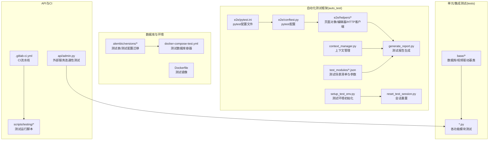
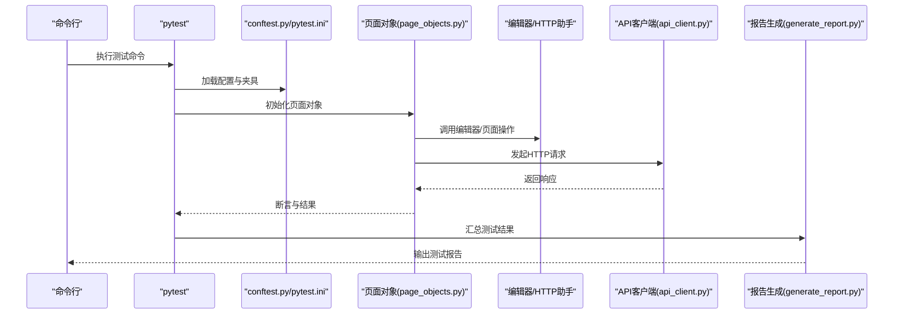
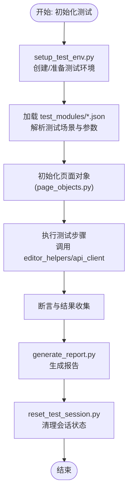
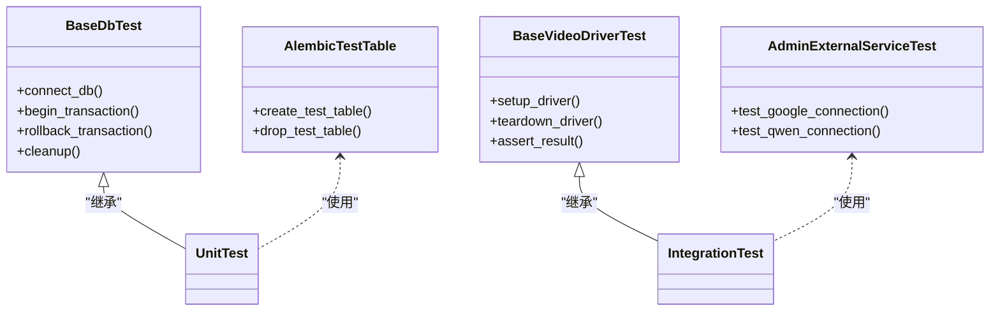
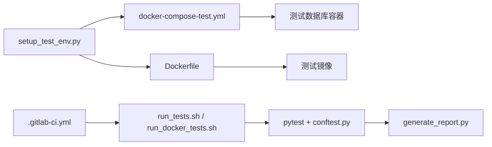
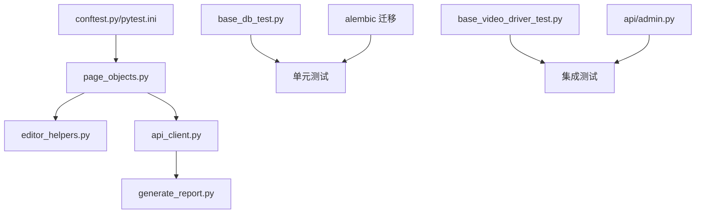

# 测试框架

<cite>
**本文引用的文件**
- [auto_test/e2e/conftest.py](file://auto_test/e2e/conftest.py)
- [auto_test/e2e/pytest.ini](file://auto_test/e2e/pytest.ini)
- [auto_test/e2e/helpers/api_client.py](file://auto_test/e2e/helpers/api_client.py)
- [auto_test/e2e/helpers/editor_helpers.py](file://auto_test/e2e/helpers/editor_helpers.py)
- [auto_test/e2e/helpers/page_objects.py](file://auto_test/e2e/helpers/page_objects.py)
- [auto_test/generate_report.py](file://auto_test/generate_report.py)
- [auto_test/setup_test_env.py](file://auto_test/setup_test_env.py)
- [auto_test/reset_test_session.py](file://auto_test/reset_test_session.py)
- [auto_test/context_manager.py](file://auto_test/context_manager.py)
- [auto_test/test_modules/index.json](file://auto_test/test_modules/index.json)
- [auto_test/test_modules/auth.json](file://auto_test/test_modules/auth.json)
- [auto_test/test_modules/world_management.json](file://auto_test/test_modules/world_management.json)
- [auto_test/test_modules/character_management.json](file://auto_test/test_modules/character_management.json)
- [auto_test/test_modules/location_management.json](file://auto_test/test_modules/location_management.json)
- [auto_test/test_modules/marketing_agent.json](file://auto_test/test_modules/marketing_agent.json)
- [auto_test/test_modules/grid_image_generation.json](file://auto_test/test_modules/grid_image_generation.json)
- [auto_test/test_modules/audio.json](file://auto_test/test_modules/audio.json)
- [auto_test/test_modules/timeline.json](file://auto_test/test_modules/timeline.json)
- [auto_test/test_modules/workflow_editor.json](file://auto_test/test_modules/workflow_editor.json)
- [auto_test/test_modules/workflow_list.json](file://auto_test/test_modules/workflow_list.json)
- [auto_test/test_modules/node_operations.json](file://auto_test/test_modules/node_operations.json)
- [auto_test/test_modules/camera_control.json](file://auto_test/test_modules/camera_control.json)
- [auto_test/test_modules/error_handling.json](file://auto_test/test_modules/error_handling.json)
- [auto_test/test_modules/shot_frame_video.json](file://auto_test/test_modules/shot_frame_video.json)
- [auto_test/test_modules/shot_group_video.json](file://auto_test/test_modules/shot_group_video.json)
- [auto_test/test_modules/computing_power_logs.json](file://auto_test/test_modules/computing_power_logs.json)
- [auto_test/test_modules/external_recharge.json](file://auto_test/test_modules/external_recharge.json)
- [auto_test/e2e/test_auth.py](file://auto_test/e2e/test_auth.py)
- [auto_test/e2e/test_admin.py](file://auto_test/e2e/test_admin.py)
- [auto_test/e2e/test_world.py](file://auto_test/e2e/test_world.py)
- [auto_test/e2e/test_character.py](file://auto_test/e2e/test_character.py)
- [auto_test/e2e/test_character_card.py](file://auto_test/e2e/test_character_card.py)
- [auto_test/e2e/test_location.py](file://auto_test/e2e/test_location.py)
- [auto_test/e2e/test_marketing_agent.py](file://auto_test/e2e/test_marketing_agent.py)
- [auto_test/e2e/test_grid_image.py](file://auto_test/e2e/test_grid_image.py)
- [auto_test/e2e/test_audio.py](file://auto_test/e2e/test_audio.py)
- [auto_test/e2e/test_timeline.py](file://auto_test/e2e/test_timeline.py)
- [auto_test/e2e/test_workflow.py](file://auto_test/e2e/test_workflow.py)
- [auto_test/e2e/test_workflow_page.py](file://auto_test/e2e/test_workflow_page.py)
- [auto_test/e2e/test_node_operations.py](file://auto_test/e2e/test_node_operations.py)
- [auto_test/e2e/test_camera_control.py](file://auto_test/e2e/test_camera_control.py)
- [auto_test/e2e/test_error_handling.py](file://auto_test/e2e/test_error_handling.py)
- [auto_test/e2e/test_shot_frame_video.py](file://auto_test/e2e/test_shot_frame_video.py)
- [auto_test/e2e/test_shot_group_video.py](file://auto_test/e2e/test_shot_group_video.py)
- [auto_test/e2e/test_computing_power_logs.py](file://auto_test/e2e/test_computing_power_logs.py)
- [auto_test/e2e/test_external_recharge.py](file://auto_test/e2e/test_external_recharge.py)
- [auto_test/e2e/test_session.py](file://auto_test/e2e/test_session.py)
- [auto_test/e2e/test_admin_api.py](file://auto_test/e2e/test_admin_api.py)
- [auto_test/e2e/test_marketing_agent_api.py](file://auto_test/e2e/test_marketing_agent_api.py)
- [auto_test/e2e/test_script_writer_api.py](file://auto_test/e2e/test_script_writer_api.py)
- [auto_test/e2e/test_script_writer.py](file://auto_test/e2e/test_script_writer.py)
- [auto_test/e2e/docs/script_writer_e2e_test_design.md](file://auto_test/e2e/docs/script_writer_e2e_test_design.md)
- [tests/base/base_db_test.py](file://tests/base/base_db_test.py)
- [tests/base/db_test_config.py](file://tests/base/db_test_config.py)
- [tests/base/base_video_driver_test.py](file://tests/base/base_video_driver_test.py)
- [tests/test_db_connection.py](file://tests/test_db_connection.py)
- [tests/README_UNIT_TESTS.md](file://tests/README_UNIT_TESTS.md)
- [scripts/testing/run_unit_tests.py](file://scripts/testing/run_unit_tests.py)
- [scripts/testing/test_discovery.py](file://scripts/testing/test_discovery.py)
- [alembic/env.py](file://alembic/env.py)
- [alembic/versions/20260224_69f38f419eb6_create_test_table.py](file://alembic/versions/20260224_69f38f419eb6_create_test_table.py)
- [alembic/versions/20260224_dba3eea917cf_drop_test_table.py](file://alembic/versions/20260224_dba3eea917cf_drop_test_table.py)
- [alembic/versions/20260401_add_zjt_token_config.py](file://alembic/versions/20260401_add_zjt_token_config.py)
- [api/admin.py](file://api/admin.py)
- [docker/docker-compose-test.yml](file://docker/docker-compose-test.yml)
- [docker/Dockerfile](file://docker/Dockerfile)
- [scripts/testing/run_tests.sh](file://scripts/testing/run_tests.sh)
- [scripts/testing/run_docker_tests.sh](file://scripts/testing/run_docker_tests.sh)
- [.gitlab-ci.yml](file://.gitlab-ci.yml)
</cite>

## 目录
1. [引言](#引言)
2. [项目结构](#项目结构)
3. [核心组件](#核心组件)
4. [架构总览](#架构总览)
5. [详细组件分析](#详细组件分析)
6. [依赖关系分析](#依赖关系分析)
7. [性能考虑](#性能考虑)
8. [故障排查指南](#故障排查指南)
9. [结论](#结论)
10. [附录](#附录)

## 引言
本文件面向 ZhiJuTong（智剧通）测试框架，系统化梳理单元测试、集成测试、端到端测试与自动化测试框架的架构与实践。内容覆盖测试用例设计、Mock 对象使用、断言策略、数据库测试、API 测试、外部服务模拟、测试环境搭建、数据准备与清理、页面对象模式、测试报告生成、覆盖率分析、性能与压力测试、最佳实践、持续集成配置以及测试数据管理策略等。

## 项目结构
测试相关代码主要分布在以下区域：
- 自动化测试框架与端到端测试：auto_test 目录，包含 pytest 配置、测试模块清单、页面对象与辅助工具、报告生成、环境搭建与会话重置等脚本。
- 单元测试与集成测试：tests 目录，包含基础数据库测试基类、驱动与客户端测试、CRUD 测试等。
- 数据库迁移与测试环境：alembic 迁移版本中包含测试表与测试环境配置项，配合 docker-compose-test.yml 提供独立测试数据库。
- API 管理端测试能力：api/admin.py 中提供外部服务连通性测试接口，便于在测试中验证第三方 LLM 服务可用性。
- 持续集成：.gitlab-ci.yml 定义流水线任务，scripts/testing 下提供测试运行脚本。

图表来源
- [auto_test/e2e/conftest.py](file://auto_test/e2e/conftest.py)
- [auto_test/e2e/pytest.ini](file://auto_test/e2e/pytest.ini)
- [auto_test/e2e/helpers/api_client.py](file://auto_test/e2e/helpers/api_client.py)
- [auto_test/e2e/helpers/page_objects.py](file://auto_test/e2e/helpers/page_objects.py)
- [auto_test/generate_report.py](file://auto_test/generate_report.py)
- [auto_test/setup_test_env.py](file://auto_test/setup_test_env.py)
- [auto_test/reset_test_session.py](file://auto_test/reset_test_session.py)
- [auto_test/context_manager.py](file://auto_test/context_manager.py)
- [auto_test/test_modules/index.json](file://auto_test/test_modules/index.json)
- [tests/base/base_db_test.py](file://tests/base/base_db_test.py)
- [tests/base/base_video_driver_test.py](file://tests/base/base_video_driver_test.py)
- [alembic/versions/20260224_69f38f419eb6_create_test_table.py](file://alembic/versions/20260224_69f38f419eb6_create_test_table.py)
- [alembic/versions/20260401_add_zjt_token_config.py](file://alembic/versions/20260401_add_zjt_token_config.py)
- [docker/docker-compose-test.yml](file://docker/docker-compose-test.yml)
- [docker/Dockerfile](file://docker/Dockerfile)
- [api/admin.py](file://api/admin.py)
- [.gitlab-ci.yml](file://.gitlab-ci.yml)

章节来源
- [auto_test/e2e/conftest.py](file://auto_test/e2e/conftest.py)
- [auto_test/e2e/pytest.ini](file://auto_test/e2e/pytest.ini)
- [auto_test/e2e/helpers/page_objects.py](file://auto_test/e2e/helpers/page_objects.py)
- [auto_test/generate_report.py](file://auto_test/generate_report.py)
- [auto_test/setup_test_env.py](file://auto_test/setup_test_env.py)
- [auto_test/reset_test_session.py](file://auto_test/reset_test_session.py)
- [auto_test/context_manager.py](file://auto_test/context_manager.py)
- [auto_test/test_modules/index.json](file://auto_test/test_modules/index.json)
- [tests/base/base_db_test.py](file://tests/base/base_db_test.py)
- [tests/base/base_video_driver_test.py](file://tests/base/base_video_driver_test.py)
- [alembic/env.py](file://alembic/env.py)
- [alembic/versions/20260224_69f38f419eb6_create_test_table.py](file://alembic/versions/20260224_69f38f419eb6_create_test_table.py)
- [alembic/versions/20260401_add_zjt_token_config.py](file://alembic/versions/20260401_add_zjt_token_config.py)
- [docker/docker-compose-test.yml](file://docker/docker-compose-test.yml)
- [docker/Dockerfile](file://docker/Dockerfile)
- [api/admin.py](file://api/admin.py)
- [.gitlab-ci.yml](file://.gitlab-ci.yml)

## 核心组件
- 端到端测试框架
  - pytest 配置与插件：通过 conftest.py 与 pytest.ini 统一配置，支持浏览器驱动、截图、日志与报告钩子。
  - 页面对象与辅助工具：page_objects.py 封装页面交互；editor_helpers.py 提供编辑器操作；api_client.py 封装 HTTP 请求。
  - 测试模块清单：index.json 与各功能模块 JSON 文件组织测试场景与参数。
  - 报告生成：generate_report.py 聚合测试结果，输出可读报告。
  - 环境与会话：setup_test_env.py 初始化测试环境；reset_test_session.py 清理状态；context_manager.py 管理会话上下文。
- 单元/集成测试
  - 基类：base_db_test.py 提供数据库连接与事务回滚；base_video_driver_test.py 提供视频驱动测试基类。
  - 数据库迁移：20260224_*_create_test_table.py 与 drop_test_table.py 提供测试专用表；20260401_add_zjt_token_config.py 在测试环境注入配置。
  - API 管理端测试：admin.py 的外部服务连通性测试接口可用于集成测试。
- 持续集成与运行
  - CI：.gitlab-ci.yml 定义流水线阶段与任务。
  - 运行脚本：run_tests.sh、run_docker_tests.sh、run_unit_tests.py、test_discovery.py 组织测试执行流程。

章节来源
- [auto_test/e2e/conftest.py](file://auto_test/e2e/conftest.py)
- [auto_test/e2e/pytest.ini](file://auto_test/e2e/pytest.ini)
- [auto_test/e2e/helpers/page_objects.py](file://auto_test/e2e/helpers/page_objects.py)
- [auto_test/e2e/helpers/editor_helpers.py](file://auto_test/e2e/helpers/editor_helpers.py)
- [auto_test/e2e/helpers/api_client.py](file://auto_test/e2e/helpers/api_client.py)
- [auto_test/generate_report.py](file://auto_test/generate_report.py)
- [auto_test/setup_test_env.py](file://auto_test/setup_test_env.py)
- [auto_test/reset_test_session.py](file://auto_test/reset_test_session.py)
- [auto_test/context_manager.py](file://auto_test/context_manager.py)
- [auto_test/test_modules/index.json](file://auto_test/test_modules/index.json)
- [tests/base/base_db_test.py](file://tests/base/base_db_test.py)
- [tests/base/base_video_driver_test.py](file://tests/base/base_video_driver_test.py)
- [alembic/versions/20260224_69f38f419eb6_create_test_table.py](file://alembic/versions/20260224_69f38f419eb6_create_test_table.py)
- [alembic/versions/20260224_dba3eea917cf_drop_test_table.py](file://alembic/versions/20260224_dba3eea917cf_drop_test_table.py)
- [alembic/versions/20260401_add_zjt_token_config.py](file://alembic/versions/20260401_add_zjt_token_config.py)
- [api/admin.py](file://api/admin.py)
- [scripts/testing/run_tests.sh](file://scripts/testing/run_tests.sh)
- [scripts/testing/run_docker_tests.sh](file://scripts/testing/run_docker_tests.sh)
- [scripts/testing/run_unit_tests.py](file://scripts/testing/run_unit_tests.py)
- [scripts/testing/test_discovery.py](file://scripts/testing/test_discovery.py)
- [.gitlab-ci.yml](file://.gitlab-ci.yml)

## 架构总览
下图展示测试框架从命令行到具体测试执行、页面对象交互、API 请求与报告生成的整体流程。

图表来源
- [auto_test/e2e/conftest.py](file://auto_test/e2e/conftest.py)
- [auto_test/e2e/pytest.ini](file://auto_test/e2e/pytest.ini)
- [auto_test/e2e/helpers/page_objects.py](file://auto_test/e2e/helpers/page_objects.py)
- [auto_test/e2e/helpers/editor_helpers.py](file://auto_test/e2e/helpers/editor_helpers.py)
- [auto_test/e2e/helpers/api_client.py](file://auto_test/e2e/helpers/api_client.py)
- [auto_test/generate_report.py](file://auto_test/generate_report.py)

## 详细组件分析

### 端到端测试组件
- 页面对象与交互
  - page_objects.py 将页面元素定位与操作封装为可复用对象，降低重复代码与维护成本。
  - editor_helpers.py 提供复杂编辑器交互的高层封装，简化测试步骤。
- API 客户端
  - api_client.py 统一封装 HTTP 请求，支持认证、超时、重试与响应解析，便于在测试中模拟外部服务。
- 测试模块与场景
  - index.json 作为测试场景索引，auth.json、world_management.json、character_management.json 等按功能域组织测试参数与步骤。
- 报告与环境
  - generate_report.py 聚合测试结果，结合 pytest 钩子输出 HTML/JSON 报告。
  - setup_test_env.py、reset_test_session.py、context_manager.py 确保测试环境隔离与状态一致性。

图表来源
- [auto_test/setup_test_env.py](file://auto_test/setup_test_env.py)
- [auto_test/test_modules/index.json](file://auto_test/test_modules/index.json)
- [auto_test/e2e/helpers/page_objects.py](file://auto_test/e2e/helpers/page_objects.py)
- [auto_test/e2e/helpers/editor_helpers.py](file://auto_test/e2e/helpers/editor_helpers.py)
- [auto_test/e2e/helpers/api_client.py](file://auto_test/e2e/helpers/api_client.py)
- [auto_test/generate_report.py](file://auto_test/generate_report.py)
- [auto_test/reset_test_session.py](file://auto_test/reset_test_session.py)

章节来源
- [auto_test/e2e/helpers/page_objects.py](file://auto_test/e2e/helpers/page_objects.py)
- [auto_test/e2e/helpers/editor_helpers.py](file://auto_test/e2e/helpers/editor_helpers.py)
- [auto_test/e2e/helpers/api_client.py](file://auto_test/e2e/helpers/api_client.py)
- [auto_test/test_modules/index.json](file://auto_test/test_modules/index.json)
- [auto_test/test_modules/auth.json](file://auto_test/test_modules/auth.json)
- [auto_test/test_modules/world_management.json](file://auto_test/test_modules/world_management.json)
- [auto_test/test_modules/character_management.json](file://auto_test/test_modules/character_management.json)
- [auto_test/test_modules/location_management.json](file://auto_test/test_modules/location_management.json)
- [auto_test/test_modules/marketing_agent.json](file://auto_test/test_modules/marketing_agent.json)
- [auto_test/test_modules/grid_image_generation.json](file://auto_test/test_modules/grid_image_generation.json)
- [auto_test/test_modules/audio.json](file://auto_test/test_modules/audio.json)
- [auto_test/test_modules/timeline.json](file://auto_test/test_modules/timeline.json)
- [auto_test/test_modules/workflow_editor.json](file://auto_test/test_modules/workflow_editor.json)
- [auto_test/test_modules/workflow_list.json](file://auto_test/test_modules/workflow_list.json)
- [auto_test/test_modules/node_operations.json](file://auto_test/test_modules/node_operations.json)
- [auto_test/test_modules/camera_control.json](file://auto_test/test_modules/camera_control.json)
- [auto_test/test_modules/error_handling.json](file://auto_test/test_modules/error_handling.json)
- [auto_test/test_modules/shot_frame_video.json](file://auto_test/test_modules/shot_frame_video.json)
- [auto_test/test_modules/shot_group_video.json](file://auto_test/test_modules/shot_group_video.json)
- [auto_test/test_modules/computing_power_logs.json](file://auto_test/test_modules/computing_power_logs.json)
- [auto_test/test_modules/external_recharge.json](file://auto_test/test_modules/external_recharge.json)
- [auto_test/generate_report.py](file://auto_test/generate_report.py)
- [auto_test/setup_test_env.py](file://auto_test/setup_test_env.py)
- [auto_test/reset_test_session.py](file://auto_test/reset_test_session.py)
- [auto_test/context_manager.py](file://auto_test/context_manager.py)

### 单元测试与集成测试组件
- 基础测试基类
  - base_db_test.py 提供数据库连接、事务回滚与清理逻辑，确保每个测试用例的隔离性与可重复性。
  - base_video_driver_test.py 提供视频生成驱动的通用测试方法与断言策略。
- 数据库迁移与测试配置
  - 20260224_69f38f419eb6_create_test_table.py 与 drop_test_table.py 提供测试专用表，便于快速验证数据库层逻辑。
  - 20260401_add_zjt_token_config.py 在测试环境注入 zjt.token 配置，便于外部服务测试。
- API 管理端测试
  - admin.py 的外部服务连通性测试接口可用于集成测试，验证第三方 LLM 服务可用性与错误处理。

图表来源
- [tests/base/base_db_test.py](file://tests/base/base_db_test.py)
- [tests/base/base_video_driver_test.py](file://tests/base/base_video_driver_test.py)
- [alembic/versions/20260224_69f38f419eb6_create_test_table.py](file://alembic/versions/20260224_69f38f419eb6_create_test_table.py)
- [alembic/versions/20260224_dba3eea917cf_drop_test_table.py](file://alembic/versions/20260224_dba3eea917cf_drop_test_table.py)
- [api/admin.py](file://api/admin.py)

章节来源
- [tests/base/base_db_test.py](file://tests/base/base_db_test.py)
- [tests/base/base_video_driver_test.py](file://tests/base/base_video_driver_test.py)
- [alembic/versions/20260224_69f38f419eb6_create_test_table.py](file://alembic/versions/20260224_69f38f419eb6_create_test_table.py)
- [alembic/versions/20260224_dba3eea917cf_drop_test_table.py](file://alembic/versions/20260224_dba3eea917cf_drop_test_table.py)
- [alembic/versions/20260401_add_zjt_token_config.py](file://alembic/versions/20260401_add_zjt_token_config.py)
- [api/admin.py](file://api/admin.py)

### 测试用例设计与断言策略
- 设计原则
  - 单一职责：每个测试聚焦一个业务场景或边界条件。
  - 参数化：通过 test_modules/*.json 提供多组输入与期望输出，提升覆盖面。
  - 可重复：基于基类与迁移表，确保测试在干净环境中执行。
- 断言策略
  - 页面断言：基于页面对象返回的状态与元素存在性进行断言。
  - API 断言：基于 api_client.py 的响应码、响应体字段与错误信息断言。
  - 数据库断言：基于 base_db_test.py 的事务回滚与查询断言。
- Mock 对象使用
  - 使用 api_client.py 封装的 HTTP 客户端进行外部服务模拟，必要时替换为本地 Mock 服务或使用 pytest-mock。

章节来源
- [auto_test/e2e/helpers/page_objects.py](file://auto_test/e2e/helpers/page_objects.py)
- [auto_test/e2e/helpers/api_client.py](file://auto_test/e2e/helpers/api_client.py)
- [tests/base/base_db_test.py](file://tests/base/base_db_test.py)
- [auto_test/test_modules/index.json](file://auto_test/test_modules/index.json)

### 集成测试设计模式
- 数据库测试
  - 使用 alembic 测试迁移与 base_db_test.py 基类，确保测试前后数据库状态一致。
- API 测试
  - 通过 admin.py 的外部服务连通性测试接口，验证第三方 LLM 服务的可用性与错误处理。
- 外部服务模拟
  - 使用 api_client.py 封装的 HTTP 客户端，结合本地 Mock 或第三方测试账户，模拟外部服务响应。

章节来源
- [alembic/versions/20260224_69f38f419eb6_create_test_table.py](file://alembic/versions/20260224_69f38f419eb6_create_test_table.py)
- [alembic/versions/20260224_dba3eea917cf_drop_test_table.py](file://alembic/versions/20260224_dba3eea917cf_drop_test_table.py)
- [api/admin.py](file://api/admin.py)
- [auto_test/e2e/helpers/api_client.py](file://auto_test/e2e/helpers/api_client.py)

### 自动化测试框架架构
- 测试环境搭建
  - setup_test_env.py 创建测试数据与临时资源；docker-compose-test.yml 提供独立数据库容器；Dockerfile 构建测试镜像。
- 数据准备与清理
  - context_manager.py 管理会话上下文；reset_test_session.py 清理会话状态；base_db_test.py 回滚事务。
- 测试执行与报告
  - conftest.py/pytest.ini 统一配置；generate_report.py 输出报告；CI 通过 .gitlab-ci.yml 与 run_tests.sh/run_docker_tests.sh 驱动。

图表来源
- [auto_test/setup_test_env.py](file://auto_test/setup_test_env.py)
- [docker/docker-compose-test.yml](file://docker/docker-compose-test.yml)
- [docker/Dockerfile](file://docker/Dockerfile)
- [auto_test/generate_report.py](file://auto_test/generate_report.py)
- [auto_test/e2e/conftest.py](file://auto_test/e2e/conftest.py)
- [auto_test/e2e/pytest.ini](file://auto_test/e2e/pytest.ini)
- [.gitlab-ci.yml](file://.gitlab-ci.yml)
- [scripts/testing/run_tests.sh](file://scripts/testing/run_tests.sh)
- [scripts/testing/run_docker_tests.sh](file://scripts/testing/run_docker_tests.sh)

章节来源
- [auto_test/setup_test_env.py](file://auto_test/setup_test_env.py)
- [docker/docker-compose-test.yml](file://docker/docker-compose-test.yml)
- [docker/Dockerfile](file://docker/Dockerfile)
- [auto_test/generate_report.py](file://auto_test/generate_report.py)
- [auto_test/e2e/conftest.py](file://auto_test/e2e/conftest.py)
- [auto_test/e2e/pytest.ini](file://auto_test/e2e/pytest.ini)
- [.gitlab-ci.yml](file://.gitlab-ci.yml)
- [scripts/testing/run_tests.sh](file://scripts/testing/run_tests.sh)
- [scripts/testing/run_docker_tests.sh](file://scripts/testing/run_docker_tests.sh)

### 端到端测试实现
- 用户场景模拟
  - 通过 test_modules/*.json 定义场景步骤与参数，页面对象按步骤执行，模拟真实用户操作。
- 页面对象模式
  - page_objects.py 封装页面交互，editor_helpers.py 提供复杂编辑器操作，api_client.py 封装 HTTP 请求。
- 测试报告生成
  - generate_report.py 聚合断言结果与日志，输出可读报告。

章节来源
- [auto_test/e2e/test_auth.py](file://auto_test/e2e/test_auth.py)
- [auto_test/e2e/test_admin.py](file://auto_test/e2e/test_admin.py)
- [auto_test/e2e/test_world.py](file://auto_test/e2e/test_world.py)
- [auto_test/e2e/test_character.py](file://auto_test/e2e/test_character.py)
- [auto_test/e2e/test_character_card.py](file://auto_test/e2e/test_character_card.py)
- [auto_test/e2e/test_location.py](file://auto_test/e2e/test_location.py)
- [auto_test/e2e/test_marketing_agent.py](file://auto_test/e2e/test_marketing_agent.py)
- [auto_test/e2e/test_grid_image.py](file://auto_test/e2e/test_grid_image.py)
- [auto_test/e2e/test_audio.py](file://auto_test/e2e/test_audio.py)
- [auto_test/e2e/test_timeline.py](file://auto_test/e2e/test_timeline.py)
- [auto_test/e2e/test_workflow.py](file://auto_test/e2e/test_workflow.py)
- [auto_test/e2e/test_workflow_page.py](file://auto_test/e2e/test_workflow_page.py)
- [auto_test/e2e/test_node_operations.py](file://auto_test/e2e/test_node_operations.py)
- [auto_test/e2e/test_camera_control.py](file://auto_test/e2e/test_camera_control.py)
- [auto_test/e2e/test_error_handling.py](file://auto_test/e2e/test_error_handling.py)
- [auto_test/e2e/test_shot_frame_video.py](file://auto_test/e2e/test_shot_frame_video.py)
- [auto_test/e2e/test_shot_group_video.py](file://auto_test/e2e/test_shot_group_video.py)
- [auto_test/e2e/test_computing_power_logs.py](file://auto_test/e2e/test_computing_power_logs.py)
- [auto_test/e2e/test_external_recharge.py](file://auto_test/e2e/test_external_recharge.py)
- [auto_test/e2e/test_session.py](file://auto_test/e2e/test_session.py)
- [auto_test/e2e/test_admin_api.py](file://auto_test/e2e/test_admin_api.py)
- [auto_test/e2e/test_marketing_agent_api.py](file://auto_test/e2e/test_marketing_agent_api.py)
- [auto_test/e2e/test_script_writer_api.py](file://auto_test/e2e/test_script_writer_api.py)
- [auto_test/e2e/test_script_writer.py](file://auto_test/e2e/test_script_writer.py)
- [auto_test/e2e/docs/script_writer_e2e_test_design.md](file://auto_test/e2e/docs/script_writer_e2e_test_design.md)

## 依赖关系分析
- 组件耦合
  - 页面对象依赖编辑器助手与 API 客户端，形成清晰的分层。
  - 基类测试组件被各类单元/集成测试复用，提高代码复用度。
- 外部依赖
  - 测试数据库由 docker-compose-test.yml 提供，避免与生产数据冲突。
  - admin.py 的外部服务测试接口用于集成测试，减少对真实第三方服务的依赖。
- 潜在循环依赖
  - 当前结构以“配置→页面对象→API 客户端→报告”单向依赖为主，未见明显循环。

图表来源
- [auto_test/e2e/conftest.py](file://auto_test/e2e/conftest.py)
- [auto_test/e2e/pytest.ini](file://auto_test/e2e/pytest.ini)
- [auto_test/e2e/helpers/page_objects.py](file://auto_test/e2e/helpers/page_objects.py)
- [auto_test/e2e/helpers/editor_helpers.py](file://auto_test/e2e/helpers/editor_helpers.py)
- [auto_test/e2e/helpers/api_client.py](file://auto_test/e2e/helpers/api_client.py)
- [auto_test/generate_report.py](file://auto_test/generate_report.py)
- [tests/base/base_db_test.py](file://tests/base/base_db_test.py)
- [tests/base/base_video_driver_test.py](file://tests/base/base_video_driver_test.py)
- [alembic/versions/20260224_69f38f419eb6_create_test_table.py](file://alembic/versions/20260224_69f38f419eb6_create_test_table.py)
- [api/admin.py](file://api/admin.py)

章节来源
- [auto_test/e2e/conftest.py](file://auto_test/e2e/conftest.py)
- [auto_test/e2e/helpers/page_objects.py](file://auto_test/e2e/helpers/page_objects.py)
- [auto_test/e2e/helpers/editor_helpers.py](file://auto_test/e2e/helpers/editor_helpers.py)
- [auto_test/e2e/helpers/api_client.py](file://auto_test/e2e/helpers/api_client.py)
- [auto_test/generate_report.py](file://auto_test/generate_report.py)
- [tests/base/base_db_test.py](file://tests/base/base_db_test.py)
- [tests/base/base_video_driver_test.py](file://tests/base/base_video_driver_test.py)
- [alembic/versions/20260224_69f38f419eb6_create_test_table.py](file://alembic/versions/20260224_69f38f419eb6_create_test_table.py)
- [api/admin.py](file://api/admin.py)

## 性能考虑
- 测试数据库隔离：使用独立容器与迁移表，避免性能波动影响其他环境。
- 并发测试：建议在 CI 中按功能域拆分测试套件，使用 pytest-xdist 实现并行执行。
- 资源回收：通过 reset_test_session.py 与基类事务回滚，减少内存与连接泄漏风险。
- 外部服务降级：在 API 测试中优先使用 Mock 或本地服务，必要时限制请求频率与超时时间。

## 故障排查指南
- 环境问题
  - 确认 docker-compose-test.yml 正常启动测试数据库；检查 setup_test_env.py 是否成功创建测试数据。
- 数据库问题
  - 使用 base_db_test.py 的事务回滚机制；核对 alembic 迁移是否正确应用。
- API 问题
  - 使用 admin.py 的外部服务连通性测试接口定位第三方服务异常；检查 api_client.py 的请求头与超时设置。
- 报告问题
  - 检查 generate_report.py 的输出路径与权限；确认 pytest 钩子已正确注册。

章节来源
- [docker/docker-compose-test.yml](file://docker/docker-compose-test.yml)
- [auto_test/setup_test_env.py](file://auto_test/setup_test_env.py)
- [tests/base/base_db_test.py](file://tests/base/base_db_test.py)
- [alembic/versions/20260224_69f38f419eb6_create_test_table.py](file://alembic/versions/20260224_69f38f419eb6_create_test_table.py)
- [api/admin.py](file://api/admin.py)
- [auto_test/generate_report.py](file://auto_test/generate_report.py)

## 结论
ZhiJuTong 测试框架通过清晰的分层与模块化设计，实现了从单元测试到端到端测试的全链路覆盖。借助页面对象、API 客户端与测试模块化参数，测试用例具备高可维护性与可扩展性。配合独立的测试数据库、上下文管理与报告生成，框架能够稳定支撑持续集成与自动化测试流程。

## 附录
- 测试覆盖率分析
  - 建议在 CI 中启用覆盖率统计（如 pytest-cov），并设置阈值门禁，确保关键路径得到充分测试。
- 性能与压力测试
  - 使用 locust 或自定义脚本对关键 API 与页面进行并发压测，结合日志与指标监控评估系统瓶颈。
- 最佳实践
  - 保持测试用例短小精悍；使用参数化与 fixtures 提升复用度；对外部依赖进行合理 Mock；定期清理测试数据与容器。
- 测试数据管理
  - 使用 alembic 迁移与 test_modules/*.json 维护测试数据；在 CI 中使用只读快照或随机化数据，避免跨测试污染。
- 测试环境隔离与并发
  - 通过 docker-compose-test.yml 与独立数据库实例隔离；在 CI 中按套件并行执行，缩短反馈周期。
- 测试结果分析工具
  - 结合 generate_report.py 与 CI 日志，建立可视化看板与趋势分析，持续改进测试质量。