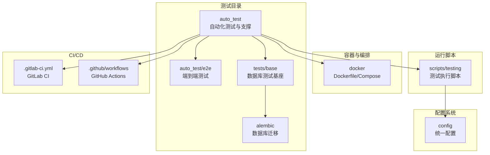
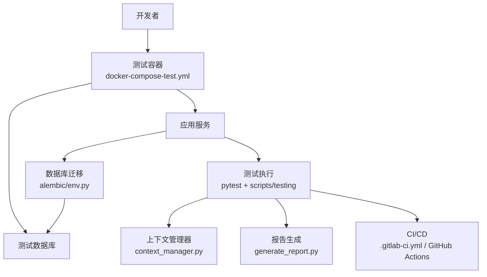
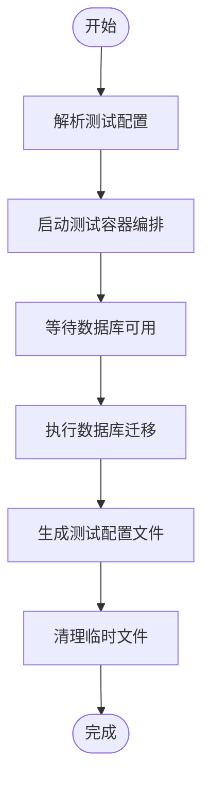
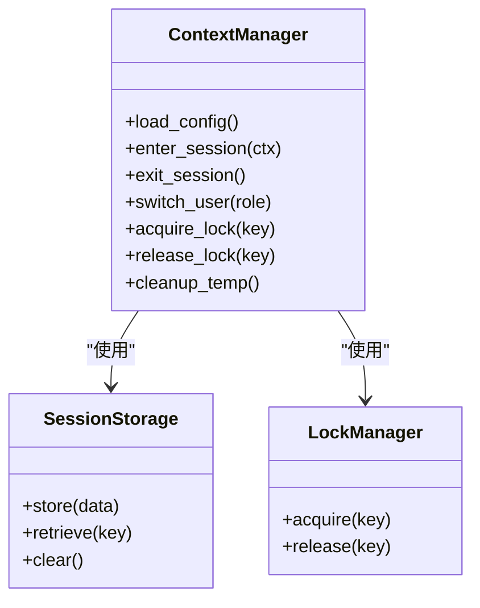
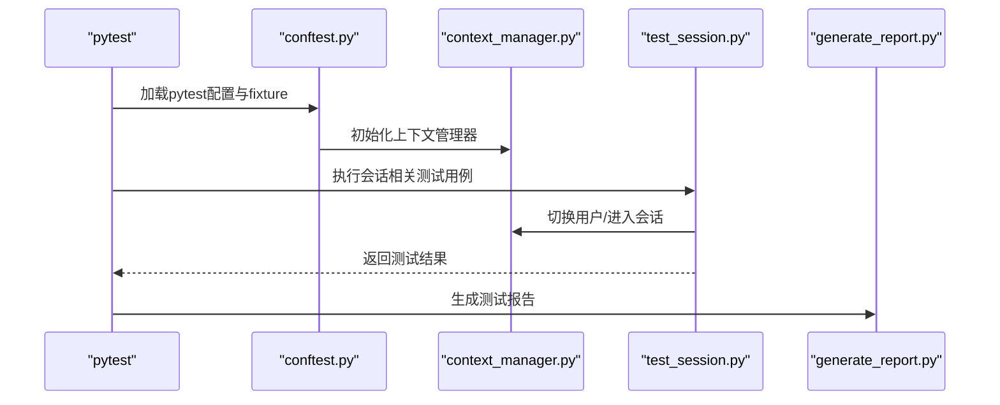
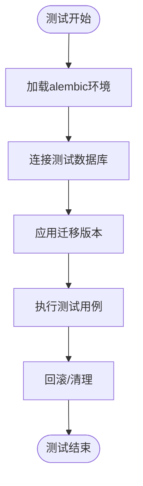
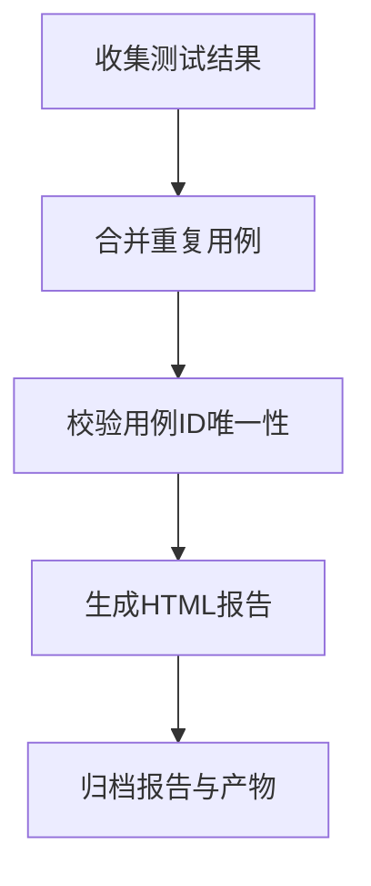
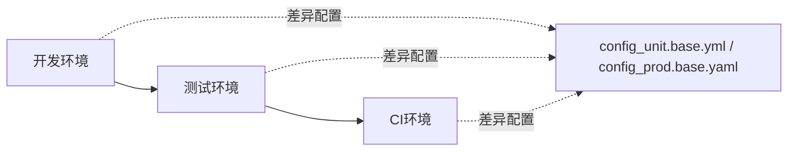
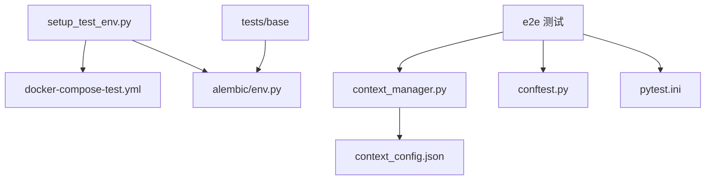

# 测试环境管理

<cite>
**本文引用的文件**
- [setup_test_env.py](file://auto_test/setup_test_env.py)
- [context_manager.py](file://auto_test/context_manager.py)
- [context_config.json](file://auto_test/context_config.json)
- [test_config.example.json](file://auto_test/test_config.example.json)
- [reset_test_session.py](file://auto_test/reset_test_session.py)
- [generate_report.py](file://auto_test/generate_report.py)
- [merge_test_cases.py](file://auto_test/merge_test_cases.py)
- [check_duplicate_ids.py](file://auto_test/check_duplicate_ids.py)
- [auto_restart.py](file://auto_test/auto_restart.py)
- [test_navigator.py](file://auto_test/test_navigator.py)
- [conftest.py](file://auto_test/e2e/conftest.py)
- [pytest.ini](file://auto_test/e2e/pytest.ini)
- [test_session.py](file://auto_test/e2e/test_session.py)
- [docker-compose-test.yml](file://docker/docker-compose-test.yml)
- [docker-compose.yml](file://docker/docker-compose.yml)
- [Dockerfile](file://docker/Dockerfile)
- [run_docker_tests.sh](file://scripts/testing/run_docker_tests.sh)
- [run_tests.sh](file://scripts/testing/run_tests.sh)
- [run_unit_tests.py](file://scripts/testing/run_unit_tests.py)
- [run_migrations.sh](file://scripts/testing/run_migrations.sh)
- [run_driver_tests.sh](file://scripts/testing/run_driver_tests.sh)
- [alembic/env.py](file://alembic/env.py)
- [base_db_test.py](file://tests/base/base_db_test.py)
- [db_test_config.py](file://tests/base/db_test_config.py)
- [test_db_connection.py](file://tests/test_db_connection.py)
- [.gitlab-ci.yml](file://.gitlab-ci.yml)
- [guard-enterprise.yml](file://.github/workflows/guard-enterprise.yml)
- [sync-gitee.yml](file://.github/workflows/sync-gitee.yml)
- [config_unit.base.yml](file://config_unit.base.yml)
- [config_prod.base.yaml](file://config_prod.base.yaml)
- [default_configs.py](file://config/default_configs.py)
- [unified_config.py](file://config/unified_config.py)
- [constant.py](file://config/constant.py)
- [media_file_policy.py](file://config/media_file_policy.py)
- [required_binaries.yml](file://config/required_binaries.yml)
- [version.py](file://config/version.py)
- [database.py](file://model/database.py)
- [alembic.ini](file://alembic.ini)
- [start_windows.py](file://scripts/launchers/start_windows.py)
- [stop_by_pid.py](file://scripts/launchers/stop_by_pid.py)
- [pid_manager.py](file://scripts/launchers/pid_manager.py)
- [start_mac.py](file://scripts/launchers/start_mac.py)
- [run_dev.py](file://scripts/running/run_dev.py)
- [run_prod.py](file://scripts/running/run_prod.py)
- [run_scheduler.py](file://scripts/running/run_scheduler.py)
- [Windows启动文件说明.txt](file://Windows启动文件说明.txt)
- [首长安装-Mac.command](file://首次安装-Mac.command)
</cite>

## 目录
1. [简介](#简介)
2. [项目结构](#项目结构)
3. [核心组件](#核心组件)
4. [架构总览](#架构总览)
5. [详细组件分析](#详细组件分析)
6. [依赖关系分析](#依赖关系分析)
7. [性能考量](#性能考量)
8. [故障排除指南](#故障排除指南)
9. [结论](#结论)
10. [附录](#附录)

## 简介
本文件面向ZhiJuTong项目的测试环境管理，聚焦于测试环境的配置与管理策略、自动搭建流程（数据库初始化、依赖服务启动、配置文件生成）、测试会话管理机制（会话状态保持、用户上下文切换、并发测试支持）、测试数据管理策略（隔离、种子管理、清理）、测试上下文管理（全局配置、环境变量、临时文件处理），以及安全与资源限制等实践建议。文档基于仓库中现有的测试相关脚本、配置与自动化文件进行整理与总结。

## 项目结构
测试相关代码主要分布在以下位置：
- 自动化测试入口与支撑：auto_test 目录
- 端到端测试：auto_test/e2e
- 数据库迁移与测试基座：alembic 与 tests/base
- 容器化与环境编排：docker 目录
- 测试运行脚本：scripts/testing
- 配置系统：config 目录
- CI/CD：.gitlab-ci.yml 与 .github/workflows

**图表来源**
- [setup_test_env.py](file://auto_test/setup_test_env.py)
- [docker-compose-test.yml](file://docker/docker-compose-test.yml)
- [run_tests.sh](file://scripts/testing/run_tests.sh)
- [alembic/env.py](file://alembic/env.py)

**章节来源**
- [setup_test_env.py](file://auto_test/setup_test_env.py)
- [docker-compose-test.yml](file://docker/docker-compose-test.yml)
- [run_tests.sh](file://scripts/testing/run_tests.sh)

## 核心组件
- 测试环境搭建器：负责拉起测试容器、初始化数据库、生成测试配置并准备运行环境。
- 测试上下文管理器：维护测试会话状态、用户上下文、并发控制与临时文件生命周期。
- 测试报告与用例合并：生成测试报告、合并重复用例、检查ID冲突。
- 端到端测试框架：基于pytest的e2e测试，配合conftest与pytest.ini进行全局配置。
- 数据库迁移与测试基座：通过alembic与tests/base实现数据库迁移与测试连接配置。
- CI/CD流水线：GitLab CI与GitHub Actions分别用于不同场景的自动化构建与测试。

**章节来源**
- [context_manager.py](file://auto_test/context_manager.py)
- [context_config.json](file://auto_test/context_config.json)
- [generate_report.py](file://auto_test/generate_report.py)
- [merge_test_cases.py](file://auto_test/merge_test_cases.py)
- [check_duplicate_ids.py](file://auto_test/check_duplicate_ids.py)
- [conftest.py](file://auto_test/e2e/conftest.py)
- [pytest.ini](file://auto_test/e2e/pytest.ini)
- [alembic/env.py](file://alembic/env.py)
- [base_db_test.py](file://tests/base/base_db_test.py)
- [.gitlab-ci.yml](file://.gitlab-ci.yml)
- [guard-enterprise.yml](file://.github/workflows/guard-enterprise.yml)
- [sync-gitee.yml](file://.github/workflows/sync-gitee.yml)

## 架构总览
测试环境管理采用“容器化 + 迁移驱动 + 上下文管理 + CI流水线”的整体架构。容器化确保环境一致性；迁移驱动保证数据库结构与种子数据的一致性；上下文管理器负责会话与并发；CI流水线贯穿开发到测试的自动化。

**图表来源**
- [docker-compose-test.yml](file://docker/docker-compose-test.yml)
- [alembic/env.py](file://alembic/env.py)
- [run_tests.sh](file://scripts/testing/run_tests.sh)
- [context_manager.py](file://auto_test/context_manager.py)
- [generate_report.py](file://auto_test/generate_report.py)
- [.gitlab-ci.yml](file://.gitlab-ci.yml)
- [guard-enterprise.yml](file://.github/workflows/guard-enterprise.yml)

## 详细组件分析

### 测试环境搭建器（setup_test_env.py）
- 职责：拉起测试容器、等待服务就绪、初始化数据库、生成测试配置文件、准备临时目录。
- 关键流程：
  - 解析测试配置（如端口、镜像版本）。
  - 启动docker-compose测试编排。
  - 等待数据库可连接。
  - 执行数据库迁移（alembic）。
  - 生成测试所需的配置文件与令牌。
  - 清理临时文件与日志。
- 并发与隔离：通过独立的compose服务与数据库实例实现环境隔离；容器网络命名空间隔离进程与端口。

**图表来源**
- [setup_test_env.py](file://auto_test/setup_test_env.py)
- [docker-compose-test.yml](file://docker/docker-compose-test.yml)
- [alembic/env.py](file://alembic/env.py)

**章节来源**
- [setup_test_env.py](file://auto_test/setup_test_env.py)
- [docker-compose-test.yml](file://docker/docker-compose-test.yml)
- [alembic/env.py](file://alembic/env.py)

### 测试上下文管理器（context_manager.py）
- 职责：维护测试会话状态、用户上下文切换、并发测试支持、临时文件与锁管理。
- 会话状态保持：通过会话存储与令牌管理，确保跨用例的状态一致性。
- 用户上下文切换：在单测或e2e中根据配置动态切换用户角色与权限。
- 并发支持：通过互斥锁与队列控制并发访问共享资源，避免竞态条件。
- 临时文件处理：在测试前后创建/清理临时目录与文件，防止污染。

**图表来源**
- [context_manager.py](file://auto_test/context_manager.py)
- [context_config.json](file://auto_test/context_config.json)

**章节来源**
- [context_manager.py](file://auto_test/context_manager.py)
- [context_config.json](file://auto_test/context_config.json)

### 端到端测试框架（auto_test/e2e）
- 全局配置：conftest.py集中定义fixture与pytest插件，pytest.ini设置默认参数与插件。
- 用例组织：按功能模块拆分测试文件，如认证、会话、工作流等。
- 会话与上下文：结合context_manager.py实现e2e中的用户切换与状态保持。
- 报告与重试：generate_report.py生成HTML报告；auto_restart.py支持失败重试与自动重启。

**图表来源**
- [conftest.py](file://auto_test/e2e/conftest.py)
- [pytest.ini](file://auto_test/e2e/pytest.ini)
- [test_session.py](file://auto_test/e2e/test_session.py)
- [context_manager.py](file://auto_test/context_manager.py)
- [generate_report.py](file://auto_test/generate_report.py)

**章节来源**
- [conftest.py](file://auto_test/e2e/conftest.py)
- [pytest.ini](file://auto_test/e2e/pytest.ini)
- [test_session.py](file://auto_test/e2e/test_session.py)
- [context_manager.py](file://auto_test/context_manager.py)
- [generate_report.py](file://auto_test/generate_report.py)

### 数据库迁移与测试基座（alembic与tests/base）
- 迁移驱动：alembic/env.py负责加载迁移环境，tests/base/base_db_test.py与db_test_config.py提供测试数据库连接与基座配置。
- 测试连接：测试基座确保每次测试前后的数据库状态一致，避免跨用例污染。
- 迁移策略：通过脚本化的迁移版本管理，保证测试数据库结构与生产一致但数据隔离。

**图表来源**
- [alembic/env.py](file://alembic/env.py)
- [base_db_test.py](file://tests/base/base_db_test.py)
- [db_test_config.py](file://tests/base/db_test_config.py)

**章节来源**
- [alembic/env.py](file://alembic/env.py)
- [base_db_test.py](file://tests/base/base_db_test.py)
- [db_test_config.py](file://tests/base/db_test_config.py)

### 测试报告与用例管理（generate_report.py, merge_test_cases.py, check_duplicate_ids.py）
- 报告生成：generate_report.py汇总测试结果，输出HTML报告，便于复盘与追踪。
- 用例合并：merge_test_cases.py将重复用例合并，减少冗余，提升执行效率。
- ID校验：check_duplicate_ids.py检测用例ID冲突，保证测试执行稳定性。

**图表来源**
- [generate_report.py](file://auto_test/generate_report.py)
- [merge_test_cases.py](file://auto_test/merge_test_cases.py)
- [check_duplicate_ids.py](file://auto_test/check_duplicate_ids.py)

**章节来源**
- [generate_report.py](file://auto_test/generate_report.py)
- [merge_test_cases.py](file://auto_test/merge_test_cases.py)
- [check_duplicate_ids.py](file://auto_test/check_duplicate_ids.py)

### CI/CD与环境差异配置
- GitLab CI：.gitlab-ci.yml定义流水线阶段（构建、测试、部署），可针对不同分支与标签执行差异化任务。
- GitHub Actions：guard-enterprise.yml与sync-gitee.yml分别用于安全扫描与同步任务，保障测试环境安全与一致性。
- 环境差异：
  - 开发环境：本地开发与调试，强调快速迭代与热更新。
  - 测试环境：容器化测试，强调隔离与可重复性。
  - CI环境：流水线自动化，强调稳定与可追溯。

**图表来源**
- [.gitlab-ci.yml](file://.gitlab-ci.yml)
- [guard-enterprise.yml](file://.github/workflows/guard-enterprise.yml)
- [sync-gitee.yml](file://.github/workflows/sync-gitee.yml)
- [config_unit.base.yml](file://config_unit.base.yml)
- [config_prod.base.yaml](file://config_prod.base.yaml)

**章节来源**
- [.gitlab-ci.yml](file://.gitlab-ci.yml)
- [guard-enterprise.yml](file://.github/workflows/guard-enterprise.yml)
- [sync-gitee.yml](file://.github/workflows/sync-gitee.yml)
- [config_unit.base.yml](file://config_unit.base.yml)
- [config_prod.base.yaml](file://config_prod.base.yaml)

## 依赖关系分析
- 组件耦合：
  - setup_test_env.py 依赖 docker-compose-test.yml 与 alembic/env.py。
  - context_manager.py 依赖 context_config.json 与临时文件系统。
  - e2e 测试依赖 conftest.py、pytest.ini 与 context_manager.py。
  - 数据层依赖 tests/base 与 alembic。
- 外部依赖：
  - Docker Compose 用于容器编排。
  - Alembic 用于数据库迁移。
  - pytest 与相关插件用于测试执行。
  - CI/CD 平台用于自动化。

**图表来源**
- [setup_test_env.py](file://auto_test/setup_test_env.py)
- [docker-compose-test.yml](file://docker/docker-compose-test.yml)
- [alembic/env.py](file://alembic/env.py)
- [context_manager.py](file://auto_test/context_manager.py)
- [context_config.json](file://auto_test/context_config.json)
- [conftest.py](file://auto_test/e2e/conftest.py)
- [pytest.ini](file://auto_test/e2e/pytest.ini)
- [base_db_test.py](file://tests/base/base_db_test.py)

**章节来源**
- [setup_test_env.py](file://auto_test/setup_test_env.py)
- [context_manager.py](file://auto_test/context_manager.py)
- [conftest.py](file://auto_test/e2e/conftest.py)
- [base_db_test.py](file://tests/base/base_db_test.py)

## 性能考量
- 容器启动时间：通过预热镜像与并行启动依赖服务降低等待时间。
- 数据库迁移：在测试前执行增量迁移，避免全量重建带来的开销。
- 并发控制：合理设置并发度，避免数据库与文件系统的争用。
- 报告生成：仅在需要时生成HTML报告，减少I/O压力。
- 缓存与临时文件：定期清理临时目录，避免磁盘占用过高。

## 故障排除指南
- 容器无法启动：
  - 检查端口占用与镜像拉取状态。
  - 查看 docker-compose-test.yml 的服务依赖与健康检查。
- 数据库不可达：
  - 使用 tests/test_db_connection.py 验证连接。
  - 确认 alembic 迁移是否成功执行。
- 测试会话异常：
  - 检查 context_manager.py 的锁与会话存储状态。
  - 确认用户上下文切换逻辑与令牌有效性。
- 报告生成失败：
  - 检查 generate_report.py 的输入与权限。
  - 确认合并与去重逻辑未产生冲突。
- CI/CD失败：
  - 查看 .gitlab-ci.yml 与 GitHub Actions 日志。
  - 确认环境变量与密钥配置正确。

**章节来源**
- [docker-compose-test.yml](file://docker/docker-compose-test.yml)
- [test_db_connection.py](file://tests/test_db_connection.py)
- [alembic/env.py](file://alembic/env.py)
- [context_manager.py](file://auto_test/context_manager.py)
- [generate_report.py](file://auto_test/generate_report.py)
- [.gitlab-ci.yml](file://.gitlab-ci.yml)

## 结论
ZhiJuTong的测试环境管理以容器化为基础，结合迁移驱动与上下文管理，实现了高隔离、可重复、可扩展的测试体系。通过CI/CD与报告工具链，进一步提升了测试效率与质量。建议持续优化并发策略与报告生成流程，并加强安全与资源限制策略以保障大规模测试的稳定性。

## 附录
- 测试运行脚本与命令：
  - docker测试：scripts/testing/run_docker_tests.sh
  - 单元测试：scripts/testing/run_unit_tests.py
  - 集成测试：scripts/testing/run_tests.sh
  - 迁移脚本：scripts/testing/run_migrations.sh
  - 驱动测试：scripts/testing/run_driver_tests.sh
- 启动与停止脚本：
  - Windows：scripts/launchers/start_windows.py、stop_by_pid.py、pid_manager.py
  - macOS：scripts/launchers/start_mac.py
  - 开发/生产：scripts/running/run_dev.py、run_prod.py、run_scheduler.py
- 配置文件：
  - 测试配置示例：auto_test/test_config.example.json
  - 统一配置：config/unified_config.py、default_configs.py、constant.py
  - 媒体策略：config/media_file_policy.py
  - 版本与二进制：config/version.py、config/required_binaries.yml
- 文档与说明：
  - Windows启动说明：Windows启动文件说明.txt
  - Mac安装脚本：首次安装-Mac.command
  - 端到端测试文档：docs/e2e_testing.md

**章节来源**
- [run_docker_tests.sh](file://scripts/testing/run_docker_tests.sh)
- [run_unit_tests.py](file://scripts/testing/run_unit_tests.py)
- [run_tests.sh](file://scripts/testing/run_tests.sh)
- [run_migrations.sh](file://scripts/testing/run_migrations.sh)
- [run_driver_tests.sh](file://scripts/testing/run_driver_tests.sh)
- [start_windows.py](file://scripts/launchers/start_windows.py)
- [stop_by_pid.py](file://scripts/launchers/stop_by_pid.py)
- [pid_manager.py](file://scripts/launchers/pid_manager.py)
- [start_mac.py](file://scripts/launchers/start_mac.py)
- [run_dev.py](file://scripts/running/run_dev.py)
- [run_prod.py](file://scripts/running/run_prod.py)
- [run_scheduler.py](file://scripts/running/run_scheduler.py)
- [test_config.example.json](file://auto_test/test_config.example.json)
- [unified_config.py](file://config/unified_config.py)
- [default_configs.py](file://config/default_configs.py)
- [constant.py](file://config/constant.py)
- [media_file_policy.py](file://config/media_file_policy.py)
- [version.py](file://config/version.py)
- [required_binaries.yml](file://config/required_binaries.yml)
- [Windows启动文件说明.txt](file://Windows启动文件说明.txt)
- [首长安装-Mac.command](file://首次安装-Mac.command)
- [docs/e2e_testing.md](file://docs/e2e_testing.md)