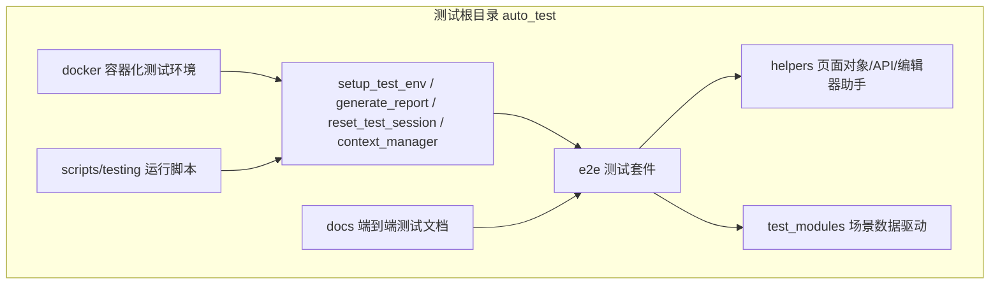
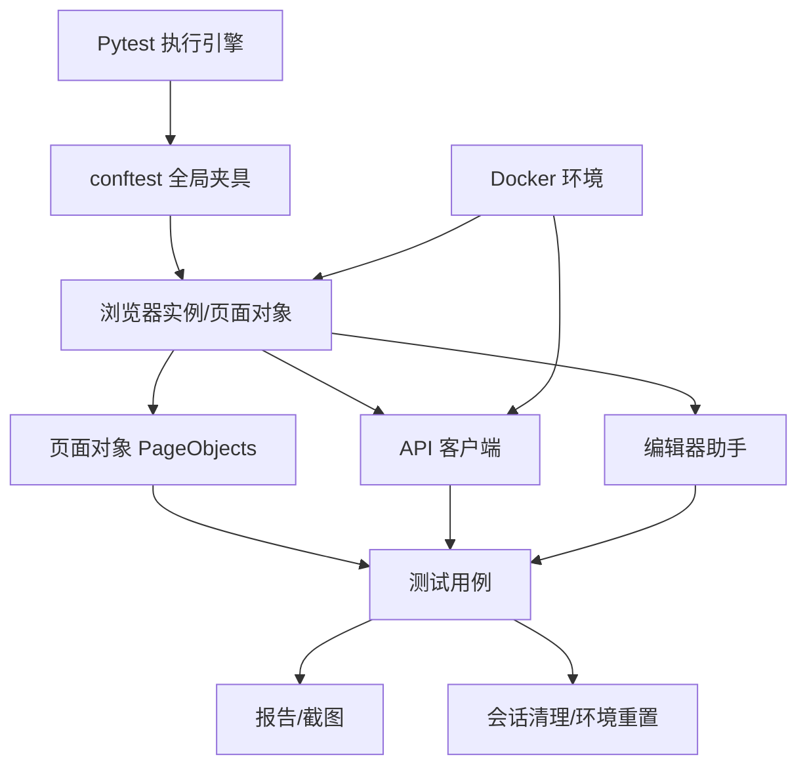
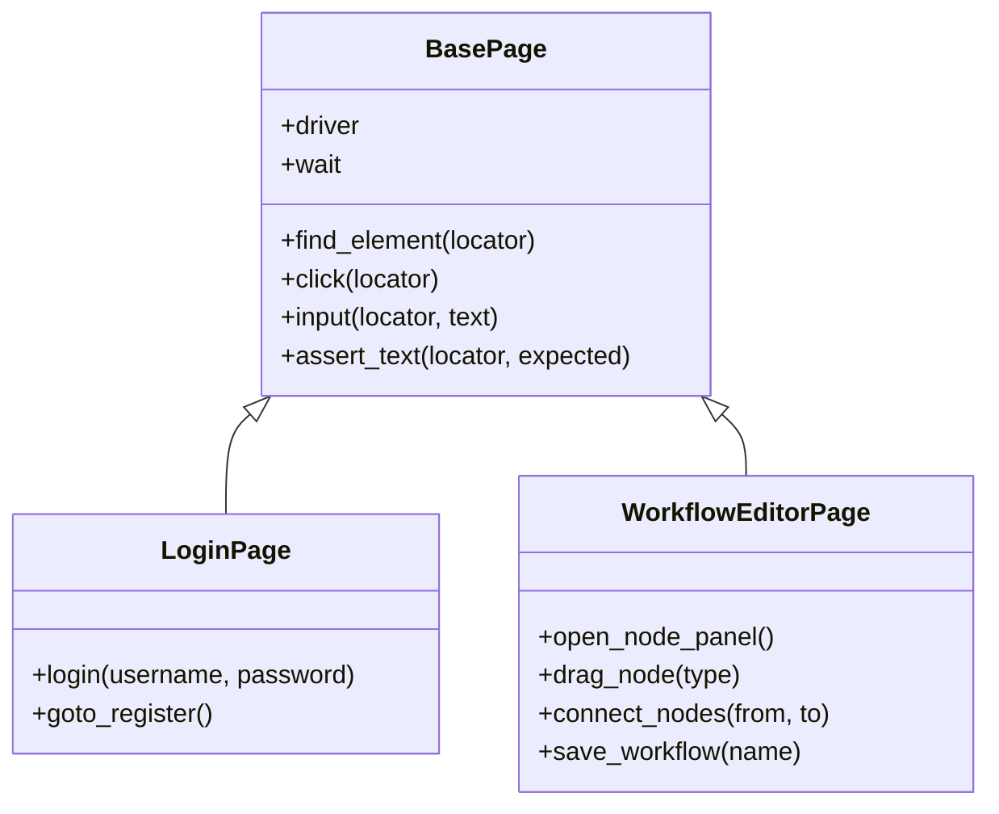
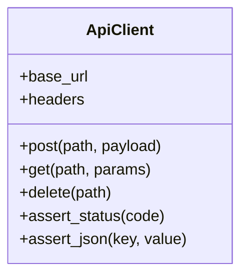
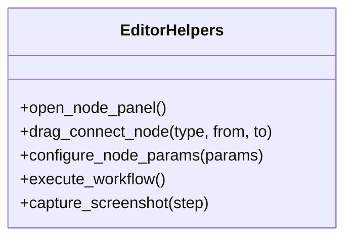
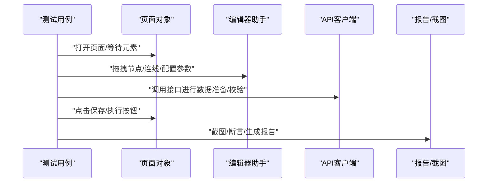
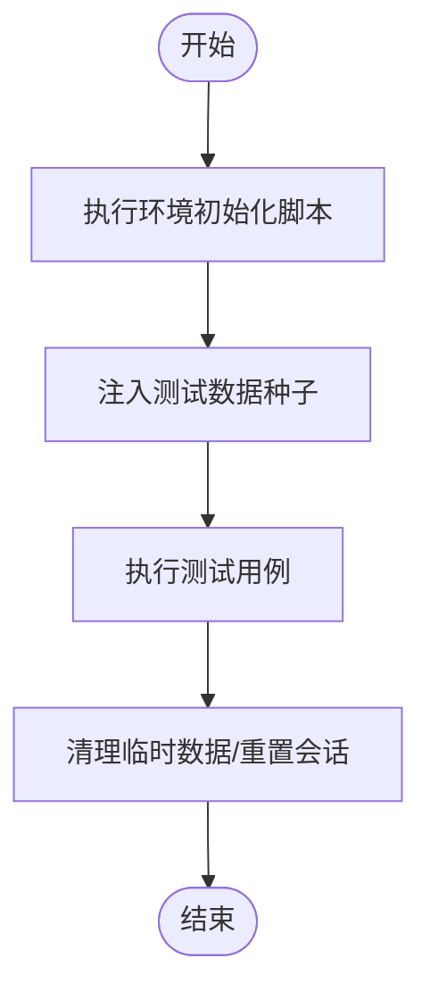
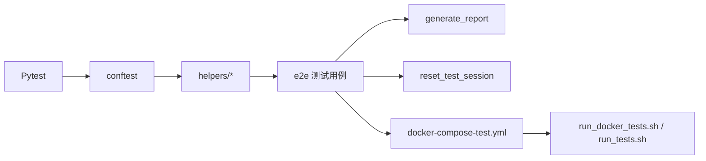

# 端到端测试

<cite>
**本文引用的文件**
- [auto_test/e2e/conftest.py](file://auto_test/e2e/conftest.py)
- [auto_test/e2e/pytest.ini](file://auto_test/e2e/pytest.ini)
- [auto_test/e2e/helpers/page_objects.py](file://auto_test/e2e/helpers/page_objects.py)
- [auto_test/e2e/helpers/api_client.py](file://auto_test/e2e/helpers/api_client.py)
- [auto_test/e2e/helpers/editor_helpers.py](file://auto_test/e2e/helpers/editor_helpers.py)
- [auto_test/test_modules/index.json](file://auto_test/test_modules/index.json)
- [auto_test/setup_test_env.py](file://auto_test/setup_test_env.py)
- [auto_test/generate_report.py](file://auto_test/generate_report.py)
- [auto_test/reset_test_session.py](file://auto_test/reset_test_session.py)
- [auto_test/context_manager.py](file://auto_test/context_manager.py)
- [auto_test/context_config.json](file://auto_test/context_config.json)
- [auto_test/test_config.example.json](file://auto_test/test_config.example.json)
- [auto_test/e2e/docs/script_writer_e2e_test_design.md](file://auto_test/e2e/docs/script_writer_e2e_test_design.md)
- [auto_test/e2e/test_auth.py](file://auto_test/e2e/test_auth.py)
- [auto_test/e2e/test_marketing_agent.py](file://auto_test/e2e/test_marketing_agent.py)
- [auto_test/e2e/test_workflow.py](file://auto_test/e2e/test_workflow.py)
- [auto_test/e2e/test_workflow_page.py](file://auto_test/e2e/test_workflow_page.py)
- [auto_test/e2e/test_script_writer.py](file://auto_test/e2e/test_script_writer.py)
- [auto_test/e2e/test_script_writer_api.py](file://auto_test/e2e/test_script_writer_api.py)
- [auto_test/e2e/test_admin.py](file://auto_test/e2e/test_admin.py)
- [auto_test/e2e/test_admin_api.py](file://auto_test/e2e/test_admin_api.py)
- [auto_test/e2e/test_grid_image.py](file://auto_test/e2e/test_grid_image.py)
- [auto_test/e2e/test_timeline.py](file://auto_test/e2e/test_timeline.py)
- [auto_test/e2e/test_camera_control.py](file://auto_test/e2e/test_camera_control.py)
- [auto_test/e2e/test_character.py](file://auto_test/e2e/test_character.py)
- [auto_test/e2e/test_location.py](file://auto_test/e2e/test_location.py)
- [auto_test/e2e/test_world.py](file://auto_test/e2e/test_world.py)
- [auto_test/e2e/test_session.py](file://auto_test/e2e/test_session.py)
- [auto_test/e2e/test_shot_frame_video.py](file://auto_test/e2e/test_shot_frame_video.py)
- [auto_test/e2e/test_shot_group_video.py](file://auto_test/e2e/test_shot_group_video.py)
- [auto_test/e2e/test_audio.py](file://auto_test/e2e/test_audio.py)
- [auto_test/e2e/test_external_recharge.py](file://auto_test/e2e/test_external_recharge.py)
- [auto_test/e2e/test_error_handling.py](file://auto_test/e2e/test_error_handling.py)
- [auto_test/e2e/test_computing_power_logs.py](file://auto_test/e2e/test_computing_power_logs.py)
- [docker/docker-compose-test.yml](file://docker/docker-compose-test.yml)
- [docker/Dockerfile](file://docker/Dockerfile)
- [scripts/testing/run_docker_tests.sh](file://scripts/testing/run_docker_tests.sh)
- [scripts/testing/run_tests.sh](file://scripts/testing/run_tests.sh)
- [docs/e2e_testing.md](file://docs/e2e_testing.md)
</cite>

## 目录
1. [引言](#引言)
2. [项目结构](#项目结构)
3. [核心组件](#核心组件)
4. [架构总览](#架构总览)
5. [详细组件分析](#详细组件分析)
6. [依赖分析](#依赖分析)
7. [性能考虑](#性能考虑)
8. [故障排查指南](#故障排查指南)
9. [结论](#结论)
10. [附录](#附录)

## 引言
本文件面向ZhiJuTong端到端测试框架，系统性阐述整体架构与设计理念，覆盖用户场景模拟、页面对象模式、测试数据管理、环境搭建（含Docker容器化、数据库初始化与外部服务模拟）、测试用例设计（工作流、营销代理、认证等关键业务场景）、测试数据准备与清理机制、测试报告与截图捕获、调试工具、并行执行、环境变量配置以及持续集成中的E2E流水线设计。文档以仓库中现有实现为依据，避免臆造信息，并通过图示与来源标注帮助读者快速定位到具体实现。

## 项目结构
端到端测试相关代码集中在auto_test目录，其中：
- e2e：测试用例与通用辅助模块（页面对象、API客户端、编辑器助手）
- test_modules：测试场景与步骤的数据驱动定义
- 根目录脚本：环境搭建、报告生成、会话重置、上下文管理等
- docker：容器化测试环境编排
- scripts/testing：测试运行脚本
- docs：端到端测试文档

**章节来源**
- [auto_test/e2e/conftest.py](file://auto_test/e2e/conftest.py)
- [auto_test/e2e/helpers/page_objects.py](file://auto_test/e2e/helpers/page_objects.py)
- [auto_test/e2e/helpers/api_client.py](file://auto_test/e2e/helpers/api_client.py)
- [auto_test/e2e/helpers/editor_helpers.py](file://auto_test/e2e/helpers/editor_helpers.py)
- [auto_test/test_modules/index.json](file://auto_test/test_modules/index.json)
- [auto_test/setup_test_env.py](file://auto_test/setup_test_env.py)
- [auto_test/generate_report.py](file://auto_test/generate_report.py)
- [auto_test/reset_test_session.py](file://auto_test/reset_test_session.py)
- [auto_test/context_manager.py](file://auto_test/context_manager.py)
- [docker/docker-compose-test.yml](file://docker/docker-compose-test.yml)
- [docker/Dockerfile](file://docker/Dockerfile)
- [scripts/testing/run_docker_tests.sh](file://scripts/testing/run_docker_tests.sh)
- [scripts/testing/run_tests.sh](file://scripts/testing/run_tests.sh)
- [docs/e2e_testing.md](file://docs/e2e_testing.md)

## 核心组件
- 测试配置与夹具（Pytest）：通过conftest.py统一注入浏览器实例、会话状态、截图与报告路径等
- 页面对象（Page Objects）：封装页面元素定位与交互，隔离UI变化对用例的影响
- API客户端：封装HTTP请求，支持鉴权、重试、断言等
- 编辑器助手：针对特定编辑器（如工作流编辑器）的交互封装
- 数据驱动场景：通过JSON模块定义场景步骤与期望，便于复用与扩展
- 环境与会话管理：测试前初始化、数据库与外部服务准备；测试后清理与会话重置
- 报告与截图：统一生成HTML报告与失败截图，便于问题定位
- 容器化与运行脚本：Docker Compose编排测试环境，Shell脚本统一入口

**章节来源**
- [auto_test/e2e/conftest.py](file://auto_test/e2e/conftest.py)
- [auto_test/e2e/helpers/page_objects.py](file://auto_test/e2e/helpers/page_objects.py)
- [auto_test/e2e/helpers/api_client.py](file://auto_test/e2e/helpers/api_client.py)
- [auto_test/e2e/helpers/editor_helpers.py](file://auto_test/e2e/helpers/editor_helpers.py)
- [auto_test/test_modules/index.json](file://auto_test/test_modules/index.json)
- [auto_test/setup_test_env.py](file://auto_test/setup_test_env.py)
- [auto_test/generate_report.py](file://auto_test/generate_report.py)
- [auto_test/reset_test_session.py](file://auto_test/reset_test_session.py)
- [auto_test/context_manager.py](file://auto_test/context_manager.py)

## 架构总览
端到端测试采用“配置-夹具-页面对象-用例”的分层架构。Pytest负责发现与执行测试，conftest统一注入全局资源；页面对象与API客户端抽象UI与接口交互；数据驱动场景定义业务流程；环境脚本与Docker完成基础设施准备；报告与截图贯穿执行过程。

**图表来源**
- [auto_test/e2e/conftest.py](file://auto_test/e2e/conftest.py)
- [auto_test/e2e/helpers/page_objects.py](file://auto_test/e2e/helpers/page_objects.py)
- [auto_test/e2e/helpers/api_client.py](file://auto_test/e2e/helpers/api_client.py)
- [auto_test/e2e/helpers/editor_helpers.py](file://auto_test/e2e/helpers/editor_helpers.py)
- [docker/docker-compose-test.yml](file://docker/docker-compose-test.yml)

## 详细组件分析

### 页面对象模式
页面对象用于封装页面元素定位策略与交互方法，降低UI变化对用例的影响。典型做法包括：
- 将页面元素定位封装为属性或方法，集中维护选择器
- 将常用交互组合为语义化方法（如登录、保存、提交），提升可读性
- 在页面对象间建立关系，通过导航或共享上下文传递状态

**图表来源**
- [auto_test/e2e/helpers/page_objects.py](file://auto_test/e2e/helpers/page_objects.py)

**章节来源**
- [auto_test/e2e/helpers/page_objects.py](file://auto_test/e2e/helpers/page_objects.py)

### API客户端
API客户端负责与后端服务通信，常见职责包括：
- 统一请求头（鉴权、内容类型）
- 请求重试与超时控制
- 响应断言（状态码、字段存在性、值范围）
- 日志记录与错误处理

**图表来源**
- [auto_test/e2e/helpers/api_client.py](file://auto_test/e2e/helpers/api_client.py)

**章节来源**
- [auto_test/e2e/helpers/api_client.py](file://auto_test/e2e/helpers/api_client.py)

### 编辑器助手
针对复杂编辑器（如工作流编辑器）的交互封装，包括：
- 节点拖拽、连线、参数配置
- 步骤执行与状态监控
- 截图与失败回溯

**图表来源**
- [auto_test/e2e/helpers/editor_helpers.py](file://auto_test/e2e/helpers/editor_helpers.py)

**章节来源**
- [auto_test/e2e/helpers/editor_helpers.py](file://auto_test/e2e/helpers/editor_helpers.py)

### 测试用例设计与场景
测试用例围绕关键业务场景展开，涵盖：
- 认证与会话：登录、登出、权限校验
- 工作流编辑与执行：节点操作、连线、保存与执行
- 营销代理：任务创建、状态流转、结果校验
- 脚本写作：场景构建、角色与地点管理、生成与导出
- 媒体与视频：网格图像生成、分镜头视频生成、时间轴操作
- 管理后台：用户与算力日志、外部充值、异常处理

**图表来源**
- [auto_test/e2e/helpers/page_objects.py](file://auto_test/e2e/helpers/page_objects.py)
- [auto_test/e2e/helpers/editor_helpers.py](file://auto_test/e2e/helpers/editor_helpers.py)
- [auto_test/e2e/helpers/api_client.py](file://auto_test/e2e/helpers/api_client.py)

**章节来源**
- [auto_test/e2e/test_auth.py](file://auto_test/e2e/test_auth.py)
- [auto_test/e2e/test_workflow.py](file://auto_test/e2e/test_workflow.py)
- [auto_test/e2e/test_workflow_page.py](file://auto_test/e2e/test_workflow_page.py)
- [auto_test/e2e/test_marketing_agent.py](file://auto_test/e2e/test_marketing_agent.py)
- [auto_test/e2e/test_script_writer.py](file://auto_test/e2e/test_script_writer.py)
- [auto_test/e2e/test_script_writer_api.py](file://auto_test/e2e/test_script_writer_api.py)
- [auto_test/e2e/test_admin.py](file://auto_test/e2e/test_admin.py)
- [auto_test/e2e/test_admin_api.py](file://auto_test/e2e/test_admin_api.py)
- [auto_test/e2e/test_grid_image.py](file://auto_test/e2e/test_grid_image.py)
- [auto_test/e2e/test_timeline.py](file://auto_test/e2e/test_timeline.py)
- [auto_test/e2e/test_camera_control.py](file://auto_test/e2e/test_camera_control.py)
- [auto_test/e2e/test_character.py](file://auto_test/e2e/test_character.py)
- [auto_test/e2e/test_location.py](file://auto_test/e2e/test_location.py)
- [auto_test/e2e/test_world.py](file://auto_test/e2e/test_world.py)
- [auto_test/e2e/test_session.py](file://auto_test/e2e/test_session.py)
- [auto_test/e2e/test_shot_frame_video.py](file://auto_test/e2e/test_shot_frame_video.py)
- [auto_test/e2e/test_shot_group_video.py](file://auto_test/e2e/test_shot_group_video.py)
- [auto_test/e2e/test_audio.py](file://auto_test/e2e/test_audio.py)
- [auto_test/e2e/test_external_recharge.py](file://auto_test/e2e/test_external_recharge.py)
- [auto_test/e2e/test_error_handling.py](file://auto_test/e2e/test_error_handling.py)
- [auto_test/e2e/test_computing_power_logs.py](file://auto_test/e2e/test_computing_power_logs.py)

### 测试数据准备与清理
- 初始化：在测试前通过setup脚本准备数据库与外部服务，确保测试环境一致
- 数据种子：通过API或脚本注入测试所需的基础数据（用户、工作流、媒体等）
- 清理：测试结束后执行重置逻辑，删除临时数据，恢复会话状态

**图表来源**
- [auto_test/setup_test_env.py](file://auto_test/setup_test_env.py)
- [auto_test/reset_test_session.py](file://auto_test/reset_test_session.py)
- [auto_test/context_manager.py](file://auto_test/context_manager.py)

**章节来源**
- [auto_test/setup_test_env.py](file://auto_test/setup_test_env.py)
- [auto_test/reset_test_session.py](file://auto_test/reset_test_session.py)
- [auto_test/context_manager.py](file://auto_test/context_manager.py)

### 测试报告、截图与调试
- 报告生成：统一生成HTML报告，包含用例执行结果、失败截图与日志
- 截图捕获：在断言失败或关键步骤处自动截图，便于问题定位
- 调试工具：结合浏览器开发者工具与日志输出，定位UI与接口问题

**章节来源**
- [auto_test/generate_report.py](file://auto_test/generate_report.py)

### 并行执行与环境变量
- 并行策略：通过Pytest插件或参数化实现用例并行执行，注意共享资源与状态隔离
- 环境变量：通过配置文件与命令行参数控制浏览器类型、目标URL、报告路径等

**章节来源**
- [auto_test/e2e/conftest.py](file://auto_test/e2e/conftest.py)
- [auto_test/test_config.example.json](file://auto_test/test_config.example.json)

### 持续集成中的E2E流水线
- 触发条件：PR/MR合并请求或定时任务触发
- 步骤：拉取镜像 -> 启动Docker Compose -> 运行测试脚本 -> 生成报告 -> 上传Artifacts
- 失败处理：失败时保留日志与截图，通知相关人员

**章节来源**
- [docker/docker-compose-test.yml](file://docker/docker-compose-test.yml)
- [scripts/testing/run_docker_tests.sh](file://scripts/testing/run_docker_tests.sh)
- [scripts/testing/run_tests.sh](file://scripts/testing/run_tests.sh)

## 依赖分析
- 测试框架：Pytest作为执行引擎，conftest提供全局夹具
- 页面对象与API客户端：被各测试用例依赖，形成稳定的交互层
- 数据驱动：test_modules中的JSON定义被用例读取，实现场景复用
- 环境与脚本：Docker Compose与Shell脚本提供一致的测试环境
- 报告与清理：generate_report与reset_test_session贯穿执行周期

**图表来源**
- [auto_test/e2e/conftest.py](file://auto_test/e2e/conftest.py)
- [auto_test/e2e/helpers/page_objects.py](file://auto_test/e2e/helpers/page_objects.py)
- [auto_test/e2e/helpers/api_client.py](file://auto_test/e2e/helpers/api_client.py)
- [auto_test/e2e/helpers/editor_helpers.py](file://auto_test/e2e/helpers/editor_helpers.py)
- [auto_test/generate_report.py](file://auto_test/generate_report.py)
- [auto_test/reset_test_session.py](file://auto_test/reset_test_session.py)
- [docker/docker-compose-test.yml](file://docker/docker-compose-test.yml)
- [scripts/testing/run_docker_tests.sh](file://scripts/testing/run_docker_tests.sh)
- [scripts/testing/run_tests.sh](file://scripts/testing/run_tests.sh)

**章节来源**
- [auto_test/e2e/conftest.py](file://auto_test/e2e/conftest.py)
- [auto_test/e2e/helpers/page_objects.py](file://auto_test/e2e/helpers/page_objects.py)
- [auto_test/e2e/helpers/api_client.py](file://auto_test/e2e/helpers/api_client.py)
- [auto_test/e2e/helpers/editor_helpers.py](file://auto_test/e2e/helpers/editor_helpers.py)
- [auto_test/generate_report.py](file://auto_test/generate_report.py)
- [auto_test/reset_test_session.py](file://auto_test/reset_test_session.py)
- [docker/docker-compose-test.yml](file://docker/docker-compose-test.yml)
- [scripts/testing/run_docker_tests.sh](file://scripts/testing/run_docker_tests.sh)
- [scripts/testing/run_tests.sh](file://scripts/testing/run_tests.sh)

## 性能考虑
- 减少页面等待：合理设置显式等待与隐式等待，避免过长等待影响吞吐
- 并行安全：确保并行用例无共享状态冲突，必要时使用独立数据库或命名空间
- 截图与报告：仅在失败时截图，减少IO开销
- 环境预热：Docker容器与数据库连接池预热，缩短首次执行时间

## 故障排查指南
- 页面元素未找到：检查页面对象选择器是否随UI更新而变更；确认等待策略是否足够
- 接口失败：核对API客户端请求头与鉴权；查看响应断言与错误日志
- 数据不一致：确认测试前数据种子是否成功注入；检查清理逻辑是否执行
- 截图缺失：确认失败截图钩子是否启用；检查报告路径权限
- 环境问题：核对Docker Compose配置与端口占用；确认数据库迁移是否完成

**章节来源**
- [auto_test/e2e/helpers/page_objects.py](file://auto_test/e2e/helpers/page_objects.py)
- [auto_test/e2e/helpers/api_client.py](file://auto_test/e2e/helpers/api_client.py)
- [auto_test/generate_report.py](file://auto_test/generate_report.py)
- [auto_test/reset_test_session.py](file://auto_test/reset_test_session.py)
- [docker/docker-compose-test.yml](file://docker/docker-compose-test.yml)

## 结论
ZhiJuTong端到端测试框架通过清晰的分层架构与数据驱动设计，实现了对关键业务场景的自动化覆盖。页面对象与API客户端的抽象提升了可维护性；Docker容器化与环境脚本保障了执行一致性；报告与清理机制完善了可观测性与可重复性。建议在CI中引入并行执行与状态隔离策略，持续优化等待与截图策略，进一步提升测试效率与稳定性。

## 附录
- 端到端测试文档：参见docs/e2e_testing.md
- 脚本写作者E2E测试设计：参见auto_test/e2e/docs/script_writer_e2e_test_design.md
- 测试模块索引：参见auto_test/test_modules/index.json

**章节来源**
- [docs/e2e_testing.md](file://docs/e2e_testing.md)
- [auto_test/e2e/docs/script_writer_e2e_test_design.md](file://auto_test/e2e/docs/script_writer_e2e_test_design.md)
- [auto_test/test_modules/index.json](file://auto_test/test_modules/index.json)