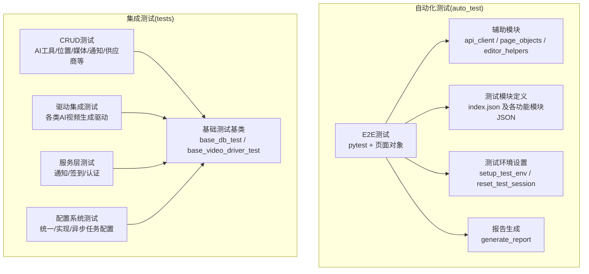
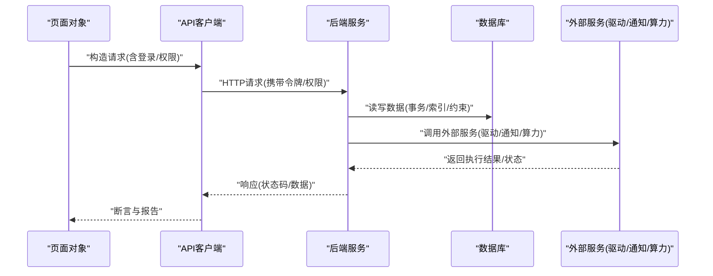
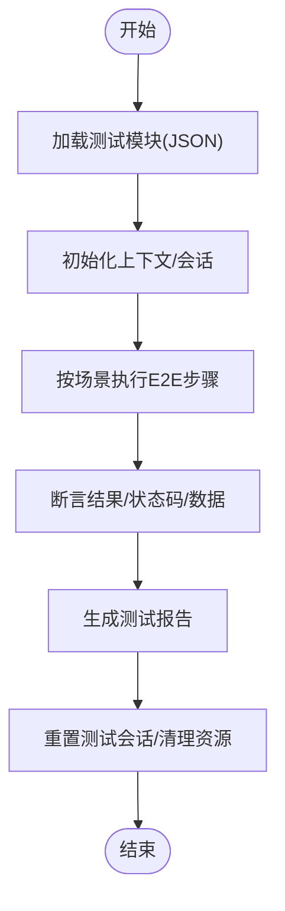
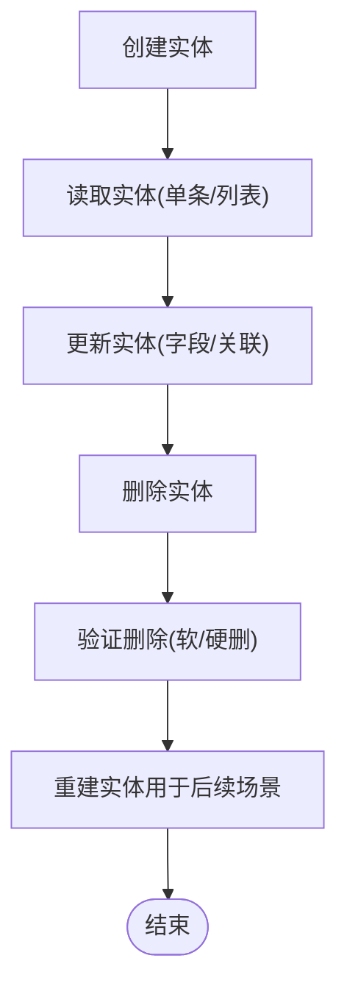
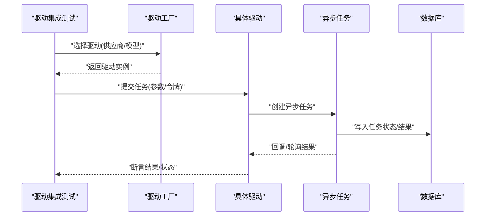
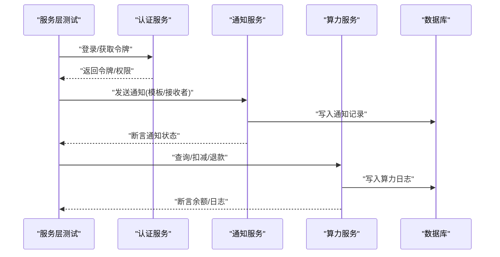
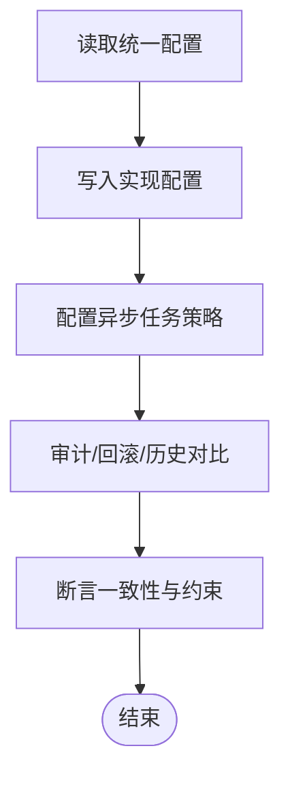
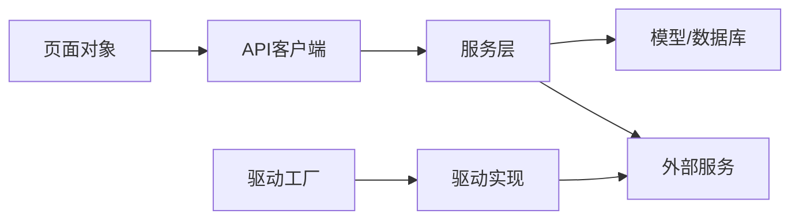

# 集成测试

<cite>
**本文引用的文件**
- [auto_test/e2e/conftest.py](file://auto_test/e2e/conftest.py)
- [auto_test/e2e/test_auth.py](file://auto_test/e2e/test_auth.py)
- [auto_test/e2e/test_admin.py](file://auto_test/e2e/test_admin.py)
- [auto_test/e2e/test_admin_api.py](file://auto_test/e2e/test_admin_api.py)
- [auto_test/e2e/test_grid_image.py](file://auto_test/e2e/test_grid_image.py)
- [auto_test/e2e/test_location.py](file://auto_test/e2e/test_location.py)
- [auto_test/e2e/test_marketing_agent.py](file://auto_test/e2e/test_marketing_agent.py)
- [auto_test/e2e/test_marketing_agent_api.py](file://auto_test/e2e/test_marketing_agent_api.py)
- [auto_test/e2e/test_script_writer.py](file://auto_test/e2e/test_script_writer.py)
- [auto_test/e2e/test_script_writer_api.py](file://auto_test/e2e/test_script_writer_api.py)
- [auto_test/e2e/test_shot_frame_video.py](file://auto_test/e2e/test_shot_frame_video.py)
- [auto_test/e2e/test_shot_group_video.py](file://auto_test/e2e/test_shot_group_video.py)
- [auto_test/e2e/test_timeline.py](file://auto_test/e2e/test_timeline.py)
- [auto_test/e2e/test_workflow.py](file://auto_test/e2e/test_workflow.py)
- [auto_test/e2e/test_workflow_page.py](file://auto_test/e2e/test_workflow_page.py)
- [auto_test/e2e/test_world.py](file://auto_test/e2e/test_world.py)
- [auto_test/e2e/helpers/api_client.py](file://auto_test/e2e/helpers/api_client.py)
- [auto_test/e2e/helpers/page_objects.py](file://auto_test/e2e/helpers/page_objects.py)
- [auto_test/e2e/helpers/editor_helpers.py](file://auto_test/e2e/helpers/editor_helpers.py)
- [auto_test/setup_test_env.py](file://auto_test/setup_test_env.py)
- [auto_test/reset_test_session.py](file://auto_test/reset_test_session.py)
- [auto_test/generate_report.py](file://auto_test/generate_report.py)
- [auto_test/context_manager.py](file://auto_test/context_manager.py)
- [auto_test/context_config.json](file://auto_test/context_config.json)
- [auto_test/test_modules/index.json](file://auto_test/test_modules/index.json)
- [auto_test/test_modules/auth.json](file://auto_test/test_modules/auth.json)
- [auto_test/test_modules/location_management.json](file://auto_test/test_modules/location_management.json)
- [auto_test/test_modules/marketing_agent.json](file://auto_test/test_modules/marketing_agent.json)
- [auto_test/test_modules/script_writer.json](file://auto_test/test_modules/script_writer.json)
- [auto_test/test_modules/grid_image_generation.json](file://auto_test/test_modules/grid_image_generation.json)
- [auto_test/test_modules/shot_frame_video.json](file://auto_test/test_modules/shot_frame_video.json)
- [auto_test/test_modules/shot_group_video.json](file://auto_test/test_modules/shot_group_video.json)
- [auto_test/test_modules/timeline.json](file://auto_test/test_modules/timeline.json)
- [auto_test/test_modules/workflow_editor.json](file://auto_test/test_modules/workflow_editor.json)
- [auto_test/test_modules/workflow_list.json](file://auto_test/test_modules/workflow_list.json)
- [auto_test/test_modules/world_management.json](file://auto_test/test_modules/world_management.json)
- [auto_test/test_modules/audio.json](file://auto_test/test_modules/audio.json)
- [auto_test/test_modules/camera_control.json](file://auto_test/test_modules/camera_control.json)
- [auto_test/test_modules/error_handling.json](file://auto_test/test_modules/error_handling.json)
- [auto_test/merge_test_cases.py](file://auto_test/merge_test_cases.py)
- [auto_test/check_duplicate_ids.py](file://auto_test/check_duplicate_ids.py)
- [auto_test/start_claude_full_permissions.ps1](file://auto_test/start_claude_full_permissions.ps1)
- [auto_test/CLAUDE.md](file://auto_test/CLAUDE.md)
- [auto_test/SETUP.md](file://auto_test/SETUP.md)
- [auto_test/test_config.example.json](file://auto_test/test_config.example.json)
- [auto_test/e2e/docs/script_writer_e2e_test_design.md](file://auto_test/e2e/docs/script_writer_e2e_test_design.md)
- [tests/base/base_db_test.py](file://tests/base/base_db_test.py)
- [tests/base/db_test_config.py](file://tests/base/db_test_config.py)
- [tests/base/base_video_driver_test.py](file://tests/base/base_video_driver_test.py)
- [tests/crud/test_ai_tools_crud.py](file://tests/crud/test_ai_tools_crud.py)
- [tests/crud/test_location_crud.py](file://tests/crud/test_location_crud.py)
- [tests/crud/test_media_file_mapping_crud.py](file://tests/crud/test_media_file_mapping_crud.py)
- [tests/crud/test_notifications_crud.py](file://tests/crud/test_notifications_crud.py)
- [tests/crud/test_vendor_crud.py](file://tests/crud/test_vendor_crud.py)
- [tests/crud/test_vendor_model_crud.py](file://tests/crud/test_vendor_model_crud.py)
- [tests/crud/test_world_crud.py](file://tests/crud/test_world_crud.py)
- [tests/driver_integration/test_digital_human_driver_with_db.py](file://tests/driver_integration/test_digital_human_driver_with_db.py)
- [tests/driver_integration/test_gemini_driver_with_db.py](file://tests/driver_integration/test_gemini_driver_with_db.py)
- [tests/driver_integration/test_kling_driver_with_db.py](file://tests/driver_integration/test_kling_driver_with_db.py)
- [tests/driver_integration/test_ltx2_driver_with_db.py](file://tests/driver_integration/test_ltx2_driver_with_db.py)
- [tests/driver_integration/test_runninghub_audio_driver.py](file://tests/driver_integration/test_runninghub_audio_driver.py)
- [tests/driver_integration/test_runninghub_slot_release.py](file://tests/driver_integration/test_runninghub_slot_release.py)
- [tests/driver_integration/test_seedream_driver_with_db.py](file://tests/driver_integration/test_seedream_driver_with_db.py)
- [tests/driver_integration/test_sora2_driver_with_db.py](file://tests/driver_integration/test_sora2_driver_with_db.py)
- [tests/driver_integration/test_veo3_driver_with_db.py](file://tests/driver_integration/test_veo3_driver_with_db.py)
- [tests/driver_integration/test_vidu_driver_with_db.py](file://tests/driver_integration/test_vidu_driver_with_db.py)
- [tests/driver_integration/test_wan22_driver_with_db.py](file://tests/driver_integration/test_wan22_driver_with_db.py)
- [tests/services/test_notification_service.py](file://tests/services/test_notification_service.py)
- [tests/services/test_checkin_service.py](file://tests/services/test_checkin_service.py)
- [tests/config/test_unified_config_frontend.py](file://tests/config/test_unified_config_frontend.py)
- [tests/config/test_implementation_config.py](file://tests/config/test_implementation_config.py)
- [tests/config/test_async_task_config.py](file://tests/config/test_async_task_config.py)
- [tests/config/test_power_modifiers.py](file://tests/config/test_power_modifiers.py)
- [tests/config/test_short_key.py](file://tests/config/test_short_key.py)
- [perseids_server/services/auth_service.py](file://perseids_server/services/auth_service.py)
- [perseids_server/services/computing_power_service.py](file://perseids_server/services/computing_power_service.py)
- [perseids_server/services/verify_code_service.py](file://perseids_server/services/verify_code_service.py)
- [perseids_server/utils/token.py](file://perseids_server/utils/token.py)
- [perseids_server/utils/permission.py](file://perseids_server/utils/permission.py)
- [services/notification_service.py](file://services/notification_service.py)
- [services/checkin_service.py](file://services/checkin_service.py)
- [task/visual_drivers/driver_factory.py](file://task/visual_drivers/driver_factory.py)
- [task/visual_drivers/base_video_driver.py](file://task/visual_drivers/base_video_driver.py)
- [task/visual_drivers/digital_human_runninghub_v1_driver.py](file://task/visual_drivers/digital_human_runninghub_v1_driver.py)
- [task/visual_drivers/gemini_duomi_v1_driver.py](file://task/visual_drivers/gemini_duomi_v1_driver.py)
- [task/visual_drivers/kling_common_v1_driver.py](file://task/visual_drivers/kling_common_v1_driver.py)
- [task/visual_drivers/ltx2_runninghub_v1_driver.py](file://task/visual_drivers/ltx2_runninghub_v1_driver.py)
- [task/visual_drivers/sora2_duomi_v1_driver.py](file://task/visual_drivers/sora2_duomi_v1_driver.py)
- [task/visual_drivers/veo3_common_v1_driver.py](file://task/visual_drivers/veo3_common_v1_driver.py)
- [task/visual_drivers/vidu_default_driver.py](file://task/visual_drivers/vidu_default_driver.py)
- [task/visual_drivers/wan22_runninghub_v1_driver.py](file://task/visual_drivers/wan22_runninghub_v1_driver.py)
- [task/async_drivers/runninghub_audio_driver.py](file://task/async_drivers/runninghub_audio_driver.py)
- [task/runninghub_async_task.py](file://task/runninghub_async_task.py)
- [model/ai_tools.py](file://model/ai_tools.py)
- [model/location.py](file://model/location.py)
- [model/media_file_mapping.py](file://model/media_file_mapping.py)
- [model/notifications.py](file://model/notifications.py)
- [model/vendor.py](file://model/vendor.py)
- [model/vendor_model.py](file://model/vendor_model.py)
- [model/world.py](file://model/world.py)
- [model/system_config.py](file://model/system_config.py)
- [model/implementation_power_config.py](file://model/implementation_power_config.py)
- [model/implementation_power.py](file://model/implementation_power.py)
- [model/async_tasks.py](file://model/async_tasks.py)
- [model/runninghub_slots.py](file://model/runninghub_slots.py)
- [config/unified_config.py](file://config/unified_config.py)
- [config/default_configs.py](file://config/default_configs.py)
- [config/constant.py](file://config/constant.py)
- [config/media_file_policy.py](file://config/media_file_policy.py)
- [docker/docker-compose-test.yml](file://docker/docker-compose-test.yml)
- [docker/Dockerfile](file://docker/Dockerfile)
- [scripts/testing/run_docker_tests.sh](file://scripts/testing/run_docker_tests.sh)
- [scripts/testing/run_tests.sh](file://scripts/testing/run_tests.sh)
- [scripts/testing/run_unit_tests.py](file://scripts/testing/run_unit_tests.py)
- [scripts/testing/run_migrations.sh](file://scripts/testing/run_migrations.sh)
- [scripts/testing/run_driver_tests.sh](file://scripts/testing/run_driver_tests.sh)
- [docs/e2e_testing.md](file://docs/e2e_testing.md)
- [docs/database_migration.md](file://docs/database_migration.md)
- [docs/媒体文件缓存管理方案.md](file://docs/媒体文件缓存管理方案.md)
- [docs/权限系统/权限系统设计.md](file://docs/权限系统/权限系统设计.md)
- [docs/权限系统/功能权限码.md](file://docs/权限系统/功能权限码.md)
- [docs/权限系统/权限装饰器使用说明.md](file://docs/权限系统/权限装饰器使用说明.md)
- [docs/后台/统一配置系统.md](file://docs/后台/统一配置系统.md)
- [docs/后台/算力多维度计算方案.md](file://docs/后台/算力多维度计算方案.md)
- [docs/后台/runninghub并发控制.md](file://docs/后台/runninghub并发控制.md)
- [docs/视频/README.md](file://docs/视频/README.md)
- [docs/图像/README.md](file://docs/图像/README.md)
- [docs/脚本/README.md](file://docs/脚本/README.md)
- [docs/通知.md](file://docs/通知.md)
- [docs/数据库迁移.md](file://docs/数据库迁移.md)
</cite>

## 目录
1. [引言](#引言)
2. [项目结构](#项目结构)
3. [核心组件](#核心组件)
4. [架构总览](#架构总览)
5. [详细组件分析](#详细组件分析)
6. [依赖关系分析](#依赖关系分析)
7. [性能考虑](#性能考虑)
8. [故障排查指南](#故障排查指南)
9. [结论](#结论)
10. [附录](#附录)

## 引言
本文件面向ZhiJuTong项目的集成测试体系，系统化阐述端到端（E2E）测试与后端集成测试的目标、范围与实施策略。重点覆盖以下方面：
- 模块间交互测试：从前端页面对象到后端API再到数据库与外部服务的全链路验证。
- 数据库集成测试：基于真实数据库的CRUD与业务流程验证，确保数据一致性与事务边界。
- 外部服务集成测试：对AI视频生成驱动、通知服务、算力服务等外部接口进行可重复的集成验证。
- CRUD测试设计模式：围绕AI工具、角色、位置、媒体文件等核心实体，建立可复用的测试模板与断言策略。
- 驱动程序集成测试：针对各类AI视频生成驱动（如RunningHub、Gemini、Kling、Veo3、Vidu等）的调用、状态轮询与结果校验。
- 服务层集成测试：认证服务、通知服务、算力服务的端到端验证，包含鉴权、权限与计费逻辑。
- 配置系统集成测试：统一配置、实现配置与异步任务配置的读写一致性与回滚验证。
- 测试数据管理、数据库事务与测试环境隔离的最佳实践。

## 项目结构
ZhiJuTong的测试体系由两部分组成：
- 自动化测试（auto_test）：基于Pytest的E2E测试，包含页面对象、API客户端与测试模块定义。
- 单元/集成测试（tests）：覆盖CRUD、驱动集成、服务层与配置系统的集成测试。

图表来源
- [auto_test/e2e/conftest.py](file://auto_test/e2e/conftest.py)
- [auto_test/e2e/helpers/api_client.py](file://auto_test/e2e/helpers/api_client.py)
- [auto_test/e2e/helpers/page_objects.py](file://auto_test/e2e/helpers/page_objects.py)
- [auto_test/e2e/helpers/editor_helpers.py](file://auto_test/e2e/helpers/editor_helpers.py)
- [auto_test/test_modules/index.json](file://auto_test/test_modules/index.json)
- [auto_test/setup_test_env.py](file://auto_test/setup_test_env.py)
- [auto_test/reset_test_session.py](file://auto_test/reset_test_session.py)
- [auto_test/generate_report.py](file://auto_test/generate_report.py)
- [tests/base/base_db_test.py](file://tests/base/base_db_test.py)
- [tests/base/base_video_driver_test.py](file://tests/base/base_video_driver_test.py)

章节来源
- [auto_test/e2e/conftest.py](file://auto_test/e2e/conftest.py)
- [auto_test/e2e/helpers/api_client.py](file://auto_test/e2e/helpers/api_client.py)
- [auto_test/e2e/helpers/page_objects.py](file://auto_test/e2e/helpers/page_objects.py)
- [auto_test/e2e/helpers/editor_helpers.py](file://auto_test/e2e/helpers/editor_helpers.py)
- [auto_test/test_modules/index.json](file://auto_test/test_modules/index.json)
- [auto_test/setup_test_env.py](file://auto_test/setup_test_env.py)
- [auto_test/reset_test_session.py](file://auto_test/reset_test_session.py)
- [auto_test/generate_report.py](file://auto_test/generate_report.py)
- [tests/base/base_db_test.py](file://tests/base/base_db_test.py)
- [tests/base/base_video_driver_test.py](file://tests/base/base_video_driver_test.py)

## 核心组件
- E2E测试框架与页面对象：通过Pytest + 页面对象模型组织端到端场景，结合API客户端与编辑器助手完成复杂业务流程。
- 测试模块定义：以JSON形式声明测试步骤、前置条件与期望结果，便于合并与复用。
- 基础测试基类：提供数据库连接、事务回滚、驱动测试基类等通用能力，确保测试隔离与可重复性。
- 驱动与服务集成：覆盖视频生成驱动工厂、通知服务、算力服务与认证服务的集成验证。
- 配置系统：统一配置、实现配置与异步任务配置的读写一致性与回滚验证。

章节来源
- [auto_test/e2e/conftest.py](file://auto_test/e2e/conftest.py)
- [auto_test/e2e/helpers/api_client.py](file://auto_test/e2e/helpers/api_client.py)
- [auto_test/e2e/helpers/page_objects.py](file://auto_test/e2e/helpers/page_objects.py)
- [auto_test/e2e/helpers/editor_helpers.py](file://auto_test/e2e/helpers/editor_helpers.py)
- [auto_test/test_modules/index.json](file://auto_test/test_modules/index.json)
- [tests/base/base_db_test.py](file://tests/base/base_db_test.py)
- [tests/base/base_video_driver_test.py](file://tests/base/base_video_driver_test.py)

## 架构总览
下图展示E2E测试从页面对象到后端API、数据库与外部服务的整体流程：

图表来源
- [auto_test/e2e/helpers/page_objects.py](file://auto_test/e2e/helpers/page_objects.py)
- [auto_test/e2e/helpers/api_client.py](file://auto_test/e2e/helpers/api_client.py)
- [perseids_server/services/auth_service.py](file://perseids_server/services/auth_service.py)
- [services/notification_service.py](file://services/notification_service.py)
- [task/visual_drivers/driver_factory.py](file://task/visual_drivers/driver_factory.py)

## 详细组件分析

### E2E测试设计与执行
- 测试发现与夹持：通过Pytest配置与conftest集中初始化浏览器、会话与上下文管理。
- 页面对象与API客户端：页面对象封装UI交互；API客户端负责HTTP请求与响应解析；编辑器助手提供节点操作与工作流编排。
- 测试模块化：index.json与各功能模块JSON定义测试步骤、前置条件与断言，支持合并与去重。
- 报告与环境：测试结束后生成报告并清理测试会话，保证环境隔离。

图表来源
- [auto_test/e2e/conftest.py](file://auto_test/e2e/conftest.py)
- [auto_test/test_modules/index.json](file://auto_test/test_modules/index.json)
- [auto_test/generate_report.py](file://auto_test/generate_report.py)
- [auto_test/reset_test_session.py](file://auto_test/reset_test_session.py)

章节来源
- [auto_test/e2e/conftest.py](file://auto_test/e2e/conftest.py)
- [auto_test/e2e/helpers/api_client.py](file://auto_test/e2e/helpers/api_client.py)
- [auto_test/e2e/helpers/page_objects.py](file://auto_test/e2e/helpers/page_objects.py)
- [auto_test/e2e/helpers/editor_helpers.py](file://auto_test/e2e/helpers/editor_helpers.py)
- [auto_test/test_modules/index.json](file://auto_test/test_modules/index.json)
- [auto_test/generate_report.py](file://auto_test/generate_report.py)
- [auto_test/reset_test_session.py](file://auto_test/reset_test_session.py)

### CRUD操作测试设计模式
- 设计原则：以“创建-读取-更新-删除”为主线，结合业务约束（唯一键、外键、索引）与数据一致性要求。
- 核心实体测试策略：
  - AI工具：验证模型ID、供应商、图片尺寸、CDN映射字段与索引约束。
  - 位置：验证多角度任务、参考图与坐标系一致性。
  - 媒体文件映射：验证本地路径哈希、标签与缓存策略。
  - 通知：验证消息类型、接收者与状态流转。
  - 供应商与模型：验证供应商ID、模型唯一性与计费层级。
  - 世界：验证风格、故事大纲与默认世界ID回填。
- 断言策略：状态码、响应结构、数据库记录存在性与唯一性、索引命中情况。

图表来源
- [tests/crud/test_ai_tools_crud.py](file://tests/crud/test_ai_tools_crud.py)
- [tests/crud/test_location_crud.py](file://tests/crud/test_location_crud.py)
- [tests/crud/test_media_file_mapping_crud.py](file://tests/crud/test_media_file_mapping_crud.py)
- [tests/crud/test_notifications_crud.py](file://tests/crud/test_notifications_crud.py)
- [tests/crud/test_vendor_crud.py](file://tests/crud/test_vendor_crud.py)
- [tests/crud/test_vendor_model_crud.py](file://tests/crud/test_vendor_model_crud.py)
- [tests/crud/test_world_crud.py](file://tests/crud/test_world_crud.py)

章节来源
- [tests/crud/test_ai_tools_crud.py](file://tests/crud/test_ai_tools_crud.py)
- [tests/crud/test_location_crud.py](file://tests/crud/test_location_crud.py)
- [tests/crud/test_media_file_mapping_crud.py](file://tests/crud/test_media_file_mapping_crud.py)
- [tests/crud/test_notifications_crud.py](file://tests/crud/test_notifications_crud.py)
- [tests/crud/test_vendor_crud.py](file://tests/crud/test_vendor_crud.py)
- [tests/crud/test_vendor_model_crud.py](file://tests/crud/test_vendor_model_crud.py)
- [tests/crud/test_world_crud.py](file://tests/crud/test_world_crud.py)

### 驱动程序集成测试
- 驱动工厂：根据供应商与模型选择具体驱动，确保路由正确与参数传递。
- 视频生成驱动：覆盖RunningHub、Gemini、Kling、Veo3、Vidu、Wan22等驱动，验证输入参数、异步提交、状态轮询与结果落库。
- 音频与异步任务：验证音频驱动与RunningHub异步任务的状态同步与槽位释放。
- 断言策略：提交成功、状态机推进、错误码与异常捕获、资源释放与幂等性。

图表来源
- [task/visual_drivers/driver_factory.py](file://task/visual_drivers/driver_factory.py)
- [task/visual_drivers/base_video_driver.py](file://task/visual_drivers/base_video_driver.py)
- [task/visual_drivers/digital_human_runninghub_v1_driver.py](file://task/visual_drivers/digital_human_runninghub_v1_driver.py)
- [task/visual_drivers/gemini_duomi_v1_driver.py](file://task/visual_drivers/gemini_duomi_v1_driver.py)
- [task/visual_drivers/kling_common_v1_driver.py](file://task/visual_drivers/kling_common_v1_driver.py)
- [task/visual_drivers/ltx2_runninghub_v1_driver.py](file://task/visual_drivers/ltx2_runninghub_v1_driver.py)
- [task/visual_drivers/sora2_duomi_v1_driver.py](file://task/visual_drivers/sora2_duomi_v1_driver.py)
- [task/visual_drivers/veo3_common_v1_driver.py](file://task/visual_drivers/veo3_common_v1_driver.py)
- [task/visual_drivers/vidu_default_driver.py](file://task/visual_drivers/vidu_default_driver.py)
- [task/visual_drivers/wan22_runninghub_v1_driver.py](file://task/visual_drivers/wan22_runninghub_v1_driver.py)
- [task/async_drivers/runninghub_audio_driver.py](file://task/async_drivers/runninghub_audio_driver.py)
- [task/runninghub_async_task.py](file://task/runninghub_async_task.py)

章节来源
- [tests/driver_integration/test_digital_human_driver_with_db.py](file://tests/driver_integration/test_digital_human_driver_with_db.py)
- [tests/driver_integration/test_gemini_driver_with_db.py](file://tests/driver_integration/test_gemini_driver_with_db.py)
- [tests/driver_integration/test_kling_driver_with_db.py](file://tests/driver_integration/test_kling_driver_with_db.py)
- [tests/driver_integration/test_ltx2_driver_with_db.py](file://tests/driver_integration/test_ltx2_driver_with_db.py)
- [tests/driver_integration/test_runninghub_audio_driver.py](file://tests/driver_integration/test_runninghub_audio_driver.py)
- [tests/driver_integration/test_runninghub_slot_release.py](file://tests/driver_integration/test_runninghub_slot_release.py)
- [tests/driver_integration/test_seedream_driver_with_db.py](file://tests/driver_integration/test_seedream_driver_with_db.py)
- [tests/driver_integration/test_sora2_driver_with_db.py](file://tests/driver_integration/test_sora2_driver_with_db.py)
- [tests/driver_integration/test_veo3_driver_with_db.py](file://tests/driver_integration/test_veo3_driver_with_db.py)
- [tests/driver_integration/test_vidu_driver_with_db.py](file://tests/driver_integration/test_vidu_driver_with_db.py)
- [tests/driver_integration/test_wan22_driver_with_db.py](file://tests/driver_integration/test_wan22_driver_with_db.py)

### 服务层集成测试
- 认证服务：验证登录、令牌生成、权限校验与权限装饰器生效。
- 通知服务：验证消息推送、模板渲染与状态回写。
- 算力服务：验证额度计算、扣减、退款与并发控制。
- 断言策略：状态码、响应结构、数据库日志与外部服务回调。

图表来源
- [perseids_server/services/auth_service.py](file://perseids_server/services/auth_service.py)
- [perseids_server/services/computing_power_service.py](file://perseids_server/services/computing_power_service.py)
- [perseids_server/services/verify_code_service.py](file://perseids_server/services/verify_code_service.py)
- [services/notification_service.py](file://services/notification_service.py)
- [services/checkin_service.py](file://services/checkin_service.py)
- [perseids_server/utils/token.py](file://perseids_server/utils/token.py)
- [perseids_server/utils/permission.py](file://perseids_server/utils/permission.py)

章节来源
- [tests/services/test_notification_service.py](file://tests/services/test_notification_service.py)
- [tests/services/test_checkin_service.py](file://tests/services/test_checkin_service.py)

### 配置系统集成测试
- 统一配置：验证前端配置项的读取、写入与回滚，确保版本与历史记录一致。
- 实现配置：验证不同站点/供应商的实现偏好与计费配置。
- 异步任务配置：验证任务调度、并发限制与失败重试策略。
- 断言策略：配置值一致性、索引与约束、历史变更审计。

图表来源
- [tests/config/test_unified_config_frontend.py](file://tests/config/test_unified_config_frontend.py)
- [tests/config/test_implementation_config.py](file://tests/config/test_implementation_config.py)
- [tests/config/test_async_task_config.py](file://tests/config/test_async_task_config.py)
- [tests/config/test_power_modifiers.py](file://tests/config/test_power_modifiers.py)
- [tests/config/test_short_key.py](file://tests/config/test_short_key.py)
- [model/system_config.py](file://model/system_config.py)
- [model/implementation_power_config.py](file://model/implementation_power_config.py)
- [model/implementation_power.py](file://model/implementation_power.py)
- [model/async_tasks.py](file://model/async_tasks.py)
- [model/runninghub_slots.py](file://model/runninghub_slots.py)
- [config/unified_config.py](file://config/unified_config.py)
- [config/default_configs.py](file://config/default_configs.py)
- [config/constant.py](file://config/constant.py)
- [config/media_file_policy.py](file://config/media_file_policy.py)

章节来源
- [tests/config/test_unified_config_frontend.py](file://tests/config/test_unified_config_frontend.py)
- [tests/config/test_implementation_config.py](file://tests/config/test_implementation_config.py)
- [tests/config/test_async_task_config.py](file://tests/config/test_async_task_config.py)
- [tests/config/test_power_modifiers.py](file://tests/config/test_power_modifiers.py)
- [tests/config/test_short_key.py](file://tests/config/test_short_key.py)

### 测试数据管理、数据库事务与环境隔离
- 测试数据管理：通过基础测试基类与模块化JSON定义，集中管理测试数据与断言。
- 数据库事务：在测试开始前开启事务，在测试结束后回滚，确保数据隔离与可重复性。
- 环境隔离：通过独立的测试数据库与Compose配置，避免与生产或开发环境冲突。
- 最佳实践：使用唯一前缀/后缀标识测试数据、清理临时文件与缓存、断言前后的索引与约束状态。

章节来源
- [tests/base/base_db_test.py](file://tests/base/base_db_test.py)
- [tests/base/db_test_config.py](file://tests/base/db_test_config.py)
- [docker/docker-compose-test.yml](file://docker/docker-compose-test.yml)
- [docker/Dockerfile](file://docker/Dockerfile)

## 依赖关系分析
- 测试耦合与内聚：E2E测试通过页面对象与API客户端解耦UI与后端；驱动测试通过工厂与抽象基类解耦具体实现。
- 外部依赖：驱动测试依赖外部服务API；通知与算力测试依赖第三方SDK与数据库日志。
- 循环依赖规避：通过分层（页面对象→API客户端→服务层→模型）避免循环导入；驱动工厂集中路由避免分散耦合。
- 接口契约：API客户端与服务层接口稳定，便于替换实现与扩展新驱动。

图表来源
- [auto_test/e2e/helpers/page_objects.py](file://auto_test/e2e/helpers/page_objects.py)
- [auto_test/e2e/helpers/api_client.py](file://auto_test/e2e/helpers/api_client.py)
- [task/visual_drivers/driver_factory.py](file://task/visual_drivers/driver_factory.py)

章节来源
- [auto_test/e2e/helpers/page_objects.py](file://auto_test/e2e/helpers/page_objects.py)
- [auto_test/e2e/helpers/api_client.py](file://auto_test/e2e/helpers/api_client.py)
- [task/visual_drivers/driver_factory.py](file://task/visual_drivers/driver_factory.py)

## 性能考虑
- 并发与限流：在驱动测试中模拟高并发场景，验证外部服务限流与重试策略。
- 资源回收：异步任务完成后及时释放槽位与缓存，避免资源泄漏。
- 数据库索引：对高频查询字段建立索引，减少测试中的慢查询。
- 批量操作：在E2E中合并相近步骤，减少重复登录与页面跳转。

## 故障排查指南
- 登录与权限问题：检查认证服务返回的令牌与权限位，确认权限装饰器是否生效。
- 外部服务超时：增加重试次数与超时阈值，记录失败原因与重试日志。
- 数据不一致：核对数据库事务回滚点与索引约束，定位唯一键冲突与外键异常。
- 配置不生效：核对统一配置与实现配置的优先级与版本号，检查历史记录与回滚。

章节来源
- [perseids_server/services/auth_service.py](file://perseids_server/services/auth_service.py)
- [perseids_server/utils/permission.py](file://perseids_server/utils/permission.py)
- [tests/base/base_db_test.py](file://tests/base/base_db_test.py)

## 结论
本集成测试体系通过E2E与后端集成测试双轨并行，覆盖模块间交互、数据库一致性与外部服务可用性。基于统一的页面对象与API客户端、可复用的CRUD测试模板与驱动工厂，能够高效验证AI视频生成、通知与算力等关键业务闭环，并通过事务回滚与环境隔离保障测试稳定性与可重复性。

## 附录
- 测试运行脚本与命令：参见脚本目录中的测试执行脚本与Docker测试脚本。
- 文档参考：端到端测试、数据库迁移、配置系统与权限系统文档。

章节来源
- [scripts/testing/run_docker_tests.sh](file://scripts/testing/run_docker_tests.sh)
- [scripts/testing/run_tests.sh](file://scripts/testing/run_tests.sh)
- [scripts/testing/run_unit_tests.py](file://scripts/testing/run_unit_tests.py)
- [scripts/testing/run_migrations.sh](file://scripts/testing/run_migrations.sh)
- [scripts/testing/run_driver_tests.sh](file://scripts/testing/run_driver_tests.sh)
- [docs/e2e_testing.md](file://docs/e2e_testing.md)
- [docs/database_migration.md](file://docs/database_migration.md)
- [docs/后台/统一配置系统.md](file://docs/后台/统一配置系统.md)
- [docs/后台/算力多维度计算方案.md](file://docs/后台/算力多维度计算方案.md)
- [docs/后台/runninghub并发控制.md](file://docs/后台/runninghub并发控制.md)
- [docs/视频/README.md](file://docs/视频/README.md)
- [docs/图像/README.md](file://docs/图像/README.md)
- [docs/脚本/README.md](file://docs/脚本/README.md)
- [docs/通知.md](file://docs/通知.md)
- [docs/数据库迁移.md](file://docs/数据库迁移.md)
- [docs/媒体文件缓存管理方案.md](file://docs/媒体文件缓存管理方案.md)
- [docs/权限系统/权限系统设计.md](file://docs/权限系统/权限系统设计.md)
- [docs/权限系统/功能权限码.md](file://docs/权限系统/功能权限码.md)
- [docs/权限系统/权限装饰器使用说明.md](file://docs/权限系统/权限装饰器使用说明.md)