# 算力充值管理

<cite>
**本文档引用的文件**
- [server.py](file://server.py)
- [payment_orders.py](file://model/payment_orders.py)
- [constant.py](file://config/constant.py)
- [wechat_pay_util.py](file://utils/wechat_pay_util.py)
- [index.html](file://web/index.html)
- [marketing_agent.html](file://web/marketing_agent.html)
- [video_workflow.html](file://web/video_workflow.html)
- [external_recharge.html](file://web/external_recharge.html)
- [test_external_recharge.py](file://auto_test/e2e/test_external_recharge.py)
</cite>

## 目录
1. [简介](#简介)
2. [项目结构](#项目结构)
3. [核心组件](#核心组件)
4. [架构概览](#架构概览)
5. [详细组件分析](#详细组件分析)
6. [依赖关系分析](#依赖关系分析)
7. [性能考虑](#性能考虑)
8. [故障排除指南](#故障排除指南)
9. [结论](#结论)
10. [附录](#附录)

## 简介

算力充值管理系统是一个完整的在线支付解决方案，支持多种支付渠道，包括微信支付、支付宝支付等。该系统提供了灵活的充值套餐管理、实时支付状态跟踪、自动回调处理以及完善的异常处理机制。

系统的核心功能包括：
- 多渠道支付集成（微信支付、支付宝支付）
- 充值订单创建与管理
- 支付状态实时跟踪
- 自动回调处理与订单同步
- 充值金额验证与支付安全
- 防欺诈措施与风控机制
- 充值记录管理与统计分析
- 企业充值的批量充值与信用额度管理

## 项目结构

系统采用前后端分离的架构设计，主要由以下模块组成：

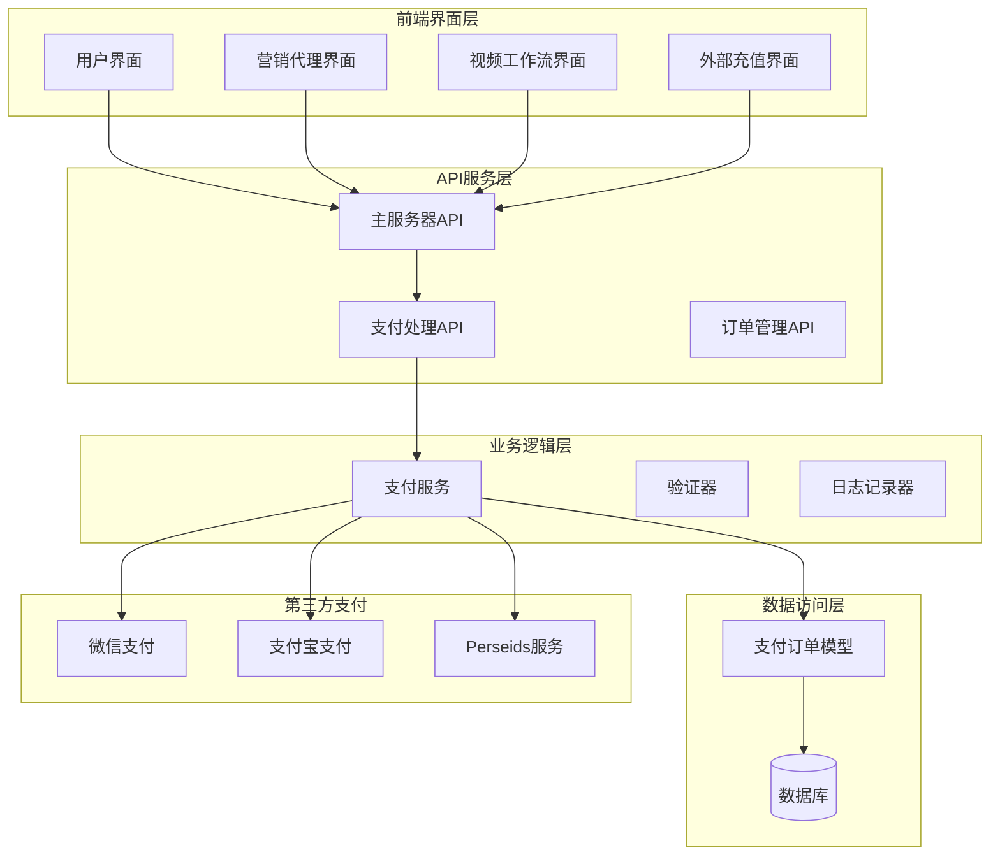

**图表来源**
- [server.py:4246-4603](file://server.py#L4246-L4603)
- [payment_orders.py:52-110](file://model/payment_orders.py#L52-L110)

**章节来源**
- [server.py:4246-4603](file://server.py#L4246-L4603)
- [payment_orders.py:52-110](file://model/payment_orders.py#L52-L110)

## 核心组件

### 支付套餐管理

系统实现了灵活的套餐管理机制，支持动态配置和个性化推荐：

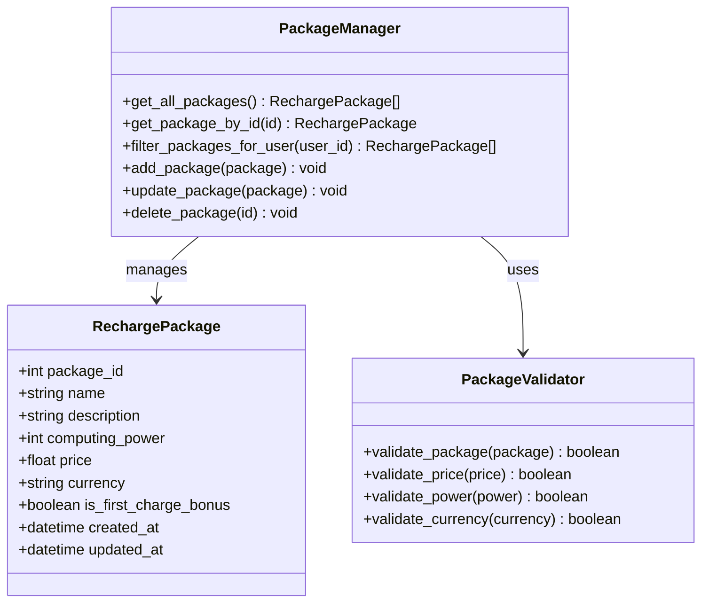

**图表来源**
- [constant.py:480-510](file://config/constant.py#L480-L510)

### 支付订单处理

订单管理系统提供了完整的生命周期管理：

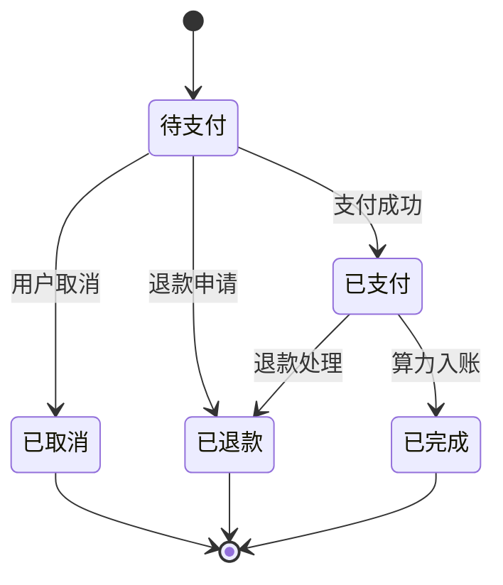

**图表来源**
- [payment_orders.py:52-110](file://model/payment_orders.py#L52-L110)

**章节来源**
- [constant.py:480-510](file://config/constant.py#L480-L510)
- [payment_orders.py:52-110](file://model/payment_orders.py#L52-L110)

## 架构概览

系统采用微服务架构，通过清晰的分层设计实现高内聚低耦合：

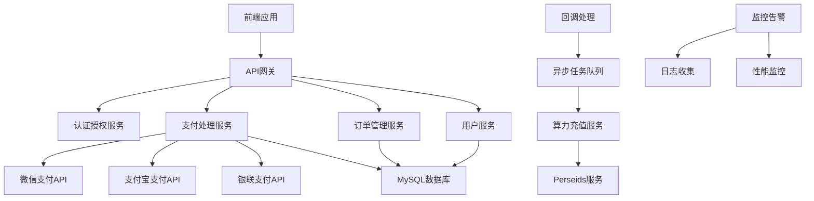

**图表来源**
- [server.py:4246-4603](file://server.py#L4246-L4603)

## 详细组件分析

### 微信支付集成

微信支付是系统的主要支付渠道，支持多种支付方式：

#### 支付流程序列图

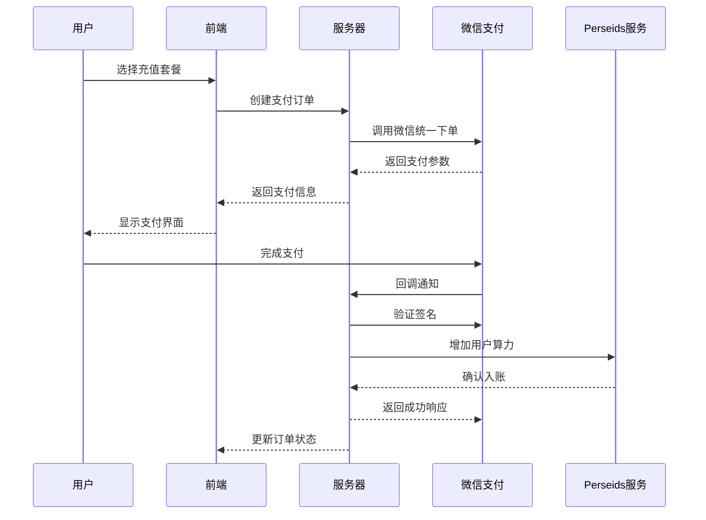

**图表来源**
- [server.py:4423-4603](file://server.py#L4423-L4603)
- [wechat_pay_util.py:292-309](file://utils/wechat_pay_util.py#L292-L309)

#### 支付参数验证

系统实现了严格的参数验证机制：

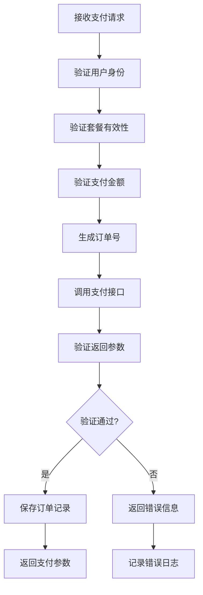

**图表来源**
- [server.py:4423-4452](file://server.py#L4423-L4452)

**章节来源**
- [server.py:4423-4603](file://server.py#L4423-L4603)
- [wechat_pay_util.py:292-309](file://utils/wechat_pay_util.py#L292-L309)

### 支付回调处理

#### 回调处理流程

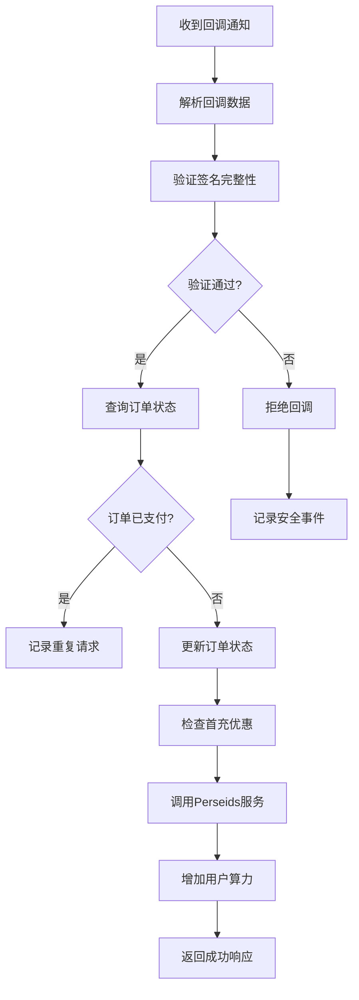

**图表来源**
- [server.py:4546-4603](file://server.py#L4546-L4603)

**章节来源**
- [server.py:4546-4603](file://server.py#L4546-L4603)

### 前端交互界面

#### 用户界面组件

系统提供了多个前端界面供不同场景使用：

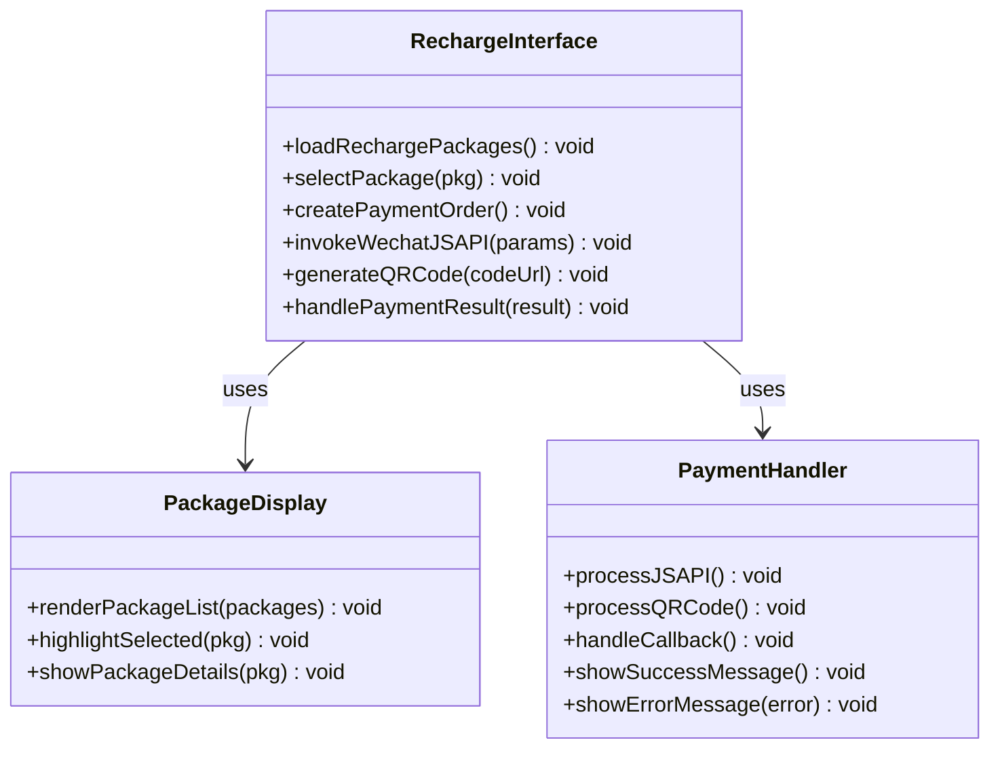

**图表来源**
- [index.html:8655-8732](file://web/index.html#L8655-L8732)
- [marketing_agent.html:1168-1188](file://web/marketing_agent.html#L1168-L1188)
- [video_workflow.html:1138-1151](file://web/video_workflow.html#L1138-L1151)

**章节来源**
- [index.html:8655-8732](file://web/index.html#L8655-L8732)
- [marketing_agent.html:1168-1188](file://web/marketing_agent.html#L1168-L1188)
- [video_workflow.html:1138-1151](file://web/video_workflow.html#L1138-L1151)

### 数据模型设计

#### 支付订单数据模型

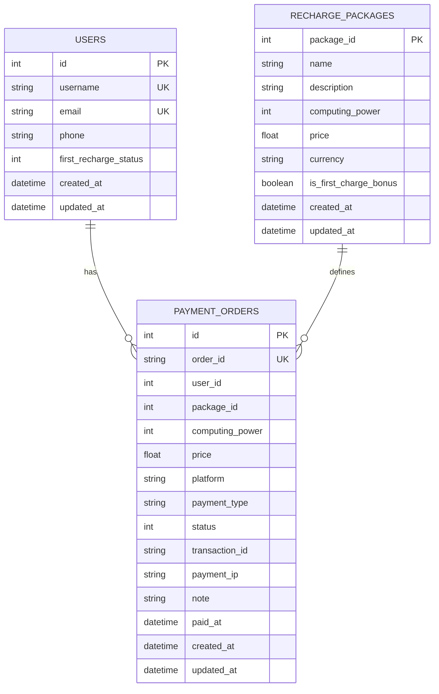

**图表来源**
- [payment_orders.py:287-300](file://model/payment_orders.py#L287-L300)

**章节来源**
- [payment_orders.py:287-300](file://model/payment_orders.py#L287-L300)

## 依赖关系分析

### 外部依赖

系统依赖于多个外部服务和API：

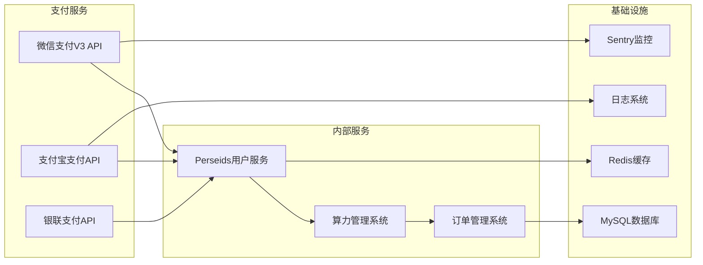

**图表来源**
- [server.py:4553-4597](file://server.py#L4553-L4597)

### 内部模块依赖

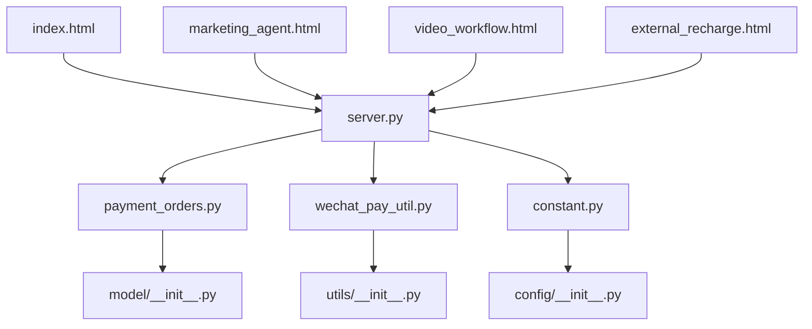

**图表来源**
- [server.py:47-47](file://server.py#L47-L47)
- [payment_orders.py:1-50](file://model/payment_orders.py#L1-L50)

**章节来源**
- [server.py:47-47](file://server.py#L47-L47)
- [payment_orders.py:1-50](file://model/payment_orders.py#L1-L50)

## 性能考虑

### 缓存策略

系统采用了多层次的缓存策略来提升性能：

1. **套餐信息缓存**：充值套餐信息缓存30分钟
2. **用户状态缓存**：用户首充状态缓存1小时
3. **支付参数缓存**：支付临时参数缓存5分钟
4. **订单状态缓存**：最近订单状态缓存10分钟

### 异步处理

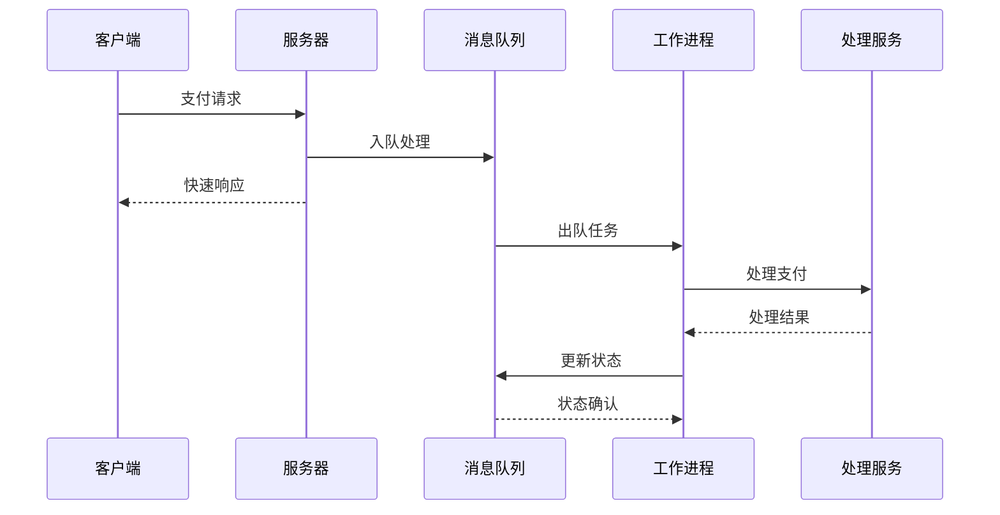

### 错误重试机制

系统实现了智能的错误重试机制：

- **指数退避重试**：最多重试5次，间隔时间呈指数增长
- **超时控制**：每个操作设置合理的超时时间
- **熔断保护**：当错误率超过阈值时自动熔断
- **降级策略**：在服务不可用时提供基础功能

## 故障排除指南

### 常见问题诊断

#### 支付失败排查

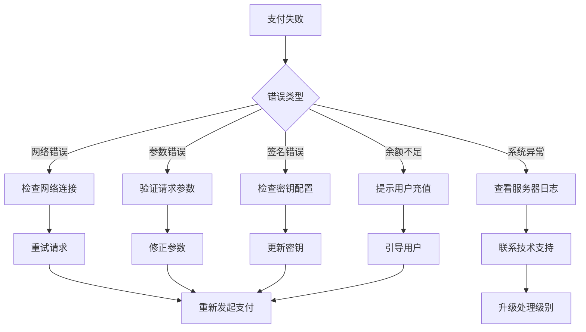

#### 回调处理问题

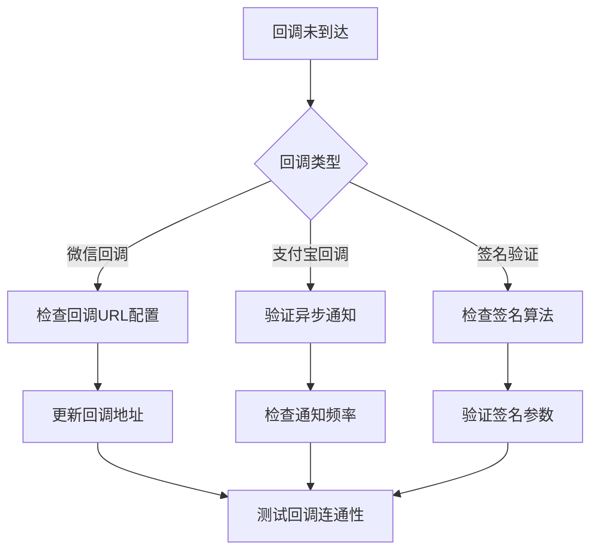

**章节来源**
- [server.py:4446-4452](file://server.py#L4446-L4452)
- [server.py:4546-4603](file://server.py#L4546-L4603)

### 日志分析

系统提供了详细的日志记录机制：

1. **支付日志**：记录所有支付请求和响应
2. **回调日志**：记录所有回调通知和处理结果
3. **错误日志**：记录异常情况和错误详情
4. **性能日志**：记录关键操作的执行时间

### 监控指标

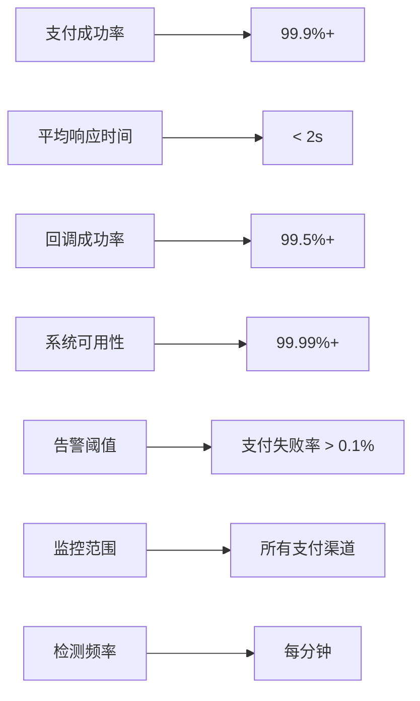

## 结论

算力充值管理系统是一个功能完整、架构清晰的在线支付解决方案。系统通过模块化设计实现了高可扩展性和高可靠性，支持多种支付渠道和灵活的业务场景。

### 主要优势

1. **多渠道支持**：全面支持微信支付、支付宝等多种主流支付方式
2. **安全可靠**：完善的签名验证、加密传输和防欺诈机制
3. **用户体验**：简洁直观的界面设计和流畅的操作体验
4. **技术先进**：采用微服务架构和异步处理技术
5. **易于维护**：清晰的代码结构和完善的文档体系

### 改进建议

1. **增强监控**：增加更细粒度的性能监控指标
2. **优化缓存**：实现更智能的缓存策略和失效机制
3. **扩展支付**：支持更多国际化的支付方式
4. **自动化测试**：完善自动化测试覆盖率
5. **文档完善**：补充更多的API文档和开发指南

## 附录

### API接口规范

#### 充值套餐接口

| 接口 | 方法 | 描述 | 请求参数 | 响应数据 |
|------|------|------|----------|----------|
| `/api/recharge/packages` | GET | 获取充值套餐列表 | `auth_token` | `packages`数组 |
| `/api/recharge/wechat-pay` | POST | 创建微信支付订单 | `package_id`, `payment_type` | 支付参数 |
| `/api/recharge/wechat-callback` | POST | 微信支付回调 | `回调数据` | 处理结果 |

#### 请求参数验证

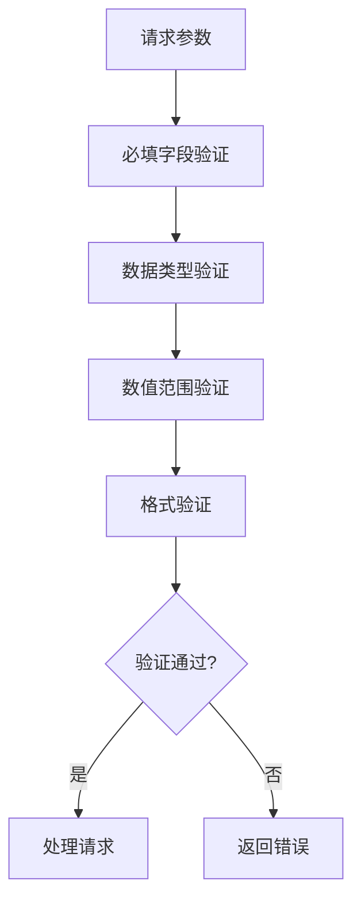

### 安全措施

1. **数据加密**：敏感数据采用AES-256加密存储
2. **传输安全**：所有API通信使用HTTPS协议
3. **签名验证**：支付请求和回调都进行数字签名验证
4. **防重放攻击**：订单号和时间戳防止重复提交
5. **权限控制**：基于角色的访问控制机制
6. **审计日志**：完整的操作审计和追踪

### 部署建议

1. **环境配置**：生产环境使用独立的数据库和缓存
2. **负载均衡**：部署多个实例支持水平扩展
3. **备份策略**：定期备份数据库和重要配置
4. **监控告警**：建立完善的监控和告警机制
5. **性能优化**：根据业务量调整资源配置