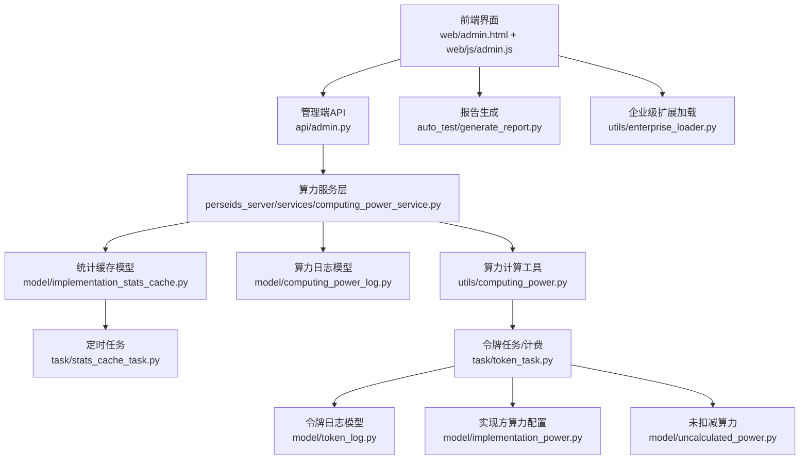
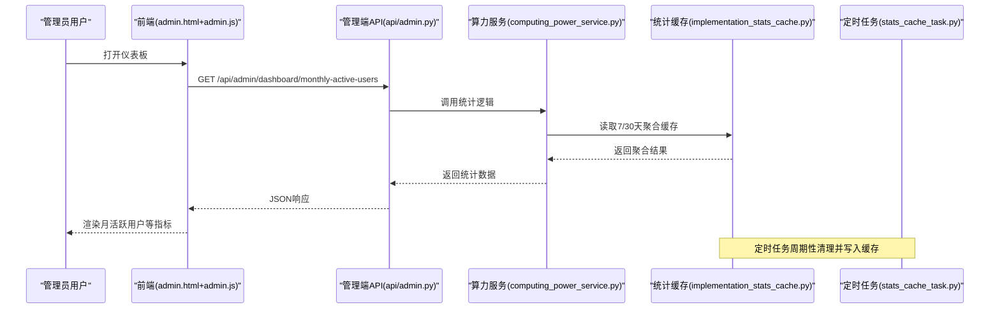
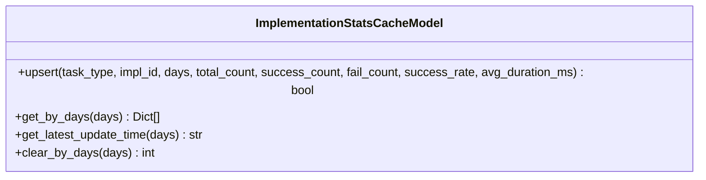
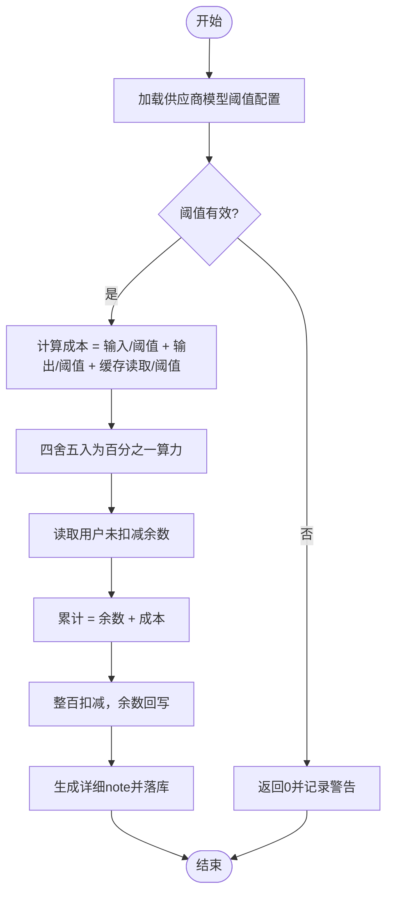
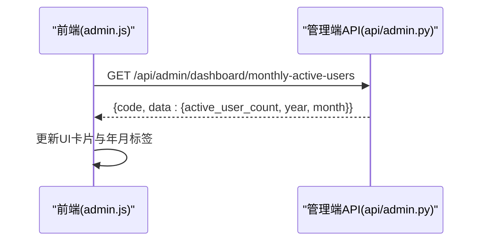
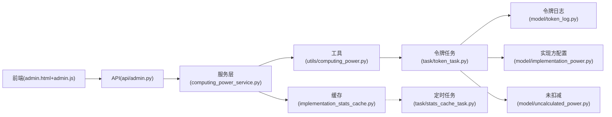

# 算力分析仪表板

<cite>
**本文引用的文件**
- [web/admin.html](file://web/admin.html)
- [web/js/admin.js](file://web/js/admin.js)
- [model/computing_power_log.py](file://model/computing_power_log.py)
- [model/implementation_stats_cache.py](file://model/implementation_stats_cache.py)
- [task/stats_cache_task.py](file://task/stats_cache_task.py)
- [api/admin.py](file://api/admin.py)
- [utils/computing_power.py](file://utils/computing_power.py)
- [model/token_log.py](file://model/token_log.py)
- [task/token_task.py](file://task/token_task.py)
- [model/implementation_power.py](file://model/implementation_power.py)
- [model/uncalculated_power.py](file://model/uncalculated_power.py)
- [perseids_server/services/computing_power_service.py](file://perseids_server/services/computing_power_service.py)
- [docs/算力多维度计算方案.md](file://docs/算力多维度计算方案.md)
- [tests/stats/test_implementation_stats.py](file://tests/stats/test_implementation_stats.py)
- [auto_test/generate_report.py](file://auto_test/generate_report.py)
- [utils/enterprise_loader.py](file://utils/enterprise_loader.py)
</cite>

## 目录
1. [简介](#简介)
2. [项目结构](#项目结构)
3. [核心组件](#核心组件)
4. [架构总览](#架构总览)
5. [详细组件分析](#详细组件分析)
6. [依赖关系分析](#依赖关系分析)
7. [性能考量](#性能考量)
8. [故障排查指南](#故障排查指南)
9. [结论](#结论)
10. [附录](#附录)

## 简介
本文件面向“算力分析仪表板”功能，系统性阐述算力使用统计指标的设计与计算方法（日使用量、月趋势、峰值分析）、数据缓存策略（更新频率、失效机制、性能优化）、可视化图表实现（折线图、柱状图、热力图）、用户行为分析、成本效益评估与预算预警、实时监控面板与告警机制、报告生成，以及企业级多维度统计（部门对比、项目成本核算）等。内容以仓库现有实现为依据，结合前端界面与后端统计缓存、定时任务、API 接口与工具函数，形成完整的技术文档。

## 项目结构
围绕算力分析仪表板的关键模块分布如下：
- 前端界面与交互：web/admin.html、web/js/admin.js
- 后端统计缓存与定时任务：model/implementation_stats_cache.py、task/stats_cache_task.py
- 算力日志与计算：model/computing_power_log.py、utils/computing_power.py、task/token_task.py、model/token_log.py、model/implementation_power.py、model/uncalculated_power.py
- 管理端 API：api/admin.py
- 企业级扩展与报告：utils/enterprise_loader.py、auto_test/generate_report.py
- 设计文档：docs/算力多维度计算方案.md

**图表来源**
- [web/admin.html](file://web/admin.html)
- [web/js/admin.js](file://web/js/admin.js)
- [api/admin.py](file://api/admin.py)
- [perseids_server/services/computing_power_service.py](file://perseids_server/services/computing_power_service.py)
- [model/implementation_stats_cache.py](file://model/implementation_stats_cache.py)
- [task/stats_cache_task.py](file://task/stats_cache_task.py)
- [model/computing_power_log.py](file://model/computing_power_log.py)
- [utils/computing_power.py](file://utils/computing_power.py)
- [task/token_task.py](file://task/token_task.py)
- [model/token_log.py](file://model/token_log.py)
- [model/implementation_power.py](file://model/implementation_power.py)
- [model/uncalculated_power.py](file://model/uncalculated_power.py)
- [auto_test/generate_report.py](file://auto_test/generate_report.py)
- [utils/enterprise_loader.py](file://utils/enterprise_loader.py)

**章节来源**
- [web/admin.html](file://web/admin.html)
- [web/js/admin.js](file://web/js/admin.js)
- [api/admin.py](file://api/admin.py)

## 核心组件
- 统计缓存与定时刷新：通过 implementation_stats_cache 表缓存 7/30 天聚合统计，定时任务周期性清理与写入，显著降低查询压力。
- 算力日志与计算：computing_power_log 记录算力变动；token_task 基于令牌消耗与阈值配置计算算力成本；implementation_power 提供实现方算力映射。
- 前端仪表板：admin.html 展示月活跃用户、模型成功率等关键指标；admin.js 负责请求与渲染。
- 管理端 API：提供月活跃用户等统计接口，供前端调用。
- 报告与企业扩展：报告生成器与企业版加载器支撑企业级报表与功能扩展。

**章节来源**
- [model/implementation_stats_cache.py](file://model/implementation_stats_cache.py)
- [task/stats_cache_task.py](file://task/stats_cache_task.py)
- [model/computing_power_log.py](file://model/computing_power_log.py)
- [task/token_task.py](file://task/token_task.py)
- [model/implementation_power.py](file://model/implementation_power.py)
- [web/admin.html](file://web/admin.html)
- [web/js/admin.js](file://web/js/admin.js)
- [api/admin.py](file://api/admin.py)
- [auto_test/generate_report.py](file://auto_test/generate_report.py)
- [utils/enterprise_loader.py](file://utils/enterprise_loader.py)

## 架构总览
仪表板采用“前端展示 + 后端API + 统计缓存 + 定时任务”的分层架构。前端通过 AJAX 请求管理端接口，后端聚合统计结果来自 implementation_stats_cache 表；算力成本由 token_task 与阈值配置计算，日志落库以便追溯与审计。

**图表来源**
- [web/admin.html](file://web/admin.html)
- [web/js/admin.js](file://web/js/admin.js)
- [api/admin.py](file://api/admin.py)
- [perseids_server/services/computing_power_service.py](file://perseids_server/services/computing_power_service.py)
- [model/implementation_stats_cache.py](file://model/implementation_stats_cache.py)
- [task/stats_cache_task.py](file://task/stats_cache_task.py)

## 详细组件分析

### 统计缓存与定时任务
- 缓存表结构：implementation_stats_cache 包含任务类型、实现方ID、统计天数、总数、成功数、失败数、成功率、平均耗时及更新时间，并对(type, impl_id, days)建立唯一索引。
- 更新策略：定时任务按 7 天与 30 天两个维度清理旧缓存并重新计算写入，确保热点数据快速可用。
- 查询接口：提供按天数查询与最新更新时间查询，便于前端按需加载与刷新。

**图表来源**
- [model/implementation_stats_cache.py](file://model/implementation_stats_cache.py)

**章节来源**
- [model/implementation_stats_cache.py](file://model/implementation_stats_cache.py)
- [task/stats_cache_task.py](file://task/stats_cache_task.py)
- [tests/stats/test_implementation_stats.py](file://tests/stats/test_implementation_stats.py)

### 算力日志与成本计算
- 日志记录：computing_power_log 记录每次算力增加/扣减事件，包含用户ID、时间戳、事务ID等，支撑日使用量与趋势分析。
- 成本计算：token_task 基于输入/输出/缓存读取令牌与阈值配置计算成本，支持分段计费与阈值校验；计算结果以“百分之一算力”累加，避免浮点误差。
- 未扣减聚合：uncalculated_power 存储用户累计未扣减的余数，达到阈值后统一扣减，减少频繁交易。

**图表来源**
- [task/token_task.py](file://task/token_task.py)
- [model/token_log.py](file://model/token_log.py)
- [model/implementation_power.py](file://model/implementation_power.py)
- [model/uncalculated_power.py](file://model/uncalculated_power.py)

**章节来源**
- [model/computing_power_log.py](file://model/computing_power_log.py)
- [task/token_task.py](file://task/token_task.py)
- [model/implementation_power.py](file://model/implementation_power.py)
- [model/uncalculated_power.py](file://model/uncalculated_power.py)

### 前端仪表板与可视化
- 月活跃用户：前端提供按钮触发查询，展示当月活跃用户数与年月信息，支持重新查询。
- 模型成功率分析：按今日/3日/7日时间粒度切换，表格展示模型总体与供应商明细，支持展开/折叠与成功率颜色分级。
- 可视化建议：基于现有数据结构，可将 7/30 天聚合数据映射为折线图（趋势）、供应商成功率柱状图、按部门/项目的热力图（需额外维度数据）。

**图表来源**
- [web/admin.html](file://web/admin.html)
- [web/js/admin.js](file://web/js/admin.js)
- [api/admin.py](file://api/admin.py)

**章节来源**
- [web/admin.html](file://web/admin.html)
- [web/js/admin.js](file://web/js/admin.js)
- [api/admin.py](file://api/admin.py)

### 管理端API与服务层
- API：提供月活跃用户等统计接口，返回标准化JSON，前端统一处理。
- 服务层：computing_power_service 聚合底层模型与缓存，封装业务规则，保证接口稳定性。

**章节来源**
- [api/admin.py](file://api/admin.py)
- [perseids_server/services/computing_power_service.py](file://perseids_server/services/computing_power_service.py)

### 报告生成与企业扩展
- 报告生成：自动化测试报告生成器可输出HTML报告，适合作为运营/财务汇报的模板。
- 企业扩展：enterprise_loader 支持企业版模块按版本范围加载，便于扩展多维度统计与报表能力。

**章节来源**
- [auto_test/generate_report.py](file://auto_test/generate_report.py)
- [utils/enterprise_loader.py](file://utils/enterprise_loader.py)

## 依赖关系分析
- 前端依赖后端API；API依赖服务层；服务层依赖统计缓存与算力计算工具。
- 统计缓存被定时任务驱动，定时刷新；前端通过API读取缓存，降低数据库压力。
- 算力成本计算依赖令牌日志与实现方阈值配置，最终落库以便审计与复核。

**图表来源**
- [web/admin.html](file://web/admin.html)
- [web/js/admin.js](file://web/js/admin.js)
- [api/admin.py](file://api/admin.py)
- [perseids_server/services/computing_power_service.py](file://perseids_server/services/computing_power_service.py)
- [model/implementation_stats_cache.py](file://model/implementation_stats_cache.py)
- [utils/computing_power.py](file://utils/computing_power.py)
- [task/token_task.py](file://task/token_task.py)
- [model/token_log.py](file://model/token_log.py)
- [model/implementation_power.py](file://model/implementation_power.py)
- [model/uncalculated_power.py](file://model/uncalculated_power.py)
- [task/stats_cache_task.py](file://task/stats_cache_task.py)

**章节来源**
- [model/implementation_stats_cache.py](file://model/implementation_stats_cache.py)
- [task/stats_cache_task.py](file://task/stats_cache_task.py)
- [utils/computing_power.py](file://utils/computing_power.py)
- [task/token_task.py](file://task/token_task.py)

## 性能考量
- 缓存命中率：implementation_stats_cache 对高频查询进行聚合缓存，减少数据库扫描；定时任务在低峰期执行，避免影响在线性能。
- 查询优化：按 days 粒度查询，配合唯一索引，提升读取效率；前端按需切换时间范围，避免一次性加载全量数据。
- 成本计算精度：以百分之一算力累加并整百扣减，避免浮点误差累积，同时减少小额度频繁交易。
- 前端渲染：表格与状态切换在前端完成，减少后端压力；建议对大数据集启用虚拟滚动与分页。

[本节为通用性能建议，不直接分析具体文件]

## 故障排查指南
- 统计缓存异常
  - 现象：前端显示“-”或长时间加载。
  - 排查：确认定时任务是否正常运行；检查 implementation_stats_cache 表数据与更新时间；验证唯一索引约束是否生效。
  - 参考：[定时任务](file://task/stats_cache_task.py)、[缓存模型](file://model/implementation_stats_cache.py)、[单元测试](file://tests/stats/test_implementation_stats.py)
- 成本计算异常
  - 现象：算力扣减与预期不符。
  - 排查：检查供应商模型阈值配置是否正确；确认 token_task 的输入/输出/缓存读取参数；核对未扣减余数与累计逻辑。
  - 参考：[令牌任务](file://task/token_task.py)、[令牌日志](file://model/token_log.py)、[实现方配置](file://model/implementation_power.py)、[未扣减算力](file://model/uncalculated_power.py)
- 前端接口失败
  - 现象：月活跃用户按钮点击无效或报错。
  - 排查：检查 /api/admin/dashboard/monthly-active-users 接口返回码与数据结构；确认鉴权头与网络连通性。
  - 参考：[前端JS](file://web/js/admin.js)、[管理端API](file://api/admin.py)

**章节来源**
- [task/stats_cache_task.py](file://task/stats_cache_task.py)
- [model/implementation_stats_cache.py](file://model/implementation_stats_cache.py)
- [tests/stats/test_implementation_stats.py](file://tests/stats/test_implementation_stats.py)
- [task/token_task.py](file://task/token_task.py)
- [model/token_log.py](file://model/token_log.py)
- [model/implementation_power.py](file://model/implementation_power.py)
- [model/uncalculated_power.py](file://model/uncalculated_power.py)
- [web/js/admin.js](file://web/js/admin.js)
- [api/admin.py](file://api/admin.py)

## 结论
算力分析仪表板通过“统计缓存 + 定时任务 + 成本计算 + 前端可视化”的组合，实现了高效、可扩展的算力使用分析能力。现有实现已覆盖日使用量、月活跃用户与模型成功率等关键指标；建议在后续迭代中补充部门/项目维度、预算预警与实时告警，并完善热力图等高级可视化，以满足企业级精细化运营需求。

[本节为总结性内容，不直接分析具体文件]

## 附录

### 指标设计与计算方法
- 日使用量：基于 computing_power_log 的每日汇总，支持按用户/实现方/模型聚合。
- 月趋势：以日为粒度的时间序列，结合 implementation_stats_cache 的7/30天聚合，绘制折线图。
- 峰值分析：识别单日最高使用量与异常波动，结合阈值配置进行预警。
- 用户行为分析：基于日志的首次/最后使用时间、活跃天数跨度等，计算月活跃用户。
- 成本效益评估：以百分之一算力为单位，结合阈值配置与累计余数，评估成本与收益。
- 预算预警：基于历史趋势与阈值，设置告警规则（如环比增长超阈值、单日超阈值）。

**章节来源**
- [model/computing_power_log.py](file://model/computing_power_log.py)
- [model/implementation_stats_cache.py](file://model/implementation_stats_cache.py)
- [task/stats_cache_task.py](file://task/stats_cache_task.py)
- [task/token_task.py](file://task/token_task.py)

### 可视化图表实现要点
- 折线图：X轴为日期，Y轴为使用量/成本，支持多曲线叠加（不同实现方/模型）。
- 柱状图：展示7/30天聚合的总量、成功率、平均耗时等。
- 热力图：按日/小时/实现方/模型的二维密度展示，需引入额外维度数据。

[本节为概念性说明，不直接分析具体文件]

### 实时监控面板与告警机制
- 实时面板：前端轮询管理端API，定时刷新关键指标；对高价值指标设置自动刷新。
- 告警机制：基于阈值与趋势规则，触发邮件/站内通知；与通知系统协同（参考通知系统文档）。

[本节为概念性说明，不直接分析具体文件]

### 报告生成功能
- 自动化测试报告：输出HTML报告，适合作为运营/财务汇报模板。
- 企业级报告：结合企业版扩展，生成多维度统计与对比报表。

**章节来源**
- [auto_test/generate_report.py](file://auto_test/generate_report.py)
- [utils/enterprise_loader.py](file://utils/enterprise_loader.py)

### 企业级分析与多维度统计
- 多维度统计：建议扩展部门/项目维度，结合现有聚合模型进行分组统计。
- 部门对比：按部门聚合使用量与成本，生成对比报表。
- 项目成本核算：基于令牌日志与实现方配置，追踪项目级算力消耗与费用。

**章节来源**
- [docs/算力多维度计算方案.md](file://docs/算力多维度计算方案.md)