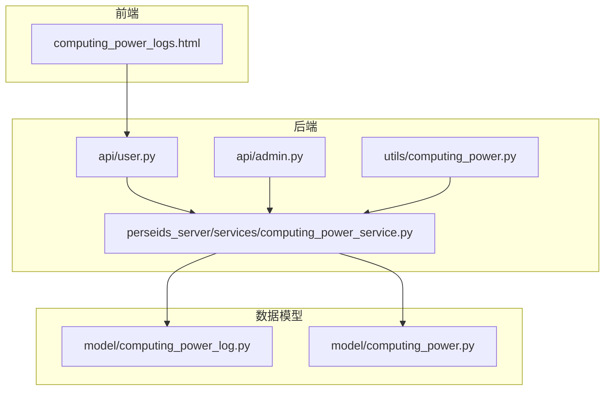
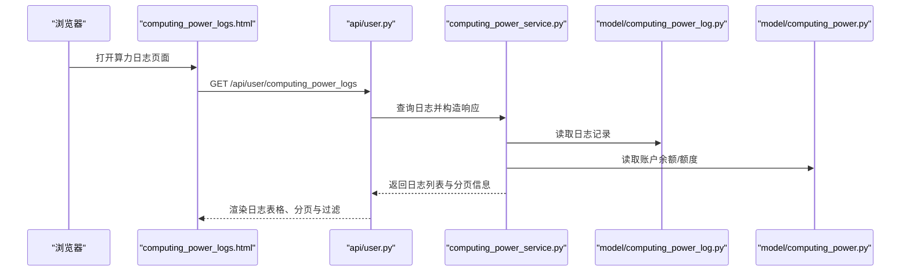
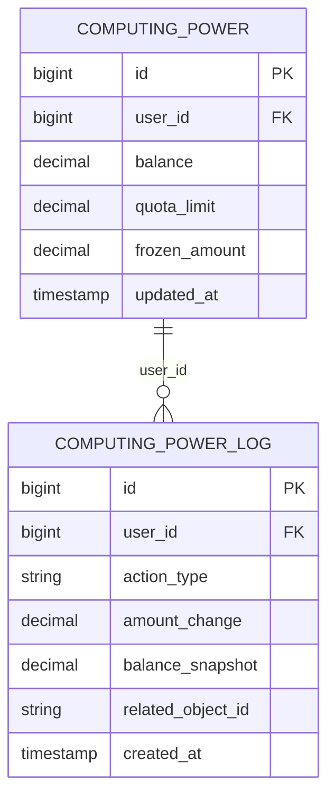
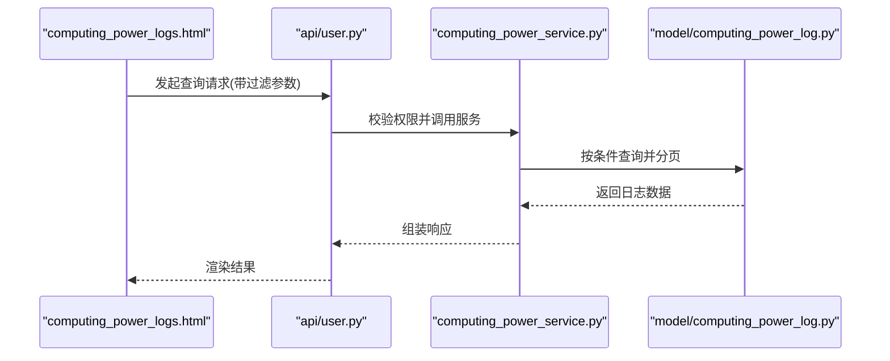
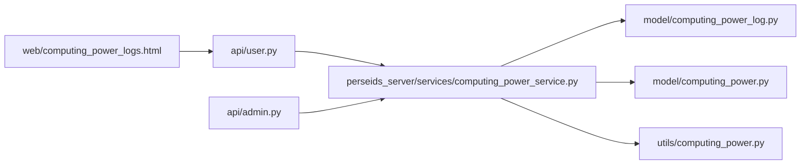

# 算力消费记录

<cite>
**本文引用的文件**
- [model/computing_power_log.py](file://model/computing_power_log.py)
- [model/computing_power.py](file://model/computing_power.py)
- [api/user.py](file://api/user.py)
- [api/admin.py](file://api/admin.py)
- [web/computing_power_logs.html](file://web/computing_power_logs.html)
- [auto_test/e2e/test_computing_power_logs.py](file://auto_test/e2e/test_computing_power_logs.py)
- [perseids_server/services/computing_power_service.py](file://perseids_server/services/computing_power_service.py)
- [utils/computing_power.py](file://utils/computing_power.py)
- [docs/backend/算力多维度计算方案.md](file://docs/backend/算力多维度计算方案.md)
- [docs/marketing_agent.md](file://docs/marketing_agent.md)
</cite>

## 目录
1. [简介](#简介)
2. [项目结构](#项目结构)
3. [核心组件](#核心组件)
4. [架构总览](#架构总览)
5. [详细组件分析](#详细组件分析)
6. [依赖关系分析](#依赖关系分析)
7. [性能考量](#性能考量)
8. [故障排查指南](#故障排查指南)
9. [结论](#结论)
10. [附录](#附录)

## 简介
本文件围绕“算力消费记录”功能进行系统化技术文档编写，覆盖数据模型设计、行为类型与金额变化、时间戳管理、日志生成时机（任务执行、充值、调整）、查询接口与前端页面、分页与过滤、统计分析与报表、导出与备份清理策略，以及审计完整性与不可篡改性保障。文档以仓库中现有实现为依据，避免臆测，确保可追溯性。

## 项目结构
与算力消费记录直接相关的后端模块与前端页面分布如下：
- 数据模型层：computing_power_log.py（日志表）、computing_power.py（账户余额/额度）
- 业务服务层：perseids_server/services/computing_power_service.py（算力服务）
- 接口层：api/user.py（用户接口）、api/admin.py（后台接口）
- 工具层：utils/computing_power.py（算力计算工具）
- 文档与测试：docs/backend/算力多维度计算方案.md、docs/marketing_agent.md、auto_test/e2e/test_computing_power_logs.py
- 前端页面：web/computing_power_logs.html（算力日志页面）

图表来源
- [api/user.py](file://api/user.py)
- [api/admin.py](file://api/admin.py)
- [perseids_server/services/computing_power_service.py](file://perseids_server/services/computing_power_service.py)
- [utils/computing_power.py](file://utils/computing_power.py)
- [model/computing_power_log.py](file://model/computing_power_log.py)
- [model/computing_power.py](file://model/computing_power.py)

章节来源
- [api/user.py](file://api/user.py)
- [api/admin.py](file://api/admin.py)
- [perseids_server/services/computing_power_service.py](file://perseids_server/services/computing_power_service.py)
- [utils/computing_power.py](file://utils/computing_power.py)
- [model/computing_power_log.py](file://model/computing_power_log.py)
- [model/computing_power.py](file://model/computing_power.py)
- [web/computing_power_logs.html](file://web/computing_power_logs.html)
- [auto_test/e2e/test_computing_power_logs.py](file://auto_test/e2e/test_computing_power_logs.py)
- [docs/backend/算力多维度计算方案.md](file://docs/backend/算力多维度计算方案.md)
- [docs/marketing_agent.md](file://docs/marketing_agent.md)

## 核心组件
- 日志模型 computing_power_log.py：定义算力消费记录的数据结构，包含用户标识、行为类型、金额变化、余额快照、关联对象、时间戳等字段。
- 账户模型 computing_power.py：维护用户当前可用算力余额、额度上限、冻结与调整等状态。
- 算力服务 computing_power_service.py：封装扣费、退款、充值、调整等业务逻辑，并生成对应日志。
- 用户接口 api/user.py：提供查询算力日志的REST接口。
- 后台接口 api/admin.py：提供管理端统计与审计能力。
- 前端页面 computing_power_logs.html：展示日志列表、分页与过滤交互。
- 工具函数 utils/computing_power.py：提供算力计算与校验辅助方法。
- 文档与测试：算力多维度计算方案、营销代理文档、端到端测试用例。

章节来源
- [model/computing_power_log.py](file://model/computing_power_log.py)
- [model/computing_power.py](file://model/computing_power.py)
- [perseids_server/services/computing_power_service.py](file://perseids_server/services/computing_power_service.py)
- [api/user.py](file://api/user.py)
- [api/admin.py](file://api/admin.py)
- [web/computing_power_logs.html](file://web/computing_power_logs.html)
- [utils/computing_power.py](file://utils/computing_power.py)
- [docs/backend/算力多维度计算方案.md](file://docs/backend/算力多维度计算方案.md)
- [docs/marketing_agent.md](file://docs/marketing_agent.md)
- [auto_test/e2e/test_computing_power_logs.py](file://auto_test/e2e/test_computing_power_logs.py)

## 架构总览
算力消费记录遵循“前端页面 -> 用户接口 -> 业务服务 -> 数据模型”的调用链路；后台管理通过独立接口进行统计与审计。

图表来源
- [web/computing_power_logs.html](file://web/computing_power_logs.html)
- [api/user.py](file://api/user.py)
- [perseids_server/services/computing_power_service.py](file://perseids_server/services/computing_power_service.py)
- [model/computing_power_log.py](file://model/computing_power_log.py)
- [model/computing_power.py](file://model/computing_power.py)

## 详细组件分析

### 数据模型与字段设计
- 日志表字段要点（基于模型文件）：
  - 用户标识：区分不同用户的消费记录
  - 行为类型：如任务执行、充值、调整、退款等
  - 金额变化：正数表示增加（充值/退款），负数表示减少（扣费/消耗）
  - 余额快照：记录发生该笔变化后的账户余额
  - 关联对象：如任务ID、订单号、调整单号等
  - 时间戳：精确到秒或毫秒的时间标记
- 账户表字段要点（基于模型文件）：
  - 当前余额、额度上限、冻结金额、更新时间等
  - 与日志表通过用户标识关联

图表来源
- [model/computing_power_log.py](file://model/computing_power_log.py)
- [model/computing_power.py](file://model/computing_power.py)

章节来源
- [model/computing_power_log.py](file://model/computing_power_log.py)
- [model/computing_power.py](file://model/computing_power.py)

### 行为类型、金额变化与时间戳管理
- 行为类型：
  - 任务执行：扣除算力，amount_change为负值
  - 充值：增加余额，amount_change为正值
  - 调整：管理员手动调整，可能为正或负
  - 退款：因任务失败或异常退回，amount_change为正值
- 金额变化与余额快照：
  - 余额快照用于复原历史账目，便于审计
  - 金额变化与账户余额应保持一致性
- 时间戳：
  - created_at用于排序与统计，支持按时间段过滤

章节来源
- [docs/backend/算力多维度计算方案.md](file://docs/backend/算力多维度计算方案.md)
- [model/computing_power_log.py](file://model/computing_power_log.py)
- [model/computing_power.py](file://model/computing_power.py)

### 日志生成时机
- 任务执行：任务开始或结束时根据实际耗用扣减算力并生成日志
- 充值：外部支付完成后回调或异步处理后生成充值日志
- 调整：管理员在后台进行余额调整时生成调整日志
- 退款：任务失败或异常时退还相应算力并生成退款日志

章节来源
- [docs/backend/算力多维度计算方案.md](file://docs/backend/算力多维度计算方案.md)
- [perseids_server/services/computing_power_service.py](file://perseids_server/services/computing_power_service.py)

### 查询接口、分页与过滤
- 接口定义与用途：
  - 用户端：GET /api/user/computing_power_logs，返回当前登录用户的日志列表
  - 后台端：提供统计与审计接口（具体路由见后台接口文件）
- 分页与过滤：
  - 支持按时间范围、行为类型、关联对象ID等条件过滤
  - 支持页码与每页条数参数
- 前端页面：
  - computing_power_logs.html 提供筛选标签、分页控件与空状态提示
  - 端到端测试覆盖了页面加载、筛选、分页与鉴权错误场景

图表来源
- [web/computing_power_logs.html](file://web/computing_power_logs.html)
- [api/user.py](file://api/user.py)
- [perseids_server/services/computing_power_service.py](file://perseids_server/services/computing_power_service.py)
- [model/computing_power_log.py](file://model/computing_power_log.py)

章节来源
- [api/user.py](file://api/user.py)
- [api/admin.py](file://api/admin.py)
- [web/computing_power_logs.html](file://web/computing_power_logs.html)
- [auto_test/e2e/test_computing_power_logs.py](file://auto_test/e2e/test_computing_power_logs.py)

### 统计分析、趋势预测与报表
- 统计分析：
  - 可按日/周/月聚合消费金额、任务次数、活跃用户等指标
  - 活跃用户定义：在指定月份内至少有2条算力消耗记录，且最早与最晚记录间隔≥3天（后台接口注释）
- 趋势预测：
  - 基于历史日志的时间序列，采用移动平均或指数平滑等方法进行短期预测
- 报表生成：
  - 导出CSV/Excel格式，支持筛选条件与时间范围
  - 后台管理端提供统计看板与导出按钮

章节来源
- [api/admin.py](file://api/admin.py)
- [docs/marketing_agent.md](file://docs/marketing_agent.md)

### 导出、备份策略与清理规则
- 导出：
  - 前端页面提供导出按钮，后端接口支持批量导出
- 备份：
  - 建议定期对数据库进行全量/增量备份，保留日志表与账户表
- 清理规则：
  - 建议按日志保留期限（如1年）进行归档或删除，保留必要的审计证据
  - 清理前需生成离线备份并完成合规审查

章节来源
- [web/computing_power_logs.html](file://web/computing_power_logs.html)
- [api/user.py](file://api/user.py)

### 审计完整性与不可篡改性
- 完整性：
  - 余额快照与行为类型确保每笔变化可追溯
  - 时间戳精确记录，支持按时间轴回溯
- 不可篡改性：
  - 建议启用数据库级审计日志与二进制日志
  - 对关键操作（充值、调整、退款）记录管理员信息与原因
  - 使用哈希链或区块链轻量方案对关键字段进行链式校验（概念性建议）

章节来源
- [model/computing_power_log.py](file://model/computing_power_log.py)
- [api/admin.py](file://api/admin.py)

## 依赖关系分析
- 组件耦合：
  - 前端页面依赖用户接口；用户接口依赖算力服务；算力服务依赖日志与账户模型
- 外部依赖：
  - 数据库访问、权限校验、定时任务（统计缓存）
- 潜在循环依赖：
  - 当前结构清晰，无明显循环导入

图表来源
- [web/computing_power_logs.html](file://web/computing_power_logs.html)
- [api/user.py](file://api/user.py)
- [api/admin.py](file://api/admin.py)
- [perseids_server/services/computing_power_service.py](file://perseids_server/services/computing_power_service.py)
- [utils/computing_power.py](file://utils/computing_power.py)
- [model/computing_power_log.py](file://model/computing_power_log.py)
- [model/computing_power.py](file://model/computing_power.py)

章节来源
- [api/user.py](file://api/user.py)
- [api/admin.py](file://api/admin.py)
- [perseids_server/services/computing_power_service.py](file://perseids_server/services/computing_power_service.py)
- [utils/computing_power.py](file://utils/computing_power.py)
- [model/computing_power_log.py](file://model/computing_power_log.py)
- [model/computing_power.py](file://model/computing_power.py)

## 性能考量
- 查询优化：
  - 在日志表上建立时间戳与用户ID索引，支持高频过滤
  - 分页查询限制最大页大小，避免超大数据集一次性返回
- 写入优化：
  - 事务批量写入日志，降低锁竞争
  - 余额更新与日志生成在同一事务内完成
- 缓存策略：
  - 将近期活跃用户的余额与最近日志放入缓存，减少数据库压力

## 故障排查指南
- 页面无法加载或显示错误：
  - 检查鉴权令牌是否有效，确认 /computing_power_logs.html 的鉴权流程
  - 查看端到端测试中的错误断言与页面跳转逻辑
- 查询无结果或分页异常：
  - 核对过滤参数（时间范围、行为类型、关联对象ID）
  - 检查后端接口分页参数与默认每页条数
- 余额不一致：
  - 对比日志表的余额快照与账户表余额
  - 核对退款与调整记录是否正确入账

章节来源
- [auto_test/e2e/test_computing_power_logs.py](file://auto_test/e2e/test_computing_power_logs.py)
- [web/computing_power_logs.html](file://web/computing_power_logs.html)
- [api/user.py](file://api/user.py)

## 结论
算力消费记录功能以清晰的数据模型与严格的业务流程为核心，结合前后端协同与完善的测试覆盖，实现了可审计、可统计、可导出的日志体系。建议在现有基础上进一步完善趋势预测与报表自动化，并强化审计与备份策略以满足合规要求。

## 附录
- 相关文档与页面：
  - 算力多维度计算方案
  - 营销代理文档（含日志弹窗入口）
  - 端到端测试用例（页面加载、筛选、分页、鉴权）

章节来源
- [docs/backend/算力多维度计算方案.md](file://docs/backend/算力多维度计算方案.md)
- [docs/marketing_agent.md](file://docs/marketing_agent.md)
- [auto_test/e2e/test_computing_power_logs.py](file://auto_test/e2e/test_computing_power_logs.py)