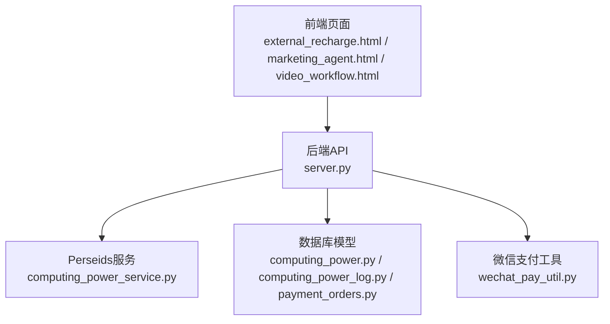
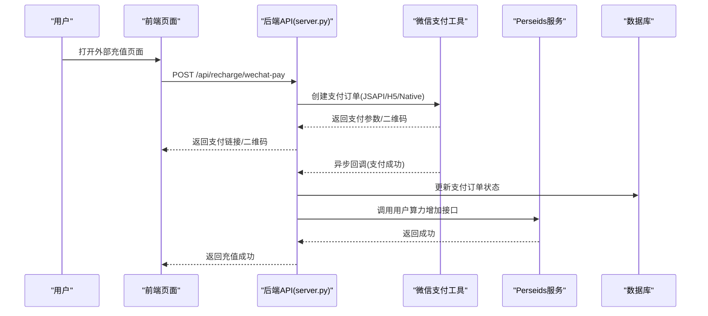
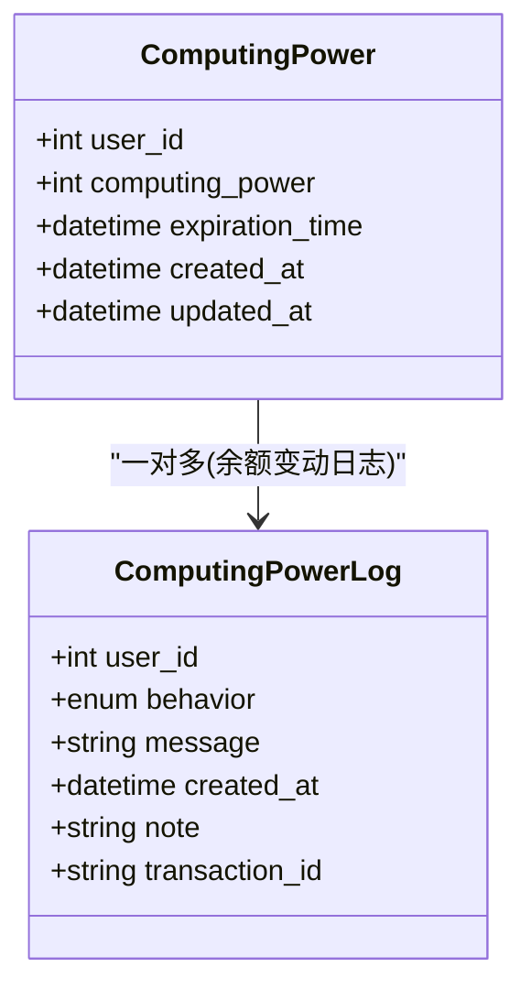
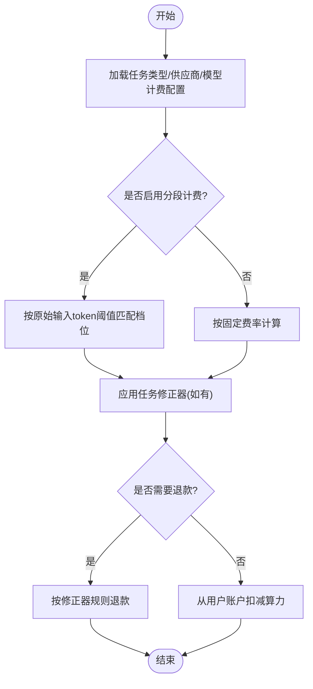
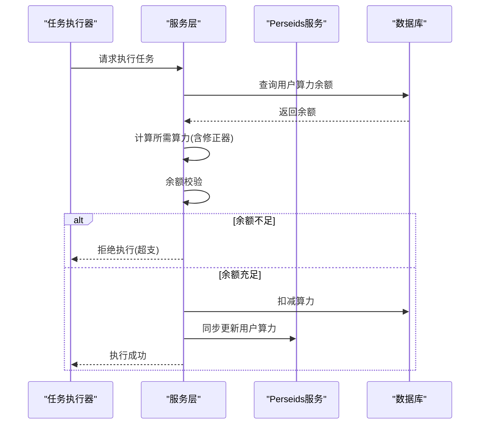
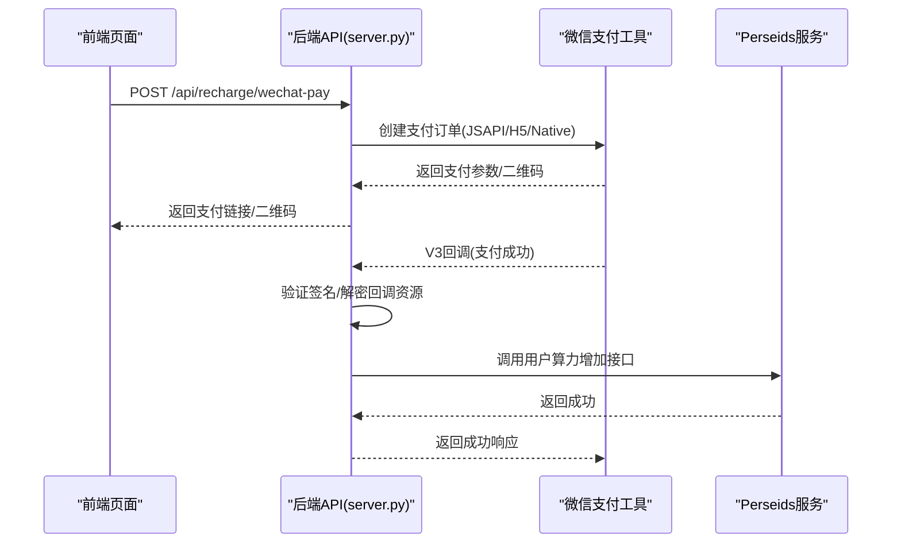
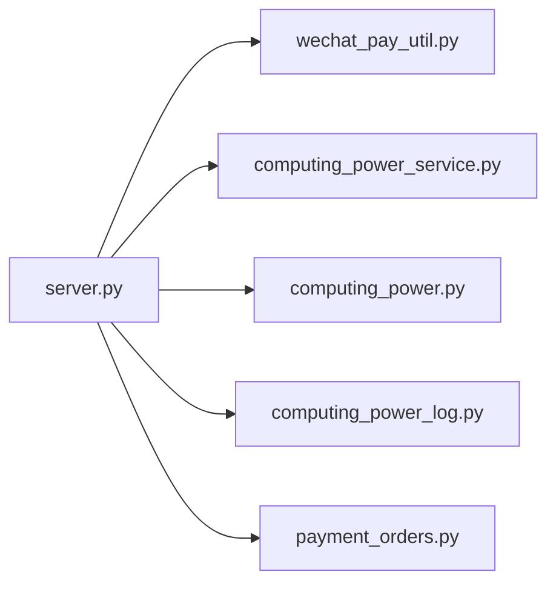

# 算力管理系统

<cite>
**本文引用的文件**
- [server.py](file://server.py)
- [computing_power.py](file://model/computing_power.py)
- [computing_power_log.py](file://model/computing_power_log.py)
- [payment_orders.py](file://model/payment_orders.py)
- [wechat_pay_util.py](file://utils/wechat_pay_util.py)
- [20260409_vendor_model_tiered_billing.py](file://alembic/versions/20260409_vendor_model_tiered_billing.py)
- [visual_task.py](file://task/visual_task.py)
- [external_recharge.html](file://web/external_recharge.html)
- [marketing_agent.html](file://web/marketing_agent.html)
- [video_workflow.html](file://web/video_workflow.html)
- [computing_power_service.py](file://perseids_server/services/computing_power_service.py)
- [test_seedream_computing_power_refund.py](file://tests/driver_integration/test_seedream_computing_power_refund.py)
- [test_computing_power.py](file://tests/utils/test_computing_power.py)
</cite>

## 目录
1. [简介](#简介)
2. [项目结构](#项目结构)
3. [核心组件](#核心组件)
4. [架构总览](#架构总览)
5. [详细组件分析](#详细组件分析)
6. [依赖关系分析](#依赖关系分析)
7. [性能考量](#性能考量)
8. [故障排查指南](#故障排查指南)
9. [结论](#结论)
10. [附录](#附录)

## 简介
本文件面向ZhiJuTong算力管理系统，围绕“用户级独立算力账户”的设计理念与实现机制展开，覆盖账户创建、余额管理、消费记录、计费模型（按任务类型、供应商、模型的差异化定价）、算力分配与限额控制、超支处理、充值渠道（含微信支付）、账单管理、使用分析与成本控制、退款机制、异常处理与审计日志，以及企业级多用户/多部门/多项目场景的落地方案。文档以代码为依据，辅以可视化图示帮助不同背景读者理解系统。

## 项目结构
系统采用前后端分离与微服务协作模式：
- 后端主服务通过FastAPI提供REST接口，负责鉴权、业务编排、与Perseids服务交互、微信支付对接与回调处理。
- 数据层通过SQLAlchemy模型管理用户算力账户、算力日志、支付订单等。
- 计费与算力分配逻辑分布在任务执行层与配置中心，支持按任务类型、供应商、模型的差异化定价与分段计费。
- 前端页面提供外部充值入口与微信支付流程展示。

图表来源
- [server.py](file://server.py)
- [computing_power.py](file://model/computing_power.py)
- [computing_power_log.py](file://model/computing_power_log.py)
- [payment_orders.py](file://model/payment_orders.py)
- [wechat_pay_util.py](file://utils/wechat_pay_util.py)
- [computing_power_service.py](file://perseids_server/services/computing_power_service.py)
- [external_recharge.html](file://web/external_recharge.html)
- [marketing_agent.html](file://web/marketing_agent.html)
- [video_workflow.html](file://web/video_workflow.html)

章节来源
- [server.py](file://server.py)
- [computing_power.py](file://model/computing_power.py)
- [computing_power_log.py](file://model/computing_power_log.py)
- [payment_orders.py](file://model/payment_orders.py)
- [wechat_pay_util.py](file://utils/wechat_pay_util.py)
- [computing_power_service.py](file://perseids_server/services/computing_power_service.py)
- [external_recharge.html](file://web/external_recharge.html)
- [marketing_agent.html](file://web/marketing_agent.html)
- [video_workflow.html](file://web/video_workflow.html)

## 核心组件
- 用户级独立算力账户
  - 账户实体与唯一性约束确保每个用户仅有一个独立账户，余额与过期时间可配置。
  - 提供余额变更与日志记录能力，支持增加与扣减两类行为，并保留交易标识便于对账。
- 算力计费模型
  - 支持按任务类型、供应商、模型的差异化定价；引入分段计费（Vendor-Model层级），以原始输入token阈值划分阶梯，提升计费精细化程度。
- 算力分配与限额控制
  - 任务执行前校验用户算力余额；支持基于任务类型与配置的默认算力消耗；若余额不足则拒绝执行并触发告警或退款路径。
- 充值与账单
  - 提供微信支付渠道（JSAPI/H5与Native二维码），订单状态与支付结果通过回调同步至系统，完成算力入账与订单更新。
- 使用分析与成本控制
  - 提供算力日志分页查询、按行为筛选、活跃用户统计等能力，支撑成本归集与预算管理。
- 退款与异常处理
  - 任务失败或取消时支持按修正器规则进行退款；异常路径统一记录日志并返回标准错误响应。
- 企业级多用户/多部门/多项目
  - 通过Perseids服务的用户鉴权与权限体系，结合算力日志与账单，实现跨组织的成本核算与审计。

章节来源
- [computing_power.py](file://model/computing_power.py)
- [computing_power_log.py](file://model/computing_power_log.py)
- [20260409_vendor_model_tiered_billing.py](file://alembic/versions/20260409_vendor_model_tiered_billing.py)
- [server.py](file://server.py)
- [wechat_pay_util.py](file://utils/wechat_pay_util.py)

## 架构总览
系统整体由前端页面发起充值请求，后端API创建支付订单并调用微信支付，支付成功后回调通知后端，后端更新订单状态并调用Perseids服务为用户账户增加算力。同时，系统提供算力日志查询与分析能力，支撑成本控制与预算管理。

图表来源
- [server.py](file://server.py)
- [wechat_pay_util.py](file://utils/wechat_pay_util.py)
- [external_recharge.html](file://web/external_recharge.html)

## 详细组件分析

### 用户级独立算力账户
- 设计理念
  - 每个用户拥有独立且唯一的算力账户，账户余额作为资源配额的直接体现，支持过期时间控制与审计日志追踪。
- 实现要点
  - 账户表唯一约束用户ID，保证一对一关系；余额字段支持正负调整，配合日志表记录每次变动。
  - 日志表包含行为类型（增加/扣减）、消息、用户ID、创建时间、备注与交易ID，便于对账与审计。
- 关键接口
  - 算力日志分页查询与筛选，支持按行为类型过滤，用于成本归集与报表生成。

图表来源
- [computing_power.py](file://model/computing_power.py)
- [computing_power_log.py](file://model/computing_power_log.py)

章节来源
- [computing_power.py](file://model/computing_power.py)
- [computing_power_log.py](file://model/computing_power_log.py)

### 算力计费模型与分段计费
- 差异化定价
  - 支持按任务类型、供应商、模型三维度设置计费规则；模型层面引入分段计费，以原始输入token阈值划分阶梯，提升计费精度。
- 迁移与演进
  - 通过迁移脚本为vendor_model表新增分段边界字段并调整注释，移除供应商+模型唯一约束，适配多档计费配置。
- 任务侧计费
  - 任务执行时优先根据任务类型与配置获取算力消耗，若未命中则回退到默认配置；失败或取消时按修正器规则进行退款。

图表来源
- [20260409_vendor_model_tiered_billing.py](file://alembic/versions/20260409_vendor_model_tiered_billing.py)
- [visual_task.py](file://task/visual_task.py)

章节来源
- [20260409_vendor_model_tiered_billing.py](file://alembic/versions/20260409_vendor_model_tiered_billing.py)
- [visual_task.py](file://task/visual_task.py)

### 算力分配、限额控制与超支处理
- 分配与校验
  - 任务执行前检查用户算力余额是否满足需求；若不足则拒绝执行并记录日志，避免超支。
- 超支处理
  - 对于部分驱动（如Seedream）提供退款测试用例，验证失败或取消时的退款路径与修正器生效情况。
- 退款机制
  - 退款时优先使用修正器规则，若失败则回退到默认配置；退款成功后更新Perseids服务中的用户算力余额。

图表来源
- [visual_task.py](file://task/visual_task.py)
- [test_seedream_computing_power_refund.py](file://tests/driver_integration/test_seedream_computing_power_refund.py)

章节来源
- [visual_task.py](file://task/visual_task.py)
- [test_seedream_computing_power_refund.py](file://tests/driver_integration/test_seedream_computing_power_refund.py)

### 充值渠道与微信支付集成
- 前端入口
  - 外部充值页面提供H5直链与二维码两种支付方式；营销Agent与视频工作流页面也集成微信支付入口。
- 后端流程
  - 创建支付订单：根据支付类型返回JSAPI参数或Native二维码；回调接口接收微信支付成功通知，解密回调资源并校验签名。
  - 入账与对账：回调成功后更新订单状态并调用Perseids服务为用户账户增加算力，记录交易ID便于对账。
- 安全与容错
  - 回调签名验证与资源解密，异常路径统一记录日志并返回标准错误响应。

图表来源
- [server.py](file://server.py)
- [wechat_pay_util.py](file://utils/wechat_pay_util.py)
- [external_recharge.html](file://web/external_recharge.html)
- [marketing_agent.html](file://web/marketing_agent.html)
- [video_workflow.html](file://web/video_workflow.html)

章节来源
- [server.py](file://server.py)
- [wechat_pay_util.py](file://utils/wechat_pay_util.py)
- [external_recharge.html](file://web/external_recharge.html)
- [marketing_agent.html](file://web/marketing_agent.html)
- [video_workflow.html](file://web/video_workflow.html)

### 账单管理与使用分析
- 算力日志查询
  - 支持分页查询、按行为类型筛选，便于生成成本报表与预算对比。
- 活跃用户统计
  - 基于日志表统计某周期内连续活跃用户数，辅助运营分析与产品优化。
- 成本控制与预算管理
  - 结合日志与分段计费配置，按任务类型/供应商/模型维度拆分成本，支持预算预警与超支提醒。

章节来源
- [computing_power_log.py](file://model/computing_power_log.py)
- [server.py](file://server.py)

### 退款机制、异常处理与审计日志
- 退款机制
  - 任务失败或取消时，优先按修正器规则进行退款；若未命中则回退到默认配置；退款成功后更新用户算力余额。
- 异常处理
  - 支付回调解析失败、签名验证失败、Perseids服务调用失败等均记录详细日志并返回标准HTTP错误。
- 审计日志
  - 算力日志表记录每次余额变动的用户ID、行为、消息、时间与交易ID，满足合规审计要求。

章节来源
- [visual_task.py](file://task/visual_task.py)
- [server.py](file://server.py)
- [computing_power_log.py](file://model/computing_power_log.py)

### 企业级多用户/多部门/多项目场景
- 用户与权限
  - 通过Perseids服务的用户鉴权与权限体系，结合算力日志与账单，实现跨组织的成本核算与审计。
- 成本归集
  - 按任务类型、供应商、模型维度拆分成本，结合项目/部门维度进行聚合统计，支撑预算管理与成本分摊。
- 审计与合规
  - 完整的日志链路与交易ID，确保每一笔算力变动均可追溯。

章节来源
- [server.py](file://server.py)
- [computing_power_log.py](file://model/computing_power_log.py)

## 依赖关系分析
- 组件耦合
  - 后端API与微信支付工具强耦合，与Perseids服务弱耦合（通过统一请求封装）。
  - 数据模型之间通过外键与唯一约束保持一致性，日志表与账户表形成闭环审计。
- 外部依赖
  - 微信支付V3回调与解密依赖微信官方规范；Perseids服务提供用户鉴权与算力操作接口。
- 潜在风险
  - 回调签名验证失败或解密异常会导致入账延迟；需完善重试与人工干预流程。

图表来源
- [server.py](file://server.py)
- [wechat_pay_util.py](file://utils/wechat_pay_util.py)
- [computing_power_service.py](file://perseids_server/services/computing_power_service.py)
- [computing_power.py](file://model/computing_power.py)
- [computing_power_log.py](file://model/computing_power_log.py)
- [payment_orders.py](file://model/payment_orders.py)

章节来源
- [server.py](file://server.py)
- [wechat_pay_util.py](file://utils/wechat_pay_util.py)
- [computing_power_service.py](file://perseids_server/services/computing_power_service.py)
- [computing_power.py](file://model/computing_power.py)
- [computing_power_log.py](file://model/computing_power_log.py)
- [payment_orders.py](file://model/payment_orders.py)

## 性能考量
- 查询优化
  - 算力日志分页查询应配合索引与LIMIT/OFFSET，避免大表全扫描；对常用筛选条件建立索引。
- 并发与锁
  - 扣减算力与退款操作需考虑并发一致性，建议使用数据库事务与行级锁保障原子性。
- 回调处理
  - 微信回调为异步高并发场景，建议引入队列与幂等处理，避免重复入账与重复退款。
- 缓存与统计
  - 活跃用户统计等聚合查询可引入缓存与定时任务，降低实时查询压力。

## 故障排查指南
- 微信支付回调失败
  - 检查签名验证与资源解密流程；确认回调地址与证书配置正确；查看日志定位具体异常。
- 订单状态不一致
  - 核对回调签名与订单状态更新逻辑；必要时手动对账并补发入账请求。
- 退款未到账
  - 核对任务修正器配置与Perseids服务调用结果；检查交易ID与日志记录是否完整。
- 日志缺失或不完整
  - 检查日志级别与异常捕获；确保关键路径均有日志输出与错误上报。

章节来源
- [server.py](file://server.py)
- [wechat_pay_util.py](file://utils/wechat_pay_util.py)
- [visual_task.py](file://task/visual_task.py)

## 结论
本系统以用户级独立算力账户为核心，结合分段计费、任务侧修正器与Perseids服务，实现了灵活可控的算力分配与计费体系；通过微信支付V3回调与标准化日志，构建了完整的充值、入账与审计闭环。配合分页查询与活跃用户统计等分析能力，能够支撑企业级多用户/多部门/多项目的成本控制与预算管理需求。后续可在并发一致性、回调队列化与缓存策略方面进一步优化。

## 附录
- 关键接口与页面
  - 外部充值：/api/recharge/wechat-pay、/api/recharge/wechat-callback
  - 算力日志：/api/user/computing_power_logs
  - 前端页面：external_recharge.html、marketing_agent.html、video_workflow.html
- 测试参考
  - 退款测试：tests/driver_integration/test_seedream_computing_power_refund.py
  - 算力工具测试：tests/utils/test_computing_power.py