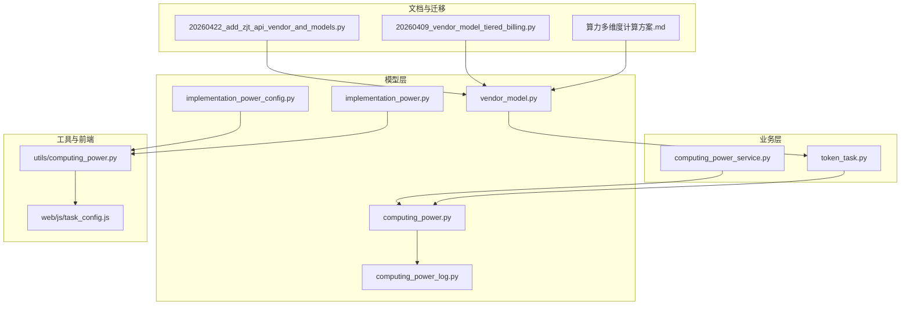
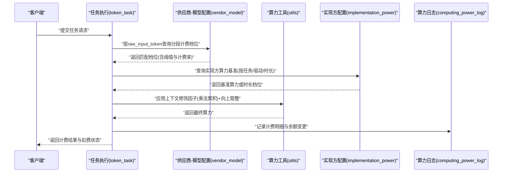
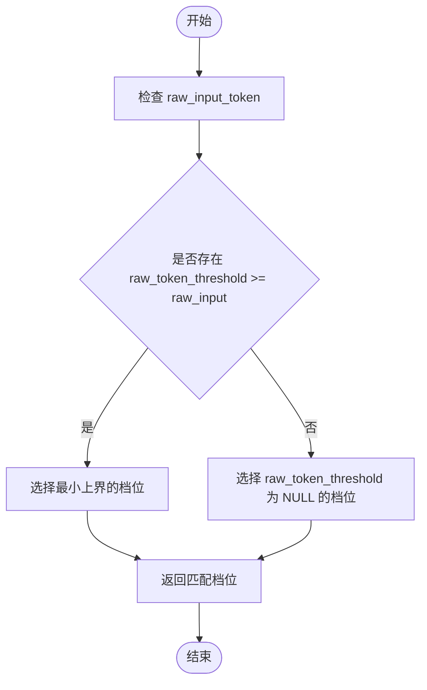
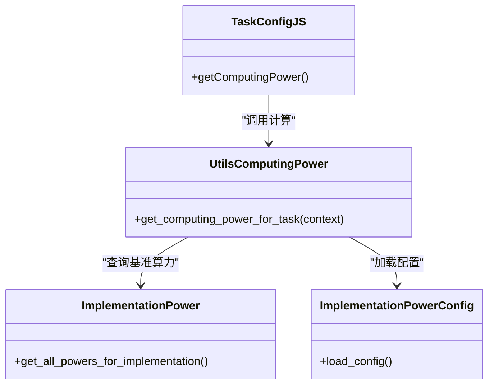
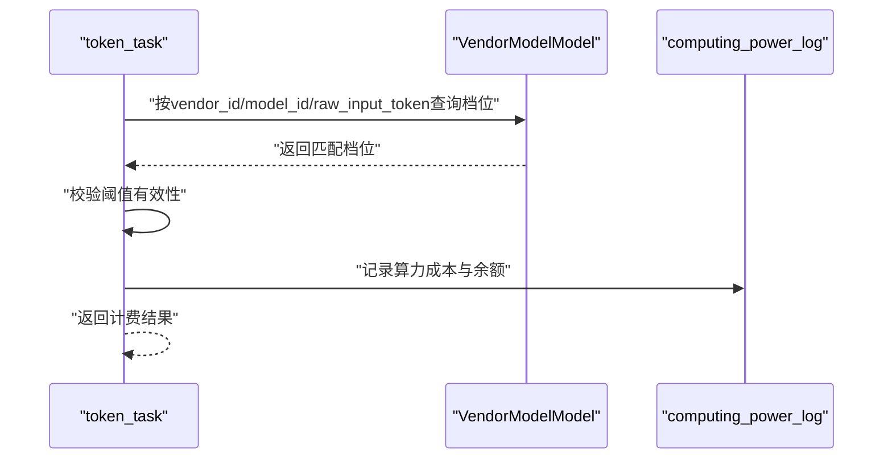
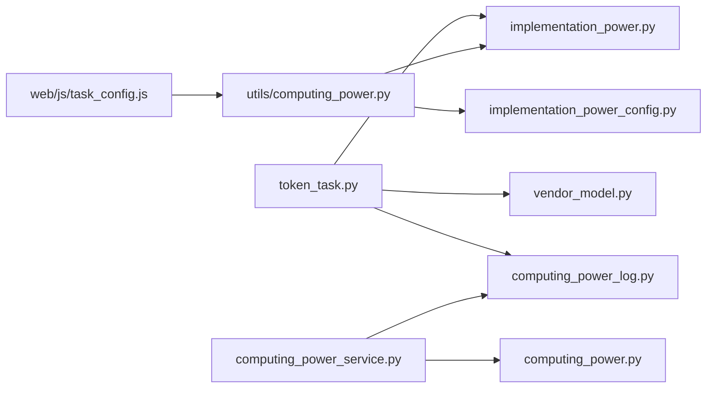

# 算力计费模型

<cite>
**本文引用的文件**
- [算力多维度计算方案.md](file://docs/backend/算力多维度计算方案.md)
- [AI Tool Service Terms.txt](file://files/AI Tool Service Terms.txt)
- [20260409_vendor_model_tiered_billing.py](file://alembic/versions/20260409_vendor_model_tiered_billing.py)
- [20260422_add_zjt_api_vendor_and_models.py](file://alembic/versions/20260422_add_zjt_api_vendor_and_models.py)
- [vendor_model.py](file://model/vendor_model.py)
- [implementation_power.py](file://model/implementation_power.py)
- [implementation_power_config.py](file://model/implementation_power_config.py)
- [computing_power.py](file://model/computing_power.py)
- [computing_power_log.py](file://model/computing_power_log.py)
- [computing_power_service.py](file://perseids_server/services/computing_power_service.py)
- [token_task.py](file://task/token_task.py)
- [test_computing_power.py](file://tests/utils/test_computing_power.py)
- [test_vendor_model_crud.py](file://tests/crud/test_vendor_model_crud.py)
- [test_seedream_computing_power_refund.py](file://tests/driver_integration/test_seedream_computing_power_refund.py)
- [task_config.js](file://web/js/task_config.js)
</cite>

## 目录
1. [引言](#引言)
2. [项目结构](#项目结构)
3. [核心组件](#核心组件)
4. [架构总览](#架构总览)
5. [详细组件分析](#详细组件分析)
6. [依赖关系分析](#依赖关系分析)
7. [性能考量](#性能考量)
8. [故障排查指南](#故障排查指南)
9. [结论](#结论)
10. [附录](#附录)

## 引言
本文件面向企业级与通用场景，系统化阐述“算力计费模型”的设计与实现，涵盖以下关键主题：
- 差异化定价策略：按任务类型、供应商、模型的分层与分段计费
- 动态定价机制：基于任务上下文、分辨率、质量等修饰因子的实时调整
- 算力消耗计算逻辑：任务复杂度评估、模型参数影响、执行时间估算
- 价格查询接口、实时计费与批量计费能力
- 价格缓存机制、价格更新策略与历史价格追踪
- 计费精度控制、汇率转换与税费计算
- 多层级定价、折扣策略与合同价格管理

本模型以“供应商-模型-分段阈值”为核心定价单元，并通过实现方配置与任务上下文修饰因子实现灵活的动态定价。

## 项目结构
围绕算力计费的关键代码分布在以下模块：
- 模型层：供应商与模型关联、实现方算力配置、算力日志与统计
- 业务层：计费服务、令牌任务计费流程
- 工具层：算力计算工具函数与前端适配
- 文档与迁移：计费方案文档、数据库分段计费迁移脚本
- 测试：算力计算逻辑与供应商-模型配置的单元与集成测试

图表来源
- [算力多维度计算方案.md:279-320](file://docs/backend/算力多维度计算方案.md#L279-L320)
- [20260409_vendor_model_tiered_billing.py:1-41](file://alembic/versions/20260409_vendor_model_tiered_billing.py#L1-L41)
- [20260422_add_zjt_api_vendor_and_models.py:1-37](file://alembic/versions/20260422_add_zjt_api_vendor_and_models.py#L1-L37)
- [vendor_model.py:126-154](file://model/vendor_model.py#L126-L154)
- [implementation_power.py](file://model/implementation_power.py)
- [implementation_power_config.py](file://model/implementation_power_config.py)
- [computing_power.py](file://model/computing_power.py)
- [computing_power_log.py](file://model/computing_power_log.py)
- [computing_power_service.py](file://perseids_server/services/computing_power_service.py)
- [token_task.py:44-71](file://task/token_task.py#L44-L71)
- [task_config.js:284-311](file://web/js/task_config.js#L284-L311)

章节来源
- [算力多维度计算方案.md:279-320](file://docs/backend/算力多维度计算方案.md#L279-L320)
- [20260409_vendor_model_tiered_billing.py:1-41](file://alembic/versions/20260409_vendor_model_tiered_billing.py#L1-L41)
- [20260422_add_zjt_api_vendor_and_models.py:1-37](file://alembic/versions/20260422_add_zjt_api_vendor_and_models.py#L1-L37)

## 核心组件
- 供应商-模型分段计费配置：通过 vendor_model 表存储不同 raw_input_token 阈值下的计费档位，支持“无上限档位”与“优先最小上界”选择规则。
- 实现方算力配置：implementation_power 与 implementation_power_config 提供按任务类型/驱动/时长的算力基准配置，支持数据库覆盖与默认回退。
- 算力计算工具：utils/computing_power 提供统一的算力计算入口，结合任务上下文修饰因子进行乘法累积与最终向上取整。
- 令牌任务计费：token_task 负责在生成/处理任务时，依据供应商-模型配置与实际 token 使用量计算算力成本。
- 计费服务与日志：computing_power_service 提供对外计费查询与扣费接口；computing_power_log 记录每次计费明细与余额变化。
- 前端适配：task_config.js 将算力展示与修饰因子应用到前端界面，保证前后一致的计费体验。

章节来源
- [vendor_model.py:126-154](file://model/vendor_model.py#L126-L154)
- [implementation_power.py](file://model/implementation_power.py)
- [implementation_power_config.py](file://model/implementation_power_config.py)
- [computing_power.py](file://model/computing_power.py)
- [computing_power_log.py](file://model/computing_power_log.py)
- [computing_power_service.py](file://perseids_server/services/computing_power_service.py)
- [token_task.py:44-71](file://task/token_task.py#L44-L71)
- [算力多维度计算方案.md:279-320](file://docs/backend/算力多维度计算方案.md#L279-L320)

## 架构总览
下图展示了从任务执行到计费落库的端到端流程，以及与供应商-模型分段计费、实现方算力配置的关系。

图表来源
- [token_task.py:44-71](file://task/token_task.py#L44-L71)
- [vendor_model.py:126-154](file://model/vendor_model.py#L126-L154)
- [implementation_power.py](file://model/implementation_power.py)
- [computing_power.py](file://model/computing_power.py)
- [computing_power_log.py](file://model/computing_power_log.py)

## 详细组件分析

### 供应商-模型分段计费配置
- 设计要点
  - 以 raw_input_token 作为分段边界，支持“无上限档位”（raw_token_threshold 为 NULL）与“优先最小上界”选择规则。
  - 输入/输出/缓存读取分别设定阈值，用于区分不同资源消耗维度的计费档位。
- 关键行为
  - 查询时优先选择满足条件的最小上界；若无匹配则回落至无上限档位。
  - 该规则确保计费随输入规模单调递增且可预测。
- 迁移与扩展
  - 通过数据库迁移脚本添加 raw_token_threshold 并调整注释，明确计费率含义，移除供应商-模型唯一约束以支持多档位配置。

图表来源
- [vendor_model.py:126-154](file://model/vendor_model.py#L126-L154)
- [20260409_vendor_model_tiered_billing.py:1-41](file://alembic/versions/20260409_vendor_model_tiered_billing.py#L1-L41)

章节来源
- [vendor_model.py:126-154](file://model/vendor_model.py#L126-L154)
- [20260409_vendor_model_tiered_billing.py:1-41](file://alembic/versions/20260409_vendor_model_tiered_billing.py#L1-L41)
- [20260422_add_zjt_api_vendor_and_models.py:1-37](file://alembic/versions/20260422_add_zjt_api_vendor_and_models.py#L1-L37)

### 实现方算力配置与动态定价
- 设计要点
  - implementation_power 与 implementation_power_config 提供按任务类型/驱动/时长的算力基准。
  - 支持数据库覆盖默认值，异常时回退到代码默认值，保证稳定性。
- 动态定价机制
  - 任务上下文修饰因子（如分辨率、质量）通过乘法累积，最后一次性向上取整，避免多次取整导致的精度偏差。
- 前端适配
  - 前端根据任务配置与上下文动态计算算力展示，确保用户侧体验一致。

图表来源
- [implementation_power.py](file://model/implementation_power.py)
- [implementation_power_config.py](file://model/implementation_power_config.py)
- [算力多维度计算方案.md:279-320](file://docs/backend/算力多维度计算方案.md#L279-L320)

章节来源
- [implementation_power.py](file://model/implementation_power.py)
- [implementation_power_config.py](file://model/implementation_power_config.py)
- [算力多维度计算方案.md:279-320](file://docs/backend/算力多维度计算方案.md#L279-L320)
- [test_computing_power.py:141-201](file://tests/utils/test_computing_power.py#L141-L201)

### 令牌任务计费流程
- 流程要点
  - 在任务执行阶段，根据 vendor_id 与 model_id 以及 raw_input_token 查询供应商-模型档位。
  - 校验阈值有效性，计算 token_log 对应的算力成本（浮点），并记录到算力日志。
- 错误处理
  - 未找到档位或阈值无效时返回 0 并记录告警，避免中断任务执行。

图表来源
- [token_task.py:44-71](file://task/token_task.py#L44-L71)
- [vendor_model.py:126-154](file://model/vendor_model.py#L126-L154)
- [computing_power_log.py](file://model/computing_power_log.py)

章节来源
- [token_task.py:44-71](file://task/token_task.py#L44-L71)

### 计费服务与日志
- 计费服务
  - 提供对外查询与扣费接口，封装对算力模型与日志的访问，保证事务一致性与幂等性。
- 日志与追踪
  - 记录每次计费的明细、余额变化、时间戳与来源，便于审计与对账。
- 退款与补偿
  - 集成测试覆盖了特定驱动场景下的退款逻辑，保障异常与回滚时的资产安全。

章节来源
- [computing_power_service.py](file://perseids_server/services/computing_power_service.py)
- [computing_power_log.py](file://model/computing_power_log.py)
- [test_seedream_computing_power_refund.py](file://tests/driver_integration/test_seedream_computing_power_refund.py)

### 前端计费展示与修饰因子
- 前端适配
  - 通过 task_config.js 的 getComputingPower 实现：先累积所有修饰因子乘数，最后一次性向上取整，避免多次取整造成的精度损失。
- 与后端一致性
  - 前端展示与后端计算保持同一套修饰因子与取整策略，确保用户感知一致。

章节来源
- [算力多维度计算方案.md:279-320](file://docs/backend/算力多维度计算方案.md#L279-L320)
- [task_config.js:284-311](file://web/js/task_config.js#L284-L311)

## 依赖关系分析
- 组件耦合
  - 令牌任务强依赖供应商-模型档位与实现方算力配置，弱依赖日志模块。
  - 计费服务对模型层与日志层有稳定接口契约，便于横向扩展。
- 外部依赖
  - 数据库迁移脚本定义了分段计费的表结构演进，确保历史数据兼容与新功能平滑上线。
- 可能的循环依赖
  - 当前结构清晰，模型层与业务层职责分离，未见循环依赖迹象。

图表来源
- [token_task.py:44-71](file://task/token_task.py#L44-L71)
- [vendor_model.py:126-154](file://model/vendor_model.py#L126-L154)
- [implementation_power.py](file://model/implementation_power.py)
- [implementation_power_config.py](file://model/implementation_power_config.py)
- [computing_power.py](file://model/computing_power.py)
- [computing_power_log.py](file://model/computing_power_log.py)
- [computing_power_service.py](file://perseids_server/services/computing_power_service.py)
- [算力多维度计算方案.md:279-320](file://docs/backend/算力多维度计算方案.md#L279-L320)

## 性能考量
- 查询优化
  - 供应商-模型档位查询使用“最小上界优先+NULL兜底”的排序策略，建议在 raw_token_threshold 上建立索引以降低查询成本。
- 计算开销
  - 修饰因子乘法累积与一次性取整策略避免了多次计算，前端与后端保持一致，减少重复逻辑。
- 批量计费
  - 建议在任务队列中聚合多个令牌任务，批量写入日志以降低数据库压力。
- 缓存策略
  - 实现方算力基准与供应商-模型档位可在应用层引入短期缓存，结合失效策略与版本号控制，提升高并发场景下的响应速度。

## 故障排查指南
- 常见问题
  - 未找到供应商-模型档位：检查 vendor_id、model_id 与 raw_input_token 是否正确，确认是否已配置分段阈值。
  - 阈值无效：确认 input/out/cache_read 的阈值大于 0，否则会直接返回 0 并记录告警。
  - 数据库异常：实现方算力查询异常时应回退到代码默认值，避免任务中断。
- 审计与对账
  - 通过 computing_power_log 查看计费明细与余额变化，定位异常交易。
- 回滚与修复
  - 若出现计费错误，结合迁移脚本与测试用例快速验证与修复，必要时进行数据修正与补扣。

章节来源
- [token_task.py:44-71](file://task/token_task.py#L44-L71)
- [test_computing_power.py:180-201](file://tests/utils/test_computing_power.py#L180-L201)
- [test_vendor_model_crud.py:1-145](file://tests/crud/test_vendor_model_crud.py#L1-L145)

## 结论
本算力计费模型以“供应商-模型-分段阈值”为核心定价单元，结合实现方算力基准与任务上下文修饰因子，实现了按任务类型、供应商与模型的差异化与动态定价。通过数据库迁移脚本与严格的查询/计算策略，系统在保证灵活性的同时兼顾了稳定性与可审计性。建议在生产环境中配合缓存、批量写入与索引优化，进一步提升性能与可靠性。

## 附录
- 服务条款要点
  - 价格标准独立确定，可能随时调整并在产品支付页面展示；继续购买即视为同意变更内容。
  - 算力为虚拟资源配额，通常具有固定有效期，请在购买时仔细阅读相关规则。

章节来源
- [AI Tool Service Terms.txt:26-31](file://files/AI Tool Service Terms.txt#L26-L31)