# 算力账户管理

<cite>
**本文档引用的文件**
- [computing_power.py](file://model/computing_power.py)
- [computing_power_log.py](file://model/computing_power_log.py)
- [computing_power_service.py](file://perseids_server/services/computing_power_service.py)
- [auth_service.py](file://perseids_server/services/auth_service.py)
- [users.py](file://model/users.py)
- [client.py](file://perseids_server/client.py)
- [admin.py](file://api/admin.py)
- [workflow.js](file://web/js/workflow.js)
- [marketing_agent.html](file://web/marketing_agent.html)
- [test_auth_service.py](file://tests/auth/test_auth_service.py)
</cite>

## 目录
1. [简介](#简介)
2. [项目结构](#项目结构)
3. [核心组件](#核心组件)
4. [架构概览](#架构概览)
5. [详细组件分析](#详细组件分析)
6. [依赖分析](#依赖分析)
7. [性能考虑](#性能考虑)
8. [故障排除指南](#故障排除指南)
9. [结论](#结论)

## 简介

算力账户管理系统是本项目中的关键基础设施，为每个用户提供了独立的算力账户管理能力。该系统实现了完整的用户级算力账户生命周期管理，包括账户创建、余额管理、状态控制和数据一致性保证。

系统采用用户级独立算力账户设计理念，每个用户拥有唯一的算力账户，账户余额以整数形式存储，支持算力的增加和扣除操作。系统通过严格的约束和验证机制确保算力数据的准确性和安全性。

## 项目结构

算力账户管理功能分布在以下主要模块中：

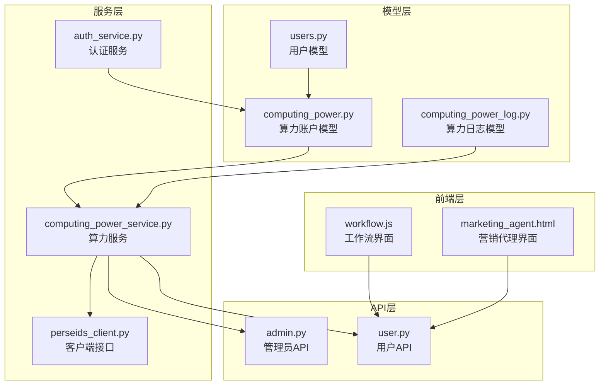

**图表来源**
- [computing_power.py:1-197](file://model/computing_power.py#L1-L197)
- [computing_power_log.py:1-246](file://model/computing_power_log.py#L1-L246)
- [computing_power_service.py:1-243](file://perseids_server/services/computing_power_service.py#L1-L243)

**章节来源**
- [computing_power.py:1-197](file://model/computing_power.py#L1-L197)
- [computing_power_log.py:1-246](file://model/computing_power_log.py#L1-L246)
- [computing_power_service.py:1-243](file://perseids_server/services/computing_power_service.py#L1-L243)

## 核心组件

### 数据模型设计

系统的核心数据结构基于两个主要表：

#### 算力账户表 (computing_power)
- **user_id**: 用户标识符（唯一约束）
- **computing_power**: 算力余额（整数，默认0）
- **expiration_time**: 过期时间（可为空）
- **created_at/updated_at**: 时间戳

#### 算力日志表 (computing_power_log)
- **user_id**: 用户标识符
- **behavior**: 操作类型（increase/deduct）
- **computing_power**: 变化量
- **from_value/to_value**: 变化前后的值
- **message/note**: 描述信息
- **transaction_id**: 交易标识（幂等性）

**章节来源**
- [computing_power.py:185-197](file://model/computing_power.py#L185-L197)
- [computing_power_log.py:227-246](file://model/computing_power_log.py#L227-L246)

### 服务层架构

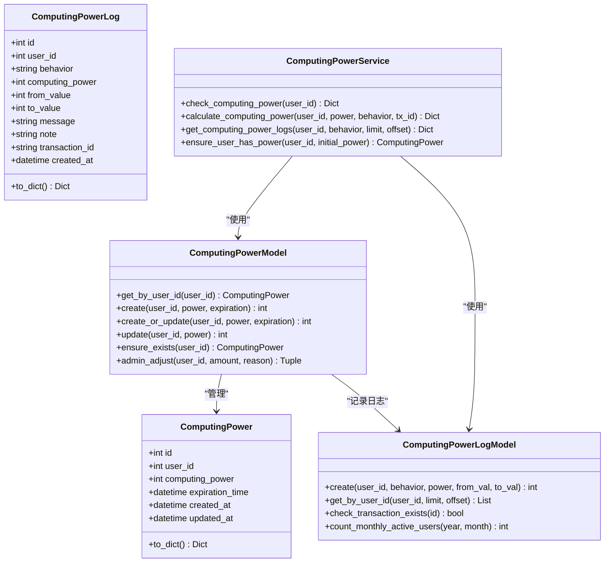

**图表来源**
- [computing_power.py:14-183](file://model/computing_power.py#L14-L183)
- [computing_power_log.py:12-131](file://model/computing_power_log.py#L12-L131)
- [computing_power_service.py:13-243](file://perseids_server/services/computing_power_service.py#L13-L243)

**章节来源**
- [computing_power.py:37-183](file://model/computing_power.py#L37-L183)
- [computing_power_log.py:43-131](file://model/computing_power_log.py#L43-L131)
- [computing_power_service.py:13-243](file://perseids_server/services/computing_power_service.py#L13-L243)

## 架构概览

算力账户管理采用分层架构设计，确保了良好的职责分离和可维护性：

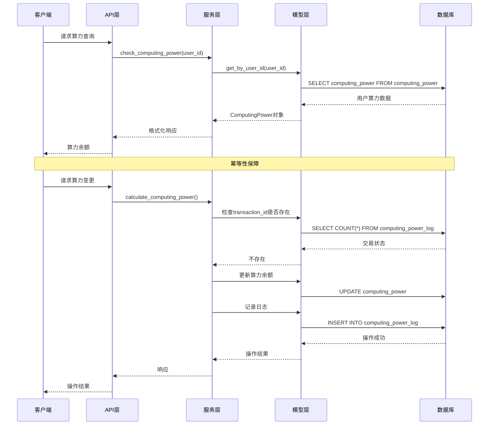

**图表来源**
- [computing_power_service.py:16-172](file://perseids_server/services/computing_power_service.py#L16-L172)
- [computing_power.py:40-110](file://model/computing_power.py#L40-L110)
- [computing_power_log.py:47-69](file://model/computing_power_log.py#L47-L69)

## 详细组件分析

### 账户创建流程

系统在用户注册时自动创建算力账户，确保每个用户都有独立的算力记录：

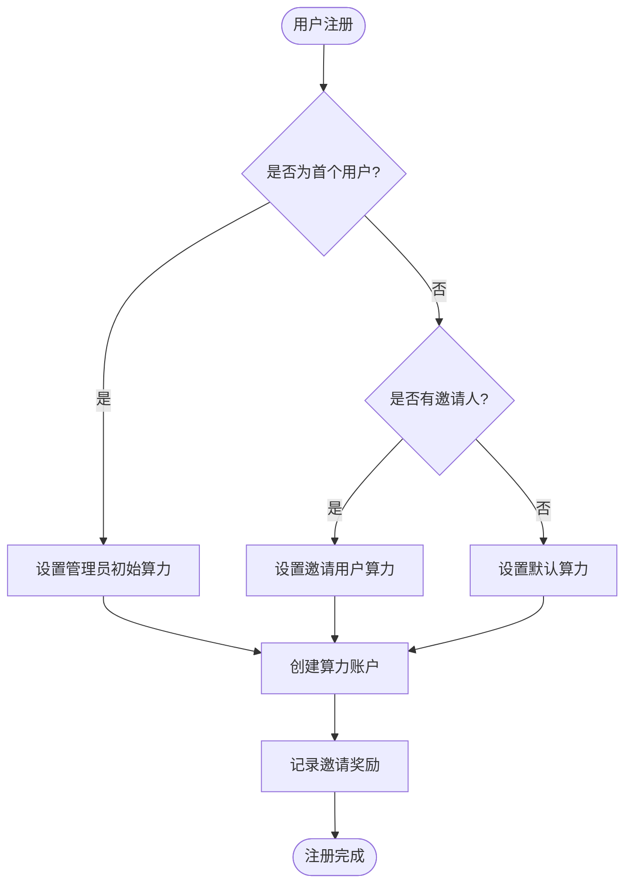

**图表来源**
- [auth_service.py:230-242](file://perseids_server/services/auth_service.py#L230-L242)
- [test_auth_service.py:128-175](file://tests/auth/test_auth_service.py#L128-L175)

#### 初始化参数配置

系统支持多种初始化场景：

| 场景 | 初始算力值 | 触发条件 |
|------|------------|----------|
| 首个管理员用户 | 1000 | 系统中第一个注册的用户 |
| 邀请用户 | 75 | 通过邀请码注册的用户 |
| 普通注册用户 | 50 | 直接注册的用户 |
| 管理员调整 | 自定义 | 管理员手动调整 |

**章节来源**
- [auth_service.py:230-242](file://perseids_server/services/auth_service.py#L230-L242)
- [test_auth_service.py:128-175](file://tests/auth/test_auth_service.py#L128-L175)

### 余额管理机制

#### 余额查询流程

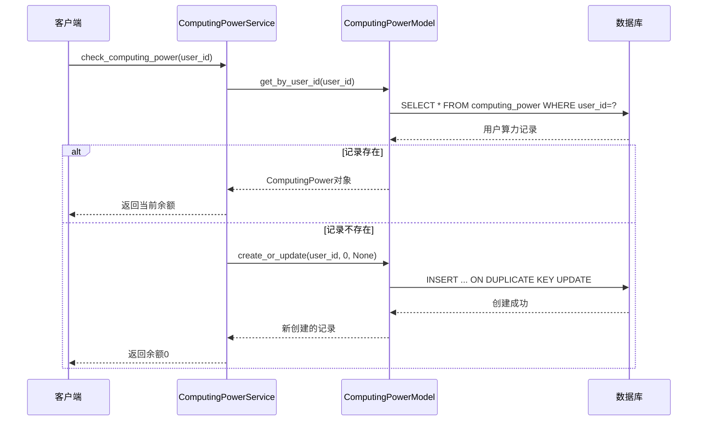

**图表来源**
- [computing_power_service.py:16-59](file://perseids_server/services/computing_power_service.py#L16-L59)
- [computing_power.py:40-52](file://model/computing_power.py#L40-L52)

#### 余额更新与验证

系统实现了严格的余额验证机制：

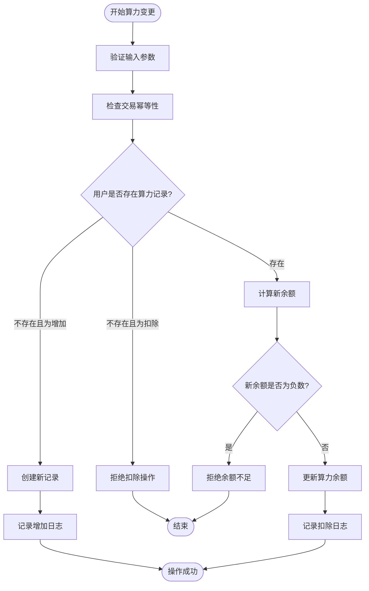

**图表来源**
- [computing_power_service.py:62-172](file://perseids_server/services/computing_power_service.py#L62-L172)
- [computing_power_log.py:176-184](file://model/computing_power_log.py#L176-L184)

**章节来源**
- [computing_power_service.py:62-172](file://perseids_server/services/computing_power_service.py#L62-L172)
- [computing_power_log.py:176-184](file://model/computing_power_log.py#L176-L184)

### 账户生命周期管理

#### 账户状态检查

系统提供了完整的账户状态检查机制：

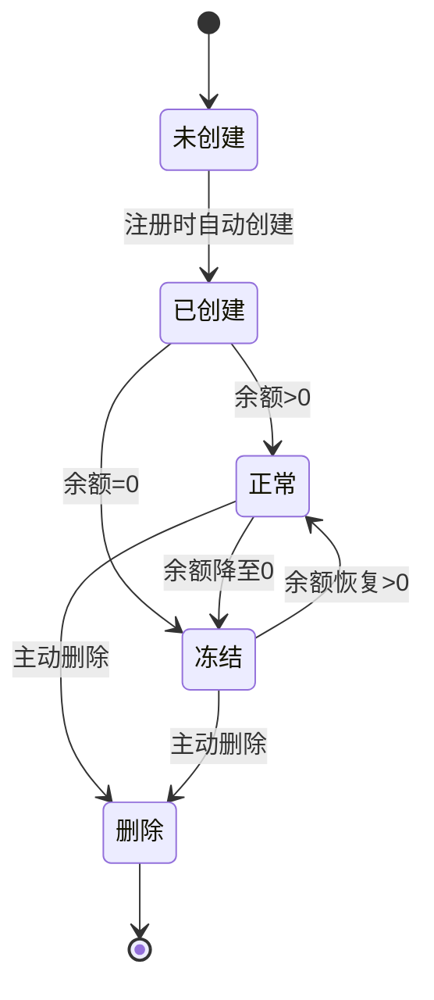

#### 账户删除流程

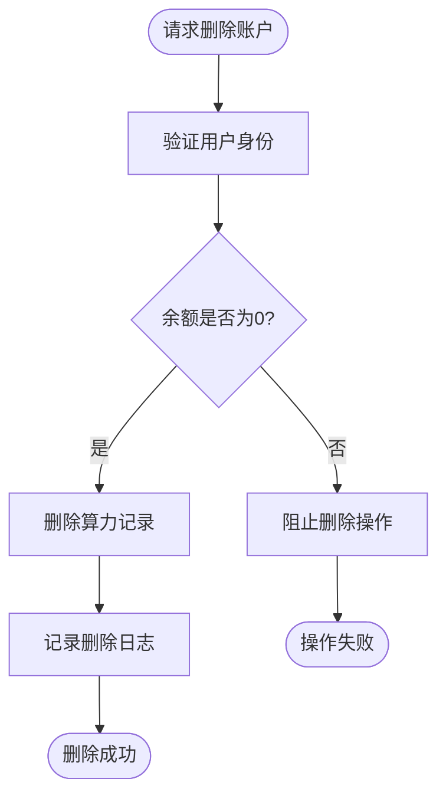

**章节来源**
- [computing_power.py:111-139](file://model/computing_power.py#L111-L139)

### 并发安全处理

系统通过多种机制确保并发环境下的数据一致性：

#### 幂等性保障

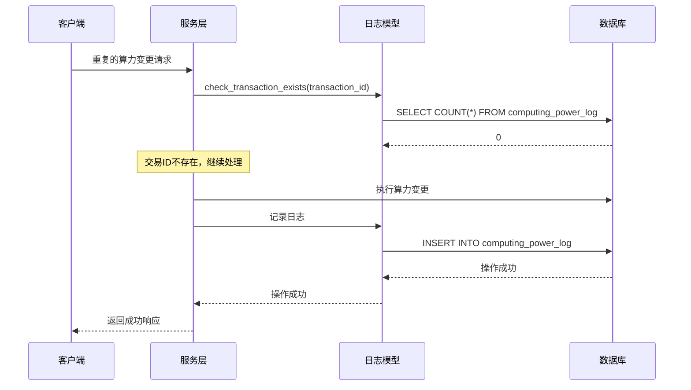

**图表来源**
- [computing_power_service.py:91-94](file://perseids_server/services/computing_power_service.py#L91-L94)
- [computing_power_log.py:176-184](file://model/computing_power_log.py#L176-L184)

#### 原子性操作

系统使用数据库事务确保关键操作的原子性：

- **创建或更新**: 使用 `INSERT ... ON DUPLICATE KEY UPDATE`
- **余额变更**: 单条 `UPDATE` 语句
- **日志记录**: 单条 `INSERT` 语句

**章节来源**
- [computing_power.py:68-85](file://model/computing_power.py#L68-L85)
- [computing_power_service.py:145-158](file://perseids_server/services/computing_power_service.py#L145-L158)

### 异常情况处理

#### 常见异常场景

| 异常类型 | 触发条件 | 处理方式 | 返回信息 |
|----------|----------|----------|----------|
| 余额不足 | 扣除金额>当前余额 | 拒绝操作 | "算力不足，无法扣除" |
| 交易重复 | 交易ID已存在 | 拒绝操作 | "该交易已处理" |
| 参数无效 | 算力值<=0或行为类型错误 | 拒绝操作 | "算力值必须大于0" |
| 用户不存在 | 查询不存在的用户 | 自动创建 | 默认余额0 |

#### 错误恢复机制

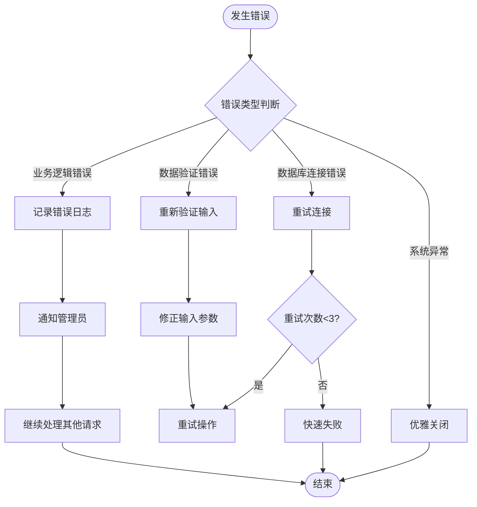

**章节来源**
- [computing_power_service.py:84-143](file://perseids_server/services/computing_power_service.py#L84-L143)

## 依赖分析

### 组件间依赖关系

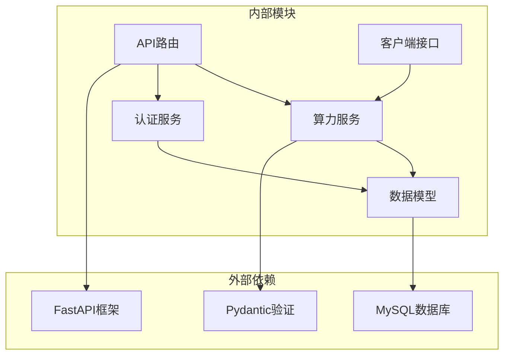

### 数据一致性保证

系统通过以下机制确保数据一致性：

1. **唯一性约束**: `user_id` 在 `computing_power` 表上具有唯一索引
2. **外键关系**: `user_id` 引用 `users` 表的 `id` 字段
3. **事务处理**: 关键操作在数据库事务中执行
4. **幂等性**: 通过 `transaction_id` 防止重复处理
5. **日志审计**: 所有操作都有详细日志记录

**章节来源**
- [computing_power.py:185-197](file://model/computing_power.py#L185-L197)
- [users.py:756-773](file://model/users.py#L756-L773)

## 性能考虑

### 查询优化

系统针对高频查询进行了专门优化：

#### 索引策略

| 表名 | 索引类型 | 字段 | 用途 |
|------|----------|------|------|
| computing_power | 唯一索引 | user_id | 快速查找用户算力 |
| computing_power_log | 主键 | id | 日志记录标识 |
| computing_power_log | 复合索引 | user_id, created_at | 用户日志查询 |
| computing_power_log | 复合索引 | behavior, created_at | 按行为类型查询 |
| computing_power_log | 复合索引 | user_id, behavior, note | 高级过滤查询 |

#### 缓存策略

- **用户算力缓存**: 针对高频查询的用户算力进行短期缓存
- **配置缓存**: 算力配置信息进行进程内缓存
- **日志分页**: 大量日志采用分页查询避免内存溢出

### 并发处理

系统采用以下并发处理策略：

1. **乐观锁**: 使用版本号或时间戳防止并发更新冲突
2. **队列处理**: 高频操作通过消息队列异步处理
3. **连接池**: 数据库连接使用连接池管理
4. **超时控制**: 所有数据库操作设置合理超时时间

## 故障排除指南

### 常见问题诊断

#### 算力查询异常

**症状**: 用户无法查看算力余额
**可能原因**:
1. 数据库连接失败
2. 用户ID无效
3. 算力记录损坏

**解决步骤**:
1. 检查数据库连接状态
2. 验证用户ID的有效性
3. 查看算力记录完整性
4. 重新创建缺失的记录

#### 算力变更失败

**症状**: 算力增加或扣除操作失败
**可能原因**:
1. 余额不足导致扣除失败
2. 交易ID重复
3. 数据库事务冲突

**解决步骤**:
1. 检查当前算力余额
2. 验证交易ID唯一性
3. 查看数据库锁状态
4. 重试操作或联系管理员

### 监控指标

系统建议监控以下关键指标：

| 指标类型 | 监控内容 | 告警阈值 |
|----------|----------|----------|
| 性能指标 | API响应时间 | >500ms |
| 性能指标 | 数据库查询时间 | >100ms |
| 业务指标 | 算力变更成功率 | <99% |
| 业务指标 | 用户活跃度 | 下降>20% |
| 错误指标 | 数据库错误率 | >0.1% |
| 错误指标 | 业务逻辑错误 | >1% |

**章节来源**
- [computing_power_service.py:16-59](file://perseids_server/services/computing_power_service.py#L16-L59)
- [computing_power_log.py:187-224](file://model/computing_power_log.py#L187-L224)

## 结论

算力账户管理系统通过精心设计的数据模型、严格的业务逻辑和完善的异常处理机制，为用户提供了可靠的算力管理服务。系统的主要优势包括：

1. **用户级独立账户**: 每个用户拥有独立的算力账户，确保资源分配的公平性
2. **完整生命周期管理**: 支持账户的创建、激活、停用和删除全流程
3. **强一致性保障**: 通过数据库约束和事务处理确保数据准确性
4. **高并发支持**: 采用多种并发控制机制处理高并发场景
5. **完善的安全机制**: 包括幂等性、权限验证和异常处理

系统在设计上充分考虑了扩展性和维护性，为未来的功能扩展奠定了良好的基础。通过持续的监控和优化，系统能够稳定地支持业务发展需求。