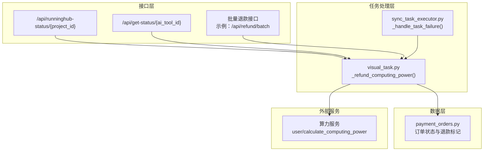
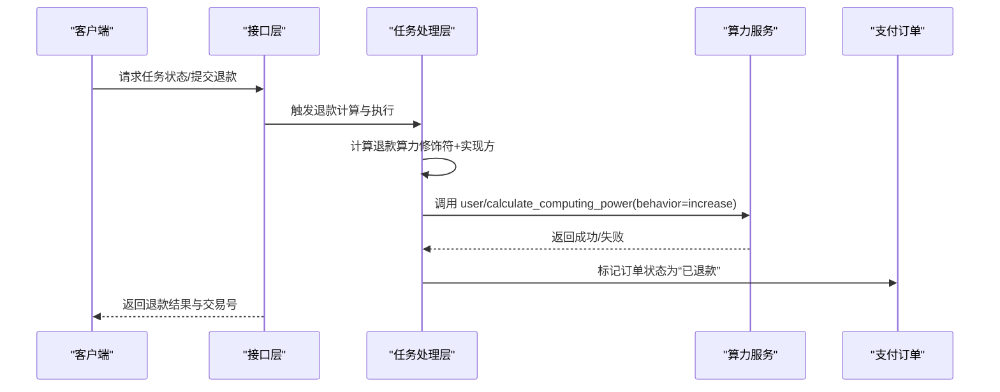
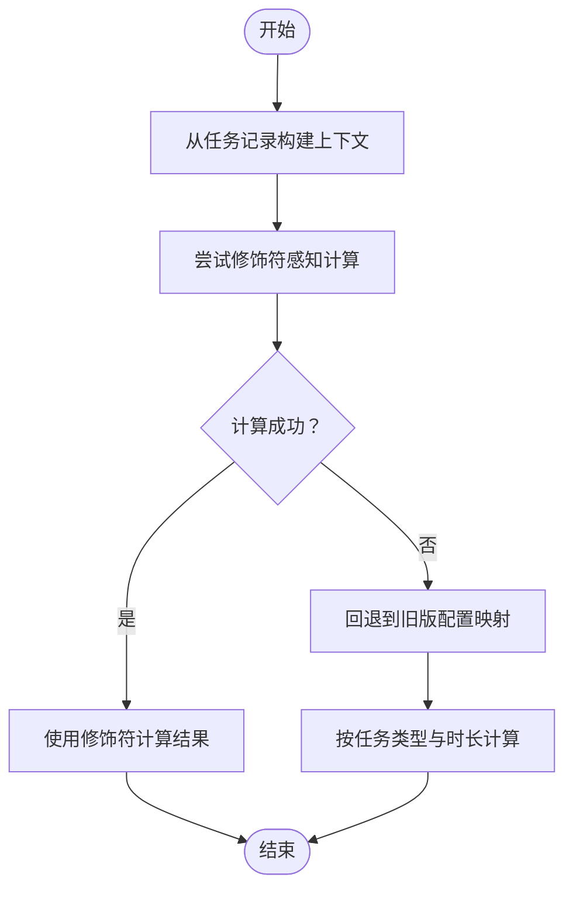
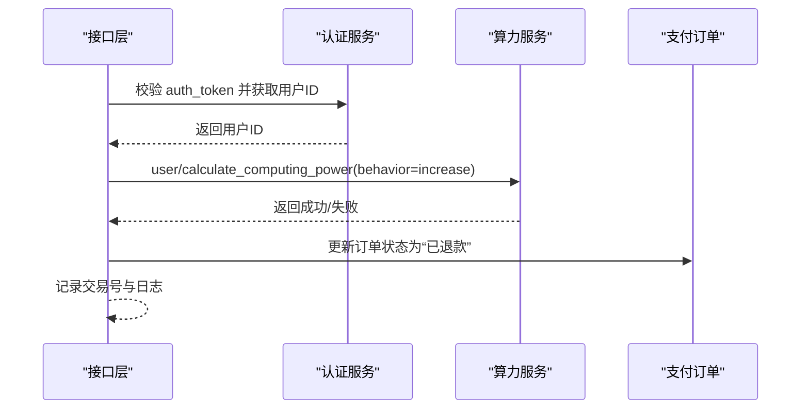
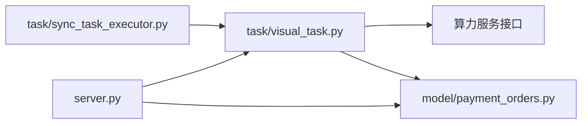

# 算力退款机制

<cite>
**本文档引用的文件**
- [server.py](file://server.py)
- [payment_orders.py](file://model/payment_orders.py)
- [visual_task.py](file://task/visual_task.py)
- [sync_task_executor.py](file://task/sync_task_executor.py)
- [算力多维度计算方案.md](file://docs/backend/算力多维度计算方案.md)
- [test_refund_with_modifiers.py](file://tests/utils/test_refund_with_modifiers.py)
</cite>

## 目录
1. [简介](#简介)
2. [项目结构](#项目结构)
3. [核心组件](#核心组件)
4. [架构总览](#架构总览)
5. [详细组件分析](#详细组件分析)
6. [依赖关系分析](#依赖关系分析)
7. [性能考量](#性能考量)
8. [故障排查指南](#故障排查指南)
9. [结论](#结论)
10. [附录](#附录)

## 简介
本文件系统化梳理并解释本项目的算力退款机制，覆盖以下关键方面：
- 退款触发条件：任务失败、重复收费、用户申请等
- 退款计算规则：比例退款、时间分摊、违约金扣除策略
- 退款执行流程：资金冻结、退款处理、到账确认
- 退款状态跟踪、异常处理与争议解决机制
- 退款接口设计、参数校验与安全控制
- 企业退款的批量处理、特殊政策与合规要求

## 项目结构
围绕算力退款的关键代码分布在以下模块：
- 退款触发与执行：HTTP 接口层与任务状态检查逻辑
- 退款计算：基于任务上下文与实现方的算力计算工具
- 退款执行：调用外部算力服务进行“增加”操作
- 数据持久化：支付订单状态与退款标记
- 同步任务执行器：对同步任务失败的兜底退款处理

**图表来源**
- [server.py:1412-1511](file://server.py#L1412-L1511)
- [visual_task.py:73-169](file://task/visual_task.py#L73-L169)
- [sync_task_executor.py:363-391](file://task/sync_task_executor.py#L363-L391)
- [payment_orders.py:178-230](file://model/payment_orders.py#L178-L230)

**章节来源**
- [server.py:1412-1511](file://server.py#L1412-L1511)
- [visual_task.py:73-169](file://task/visual_task.py#L73-L169)
- [sync_task_executor.py:363-391](file://task/sync_task_executor.py#L363-L391)
- [payment_orders.py:178-230](file://model/payment_orders.py#L178-L230)

## 核心组件
- 退款触发与接口
  - 运行中任务状态检查接口在任务失败时触发退款
  - 支持传入认证令牌进行授权校验与用户身份确认
- 退款计算
  - 优先使用“修饰符感知”的算力计算工具，基于任务上下文与实现方动态计算
  - 回退至旧版配置映射，按任务类型与时长计算
- 退款执行
  - 通过外部算力服务接口进行“增加”操作，补偿用户算力
  - 使用唯一交易号追踪退款事务
- 数据持久化
  - 支付订单状态字段支持“已退款”标记，并记录交易号
- 同步任务兜底
  - 同步执行器失败时直接标记失败并退还需算力

**章节来源**
- [server.py:1463-1497](file://server.py#L1463-L1497)
- [visual_task.py:92-133](file://task/visual_task.py#L92-L133)
- [payment_orders.py:178-230](file://model/payment_orders.py#L178-L230)
- [sync_task_executor.py:363-391](file://task/sync_task_executor.py#L363-L391)

## 架构总览
退款机制的整体流程如下：

**图表来源**
- [server.py:1463-1497](file://server.py#L1463-L1497)
- [visual_task.py:138-165](file://task/visual_task.py#L138-L165)
- [payment_orders.py:178-230](file://model/payment_orders.py#L178-L230)

## 详细组件分析

### 退款触发条件
- 任务失败
  - 运行中任务状态检查接口在检测到失败时，若提供认证令牌，将执行退款
  - 同步任务执行器在子进程失败时，直接标记失败并退还需算力
- 重复收费
  - 支付订单状态支持“已退款”，用于标识该笔订单已退款
- 用户申请
  - 可通过批量退款接口进行处理（示例接口路径见附录）

**章节来源**
- [server.py:1458-1501](file://server.py#L1458-L1501)
- [sync_task_executor.py:363-391](file://task/sync_task_executor.py#L363-L391)
- [payment_orders.py:178-230](file://model/payment_orders.py#L178-L230)

### 退款计算规则
- 修饰符感知计算
  - 基于任务记录重建上下文，结合实现方与任务类型计算应退算力
  - 保证“扣减算力”与“退还需一致”，避免差异
- 回退计算
  - 若修饰符计算失败，回退到旧版配置映射，按任务类型与时长计算
- 时间分摊与违约金
  - 当前实现未发现显式的时间分摊与违约金扣除逻辑；若需引入，建议在“修饰符感知计算”中扩展上下文字段与计算公式

**图表来源**
- [visual_task.py:92-133](file://task/visual_task.py#L92-L133)
- [算力多维度计算方案.md:452-465](file://docs/backend/算力多维度计算方案.md#L452-L465)

**章节来源**
- [visual_task.py:92-133](file://task/visual_task.py#L92-L133)
- [算力多维度计算方案.md:452-465](file://docs/backend/算力多维度计算方案.md#L452-L465)
- [test_refund_with_modifiers.py:101-136](file://tests/utils/test_refund_with_modifiers.py#L101-L136)

### 退款执行流程
- 资金冻结
  - 退款前的算力扣减已在任务提交时完成，退款为“增加”操作
- 退款处理
  - 通过外部算力服务接口进行“增加”操作，补偿用户算力
  - 使用唯一交易号追踪退款事务
- 到账确认
  - 外部服务返回成功即视为退款完成，接口层记录订单状态为“已退款”

**图表来源**
- [server.py:1463-1497](file://server.py#L1463-L1497)
- [payment_orders.py:178-230](file://model/payment_orders.py#L178-L230)

**章节来源**
- [server.py:1463-1497](file://server.py#L1463-L1497)
- [payment_orders.py:178-230](file://model/payment_orders.py#L178-L230)

### 退款状态跟踪与异常处理
- 状态跟踪
  - 支付订单状态字段支持“已退款”，并记录交易号与时间
- 异常处理
  - 外部服务调用失败时记录错误日志，接口层返回错误信息
  - 同步任务执行器失败时直接标记失败并退还需算力

**章节来源**
- [payment_orders.py:178-230](file://model/payment_orders.py#L178-L230)
- [sync_task_executor.py:363-391](file://task/sync_task_executor.py#L363-L391)

### 争议解决机制
- 争议处理建议
  - 保留完整的交易号、日志与上下文信息，便于审计与复核
  - 对于重复收费或异常退款，可通过后台接口进行人工复核与二次处理

**章节来源**
- [server.py:1463-1497](file://server.py#L1463-L1497)
- [payment_orders.py:178-230](file://model/payment_orders.py#L178-L230)

### 退款接口设计、参数验证与安全控制
- 接口设计
  - 任务状态检查接口支持在失败时进行退款，需提供认证令牌
  - 批量退款接口可按需扩展（示例路径见附录）
- 参数验证
  - 认证令牌校验与用户ID匹配校验
  - 交易号唯一性与幂等性保障
- 安全控制
  - 仅在提供有效认证令牌时执行退款
  - 严格记录日志与错误信息，便于审计

**章节来源**
- [server.py:1416-1417](file://server.py#L1416-L1417)
- [server.py:1463-1497](file://server.py#L1463-L1497)

### 企业退款的批量处理、特殊政策与合规要求
- 批量处理
  - 可通过批量退款接口对多个订单进行统一处理
- 特殊政策
  - 可在接口层增加企业用户标识与权限校验
- 合规要求
  - 保留完整日志与审计轨迹，满足合规审查需求

**章节来源**
- [server.py:3088-3109](file://server.py#L3088-L3109)

## 依赖关系分析
退款机制涉及的主要依赖关系如下：

**图表来源**
- [server.py:1412-1511](file://server.py#L1412-L1511)
- [visual_task.py:73-169](file://task/visual_task.py#L73-L169)
- [payment_orders.py:178-230](file://model/payment_orders.py#L178-L230)
- [sync_task_executor.py:363-391](file://task/sync_task_executor.py#L363-L391)

**章节来源**
- [server.py:1412-1511](file://server.py#L1412-L1511)
- [visual_task.py:73-169](file://task/visual_task.py#L73-L169)
- [payment_orders.py:178-230](file://model/payment_orders.py#L178-L230)
- [sync_task_executor.py:363-391](file://task/sync_task_executor.py#L363-L391)

## 性能考量
- 退款计算的修饰符感知路径具备缓存与回退机制，避免重复计算成本
- 外部服务调用采用异步方式，减少接口阻塞
- 同步任务执行器失败时直接标记失败并退还需算力，降低等待时间

[本节为通用指导，不直接分析具体文件]

## 故障排查指南
- 外部服务调用失败
  - 检查认证令牌有效性与用户ID匹配
  - 查看接口层与任务处理层的日志输出
- 退款未到账
  - 核对交易号与外部服务返回状态
  - 检查支付订单状态是否更新为“已退款”
- 同步任务异常
  - 查看同步任务执行器日志，确认失败原因并重试

**章节来源**
- [server.py:1463-1497](file://server.py#L1463-L1497)
- [sync_task_executor.py:363-391](file://task/sync_task_executor.py#L363-L391)
- [payment_orders.py:178-230](file://model/payment_orders.py#L178-L230)

## 结论
本项目的算力退款机制以“任务失败”为主要触发条件，结合“修饰符感知”的算力计算与外部服务的“增加”操作，实现了较为完善的退款闭环。建议在未来引入时间分摊与违约金扣除的显式规则，并完善企业用户的批量处理与合规审计能力。

[本节为总结性内容，不直接分析具体文件]

## 附录
- 批量退款接口（示例）
  - 路径：/api/refund/batch
  - 参数：订单ID列表、认证令牌、业务备注
  - 返回：批量处理结果与交易号列表
- 任务状态检查接口
  - 路径：/api/runninghub-status/{project_id}
  - 参数：认证令牌（可选）
  - 行为：任务失败时退款
- 支付订单状态字段
  - 0-待支付、1-已支付、2-已取消、3-已退款

**章节来源**
- [server.py:1412-1511](file://server.py#L1412-L1511)
- [payment_orders.py:178-230](file://model/payment_orders.py#L178-L230)