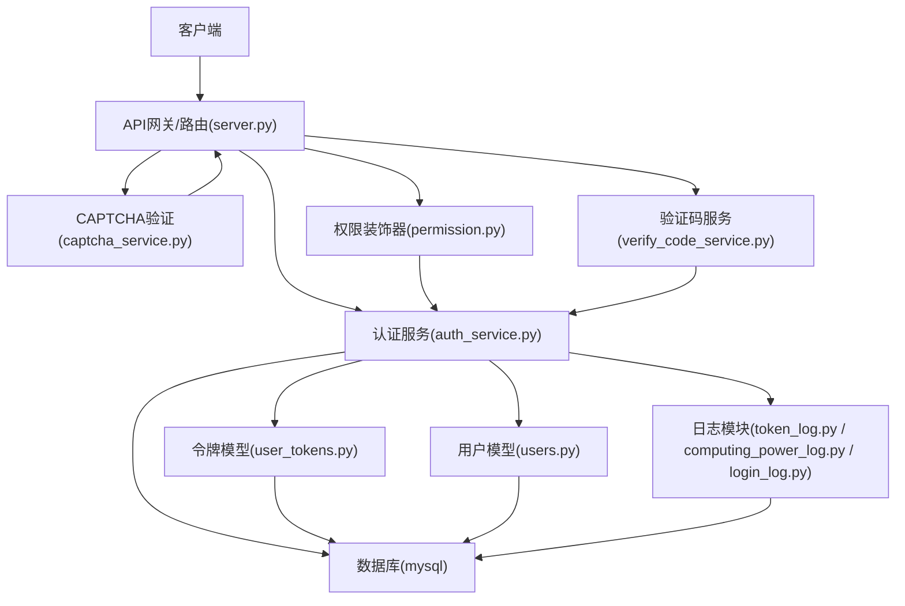
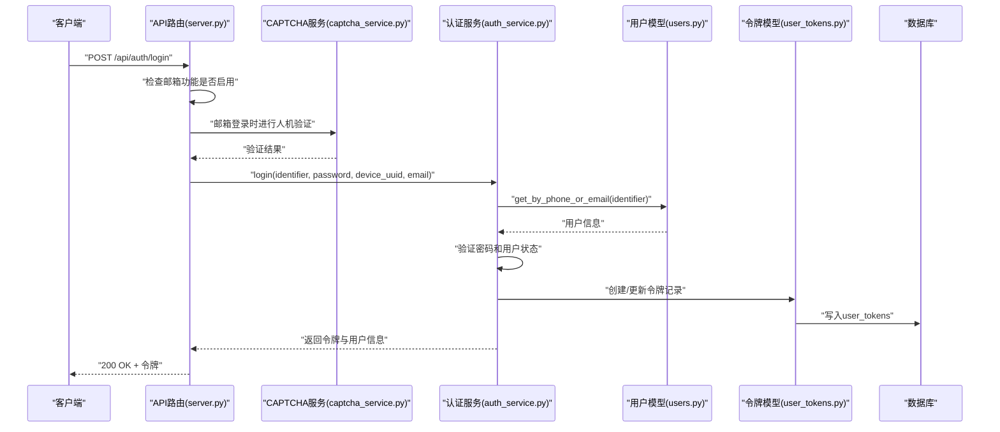
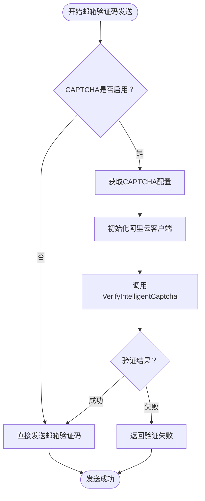
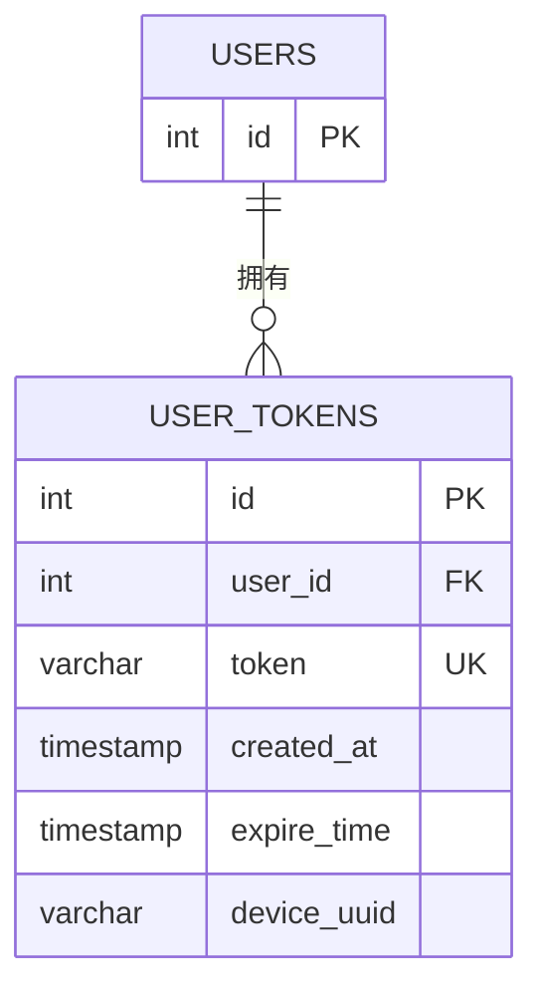
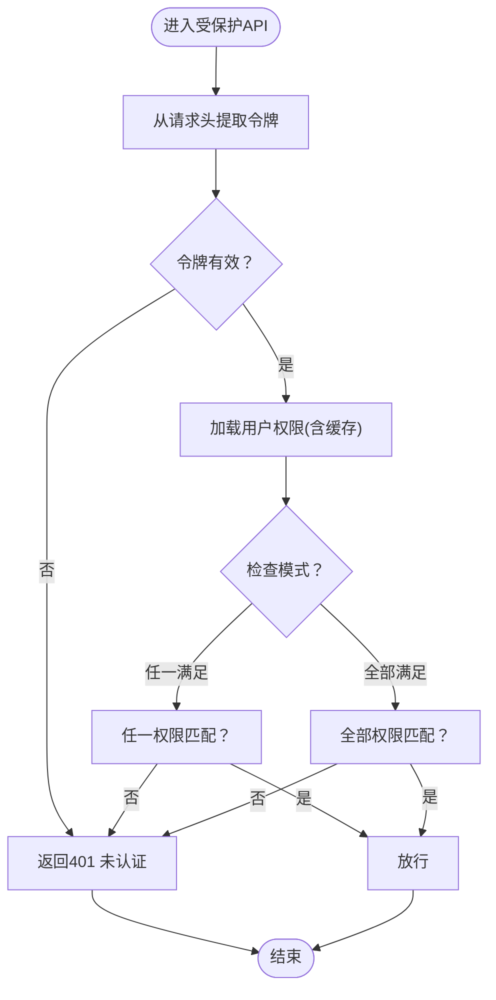
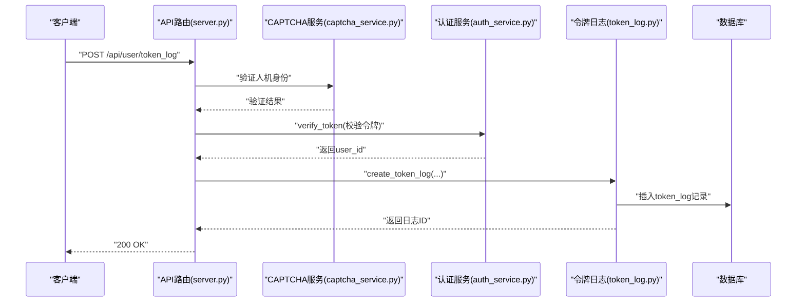
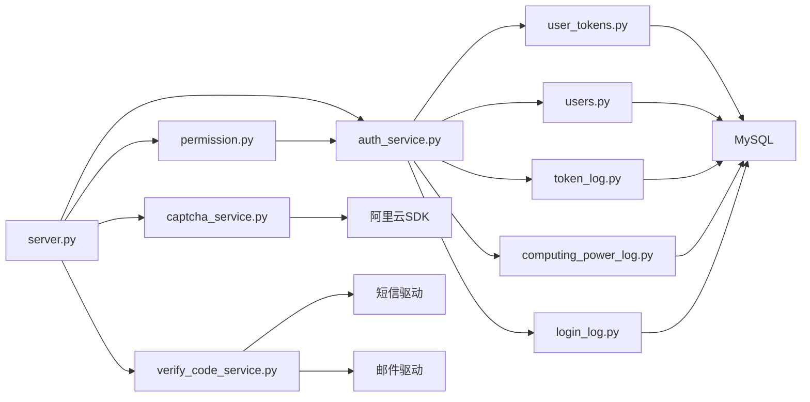

# 安全架构设计

<cite>
**本文引用的文件**
- [server.py](file://server.py)
- [auth_service.py](file://perseids_server/services/auth_service.py)
- [captcha_service.py](file://perseids_server/services/captcha_service.py)
- [verify_code_service.py](file://perseids_server/services/verify_code_service.py)
- [validator.py](file://perseids_server/utils/validator.py)
- [users.py](file://model/users.py)
- [client.py](file://perseids_server/client.py)
- [permission.py](file://perseids_server/utils/permission.py)
- [token.py](file://perseids_server/utils/token.py)
- [user_tokens.py](file://model/user_tokens.py)
- [baseline.sql](file://model/sql/baseline.sql)
- [baseline_with_db.sql](file://model/sql/baseline_with_db.sql)
- [20260401_add_api_token_idx.py](file://alembic/versions/20260401_add_api_token_idx.py)
- [20260409_add_raw_input_token_to_token_log.py](file://alembic/versions/20260409_add_raw_input_token_to_token_log.py)
- [token_log.py](file://model/token_log.py)
- [computing_power_log.py](file://model/computing_power_log.py)
- [login_log.py](file://model/login_log.py)
- [test_auth_service.py](file://tests/auth/test_auth_service.py)
- [权限装饰器使用说明.md](file://docs/权限系统/权限装饰器使用说明.md)
</cite>

## 更新摘要
**所做更改**
- 更新了身份认证与授权机制章节，反映双模式认证（手机号/邮箱）的实现
- 新增CAPTCHA验证机制章节，详细说明阿里云智能验证码服务的集成
- 更新了统一登录逻辑章节，说明多种标识符类型的处理流程
- 增强了API安全防护章节，包含新的验证码验证和人机验证机制
- 更新了威胁模型与缓解策略，考虑新增的安全增强功能

## 目录
1. [引言](#引言)
2. [项目结构](#项目结构)
3. [核心组件](#核心组件)
4. [架构总览](#架构总览)
5. [详细组件分析](#详细组件分析)
6. [依赖关系分析](#依赖关系分析)
7. [性能考虑](#性能考虑)
8. [故障排查指南](#故障排查指南)
9. [结论](#结论)
10. [附录](#附录)

## 引言
本文件为ZhiJuTong平台的安全架构设计文档，聚焦于身份认证与授权机制、JWT令牌管理、权限装饰器系统、访问控制策略、API安全防护、安全中间件、威胁模型与风险缓解、数据与传输安全、存储安全、审计日志与异常监控、安全事件响应以及合规性与最佳实践。文档面向安全工程师与架构师，既提供高层视角，也包含可落地的实现指引与可视化图示。

**更新** 本次更新反映了安全架构的重要增强：认证服务现在支持双模式认证（手机号/邮箱），新增CAPTCHA验证机制，统一登录逻辑支持多种标识符类型。

## 项目结构
围绕安全主题的关键目录与文件如下：
- 认证与授权服务：perseids_server/services/auth_service.py、captcha_service.py、verify_code_service.py
- 客户端适配层：perseids_server/client.py
- 权限装饰器与工具：perseids_server/utils/permission.py、validator.py、token.py
- 数据模型与索引：model/users.py、model/user_tokens.py、model/sql/baseline*.sql、alembic迁移脚本
- 日志与审计：model/token_log.py、model/computing_power_log.py、model/login_log.py
- 测试与文档：tests/auth/test_auth_service.py、docs/权限系统/权限装饰器使用说明.md

```mermaid
graph TB
subgraph "应用入口"
S["server.py"]
end
subgraph "认证与授权"
AS["auth_service.py"]
CS["captcha_service.py"]
VCS["verify_code_service.py"]
AC["client.py"]
TOK["token.py"]
PERM["permission.py"]
VAL["validator.py"]
END
subgraph "数据与持久化"
USERS["users.py"]
UT["user_tokens.py"]
BL["baseline.sql / baseline_with_db.sql"]
MIG1["20260401_add_api_token_idx.py"]
MIG2["20260409_add_raw_input_token_to_token_log.py"]
TL["token_log.py"]
CPL["computing_power_log.py"]
LL["login_log.py"]
end
subgraph "测试与文档"
TST["test_auth_service.py"]
DOC["权限装饰器使用说明.md"]
end
S --> AS
S --> CS
S --> VCS
S --> AC
AC --> AS
AS --> TOK
AS --> USERS
AS --> UT
AS --> TL
AS --> CPL
AS --> LL
PERM --> AS
VAL --> AS
USERS --> BL
UT --> BL
MIG1 --> BL
MIG2 --> TL
TST --> AS
DOC --> PERM
```

**图表来源**
- [server.py](file://server.py)
- [auth_service.py](file://perseids_server/services/auth_service.py)
- [captcha_service.py](file://perseids_server/services/captcha_service.py)
- [verify_code_service.py](file://perseids_server/services/verify_code_service.py)
- [client.py](file://perseids_server/client.py)
- [token.py](file://perseids_server/utils/token.py)
- [permission.py](file://perseids_server/utils/permission.py)
- [validator.py](file://perseids_server/utils/validator.py)
- [users.py](file://model/users.py)
- [user_tokens.py](file://model/user_tokens.py)
- [baseline.sql](file://model/sql/baseline.sql)
- [baseline_with_db.sql](file://model/sql/baseline_with_db.sql)
- [20260401_add_api_token_idx.py](file://alembic/versions/20260401_add_api_token_idx.py)
- [20260409_add_raw_input_token_to_token_log.py](file://alembic/versions/20260409_add_raw_input_token_to_token_log.py)
- [token_log.py](file://model/token_log.py)
- [computing_power_log.py](file://model/computing_power_log.py)
- [login_log.py](file://model/login_log.py)
- [test_auth_service.py](file://tests/auth/test_auth_service.py)
- [权限装饰器使用说明.md](file://docs/权限系统/权限装饰器使用说明.md)

**章节来源**
- [server.py](file://server.py)
- [auth_service.py](file://perseids_server/services/auth_service.py)
- [captcha_service.py](file://perseids_server/services/captcha_service.py)
- [verify_code_service.py](file://perseids_server/services/verify_code_service.py)
- [client.py](file://perseids_server/client.py)
- [users.py](file://model/users.py)
- [user_tokens.py](file://model/user_tokens.py)
- [baseline.sql](file://model/sql/baseline.sql)
- [baseline_with_db.sql](file://model/sql/baseline_with_db.sql)
- [20260401_add_api_token_idx.py](file://alembic/versions/20260401_add_api_token_idx.py)
- [20260409_add_raw_input_token_to_token_log.py](file://alembic/versions/20260409_add_raw_input_token_to_token_log.py)
- [token_log.py](file://model/token_log.py)
- [computing_power_log.py](file://model/computing_power_log.py)
- [login_log.py](file://model/login_log.py)
- [test_auth_service.py](file://tests/auth/test_auth_service.py)
- [权限装饰器使用说明.md](file://docs/权限系统/权限装饰器使用说明.md)

## 核心组件
- 认证服务：负责注册、登录、登出、令牌校验与发放、算力初始化等，现支持手机号和邮箱双模式认证。
- CAPTCHA验证服务：集成阿里云智能验证码2.0，提供人机验证功能，用于邮箱验证码发送前的安全校验。
- 验证码服务：统一管理短信和邮箱验证码的生成、验证和发送，支持多种验证码类型。
- 客户端适配：统一对外暴露认证与令牌日志等接口，内部委派给认证服务。
- 权限装饰器：提供基于权限码的访问控制，支持"任一满足/全部满足"两种模式。
- 令牌与验证工具：封装JWT生成、解析、校验与参数验证。
- 数据模型与索引：用户模型（支持手机号/邮箱查询）、用户令牌表、令牌日志表、算力日志表、登录日志表及索引优化。
- 迁移与审计：通过Alembic迁移脚本维护表结构与字段扩展，配合日志审计追踪。

**章节来源**
- [auth_service.py](file://perseids_server/services/auth_service.py)
- [captcha_service.py](file://perseids_server/services/captcha_service.py)
- [verify_code_service.py](file://perseids_server/services/verify_code_service.py)
- [client.py](file://perseids_server/client.py)
- [permission.py](file://perseids_server/utils/permission.py)
- [validator.py](file://perseids_server/utils/validator.py)
- [token.py](file://perseids_server/utils/token.py)
- [users.py](file://model/users.py)
- [user_tokens.py](file://model/user_tokens.py)
- [token_log.py](file://model/token_log.py)
- [computing_power_log.py](file://model/computing_power_log.py)
- [login_log.py](file://model/login_log.py)

## 架构总览
下图展示ZhiJuTong平台安全架构的关键交互：客户端通过认证服务完成身份验证；CAPTCHA服务提供人机验证保障；权限装饰器在API入口处进行访问控制；令牌与日志模块保障会话与审计；数据库层通过索引与迁移脚本保证性能与演进。



**图表来源**
- [server.py](file://server.py)
- [captcha_service.py](file://perseids_server/services/captcha_service.py)
- [auth_service.py](file://perseids_server/services/auth_service.py)
- [verify_code_service.py](file://perseids_server/services/verify_code_service.py)
- [permission.py](file://perseids_server/utils/permission.py)
- [user_tokens.py](file://model/user_tokens.py)
- [users.py](file://model/users.py)
- [token_log.py](file://model/token_log.py)
- [computing_power_log.py](file://model/computing_power_log.py)
- [login_log.py](file://model/login_log.py)

## 详细组件分析

### 双模式认证与统一登录逻辑
- **双模式认证支持**：认证服务现已支持手机号和邮箱两种登录方式，用户可通过任意一种标识符进行登录。
- **统一登录逻辑**：通过`get_by_phone_or_email`方法实现多种标识符类型的统一处理，自动识别手机号或邮箱格式。
- **动态标识符检测**：登录时根据输入自动判断是手机号还是邮箱，优先使用email参数，否则使用phone。
- **灵活的注册流程**：支持手机号注册和邮箱注册两种模式，分别处理不同的验证逻辑和数据存储。



**图表来源**
- [server.py](file://server.py)
- [captcha_service.py](file://perseids_server/services/captcha_service.py)
- [auth_service.py](file://perseids_server/services/auth_service.py)
- [users.py](file://model/users.py)
- [user_tokens.py](file://model/user_tokens.py)

**章节来源**
- [auth_service.py](file://perseids_server/services/auth_service.py)
- [users.py](file://model/users.py)
- [server.py](file://server.py)
- [captcha_service.py](file://perseids_server/services/captcha_service.py)

### CAPTCHA验证机制
- **阿里云智能验证码**：集成阿里云VerifyIntelligentCaptcha API，提供高级人机验证功能。
- **动态配置管理**：支持通过配置文件启用/禁用CAPTCHA功能，支持多区域配置。
- **场景ID验证**：支持场景ID的二次校验，防止前端篡改和重放攻击。
- **超时控制**：设置合理的超时时间（验证超时15秒，连接超时10秒）确保服务稳定性。
- **验证结果处理**：根据verify_code状态码判断验证结果，支持多种验证场景。



**图表来源**
- [captcha_service.py](file://perseids_server/services/captcha_service.py)
- [server.py](file://server.py)

**章节来源**
- [captcha_service.py](file://perseids_server/services/captcha_service.py)
- [server.py](file://server.py)

### 验证码服务与安全防护
- **统一验证码管理**：支持短信验证码和邮箱验证码的统一管理，支持多种验证码类型。
- **格式验证**：内置手机号和邮箱格式验证，确保输入的有效性。
- **过期管理**：验证码具有5分钟有效期，自动清理过期数据。
- **发送渠道**：支持短信和邮件两种发送渠道，通过工厂模式管理不同驱动。
- **安全策略**：验证码发送前进行CAPTCHA验证，防止自动化攻击。

**章节来源**
- [verify_code_service.py](file://perseids_server/services/verify_code_service.py)
- [validator.py](file://perseids_server/utils/validator.py)

### JWT令牌管理
- **令牌结构**：包含用户标识、过期时间、设备UUID等字段，采用唯一索引加速查询。
- **生命周期**：令牌过期时间字段与索引配合，支持快速清理与失效处理。
- **设备绑定**：设备UUID字段用于多端登录与单点登录策略实施。
- **安全存储**：令牌采用强加密存储，支持强制重新登录机制。



**图表来源**
- [user_tokens.py](file://model/user_tokens.py)
- [baseline.sql](file://model/sql/baseline.sql)
- [baseline_with_db.sql](file://model/sql/baseline_with_db.sql)

**章节来源**
- [user_tokens.py](file://model/user_tokens.py)
- [20260401_add_api_token_idx.py](file://alembic/versions/20260401_add_api_token_idx.py)

### 权限装饰器系统与RBAC
- **装饰器框架**：提供require_permission与admin_required两类装饰器，支持"任一满足/全部满足"的权限检查模式。
- **当前状态**：装饰器已具备框架，但权限验证逻辑尚未实现，处于待完善阶段。
- **实施建议**：结合AuthHelper获取用户ID，查询用户权限列表并进行缓存，再进行权限匹配与拒绝。



**图表来源**
- [permission.py](file://perseids_server/utils/permission.py)
- [权限装饰器使用说明.md](file://docs/权限系统/权限装饰器使用说明.md)

**章节来源**
- [permission.py](file://perseids_server/utils/permission.py)
- [权限装饰器使用说明.md](file://docs/权限系统/权限装饰器使用说明.md)

### 访问控制策略
- **基于角色的权限模型（RBAC）**：通过权限码集合实现细粒度访问控制，支持模块:操作的命名规范。
- **管理员策略**：admin_required装饰器用于高权限接口，确保仅管理员可访问。
- **组合权限**：支持多权限"任一满足/全部满足"，满足复杂业务场景。
- **双模式认证增强**：支持手机号和邮箱两种登录方式，提升用户体验和安全性。

**章节来源**
- [permission.py](file://perseids_server/utils/permission.py)
- [权限装饰器使用说明.md](file://docs/权限系统/权限装饰器使用说明.md)
- [auth_service.py](file://perseids_server/services/auth_service.py)

### API安全防护
- **CORS配置**：建议在server.py中集中配置允许域名、方法与头部，避免通配符暴露。
- **请求验证**：使用validator.py对输入参数进行类型、长度、范围与格式校验。
- **参数过滤**：对敏感字段进行白名单过滤，避免注入与越权。
- **SQL注入防护**：统一使用参数化查询与ORM，避免字符串拼接；对动态SQL进行严格校验与限制。
- **CAPTCHA集成**：邮箱验证码发送前强制进行人机验证，防止自动化攻击。
- **双模式认证安全**：统一登录逻辑确保手机号和邮箱登录的安全一致性。

**章节来源**
- [validator.py](file://perseids_server/utils/validator.py)
- [server.py](file://server.py)
- [captcha_service.py](file://perseids_server/services/captcha_service.py)
- [auth_service.py](file://perseids_server/services/auth_service.py)

### 安全中间件
- **中间件职责**：统一处理跨域、速率限制、请求签名、IP黑白名单、异常拦截与日志记录。
- **与权限装饰器协作**：中间件负责全局安全策略，装饰器负责细粒度权限校验。
- **CAPTCHA中间件**：新增CAPTCHA验证中间件，确保邮箱相关操作的人机验证。

**章节来源**
- [server.py](file://server.py)

### 审计日志与异常监控
- **令牌使用日志**：token_log记录输入输出token、缓存命中、供应商与模型等信息，并支持按用户/行为筛选。
- **算力变动日志**：computing_power_log记录增加/扣减行为、备注与交易ID，便于溯源。
- **登录日志**：login_log记录登录时间与IP地址，支持安全审计。
- **异常监控**：结合日志与Sentry等工具，实现异常告警与自动响应。
- **CAPTCHA审计**：记录CAPTCHA验证结果和失败原因，便于安全分析。



**图表来源**
- [server.py](file://server.py)
- [captcha_service.py](file://perseids_server/services/captcha_service.py)
- [auth_service.py](file://perseids_server/services/auth_service.py)
- [token_log.py](file://model/token_log.py)

**章节来源**
- [token_log.py](file://model/token_log.py)
- [computing_power_log.py](file://model/computing_power_log.py)
- [login_log.py](file://model/login_log.py)
- [captcha_service.py](file://perseids_server/services/captcha_service.py)
- [20260409_add_raw_input_token_to_token_log.py](file://alembic/versions/20260409_add_raw_input_token_to_token_log.py)

### 数据加密、传输安全与存储安全
- **传输安全**：强制HTTPS/TLS，禁用弱密码套件；对敏感接口启用双向认证。
- **存储安全**：令牌与密码采用强哈希与加盐；数据库连接使用SSL；敏感字段加密存储。
- **数据库安全**：索引优化（如api_token唯一索引）提升查询效率；定期备份与恢复演练。
- **CAPTCHA安全**：阿里云SDK配置安全，支持多区域部署和访问控制。

**章节来源**
- [20260401_add_api_token_idx.py](file://alembic/versions/20260401_add_api_token_idx.py)
- [baseline.sql](file://model/sql/baseline.sql)
- [baseline_with_db.sql](file://model/sql/baseline_with_db.sql)
- [captcha_service.py](file://perseids_server/services/captcha_service.py)

### 威胁模型与缓解
- **主要威胁**：令牌泄露、权限提升、暴力破解、SQL注入、XSS/CSRF、DDoS、自动化攻击。
- **缓解措施**：多因子认证、最小权限原则、速率限制、WAF、输入验证、日志审计、应急响应预案。
- **新增缓解**：CAPTCHA验证防止自动化攻击，双模式认证提升用户体验，统一登录逻辑确保安全一致性。
- **人机验证**：阿里云智能验证码提供高级防护，防止机器人攻击和刷量行为。

**章节来源**
- [auth_service.py](file://perseids_server/services/auth_service.py)
- [validator.py](file://perseids_server/utils/validator.py)
- [permission.py](file://perseids_server/utils/permission.py)
- [captcha_service.py](file://perseids_server/services/captcha_service.py)

## 依赖关系分析
- **组件耦合**：API路由依赖认证服务和CAPTCHA服务；权限装饰器依赖认证服务；日志模块依赖数据库；令牌模型依赖数据库。
- **外部依赖**：MySQL、阿里云CAPTCHA服务、Redis（建议用于权限缓存）、Sentry（建议用于异常监控）。
- **循环依赖**：当前结构无明显循环依赖，建议保持分层清晰。
- **新增依赖**：CAPTCHA服务依赖阿里云SDK，需要网络访问权限。



**图表来源**
- [server.py](file://server.py)
- [auth_service.py](file://perseids_server/services/auth_service.py)
- [captcha_service.py](file://perseids_server/services/captcha_service.py)
- [verify_code_service.py](file://perseids_server/services/verify_code_service.py)
- [permission.py](file://perseids_server/utils/permission.py)
- [user_tokens.py](file://model/user_tokens.py)
- [users.py](file://model/users.py)
- [token_log.py](file://model/token_log.py)
- [computing_power_log.py](file://model/computing_power_log.py)
- [login_log.py](file://model/login_log.py)

**章节来源**
- [server.py](file://server.py)
- [auth_service.py](file://perseids_server/services/auth_service.py)
- [captcha_service.py](file://perseids_server/services/captcha_service.py)
- [verify_code_service.py](file://perseids_server/services/verify_code_service.py)
- [permission.py](file://perseids_server/utils/permission.py)
- [user_tokens.py](file://model/user_tokens.py)
- [users.py](file://model/users.py)
- [token_log.py](file://model/token_log.py)
- [computing_power_log.py](file://model/computing_power_log.py)
- [login_log.py](file://model/login_log.py)

## 性能考虑
- **索引优化**：为api_token、user_id、expire_time、device_uuid等建立合适索引，减少查询延迟。
- **缓存策略**：权限与令牌信息可引入Redis缓存，设置合理TTL，降低数据库压力。
- **日志写入**：令牌日志与算力日志采用批量写入与异步处理，避免阻塞主流程。
- **连接池**：数据库连接池大小与超时配置需结合QPS与资源限制进行调优。
- **CAPTCHA性能**：阿里云SDK设置合理的超时时间，避免影响用户体验。
- **验证码缓存**：验证码发送频率限制，防止频繁调用影响系统性能。

**章节来源**
- [20260401_add_api_token_idx.py](file://alembic/versions/20260401_add_api_token_idx.py)
- [token_log.py](file://model/token_log.py)
- [computing_power_log.py](file://model/computing_power_log.py)
- [captcha_service.py](file://perseids_server/services/captcha_service.py)

## 故障排查指南
- **401未认证**：检查令牌是否过期、设备UUID是否一致、数据库索引是否生效。
- **403权限不足**：确认用户权限缓存是否正确更新、装饰器check_mode是否符合预期。
- **登录失败**：核对验证码、密码哈希与用户状态；查看login_log定位异常。
- **日志缺失**：检查token_log与computing_power_log写入异常与数据库连接状态。
- **CAPTCHA失败**：检查阿里云配置、SDK安装、网络连接和验证参数。
- **双模式认证问题**：确认标识符格式、邮箱功能配置和统一登录逻辑。
- **验证码发送失败**：检查短信/邮件驱动配置、CAPTCHA验证状态和发送频率限制。

**章节来源**
- [login_log.py](file://model/login_log.py)
- [token_log.py](file://model/token_log.py)
- [computing_power_log.py](file://model/computing_power_log.py)
- [permission.py](file://perseids_server/utils/permission.py)
- [captcha_service.py](file://perseids_server/services/captcha_service.py)
- [verify_code_service.py](file://perseids_server/services/verify_code_service.py)
- [auth_service.py](file://perseids_server/services/auth_service.py)

## 结论
ZhiJuTong平台的安全架构以认证服务为核心，结合双模式认证、CAPTCHA验证机制和权限装饰器与日志审计，形成完整的访问控制闭环。本次更新显著增强了系统的安全性和用户体验：双模式认证支持手机号和邮箱登录，CAPTCHA验证提供高级人机验证防护，统一登录逻辑确保安全一致性。当前权限验证逻辑尚待完善，建议尽快实现基于RBAC的权限检查与缓存策略。通过索引优化、传输与存储加密、WAF与异常监控等综合手段，可显著提升系统安全性与合规性。

## 附录
- **最佳实践清单**
  - 强制HTTPS与TLS 1.3+，禁用弱算法
  - 实施多因子认证与设备绑定
  - 使用参数化查询与ORM，避免SQL注入
  - 输入参数白名单与严格校验
  - 权限缓存与失效策略
  - 审计日志全生命周期管理
  - 定期渗透测试与漏洞扫描
  - CAPTCHA配置监控与告警
  - 双模式认证安全策略
- **合规性要求**
  - 数据最小化与可追溯
  - 用户知情同意与撤回权
  - 数据跨境传输合规评估
  - 安全事件报告与处置流程
  - 阿里云服务合规使用
  - 验证码发送合规性