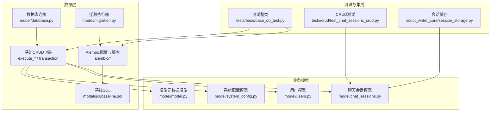
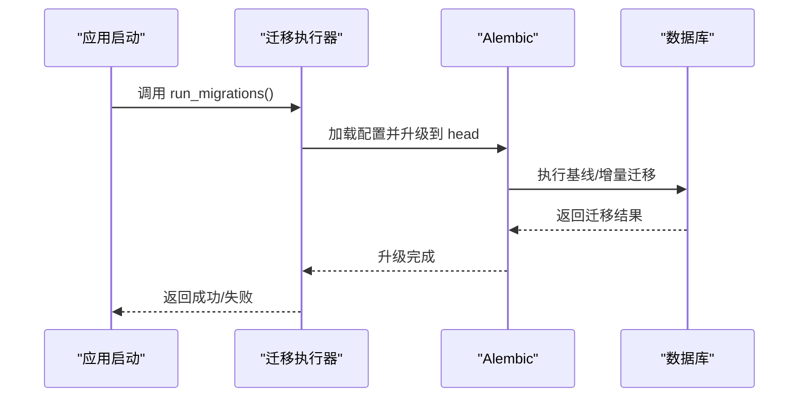
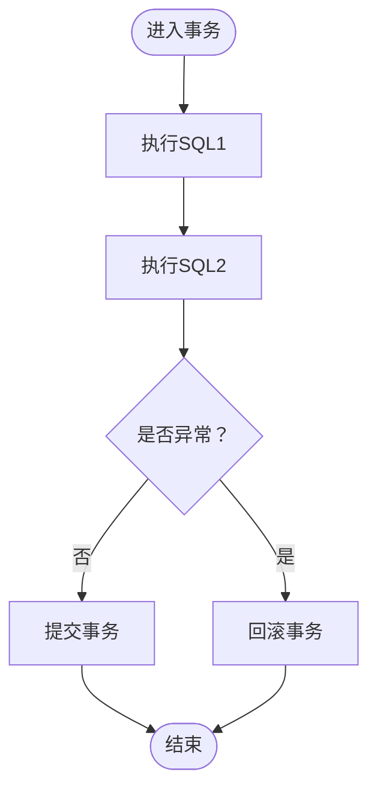
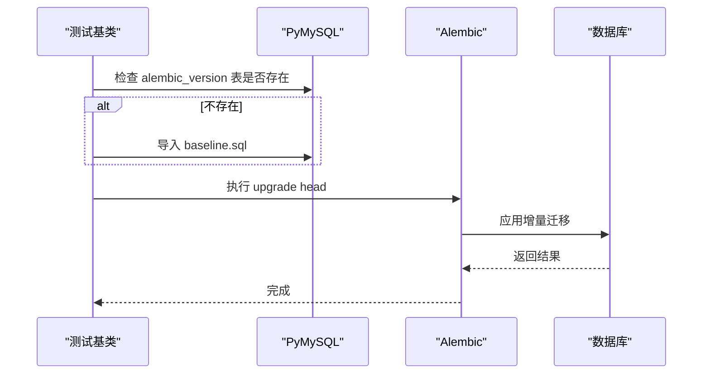
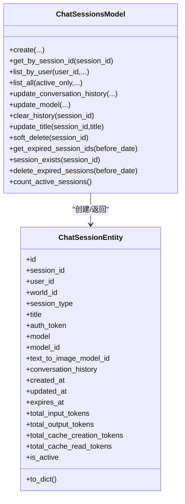
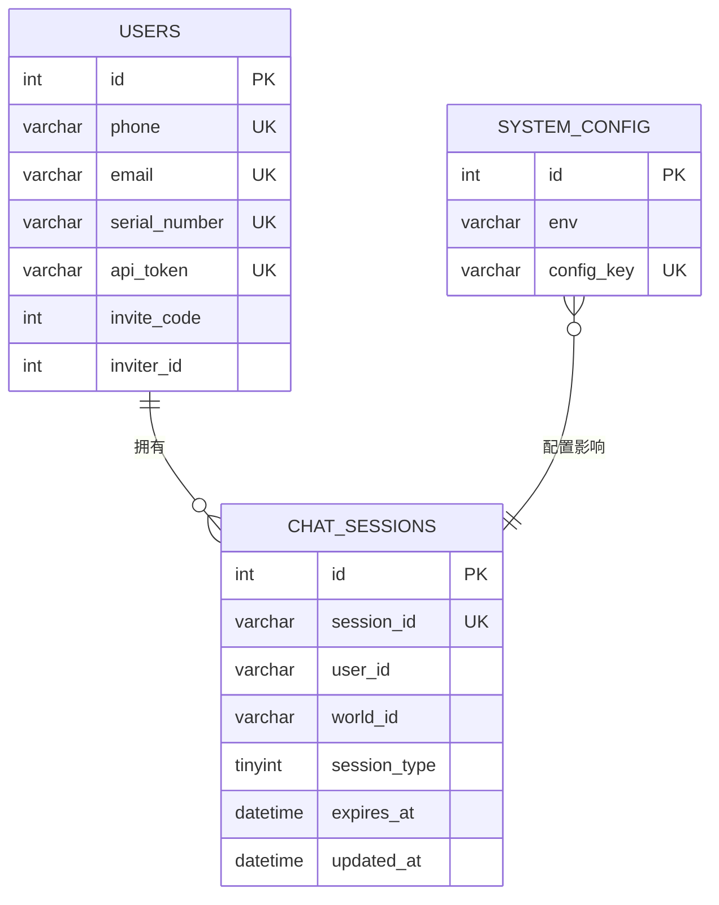
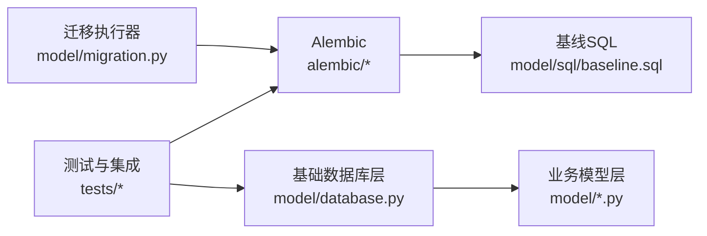

# 数据架构设计

<cite>
**本文引用的文件**
- [model/database.py](file://model/database.py)
- [model/migration.py](file://model/migration.py)
- [docs/database_migration.md](file://docs/database_migration.md)
- [tests/base/base_db_test.py](file://tests/base/base_db_test.py)
- [model/chat_sessions.py](file://model/chat_sessions.py)
- [model/users.py](file://model/users.py)
- [model/system_config.py](file://model/system_config.py)
- [model/model.py](file://model/model.py)
- [model/sql/baseline.sql](file://model/sql/baseline.sql)
- [alembic/env.py](file://alembic/env.py)
- [alembic/script.py.mako](file://alembic/script.py.mako)
- [alembic.ini](file://alembic.ini)
- [script_writer_core/session_storage.py](file://script_writer_core/session_storage.py)
- [tests/crud/test_chat_sessions_crud.py](file://tests/crud/test_chat_sessions_crud.py)
</cite>

## 目录
1. [简介](#简介)
2. [项目结构](#项目结构)
3. [核心组件](#核心组件)
4. [架构总览](#架构总览)
5. [详细组件分析](#详细组件分析)
6. [依赖分析](#依赖分析)
7. [性能考量](#性能考量)
8. [故障排查指南](#故障排查指南)
9. [结论](#结论)
10. [附录](#附录)

## 简介
本文件面向数据库工程师与后端开发者，系统化阐述 ZhiJuTong 平台的数据架构设计。内容涵盖数据库设计原则、ORM 映射策略、数据流控制机制；解释 SQLAlchemy ORM 的使用模式、模型继承体系与关系映射策略；阐述 Alembic 迁移管理的工作流程、版本控制策略与回滚机制；给出数据库架构图与 ER 关系图，说明主键外键设计、索引策略与性能优化方案；解释数据访问模式、缓存策略与并发控制机制；并提供数据生命周期管理、备份恢复策略与数据安全保护措施。

## 项目结构
围绕数据层的关键目录与文件如下：
- 数据库连接与通用 CRUD：model/database.py
- 迁移执行与版本管理：model/migration.py、alembic/*、alembic.ini
- 基线建表脚本：model/sql/baseline.sql
- 业务模型与实体：model/chat_sessions.py、model/users.py、model/system_config.py、model/model.py
- 测试与自动化：tests/base/base_db_test.py、tests/crud/test_chat_sessions_crud.py
- 会话缓存与数据访问：script_writer_core/session_storage.py

**图表来源**
- [model/database.py:1-177](file://model/database.py#L1-L177)
- [model/migration.py:1-163](file://model/migration.py#L1-L163)
- [model/chat_sessions.py:1-598](file://model/chat_sessions.py#L1-L598)
- [model/users.py:1-786](file://model/users.py#L1-L786)
- [model/system_config.py:1-308](file://model/system_config.py#L1-L308)
- [model/model.py:1-127](file://model/model.py#L1-L127)
- [model/sql/baseline.sql:1-200](file://model/sql/baseline.sql#L1-L200)
- [tests/base/base_db_test.py:1-268](file://tests/base/base_db_test.py#L1-L268)
- [tests/crud/test_chat_sessions_crud.py:226-268](file://tests/crud/test_chat_sessions_crud.py#L226-L268)
- [script_writer_core/session_storage.py:181-257](file://script_writer_core/session_storage.py#L181-L257)

**章节来源**
- [model/database.py:1-177](file://model/database.py#L1-L177)
- [model/migration.py:1-163](file://model/migration.py#L1-L163)
- [model/sql/baseline.sql:1-200](file://model/sql/baseline.sql#L1-L200)

## 核心组件
- 数据库连接与事务
  - 提供连接池风格的上下文管理器、事务上下文管理器与基础 CRUD 封装，确保连接正确释放与事务一致性。
- 迁移执行器
  - 封装 Alembic 配置加载、迁移升级、版本戳记与当前版本查询，支持跨平台字节码清理与 UTF-8 配置读取。
- 基线建表脚本
  - 包含 alembic_version 表与各业务表的创建语句，作为新库初始化的“基线”。
- 业务模型
  - ChatSessionsModel、UsersModel、SystemConfigModel 等，提供领域对象与数据库交互的门面方法。
- 测试与自动化
  - 测试基类负责迁移状态检查、基线导入与幂等升级；CRUD 测试验证查询与索引使用。

**章节来源**
- [model/database.py:31-177](file://model/database.py#L31-L177)
- [model/migration.py:69-163](file://model/migration.py#L69-L163)
- [model/sql/baseline.sql:78-93](file://model/sql/baseline.sql#L78-L93)
- [model/chat_sessions.py:75-598](file://model/chat_sessions.py#L75-L598)
- [model/users.py:64-786](file://model/users.py#L64-L786)
- [model/system_config.py:73-308](file://model/system_config.py#L73-L308)
- [tests/base/base_db_test.py:14-187](file://tests/base/base_db_test.py#L14-L187)

## 架构总览
ZhiJuTong 的数据层采用“连接+事务+模型门面”的三层结构：
- 连接层：统一的数据库连接与事务上下文，保证资源释放与一致性。
- 迁移层：Alembic 驱动的版本化迁移，结合基线 SQL 与增量迁移脚本。
- 模型层：面向业务的实体与 DAO 门面，屏蔽 SQL 细节，提供类型化对象。

**图表来源**
- [model/migration.py:69-98](file://model/migration.py#L69-L98)
- [docs/database_migration.md:29-79](file://docs/database_migration.md#L29-L79)

## 详细组件分析

### 数据库连接与事务组件
- 连接管理
  - 使用上下文管理器提供连接生命周期管理，确保异常时连接正确关闭。
- 事务管理
  - 事务上下文自动提交或回滚，简化多步写操作的一致性保障。
- 基础 CRUD
  - 提供 execute_query、execute_update、execute_insert 与批量插入/更新辅助方法，统一参数化查询与受影响行数返回。

**图表来源**
- [model/database.py:122-144](file://model/database.py#L122-L144)

**章节来源**
- [model/database.py:31-177](file://model/database.py#L31-L177)

### 迁移执行与版本控制
- 配置加载
  - 从配置系统读取 Alembic 配置，显式以 UTF-8 读取 alembic.ini，避免跨平台编码问题。
- 迁移执行
  - 清理跨平台字节码缓存与 AppleDouble 文件，避免加载失败；执行 upgrade head。
- 版本查询与标记
  - 支持查询当前版本与 stamp head（仅标记不执行迁移）。
- 自动迁移策略
  - 通过配置开关在应用启动时自动执行迁移，生产环境建议关闭以手动控制。

**图表来源**
- [tests/base/base_db_test.py:14-187](file://tests/base/base_db_test.py#L14-L187)
- [docs/database_migration.md:72-79](file://docs/database_migration.md#L72-L79)

**章节来源**
- [model/migration.py:42-163](file://model/migration.py#L42-L163)
- [docs/database_migration.md:19-94](file://docs/database_migration.md#L19-L94)
- [tests/base/base_db_test.py:14-187](file://tests/base/base_db_test.py#L14-L187)

### 业务模型与实体（示例：聊天会话）
- 实体类
  - ChatSessionEntity 将数据库行映射为领域对象，处理 JSON 字段序列化/反序列化与时间字段转换。
- DAO 门面
  - ChatSessionsModel 提供创建、查询、更新、软删除、过期清理等方法，支持动态字段更新与批量查询。
- 索引与约束
  - 主键自增；唯一索引 session_id；复合索引 (user_id, world_id, session_type)、过期时间索引、更新时间索引，支撑高频查询与清理。

**图表来源**
- [model/chat_sessions.py:14-73](file://model/chat_sessions.py#L14-L73)
- [model/chat_sessions.py:75-598](file://model/chat_sessions.py#L75-L598)

**章节来源**
- [model/chat_sessions.py:75-598](file://model/chat_sessions.py#L75-L598)
- [tests/crud/test_chat_sessions_crud.py:226-268](file://tests/crud/test_chat_sessions_crud.py#L226-L268)

### 业务模型与实体（示例：用户）
- 实体类
  - User 将用户信息映射为对象，支持实现方偏好 JSON 字段解析与序列化。
- DAO 门面
  - UsersModel 提供登录、注册、状态/角色管理、邀请码、API Token、智剧通 Token 等管理方法。
- 索引与约束
  - 主键自增；唯一索引 phone/email/serial_number/api_token；普通索引 invite_code/inviter_id，满足登录与推荐链路查询。

**章节来源**
- [model/users.py:64-786](file://model/users.py#L64-L786)

### 业务模型与实体（示例：系统配置）
- 实体类
  - SystemConfig 提供类型化读取与敏感值脱敏展示。
- DAO 门面
  - SystemConfigModel 提供创建、查询、更新、Upsert、删除、前缀检索与分页搜索。
- 索引与约束
  - 主键自增；唯一索引 (env, config_key)；普通索引 env，支持按环境检索与去重。

**章节来源**
- [model/system_config.py:73-308](file://model/system_config.py#L73-L308)

### 元数据模型（示例：模型）
- 实体类
  - Model 映射模型元数据，包含上下文窗口、工具支持、最大输出 token 等。
- DAO 门面
  - ModelModel 提供创建、查询、分页、更新、删除。
- 索引与约束
  - 主键自增；CREATE_TABLE_SQL 中定义，支撑模型管理与检索。

**章节来源**
- [model/model.py:12-127](file://model/model.py#L12-L127)

### 数据库架构图与ER关系图
- 基线建表脚本包含 alembic_version 与多张业务表，展示版本追踪与核心实体关系。
- 以聊天会话、用户、系统配置为例绘制 ER 关系图，突出主键、唯一键与常用索引。

**图表来源**
- [model/sql/baseline.sql:78-93](file://model/sql/baseline.sql#L78-L93)
- [model/users.py:756-785](file://model/users.py#L756-L785)
- [model/chat_sessions.py:571-597](file://model/chat_sessions.py#L571-L597)
- [model/system_config.py:290-307](file://model/system_config.py#L290-L307)

## 依赖分析
- 组件耦合
  - 业务模型依赖基础数据库封装，不直接依赖第三方 ORM；迁移层独立于业务模型，通过 Alembic 驱动。
- 外部依赖
  - Alembic、PyMySQL、SQLAlchemy（用于迁移工具链）。
- 潜在风险
  - 迁移脚本与基线 SQL 必须保持一致；跨平台字节码缓存需清理；生产环境建议手动迁移以避免并发冲突。

**图表来源**
- [model/database.py:1-177](file://model/database.py#L1-L177)
- [model/migration.py:1-163](file://model/migration.py#L1-L163)
- [model/sql/baseline.sql:1-200](file://model/sql/baseline.sql#L1-L200)
- [tests/base/base_db_test.py:1-268](file://tests/base/base_db_test.py#L1-L268)

**章节来源**
- [model/database.py:1-177](file://model/database.py#L1-L177)
- [model/migration.py:1-163](file://model/migration.py#L1-L163)
- [tests/base/base_db_test.py:1-268](file://tests/base/base_db_test.py#L1-L268)

## 性能考量
- 索引策略
  - 高频过滤字段建立复合索引（如聊天会话的 user_id/world_id/session_type）；时间字段建立单列索引（expires_at、updated_at）。
- 查询优化
  - 分页查询限制条数与偏移；避免 SELECT *，按需投影字段。
- 写入优化
  - 批量插入/更新使用事务上下文；避免长事务持有锁。
- 缓存策略
  - 会话缓存（内存字典+锁）提升热点读取性能，结合 TTL 与失效策略；注意缓存一致性与并发读写。

**章节来源**
- [model/chat_sessions.py:571-597](file://model/chat_sessions.py#L571-L597)
- [script_writer_core/session_storage.py:181-257](file://script_writer_core/session_storage.py#L181-L257)

## 故障排查指南
- 迁移失败
  - 检查 Alembic 配置编码与脚本位置；确认跨平台缓存清理；查看迁移日志与标准输出。
- 连接异常
  - 核对数据库配置与环境变量；确认字符集设置；检查连接池与事务上下文是否正确使用。
- 数据不一致
  - 确认事务边界；核对唯一索引冲突；检查软删除与过期清理逻辑。
- 测试环境初始化
  - 使用测试基类的迁移检查与基线导入流程，确保每次测试前数据库处于预期状态。

**章节来源**
- [docs/database_migration.md:81-94](file://docs/database_migration.md#L81-L94)
- [tests/base/base_db_test.py:14-187](file://tests/base/base_db_test.py#L14-L187)
- [model/database.py:31-177](file://model/database.py#L31-L177)

## 结论
ZhiJuTong 的数据架构以简洁可靠的连接与事务层为基础，配合 Alembic 的版本化迁移与基线 SQL，形成可演进、可验证的数据层。业务模型通过门面方法屏蔽 SQL 细节，结合合理的索引与缓存策略，满足高并发场景下的性能与一致性需求。建议在生产环境采用手动迁移与严格备份策略，并持续完善监控与回滚预案。

## 附录
- 常用迁移命令与权限要求参见迁移指南文档。
- 基线 SQL 中包含 alembic_version 初始化与多张业务表的建表语句，用于新库快速初始化。

**章节来源**
- [docs/database_migration.md:29-94](file://docs/database_migration.md#L29-L94)
- [model/sql/baseline.sql:78-93](file://model/sql/baseline.sql#L78-L93)