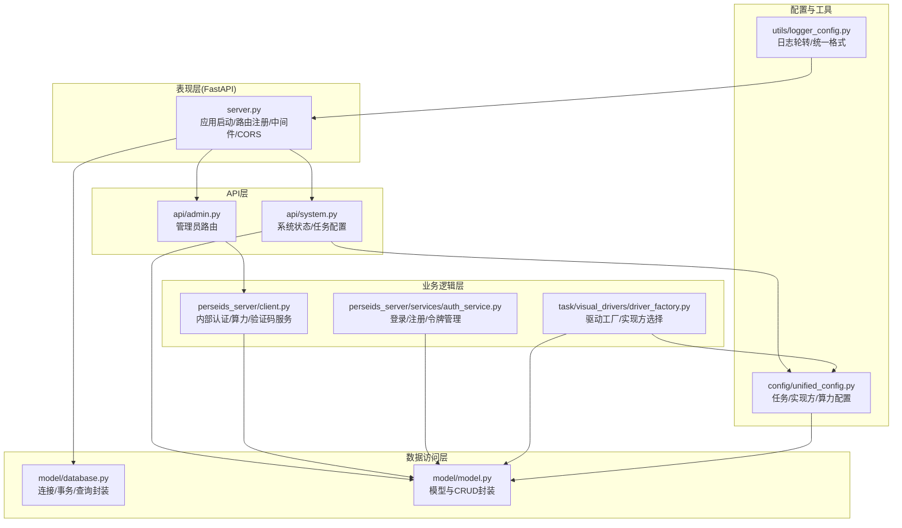
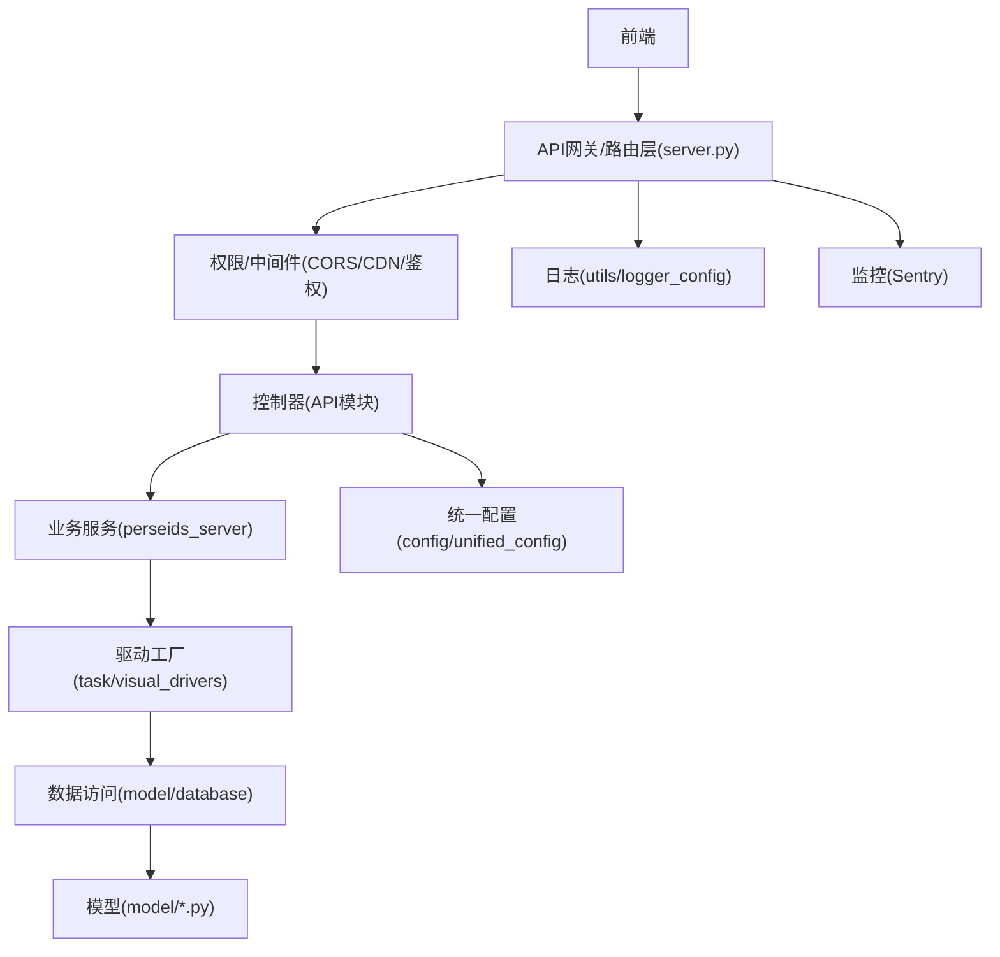
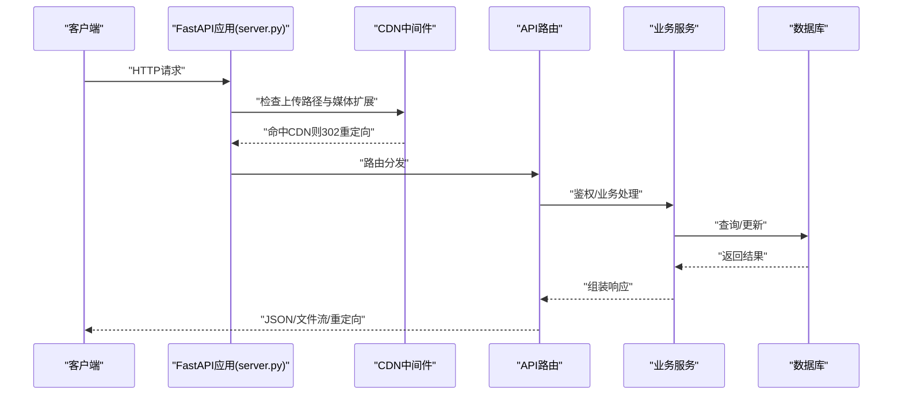
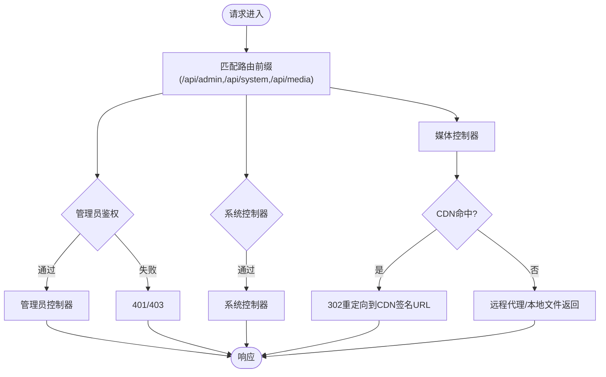
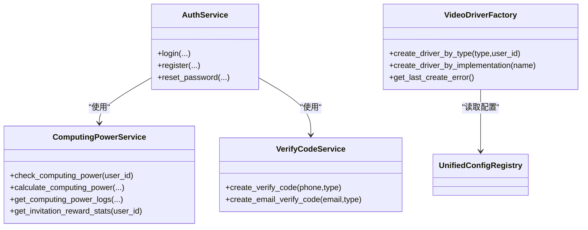
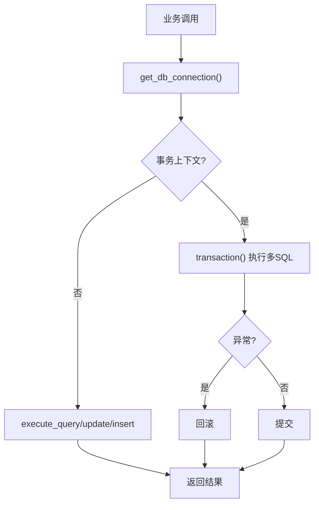
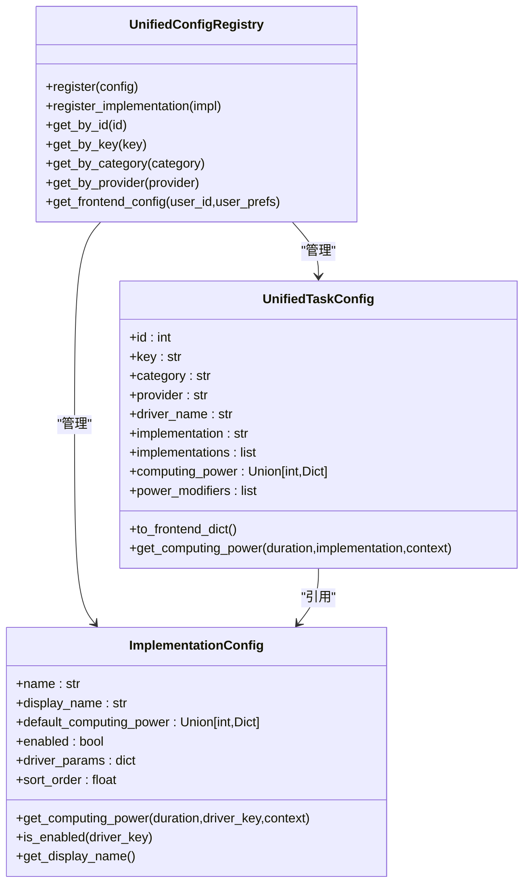
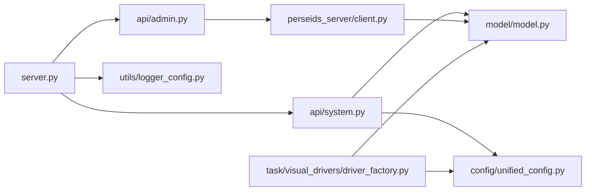

# 整体架构设计

<cite>
**本文档引用的文件**
- [server.py](file://server.py)
- [database.py](file://model/database.py)
- [unified_config.py](file://config/unified_config.py)
- [logger_config.py](file://utils/logger_config.py)
- [admin.py](file://api/admin.py)
- [system.py](file://api/system.py)
- [model.py](file://model/model.py)
- [client.py](file://perseids_server/client.py)
- [auth_service.py](file://perseids_server/services/auth_service.py)
- [driver_factory.py](file://task/visual_drivers/driver_factory.py)
</cite>

## 目录
1. [引言](#引言)
2. [项目结构](#项目结构)
3. [核心组件](#核心组件)
4. [架构总览](#架构总览)
5. [详细组件分析](#详细组件分析)
6. [依赖分析](#依赖分析)
7. [性能考量](#性能考量)
8. [故障排查指南](#故障排查指南)
9. [结论](#结论)
10. [附录](#附录)

## 引言
本文件面向架构师与高级开发者，系统化阐述 ZhiJuTong 平台的整体架构设计。平台采用分层架构，围绕表现层（FastAPI Web 框架）、API 层（路由与中间件）、业务逻辑层（服务封装）、数据访问层（ORM 模型）进行职责划分，并通过统一配置系统实现“配置驱动开发”“模块化设计”“插件化扩展”。同时，文档解释系统边界、组件集成模式以及跨层关注点（安全、监控、日志）的处理方式，并给出架构图与组件分解说明，帮助读者快速理解并高效迭代。

## 项目结构
- 表现层：以 FastAPI 为核心，提供 REST API、静态资源托管、CORS、中间件与路由注册。
- API 层：按功能域拆分路由模块（管理员、系统、媒体、通知、脚本写作等），统一鉴权与权限控制。
- 业务逻辑层：服务封装（认证、算力、验证码等），驱动工厂与可视化驱动实现多供应商与多实现方的插件化扩展。
- 数据访问层：统一数据库连接与事务管理，模型层提供 CRUD 封装与表结构定义。
- 配置与工具：统一配置系统（任务类型、实现方、算力修饰符等），日志与监控工具（Sentry、日志轮转）。

**图表来源**
- [server.py:306-380](file://server.py#L306-L380)
- [admin.py:26-56](file://api/admin.py#L26-L56)
- [system.py:17-82](file://api/system.py#L17-L82)
- [client.py:27-157](file://perseids_server/client.py#L27-L157)
- [auth_service.py:32-139](file://perseids_server/services/auth_service.py#L32-L139)
- [driver_factory.py:14-138](file://task/visual_drivers/driver_factory.py#L14-L138)
- [database.py:31-144](file://model/database.py#L31-L144)
- [model.py:41-111](file://model/model.py#L41-L111)
- [unified_config.py:482-784](file://config/unified_config.py#L482-L784)
- [logger_config.py:70-117](file://utils/logger_config.py#L70-L117)

**章节来源**
- [server.py:306-380](file://server.py#L306-L380)
- [admin.py:26-56](file://api/admin.py#L26-L56)
- [system.py:17-82](file://api/system.py#L17-L82)
- [client.py:27-157](file://perseids_server/client.py#L27-L157)
- [auth_service.py:32-139](file://perseids_server/services/auth_service.py#L32-L139)
- [driver_factory.py:14-138](file://task/visual_drivers/driver_factory.py#L14-L138)
- [database.py:31-144](file://model/database.py#L31-L144)
- [model.py:41-111](file://model/model.py#L41-L111)
- [unified_config.py:482-784](file://config/unified_config.py#L482-L784)
- [logger_config.py:70-117](file://utils/logger_config.py#L70-L117)

## 核心组件
- 应用入口与路由注册：FastAPI 应用初始化、CORS、静态资源、CDN 中间件、企业版/社区版路由切换、Sentry 初始化、视频驱动注册。
- API 路由：管理员后台、系统状态与任务配置、媒体下载/代理、通知等。
- 统一配置系统：任务类型、实现方、算力修饰符、前端配置导出、用户偏好应用。
- 业务服务：内部认证服务（令牌校验、算力查询/扣减/日志、验证码发送）、外部认证调用。
- 驱动工厂：三层映射（任务类型→业务驱动→实现驱动），支持用户偏好与配置校验。
- 数据访问：数据库连接、事务、查询/更新封装；模型层提供 CRUD 与表结构。
- 日志与监控：统一日志格式与按日切割、Sentry 错误监控。

**章节来源**
- [server.py:306-380](file://server.py#L306-L380)
- [system.py:44-82](file://api/system.py#L44-L82)
- [unified_config.py:240-480](file://config/unified_config.py#L240-L480)
- [client.py:27-157](file://perseids_server/client.py#L27-L157)
- [driver_factory.py:14-138](file://task/visual_drivers/driver_factory.py#L14-L138)
- [database.py:31-144](file://model/database.py#L31-L144)
- [logger_config.py:70-117](file://utils/logger_config.py#L70-L117)

## 架构总览
分层架构遵循“表现层薄、API 层清晰、业务层高内聚、数据层稳定”的原则。统一配置系统贯穿业务层与表现层，实现“配置即能力”，插件化驱动工厂支撑多供应商与多实现方的灵活切换。跨层关注点通过中间件、服务封装与工具模块统一处理。

**图表来源**
- [server.py:382-419](file://server.py#L382-L419)
- [admin.py:26-56](file://api/admin.py#L26-L56)
- [system.py:44-82](file://api/system.py#L44-L82)
- [client.py:27-157](file://perseids_server/client.py#L27-L157)
- [driver_factory.py:14-138](file://task/visual_drivers/driver_factory.py#L14-L138)
- [database.py:31-144](file://model/database.py#L31-L144)
- [model.py:41-111](file://model/model.py#L41-L111)
- [logger_config.py:70-117](file://utils/logger_config.py#L70-L117)

## 详细组件分析

### 表现层（FastAPI）
- 应用初始化：注册管理员、系统、媒体、通知、脚本写作等路由；加载企业版/社区版用户路由；注册视频驱动；CORS 与 CDN 中间件；Sentry 初始化。
- 中间件：CDN 重定向中间件根据配置与媒体映射自动跳转至 CDN；请求头处理与反代协议修正。
- 静态资源与版本控制：HTML 处理与静态资源版本号注入，支持缓存失效策略。
- 安全与权限：权限装饰器与资源访问控制（空间隔离/删除权限）。

**图表来源**
- [server.py:382-419](file://server.py#L382-L419)
- [server.py:504-617](file://server.py#L504-L617)
- [server.py:619-676](file://server.py#L619-L676)

**章节来源**
- [server.py:306-380](file://server.py#L306-L380)
- [server.py:382-419](file://server.py#L382-L419)
- [server.py:504-617](file://server.py#L504-L617)
- [server.py:619-676](file://server.py#L619-L676)

### API层（路由与中间件）
- 管理员路由：仪表盘、月活统计、模型分析、用户列表等，均通过管理员权限校验中间件保护。
- 系统路由：系统状态、任务配置（含用户偏好）、服务器公开配置。
- 媒体路由：下载/代理图片/视频，支持本地缓存、CDN 签名重定向与远程代理。
- 中间件：CORS、CDN 重定向、请求头解析与反代协议修正。

**图表来源**
- [admin.py:29-55](file://api/admin.py#L29-L55)
- [system.py:44-82](file://api/system.py#L44-L82)
- [server.py:395-418](file://server.py#L395-L418)
- [server.py:504-617](file://server.py#L504-L617)
- [server.py:619-676](file://server.py#L619-L676)

**章节来源**
- [admin.py:29-55](file://api/admin.py#L29-L55)
- [system.py:44-82](file://api/system.py#L44-L82)
- [server.py:395-418](file://server.py#L395-L418)
- [server.py:504-617](file://server.py#L504-L617)
- [server.py:619-676](file://server.py#L619-L676)

### 业务逻辑层（服务封装）
- 内部认证服务：令牌校验、算力查询/扣减/日志、邀请奖励统计、验证码发送、外部认证调用。
- 认证服务：登录/注册/重置密码，密码哈希、设备 UUID、登录日志、用户状态与条款校验。
- 驱动工厂：三层映射（任务类型→业务驱动→实现驱动），支持用户偏好、配置校验与错误追踪。

**图表来源**
- [auth_service.py:32-139](file://perseids_server/services/auth_service.py#L32-L139)
- [client.py:42-157](file://perseids_server/client.py#L42-L157)
- [driver_factory.py:56-138](file://task/visual_drivers/driver_factory.py#L56-L138)

**章节来源**
- [auth_service.py:32-139](file://perseids_server/services/auth_service.py#L32-L139)
- [client.py:42-157](file://perseids_server/client.py#L42-L157)
- [driver_factory.py:56-138](file://task/visual_drivers/driver_factory.py#L56-L138)

### 数据访问层（ORM模型）
- 数据库连接：统一配置读取、环境变量覆盖、连接上下文管理、事务封装。
- 模型封装：提供 CRUD 方法与表结构定义，便于上层业务调用。
- 事务与查询：提供 select/update/insert 与事务上下文，保证一致性。

**图表来源**
- [database.py:31-144](file://model/database.py#L31-L144)
- [model.py:41-111](file://model/model.py#L41-L111)

**章节来源**
- [database.py:31-144](file://model/database.py#L31-L144)
- [model.py:41-111](file://model/model.py#L41-L111)

### 统一配置系统（配置驱动开发）
- 任务类型与实现方：任务配置包含分类、供应商、默认实现、支持的实现方列表、算力修饰符等。
- 前端配置导出：按用户偏好与实现方启用状态动态生成前端所需配置。
- 算力计算：支持固定算力与按时长映射，支持修饰符累积乘数与向上取整。

**图表来源**
- [unified_config.py:240-480](file://config/unified_config.py#L240-L480)
- [unified_config.py:482-784](file://config/unified_config.py#L482-L784)

**章节来源**
- [unified_config.py:240-480](file://config/unified_config.py#L240-L480)
- [unified_config.py:482-784](file://config/unified_config.py#L482-L784)

## 依赖分析
- 组件耦合：API 层依赖业务服务与统一配置；业务服务依赖数据访问层；驱动工厂依赖统一配置与数据访问；表现层依赖 API 层与工具模块。
- 外部依赖：数据库（pymysql）、HTTP 客户端（httpx）、Sentry、日志轮转。
- 循环依赖：通过延迟导入与模块拆分避免；统一配置系统与驱动工厂之间通过字符串驱动名称解耦。

**图表来源**
- [server.py:306-380](file://server.py#L306-L380)
- [admin.py:26-56](file://api/admin.py#L26-L56)
- [system.py:17-82](file://api/system.py#L17-L82)
- [client.py:27-157](file://perseids_server/client.py#L27-L157)
- [driver_factory.py:14-138](file://task/visual_drivers/driver_factory.py#L14-L138)
- [unified_config.py:482-784](file://config/unified_config.py#L482-L784)
- [model.py:41-111](file://model/model.py#L41-L111)
- [logger_config.py:70-117](file://utils/logger_config.py#L70-L117)

**章节来源**
- [server.py:306-380](file://server.py#L306-L380)
- [admin.py:26-56](file://api/admin.py#L26-L56)
- [system.py:17-82](file://api/system.py#L17-L82)
- [client.py:27-157](file://perseids_server/client.py#L27-L157)
- [driver_factory.py:14-138](file://task/visual_drivers/driver_factory.py#L14-L138)
- [unified_config.py:482-784](file://config/unified_config.py#L482-L784)
- [model.py:41-111](file://model/model.py#L41-L111)
- [logger_config.py:70-117](file://utils/logger_config.py#L70-L117)

## 性能考量
- 异步与并发：FastAPI 异步路由与中间件；驱动工厂通过线程池包装同步调用，避免阻塞事件循环。
- 数据库：连接池与事务封装减少连接开销；按需分页查询降低内存压力。
- 缓存与CDN：CDN 中间件命中即 302 重定向，显著降低带宽与延迟；静态资源版本号注入提升缓存命中率。
- 日志与监控：按日切割日志避免文件过大；Sentry 统一错误上报，便于定位性能瓶颈。

[本节为通用指导，无需特定文件引用]

## 故障排查指南
- 权限与鉴权：管理员路由需携带有效 Bearer Token；无权限或过期将返回 401/403。
- 驱动创建失败：驱动工厂提供详细错误原因（不支持类型、未配置驱动、未注册实现、配置缺失、创建失败）。
- 数据库连接：统一连接上下文与事务封装，异常时自动回滚；检查数据库配置与环境变量。
- 日志定位：统一日志格式与按日切割；Sentry 错误上报；结合请求头与CDN重定向日志定位问题。

**章节来源**
- [admin.py:29-55](file://api/admin.py#L29-L55)
- [driver_factory.py:187-199](file://task/visual_drivers/driver_factory.py#L187-L199)
- [database.py:31-144](file://model/database.py#L31-L144)
- [logger_config.py:70-117](file://utils/logger_config.py#L70-L117)

## 结论
ZhiJuTong 平台通过分层架构与统一配置系统实现了“配置即能力”的可演进设计，配合插件化驱动工厂与严格的权限控制，满足多供应商、多实现方的灵活调度需求。表现层薄而强健，API 层清晰易维护，业务层高内聚，数据层稳定可靠。跨层关注点（安全、监控、日志）通过中间件与工具模块统一处理，整体架构具备良好的扩展性与可维护性。

[本节为总结性内容，无需特定文件引用]

## 附录
- 技术选型权衡：FastAPI 提供高性能与自动生成 OpenAPI 文档；pymysql 简洁稳定；Sentry 与统一日志提升可观测性；CDN 中间件优化带宽与延迟。
- 约束条件：数据库连接需与环境变量协同；驱动工厂依赖统一配置与已注册实现；权限装饰器需与路由绑定使用。

[本节为补充说明，无需特定文件引用]