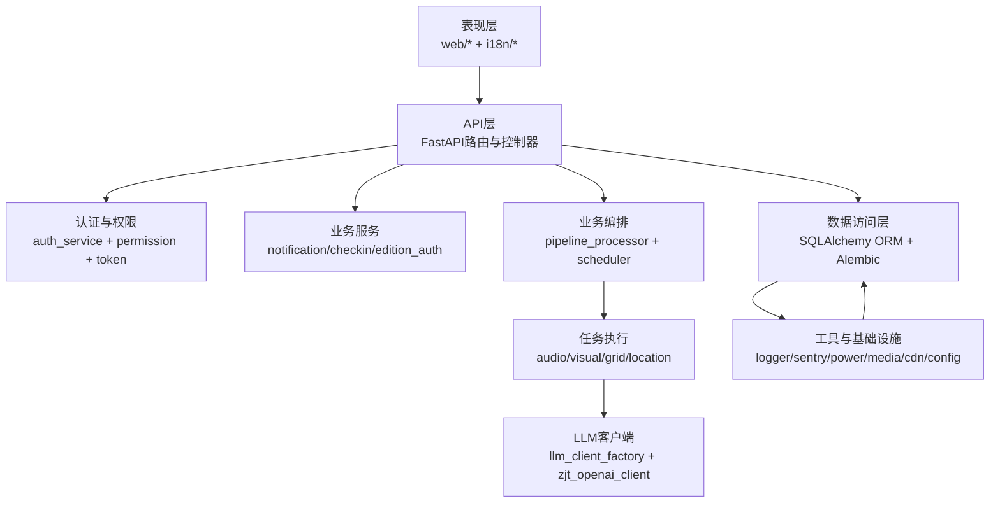
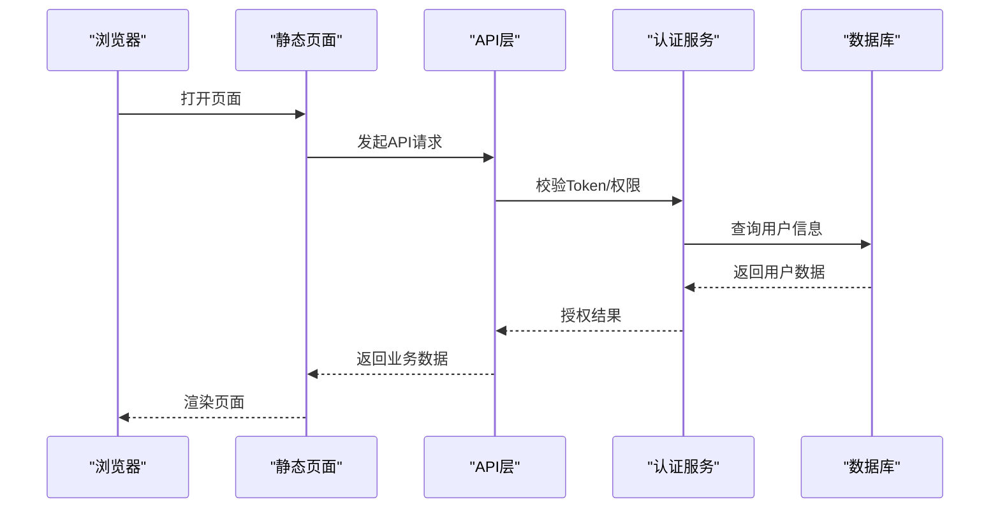
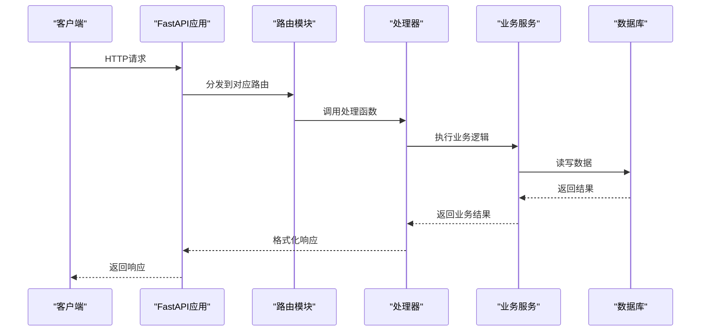
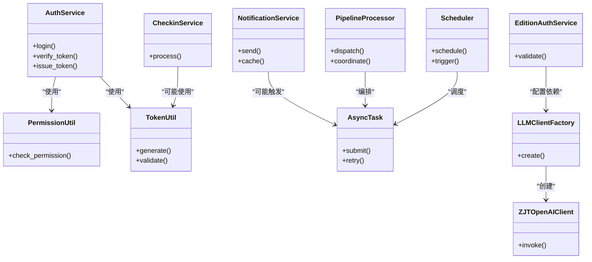
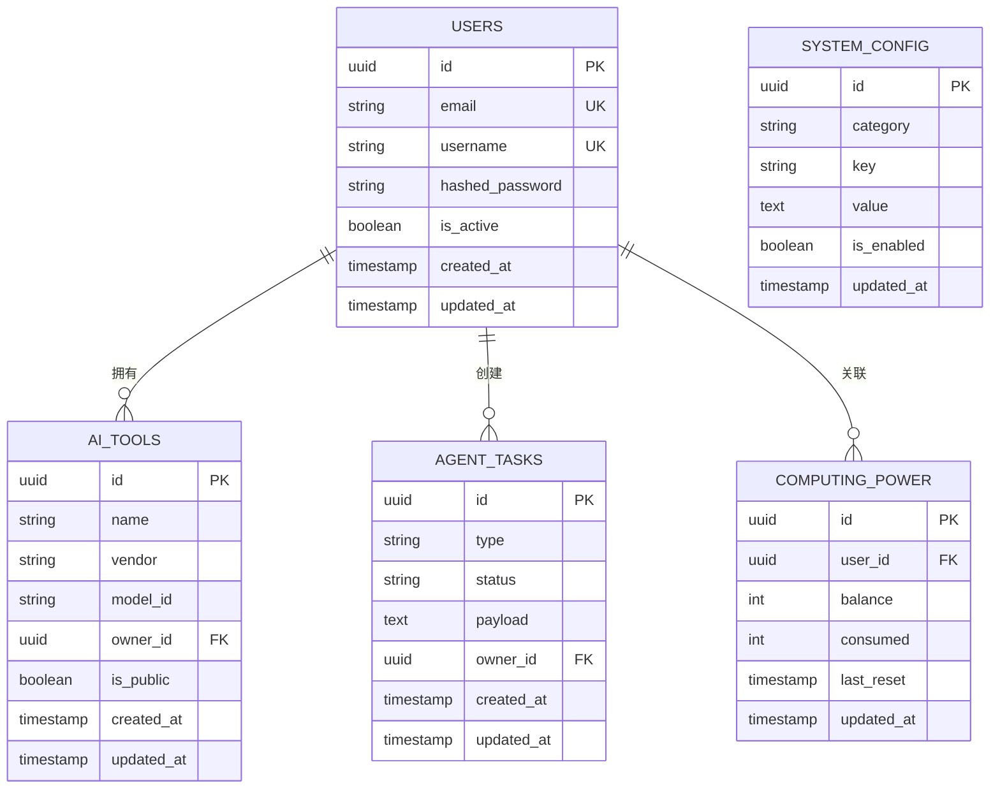
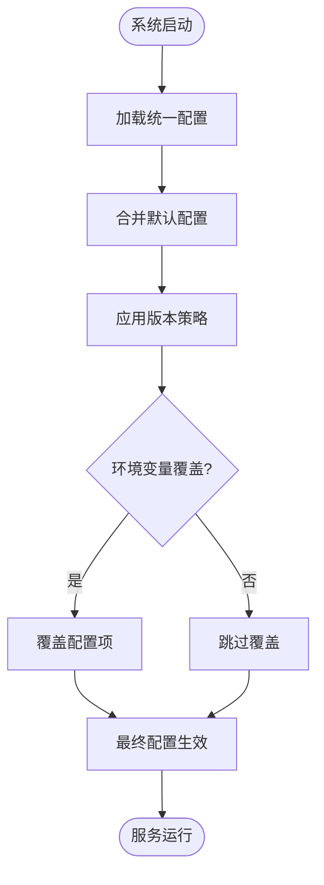
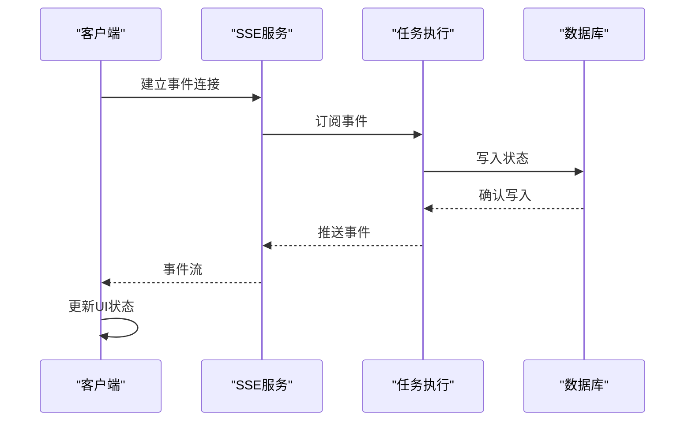
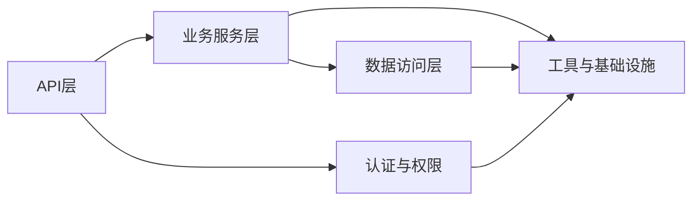

# 系统架构

<cite>
**本文引用的文件**
- [server.py](file://server.py)
- [api/admin.py](file://api/admin.py)
- [api/user.py](file://api/user.py)
- [api/media.py](file://api/media.py)
- [api/system.py](file://api/system.py)
- [api/notifications.py](file://api/notifications.py)
- [perseids_server/services/auth_service.py](file://perseids_server/services/auth_service.py)
- [perseids_server/utils/token.py](file://perseids_server/utils/token.py)
- [perseids_server/utils/permission.py](file://perseids_server/utils/permission.py)
- [model/database.py](file://model/database.py)
- [model/model.py](file://model/model.py)
- [model/users.py](file://model/users.py)
- [model/ai_tools.py](file://model/ai_tools.py)
- [model/agent_tasks.py](file://model/agent_tasks.py)
- [model/computing_power.py](file://model/computing_power.py)
- [model/system_config.py](file://model/system_config.py)
- [task/pipeline_processor.py](file://task/pipeline_processor.py)
- [task/scheduler.py](file://task/scheduler.py)
- [task/runninghub_async_task.py](file://task/runninghub_async_task.py)
- [task/audio_task.py](file://task/audio_task.py)
- [task/visual_task.py](file://task/visual_task.py)
- [task/grid_image_task.py](file://task/grid_image_task.py)
- [task/location_multi_angle_task.py](file://task/location_multi_angle_task.py)
- [services/notification_service.py](file://services/notification_service.py)
- [services/checkin_service.py](file://services/checkin_service.py)
- [services/edition_auth_service.py](file://services/edition_auth_service.py)
- [utils/computing_power.py](file://utils/computing_power.py)
- [utils/media_cache.py](file://utils/media_cache.py)
- [utils/cdn_util.py](file://utils/cdn_util.py)
- [utils/logger_config.py](file://utils/logger_config.py)
- [utils/sentry_util.py](file://utils/sentry_util.py)
- [config/unified_config.py](file://config/unified_config.py)
- [config/default_configs.py](file://config/default_configs.py)
- [config/strategy/edition_strategy.py](file://config/strategy/edition_strategy.py)
- [llm/llm_client_factory.py](file://llm/llm_client_factory.py)
- [llm/base_llm_client.py](file://llm/base_llm_client.py)
- [llm/zjt_openai_client.py](file://llm/zjt_openai_client.py)
- [script_writer_core/agents/base_agent.py](file://script_writer_core/agents/base_agent.py)
- [script_writer_core/agents/expert_agent.py](file://script_writer_core/agents/expert_agent.py)
- [script_writer_core/agents/marketing_pm_agent.py](file://script_writer_core/agents/marketing_pm_agent.py)
- [script_writer_core/chat_session.py](file://script_writer_core/chat_session.py)
- [script_writer_core/skill_loader.py](file://script_writer_core/skill_loader.py)
- [agents/skill_loader.py](file://agents/skill_loader.py)
- [alembic/env.py](file://alembic/env.py)
- [alembic/script.py.mako](file://alembic/script.py.mako)
- [requirements.txt](file://requirements.txt)
- [pyproject.toml](file://pyproject.toml)
- [docker/docker-compose.yml](file://docker/docker-compose.yml)
- [docker/Dockerfile](file://docker/Dockerfile)
- [scripts/running/run_dev.py](file://scripts/running/run_dev.py)
- [scripts/running/run_prod.py](file://scripts/running/run_prod.py)
- [scripts/testing/run_tests.sh](file://scripts/testing/run_tests.sh)
- [auto_test/e2e/conftest.py](file://auto_test/e2e/conftest.py)
- [auto_test/e2e/test_auth.py](file://auto_test/e2e/test_auth.py)
- [auto_test/e2e/test_admin.py](file://auto_test/e2e/test_admin.py)
- [auto_test/e2e/test_marketing_agent.py](file://auto_test/e2e/test_marketing_agent.py)
- [auto_test/e2e/test_workflow.py](file://auto_test/e2e/test_workflow.py)
- [auto_test/context_manager.py](file://auto_test/context_manager.py)
- [auto_test/setup_test_env.py](file://auto_test/setup_test_env.py)
- [web/js/api.js](file://web/js/api.js)
- [web/index.html](file://web/index.html)
- [web/marketing_agent.html](file://web/marketing_agent.html)
- [web/video_workflow.html](file://web/video_workflow.html)
- [web/admin.html](file://web/admin.html)
- [web/css/admin.css](file://web/css/admin.css)
- [web/i18n/i18n-core.js](file://web/i18n/i18n-core.js)
- [web/i18n/i18n-switcher.js](file://web/i18n/i18n-switcher.js)
- [web/i18n/locales/zh-CN/admin.json](file://web/i18n/locales/zh-CN/admin.json)
- [web/i18n/locales/en/admin.json](file://web/i18n/locales/en/admin.json)
</cite>

## 目录
1. [引言](#引言)
2. [项目结构](#项目结构)
3. [核心组件](#核心组件)
4. [架构总览](#架构总览)
5. [详细组件分析](#详细组件分析)
6. [依赖分析](#依赖分析)
7. [性能考量](#性能考量)
8. [故障排查指南](#故障排查指南)
9. [结论](#结论)
10. [附录](#附录)

## 引言
本架构文档面向架构师与高级开发者，系统化阐述ZhiJuTong平台的分层架构设计与关键技术决策。平台采用FastAPI作为Web框架，结合SSE（Server-Sent Events）实现实时状态推送；通过配置驱动实现系统参数化与可扩展性；数据库采用SQLAlchemy ORM进行对象建模与迁移管理；任务调度与异步执行贯穿业务流程；前端以静态页面+API交互为主，配合国际化与权限体系。本文将从表现层、API层、业务逻辑层、数据访问层四个维度，解析职责划分、交互关系与集成模式，并对安全、监控等横切关注点进行说明。

## 项目结构
项目采用按功能域与层次相结合的组织方式：
- 表现层：web目录提供静态页面与前端资源，i18n支持多语言切换。
- API层：api目录封装各模块接口，统一路由注册与异常处理。
- 业务逻辑层：perseids_server、services、task、script_writer_core等模块承载核心业务编排与领域服务。
- 数据访问层：model目录定义ORM模型与数据库连接，alembic负责版本化迁移。
- 工具与基础设施：utils提供通用能力（日志、CDN、缓存、计算力工具），config提供配置系统，docker与scripts提供部署与运维脚本。

```mermaid
graph TB
subgraph "表现层"
WEB["web/* 静态页面与前端资源"]
I18N["web/i18n/* 国际化资源"]
end
subgraph "API层"
API_ADMIN["api/admin.py 管理端接口"]
API_USER["api/user.py 用户接口"]
API_MEDIA["api/media.py 媒体接口"]
API_SYS["api/system.py 系统接口"]
API_NOTIF["api/notifications.py 通知接口"]
end
subgraph "业务逻辑层"
AUTH_SVC["perseids_server/services/auth_service.py 认证服务"]
PERM["perseids_server/utils/permission.py 权限工具"]
TOKEN["perseids_server/utils/token.py Token工具"]
SVC_NOTIF["services/notification_service.py 通知服务"]
SVC_CHECKIN["services/checkin_service.py 签到服务"]
SVC_EDITION["services/edition_auth_service.py 版本鉴权服务"]
PIPELINE["task/pipeline_processor.py 流水线处理器"]
SCHED["task/scheduler.py 调度器"]
ASYNC_TASK["task/runninghub_async_task.py 异步任务"]
AUDIO_T["task/audio_task.py 音频任务"]
VISUAL_T["task/visual_task.py 视觉任务"]
GRID_T["task/grid_image_task.py 图像网格任务"]
LOC_MULTI["task/location_multi_angle_task.py 多角度定位任务"]
LLM_FACTORY["llm/llm_client_factory.py LLM工厂"]
LLM_BASE["llm/base_llm_client.py LLM基类"]
ZJT_CLIENT["llm/zjt_openai_client.py ZhiJuTong客户端"]
SW_CORE["script_writer_core/* 脚本写作者核心"]
end
subgraph "数据访问层"
DB_CONN["model/database.py 数据库连接"]
MODELS["model/*.py ORM模型"]
ALEMBIC["alembic/* 迁移管理"]
end
subgraph "工具与基础设施"
UTIL_LOG["utils/logger_config.py 日志配置"]
UTIL_SENTRY["utils/sentry_util.py 错误上报"]
UTIL_POWER["utils/computing_power.py 计算力工具"]
UTIL_MEDIA_CACHE["utils/media_cache.py 媒体缓存"]
UTIL_CDN["utils/cdn_util.py CDN工具"]
CFG_UNIFIED["config/unified_config.py 统一配置"]
CFG_DEFAULT["config/default_configs.py 默认配置"]
DOCKER["docker/* 容器化"]
SCRIPTS["scripts/* 运维脚本"]
end
WEB --> API_ADMIN
WEB --> API_USER
WEB --> API_MEDIA
WEB --> API_SYS
WEB --> API_NOTIF
API_ADMIN --> AUTH_SVC
API_USER --> AUTH_SVC
API_MEDIA --> SVC_NOTIF
API_SYS --> SVC_CHECKIN
API_NOTIF --> SVC_NOTIF
AUTH_SVC --> PERM
AUTH_SVC --> TOKEN
SVC_NOTIF --> UTIL_MEDIA_CACHE
SVC_CHECKIN --> UTIL_POWER
SVC_EDITION --> CFG_UNIFIED
PIPELINE --> AUDIO_T
PIPELINE --> VISUAL_T
PIPELINE --> GRID_T
PIPELINE --> LOC_MULTI
LLM_FACTORY --> LLM_BASE
LLM_FACTORY --> ZJT_CLIENT
MODELS --> DB_CONN
ALEMBIC --> DB_CONN
UTIL_LOG --> DB_CONN
UTIL_SENTRY --> DB_CONN
UTIL_POWER --> MODELS
UTIL_MEDIA_CACHE --> MODELS
UTIL_CDN --> MODELS
CFG_UNIFIED --> CFG_DEFAULT
DOCKER --> SCRIPTS
```

**图示来源**
- [server.py](file://server.py)
- [api/admin.py](file://api/admin.py)
- [api/user.py](file://api/user.py)
- [api/media.py](file://api/media.py)
- [api/system.py](file://api/system.py)
- [api/notifications.py](file://api/notifications.py)
- [perseids_server/services/auth_service.py](file://perseids_server/services/auth_service.py)
- [perseids_server/utils/permission.py](file://perseids_server/utils/permission.py)
- [perseids_server/utils/token.py](file://perseids_server/utils/token.py)
- [services/notification_service.py](file://services/notification_service.py)
- [services/checkin_service.py](file://services/checkin_service.py)
- [services/edition_auth_service.py](file://services/edition_auth_service.py)
- [task/pipeline_processor.py](file://task/pipeline_processor.py)
- [task/scheduler.py](file://task/scheduler.py)
- [task/runninghub_async_task.py](file://task/runninghub_async_task.py)
- [task/audio_task.py](file://task/audio_task.py)
- [task/visual_task.py](file://task/visual_task.py)
- [task/grid_image_task.py](file://task/grid_image_task.py)
- [task/location_multi_angle_task.py](file://task/location_multi_angle_task.py)
- [llm/llm_client_factory.py](file://llm/llm_client_factory.py)
- [llm/base_llm_client.py](file://llm/base_llm_client.py)
- [llm/zjt_openai_client.py](file://llm/zjt_openai_client.py)
- [model/database.py](file://model/database.py)
- [model/model.py](file://model/model.py)
- [alembic/env.py](file://alembic/env.py)
- [alembic/script.py.mako](file://alembic/script.py.mako)
- [utils/logger_config.py](file://utils/logger_config.py)
- [utils/sentry_util.py](file://utils/sentry_util.py)
- [utils/computing_power.py](file://utils/computing_power.py)
- [utils/media_cache.py](file://utils/media_cache.py)
- [utils/cdn_util.py](file://utils/cdn_util.py)
- [config/unified_config.py](file://config/unified_config.py)
- [config/default_configs.py](file://config/default_configs.py)
- [docker/docker-compose.yml](file://docker/docker-compose.yml)
- [docker/Dockerfile](file://docker/Dockerfile)
- [scripts/running/run_dev.py](file://scripts/running/run_dev.py)
- [scripts/running/run_prod.py](file://scripts/running/run_prod.py)

**章节来源**
- [server.py](file://server.py)
- [api/admin.py](file://api/admin.py)
- [api/user.py](file://api/user.py)
- [api/media.py](file://api/media.py)
- [api/system.py](file://api/system.py)
- [api/notifications.py](file://api/notifications.py)
- [perseids_server/services/auth_service.py](file://perseids_server/services/auth_service.py)
- [perseids_server/utils/permission.py](file://perseids_server/utils/permission.py)
- [perseids_server/utils/token.py](file://perseids_server/utils/token.py)
- [services/notification_service.py](file://services/notification_service.py)
- [services/checkin_service.py](file://services/checkin_service.py)
- [services/edition_auth_service.py](file://services/edition_auth_service.py)
- [task/pipeline_processor.py](file://task/pipeline_processor.py)
- [task/scheduler.py](file://task/scheduler.py)
- [task/runninghub_async_task.py](file://task/runninghub_async_task.py)
- [task/audio_task.py](file://task/audio_task.py)
- [task/visual_task.py](file://task/visual_task.py)
- [task/grid_image_task.py](file://task/grid_image_task.py)
- [task/location_multi_angle_task.py](file://task/location_multi_angle_task.py)
- [llm/llm_client_factory.py](file://llm/llm_client_factory.py)
- [llm/base_llm_client.py](file://llm/base_llm_client.py)
- [llm/zjt_openai_client.py](file://llm/zjt_openai_client.py)
- [model/database.py](file://model/database.py)
- [model/model.py](file://model/model.py)
- [alembic/env.py](file://alembic/env.py)
- [alembic/script.py.mako](file://alembic/script.py.mako)
- [utils/logger_config.py](file://utils/logger_config.py)
- [utils/sentry_util.py](file://utils/sentry_util.py)
- [utils/computing_power.py](file://utils/computing_power.py)
- [utils/media_cache.py](file://utils/media_cache.py)
- [utils/cdn_util.py](file://utils/cdn_util.py)
- [config/unified_config.py](file://config/unified_config.py)
- [config/default_configs.py](file://config/default_configs.py)
- [docker/docker-compose.yml](file://docker/docker-compose.yml)
- [docker/Dockerfile](file://docker/Dockerfile)
- [scripts/running/run_dev.py](file://scripts/running/run_dev.py)
- [scripts/running/run_prod.py](file://scripts/running/run_prod.py)

## 核心组件
- FastAPI应用入口与路由注册：通过主入口文件集中注册各模块路由，提供统一的中间件与异常处理。
- API模块：admin、user、media、system、notifications等子模块分别承载管理端、用户侧、媒体、系统与通知相关接口。
- 认证与权限：认证服务负责登录态校验与Token签发，权限工具提供基于角色/功能码的细粒度授权。
- 业务服务：通知服务、签到服务、版本鉴权服务等，封装跨领域的业务规则。
- 任务与流水线：流水线处理器协调音频、视觉、网格图像、多角度定位等任务；调度器与异步任务模块支撑后台并发与重试。
- LLM客户端：LLM工厂根据配置选择不同供应商客户端，统一抽象推理接口。
- ORM与迁移：SQLAlchemy模型与Alembic迁移确保数据结构演进可控。
- 配置系统：统一配置中心与默认配置，支持运行时参数化与环境差异化。
- 工具与基础设施：日志、错误上报、计算力与媒体缓存、CDN工具等横切能力。

**章节来源**
- [server.py](file://server.py)
- [api/admin.py](file://api/admin.py)
- [api/user.py](file://api/user.py)
- [api/media.py](file://api/media.py)
- [api/system.py](file://api/system.py)
- [api/notifications.py](file://api/notifications.py)
- [perseids_server/services/auth_service.py](file://perseids_server/services/auth_service.py)
- [perseids_server/utils/permission.py](file://perseids_server/utils/permission.py)
- [perseids_server/utils/token.py](file://perseids_server/utils/token.py)
- [services/notification_service.py](file://services/notification_service.py)
- [services/checkin_service.py](file://services/checkin_service.py)
- [services/edition_auth_service.py](file://services/edition_auth_service.py)
- [task/pipeline_processor.py](file://task/pipeline_processor.py)
- [task/scheduler.py](file://task/scheduler.py)
- [task/runninghub_async_task.py](file://task/runninghub_async_task.py)
- [task/audio_task.py](file://task/audio_task.py)
- [task/visual_task.py](file://task/visual_task.py)
- [task/grid_image_task.py](file://task/grid_image_task.py)
- [task/location_multi_angle_task.py](file://task/location_multi_angle_task.py)
- [llm/llm_client_factory.py](file://llm/llm_client_factory.py)
- [llm/base_llm_client.py](file://llm/base_llm_client.py)
- [llm/zjt_openai_client.py](file://llm/zjt_openai_client.py)
- [model/database.py](file://model/database.py)
- [model/model.py](file://model/model.py)
- [alembic/env.py](file://alembic/env.py)
- [alembic/script.py.mako](file://alembic/script.py.mako)
- [utils/logger_config.py](file://utils/logger_config.py)
- [utils/sentry_util.py](file://utils/sentry_util.py)
- [utils/computing_power.py](file://utils/computing_power.py)
- [utils/media_cache.py](file://utils/media_cache.py)
- [utils/cdn_util.py](file://utils/cdn_util.py)
- [config/unified_config.py](file://config/unified_config.py)
- [config/default_configs.py](file://config/default_configs.py)

## 架构总览
系统采用分层架构，自上而下为表现层、API层、业务逻辑层与数据访问层。API层通过FastAPI统一暴露REST接口，内部通过认证与权限模块进行安全控制；业务逻辑层封装复杂流程与领域服务；数据访问层以ORM与迁移工具保障数据一致性与可演进性。SSE用于向客户端推送任务状态与通知事件；配置驱动贯穿系统，便于在不修改代码的情况下调整行为。

**图示来源**
- [server.py](file://server.py)
- [api/admin.py](file://api/admin.py)
- [api/user.py](file://api/user.py)
- [api/media.py](file://api/media.py)
- [api/system.py](file://api/system.py)
- [api/notifications.py](file://api/notifications.py)
- [perseids_server/services/auth_service.py](file://perseids_server/services/auth_service.py)
- [perseids_server/utils/permission.py](file://perseids_server/utils/permission.py)
- [perseids_server/utils/token.py](file://perseids_server/utils/token.py)
- [services/notification_service.py](file://services/notification_service.py)
- [services/checkin_service.py](file://services/checkin_service.py)
- [services/edition_auth_service.py](file://services/edition_auth_service.py)
- [task/pipeline_processor.py](file://task/pipeline_processor.py)
- [task/scheduler.py](file://task/scheduler.py)
- [task/runninghub_async_task.py](file://task/runninghub_async_task.py)
- [task/audio_task.py](file://task/audio_task.py)
- [task/visual_task.py](file://task/visual_task.py)
- [task/grid_image_task.py](file://task/grid_image_task.py)
- [task/location_multi_angle_task.py](file://task/location_multi_angle_task.py)
- [llm/llm_client_factory.py](file://llm/llm_client_factory.py)
- [llm/zjt_openai_client.py](file://llm/zjt_openai_client.py)
- [model/database.py](file://model/database.py)
- [alembic/env.py](file://alembic/env.py)
- [alembic/script.py.mako](file://alembic/script.py.mako)
- [utils/logger_config.py](file://utils/logger_config.py)
- [utils/sentry_util.py](file://utils/sentry_util.py)
- [utils/computing_power.py](file://utils/computing_power.py)
- [utils/media_cache.py](file://utils/media_cache.py)
- [utils/cdn_util.py](file://utils/cdn_util.py)
- [config/unified_config.py](file://config/unified_config.py)
- [config/default_configs.py](file://config/default_configs.py)

## 详细组件分析

### 表现层（Web）
- 静态页面：index、marketing_agent、video_workflow、admin等页面提供用户交互界面。
- 国际化：i18n-core.js与i18n-switcher.js实现语言切换与资源加载。
- 前端API：api.js封装HTTP请求，统一处理响应与错误。

**图示来源**
- [web/index.html](file://web/index.html)
- [web/marketing_agent.html](file://web/marketing_agent.html)
- [web/video_workflow.html](file://web/video_workflow.html)
- [web/admin.html](file://web/admin.html)
- [web/i18n/i18n-core.js](file://web/i18n/i18n-core.js)
- [web/i18n/i18n-switcher.js](file://web/i18n/i18n-switcher.js)
- [web/js/api.js](file://web/js/api.js)
- [perseids_server/services/auth_service.py](file://perseids_server/services/auth_service.py)
- [model/users.py](file://model/users.py)

**章节来源**
- [web/index.html](file://web/index.html)
- [web/marketing_agent.html](file://web/marketing_agent.html)
- [web/video_workflow.html](file://web/video_workflow.html)
- [web/admin.html](file://web/admin.html)
- [web/i18n/i18n-core.js](file://web/i18n/i18n-core.js)
- [web/i18n/i18n-switcher.js](file://web/i18n/i18n-switcher.js)
- [web/js/api.js](file://web/js/api.js)

### API层（FastAPI）
- 路由注册：主入口集中注册admin、user、media、system、notifications等模块路由。
- 中间件与异常：统一处理CORS、日志、异常转换与响应格式。
- SSE支持：通过FastAPI事件源或独立SSE端点推送任务状态与通知事件。

**图示来源**
- [server.py](file://server.py)
- [api/admin.py](file://api/admin.py)
- [api/user.py](file://api/user.py)
- [api/media.py](file://api/media.py)
- [api/system.py](file://api/system.py)
- [api/notifications.py](file://api/notifications.py)

**章节来源**
- [server.py](file://server.py)
- [api/admin.py](file://api/admin.py)
- [api/user.py](file://api/user.py)
- [api/media.py](file://api/media.py)
- [api/system.py](file://api/system.py)
- [api/notifications.py](file://api/notifications.py)

### 业务逻辑层
- 认证与权限：auth_service负责登录态与Token签发；permission提供权限判定；token工具生成与验证。
- 通知服务：聚合消息推送、状态变更通知等。
- 签到服务：处理签到逻辑与奖励发放。
- 版本鉴权服务：依据版本策略进行功能开关与访问控制。
- 任务编排：pipeline_processor协调多种任务类型；scheduler与runninghub_async_task支持并发与重试。
- LLM客户端：llm_client_factory按配置选择具体供应商客户端，zjt_openai_client适配特定协议。

**图示来源**
- [perseids_server/services/auth_service.py](file://perseids_server/services/auth_service.py)
- [perseids_server/utils/permission.py](file://perseids_server/utils/permission.py)
- [perseids_server/utils/token.py](file://perseids_server/utils/token.py)
- [services/notification_service.py](file://services/notification_service.py)
- [services/checkin_service.py](file://services/checkin_service.py)
- [services/edition_auth_service.py](file://services/edition_auth_service.py)
- [task/pipeline_processor.py](file://task/pipeline_processor.py)
- [task/scheduler.py](file://task/scheduler.py)
- [task/runninghub_async_task.py](file://task/runninghub_async_task.py)
- [llm/llm_client_factory.py](file://llm/llm_client_factory.py)
- [llm/zjt_openai_client.py](file://llm/zjt_openai_client.py)

**章节来源**
- [perseids_server/services/auth_service.py](file://perseids_server/services/auth_service.py)
- [perseids_server/utils/permission.py](file://perseids_server/utils/permission.py)
- [perseids_server/utils/token.py](file://perseids_server/utils/token.py)
- [services/notification_service.py](file://services/notification_service.py)
- [services/checkin_service.py](file://services/checkin_service.py)
- [services/edition_auth_service.py](file://services/edition_auth_service.py)
- [task/pipeline_processor.py](file://task/pipeline_processor.py)
- [task/scheduler.py](file://task/scheduler.py)
- [task/runninghub_async_task.py](file://task/runninghub_async_task.py)
- [llm/llm_client_factory.py](file://llm/llm_client_factory.py)
- [llm/zjt_openai_client.py](file://llm/zjt_openai_client.py)

### 数据访问层（ORM与迁移）
- 数据库连接：database.py统一管理引擎与会话。
- 模型定义：users、ai_tools、agent_tasks、computing_power、system_config等模型映射表结构。
- 迁移管理：alembic/env.py与script.py.mako驱动版本化迁移，保证Schema演进可控。

**图示来源**
- [model/database.py](file://model/database.py)
- [model/model.py](file://model/model.py)
- [model/users.py](file://model/users.py)
- [model/ai_tools.py](file://model/ai_tools.py)
- [model/agent_tasks.py](file://model/agent_tasks.py)
- [model/computing_power.py](file://model/computing_power.py)
- [model/system_config.py](file://model/system_config.py)
- [alembic/env.py](file://alembic/env.py)
- [alembic/script.py.mako](file://alembic/script.py.mako)

**章节来源**
- [model/database.py](file://model/database.py)
- [model/model.py](file://model/model.py)
- [model/users.py](file://model/users.py)
- [model/ai_tools.py](file://model/ai_tools.py)
- [model/agent_tasks.py](file://model/agent_tasks.py)
- [model/computing_power.py](file://model/computing_power.py)
- [model/system_config.py](file://model/system_config.py)
- [alembic/env.py](file://alembic/env.py)
- [alembic/script.py.mako](file://alembic/script.py.mako)

### 配置驱动开发模式
- 统一配置：unified_config提供集中式配置读取与合并策略。
- 默认配置：default_configs提供默认值与环境差异覆盖。
- 版本策略：edition_strategy按版本维度控制功能开关与行为差异。
- 运行时参数化：通过配置系统在不重启服务的情况下调整行为。

**图示来源**
- [config/unified_config.py](file://config/unified_config.py)
- [config/default_configs.py](file://config/default_configs.py)
- [config/strategy/edition_strategy.py](file://config/strategy/edition_strategy.py)

**章节来源**
- [config/unified_config.py](file://config/unified_config.py)
- [config/default_configs.py](file://config/default_configs.py)
- [config/strategy/edition_strategy.py](file://config/strategy/edition_strategy.py)

### 实时通信（SSE）
- 事件推送：通过SSE向客户端推送任务状态更新、通知事件等。
- 事件源：可由API层或专门的SSE服务提供事件流。
- 客户端消费：前端监听事件流并更新UI状态。

**图示来源**
- [api/notifications.py](file://api/notifications.py)
- [services/notification_service.py](file://services/notification_service.py)
- [task/runninghub_async_task.py](file://task/runninghub_async_task.py)
- [model/agent_tasks.py](file://model/agent_tasks.py)

**章节来源**
- [api/notifications.py](file://api/notifications.py)
- [services/notification_service.py](file://services/notification_service.py)
- [task/runninghub_async_task.py](file://task/runninghub_async_task.py)
- [model/agent_tasks.py](file://model/agent_tasks.py)

## 依赖分析
- 层内高内聚：各层内部职责清晰，模块间通过明确接口交互。
- 层间低耦合：API层仅依赖业务服务与工具，业务层依赖数据访问与工具，避免反向依赖。
- 外部依赖：FastAPI、SQLAlchemy、Alembic、LLM供应商SDK等。
- 循环依赖规避：通过服务接口与工厂模式降低耦合风险。

**图示来源**
- [server.py](file://server.py)
- [api/admin.py](file://api/admin.py)
- [api/user.py](file://api/user.py)
- [api/media.py](file://api/media.py)
- [api/system.py](file://api/system.py)
- [api/notifications.py](file://api/notifications.py)
- [perseids_server/services/auth_service.py](file://perseids_server/services/auth_service.py)
- [services/notification_service.py](file://services/notification_service.py)
- [model/database.py](file://model/database.py)
- [utils/logger_config.py](file://utils/logger_config.py)

**章节来源**
- [server.py](file://server.py)
- [api/admin.py](file://api/admin.py)
- [api/user.py](file://api/user.py)
- [api/media.py](file://api/media.py)
- [api/system.py](file://api/system.py)
- [api/notifications.py](file://api/notifications.py)
- [perseids_server/services/auth_service.py](file://perseids_server/services/auth_service.py)
- [services/notification_service.py](file://services/notification_service.py)
- [model/database.py](file://model/database.py)
- [utils/logger_config.py](file://utils/logger_config.py)

## 性能考量
- 并发与限流：通过调度器与异步任务模块控制并发度，结合计算力工具限制用户额度。
- 缓存策略：媒体缓存与统计缓存减少重复IO与计算。
- 数据库优化：索引与查询优化，迁移工具保证Schema演进可控。
- 日志与监控：日志配置与Sentry集成，快速定位性能瓶颈与异常。
- 配置驱动：通过配置系统动态调优，避免频繁代码变更。

**章节来源**
- [task/scheduler.py](file://task/scheduler.py)
- [task/runninghub_async_task.py](file://task/runninghub_async_task.py)
- [utils/computing_power.py](file://utils/computing_power.py)
- [utils/media_cache.py](file://utils/media_cache.py)
- [utils/logger_config.py](file://utils/logger_config.py)
- [utils/sentry_util.py](file://utils/sentry_util.py)
- [config/unified_config.py](file://config/unified_config.py)

## 故障排查指南
- 认证失败：检查Token生成与校验流程，确认权限判定逻辑。
- 数据库异常：核对迁移脚本是否成功执行，检查连接池与事务隔离级别。
- 任务超时或失败：查看异步任务重试策略与队列状态，结合日志定位问题。
- LLM调用异常：确认供应商SDK配置与网络连通性，检查限流与配额。
- 前端无响应：检查SSE连接与事件推送，确认API返回格式与错误处理。

**章节来源**
- [perseids_server/services/auth_service.py](file://perseids_server/services/auth_service.py)
- [perseids_server/utils/token.py](file://perseids_server/utils/token.py)
- [perseids_server/utils/permission.py](file://perseids_server/utils/permission.py)
- [alembic/env.py](file://alembic/env.py)
- [task/runninghub_async_task.py](file://task/runninghub_async_task.py)
- [utils/logger_config.py](file://utils/logger_config.py)
- [utils/sentry_util.py](file://utils/sentry_util.py)
- [llm/zjt_openai_client.py](file://llm/zjt_openai_client.py)
- [web/js/api.js](file://web/js/api.js)

## 结论
ZhiJuTong平台通过分层架构与配置驱动实现了高内聚、低耦合的系统设计。FastAPI提供了高性能的接口层，SSE增强了用户体验，ORM与迁移工具保障了数据一致性与可演进性。业务服务与工具模块的清晰划分使得系统具备良好的可维护性与扩展性。建议持续完善监控与告警体系，强化安全审计与合规控制，以支撑更大规模的业务增长。

## 附录
- 部署与运维：Docker容器化与Compose编排，提供开发与生产环境的一致性。
- 测试体系：单元测试、集成测试与E2E测试覆盖关键路径，自动化脚本保障质量。
- 开发指南：日志规范、错误上报、配置管理与版本策略的最佳实践。

**章节来源**
- [docker/docker-compose.yml](file://docker/docker-compose.yml)
- [docker/Dockerfile](file://docker/Dockerfile)
- [scripts/running/run_dev.py](file://scripts/running/run_dev.py)
- [scripts/running/run_prod.py](file://scripts/running/run_prod.py)
- [scripts/testing/run_tests.sh](file://scripts/testing/run_tests.sh)
- [auto_test/e2e/conftest.py](file://auto_test/e2e/conftest.py)
- [auto_test/e2e/test_auth.py](file://auto_test/e2e/test_auth.py)
- [auto_test/e2e/test_admin.py](file://auto_test/e2e/test_admin.py)
- [auto_test/e2e/test_marketing_agent.py](file://auto_test/e2e/test_marketing_agent.py)
- [auto_test/e2e/test_workflow.py](file://auto_test/e2e/test_workflow.py)
- [auto_test/context_manager.py](file://auto_test/context_manager.py)
- [auto_test/setup_test_env.py](file://auto_test/setup_test_env.py)