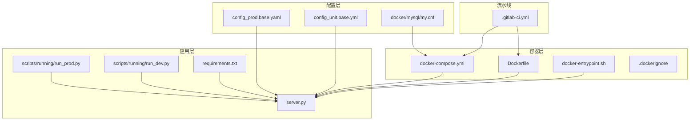
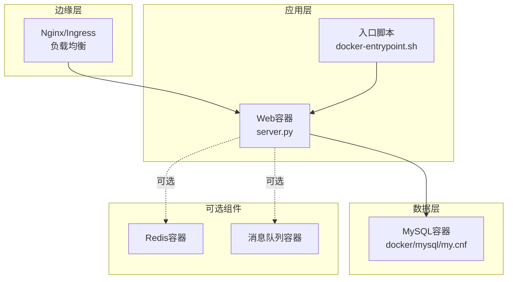
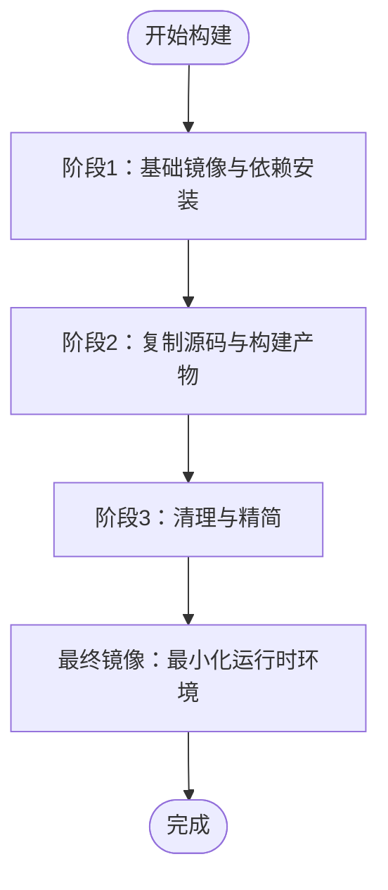
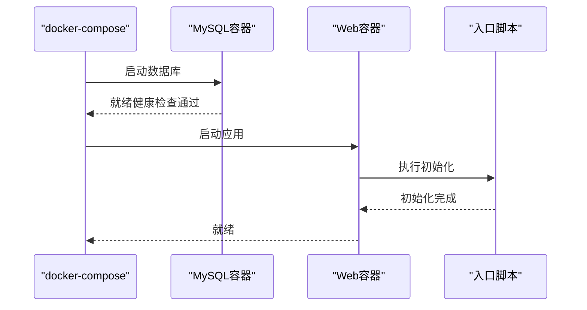
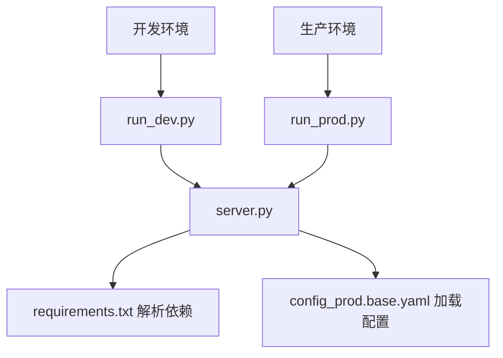
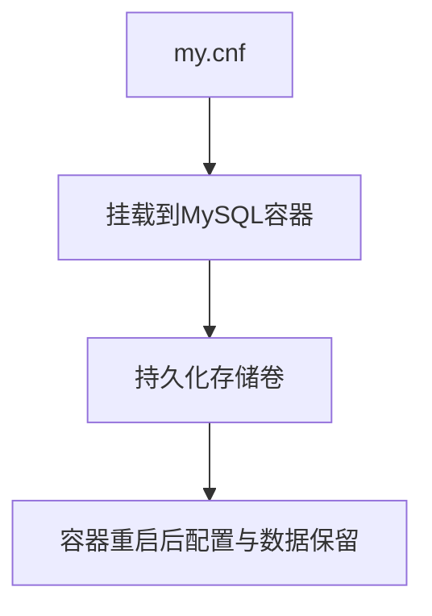
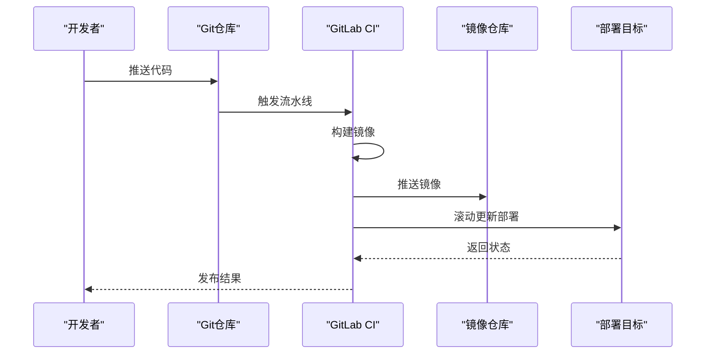
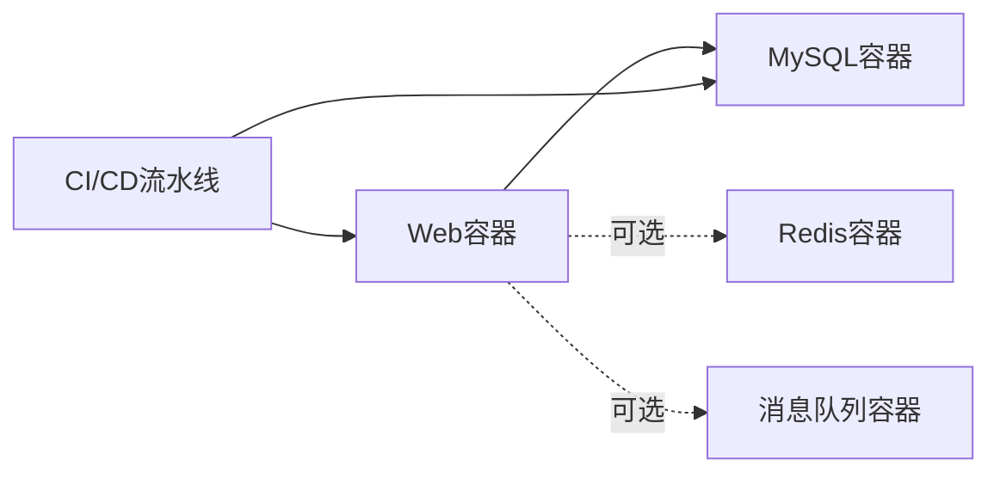

# 部署架构设计

<cite>
**本文引用的文件**
- [Dockerfile](file://docker/Dockerfile)
- [docker-compose.yml](file://docker/docker-compose.yml)
- [docker-compose-test.yml](file://docker/docker-compose-test.yml)
- [.dockerignore](file://docker/.dockerignore)
- [docker-entrypoint.sh](file://docker/docker-entrypoint.sh)
- [run_prod.py](file://scripts/running/run_prod.py)
- [run_dev.py](file://scripts/running/run_dev.py)
- [requirements.txt](file://requirements.txt)
- [.gitlab-ci.yml](file://.gitlab-ci.yml)
- [server.py](file://server.py)
- [config_prod.base.yaml](file://config_prod.base.yaml)
- [config_unit.base.yml](file://config_unit.base.yml)
- [mysql/my.cnf](file://docker/mysql/my.cnf)
</cite>

## 目录
1. [引言](#引言)
2. [项目结构](#项目结构)
3. [核心组件](#核心组件)
4. [架构总览](#架构总览)
5. [详细组件分析](#详细组件分析)
6. [依赖关系分析](#依赖关系分析)
7. [性能考虑](#性能考虑)
8. [故障排查指南](#故障排查指南)
9. [结论](#结论)
10. [附录](#附录)

## 引言
本文件面向DevOps工程师与系统管理员，提供ZhiJuTong平台的部署架构设计与实施指导。内容涵盖容器化部署策略、微服务架构、基础设施配置、Docker镜像构建与多阶段优化、负载均衡与服务发现、健康检查、环境差异化配置（开发/测试/生产）、CI/CD流水线与滚动更新、监控告警与日志聚合、故障恢复机制、性能调优与资源限制、以及可扩展性设计。

## 项目结构
ZhiJuTong采用单体后端配合容器编排的部署模式，核心部署相关目录与文件如下：
- docker：容器化与编排配置，包含Dockerfile、docker-compose、入口脚本与MySQL配置
- scripts/running：运行时脚本，区分开发与生产环境启动方式
- requirements.txt：Python依赖清单
- .gitlab-ci.yml：CI/CD流水线定义
- server.py：应用主入口（WSGI/ASGI服务器）
- config_*：环境配置基线
- docker/mysql/my.cnf：数据库配置

图表来源
- [Dockerfile:1-200](file://docker/Dockerfile#L1-L200)
- [docker-compose.yml:1-200](file://docker/docker-compose.yml#L1-L200)
- [docker-entrypoint.sh:1-200](file://docker/docker-entrypoint.sh#L1-L200)
- [run_prod.py:1-200](file://scripts/running/run_prod.py#L1-L200)
- [run_dev.py:1-200](file://scripts/running/run_dev.py#L1-L200)
- [requirements.txt:1-200](file://requirements.txt#L1-L200)
- [config_prod.base.yaml:1-200](file://config_prod.base.yaml#L1-L200)
- [config_unit.base.yml:1-200](file://config_unit.base.yml#L1-L200)
- [mysql/my.cnf:1-200](file://docker/mysql/my.cnf#L1-L200)
- [.gitlab-ci.yml:1-200](file://.gitlab-ci.yml#L1-L200)

章节来源
- [Dockerfile:1-200](file://docker/Dockerfile#L1-L200)
- [docker-compose.yml:1-200](file://docker/docker-compose.yml#L1-L200)
- [docker-entrypoint.sh:1-200](file://docker/docker-entrypoint.sh#L1-L200)
- [run_prod.py:1-200](file://scripts/running/run_prod.py#L1-L200)
- [run_dev.py:1-200](file://scripts/running/run_dev.py#L1-L200)
- [requirements.txt:1-200](file://requirements.txt#L1-L200)
- [config_prod.base.yaml:1-200](file://config_prod.base.yaml#L1-L200)
- [config_unit.base.yml:1-200](file://config_unit.base.yml#L1-L200)
- [mysql/my.cnf:1-200](file://docker/mysql/my.cnf#L1-L200)
- [.gitlab-ci.yml:1-200](file://.gitlab-ci.yml#L1-L200)

## 核心组件
- 应用容器（Web服务）：基于Dockerfile构建，通过docker-compose编排，入口脚本负责初始化与启动
- 数据库容器（MySQL）：通过compose挂载my.cnf进行配置，支持持久化数据卷
- 缓存/消息队列：建议在生产环境中引入Redis/RabbitMQ，当前仓库未包含对应容器定义
- 负载均衡：建议在Compose之上部署Nginx或使用Kubernetes Ingress
- CI/CD：GitLab CI定义了镜像构建与部署作业

章节来源
- [Dockerfile:1-200](file://docker/Dockerfile#L1-L200)
- [docker-compose.yml:1-200](file://docker/docker-compose.yml#L1-L200)
- [.gitlab-ci.yml:1-200](file://.gitlab-ci.yml#L1-L200)

## 架构总览
下图展示ZhiJuTong的容器化部署拓扑：应用容器由docker-compose统一编排，数据库容器独立管理，应用通过入口脚本完成初始化；生产环境建议增加反向代理与外部缓存/消息中间件。

图表来源
- [docker-compose.yml:1-200](file://docker/docker-compose.yml#L1-L200)
- [docker-entrypoint.sh:1-200](file://docker/docker-entrypoint.sh#L1-L200)
- [server.py:1-200](file://server.py#L1-L200)
- [mysql/my.cnf:1-200](file://docker/mysql/my.cnf#L1-L200)

## 详细组件分析

### 容器化与镜像构建
- Dockerfile：定义基础镜像、工作目录、依赖安装、应用复制与启动命令
- 多阶段构建建议：将构建阶段与运行阶段分离，减少最终镜像体积并提升安全性
- .dockerignore：排除不必要的构建上下文，缩短构建时间
- 入口脚本：在容器启动时执行初始化逻辑（如数据库迁移、权限设置等）

图表来源
- [Dockerfile:1-200](file://docker/Dockerfile#L1-L200)
- [.dockerignore:1-200](file://docker/.dockerignore#L1-L200)

章节来源
- [Dockerfile:1-200](file://docker/Dockerfile#L1-L200)
- [.dockerignore:1-200](file://docker/.dockerignore#L1-L200)

### docker-compose编排
- 服务定义：Web服务与MySQL服务，包含环境变量、端口映射、数据卷与网络
- 初始化顺序：可通过depends_on与健康检查确保数据库先于应用启动
- 网络隔离：建议为不同环境创建独立网络，避免端口冲突

图表来源
- [docker-compose.yml:1-200](file://docker/docker-compose.yml#L1-L200)
- [docker-entrypoint.sh:1-200](file://docker/docker-entrypoint.sh#L1-L200)

章节来源
- [docker-compose.yml:1-200](file://docker/docker-compose.yml#L1-L200)
- [docker-entrypoint.sh:1-200](file://docker/docker-entrypoint.sh#L1-L200)

### 运行时脚本与启动流程
- run_prod.py：生产环境启动参数与配置加载
- run_dev.py：开发环境启动参数与调试配置
- requirements.txt：集中管理Python依赖，确保镜像与宿主机一致性

图表来源
- [run_dev.py:1-200](file://scripts/running/run_dev.py#L1-L200)
- [run_prod.py:1-200](file://scripts/running/run_prod.py#L1-L200)
- [requirements.txt:1-200](file://requirements.txt#L1-L200)
- [config_prod.base.yaml:1-200](file://config_prod.base.yaml#L1-L200)

章节来源
- [run_dev.py:1-200](file://scripts/running/run_dev.py#L1-L200)
- [run_prod.py:1-200](file://scripts/running/run_prod.py#L1-L200)
- [requirements.txt:1-200](file://requirements.txt#L1-L200)
- [config_prod.base.yaml:1-200](file://config_prod.base.yaml#L1-L200)

### 数据库配置与持久化
- docker/mysql/my.cnf：MySQL配置文件，用于调整缓冲区、连接数、字符集等
- compose中挂载配置与数据卷，确保重启不丢失数据

图表来源
- [mysql/my.cnf:1-200](file://docker/mysql/my.cnf#L1-L200)
- [docker-compose.yml:1-200](file://docker/docker-compose.yml#L1-L200)

章节来源
- [mysql/my.cnf:1-200](file://docker/mysql/my.cnf#L1-L200)
- [docker-compose.yml:1-200](file://docker/docker-compose.yml#L1-L200)

### CI/CD流水线与自动化部署
- .gitlab-ci.yml：定义镜像构建、测试与部署作业，建议分阶段执行（build/test/deploy）
- 建议在流水线中集成安全扫描、依赖审计与自动化测试

图表来源
- [.gitlab-ci.yml:1-200](file://.gitlab-ci.yml#L1-L200)
- [Dockerfile:1-200](file://docker/Dockerfile#L1-L200)

章节来源
- [.gitlab-ci.yml:1-200](file://.gitlab-ci.yml#L1-L200)

## 依赖关系分析
- 组件耦合：应用容器对数据库容器存在强依赖（通过健康检查与启动顺序控制）
- 外部依赖：建议引入Redis与消息队列以解耦异步任务与缓存
- 环境差异：开发与生产通过不同配置文件与启动脚本隔离

图表来源
- [docker-compose.yml:1-200](file://docker/docker-compose.yml#L1-L200)
- [.gitlab-ci.yml:1-200](file://.gitlab-ci.yml#L1-L200)

章节来源
- [docker-compose.yml:1-200](file://docker/docker-compose.yml#L1-L200)
- [.gitlab-ci.yml:1-200](file://.gitlab-ci.yml#L1-L200)

## 性能考虑
- 镜像优化：多阶段构建、精简基础镜像、缓存pip依赖
- 资源限制：在compose中设置CPU/内存限制与重启策略
- 并发与连接：根据业务峰值调整Gunicorn/Uvicorn进程与线程数，合理配置数据库连接池
- 缓存与队列：引入Redis缓存热点数据，使用消息队列处理异步任务
- 存储I/O：数据库数据卷使用高性能磁盘，开启必要的缓冲与日志优化

## 故障排查指南
- 健康检查失败：检查数据库是否就绪、网络连通性与端口占用
- 启动异常：查看入口脚本日志与应用启动参数，确认配置文件路径与权限
- 依赖缺失：核对requirements.txt与镜像构建过程，确保依赖一致
- CI失败：定位具体作业日志，检查构建超时、测试失败与推送权限

章节来源
- [docker-compose.yml:1-200](file://docker/docker-compose.yml#L1-L200)
- [docker-entrypoint.sh:1-200](file://docker/docker-entrypoint.sh#L1-L200)
- [requirements.txt:1-200](file://requirements.txt#L1-L200)
- [.gitlab-ci.yml:1-200](file://.gitlab-ci.yml#L1-L200)

## 结论
ZhiJuTong当前采用单体容器化部署，具备清晰的镜像构建与编排流程。建议在生产环境中补充反向代理、缓存与消息队列，并完善CI/CD流水线与监控告警体系，以满足高可用与可扩展需求。

## 附录
- 环境差异化配置
  - 开发环境：run_dev.py + config_unit.base.yml
  - 生产环境：run_prod.py + config_prod.base.yaml
- 建议新增组件
  - Nginx/Ingress：负载均衡与TLS终止
  - Redis：会话与缓存
  - RabbitMQ/Redis Streams：异步任务队列
  - Prometheus/Grafana：指标监控
  - ELK/OTel：日志聚合与链路追踪
- 滚动更新策略
  - 在compose中设置replicas与更新配置，结合健康检查与回滚策略