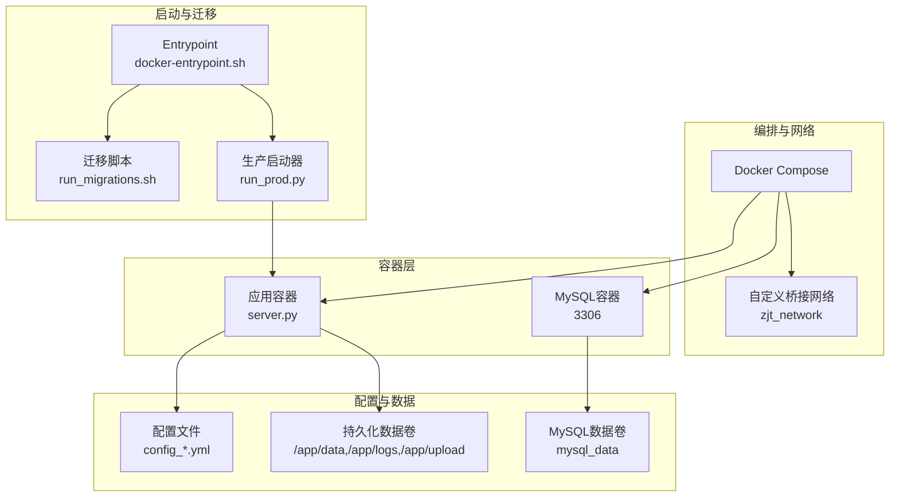
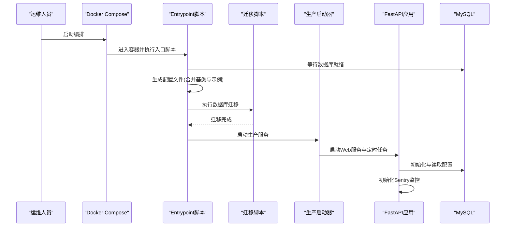
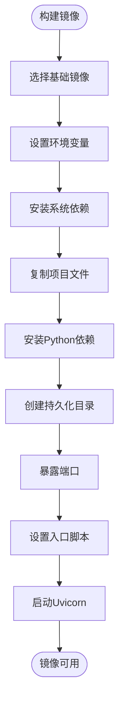
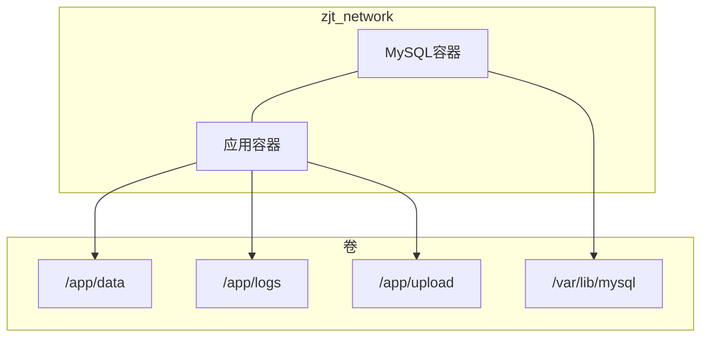
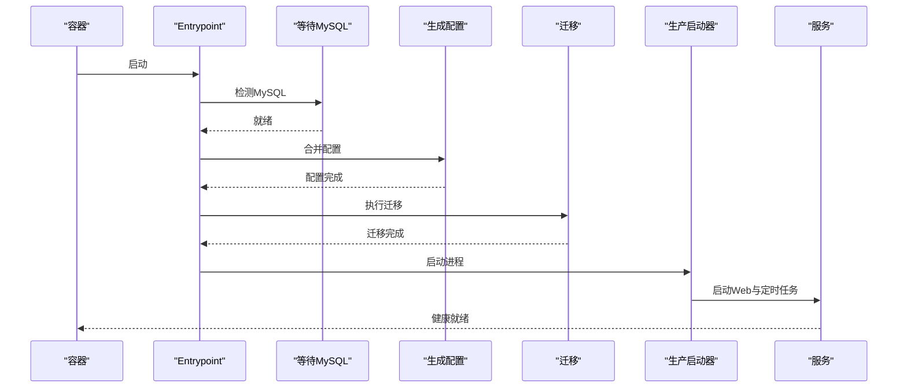
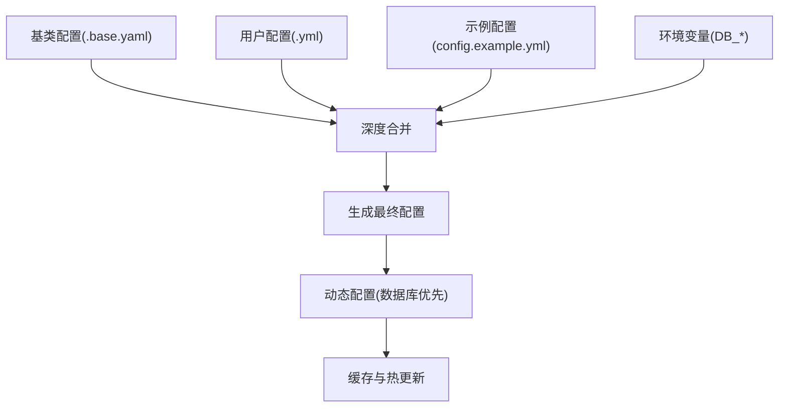
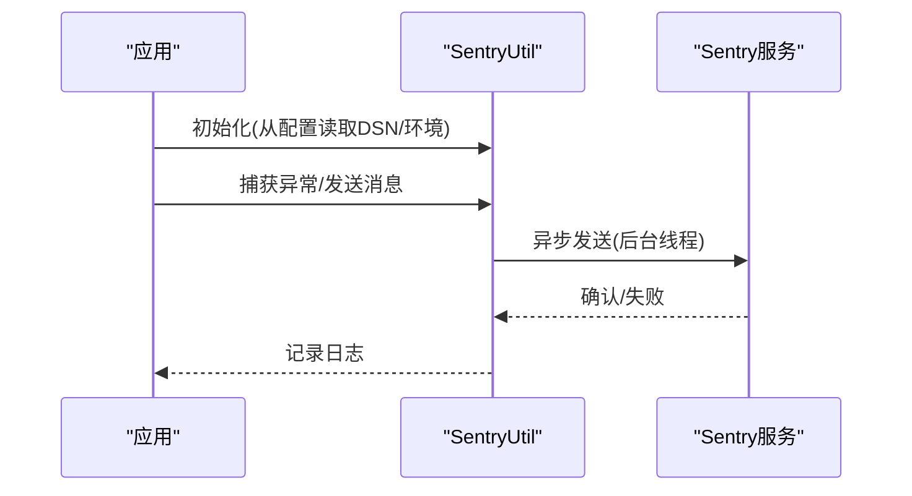
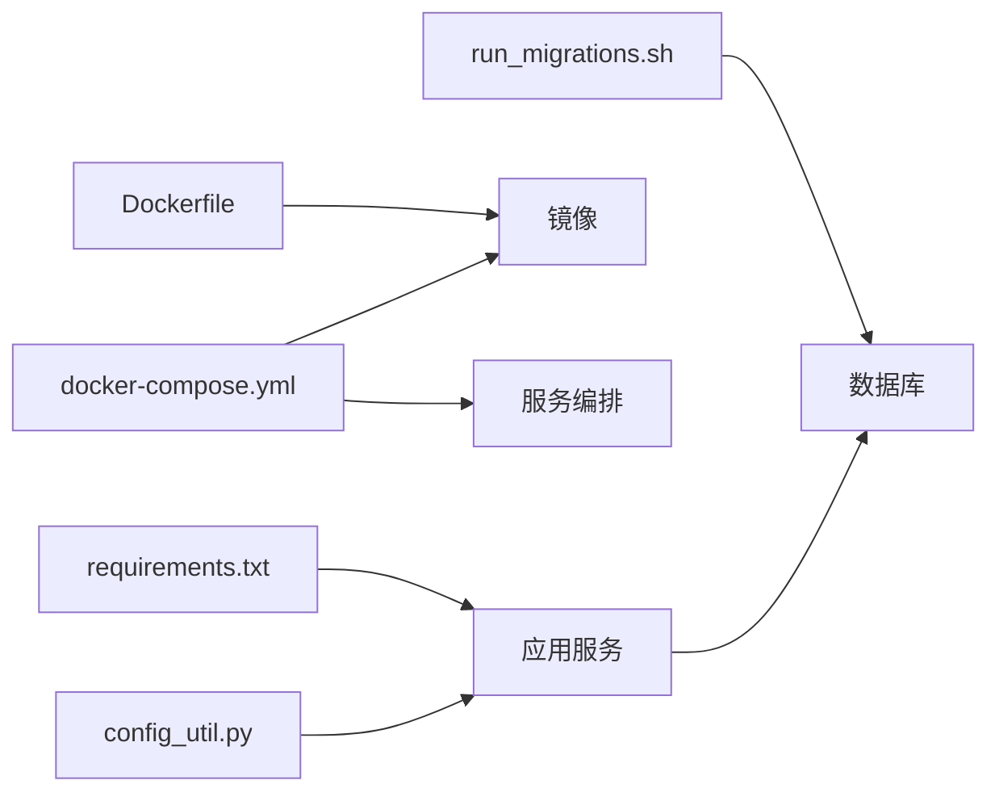

# 部署运维

<cite>
**本文引用的文件**
- [Dockerfile](file://docker/Dockerfile)
- [docker-compose.yml](file://docker/docker-compose.yml)
- [docker-entrypoint.sh](file://docker/docker-entrypoint.sh)
- [server.py](file://server.py)
- [run_prod.py](file://scripts/running/run_prod.py)
- [run_scheduler.py](file://scripts/running/run_scheduler.py)
- [linux_start_prod.sh](file://scripts/running/linux_start_prod.sh)
- [run_migrations.sh](file://scripts/testing/run_migrations.sh)
- [config_util.py](file://config/config_util.py)
- [default_configs.py](file://config/default_configs.py)
- [requirements.txt](file://requirements.txt)
- [sentry_util.py](file://utils/sentry_util.py)
</cite>

## 目录
1. [简介](#简介)
2. [项目结构](#项目结构)
3. [核心组件](#核心组件)
4. [架构总览](#架构总览)
5. [详细组件分析](#详细组件分析)
6. [依赖关系分析](#依赖关系分析)
7. [性能考量](#性能考量)
8. [故障排查指南](#故障排查指南)
9. [结论](#结论)
10. [附录](#附录)

## 简介
本指南面向ZhiJuTong（智剧通）项目的部署与运维，围绕容器化部署、生产配置管理、监控与日志、备份与恢复、高可用与灾备、运维自动化与变更管理、安全加固与合规、性能调优与成本优化等方面进行系统化说明。文档结合仓库中的Dockerfile、Compose、启动脚本、配置系统与监控工具，提供可操作的实施建议与最佳实践。

## 项目结构
ZhiJuTong采用Python FastAPI应用，配合MySQL数据库与Docker容器化部署。核心目录与文件如下：
- 容器化与编排：docker/Dockerfile、docker/docker-compose.yml、docker/docker-entrypoint.sh
- 应用入口与服务：server.py
- 启动与调度：scripts/running/run_prod.py、scripts/running/run_scheduler.py、scripts/running/linux_start_prod.sh
- 配置系统：config/config_util.py、config/default_configs.py、config.example.yml、config_prod.base.yaml、config_prod.yml
- 迁移与测试：scripts/testing/run_migrations.sh、requirements.txt
- 监控与日志：utils/sentry_util.py

**图表来源**
- [docker-compose.yml:1-88](file://docker/docker-compose.yml#L1-L88)
- [docker-entrypoint.sh:1-189](file://docker/docker-entrypoint.sh#L1-L189)
- [run_migrations.sh:1-108](file://scripts/testing/run_migrations.sh#L1-L108)
- [run_prod.py:1-163](file://scripts/running/run_prod.py#L1-L163)

**章节来源**
- [Dockerfile:1-81](file://docker/Dockerfile#L1-L81)
- [docker-compose.yml:1-88](file://docker/docker-compose.yml#L1-L88)

## 核心组件
- 容器镜像与入口
  - Dockerfile定义基础镜像、环境变量、系统依赖、Python依赖、工作目录与入口命令。
  - docker-entrypoint.sh负责等待MySQL、生成配置、执行数据库迁移、启动生产服务。
- 应用服务
  - server.py基于FastAPI，注册路由、中间件、健康检查、Sentry初始化与CDN重定向。
- 启动与调度
  - run_prod.py统一管理定时任务与Web服务进程，支持Linux多进程与跨平台差异。
  - run_scheduler.py独立运行APScheduler，保证多进程环境下的任务一致性。
- 配置系统
  - config_util.py提供基类配置合并、动态配置（数据库优先）与缓存。
  - default_configs.py定义默认可热更新配置项，支持敏感配置与快速配置。
- 监控与日志
  - utils/sentry_util.py封装Sentry初始化、异常捕获、报警发送与事务追踪。

**章节来源**
- [Dockerfile:1-81](file://docker/Dockerfile#L1-L81)
- [docker-entrypoint.sh:1-189](file://docker/docker-entrypoint.sh#L1-L189)
- [server.py:306-390](file://server.py#L306-L390)
- [run_prod.py:56-163](file://scripts/running/run_prod.py#L56-L163)
- [run_scheduler.py:1-56](file://scripts/running/run_scheduler.py#L1-L56)
- [config_util.py:75-137](file://config/config_util.py#L75-L137)
- [default_configs.py:10-799](file://config/default_configs.py#L10-L799)
- [sentry_util.py:24-360](file://utils/sentry_util.py#L24-L360)

## 架构总览
下图展示容器化部署、服务启动、配置加载与监控的关键交互：

**图表来源**
- [docker-entrypoint.sh:154-182](file://docker/docker-entrypoint.sh#L154-L182)
- [run_migrations.sh:61-100](file://scripts/testing/run_migrations.sh#L61-L100)
- [run_prod.py:101-147](file://scripts/running/run_prod.py#L101-L147)
- [server.py:306-374](file://server.py#L306-L374)

## 详细组件分析

### 容器化与镜像构建
- 基础镜像与环境
  - 使用精简Python镜像，设置生产环境变量与默认数据库配置。
  - 配置国内镜像源加速pip安装，适配国内网络环境。
- 系统依赖与应用复制
  - 安装FFmpeg与MySQL客户端；复制项目代码与配置文件。
- 入口与端口
  - 使用自定义入口脚本，暴露应用端口，CMD启动Uvicorn服务。

**图表来源**
- [Dockerfile:6-81](file://docker/Dockerfile#L6-L81)

**章节来源**
- [Dockerfile:1-81](file://docker/Dockerfile#L1-L81)

### 容器编排与网络
- 服务编排
  - MySQL服务：设置字符集、SQL模式、健康检查、端口映射与数据卷。
  - 应用服务：设置环境变量、端口映射、数据卷挂载、依赖健康检查。
- 网络与存储
  - 自定义桥接网络，MySQL与应用在同一网络内通信。
  - 持久化卷：应用数据、日志、上传目录与MySQL数据卷分离。

**图表来源**
- [docker-compose.yml:7-88](file://docker/docker-compose.yml#L7-L88)

**章节来源**
- [docker-compose.yml:1-88](file://docker/docker-compose.yml#L1-L88)

### 启动流程与健康检查
- 入口脚本职责
  - 等待MySQL就绪、生成配置文件（合并基类与示例）、执行数据库迁移、启动生产服务。
- 生产启动器
  - 管理定时任务与Web服务进程，跨平台差异化启动，优雅退出与子进程清理。
- 健康检查
  - MySQL健康检查与应用HTTP健康检查，便于编排器进行重启与故障转移。

**图表来源**
- [docker-entrypoint.sh:27-181](file://docker/docker-entrypoint.sh#L27-L181)
- [run_prod.py:101-147](file://scripts/running/run_prod.py#L101-L147)

**章节来源**
- [docker-entrypoint.sh:1-189](file://docker/docker-entrypoint.sh#L1-L189)
- [run_prod.py:1-163](file://scripts/running/run_prod.py#L1-L163)

### 配置管理与密钥治理
- 配置层次
  - 基类配置（config_prod.base.yaml）与用户配置（config_prod.yml）深度合并。
  - 示例配置（config.example.yml）与环境变量共同驱动最终配置。
- 动态配置
  - 优先从数据库SystemConfig读取，支持热更新与缓存；敏感配置与快速配置项明确标注。
- 密钥与敏感信息
  - 敏感配置（如API Key、支付密钥、Sentry DSN）通过数据库动态配置与环境变量注入，避免硬编码。

**图表来源**
- [config_util.py:75-137](file://config/config_util.py#L75-L137)
- [default_configs.py:10-799](file://config/default_configs.py#L10-L799)

**章节来源**
- [config_util.py:75-433](file://config/config_util.py#L75-L433)
- [default_configs.py:10-839](file://config/default_configs.py#L10-L839)

### 监控与日志系统
- 错误监控
  - 应用启动时初始化Sentry，支持异常捕获、报警发送与事务追踪。
  - 报警通过后台线程异步发送，避免阻塞主业务线程。
- 日志与可观测性
  - 应用日志通过标准输出输出，结合容器日志采集与Sentry聚合。
  - 建议在生产环境配置Sentry DSN与环境标识，实现错误追踪与告警。

**图表来源**
- [sentry_util.py:34-104](file://utils/sentry_util.py#L34-L104)
- [server.py:373-374](file://server.py#L373-L374)

**章节来源**
- [sentry_util.py:1-360](file://utils/sentry_util.py#L1-L360)
- [server.py:369-374](file://server.py#L369-L374)

### 备份与恢复策略
- 数据库备份
  - 使用MySQL容器的持久化卷与mysqldump定期备份，建议纳入自动化脚本。
- 文件存储备份
  - 上传目录与媒体文件映射至宿主机卷，结合快照或对象存储进行备份。
- 配置备份
  - 配置文件与数据库动态配置均应纳入版本控制与备份策略。

**章节来源**
- [docker-compose.yml:22-28](file://docker/docker-compose.yml#L22-L28)
- [run_migrations.sh:61-100](file://scripts/testing/run_migrations.sh#L61-L100)

### 高可用与灾备
- 多实例部署
  - 使用容器编排器横向扩展应用实例，结合反向代理实现负载均衡。
- 数据高可用
  - MySQL主从或集群方案，配合只读副本与自动故障转移。
- 灾难恢复
  - 建立标准化的备份清单与恢复演练流程，确保RTO/RPO达标。

[本节为概念性说明，无需“章节来源”]

### 运维自动化与变更管理
- 自动化脚本
  - run_migrations.sh：统一执行数据库迁移。
  - linux_start_prod.sh：生产环境启动入口，集成升级检查与统一启动器。
- 变更管理
  - 配置变更通过数据库动态配置与版本化配置文件双轨管理，变更记录与回滚预案。

**章节来源**
- [run_migrations.sh:1-108](file://scripts/testing/run_migrations.sh#L1-L108)
- [linux_start_prod.sh:1-18](file://scripts/running/linux_start_prod.sh#L1-L18)
- [run_prod.py:82-94](file://scripts/running/run_prod.py#L82-L94)

### 安全加固与合规
- 容器安全
  - 使用最小化基础镜像、非root用户运行、只读文件系统与最小权限卷挂载。
- 配置安全
  - 敏感配置通过数据库与环境变量注入，避免明文存储。
- 合规与审计
  - 建议启用审计日志、访问控制与合规扫描，定期评估第三方依赖漏洞。

**章节来源**
- [config_util.py:256-433](file://config/config_util.py#L256-L433)
- [requirements.txt:1-36](file://requirements.txt#L1-L36)

## 依赖关系分析
- 运行时依赖
  - FastAPI、Uvicorn、Gunicorn（Linux）、APScheduler、PyMySQL、Alembic、Sentry SDK等。
- 容器与编排
  - Dockerfile定义镜像构建依赖；docker-compose定义服务间依赖与网络拓扑。
- 配置与迁移
  - 配置系统与数据库迁移脚本耦合，确保启动前数据库结构一致。

**图表来源**
- [requirements.txt:1-36](file://requirements.txt#L1-L36)
- [Dockerfile:67-68](file://docker/Dockerfile#L67-L68)
- [docker-compose.yml:40-77](file://docker/docker-compose.yml#L40-L77)
- [config_util.py:75-137](file://config/config_util.py#L75-L137)
- [run_migrations.sh:61-100](file://scripts/testing/run_migrations.sh#L61-L100)

**章节来源**
- [requirements.txt:1-36](file://requirements.txt#L1-L36)
- [docker-compose.yml:1-88](file://docker/docker-compose.yml#L1-L88)
- [config_util.py:75-137](file://config/config_util.py#L75-L137)
- [run_migrations.sh:1-108](file://scripts/testing/run_migrations.sh#L1-L108)

## 性能考量
- Web服务器选择
  - Linux使用Gunicorn+UvicornWorker，macOS/Windows使用Uvicorn，减少fork导致的兼容性问题。
- 进程管理
  - 统一启动器管理定时任务与Web服务，优雅退出与子进程回收，提升稳定性。
- 配置缓存
  - 动态配置采用TTL缓存，降低数据库压力，同时支持热更新。
- 媒体与CDN
  - CDN重定向与签名URL减少带宽占用，缓存策略与清理周期需结合业务调整。

**章节来源**
- [run_prod.py:113-147](file://scripts/running/run_prod.py#L113-L147)
- [config_util.py:256-330](file://config/config_util.py#L256-L330)
- [server.py:395-418](file://server.py#L395-L418)

## 故障排查指南
- 启动失败
  - 检查Entrypoint日志与MySQL健康检查；确认配置文件生成与数据库迁移是否成功。
- 数据库问题
  - 使用run_migrations.sh单独执行迁移，核对DB_*环境变量与连接字符串。
- 监控告警
  - 确认Sentry DSN与环境配置，检查异常捕获与报警发送链路。
- 进程异常
  - 观察统一启动器的子进程状态与优雅退出逻辑，定位Web或定时任务异常。

**章节来源**
- [docker-entrypoint.sh:27-47](file://docker/docker-entrypoint.sh#L27-L47)
- [run_migrations.sh:48-100](file://scripts/testing/run_migrations.sh#L48-L100)
- [sentry_util.py:34-104](file://utils/sentry_util.py#L34-L104)
- [run_prod.py:151-158](file://scripts/running/run_prod.py#L151-L158)

## 结论
本指南基于仓库现有文件，给出了ZhiJuTong容器化部署与运维的完整实施路径：从镜像构建、编排与网络配置，到生产配置管理、监控与日志、备份与恢复、高可用与灾备、自动化与变更管理、安全加固与合规、性能调优与成本优化。建议在生产环境中配套完善的CI/CD流水线、监控告警体系与应急响应流程，持续迭代与优化。

## 附录
- 常用命令
  - 启动：在项目根目录执行编排文件启动命令。
  - 迁移：执行迁移脚本或通过入口脚本触发。
  - 停止：通过编排器停止服务并清理容器。
- 建议补充
  - 增加反向代理（Nginx/Traefik）与SSL终止。
  - 配置日志聚合与集中化存储。
  - 建立蓝绿/金丝雀发布与回滚策略。