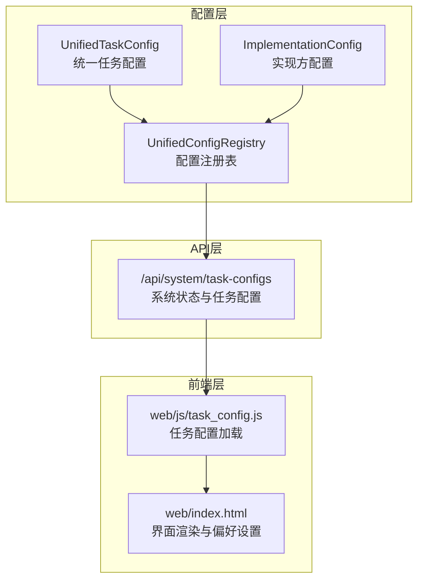
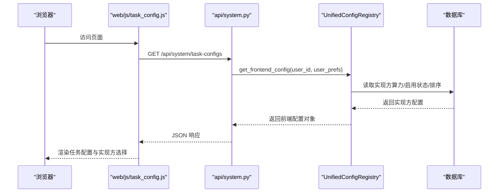
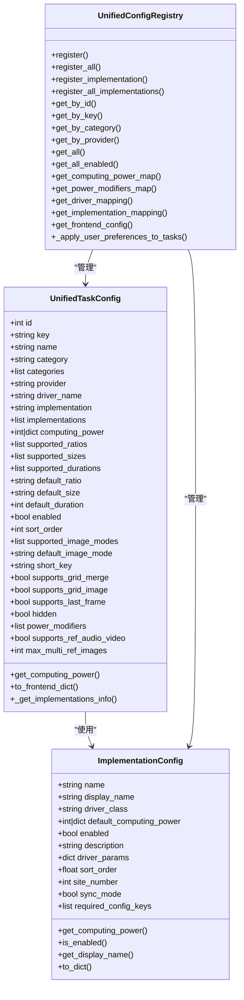

# 任务类型配置

<cite>
**本文档引用的文件**
- [unified_config.py](file://config/unified_config.py)
- [system.py](file://api/system.py)
- [task_config.js](file://web/js/task_config.js)
- [index.html](file://web/index.html)
- [test_short_key.py](file://tests/config/test_short_key.py)
- [test_unified_config_frontend.py](file://tests/config/test_unified_config_frontend.py)
- [default_configs.py](file://config/default_configs.py)
- [constant.py](file://config/constant.py)
</cite>

## 目录
1. [简介](#简介)
2. [项目结构](#项目结构)
3. [核心组件](#核心组件)
4. [架构总览](#架构总览)
5. [详细组件分析](#详细组件分析)
6. [依赖关系分析](#依赖关系分析)
7. [性能考虑](#性能考虑)
8. [故障排除指南](#故障排除指南)
9. [结论](#结论)
10. [附录](#附录)

## 简介
本文件系统化梳理任务类型配置体系，围绕 UnifiedTaskConfig 类展开，涵盖任务分类、供应商、驱动映射、算力配置、前端适配、排序与启用状态管理等关键主题。文档同时给出创建、更新、查询接口的使用方法、典型配置示例、配置模板与最佳实践，帮助开发者与运维人员高效理解与扩展任务配置系统。

## 项目结构
任务类型配置位于统一配置系统中，核心文件为 config/unified_config.py，提供任务类型、实现方、驱动映射、算力修饰符等声明式配置；API 层通过 /api/system/task-configs 对外暴露配置；前端通过 web/js/task_config.js 拉取配置并在页面中渲染。

图表来源
- [unified_config.py:240-480](file://config/unified_config.py#L240-L480)
- [unified_config.py:482-791](file://config/unified_config.py#L482-L791)
- [system.py:44-81](file://api/system.py#L44-L81)
- [task_config.js:19-47](file://web/js/task_config.js#L19-L47)
- [index.html:196-246](file://web/index.html#L196-L246)

章节来源
- [unified_config.py:1127-1705](file://config/unified_config.py#L1127-L1705)
- [system.py:44-81](file://api/system.py#L44-L81)
- [task_config.js:19-47](file://web/js/task_config.js#L19-L47)
- [index.html:196-246](file://web/index.html#L196-L246)

## 核心组件
- UnifiedTaskConfig：统一任务配置类，承载任务类型的关键元数据与行为开关，包括任务ID、键值、名称、分类、供应商、驱动名称、默认与可选实现方、算力配置、支持的尺寸/时长/比例、排序、启用状态、图片模式、网格合并/生图能力、隐藏标志、算力修饰符、参考音视频支持、多参考图上限等。
- ImplementationConfig：实现方配置类，描述具体实现（如多米、RunningHub、Vidu 等）的驱动类名、默认算力、启用状态、显示名、驱动参数、排序、站点编号、同步模式、依赖配置键等。
- UnifiedConfigRegistry：统一配置注册表，提供任务与实现方的注册、查询、前端配置导出、算力映射、驱动映射等功能。
- 常量与ID映射：TaskCategory、TaskProvider、DriverKey、DriverImplementation、TaskTypeId 等，确保跨模块一致的枚举与ID映射。

章节来源
- [unified_config.py:240-480](file://config/unified_config.py#L240-L480)
- [unified_config.py:112-238](file://config/unified_config.py#L112-L238)
- [unified_config.py:482-791](file://config/unified_config.py#L482-L791)
- [unified_config.py:29-58](file://config/unified_config.py#L29-L58)
- [unified_config.py:1019-1125](file://config/unified_config.py#L1019-L1125)
- [unified_config.py:1081-1125](file://config/unified_config.py#L1081-L1125)

## 架构总览
统一配置系统采用“声明式配置 + 注册表 + 动态导出”的架构：
- 声明式配置：ALL_TASK_CONFIGS 与 ALL_IMPLEMENTATIONS 定义任务与实现方清单。
- 注册表：UnifiedConfigRegistry 负责注册、查询、导出前端配置、计算算力、应用用户偏好。
- 动态导出：get_frontend_config 将任务配置、分类、供应商、RunningHub 配置状态等打包输出。
- 前端适配：前端通过 /api/system/task-configs 拉取配置，结合用户偏好与实现方统计信息进行渲染。

图表来源
- [system.py:44-81](file://api/system.py#L44-L81)
- [unified_config.py:659-717](file://config/unified_config.py#L659-L717)
- [task_config.js:34-47](file://web/js/task_config.js#L34-L47)

章节来源
- [system.py:44-81](file://api/system.py#L44-L81)
- [unified_config.py:659-717](file://config/unified_config.py#L659-L717)
- [task_config.js:34-47](file://web/js/task_config.js#L34-L47)

## 详细组件分析

### UnifiedTaskConfig 设计与字段详解
- 核心属性
  - id：任务类型ID（数据库中的 type 字段）
  - key：唯一标识符，用于代码引用
  - name：显示名称
  - category/categories：主分类与额外分类（支持多分类）
  - provider：供应商（多米、RunningHub、Vidu、火山引擎、本地等）
  - driver_name：业务驱动名称（用于 VIDEO_DRIVER_MAPPING）
  - implementation/implementations：默认实现与可选实现方列表
  - computing_power：算力覆盖值（整数或按时长映射）
  - supported_ratios/supported_sizes/supported_durations：支持的比例/尺寸/时长
  - default_ratio/default_size/default_duration：默认值
  - enabled/sort_order：启用状态与排序
  - supported_image_modes/default_image_mode：图生视频任务的图片模式
  - short_key：前端短标识符（全局唯一）
  - supports_grid_merge/supports_grid_image：宫格合并/生图支持
  - supports_last_frame：是否支持尾帧
  - hidden：是否隐藏（仅通过API调用）
  - power_modifiers：算力修饰符（基于属性动态调整）
  - supports_ref_audio_video/max_multi_ref_images：参考音视频与多参考图上限

- 数据类型与默认值
  - id/key/name/category/provider/driver_name/implementation：字符串或整数
  - implementations/computing_power：列表或字典（按时长映射）
  - supported_ratios/supported_sizes/supported_durations：列表
  - default_*：默认值需在对应支持列表内
  - enabled/sort_order/hidden：布尔与整数
  - power_modifiers：列表，元素为 PowerModifier 对象

- 验证规则
  - short_key 必填且全局唯一
  - 视频类任务必须配置 supported_durations
  - 配置了 driver_name 必须有 implementation
  - default_ratio/default_size/default_duration 必须在各自支持列表中

- 算力计算策略
  - 优先使用任务配置中的 computing_power
  - 若为空则从实现方配置读取
  - 支持按 duration 查找实现方算力映射
  - 应用 power_modifiers 的乘数并向上取整

- 前端导出
  - to_frontend_dict 输出包含：id/key/short_key/name/category/categories/provider/supported_*、enabled/hidden/sort_order、implementation/implementations/computing_power
  - 图生视频任务追加：supported_image_modes/default_image_mode/supports_grid_merge/supports_last_frame/max_multi_ref_images
  - 文生图任务追加：supports_grid_image
  - 支持参考音视频：supports_ref_audio_video
  - 算力修饰符：power_modifiers

- 排序与启用状态
  - sort_order 控制前端展示顺序
  - enabled 控制任务是否对外可见
  - implementations 列表按 sort_order 排序

- 图片模式与多参考图
  - 支持首尾帧、多参考图、首尾帧+参考图等模式
  - 多参考图模式支持最大图片数量配置

- 参考音视频支持
  - 部分实现方支持参考音频/视频输入，提升生成质量

章节来源
- [unified_config.py:240-480](file://config/unified_config.py#L240-L480)
- [unified_config.py:295-347](file://config/unified_config.py#L295-L347)
- [unified_config.py:348-407](file://config/unified_config.py#L348-L407)
- [unified_config.py:409-479](file://config/unified_config.py#L409-L479)
- [unified_config.py:2338-2380](file://config/unified_config.py#L2338-L2380)

### ImplementationConfig 设计与字段详解
- 核心属性
  - name/display_name：实现方名称与显示名
  - driver_class：驱动类名
  - default_computing_power：默认算力（整数或按时长映射）
  - enabled：是否启用（代码级硬禁用优先于数据库）
  - description/driver_params：描述与驱动参数
  - sort_order/site_number：排序与站点编号（聚合站点）
  - sync_mode：是否为同步模式
  - required_config_keys：依赖的动态配置键集合

- 算力与启用状态
  - get_computing_power：优先读取数据库配置，否则回退到代码默认值
  - is_enabled：代码 enabled=False 强制禁用；否则读取数据库状态
  - get_display_name：优先读取数据库配置，否则回退到代码默认值

- 依赖配置键
  - required_config_keys：实现方启用与可用性的前置条件，需在动态配置中存在且有值

章节来源
- [unified_config.py:112-238](file://config/unified_config.py#L112-L238)
- [unified_config.py:140-226](file://config/unified_config.py#L140-L226)

### UnifiedConfigRegistry 查询与导出
- 注册与查询
  - register/register_all：注册任务配置
  - register_implementation/register_all_implementations：注册实现方配置
  - get_by_id/get_by_key/get_by_category/get_by_provider：多维查询
  - get_all/get_all_enabled：全量与启用过滤

- 前端配置导出
  - get_frontend_config：返回 tasks/categories/providers，以及 RunningHub 配置状态
  - _apply_user_preferences_to_tasks：根据用户偏好更新 computing_power

- 算力与修饰符映射
  - get_computing_power_map：任务ID到算力映射
  - get_power_modifiers_map：任务ID到修饰符映射
  - get_driver_mapping/get_implementation_mapping：驱动与实现映射

章节来源
- [unified_config.py:482-791](file://config/unified_config.py#L482-L791)
- [unified_config.py:659-783](file://config/unified_config.py#L659-L783)

### 前端适配与用户偏好
- 配置拉取
  - web/js/task_config.js：从 /api/system/task-configs 拉取配置，支持 Authorization 头传递用户Token
  - 前端缓存与加载状态管理

- 界面渲染
  - web/index.html：按类别分组渲染任务配置，支持用户偏好选择实现方
  - 实现方选择器：显示实现方名称、算力、统计数据（商业版）

- 用户偏好应用
  - 有偏好：使用偏好实现方的算力
  - 无偏好：使用 implementations 中排序第一位的算力
  - 测试覆盖：单元测试验证偏好应用逻辑与默认回退

章节来源
- [task_config.js:34-47](file://web/js/task_config.js#L34-L47)
- [index.html:196-246](file://web/index.html#L196-L246)
- [system.py:44-81](file://api/system.py#L44-L81)
- [test_unified_config_frontend.py:77-91](file://tests/config/test_unified_config_frontend.py#L77-L91)

### 接口使用方法
- 获取任务配置
  - 方法：GET /api/system/task-configs
  - 请求头：可选 Authorization: Bearer <token>
  - 响应：包含 tasks、categories、providers、runninghub_configured
  - 用户Token存在时，返回的 computing_power 将根据用户实现方偏好返回对应实现方的算力

章节来源
- [system.py:44-81](file://api/system.py#L44-L81)

### 配置示例与模板
- 示例：文生图/图片编辑
  - 关键字段：category=TEXT_TO_IMAGE、provider=DUOMI、driver_name=GEMINI_IMAGE_EDIT、implementations=[多米与聚合站点]
  - supported_ratios/supported_sizes/default_ratio/default_size
  - computing_power=2/6/3（不同版本）
  - supports_grid_image=True（支持宫格生图）

- 示例：图生视频
  - 关键字段：category=IMAGE_TO_VIDEO、provider=RUNNINGHUB/DUOMI/VOLCENGINE
  - supported_durations/supported_image_modes/default_duration
  - computing_power={按时长映射} 或整数
  - supports_grid_merge/supports_last_frame/max_multi_ref_images

- 示例：文生视频
  - 关键字段：category=TEXT_TO_VIDEO、provider=DUOMI
  - supported_durations/default_duration
  - computing_power=18（示例）

- 示例：数字人/音频/增强
  - provider=LOCAL 或特定供应商
  - computing_power=0/1/10/20（按场景设定）

- 配置模板（字段清单）
  - id/key/name/category/provider/driver_name/implementation/implementations
  - computing_power/supported_ratios/supported_sizes/supported_durations
  - default_ratio/default_size/default_duration/enabled/sort_order
  - supported_image_modes/default_image_mode/short_key
  - supports_grid_merge/supports_grid_image/supports_last_frame/hidden
  - power_modifiers/supported_ref_audio_video/max_multi_ref_images

章节来源
- [unified_config.py:1127-1705](file://config/unified_config.py#L1127-L1705)

### 最佳实践
- 字段完整性
  - 为每个任务配置 short_key，确保全局唯一且非空
  - 视频类任务必须配置 supported_durations
  - 默认值必须在支持列表中

- 算力策略
  - 优先在任务配置中覆盖 computing_power，便于灵活定价
  - 使用 power_modifiers 对不同模式（如图片模式）进行乘数调整
  - 为按时长计费的任务提供 duration->power 映射

- 前端体验
  - 合理设置 sort_order，保证展示顺序符合用户预期
  - 对于多实现方任务，提供清晰的实现方选择器与算力对比
  - 隐藏不常用或下线任务（hidden=True），避免干扰

- 动态配置与依赖
  - 为实现方配置 required_config_keys，确保依赖配置存在
  - 通过数据库热更新实现方启用状态与算力，无需重启

- 验证与测试
  - 使用 validate_configs 与单元测试保障配置正确性
  - 测试用户偏好对 computing_power 的影响

章节来源
- [unified_config.py:2338-2380](file://config/unified_config.py#L2338-L2380)
- [test_short_key.py:44-71](file://tests/config/test_short_key.py#L44-L71)
- [test_unified_config_frontend.py:77-91](file://tests/config/test_unified_config_frontend.py#L77-L91)

## 依赖关系分析
- 组件耦合
  - UnifiedTaskConfig 依赖 ImplementationConfig 与 UnifiedConfigRegistry
  - UnifiedConfigRegistry 依赖实现方配置与数据库模型（实现方算力、启用状态）
  - 前端模块依赖 API 返回的配置对象

- 外部依赖
  - 动态配置系统：通过 get_dynamic_config_value 读取运行时配置
  - 数据库：实现方算力、启用状态、排序等持久化

图表来源
- [unified_config.py:240-480](file://config/unified_config.py#L240-L480)
- [unified_config.py:112-238](file://config/unified_config.py#L112-L238)
- [unified_config.py:482-791](file://config/unified_config.py#L482-L791)

章节来源
- [unified_config.py:240-480](file://config/unified_config.py#L240-L480)
- [unified_config.py:112-238](file://config/unified_config.py#L112-L238)
- [unified_config.py:482-791](file://config/unified_config.py#L482-L791)

## 性能考虑
- 算力计算
  - 优先使用任务配置覆盖值，减少数据库查询
  - 按时长映射的算力查询在实现方配置中缓存，避免重复计算
  - power_modifiers 仅在 context 存在时生效，避免不必要的乘法运算

- 前端渲染
  - 配置缓存与懒加载，避免重复请求
  - implementations 列表按 sort_order 排序，减少前端排序开销

- 数据库访问
  - 实现方启用状态与算力读取集中在数据库层，减少 Python 层逻辑复杂度

[本节为通用指导，无需列出章节来源]

## 故障排除指南
- 配置校验错误
  - short_key 缺失或重复：检查 ALL_TASK_CONFIGS 中的 short_key 配置
  - 视频任务缺少 supported_durations：为图/文生视频任务补充时长列表
  - 默认值不在支持列表：修正 default_ratio/default_size/default_duration

- 前端配置异常
  - /api/system/task-configs 返回 computing_power 与预期不符：确认用户Token与用户偏好设置
  - 实现方不可见：检查实现方 enabled 与 required_config_keys 是否满足

- 动态配置问题
  - RunningHub 配置状态：通过 get_dynamic_config_value("runninghub","api_key") 检查是否配置

章节来源
- [unified_config.py:2338-2380](file://config/unified_config.py#L2338-L2380)
- [test_short_key.py:44-71](file://tests/config/test_short_key.py#L44-L71)
- [system.py:70-75](file://api/system.py#L70-L75)
- [unified_config.py:704-711](file://config/unified_config.py#L704-L711)

## 结论
UnifiedTaskConfig 与 ImplementationConfig 构成了统一配置系统的基石，配合 UnifiedConfigRegistry 的注册与导出能力，实现了任务类型、实现方、算力与前端的解耦与动态化。通过严格的字段验证、灵活的算力覆盖与修饰符机制、完善的前端适配与用户偏好应用，系统既能满足多供应商、多实现方的复杂场景，又能保证配置的一致性与可维护性。

[本节为总结性内容，无需列出章节来源]

## 附录

### 常量与ID映射
- TaskCategory：图片编辑、文生视频、图生视频、文生图、视觉增强、音频、数字人、其他
- TaskProvider：多米、RunningHub、Vidu、火山引擎、本地、ZJT
- DriverKey：各类业务驱动名称（如 sora2_text_to_video、kling_image_to_video 等）
- DriverImplementation：驱动实现类名与实现ID映射
- TaskTypeId：任务类型ID常量

章节来源
- [unified_config.py:29-58](file://config/unified_config.py#L29-L58)
- [unified_config.py:1019-1125](file://config/unified_config.py#L1019-L1125)
- [unified_config.py:1081-1125](file://config/unified_config.py#L1081-L1125)

### 动态配置与默认值
- default_configs.py：提供默认可热更新配置定义（如 RunningHub、多米、Vidu、火山引擎等 API Key）
- 通过 get_dynamic_config_value 读取运行时配置，支持热更新

章节来源
- [default_configs.py:10-791](file://config/default_configs.py#L10-L791)
- [unified_config.py:704-711](file://config/unified_config.py#L704-L711)

### 向后兼容
- constant.py：保留向后兼容的常量别名，逐步废弃中
- 旧 API：TaskTypeRegistry 已废弃，建议使用 UnifiedConfigRegistry

章节来源
- [constant.py:26-46](file://config/constant.py#L26-L46)