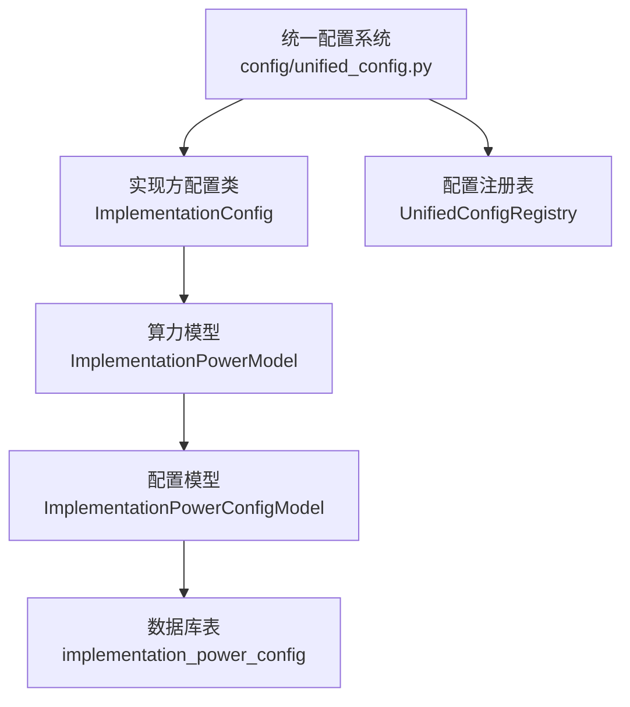
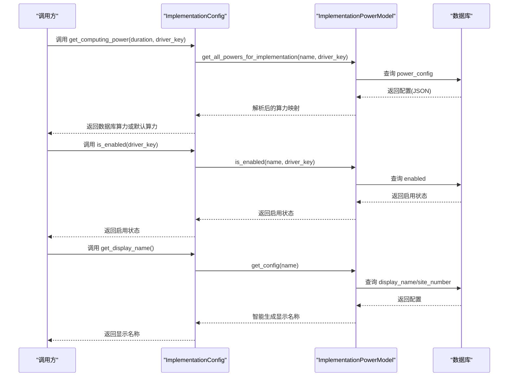
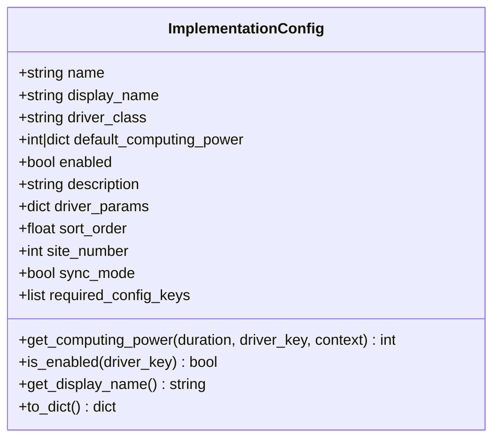
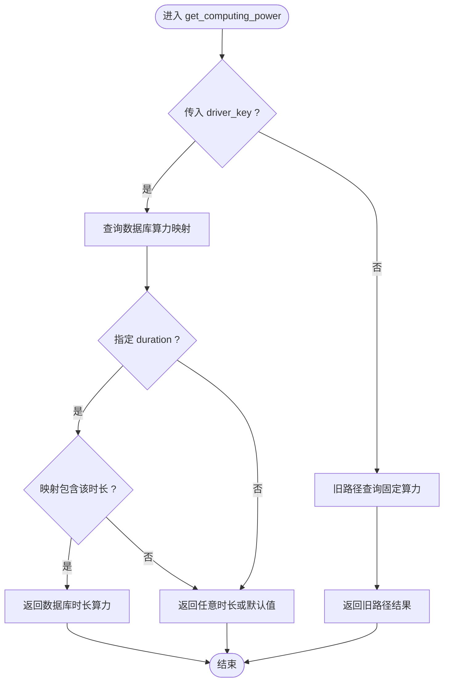
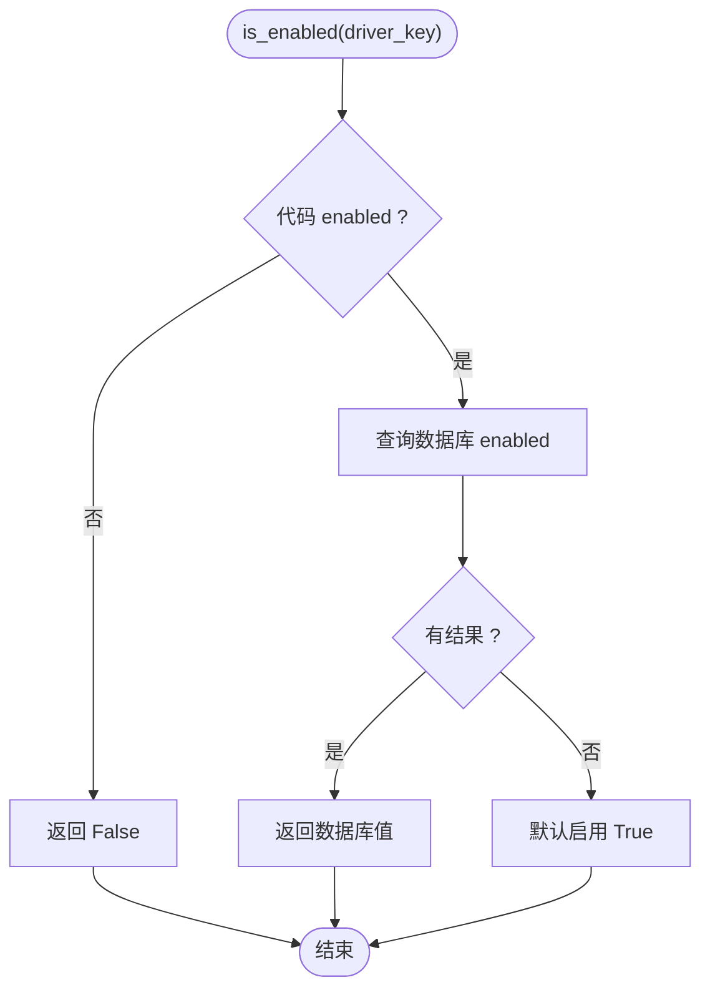
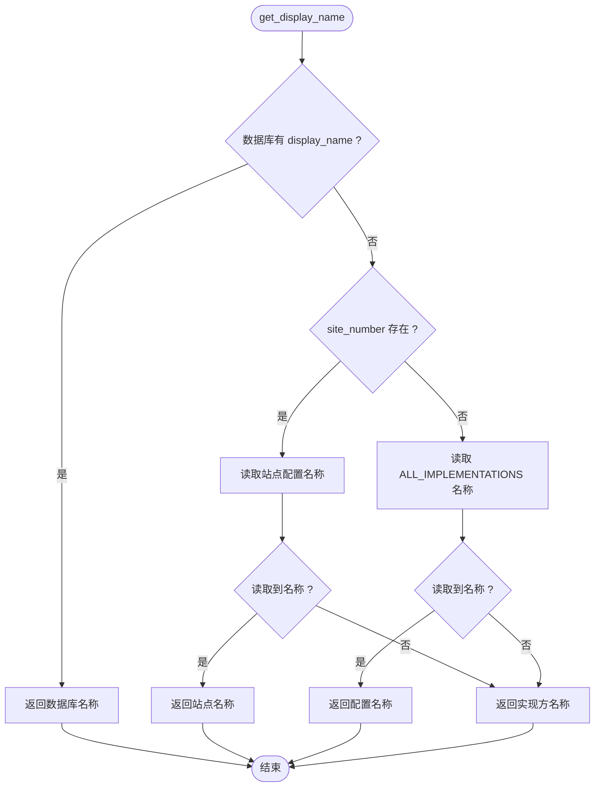
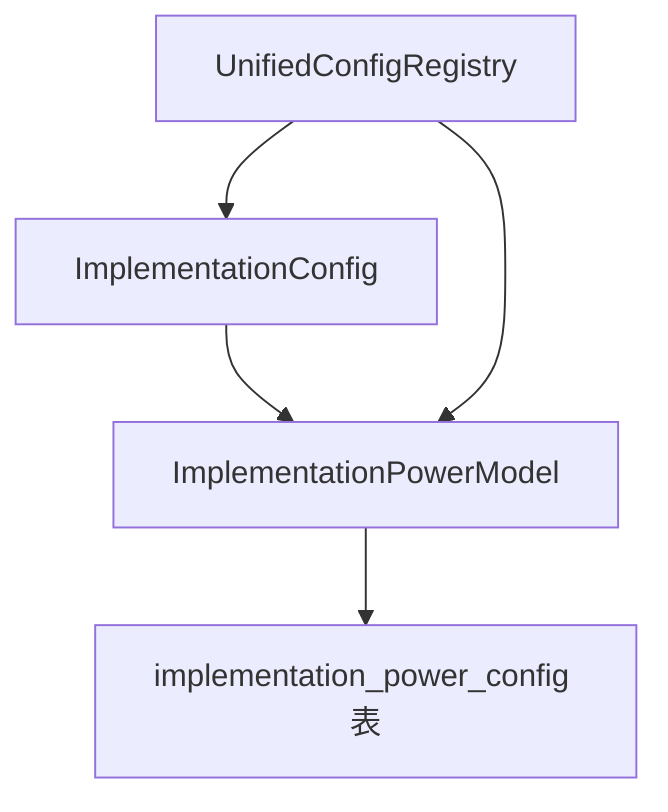

# 实现方配置

<cite>
**本文档引用的文件**
- [unified_config.py](file://config/unified_config.py)
- [implementation_power_config.py](file://model/implementation_power_config.py)
- [implementation_power.py](file://model/implementation_power.py)
- [test_implementation_config.py](file://tests/config/test_implementation_config.py)
</cite>

## 目录
1. [简介](#简介)
2. [项目结构](#项目结构)
3. [核心组件](#核心组件)
4. [架构总览](#架构总览)
5. [详细组件分析](#详细组件分析)
6. [依赖分析](#依赖分析)
7. [性能考虑](#性能考虑)
8. [故障排除指南](#故障排除指南)
9. [结论](#结论)
10. [附录](#附录)

## 简介
本文件聚焦于“实现方配置”的设计与实现，围绕 ImplementationConfig 类展开，系统阐述其实现方基本信息、算力配置、驱动参数、启用状态管理、算力获取机制、显示名称处理、优先级规则、数据库覆盖与默认值回退、动态检查与依赖验证、排序管理等能力，并提供创建模板、配置示例与故障排除建议。

## 项目结构
实现方配置位于统一配置系统中，核心文件如下：
- config/unified_config.py：统一配置注册表与实现方配置类定义
- model/implementation_power_config.py：实现方算力配置数据模型与数据库操作
- model/implementation_power.py：实现方算力配置数据库模型与热更新支持
- tests/config/test_implementation_config.py：实现方配置相关单元测试

**图表来源**
- [unified_config.py:111-238](file://config/unified_config.py#L111-L238)
- [implementation_power.py:48-730](file://model/implementation_power.py#L48-L730)
- [implementation_power_config.py:15-228](file://model/implementation_power_config.py#L15-L228)

**章节来源**
- [unified_config.py:111-238](file://config/unified_config.py#L111-L238)
- [implementation_power.py:48-730](file://model/implementation_power.py#L48-L730)
- [implementation_power_config.py:15-228](file://model/implementation_power_config.py#L15-L228)

## 核心组件
- ImplementationConfig：实现方配置类，承载实现方名称、显示名称、驱动类名、默认算力、启用状态、描述、驱动参数、排序顺序、站点编号、同步模式、所需动态配置键等属性，并提供算力获取、启用状态检查、显示名称获取与字典序列化等方法。
- UnifiedConfigRegistry：统一配置注册表，负责任务配置与实现方配置的注册、查询与前端配置输出。
- ImplementationPowerModel：实现方算力配置数据库模型，支持数据库热更新、算力查询、启用状态查询、显示名称智能生成、配置设置与存在性保证等。
- ImplementationPowerConfigModel：实现方算力配置数据模型，提供配置的增删改查与 JSON 字段解析。

**章节来源**
- [unified_config.py:111-238](file://config/unified_config.py#L111-L238)
- [unified_config.py:482-791](file://config/unified_config.py#L482-L791)
- [implementation_power.py:48-730](file://model/implementation_power.py#L48-L730)
- [implementation_power_config.py:15-228](file://model/implementation_power_config.py#L15-L228)

## 架构总览
实现方配置采用“代码默认值 + 数据库覆盖”的双层策略，通过 driver_key 将同一实现方映射到不同业务驱动场景，实现灵活的算力与配置管理。

**图表来源**
- [unified_config.py:140-226](file://config/unified_config.py#L140-L226)
- [implementation_power.py:82-524](file://model/implementation_power.py#L82-L524)

## 详细组件分析

### ImplementationConfig 类
- 属性与职责
  - name/display_name/driver_class：实现方标识与显示名、驱动类名
  - default_computing_power：默认算力（支持整数或按时长映射）
  - enabled：代码级启用开关（硬禁用不可被数据库覆盖）
  - description/driver_params/sort_order/site_number/sync_mode：描述、驱动参数、排序、站点编号、同步模式
  - required_config_keys：动态依赖配置键列表，用于运行时动态检查
- 关键方法
  - get_computing_power：优先从数据库 driver_key 对应配置读取，否则回退到代码默认值
  - is_enabled：代码 enabled=False 强制禁用；否则从数据库读取启用状态
  - get_display_name：优先从数据库读取 display_name，否则智能生成
  - to_dict：序列化为字典

**图表来源**
- [unified_config.py:111-139](file://config/unified_config.py#L111-L139)

**章节来源**
- [unified_config.py:111-238](file://config/unified_config.py#L111-L238)

### 算力获取机制与优先级
- 优先级规则
  - 算力获取：driver_key 存在时，优先使用数据库 get_all_powers_for_implementation 的结果；若无 driver_key，则回退到旧路径 get_power
  - 若数据库返回空映射或无对应时长，回退到代码 default_computing_power（支持字典映射与默认值）
- 修饰符与动态调整
  - 任务配置层可通过 PowerModifier 对算力进行修饰，最终向上取整
  - 实现方层的修饰符由数据库 power_config 的 modifiers 字段提供

**图表来源**
- [unified_config.py:140-179](file://config/unified_config.py#L140-L179)
- [implementation_power.py:118-164](file://model/implementation_power.py#L118-L164)

**章节来源**
- [unified_config.py:140-179](file://config/unified_config.py#L140-L179)
- [implementation_power.py:118-164](file://model/implementation_power.py#L118-L164)

### 启用状态管理
- 代码级硬禁用：enabled=False 时强制禁用，不可被数据库覆盖
- 数据库覆盖：enabled=True 时，从数据库读取启用状态；无配置默认启用
- 动态检查：任务配置在筛选实现方时，会调用 is_enabled 并结合 required_config_keys 的动态检查

**图表来源**
- [unified_config.py:181-206](file://config/unified_config.py#L181-L206)
- [implementation_power.py:491-524](file://model/implementation_power.py#L491-L524)

**章节来源**
- [unified_config.py:181-206](file://config/unified_config.py#L181-L206)
- [implementation_power.py:491-524](file://model/implementation_power.py#L491-L524)

### 显示名称处理
- 数据库优先：若数据库存在 display_name，直接使用
- 智能生成：若无 display_name，优先根据 site_number 从系统配置读取站点名称；否则从 ALL_IMPLEMENTATIONS 中读取；最后回退到实现方名称
- 任务配置筛选：前端实现方列表会调用 get_display_name 获取显示名

**图表来源**
- [implementation_power.py:396-440](file://model/implementation_power.py#L396-L440)
- [unified_config.py:208-225](file://config/unified_config.py#L208-L225)

**章节来源**
- [implementation_power.py:396-440](file://model/implementation_power.py#L396-L440)
- [unified_config.py:208-225](file://config/unified_config.py#L208-L225)

### 数据库覆盖与默认值回退
- 表结构与字段
  - implementation_name、driver_key（复合唯一键）、site_number、power_config（JSON，支持 fixed 与按秒映射）、sort_order、enabled、display_name、updated_by、updated_at、created_at
- 覆盖策略
  - 算力：按 driver_key 查询 power_config，支持固定算力与按时长映射
  - 启用状态：按 driver_key 查询 enabled，无配置默认启用
  - 显示名称：无 display_name 时智能生成
- 回退机制
  - 算力：数据库无配置或无对应时长时，回退到代码 default_computing_power
  - 启用状态：数据库异常或无配置时，默认启用
  - 显示名称：数据库异常或无配置时，回退到智能生成逻辑

**章节来源**
- [implementation_power_config.py:49-68](file://model/implementation_power_config.py#L49-L68)
- [implementation_power.py:82-164](file://model/implementation_power.py#L82-L164)
- [implementation_power.py:441-489](file://model/implementation_power.py#L441-L489)

### 动态检查、依赖验证与排序管理
- 动态检查
  - required_config_keys：实现方启用时需满足的动态配置键集合，运行时通过配置检查工具验证
- 排序管理
  - 任务配置筛选实现方时，优先从数据库读取 sort_order，若无则使用代码默认值
  - 最终按 sort_order 升序排列，数值越小越靠前
- 依赖验证
  - 任务配置在生成前端实现方列表时，会检查驱动是否已注册、实现方是否启用、动态配置键是否齐全

**章节来源**
- [unified_config.py:409-479](file://config/unified_config.py#L409-L479)
- [unified_config.py:138](file://config/unified_config.py#L138)

### 配置创建模板与示例
- ImplementationConfig 模板字段
  - name：实现方名称（如 gemini_duomi_v1）
  - display_name：显示名称（如 “多米”）
  - driver_class：驱动类名
  - default_computing_power：默认算力（整数或按时长映射）
  - enabled：是否启用（代码级硬禁用）
  - description：描述
  - driver_params：驱动参数字典
  - sort_order：默认排序（代码级后备）
  - site_number：站点编号（聚合站点）
  - sync_mode：是否同步模式
  - required_config_keys：动态依赖配置键列表
- 示例参考
  - 单测中对 ImplementationConfig 的注册与使用示例可作为创建模板参考

**章节来源**
- [unified_config.py:111-139](file://config/unified_config.py#L111-L139)
- [test_implementation_config.py:73-125](file://tests/config/test_implementation_config.py#L73-L125)

## 依赖分析
- 组件耦合
  - ImplementationConfig 依赖 ImplementationPowerModel 进行数据库查询与回退
  - UnifiedConfigRegistry 负责实现方注册与任务配置筛选，间接依赖 ImplementationPowerModel 与配置检查工具
- 外部依赖
  - 数据库：implementation_power_config 表
  - 配置系统：系统配置读取与动态配置检查工具

**图表来源**
- [unified_config.py:482-791](file://config/unified_config.py#L482-L791)
- [implementation_power.py:48-730](file://model/implementation_power.py#L48-L730)

**章节来源**
- [unified_config.py:482-791](file://config/unified_config.py#L482-L791)
- [implementation_power.py:48-730](file://model/implementation_power.py#L48-L730)

## 性能考虑
- 数据库访问
  - 算力与配置查询均通过单条 SQL 完成，索引覆盖 driver_key、sort_order、implementation_name，查询开销较低
- 回退策略
  - 优先数据库覆盖，减少不必要的代码默认值计算
- 动态检查
  - 仅在任务筛选实现方时进行，且使用轻量的配置检查工具，避免阻塞主流程

[本节为通用指导，不涉及具体文件分析]

## 故障排除指南
- 症状：实现方未出现在前端实现方列表
  - 检查：实现方是否已注册、是否启用（数据库 enabled）、驱动是否已注册、required_config_keys 是否齐全
  - 处理：确保 driver_key 正确、数据库配置存在、动态配置键有值
- 症状：算力与预期不符
  - 检查：是否传入 driver_key；数据库 power_config 是否正确；按时长映射是否存在
  - 处理：确认数据库配置与 driver_key 匹配，必要时回退到代码默认值
- 症状：显示名称异常
  - 检查：数据库 display_name 是否为空；site_number 是否正确；ALL_IMPLEMENTATIONS 中是否存在
  - 处理：补充 display_name 或修正 site_number

**章节来源**
- [unified_config.py:409-479](file://config/unified_config.py#L409-L479)
- [implementation_power.py:396-440](file://model/implementation_power.py#L396-L440)

## 结论
ImplementationConfig 通过“代码默认值 + 数据库覆盖”的双层策略，实现了灵活、可热更新的实现方配置管理。配合 ImplementationPowerModel 的数据库查询与智能生成逻辑，以及 UnifiedConfigRegistry 的筛选与排序机制，整体方案具备良好的扩展性与运维友好性。

[本节为总结性内容，不涉及具体文件分析]

## 附录

### API 与数据模型概览
- 数据库表：implementation_power_config
  - 字段：id、implementation_name、driver_key、site_number、power_config、sort_order、enabled、display_name、updated_by、updated_at、created_at
  - 索引：uk_impl_driver（复合唯一键）、idx_driver_key_sort_order、idx_implementation_name
- JSON 字段 power_config 支持：
  - 固定算力：{"fixed": N}
  - 按时长映射：{"5": 38, "10": 70}
  - 修饰符：{"modifiers": {...}}

**章节来源**
- [implementation_power_config.py:49-68](file://model/implementation_power_config.py#L49-L68)
- [implementation_power.py:56-79](file://model/implementation_power.py#L56-L79)