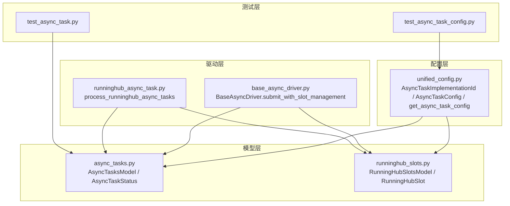
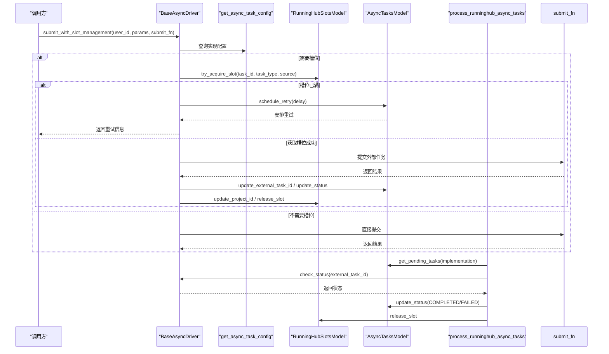
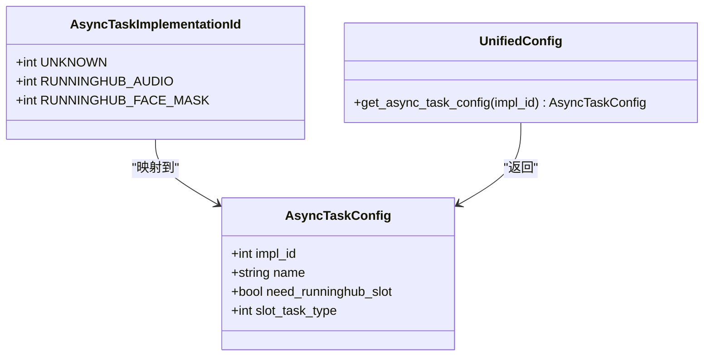
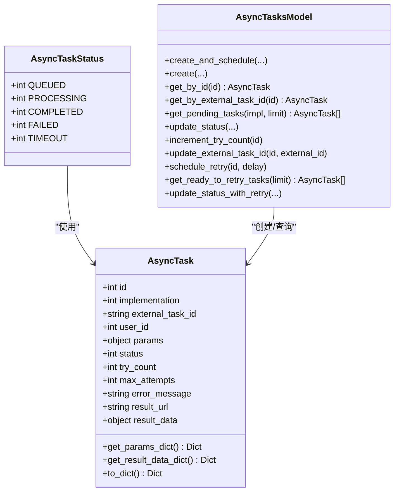
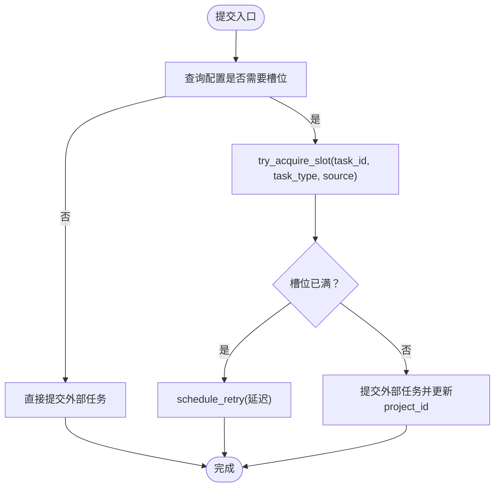
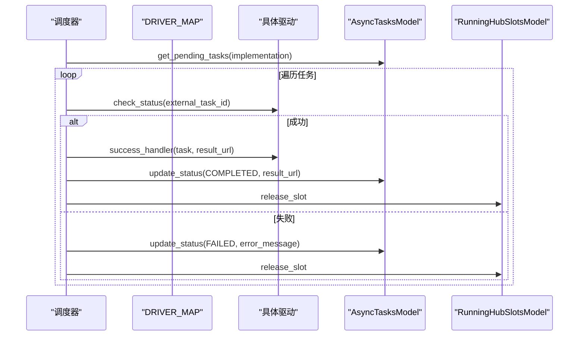
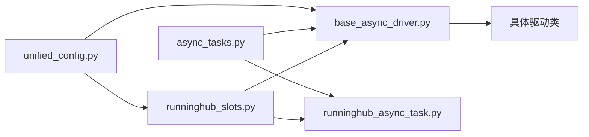

# 异步任务配置

<cite>
**本文档引用的文件**
- [unified_config.py](file://config/unified_config.py)
- [async_tasks.py](file://model/async_tasks.py)
- [base_async_driver.py](file://task/async_drivers/base_async_driver.py)
- [runninghub_async_task.py](file://task/runninghub_async_task.py)
- [runninghub_slots.py](file://model/runninghub_slots.py)
- [test_async_task_config.py](file://tests/config/test_async_task_config.py)
- [test_async_task.py](file://tests/model/test_async_task.py)
</cite>

## 目录
1. [简介](#简介)
2. [项目结构](#项目结构)
3. [核心组件](#核心组件)
4. [架构总览](#架构总览)
5. [详细组件分析](#详细组件分析)
6. [依赖关系分析](#依赖关系分析)
7. [性能考量](#性能考量)
8. [故障排查指南](#故障排查指南)
9. [结论](#结论)
10. [附录](#附录)

## 简介
本文件系统性阐述异步任务配置体系，重点围绕 AsyncTaskConfig 类的设计与实现机制，涵盖任务实现 ID、槽位需求、任务类型映射等配置项；详细说明异步任务的配置管理、槽位分配策略、任务类型映射规则；阐述配置查询接口、默认值处理与异常处理机制；并提供使用示例、配置模板与集成指南，帮助开发者快速理解与正确使用异步任务配置。

## 项目结构
异步任务配置涉及以下关键模块：
- 配置层：统一配置系统，定义 AsyncTaskImplementationId 常量与 AsyncTaskConfig 配置表，并提供查询接口
- 模型层：AsyncTasksModel 负责异步任务的数据库操作；RunningHubSlotsModel 负责并发槽位管理
- 驱动层：BaseAsyncDriver 抽象基类，封装统一提交流程与槽位管理；具体驱动实现（如 RunningHub 音频、人脸遮盖）继承该基类
- 任务处理器：runninghub_async_task 负责定时轮询 RunningHub 任务状态并更新数据库
- 测试层：单元测试覆盖配置查询、默认值、槽位类型映射等行为

**图表来源**
- [unified_config.py:60-93](file://config/unified_config.py#L60-L93)
- [async_tasks.py:96-475](file://model/async_tasks.py#L96-L475)
- [base_async_driver.py:60-141](file://task/async_drivers/base_async_driver.py#L60-L141)
- [runninghub_async_task.py:243-343](file://task/runninghub_async_task.py#L243-L343)
- [runninghub_slots.py:53-263](file://model/runninghub_slots.py#L53-L263)

**章节来源**
- [unified_config.py:60-93](file://config/unified_config.py#L60-L93)
- [async_tasks.py:96-475](file://model/async_tasks.py#L96-L475)
- [base_async_driver.py:60-141](file://task/async_drivers/base_async_driver.py#L60-L141)
- [runninghub_async_task.py:243-343](file://task/runninghub_async_task.py#L243-L343)
- [runninghub_slots.py:53-263](file://model/runninghub_slots.py#L53-L263)

## 核心组件
- AsyncTaskImplementationId：定义异步任务实现 ID 常量，用于 async_tasks 表的 implementation 字段
- AsyncTaskConfig：异步任务配置类，包含实现 ID、名称、是否需要 RunningHub 槽位、槽位任务类型等字段
- ASYNC_TASK_CONFIGS：异步任务配置表，维护实现 ID 到配置对象的映射
- get_async_task_config：查询接口，未知实现 ID 时返回默认配置
- AsyncTasksModel：异步任务数据库操作，提供创建、查询、状态更新、重试调度等功能
- RunningHubSlotsModel：并发槽位管理，控制 RunningHub API 的并发请求数量
- BaseAsyncDriver：异步驱动抽象基类，统一提交流程与异常释放，支持槽位管理
- runninghub_async_task：定时轮询任务状态并处理成功/失败分支

**章节来源**
- [unified_config.py:60-93](file://config/unified_config.py#L60-L93)
- [async_tasks.py:96-475](file://model/async_tasks.py#L96-L475)
- [base_async_driver.py:60-141](file://task/async_drivers/base_async_driver.py#L60-L141)
- [runninghub_async_task.py:243-343](file://task/runninghub_async_task.py#L243-L343)
- [runninghub_slots.py:53-263](file://model/runninghub_slots.py#L53-L263)

## 架构总览
异步任务配置的总体流程如下：
- 驱动层通过 BaseAsyncDriver.submit_with_slot_management 统一提交入口
- 根据配置决定是否申请 RunningHub 槽位
- 成功提交后记录外部任务 ID，并由调度器轮询状态
- 根据实现类型执行相应的后处理逻辑（如音频下载、视频融合）

**图表来源**
- [base_async_driver.py:60-141](file://task/async_drivers/base_async_driver.py#L60-L141)
- [runninghub_async_task.py:243-343](file://task/runninghub_async_task.py#L243-L343)
- [runninghub_slots.py:78-114](file://model/runninghub_slots.py#L78-L114)
- [async_tasks.py:100-177](file://model/async_tasks.py#L100-L177)

## 详细组件分析

### AsyncTaskConfig 类与配置管理
- 设计要点
  - 通过 dataclass 定义配置字段：实现 ID、名称、是否需要槽位、槽位任务类型
  - ASYNC_TASK_CONFIGS 维护实现 ID 到配置对象的映射
  - get_async_task_config 提供查询接口，未知实现 ID 时回退到默认配置（UNKNOWN）
- 配置项说明
  - impl_id：实现 ID，与 AsyncTaskImplementationId 常量一致
  - name：配置名称，用于显示与识别
  - need_runninghub_slot：是否需要 RunningHub 并发槽位
  - slot_task_type：槽位任务类型，对应 runninghub_slots.task_type
- 默认值处理
  - 未知实现 ID 时返回 need_runninghub_slot=False 的默认配置
  - 单元测试验证了查询行为与默认值

**图表来源**
- [unified_config.py:60-93](file://config/unified_config.py#L60-L93)

**章节来源**
- [unified_config.py:60-93](file://config/unified_config.py#L60-L93)
- [test_async_task_config.py:16-35](file://tests/config/test_async_task_config.py#L16-L35)

### 异步任务模型与状态管理
- AsyncTaskStatus：定义任务状态常量（排队中、处理中、完成、失败、超时）
- AsyncTask：封装任务字段与解析方法（params、result_data 的 JSON 解析）
- AsyncTasksModel：提供创建、查询、状态更新、重试调度、获取待重试任务等能力
- 数据库结构：async_tasks 表包含 implementation、external_task_id、params、status、max_attempts、retry_count、next_retry_at 等字段

**图表来源**
- [async_tasks.py:17-94](file://model/async_tasks.py#L17-L94)
- [async_tasks.py:96-475](file://model/async_tasks.py#L96-L475)

**章节来源**
- [async_tasks.py:17-94](file://model/async_tasks.py#L17-L94)
- [async_tasks.py:96-475](file://model/async_tasks.py#L96-L475)

### 槽位分配与并发控制
- RunningHubSlotsModel：提供获取/释放槽位、统计活跃槽位、清理超时槽位等能力
- try_acquire_slot：基于动态配置的最大并发槽位数进行并发检查，避免 TASK_QUEUE_MAXED 错误
- 槽位任务类型：通过 slot_task_type 与 runninghub_slots.task_type 关联，实现不同类型任务的隔离
- 释放策略：在任务完成后或失败时释放槽位，确保资源回收

**图表来源**
- [base_async_driver.py:60-141](file://task/async_drivers/base_async_driver.py#L60-L141)
- [runninghub_slots.py:78-114](file://model/runninghub_slots.py#L78-L114)

**章节来源**
- [runninghub_slots.py:53-263](file://model/runninghub_slots.py#L53-L263)
- [base_async_driver.py:60-141](file://task/async_drivers/base_async_driver.py#L60-L141)

### 任务类型映射与调度
- DRIVER_MAP：将实现 ID 映射到具体驱动类（如 RunningHub 音频、人脸遮盖）
- SUCCESS_HANDLER_MAP：根据实现 ID 执行成功后的后处理逻辑（如音频下载、视频融合）
- process_runninghub_async_tasks：定时轮询任务状态，根据状态更新数据库并释放槽位
- 重试机制：基于 max_attempts 与 schedule_retry 实现指数退避重试

**图表来源**
- [runninghub_async_task.py:243-343](file://task/runninghub_async_task.py#L243-L343)

**章节来源**
- [runninghub_async_task.py:243-343](file://task/runninghub_async_task.py#L243-L343)

### 异常处理机制
- 配置查询异常：get_async_task_config 在未知实现 ID 时返回默认配置，避免崩溃
- 数据库异常：AsyncTasksModel 的各方法均捕获 MySQL 异常并记录日志，随后抛出
- 提交异常：BaseAsyncDriver 在提交过程中发生异常时释放槽位并更新任务状态为失败
- 超时处理：当尝试次数超过 max_attempts 时标记为 TIMEOUT

**章节来源**
- [unified_config.py:90-93](file://config/unified_config.py#L90-L93)
- [async_tasks.py:128-133](file://model/async_tasks.py#L128-L133)
- [base_async_driver.py:130-137](file://task/async_drivers/base_async_driver.py#L130-L137)

## 依赖关系分析
- 配置依赖：BaseAsyncDriver 依赖 get_async_task_config 获取实现配置
- 数据依赖：AsyncTasksModel 依赖数据库访问层执行 SQL 操作
- 槽位依赖：BaseAsyncDriver 与 RunningHubSlotsModel 协作完成并发控制
- 调度依赖：process_runninghub_async_tasks 依赖具体驱动的 check_status 方法

**图表来源**
- [unified_config.py:60-93](file://config/unified_config.py#L60-L93)
- [base_async_driver.py:60-141](file://task/async_drivers/base_async_driver.py#L60-L141)
- [runninghub_async_task.py:243-343](file://task/runninghub_async_task.py#L243-L343)
- [runninghub_slots.py:53-263](file://model/runninghub_slots.py#L53-L263)
- [async_tasks.py:96-475](file://model/async_tasks.py#L96-L475)

**章节来源**
- [unified_config.py:60-93](file://config/unified_config.py#L60-L93)
- [base_async_driver.py:60-141](file://task/async_drivers/base_async_driver.py#L60-L141)
- [runninghub_async_task.py:243-343](file://task/runninghub_async_task.py#L243-L343)
- [runninghub_slots.py:53-263](file://model/runninghub_slots.py#L53-L263)
- [async_tasks.py:96-475](file://model/async_tasks.py#L96-L475)

## 性能考量
- 指数退避重试：通过 _calculate_retry_delay 控制重试间隔，避免频繁轮询造成压力
- 并发限制：通过 try_acquire_slot 限制最大并发槽位数，防止外部服务限流
- 数据库索引：async_tasks 表针对 user_id、(implementation, status)、(status, next_retry_at, retry_count) 建立索引，提升查询与重试调度效率
- 事件循环：在任务处理中使用 asyncio.new_event_loop 管理异步任务，避免阻塞

## 故障排查指南
- 问题：提交失败或超时
  - 检查 get_async_task_config 返回的配置是否正确
  - 查看 AsyncTasksModel.update_status 记录的 error_message
  - 确认 max_attempts 与 schedule_retry 的重试次数
- 问题：槽位已满导致重试
  - 检查 RunningHubSlotsModel.try_acquire_slot 的返回值
  - 调整 runninghub.max_concurrent_slots 动态配置
- 问题：状态轮询异常
  - 查看 process_runninghub_async_tasks 的日志
  - 确认具体驱动的 check_status 实现与外部服务对接正常

**章节来源**
- [base_async_driver.py:142-157](file://task/async_drivers/base_async_driver.py#L142-L157)
- [runninghub_slots.py:78-114](file://model/runninghub_slots.py#L78-L114)
- [runninghub_async_task.py:281-289](file://task/runninghub_async_task.py#L281-L289)

## 结论
AsyncTaskConfig 通过清晰的配置模型与查询接口，为异步任务提供了可扩展的实现机制。结合 RunningHubSlotsModel 的并发控制与 AsyncTasksModel 的状态管理，系统实现了稳定可靠的异步任务生命周期管理。建议在新增任务类型时遵循现有模式，统一配置、驱动与后处理的集成方式，确保一致性与可维护性。

## 附录

### 使用示例
- 查询配置
  - 使用 get_async_task_config(AsyncTaskImplementationId.RUNNINGHUB_AUDIO) 获取配置
  - 未知实现 ID 时自动回退到默认配置
- 提交任务
  - 通过 BaseAsyncDriver.submit_with_slot_management 统一提交入口
  - 若需槽位，先尝试获取槽位，成功后再提交外部任务
- 轮询与后处理
  - 调度器定时调用 process_runninghub_async_tasks
  - 根据实现 ID 执行相应后处理逻辑（如音频下载、视频融合）

**章节来源**
- [unified_config.py:90-93](file://config/unified_config.py#L90-L93)
- [base_async_driver.py:60-141](file://task/async_drivers/base_async_driver.py#L60-L141)
- [runninghub_async_task.py:243-343](file://task/runninghub_async_task.py#L243-L343)

### 配置模板
- 异步任务配置表（ASYNC_TASK_CONFIGS）示例
  - 键：实现 ID（如 RUNNINGHUB_AUDIO）
  - 值：AsyncTaskConfig（包含 impl_id、name、need_runninghub_slot、slot_task_type）
- 槽位任务类型映射
  - 通过 slot_task_type 与 runninghub_slots.task_type 对应，实现不同类型任务的隔离

**章节来源**
- [unified_config.py:77-87](file://config/unified_config.py#L77-L87)
- [runninghub_slots.py:245-262](file://model/runninghub_slots.py#L245-L262)

### 集成指南
- 新增实现 ID
  - 在 AsyncTaskImplementationId 中添加新常量
  - 在 ASYNC_TASK_CONFIGS 中添加对应配置
- 新增驱动
  - 继承 BaseAsyncDriver，实现 submit_task 与 check_status
  - 在 DRIVER_MAP 中注册实现 ID 到驱动类的映射
- 新增后处理
  - 在 SUCCESS_HANDLER_MAP 中注册实现 ID 到后处理函数
  - 必要时在 POST_PROCESSING_REQUIRED 中声明后处理要求

**章节来源**
- [unified_config.py:60-93](file://config/unified_config.py#L60-L93)
- [base_async_driver.py:159-193](file://task/async_drivers/base_async_driver.py#L159-L193)
- [runninghub_async_task.py:232-240](file://task/runninghub_async_task.py#L232-L240)