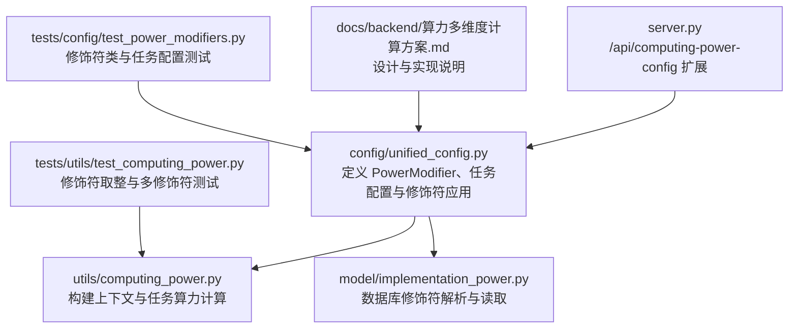
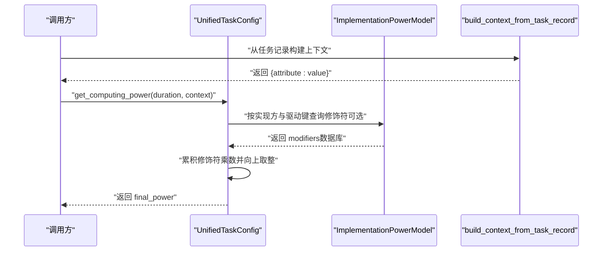
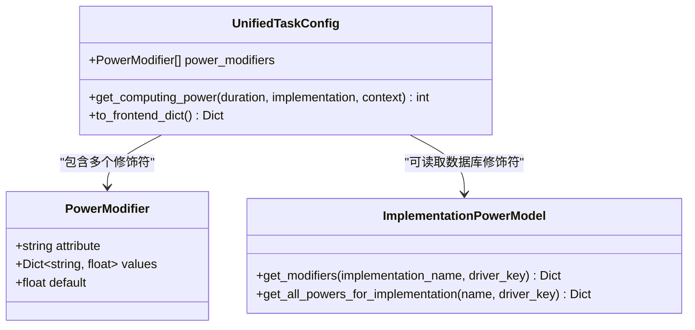
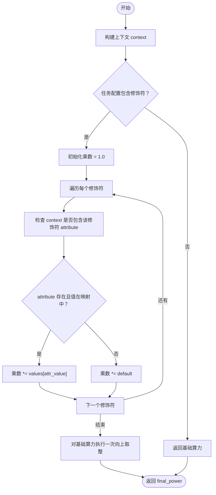
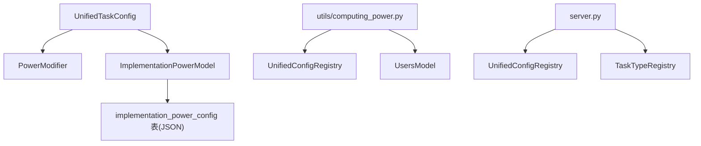

# 算力修饰符

<cite>
**本文档引用的文件**
- [config/unified_config.py](file://config/unified_config.py)
- [model/implementation_power.py](file://model/implementation_power.py)
- [utils/computing_power.py](file://utils/computing_power.py)
- [server.py](file://server.py)
- [docs/backend/算力多维度计算方案.md](file://docs/backend/算力多维度计算方案.md)
- [tests/config/test_power_modifiers.py](file://tests/config/test_power_modifiers.py)
- [tests/utils/test_computing_power.py](file://tests/utils/test_computing_power.py)
</cite>

## 目录
1. [简介](#简介)
2. [项目结构](#项目结构)
3. [核心组件](#核心组件)
4. [架构总览](#架构总览)
5. [详细组件分析](#详细组件分析)
6. [依赖分析](#依赖分析)
7. [性能考量](#性能考量)
8. [故障排查指南](#故障排查指南)
9. [结论](#结论)
10. [附录](#附录)

## 简介
本文件系统性阐述“算力修饰符”的设计与实现，围绕 PowerModifier 类的属性定义、值映射与默认乘数设置，详解修饰符在基础算力上的累积计算、向上取整规则、上下文参数处理，以及在不同任务类型中的应用场景与配置方法。文档还提供配置示例、计算公式、性能影响分析、最佳实践、常见配置模式与调试技巧，帮助开发者与运维人员高效、安全地使用与扩展算力修饰符体系。

## 项目结构
与算力修饰符直接相关的核心模块与文件如下：
- 配置与任务定义：config/unified_config.py
- 实现方算力配置（数据库）：model/implementation_power.py
- 算力计算工具：utils/computing_power.py
- 前端接口扩展：server.py
- 设计文档：docs/backend/算力多维度计算方案.md
- 单元测试：tests/config/test_power_modifiers.py、tests/utils/test_computing_power.py

**图表来源**
- [config/unified_config.py](file://config/unified_config.py)
- [model/implementation_power.py](file://model/implementation_power.py)
- [utils/computing_power.py](file://utils/computing_power.py)
- [server.py](file://server.py)
- [docs/backend/算力多维度计算方案.md](file://docs/backend/算力多维度计算方案.md)
- [tests/config/test_power_modifiers.py](file://tests/config/test_power_modifiers.py)
- [tests/utils/test_computing_power.py](file://tests/utils/test_computing_power.py)

**章节来源**
- [config/unified_config.py](file://config/unified_config.py)
- [model/implementation_power.py](file://model/implementation_power.py)
- [utils/computing_power.py](file://utils/computing_power.py)
- [server.py](file://server.py)
- [docs/backend/算力多维度计算方案.md](file://docs/backend/算力多维度计算方案.md)
- [tests/config/test_power_modifiers.py](file://tests/config/test_power_modifiers.py)
- [tests/utils/test_computing_power.py](file://tests/utils/test_computing_power.py)

## 核心组件
- PowerModifier 数据类：定义修饰符的属性名、属性值到乘数的映射、未匹配时的默认乘数。
- UnifiedTaskConfig.get_computing_power：在已有基础算力之上，累积所有修饰符乘数并进行一次向上取整。
- ImplementationPowerModel：解析数据库 power_config 中的 modifiers 字段，并提供按实现方与驱动键查询修饰符的能力。
- 工具函数 build_context_from_task_record：从任务记录中抽取上下文参数（如 image_mode、resolution）。
- /api/computing-power-config 接口扩展：返回 task_power_modifiers 映射，便于前端与管理后台展示与配置。

**章节来源**
- [config/unified_config.py](file://config/unified_config.py)
- [model/implementation_power.py](file://model/implementation_power.py)
- [utils/computing_power.py](file://utils/computing_power.py)
- [server.py](file://server.py)

## 架构总览
算力修饰符的计算流程如下：
- 从任务配置或实现方配置获取基础算力；
- 若提供上下文 context 且任务配置包含 power_modifiers，则遍历每个修饰符：
  - 若上下文中存在该修饰符的 attribute 且其值在修饰符映射中，则使用该值对应的乘数；
  - 否则使用修饰符的 default 乘数；
- 将所有乘数累积相乘后，对基础算力执行一次向上取整，得到最终算力。

**图表来源**
- [config/unified_config.py](file://config/unified_config.py)
- [model/implementation_power.py](file://model/implementation_power.py)
- [utils/computing_power.py](file://utils/computing_power.py)

## 详细组件分析

### PowerModifier 类与任务配置集成
- 属性定义
  - attribute：修饰符作用的属性名（如 image_mode、resolution）。
  - values：属性值到乘数的映射（如 first_last_with_tail: 1.66）。
  - default：未匹配时的默认乘数（默认 1.0）。
- 在任务配置中的使用
  - UnifiedTaskConfig.power_modifiers：任务级修饰符列表。
  - to_frontend_dict：将修饰符信息输出到前端配置。
  - get_computing_power：在基础算力上应用修饰符乘数并向上取整。

**图表来源**
- [config/unified_config.py](file://config/unified_config.py)
- [model/implementation_power.py](file://model/implementation_power.py)

**章节来源**
- [config/unified_config.py](file://config/unified_config.py)
- [tests/config/test_power_modifiers.py](file://tests/config/test_power_modifiers.py)

### 上下文参数与修饰符应用
- 上下文构建
  - build_context_from_task_record：从任务记录中抽取 image_mode 与 resolution 等属性，形成 context。
- 修饰符应用
  - 遍历 power_modifiers，依据 context.get(attribute) 的值选择乘数，未匹配使用 default。
  - 所有乘数相乘后，对基础算力执行一次向上取整。

**图表来源**
- [config/unified_config.py](file://config/unified_config.py)
- [utils/computing_power.py](file://utils/computing_power.py)

**章节来源**
- [utils/computing_power.py](file://utils/computing_power.py)
- [tests/utils/test_computing_power.py](file://tests/utils/test_computing_power.py)

### 数据库修饰符解析与优先级
- JSON 结构
  - power_config 中新增 modifiers 字段，键为属性名，值为属性值到乘数的映射，支持 _default 键。
- 解析与查询
  - _parse_power_config：解析 power_config JSON，提取 modifiers。
  - get_modifiers：按实现方与驱动键查询修饰符配置。
- 优先级策略
  - 数据库 modifiers 优先，覆盖代码中的 power_modifiers 默认值。

**章节来源**
- [model/implementation_power.py](file://model/implementation_power.py)
- [docs/backend/算力多维度计算方案.md](file://docs/backend/算力多维度计算方案.md)

### 前端接口扩展
- /api/computing-power-config
  - 新增 task_power_modifiers 字段，返回任务 ID 到修饰符列表的映射。
- UnifiedConfigRegistry.get_power_modifiers_map
  - 生成修饰符映射，供接口返回与管理后台使用。

**章节来源**
- [server.py](file://server.py)
- [config/unified_config.py](file://config/unified_config.py)

## 依赖分析
- 组件耦合
  - UnifiedTaskConfig 依赖 PowerModifier 与 ImplementationPowerModel（可选）。
  - utils/computing_power.py 依赖 config/unified_config 与 model/users（用户偏好）。
  - server.py 依赖 UnifiedConfigRegistry 与 TaskTypeRegistry。
- 外部依赖
  - 数据库 implementation_power_config 表存储 power_config JSON。
  - 前端通过 /api/computing-power-config 获取修饰符配置。

**图表来源**
- [config/unified_config.py](file://config/unified_config.py)
- [model/implementation_power.py](file://model/implementation_power.py)
- [utils/computing_power.py](file://utils/computing_power.py)
- [server.py](file://server.py)

**章节来源**
- [config/unified_config.py](file://config/unified_config.py)
- [model/implementation_power.py](file://model/implementation_power.py)
- [utils/computing_power.py](file://utils/computing_power.py)
- [server.py](file://server.py)

## 性能考量
- 计算复杂度
  - 修饰符应用为 O(M)（M 为修饰符数量），乘法与一次向上取整开销极低。
- 浮点精度与取整
  - 采用“先累积乘积，最后一次性向上取整”的策略，避免多次取整导致的精度损失与性能浪费。
- 数据库查询
  - 修饰符查询按实现方与驱动键进行，索引与 JSON 解析成本可控。
- 建议
  - 控制修饰符数量与层级，避免过度复杂的乘法组合。
  - 对高频任务尽量复用已有修饰符，减少重复配置。

[本节为通用性能讨论，不直接分析具体文件]

## 故障排查指南
- 常见问题
  - 修饰符未生效：确认任务配置中 power_modifiers 是否正确设置，且 get_computing_power 调用传入了 context。
  - 未匹配属性值：检查 context 的 attribute 是否与修饰符 attribute 一致，或是否应使用 default。
  - 数据库修饰符未覆盖：确认 implementation_power_config 中 modifiers 字段是否正确写入。
- 调试技巧
  - 使用单元测试验证修饰符行为（参见测试用例）。
  - 通过 /api/computing-power-config 检查 task_power_modifiers 返回值。
  - 在 build_context_from_task_record 处断点，核对上下文参数是否正确抽取。

**章节来源**
- [tests/config/test_power_modifiers.py](file://tests/config/test_power_modifiers.py)
- [tests/utils/test_computing_power.py](file://tests/utils/test_computing_power.py)
- [server.py](file://server.py)

## 结论
算力修饰符通过“乘数修饰 + 一次性向上取整”的设计，在不破坏现有基础算力结构的前提下，实现了灵活、可扩展的多维度算力调整能力。配合数据库热更新与前端接口扩展，既能满足运营侧快速调价的需求，又能保证计算结果的确定性与稳定性。建议在实际使用中遵循“少即是多”的原则，合理规划修饰符数量与默认值，结合测试与监控持续优化。

[本节为总结性内容，不直接分析具体文件]

## 附录

### 计算公式与规则
- 基础算力：来自任务配置或实现方配置。
- 修饰符累积：multiplier = ∏ modifier_i，其中 modifier_i 来自 context 中的属性值映射或 default。
- 最终算力：final_power = ceil(base_power × multiplier)。

**章节来源**
- [docs/backend/算力多维度计算方案.md](file://docs/backend/算力多维度计算方案.md)
- [config/unified_config.py](file://config/unified_config.py)

### 配置示例与最佳实践
- 示例结构（数据库 power_config JSON）
  - 包含基础时长映射与 modifiers 字段，修饰符键为属性名，值为属性值到乘数的映射，支持 _default。
- 最佳实践
  - 保持修饰符粒度清晰，避免过度细分导致维护困难。
  - 为每个修饰符提供合理的 default 值，确保边界情况稳定。
  - 通过管理后台热更新 modifiers，结合灰度发布逐步推广。
  - 在前端与接口中同步暴露 task_power_modifiers，便于可视化配置与校验。

**章节来源**
- [docs/backend/算力多维度计算方案.md](file://docs/backend/算力多维度计算方案.md)
- [model/implementation_power.py](file://model/implementation_power.py)
- [server.py](file://server.py)