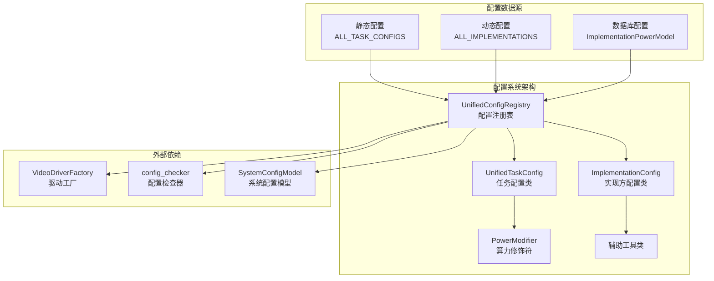
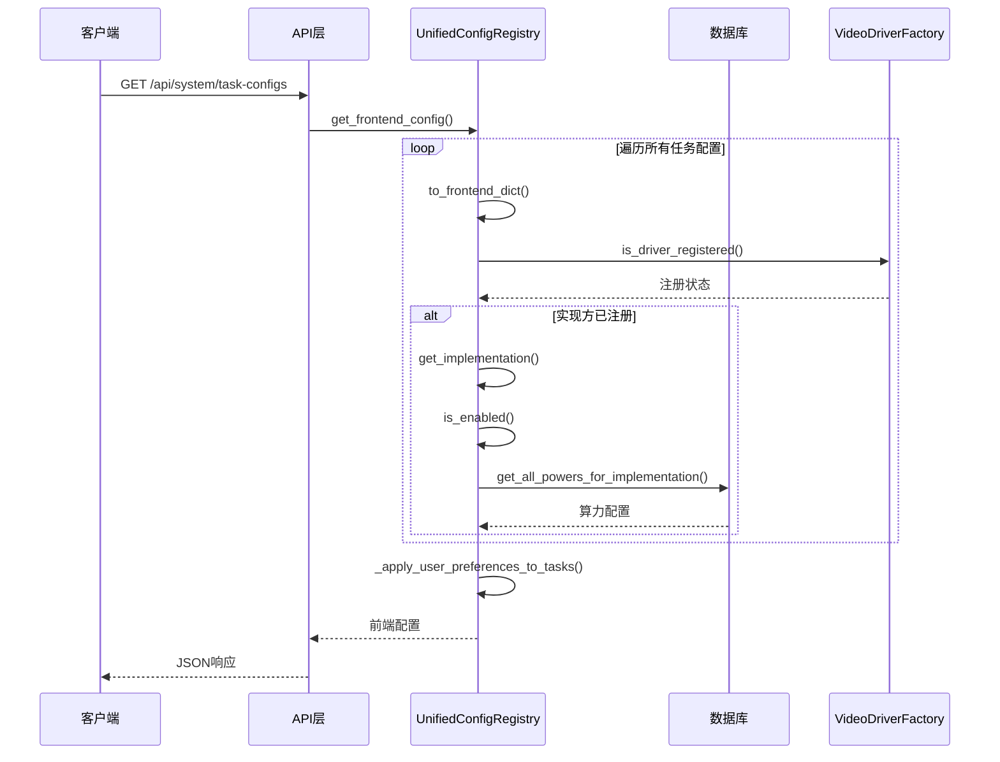
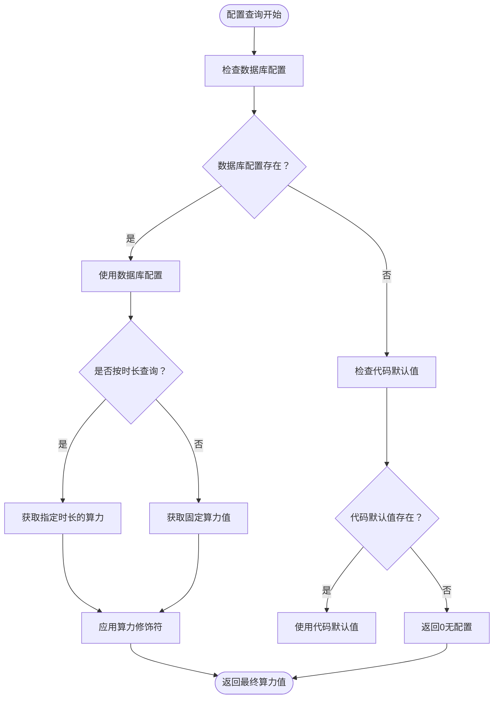
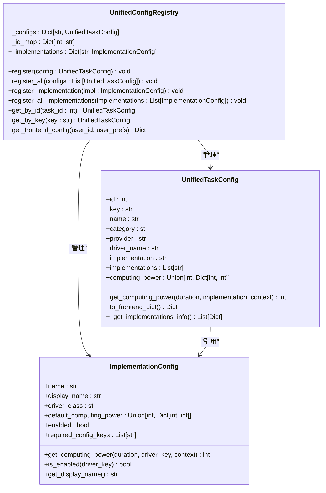
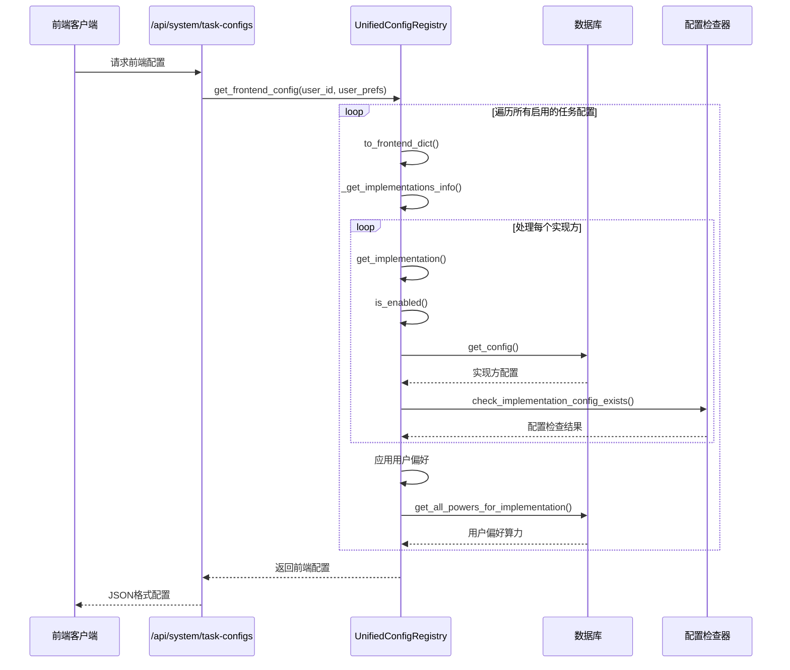
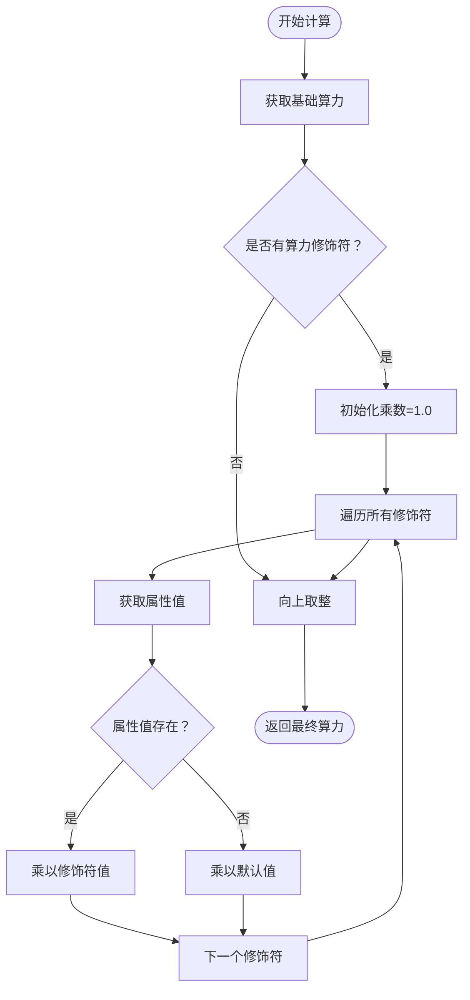

# 统一配置注册表

<cite>
**本文档引用的文件**
- [unified_config.py](file://config/unified_config.py)
- [unified_config_system.md](file://docs/backend/unified_config_system.md)
- [test_unified_config_frontend.py](file://tests/config/test_unified_config_frontend.py)
- [test_implementation_config.py](file://tests/config/test_implementation_config.py)
- [system.py](file://api/system.py)
- [config_util.py](file://config/config_util.py)
- [default_configs.py](file://config/default_configs.py)
- [driver_factory.py](file://task/visual_drivers/driver_factory.py)
</cite>

## 目录
1. [简介](#简介)
2. [项目结构](#项目结构)
3. [核心组件](#核心组件)
4. [架构概览](#架构概览)
5. [详细组件分析](#详细组件分析)
6. [依赖关系分析](#依赖关系分析)
7. [性能考虑](#性能考虑)
8. [故障排除指南](#故障排除指南)
9. [结论](#结论)
10. [附录](#附录)

## 简介

统一配置注册表是本项目的核心配置管理系统，负责整合和管理所有任务类型配置、实现方配置、算力配置以及前端展示配置。该系统采用声明式配置方式，提供了一套完整的配置注册、查询、验证和管理机制。

系统的主要特点包括：
- **集中化管理**：所有配置集中在统一注册表中进行管理
- **声明式配置**：使用数据类定义配置属性，支持丰富的配置选项
- **热更新支持**：通过动态配置系统支持运行时配置更新
- **前端集成**：提供专门的前端配置生成接口
- **多级优先级**：实现数据库配置、代码默认值和用户偏好的优先级机制

## 项目结构

统一配置注册表位于 `config/unified_config.py` 文件中，采用模块化设计，包含以下主要组成部分：



**图表来源**
- [unified_config.py:482-790](file://config/unified_config.py#L482-L790)
- [unified_config.py:1128-1705](file://config/unified_config.py#L1128-L1705)
- [unified_config.py:1709-2325](file://config/unified_config.py#L1709-L2325)

**章节来源**
- [unified_config.py:1-800](file://config/unified_config.py#L1-L800)
- [unified_config_system.md:1-171](file://docs/backend/unified_config_system.md#L1-L171)

## 核心组件

### UnifiedConfigRegistry 类

UnifiedConfigRegistry 是整个配置系统的核心，负责管理所有配置的注册、查询和生命周期管理。

#### 主要职责
- **配置注册**：注册任务配置和实现方配置
- **配置查询**：提供多种查询方式（按ID、按key、按分类、按供应商等）
- **配置管理**：管理配置的启用状态和过滤逻辑
- **前端配置生成**：生成前端所需的配置格式

#### 关键方法
- `register()`: 注册单个任务配置
- `register_all()`: 批量注册任务配置
- `register_implementation()`: 注册实现方配置
- `get_by_id()`: 按ID获取配置
- `get_by_key()`: 按key获取配置
- `get_frontend_config()`: 生成前端配置

**章节来源**
- [unified_config.py:482-790](file://config/unified_config.py#L482-L790)

### UnifiedTaskConfig 类

UnifiedTaskConfig 定义了任务类型的完整配置信息，支持丰富的配置选项。

#### 核心属性
- **基础信息**：id、key、name、category、provider
- **驱动配置**：driver_name、implementation、implementations
- **算力配置**：computing_power、supported_durations
- **界面配置**：supported_ratios、supported_sizes、sort_order
- **高级配置**：power_modifiers、supported_image_modes

#### 计算能力计算
任务配置提供了灵活的算力计算机制，支持：
- 固定算力配置
- 按时长计费的算力映射
- 算力修饰符（基于图像模式、分辨率等属性的动态调整）

**章节来源**
- [unified_config.py:240-480](file://config/unified_config.py#L240-L480)

### ImplementationConfig 类

ImplementationConfig 定义了具体实现方的配置信息，包括算力配置和运行参数。

#### 关键特性
- **算力优先级**：支持数据库配置覆盖代码默认值
- **启用状态管理**：支持数据库级别的启用控制
- **动态配置检查**：支持运行时配置键的存在性检查
- **排序机制**：支持实现方的排序和优先级控制

#### 算力获取机制
实现方提供了多层算力获取逻辑：
1. 数据库配置（最高优先级）
2. 代码默认值
3. 按时长的算力映射
4. 同步/异步模式支持

**章节来源**
- [unified_config.py:112-238](file://config/unified_config.py#L112-L238)

## 架构概览

统一配置注册表采用了分层架构设计，确保了配置管理的灵活性和可扩展性。



**图表来源**
- [unified_config.py:658-783](file://config/unified_config.py#L658-L783)
- [driver_factory.py:311-357](file://task/visual_drivers/driver_factory.py#L311-L357)

### 配置优先级规则

系统实现了严格的配置优先级机制：



**图表来源**
- [unified_config.py:140-179](file://config/unified_config.py#L140-L179)
- [unified_config.py:295-346](file://config/unified_config.py#L295-L346)

**章节来源**
- [unified_config.py:140-179](file://config/unified_config.py#L140-L179)
- [unified_config.py:295-346](file://config/unified_config.py#L295-L346)

## 详细组件分析

### 配置注册流程

配置注册采用了延迟初始化机制，确保系统启动时的性能和稳定性。



**图表来源**
- [unified_config.py:482-790](file://config/unified_config.py#L482-L790)
- [unified_config.py:240-480](file://config/unified_config.py#L240-L480)
- [unified_config.py:112-238](file://config/unified_config.py#L112-L238)

### 前端配置生成机制

前端配置生成是统一配置注册表的重要功能，负责将后端配置转换为前端友好的格式。

#### 配置生成流程



**图表来源**
- [unified_config.py:658-783](file://config/unified_config.py#L658-L783)
- [unified_config.py:409-479](file://config/unified_config.py#L409-L479)

#### 用户偏好处理机制

系统支持用户级别的实现方偏好设置，提供个性化的配置体验：

| 偏好类型 | 处理逻辑 | 优先级 |
|---------|---------|--------|
| 用户偏好设置 | 使用数据库中的用户偏好实现方算力 | 最高优先级 |
| 空偏好 | 使用实现方列表中排序第一位的算力 | 中等优先级 |
| 无实现方列表 | 使用任务配置中的默认算力 | 最低优先级 |

**章节来源**
- [unified_config.py:658-783](file://config/unified_config.py#L658-L783)
- [unified_config.py:409-479](file://config/unified_config.py#L409-L479)

### 算力修饰符系统

算力修饰符提供了灵活的算力动态调整机制，支持基于任务属性的算力计算。

#### 修饰符工作原理



**图表来源**
- [unified_config.py:295-346](file://config/unified_config.py#L295-L346)

**章节来源**
- [unified_config.py:295-346](file://config/unified_config.py#L295-L346)

## 依赖关系分析

统一配置注册表与其他系统组件存在紧密的依赖关系，形成了完整的配置生态系统。

```mermaid
graph TB
subgraph "核心配置系统"
UCR[UnifiedConfigRegistry]
UTC[UnifiedTaskConfig]
IC[ImplementationConfig]
PM[PowerModifier]
end
subgraph "外部依赖"
VDF[VideoDriverFactory]
ICM[ImplementationPowerModel]
CCM[config_checker]
SCM[SystemConfigModel]
DCM[DynamicConfigModel]
end
subgraph "API接口"
API1[/api/system/task-configs]
API2[/api/system/model-config]
end
UCR --> VDF
UCR --> ICM
UCR --> CCM
UCR --> SCM
UCR --> DCM
UTC --> IC
IC --> ICM
API1 --> UCR
API2 --> UCR
```

**图表来源**
- [unified_config.py:482-790](file://config/unified_config.py#L482-L790)
- [system.py:46-111](file://api/system.py#L46-L111)

### 配置验证机制

系统提供了完整的配置验证功能，确保配置的完整性和正确性。

#### 验证规则

| 验证类型 | 验证规则 | 错误信息 |
|---------|---------|----------|
| short_key唯一性 | 检查所有任务配置的short_key是否唯一 | short_key重复 |
| 视频任务配置 | 视频类任务必须配置supported_durations | 缺少时长配置 |
| 驱动配置完整性 | 配置了driver_name必须有implementation | 缺少实现方配置 |
| 默认值有效性 | default_ratio必须在supported_ratios中 | 默认值无效 |
| 尺寸配置一致性 | default_size必须在supported_sizes中 | 尺寸配置不一致 |

**章节来源**
- [unified_config.py:2338-2380](file://config/unified_config.py#L2338-L2380)

## 性能考虑

统一配置注册表在设计时充分考虑了性能优化，采用了多种策略来提升系统性能。

### 缓存策略

系统实现了多层次的缓存机制：

1. **内存缓存**：配置注册表使用内存字典存储配置，提供O(1)的查询性能
2. **动态配置缓存**：动态配置使用TTL缓存，减少数据库查询频率
3. **前端配置缓存**：前端配置生成结果可以被前端缓存

### 查询优化

- **索引优化**：使用字典映射实现快速查找
- **延迟加载**：配置检查器采用延迟导入避免循环依赖
- **批量操作**：支持批量注册和批量查询操作

### 内存管理

- **配置清理**：提供clear()方法用于测试环境的配置清理
- **弱引用**：避免配置对象之间的循环引用
- **惰性初始化**：配置系统采用延迟初始化策略

## 故障排除指南

### 常见问题及解决方案

#### 配置注册失败
**问题**：尝试注册重复的配置项
**原因**：配置key或id已经存在
**解决方案**：检查配置的唯一性，确保key和id的唯一性

#### 算力计算异常
**问题**：算力计算结果为0
**原因**：可能的原因包括：
- 任务配置中computing_power为0
- 实现方配置缺失
- 数据库配置为空
- 时长参数不在支持范围内

**解决方案**：检查配置文件，确保配置的完整性和正确性

#### 前端配置生成错误
**问题**：前端无法正确显示配置
**原因**：可能的原因包括：
- 用户偏好配置错误
- 实现方未正确注册
- 动态配置加载失败

**解决方案**：检查用户偏好设置，验证实现方注册状态，确认动态配置加载

#### 性能问题
**问题**：配置查询响应缓慢
**原因**：可能的原因包括：
- 配置数量过多
- 缓存失效
- 数据库查询频繁

**解决方案**：优化配置结构，检查缓存配置，减少不必要的查询

**章节来源**
- [unified_config.py:482-790](file://config/unified_config.py#L482-L790)
- [test_unified_config_frontend.py:1-550](file://tests/config/test_unified_config_frontend.py#L1-L550)

## 结论

统一配置注册表是一个设计精良的配置管理系统，具有以下显著优势：

1. **架构清晰**：采用分层架构设计，职责分离明确
2. **功能完整**：提供从配置注册到前端展示的完整解决方案
3. **性能优秀**：采用多种优化策略，确保系统高性能运行
4. **扩展性强**：支持动态配置和热更新，便于系统扩展
5. **易于维护**：声明式配置方式，便于理解和维护

该系统为整个项目的配置管理提供了坚实的基础，支持复杂的多供应商、多实现方的配置场景，为用户提供灵活的配置选择和个性化的使用体验。

## 附录

### 使用示例

#### 基本配置查询
```python
from config.unified_config import UnifiedConfigRegistry

# 按ID获取配置
config = UnifiedConfigRegistry.get_by_id(3)

# 按key获取配置  
config = UnifiedConfigRegistry.get_by_key('sora2_image_to_video')

# 获取所有启用的配置
enabled_configs = UnifiedConfigRegistry.get_all_enabled()
```

#### 前端配置获取
```python
from config.unified_config import UnifiedConfigRegistry

# 获取前端配置
frontend_config = UnifiedConfigRegistry.get_frontend_config()

# 带用户偏好的配置
user_prefs = {'task_key': 'implementation_name'}
config_with_prefs = UnifiedConfigRegistry.get_frontend_config(user_id=1, user_prefs=user_prefs)
```

#### 配置验证
```python
from config.unified_config import validate_configs

errors = validate_configs()
if errors:
    for error in errors:
        print(f"配置错误: {error}")
```

### 最佳实践

1. **配置命名规范**：使用有意义的key和short_key，确保唯一性
2. **配置完整性**：确保所有必需的配置项都已正确设置
3. **性能优化**：合理使用缓存，避免频繁的配置查询
4. **错误处理**：在生产环境中妥善处理配置相关的异常
5. **版本管理**：定期验证配置，确保配置的正确性和一致性