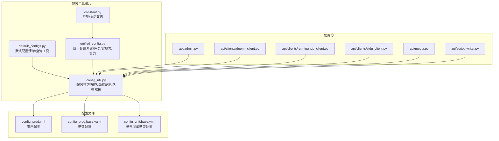
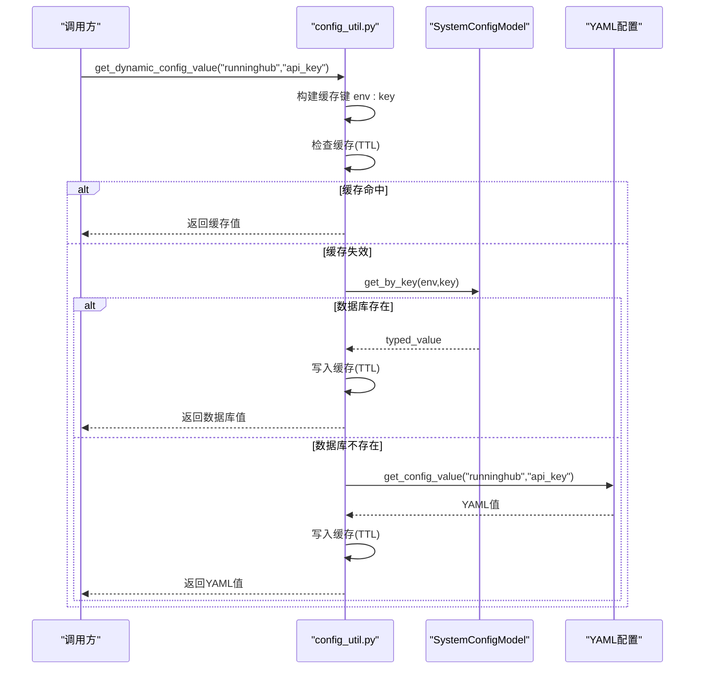
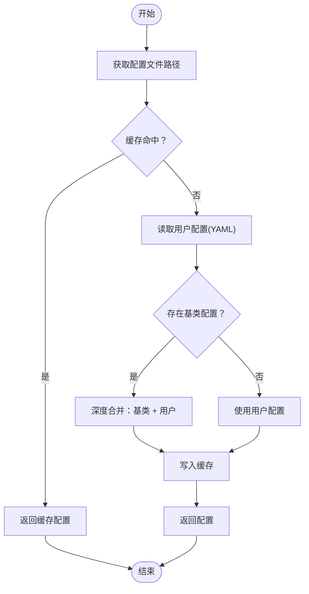
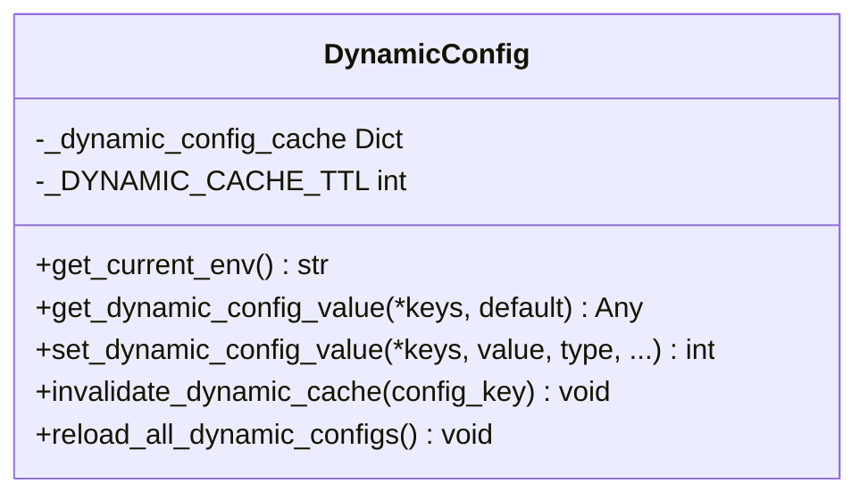
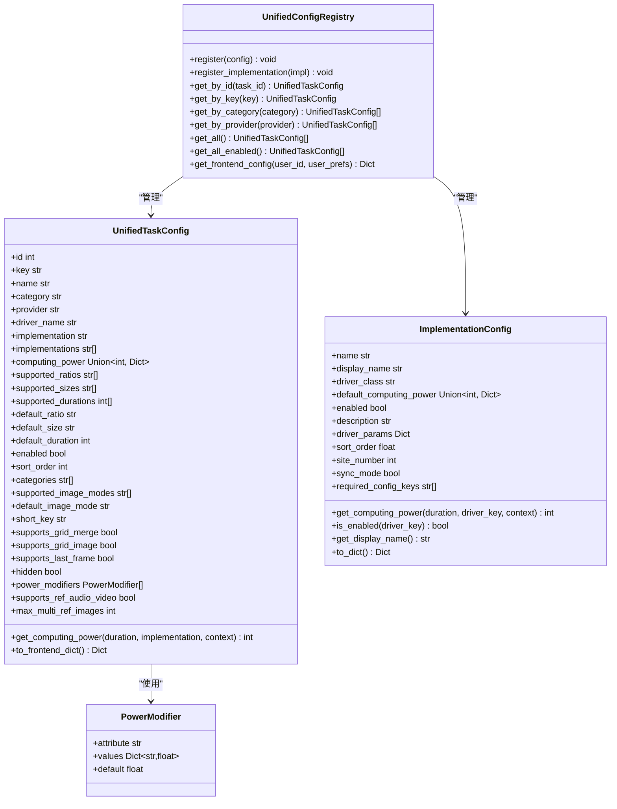
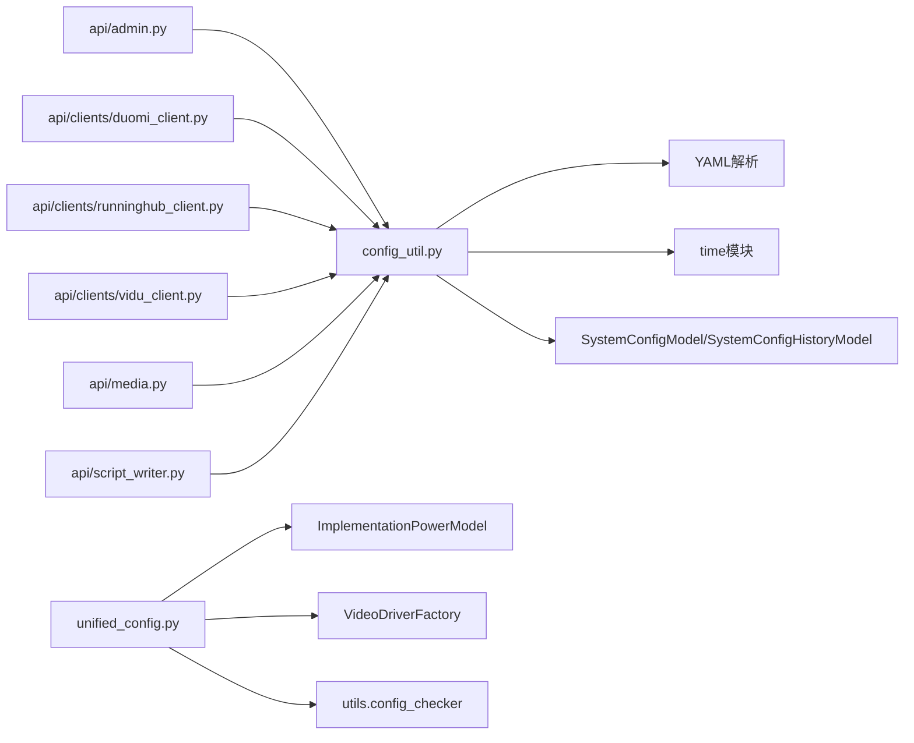

# 配置工具函数

<cite>
**本文档引用的文件**
- [config_util.py](file://config/config_util.py)
- [default_configs.py](file://config/default_configs.py)
- [unified_config.py](file://config/unified_config.py)
- [constant.py](file://config/constant.py)
- [config_prod.yml](file://config_prod.yml)
- [config_prod.base.yaml](file://config_prod.base.yaml)
- [config_unit.base.yml](file://config_unit.base.yml)
- [admin.py](file://api/admin.py)
- [duomi_client.py](file://api/clients/duomi_client.py)
- [runninghub_client.py](file://api/clients/runninghub_client.py)
- [vidu_client.py](file://api/clients/vidu_client.py)
- [media.py](file://api/media.py)
- [script_writer.py](file://api/script_writer.py)
- [test_implementation_config.py](file://tests/config/test_implementation_config.py)
</cite>

## 目录
1. [简介](#简介)
2. [项目结构](#项目结构)
3. [核心组件](#核心组件)
4. [架构总览](#架构总览)
5. [详细组件分析](#详细组件分析)
6. [依赖关系分析](#依赖关系分析)
7. [性能考虑](#性能考虑)
8. [故障排除指南](#故障排除指南)
9. [结论](#结论)
10. [附录](#附录)

## 简介
本文件系统性梳理配置工具函数模块，涵盖配置值获取、配置验证、配置合并、配置转换、默认配置管理、配置检查机制、配置格式化工具等能力。重点说明动态配置（数据库优先 + YAML 兜底）与静态配置（YAML 文件）的协同机制，以及统一配置系统如何整合任务类型、驱动、算力、模型参数等配置。文档提供 API 参考、使用示例、性能优化建议、最佳实践与常见使用模式，帮助开发者高效、安全地使用配置工具。

## 项目结构
配置工具相关的核心文件位于 config 目录，主要包含：
- config_util.py：配置读取、缓存、动态配置、路径解析等基础工具
- default_configs.py：默认可热更新配置清单与辅助查询工具
- unified_config.py：统一配置系统，整合任务类型、驱动、算力、实现方等配置
- constant.py：常量与向后兼容层，提供统一入口与常量定义
- 配置文件：config_prod.yml（用户配置）、config_prod.base.yaml（基类配置）

**图表来源**
- [config_util.py](file://config/config_util.py)
- [default_configs.py](file://config/default_configs.py)
- [unified_config.py](file://config/unified_config.py)
- [constant.py](file://config/constant.py)
- [config_prod.yml](file://config_prod.yml)
- [config_prod.base.yaml](file://config_prod.base.yaml)
- [config_unit.base.yml](file://config_unit.base.yml)
- [admin.py](file://api/admin.py)
- [duomi_client.py](file://api/clients/duomi_client.py)
- [runninghub_client.py](file://api/clients/runninghub_client.py)
- [vidu_client.py](file://api/clients/vidu_client.py)
- [media.py](file://api/media.py)
- [script_writer.py](file://api/script_writer.py)

**章节来源**
- [config_util.py](file://config/config_util.py)
- [default_configs.py](file://config/default_configs.py)
- [unified_config.py](file://config/unified_config.py)
- [constant.py](file://config/constant.py)

## 核心组件
- 配置读取与缓存：提供带缓存的配置文件读取、深度合并基类与用户配置的能力，支持 .yaml/.yml 两种后缀的基类文件。
- 配置值获取：支持多层级键路径的配置值读取，提供默认值兜底。
- 动态配置：优先从数据库读取，失败时回退到 YAML；内置内存缓存与 TTL 控制，支持热更新。
- 路径解析：解析可执行文件路径，支持绝对路径、相对路径与命令名。
- 统一配置系统：整合任务类型、驱动、算力、实现方等配置，提供前端友好格式输出。
- 默认配置管理：维护默认可热更新配置清单，提供查询、快速配置项筛选、初始化数据库等能力。
- 常量与向后兼容：提供常量定义与向后兼容层，逐步替换旧 API。

**章节来源**
- [config_util.py](file://config/config_util.py)
- [default_configs.py](file://config/default_configs.py)
- [unified_config.py](file://config/unified_config.py)
- [constant.py](file://config/constant.py)

## 架构总览
配置工具采用“静态配置 + 动态配置”的双轨架构：
- 静态配置：YAML 文件，首次读取后缓存，适合固定配置与数据库初始化前的配置。
- 动态配置：数据库优先，YAML 兜底，内存缓存 + TTL，适合需要热更新的配置项。
- 统一配置系统：面向业务的配置聚合层，负责任务类型、驱动、算力、实现方等复杂配置的组织与查询。

**图表来源**
- [config_util.py](file://config/config_util.py)

**章节来源**
- [config_util.py](file://config/config_util.py)

## 详细组件分析

### 配置读取与合并（config_util.py）
- 深度合并：将基类配置与用户配置进行深度合并，用户配置优先覆盖。
- 基类检测：根据用户配置文件名推导基类文件名，支持 .yaml/.yml 两种后缀。
- 缓存策略：全局字典缓存配置文件内容，首次读取后复用，避免重复 I/O。
- 环境识别：通过环境变量 comfyui_env 选择配置文件，支持 dev/prod 等环境。
- 开发环境判断：is_dev_environment 基于环境变量判断是否为开发环境。

**图表来源**
- [config_util.py](file://config/config_util.py)

**章节来源**
- [config_util.py](file://config/config_util.py)

### 配置值获取（config_util.py）
- get_config_value：支持多层级键路径，逐级访问字典，遇非字典或 None 返回默认值。
- 使用建议：优先使用 get_dynamic_config_value 获取动态配置，仅在数据库初始化前或不需要动态更新的场景使用 get_config_value。

**章节来源**
- [config_util.py](file://config/config_util.py)

### 动态配置（数据库优先 + YAML 兜底）
- get_dynamic_config_value：优先从数据库读取，失败回退到 YAML；内存缓存 + TTL（默认 30 秒）。
- set_dynamic_config_value：写入数据库，支持类型转换与历史记录；成功后清除相关缓存。
- invalidate_dynamic_cache：按配置键或全量清除缓存。
- reload_all_dynamic_configs：重新加载所有动态配置（清空缓存）。

**图表来源**
- [config_util.py](file://config/config_util.py)

**章节来源**
- [config_util.py](file://config/config_util.py)

### 路径解析（config_util.py）
- resolve_bin_path：支持绝对路径、相对路径（基于 app_dir）、命令名（依赖 PATH），返回最终路径或命令名。

**章节来源**
- [config_util.py](file://config/config_util.py)

### 统一配置系统（unified_config.py）
- 统一配置注册表：提供按 ID、key、分类、供应商、实现方等多种查询方式。
- 任务配置类：封装任务类型、分类、供应商、驱动、实现方、算力、修饰符、支持的尺寸/时长/比例等。
- 实现方配置类：封装实现方名称、显示名、驱动类、默认算力、启用状态、描述、排序、同步模式、所需配置键等。
- 前端配置导出：将内部配置转换为前端友好的格式，包含任务列表、分类、供应商、RunningHub 配置状态等。
- 算力修饰符：根据额外属性（如图像模式、分辨率）动态调整算力，支持按时长计费的任务。

**图表来源**
- [unified_config.py](file://config/unified_config.py)

**章节来源**
- [unified_config.py](file://config/unified_config.py)

### 默认配置管理（default_configs.py）
- 默认配置清单：包含大量可热更新配置项，涵盖版本空间、用户注册、任务队列、上传、前端、工作流、超时、测试模式、图片、各供应商 API Key、支付、LLM、文件存储、Sentry、媒体缓存、同步任务进程池、签到等。
- 查询工具：按 key 获取默认配置定义、获取所有 key、获取快速配置项列表。
- 初始化：将默认配置插入数据库（仅插入不存在的配置），支持指定更新人。

**章节来源**
- [default_configs.py](file://config/default_configs.py)

### 常量与向后兼容（constant.py）
- 向后兼容：提供旧 API 的 TaskTypeRegistry、Edition 等类，逐步替换为新的 UnifiedConfigRegistry。
- 常量定义：版本模式、任务类型、供应商、模型、通知、升级等常量。
- 文件路径常量：跨平台路径解析与目录创建工具。

**章节来源**
- [constant.py](file://config/constant.py)

## 依赖关系分析
- config_util.py 依赖：
  - YAML 解析：用于读取配置文件
  - 时间模块：用于动态配置缓存 TTL
  - 数据库模型：SystemConfigModel/SystemConfigHistoryModel（动态配置写入与历史记录）
- unified_config.py 依赖：
  - ImplementationPowerModel：实现方算力与启用状态查询
  - VideoDriverFactory：驱动注册检查
  - utils.config_checker：实现方配置存在性检查
- 使用方依赖：
  - api/admin.py、api/clients/*、api/media.py、api/script_writer.py 等广泛使用配置工具函数

**图表来源**
- [config_util.py](file://config/config_util.py)
- [unified_config.py](file://config/unified_config.py)
- [admin.py](file://api/admin.py)
- [duomi_client.py](file://api/clients/duomi_client.py)
- [runninghub_client.py](file://api/clients/runninghub_client.py)
- [vidu_client.py](file://api/clients/vidu_client.py)
- [media.py](file://api/media.py)
- [script_writer.py](file://api/script_writer.py)

**章节来源**
- [config_util.py](file://config/config_util.py)
- [unified_config.py](file://config/unified_config.py)
- [admin.py](file://api/admin.py)
- [duomi_client.py](file://api/clients/duomi_client.py)
- [runninghub_client.py](file://api/clients/runninghub_client.py)
- [vidu_client.py](file://api/clients/vidu_client.py)
- [media.py](file://api/media.py)
- [script_writer.py](file://api/script_writer.py)

## 性能考虑
- 配置缓存：config_util.py 对 YAML 配置与动态配置均采用缓存，减少重复 I/O 与数据库查询。
- 缓存 TTL：动态配置默认 30 秒 TTL，平衡实时性与性能。
- 深度合并：仅在首次加载基类与用户配置时执行，后续复用合并结果。
- 前端配置导出：统一配置系统对任务列表进行排序与用户偏好应用，避免每次请求重复计算。
- 建议：
  - 将高频读取的配置项纳入动态配置，利用缓存降低数据库压力。
  - 对大规模配置变更，使用 invalidate_dynamic_cache 或 reload_all_dynamic_configs 清理缓存。
  - 避免在热路径中频繁调用深度合并或大体量配置读取。

[本节为通用性能建议，无需特定文件引用]

## 故障排除指南
- 配置文件未找到：get_config 在找不到配置文件时抛出 FileNotFoundError，需确认配置文件路径与环境变量 comfyui_env。
- 基类配置缺失：_get_base_config_path 支持 .yaml/.yml 两种后缀，若项目根目录不存在基类文件，将仅使用用户配置。
- 动态配置回退：当数据库查询失败时自动回退到 YAML；若 YAML 也不存在，返回默认值。
- 缓存一致性：修改数据库配置后，使用 invalidate_dynamic_cache 清理相关缓存，或 reload_all_dynamic_configs 清空所有缓存。
- 路径解析异常：resolve_bin_path 对绝对路径、相对路径、命令名分别处理，确保返回合理路径或命令名。

**章节来源**
- [config_util.py](file://config/config_util.py)

## 结论
配置工具函数模块提供了从静态 YAML 到动态数据库的完整配置体系，结合统一配置系统实现了对任务类型、驱动、算力、实现方等复杂配置的集中管理。通过缓存与 TTL 机制，兼顾性能与热更新需求；通过基类合并与默认配置清单，确保配置的完整性与可维护性。建议在业务开发中优先使用动态配置，并配合统一配置系统进行前端渲染与算力计算，以获得最佳的可维护性与扩展性。

[本节为总结性内容，无需特定文件引用]

## 附录

### API 参考与使用示例

- 配置读取与合并
  - get_config(config_path=None)：获取配置（带缓存），支持基类与用户配置深度合并
  - get_config_path(config_path=None)：根据环境变量 comfyui_env 返回配置文件路径
  - is_dev_environment()：判断是否为开发环境
  - resolve_bin_path(config_path, app_dir)：解析可执行文件路径

- 配置值获取
  - get_config_value(*keys, default=None)：多层级键路径读取，返回默认值兜底
  - get_dynamic_config_value(*keys, default=None)：动态配置读取（数据库优先 + YAML 兜底）

- 动态配置管理
  - set_dynamic_config_value(*keys, value, value_type='string', ...)：写入数据库并记录历史
  - invalidate_dynamic_cache(config_key=None)：按配置键或全量清理缓存
  - reload_all_dynamic_configs()：重新加载所有动态配置

- 统一配置系统
  - UnifiedConfigRegistry：注册、查询、前端导出等
  - UnifiedTaskConfig：任务配置封装
  - ImplementationConfig：实现方配置封装
  - PowerModifier：算力修饰符

- 默认配置管理
  - DEFAULT_CONFIGS：默认可热更新配置清单
  - get_default_config_by_key(key)：按 key 获取默认配置定义
  - get_all_config_keys()：获取所有默认配置 key 列表
  - get_quick_configs()：获取快速配置项列表
  - init_default_configs(env, updated_by=None)：初始化默认配置到数据库

- 常量与向后兼容
  - Edition：版本模式判断与空间模式
  - FilePathConstants：文件路径与目录创建工具
  - 各类常量：任务状态、供应商、模型、通知、升级等

**章节来源**
- [config_util.py](file://config/config_util.py)
- [default_configs.py](file://config/default_configs.py)
- [unified_config.py](file://config/unified_config.py)
- [constant.py](file://config/constant.py)

### 使用场景与最佳实践
- 数据库初始化前的配置：使用 get_config_value 读取数据库连接等固定配置。
- 运行时热更新配置：使用 get_dynamic_config_value 读取，set_dynamic_config_value 写入，invalidate_dynamic_cache 清理缓存。
- 任务类型与实现方配置：通过 UnifiedConfigRegistry 获取，前端使用 get_frontend_config 输出。
- 路径解析：使用 resolve_bin_path 处理可执行文件路径，确保跨平台兼容。
- 默认配置初始化：使用 init_default_configs 将默认配置注入数据库，便于后台管理。

**章节来源**
- [config_util.py](file://config/config_util.py)
- [unified_config.py](file://config/unified_config.py)
- [default_configs.py](file://config/default_configs.py)

### 配置文件示例
- 用户配置：config_prod.yml（生产环境）
- 基类配置：config_prod.base.yaml（与用户配置同名前缀）
- 单元测试基类：config_unit.base.yml

**章节来源**
- [config_prod.yml](file://config_prod.yml)
- [config_prod.base.yaml](file://config_prod.base.yaml)
- [config_unit.base.yml](file://config_unit.base.yml)

### 实际使用示例（摘自项目代码）
- 管理端读取动态配置：api/admin.py 中使用 get_dynamic_config_value 获取聚合站点名称
- 客户端读取令牌与测试模式：api/clients/duomi_client.py、api/clients/runninghub_client.py、api/clients/vidu_client.py
- 媒体模块路径解析：api/media.py 使用 resolve_bin_path 与 get_config_path
- 脚本写作模块 LLM 配置：api/script_writer.py 使用 get_dynamic_config_value 获取 LLM 配置

**章节来源**
- [admin.py](file://api/admin.py)
- [duomi_client.py](file://api/clients/duomi_client.py)
- [runninghub_client.py](file://api/clients/runninghub_client.py)
- [vidu_client.py](file://api/clients/vidu_client.py)
- [media.py](file://api/media.py)
- [script_writer.py](file://api/script_writer.py)