# 配置策略管理

<cite>
**本文档引用的文件**
- [config/strategy/edition_strategy.py](file://config/strategy/edition_strategy.py)
- [config/unified_config.py](file://config/unified_config.py)
- [config/constant.py](file://config/constant.py)
- [config/config_util.py](file://config/config_util.py)
- [config/default_configs.py](file://config/default_configs.py)
- [config/version.py](file://config/version.py)
- [services/edition_auth_service.py](file://services/edition_auth_service.py)
- [model/system_config.py](file://model/system_config.py)
- [model/system_config_history.py](file://model/system_config_history.py)
- [model/implementation_power.py](file://model/implementation_power.py)
- [task/visual_drivers/driver_factory.py](file://task/visual_drivers/driver_factory.py)
</cite>

## 目录
1. [简介](#简介)
2. [项目结构](#项目结构)
3. [核心组件](#核心组件)
4. [架构概览](#架构概览)
5. [详细组件分析](#详细组件分析)
6. [依赖分析](#依赖分析)
7. [性能考虑](#性能考虑)
8. [故障排除指南](#故障排除指南)
9. [结论](#结论)
10. [附录](#附录)

## 简介

配置策略管理系统是 ComfyUI Server 的核心基础设施，负责管理企业版和社区版之间的配置差异、功能开关和版本兼容性。该系统采用策略模式设计，通过 EditionStrategy 类实现版本特定的配置策略，支持动态配置热更新和多版本兼容。

系统主要解决以下关键问题：
- 版本差异管理（社区版 vs 商业版）
- 功能开关控制和权限验证
- 配置继承和优先级处理
- 动态配置热更新机制
- API 聚合站点的版本控制

## 项目结构

配置策略管理相关的文件组织遵循清晰的层次结构：

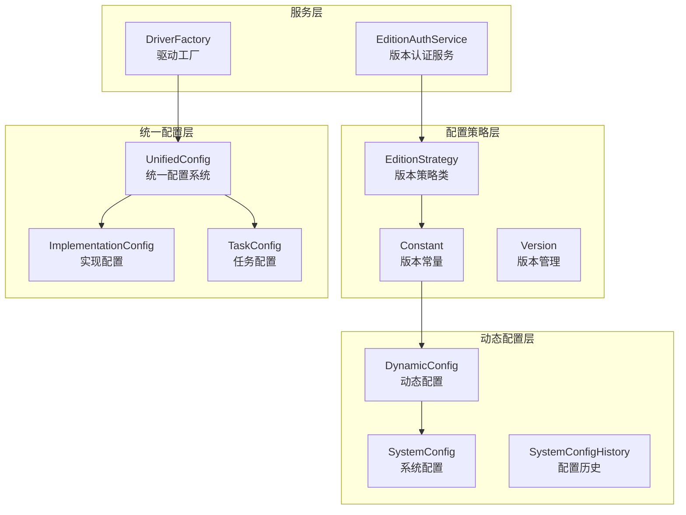

**图表来源**
- [config/strategy/edition_strategy.py:19-61](file://config/strategy/edition_strategy.py:19-61)
- [config/unified_config.py:282-791](file://config/unified_config.py:282-791)
- [config/constant.py:78-121](file://config/constant.py:78-121)

**章节来源**
- [config/strategy/edition_strategy.py:1-61](file://config/strategy/edition_strategy.py:1-61)
- [config/unified_config.py:1-800](file://config/unified_config.py:1-800)
- [config/constant.py:1-651](file://config/constant.py:1-651)

## 核心组件

### EditionStrategy 类设计

EditionStrategy 是配置策略系统的核心，实现了版本特定的策略模式：

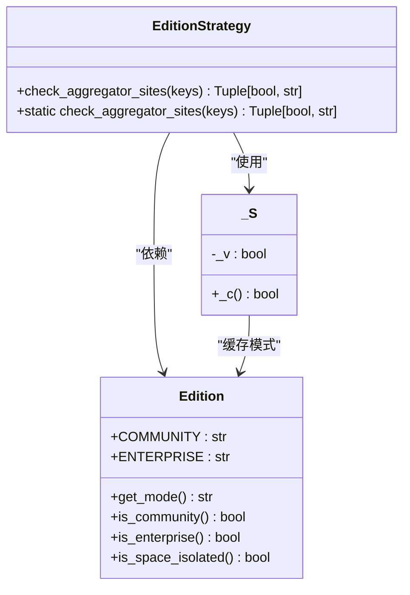

**图表来源**
- [config/strategy/edition_strategy.py:19-61](file://config/strategy/edition_strategy.py:19-61)
- [config/constant.py:78-121](file://config/constant.py:78-121)

### 统一配置系统

UnifiedConfig 系统提供了统一的任务配置管理：

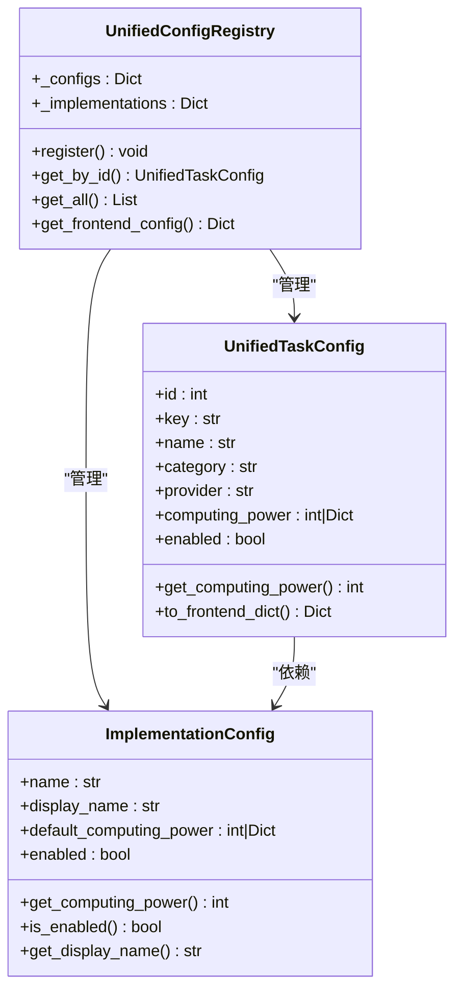

**图表来源**
- [config/unified_config.py:240-791](file://config/unified_config.py:240-791)

**章节来源**
- [config/strategy/edition_strategy.py:19-61](file://config/strategy/edition_strategy.py:19-61)
- [config/unified_config.py:240-791](file://config/unified_config.py:240-791)

## 架构概览

配置策略管理系统采用分层架构设计，确保版本兼容性和功能扩展性：

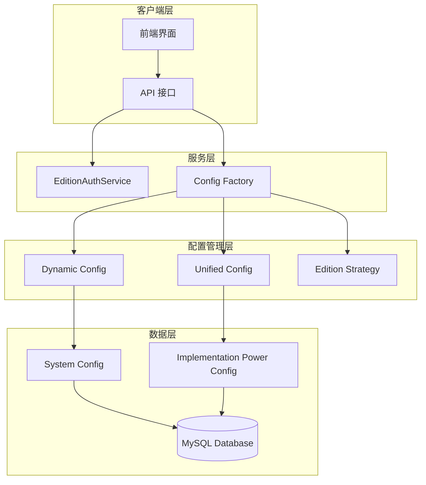

**图表来源**
- [services/edition_auth_service.py:21-156](file://services/edition_auth_service.py:21-156)
- [config/config_util.py:273-433](file://config/config_util.py:273-433)
- [config/unified_config.py:482-791](file://config/unified_config.py:482-791)

## 详细组件分析

### 版本策略管理

#### EditionStrategy 核心机制

EditionStrategy 类实现了版本特定的策略控制：

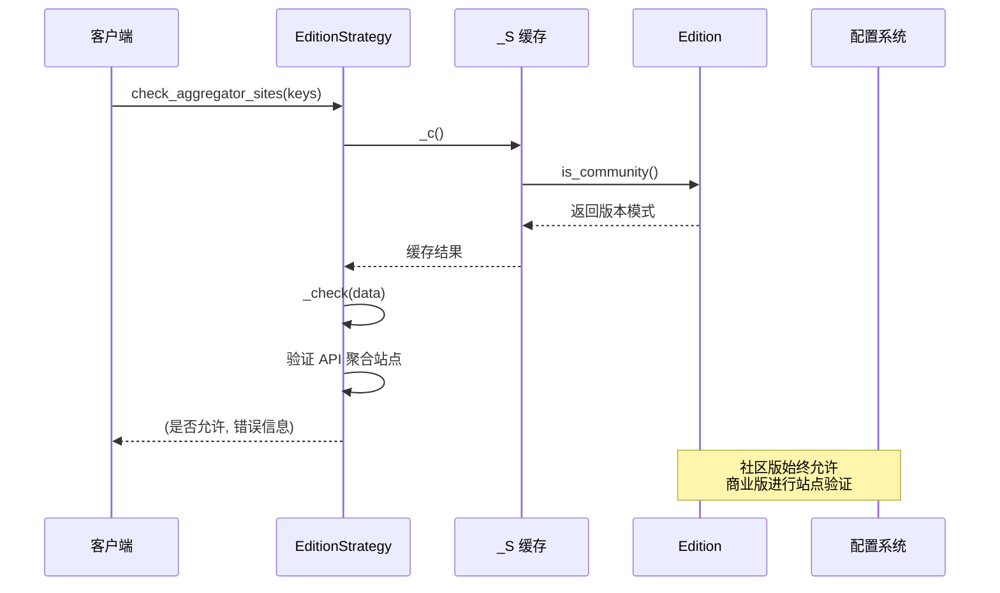

**图表来源**
- [config/strategy/edition_strategy.py:26-57](file://config/strategy/edition_strategy.py:26-57)
- [config/strategy/edition_strategy.py:8-16](file://config/strategy/edition_strategy.py:8-16)

#### 版本模式检测流程

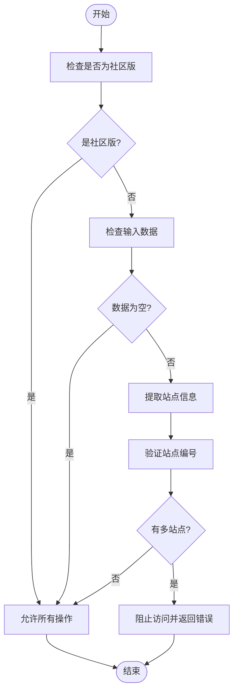

**图表来源**
- [config/strategy/edition_strategy.py:30-57](file://config/strategy/edition_strategy.py:30-57)

**章节来源**
- [config/strategy/edition_strategy.py:19-61](file://config/strategy/edition_strategy.py:19-61)

### 动态配置系统

#### 配置优先级机制

动态配置系统实现了数据库优先的配置加载策略：

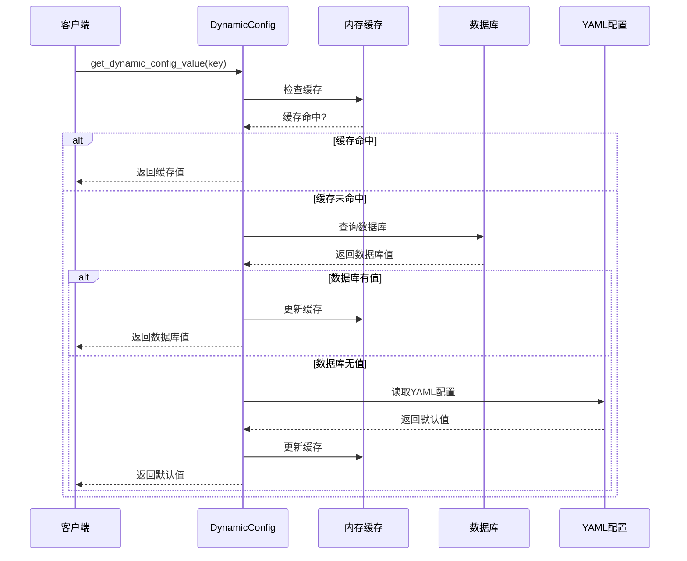

**图表来源**
- [config/config_util.py:273-329](file://config/config_util.py:273-329)

#### 配置热更新机制

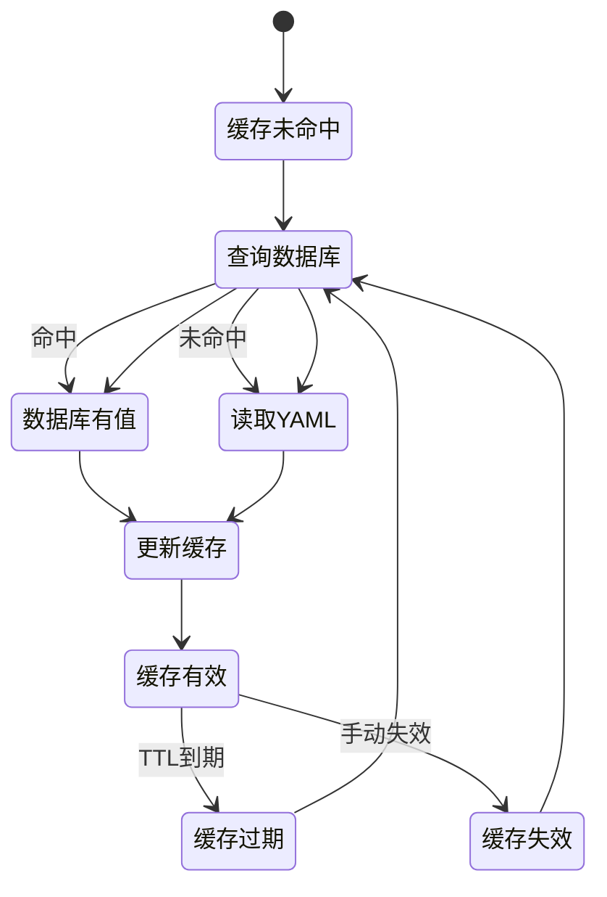

**图表来源**
- [config/config_util.py:256-329](file://config/config_util.py:256-329)

**章节来源**
- [config/config_util.py:254-433](file://config/config_util.py:254-433)

### 统一配置管理

#### 配置继承和优先级

UnifiedConfig 系统实现了多层次的配置继承机制：

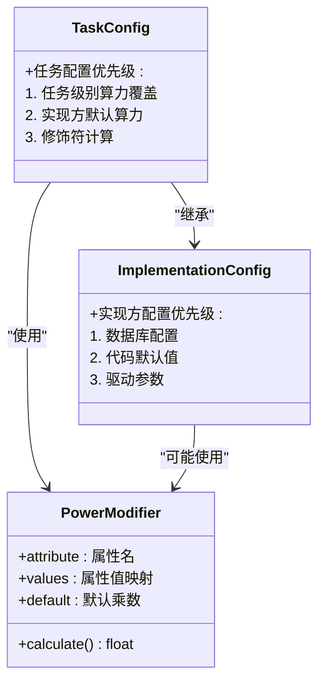

**图表来源**
- [config/unified_config.py:95-180](file://config/unified_config.py:95-180)
- [config/unified_config.py:295-346](file://config/unified_config.py:295-346)

#### 前端配置生成流程

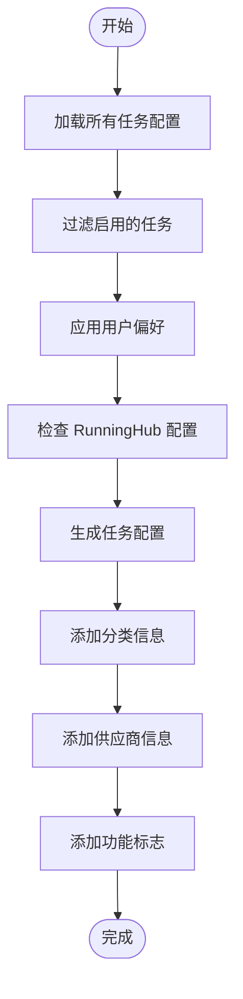

**图表来源**
- [config/unified_config.py:659-717](file://config/unified_config.py:659-717)

**章节来源**
- [config/unified_config.py:240-791](file://config/unified_config.py:240-791)

### 版本认证服务

#### EditionAuthService 工作流程

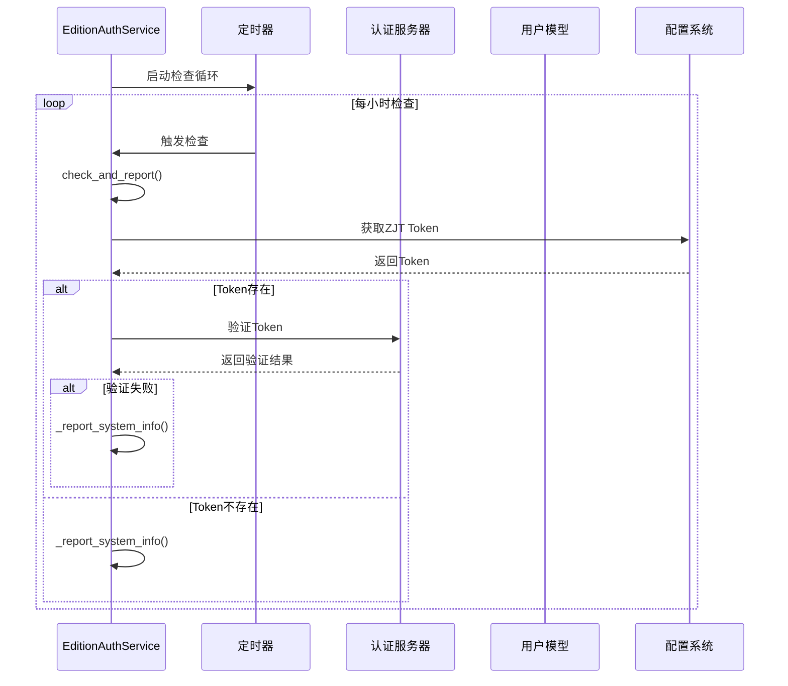

**图表来源**
- [services/edition_auth_service.py:27-107](file://services/edition_auth_service.py:27-107)

**章节来源**
- [services/edition_auth_service.py:21-156](file://services/edition_auth_service.py:21-156)

## 依赖分析

### 组件耦合关系

配置策略管理系统展现了良好的模块化设计：

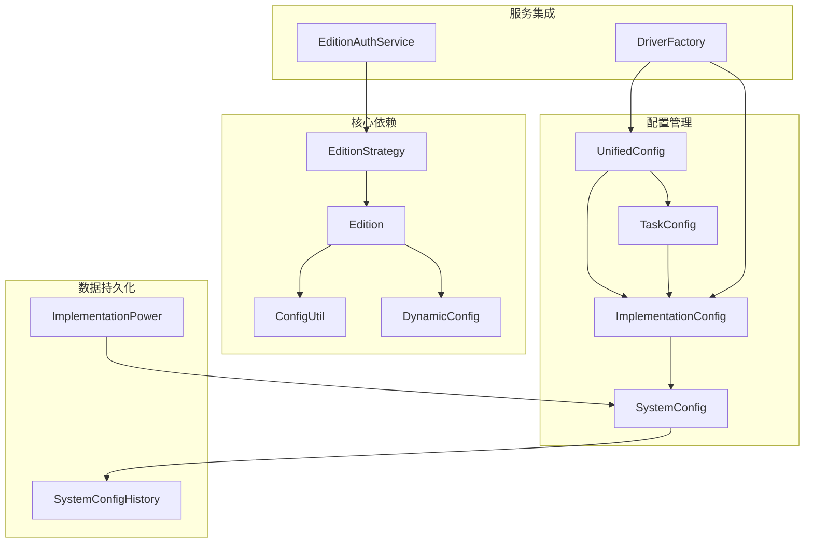

**图表来源**
- [config/strategy/edition_strategy.py:8-16](file://config/strategy/edition_strategy.py:8-16)
- [config/unified_config.py:482-530](file://config/unified_config.py:482-530)

### 版本兼容性矩阵

| 功能特性 | 社区版 | 商业版 | 兼容性 |
|---------|--------|--------|--------|
| API 聚合站点 | 限制为 site_1 | 支持 site_0-site_5 | 降级兼容 |
| 空间模式 | 共享空间 | 可配置共享/独立 | 动态切换 |
| 认证服务 | 无 | 远程认证 | 版本特定 |
| 配置热更新 | 基础支持 | 完整支持 | 一致行为 |

**章节来源**
- [config/constant.py:108-121](file://config/constant.py:108-121)
- [config/strategy/edition_strategy.py:30-57](file://config/strategy/edition_strategy.py:30-57)

## 性能考虑

### 缓存策略优化

系统采用了多层缓存机制来提升性能：

1. **配置缓存**：动态配置使用 30 秒 TTL 缓存
2. **版本模式缓存**：Edition 模式使用单例缓存
3. **数据库查询缓存**：实现方配置结果缓存

### 查询优化

- 使用索引优化配置查询
- 批量加载配置减少数据库往返
- 懒加载机制避免不必要的初始化

## 故障排除指南

### 常见问题诊断

#### 版本认证失败

**症状**：商业版功能受限或无法使用

**排查步骤**：
1. 检查 ZJT Token 配置
2. 验证网络连接到认证服务器
3. 查看认证服务日志

#### 配置热更新失效

**症状**：修改配置后未生效

**排查步骤**：
1. 检查配置缓存是否过期
2. 验证数据库连接
3. 确认配置键格式正确

#### API 聚合站点限制

**症状**：多站点配置被拒绝

**排查步骤**：
1. 检查站点编号格式
2. 验证版本模式设置
3. 确认社区版限制

**章节来源**
- [services/edition_auth_service.py:82-107](file://services/edition_auth_service.py:82-107)
- [config/config_util.py:407-433](file://config/config_util.py:407-433)

## 结论

配置策略管理系统通过策略模式和分层架构设计，成功实现了企业版和社区版的差异化管理。系统的关键优势包括：

1. **灵活的版本控制**：通过 EditionStrategy 实现精确的版本差异控制
2. **动态配置管理**：支持数据库优先的配置热更新机制
3. **强大的扩展性**：统一配置系统支持新功能的无缝集成
4. **完善的监控机制**：版本认证服务确保商业版合规使用

该系统为企业级部署提供了可靠的技术基础，支持复杂的企业需求和多版本兼容性要求。

## 附录

### 配置策略使用示例

#### 基本配置加载

```python
# 获取动态配置（数据库优先）
config_value = get_dynamic_config_value('runninghub', 'api_key')

# 获取版本模式
edition_mode = Edition.get_mode()

# 检查聚合站点权限
is_allowed, message = check_aggregator_sites(['api_aggregator.site_2'])
```

#### 自定义策略开发

1. **创建新的策略类**：继承现有策略模式
2. **实现版本特定逻辑**：在策略类中添加版本判断
3. **注册策略钩子**：在适当的位置调用新策略
4. **测试和验证**：确保策略在不同版本下正常工作

#### 最佳实践

1. **配置优先级**：始终遵循数据库 > YAML > 默认值的优先级
2. **缓存管理**：合理使用缓存机制提升性能
3. **错误处理**：实现优雅的降级机制
4. **监控告警**：建立完整的配置变更监控体系