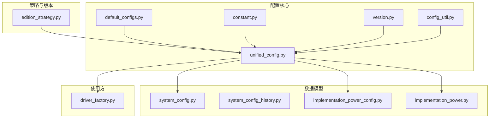
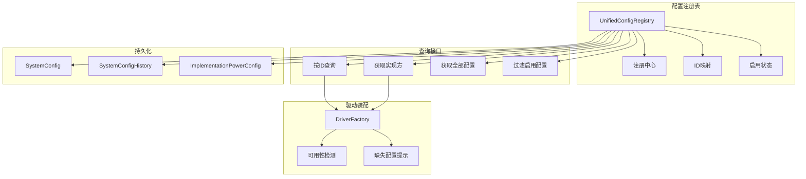
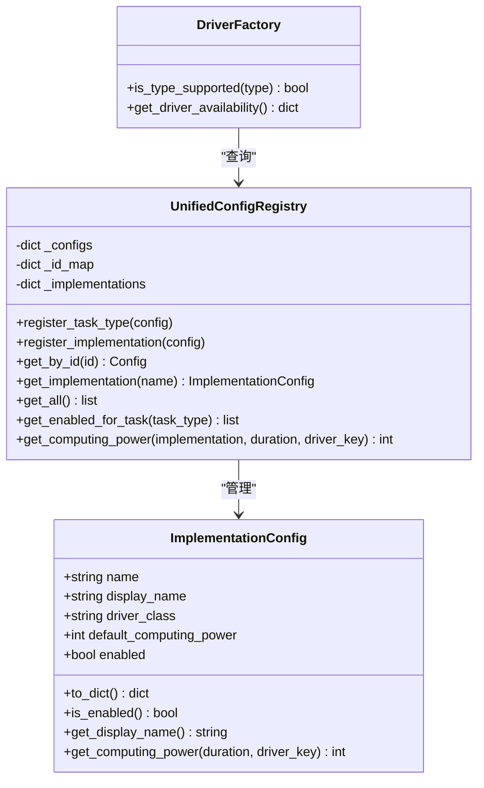
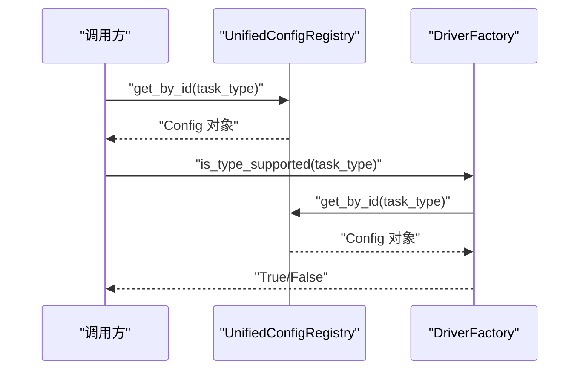
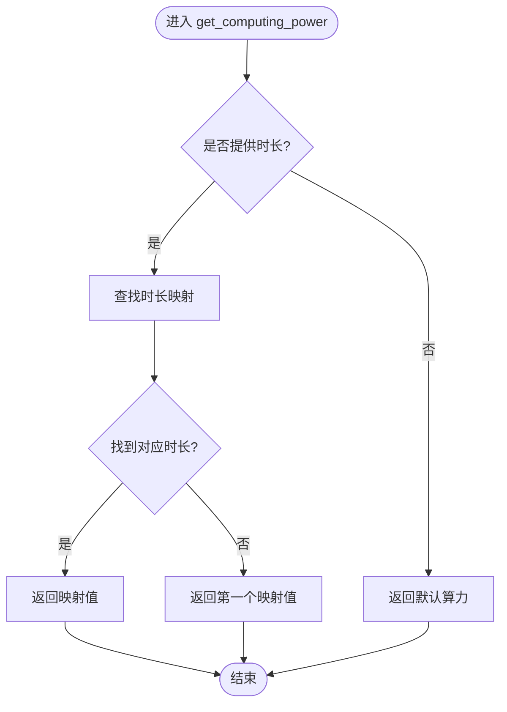
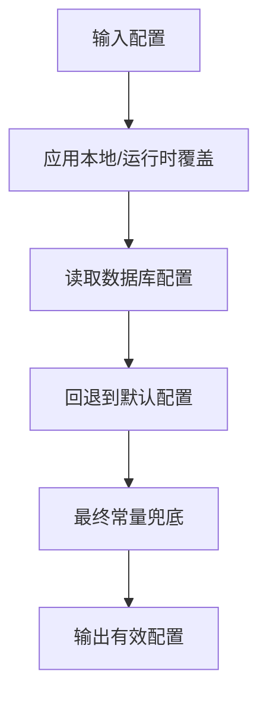
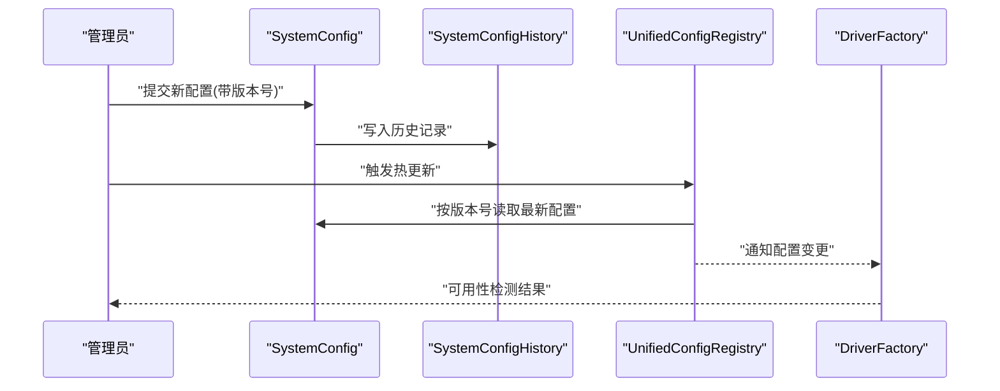
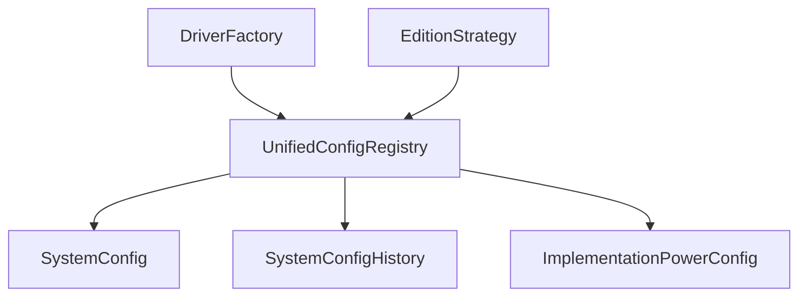

# 配置管理系统

<cite>
**本文档引用的文件**
- [unified_config.py](file://config/unified_config.py)
- [default_configs.py](file://config/default_configs.py)
- [constant.py](file://config/constant.py)
- [version.py](file://config/version.py)
- [config_util.py](file://config/config_util.py)
- [edition_strategy.py](file://config/strategy/edition_strategy.py)
- [system_config.py](file://model/system_config.py)
- [system_config_history.py](file://model/system_config_history.py)
- [implementation_power_config.py](file://model/implementation_power_config.py)
- [implementation_power.py](file://model/implementation_power.py)
- [driver_factory.py](file://task/visual_drivers/driver_factory.py)
- [test_implementation_config.py](file://tests/config/test_implementation_config.py)
- [unified_config_system.md](file://docs/backend/unified_config_system.md)
</cite>

## 目录
1. [简介](#简介)
2. [项目结构](#项目结构)
3. [核心组件](#核心组件)
4. [架构总览](#架构总览)
5. [详细组件分析](#详细组件分析)
6. [依赖关系分析](#依赖关系分析)
7. [性能考虑](#性能考虑)
8. [故障排除指南](#故障排除指南)
9. [结论](#结论)
10. [附录](#附录)

## 简介
本文件系统性梳理 ZhiJuTong 配置管理系统的统一配置注册表设计与实现，涵盖配置项定义、验证、热更新与版本管理；任务类型配置、实现方配置、环境配置的管理方式；配置驱动开发模式如何实现功能的灵活扩展与动态调整；配置项优先级规则、默认值处理与验证机制；最佳实践、常见配置场景与故障排除方法；以及企业版与标准版的差异化配置策略。

## 项目结构
配置管理相关代码主要集中在以下位置：
- 配置核心：config/unified_config.py、config/default_configs.py、config/constant.py、config/version.py、config/config_util.py
- 策略与版本：config/strategy/edition_strategy.py、config/version.py
- 数据模型：model/system_config.py、model/system_config_history.py、model/implementation_power_config.py、model/implementation_power.py
- 使用方：task/visual_drivers/driver_factory.py
- 测试：tests/config/test_implementation_config.py
- 文档：docs/backend/unified_config_system.md

**图表来源**
- [unified_config.py](file://config/unified_config.py)
- [default_configs.py](file://config/default_configs.py)
- [constant.py](file://config/constant.py)
- [version.py](file://config/version.py)
- [config_util.py](file://config/config_util.py)
- [edition_strategy.py](file://config/strategy/edition_strategy.py)
- [system_config.py](file://model/system_config.py)
- [system_config_history.py](file://model/system_config_history.py)
- [implementation_power_config.py](file://model/implementation_power_config.py)
- [implementation_power.py](file://model/implementation_power.py)
- [driver_factory.py](file://task/visual_drivers/driver_factory.py)

**章节来源**
- [unified_config.py](file://config/unified_config.py)
- [default_configs.py](file://config/default_configs.py)
- [constant.py](file://config/constant.py)
- [version.py](file://config/version.py)
- [config_util.py](file://config/config_util.py)
- [edition_strategy.py](file://config/strategy/edition_strategy.py)
- [system_config.py](file://model/system_config.py)
- [system_config_history.py](file://model/system_config_history.py)
- [implementation_power_config.py](file://model/implementation_power_config.py)
- [implementation_power.py](file://model/implementation_power.py)
- [driver_factory.py](file://task/visual_drivers/driver_factory.py)

## 核心组件
- 统一配置注册表：负责集中管理任务类型、实现方、环境等配置，提供注册、查询、热更新与版本控制能力。
- 默认配置与常量：提供系统默认值与常量定义，作为配置优先级链路的基础层。
- 版本与策略：通过版本号与策略模块实现配置演进与企业版/标准版差异化。
- 数据模型：系统配置表、历史记录表、实现方算力配置表等，支撑持久化与审计。
- 驱动工厂：基于统一配置注册表动态选择与装配具体实现方驱动。

**章节来源**
- [unified_config.py](file://config/unified_config.py)
- [default_configs.py](file://config/default_configs.py)
- [constant.py](file://config/constant.py)
- [version.py](file://config/version.py)
- [edition_strategy.py](file://config/strategy/edition_strategy.py)
- [system_config.py](file://model/system_config.py)
- [system_config_history.py](file://model/system_config_history.py)
- [implementation_power_config.py](file://model/implementation_power_config.py)
- [implementation_power.py](file://model/implementation_power.py)
- [driver_factory.py](file://task/visual_drivers/driver_factory.py)

## 架构总览
统一配置注册表采用“注册+查询+驱动装配”的分层架构：
- 注册层：集中注册任务类型、实现方、环境配置，维护 ID 映射与启用状态。
- 查询层：提供按 ID/名称检索、启用过滤、默认值回退、算力映射解析等功能。
- 驱动层：根据配置动态选择具体实现方驱动，支持可用性检测与缺失配置提示。
- 持久化层：系统配置与历史记录，支持版本化变更与回滚。
- 策略层：企业版/标准版差异化配置策略，影响可用能力与默认行为。

**图表来源**
- [unified_config.py](file://config/unified_config.py)
- [driver_factory.py](file://task/visual_drivers/driver_factory.py)
- [system_config.py](file://model/system_config.py)
- [system_config_history.py](file://model/system_config_history.py)
- [implementation_power_config.py](file://model/implementation_power_config.py)

## 详细组件分析

### 统一配置注册表（UnifiedConfigRegistry）
- 职责
  - 集中注册与管理任务类型、实现方、环境配置。
  - 提供按 ID/名称检索、启用过滤、默认值回退、算力映射解析。
  - 支持热更新与版本控制，配合历史表实现审计与回滚。
- 关键能力
  - 注册与查询：register_*、get_by_id、get_all、get_implementation。
  - 启用控制：is_enabled/is_enabled_for_task，支持全局与任务粒度。
  - 算力解析：get_computing_power，支持按时长映射与数据库覆盖。
  - 热更新：结合版本号与历史表，实现配置变更的平滑过渡。
- 设计要点
  - 单例式注册中心，内部维护 _configs、_id_map、_implementations 等结构。
  - 与驱动工厂解耦，仅暴露稳定查询接口，避免业务侧直接依赖底层存储细节。

**图表来源**
- [unified_config.py](file://config/unified_config.py)
- [driver_factory.py](file://task/visual_drivers/driver_factory.py)

**章节来源**
- [unified_config.py](file://config/unified_config.py)
- [driver_factory.py](file://task/visual_drivers/driver_factory.py)

### 任务类型配置
- 定义与注册
  - 通过 register_task_type 将任务类型配置注册到注册表，包含任务 ID、名称、描述、默认实现等元信息。
- 查询与过滤
  - get_by_id 返回完整配置对象；get_enabled_for_task 过滤启用的任务类型。
- 驱动装配
  - DriverFactory.is_type_supported 依据配置判断任务类型是否可执行，并联动可用性检测。

**图表来源**
- [unified_config.py](file://config/unified_config.py)
- [driver_factory.py](file://task/visual_drivers/driver_factory.py)

**章节来源**
- [unified_config.py](file://config/unified_config.py)
- [driver_factory.py](file://task/visual_drivers/driver_factory.py)

### 实现方配置（ImplementationConfig）
- 字段与语义
  - 名称、显示名、驱动类、默认算力、启用状态、描述等。
- 算力映射与覆盖
  - 支持按时长映射算力；当传入 driver_key 时，可通过数据库覆盖值进行精确计算。
- 注册与查询
  - register_implementation 注册；get_implementation 获取；to_dict 序列化。
- 测试验证
  - 单测覆盖了注册、启用状态、算力映射、数据库覆盖等关键路径。

**图表来源**
- [unified_config.py](file://config/unified_config.py)
- [test_implementation_config.py](file://tests/config/test_implementation_config.py)

**章节来源**
- [unified_config.py](file://config/unified_config.py)
- [test_implementation_config.py](file://tests/config/test_implementation_config.py)

### 环境配置与默认值处理
- 默认配置来源
  - default_configs.py 提供系统默认配置，作为优先级链路的最底层。
- 常量与版本
  - constant.py 定义系统常量；version.py 提供版本号，用于配置演进与兼容性判断。
- 配置优先级
  - 本地/运行时覆盖 > 数据库配置 > 默认配置 > 常量兜底。
- 验证机制
  - config_util.py 提供通用校验工具，确保配置在注册与更新时满足约束。

**图表来源**
- [default_configs.py](file://config/default_configs.py)
- [constant.py](file://config/constant.py)
- [version.py](file://config/version.py)
- [config_util.py](file://config/config_util.py)

**章节来源**
- [default_configs.py](file://config/default_configs.py)
- [constant.py](file://config/constant.py)
- [version.py](file://config/version.py)
- [config_util.py](file://config/config_util.py)

### 热更新与版本管理
- 版本号与策略
  - version.py 提供版本标识；edition_strategy.py 定义企业版/标准版差异策略。
- 历史记录
  - system_config_history.py 记录配置变更历史，支持审计与回滚。
- 热更新流程
  - 新版本配置写入数据库；注册表按版本号加载；驱动工厂感知变化并重新装配。

**图表来源**
- [system_config.py](file://model/system_config.py)
- [system_config_history.py](file://model/system_config_history.py)
- [unified_config.py](file://config/unified_config.py)
- [edition_strategy.py](file://config/strategy/edition_strategy.py)

**章节来源**
- [system_config.py](file://model/system_config.py)
- [system_config_history.py](file://model/system_config_history.py)
- [unified_config.py](file://config/unified_config.py)
- [edition_strategy.py](file://config/strategy/edition_strategy.py)

### 配置驱动开发模式
- 动态装配
  - DriverFactory 根据配置动态选择实现方驱动，无需硬编码依赖。
- 可插拔扩展
  - 新增实现方只需注册 ImplementationConfig，即可被系统识别与调度。
- 可观测性
  - get_driver_availability 提供缺失配置清单，便于快速定位问题。

**图表来源**
- [driver_factory.py](file://task/visual_drivers/driver_factory.py)
- [unified_config.py](file://config/unified_config.py)

**章节来源**
- [driver_factory.py](file://task/visual_drivers/driver_factory.py)
- [unified_config.py](file://config/unified_config.py)

## 依赖关系分析
- 组件耦合
  - UnifiedConfigRegistry 与 DriverFactory 解耦，通过稳定接口交互。
  - 数据模型与注册表松耦合，通过查询接口访问，避免直接依赖 ORM。
- 外部依赖
  - 数据库：SystemConfig、SystemConfigHistory、ImplementationPowerConfig。
  - 策略模块：EditionStrategy 影响配置可用性与默认值。
- 循环依赖风险
  - 通过接口抽象与延迟导入降低循环依赖风险。

**图表来源**
- [unified_config.py](file://config/unified_config.py)
- [system_config.py](file://model/system_config.py)
- [system_config_history.py](file://model/system_config_history.py)
- [implementation_power_config.py](file://model/implementation_power_config.py)
- [driver_factory.py](file://task/visual_drivers/driver_factory.py)
- [edition_strategy.py](file://config/strategy/edition_strategy.py)

**章节来源**
- [unified_config.py](file://config/unified_config.py)
- [system_config.py](file://model/system_config.py)
- [system_config_history.py](file://model/system_config_history.py)
- [implementation_power_config.py](file://model/implementation_power_config.py)
- [driver_factory.py](file://task/visual_drivers/driver_factory.py)
- [edition_strategy.py](file://config/strategy/edition_strategy.py)

## 性能考虑
- 查询优化
  - 使用 ID 映射与缓存减少重复查询开销。
- 算力计算
  - 时长映射与数据库覆盖需避免频繁 IO，建议在注册表层做内存缓存。
- 热更新
  - 批量更新时采用事务与版本号控制，减少并发冲突。
- 驱动装配
  - 预热常用驱动，避免首次请求抖动。

## 故障排除指南
- 常见问题
  - 实现方不可用：检查 get_driver_availability 缺失配置清单，补齐密钥或参数。
  - 算力异常：核对时长映射与数据库覆盖值，确认 driver_key 传递正确。
  - 配置未生效：确认版本号与历史记录，检查热更新流程是否完成。
- 排查步骤
  - 通过单测用例定位问题点：如实现方注册、启用状态、算力映射、数据库覆盖等。
  - 检查注册表状态与 ID 映射，确保配置已正确注册。
  - 对比默认配置与实际配置，确认覆盖顺序符合预期。

**章节来源**
- [test_implementation_config.py](file://tests/config/test_implementation_config.py)
- [driver_factory.py](file://task/visual_drivers/driver_factory.py)
- [unified_config.py](file://config/unified_config.py)

## 结论
ZhiJuTong 配置管理系统以统一配置注册表为核心，实现了配置项的集中管理、灵活扩展与动态调整。通过明确的优先级链路、完善的验证与热更新机制、以及企业版/标准版差异化策略，系统在保证稳定性的同时提供了强大的可配置性与可运维性。建议在生产环境中结合版本号与历史记录做好变更审计，并通过驱动工厂的可用性检测提升可观测性。

## 附录
- 最佳实践
  - 明确配置优先级：本地覆盖 > 数据库 > 默认 > 常量。
  - 使用版本号管理配置演进，保留历史记录以便回滚。
  - 在新增实现方时，同步完善默认算力映射与可用性检测。
- 常见场景
  - 新增任务类型：注册任务类型配置，绑定默认实现方。
  - 调整算力策略：通过时长映射与数据库覆盖实现精细化定价。
  - 企业版定制：利用策略模块调整默认值与可用能力。
- 相关文档
  - 后端统一配置系统设计文档：docs/backend/unified_config_system.md