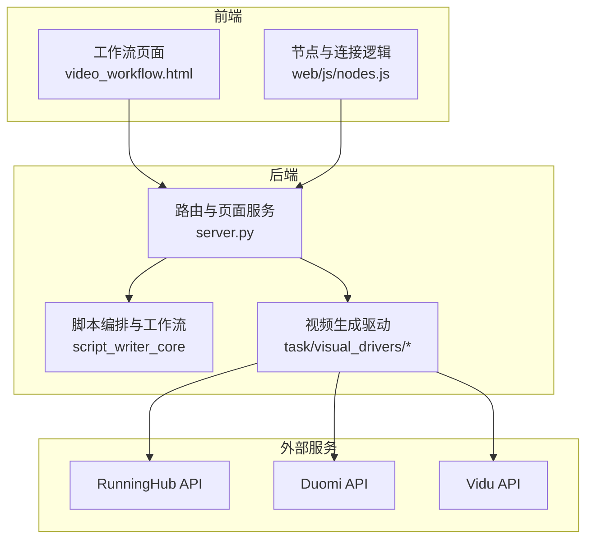
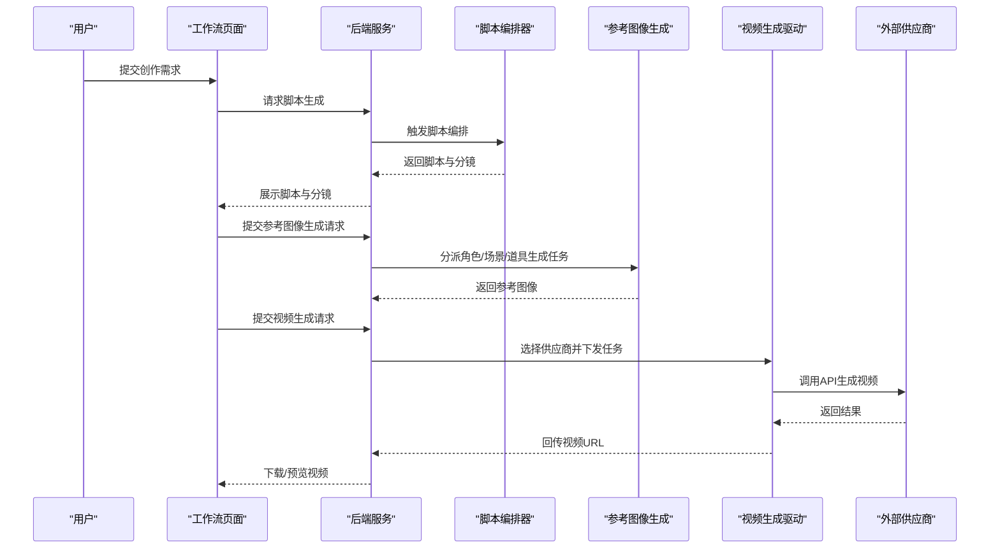
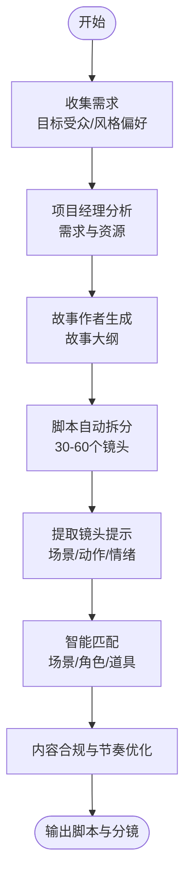
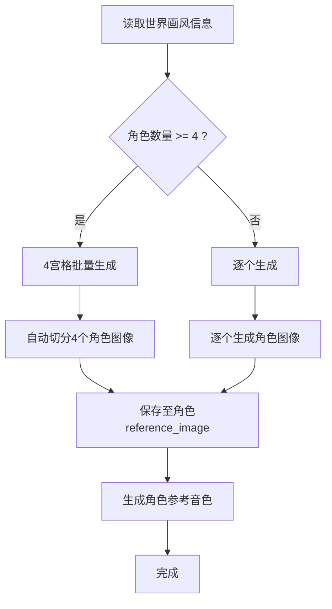
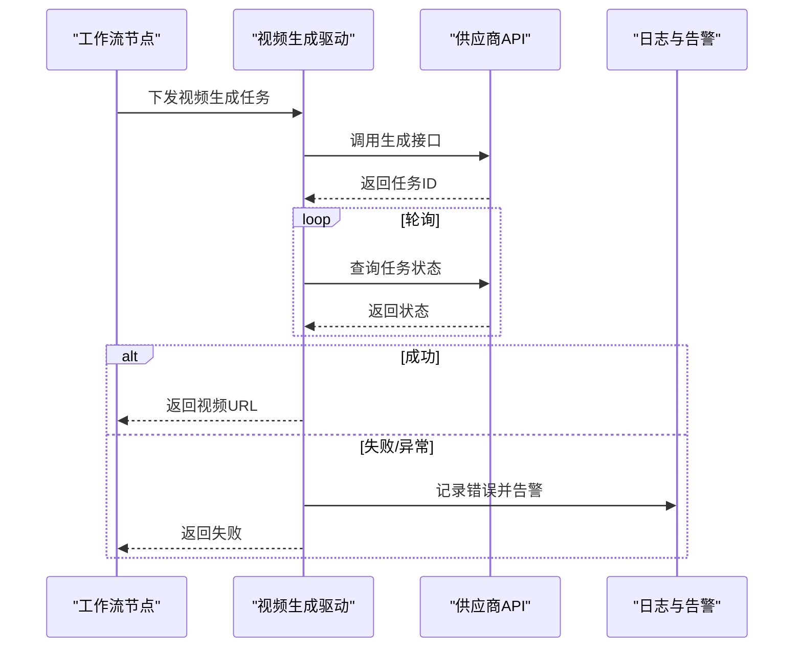
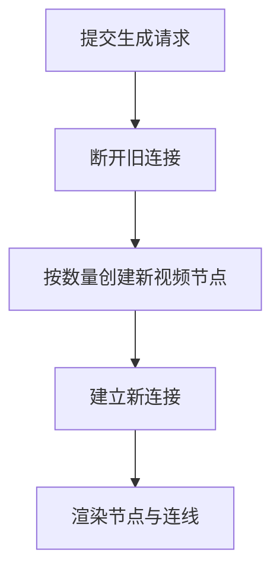
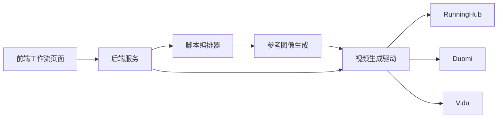

# 完整生产流程

<cite>
**本文引用的文件**
- [README_EN.md](file://README_EN.md)
- [server.py](file://server.py)
- [nodes.js](file://web/js/nodes.js)
- [SKILL.md（角色形象设计师）](file://script_writer_core/skills/character-image-designer/SKILL.md)
- [SKILL.md（场景道具图片设计师）](file://script_writer_core/skills/location-prop-image-designer/SKILL.md)
- [qwen_multi_angle_runninghub_v1_driver.py](file://task/visual_drivers/qwen_multi_angle_runninghub_v1_driver.py)
- [workflow_list.json](file://auto_test/test_modules/workflow_list.json)
- [admin.css](file://web/css/admin.css)
</cite>

## 目录
1. [简介](#简介)
2. [项目结构](#项目结构)
3. [核心组件](#核心组件)
4. [架构总览](#架构总览)
5. [详细组件分析](#详细组件分析)
6. [依赖关系分析](#依赖关系分析)
7. [性能考量](#性能考量)
8. [故障排查指南](#故障排查指南)
9. [结论](#结论)
10. [附录](#附录)

## 简介
本技术文档面向ZhiJuTong的完整生产流程，系统化阐述从“剧本创作”到“最终视频输出”的全链路自动化与工作流驱动处理方案。文档覆盖脚本生成、角色场景设计、内容合规与优化、智能故事板生成、参考图像生成、视频合成等关键环节，重点说明自动分镜、场景匹配、一致性保障、参数调优等质量保证机制；并对比“工作流驱动处理”与“完全自动化”的优势（稳定性、可控性、可调试性），提供流程图与代码路径指引，帮助读者实现从概念到成品的高效转换。

## 项目结构
ZhiJuTong后端以FastAPI应用为核心，前端通过静态页面与JS交互，结合多种可视化驱动器与工作流编辑器，形成“LLM编排 + 可视化节点 + 多供应商API”的混合式生产体系。关键模块包括：
- LLM与脚本编排：script_writer_core中的专家代理与技能
- 可视化工作流与节点：web/js/nodes.js定义的节点与连接逻辑
- 视频生成驱动：task/visual_drivers下的多供应商驱动（如RunningHub）
- 页面与路由：server.py提供页面与API路由
- 测试与验收：auto_test中的测试用例与验收规则

图表来源
- [server.py:8363-8388](file://server.py#L8363-L8388)
- [nodes.js:4268-4293](file://web/js/nodes.js#L4268-L4293)

章节来源
- [server.py:8363-8388](file://server.py#L8363-L8388)

## 核心组件
- 脚本编排与工作流
  - 营销项目经理代理与专家代理协同，完成需求分析、故事大纲、分镜拆解与脚本优化
  - 通过“脚本编排器”将LLM输出标准化为可执行的工作流节点
- 参考图像生成
  - 角色形象设计师：批量生成角色参考图像与音色，支持4宫格与逐个生成策略
  - 场景道具图片设计师：批量生成场景与道具参考图像，统一画风与构图
- 视频合成与工作流驱动
  - 基于可视化节点的“工作流驱动处理”，通过API编排不同供应商能力（RunningHub、Duomi、Vidu）
  - 支持TTS语音与背景音乐合成，最终输出MP4短剧

章节来源
- [README_EN.md:221-260](file://README_EN.md#L221-L260)
- [SKILL.md（角色形象设计师）:1-698](file://script_writer_core/skills/character-image-designer/SKILL.md#L1-L698)
- [SKILL.md（场景道具图片设计师）:1-167](file://script_writer_core/skills/location-prop-image-designer/SKILL.md#L1-L167)

## 架构总览
下图展示了从“脚本生成”到“视频合成”的端到端流程，以及工作流驱动处理的关键交互：

图表来源
- [README_EN.md:221-260](file://README_EN.md#L221-L260)
- [server.py:8363-8388](file://server.py#L8363-L8388)
- [nodes.js:4268-4293](file://web/js/nodes.js#L4268-L4293)

## 详细组件分析

### 脚本创作与工作流编排
- 营销项目经理代理负责需求解析与优先级排序
- 故事作者生成完整脚本与故事大纲
- 脚本编排器将脚本拆分为30-60个镜头，提取场景、动作、情绪提示，进行智能匹配与一致性校验
- 输出的脚本与分镜作为后续参考图像与视频生成的输入

图表来源
- [README_EN.md:221-260](file://README_EN.md#L221-L260)

章节来源
- [README_EN.md:221-260](file://README_EN.md#L221-L260)

### 参考图像生成（角色与场景/道具）
- 角色形象设计师
  - 批量识别缺失参考图像的角色，优先采用4宫格批量生成，再自动切分为单角色图像
  - 根据世界画风（写实/动漫）选择不同提示词模板，确保风格一致
  - 同步生成角色参考音色，避免“人脸漂移”问题
- 场景道具图片设计师
  - 批量识别缺失参考图像的场景与道具，生成统一画风的参考图像
  - 通过“双重保险机制”确保图像不含文字与水印

图表来源
- [SKILL.md（角色形象设计师）:62-76](file://script_writer_core/skills/character-image-designer/SKILL.md#L62-L76)
- [SKILL.md（角色形象设计师）:331-350](file://script_writer_core/skills/character-image-designer/SKILL.md#L331-L350)

章节来源
- [SKILL.md（角色形象设计师）:1-698](file://script_writer_core/skills/character-image-designer/SKILL.md#L1-L698)
- [SKILL.md（场景道具图片设计师）:1-167](file://script_writer_core/skills/location-prop-image-designer/SKILL.md#L1-L167)

### 视频合成与工作流驱动处理
- 工作流驱动处理的核心优势
  - 稳定性：通过可视化节点串联任务，便于重试与回滚
  - 可控性：可灵活切换供应商与参数，支持A/B测试
  - 可调试性：节点级状态与日志清晰，便于定位问题
- 视频生成驱动
  - 以RunningHub为例，驱动器轮询任务状态，区分成功、失败、运行中等状态，并在异常时发送告警
  - 支持TTS语音与背景音乐合成，最终输出MP4短剧

图表来源
- [qwen_multi_angle_runninghub_v1_driver.py:436-473](file://task/visual_drivers/qwen_multi_angle_runninghub_v1_driver.py#L436-L473)

章节来源
- [qwen_multi_angle_runninghub_v1_driver.py:436-473](file://task/visual_drivers/qwen_multi_angle_runninghub_v1_driver.py#L436-L473)

### 前端工作流与节点交互
- 前端通过节点与连接逻辑，动态创建视频节点并建立连接
- 当一次生成需要多个视频节点时，系统会自动断开旧连接并新增对应数量的新节点，避免遮挡与错连

图表来源
- [nodes.js:4268-4293](file://web/js/nodes.js#L4268-L4293)

章节来源
- [nodes.js:4268-4293](file://web/js/nodes.js#L4268-L4293)

### 页面与路由支撑
- 后端提供工作流页面与脚本写作页面的路由，前端通过静态HTML与JS实现交互
- 管理端样式与卡片组件用于展示工作流状态（启用/禁用/草稿）

章节来源
- [server.py:8363-8388](file://server.py#L8363-L8388)
- [admin.css:1407-1547](file://web/css/admin.css#L1407-L1547)

## 依赖关系分析
- 组件耦合与内聚
  - 脚本编排器与参考图像生成器相对独立，通过标准化的脚本与分镜进行解耦
  - 视频生成驱动与供应商API强耦合，但通过统一的状态查询接口实现抽象
- 外部依赖
  - RunningHub、Duomi、Vidu等第三方API作为视频生成的外部依赖
- 接口契约
  - 工作流节点间通过明确的输入输出端口传递数据，驱动器统一返回状态码与结果URL

图表来源
- [README_EN.md:221-260](file://README_EN.md#L221-L260)
- [server.py:8363-8388](file://server.py#L8363-L8388)

章节来源
- [README_EN.md:221-260](file://README_EN.md#L221-L260)
- [server.py:8363-8388](file://server.py#L8363-L8388)

## 性能考量
- 并行与批处理
  - 角色与场景/道具的批量生成显著提升吞吐，减少重复提示词构造成本
- 状态轮询与重试
  - 驱动器采用指数退避与最大重试次数，降低供应商波动带来的失败率
- 资源调度
  - 工作流节点按需创建，避免一次性生成过多节点导致的渲染压力
- 缓存与复用
  - 参考图像生成完成后可复用，减少重复计算

## 故障排查指南
- 视频生成失败
  - 检查供应商API返回的任务状态是否为“FAILED”，查看错误类型（用户/系统）
  - 关注驱动器日志中的异常堆栈与告警上下文
- 节点连接异常
  - 确认前端节点创建与连接逻辑是否正确断开旧连接并建立新连接
  - 检查节点坐标偏移是否合理，避免遮挡
- 工作流状态不一致
  - 通过管理端样式卡片核对工作流状态标签（启用/禁用/草稿）是否正确渲染

章节来源
- [qwen_multi_angle_runninghub_v1_driver.py:436-473](file://task/visual_drivers/qwen_multi_angle_runninghub_v1_driver.py#L436-L473)
- [nodes.js:4268-4293](file://web/js/nodes.js#L4268-L4293)
- [workflow_list.json:78-101](file://auto_test/test_modules/workflow_list.json#L78-L101)
- [admin.css:1407-1547](file://web/css/admin.css#L1407-L1547)

## 结论
ZhiJuTong通过“脚本编排 + 参考图像生成 + 工作流驱动处理”的组合，实现了从概念到成品的高效自动化生产。相较完全自动化，工作流驱动处理在稳定性、可控性与可调试性方面具备明显优势，适合规模化与高质量交付场景。建议在实际落地中持续优化提示词模板、完善状态监控与告警机制，并通过节点化工作流实现更精细的版本控制与A/B测试。

## 附录
- 快速参考
  - 脚本生成与分镜：参见“从脚本到最终视频”的完整流程
  - 参考图像生成：角色与场景/道具的批量生成与一致性保障
  - 视频合成：工作流驱动处理与供应商API集成
  - 前端节点：动态创建与连接逻辑

章节来源
- [README_EN.md:221-260](file://README_EN.md#L221-L260)