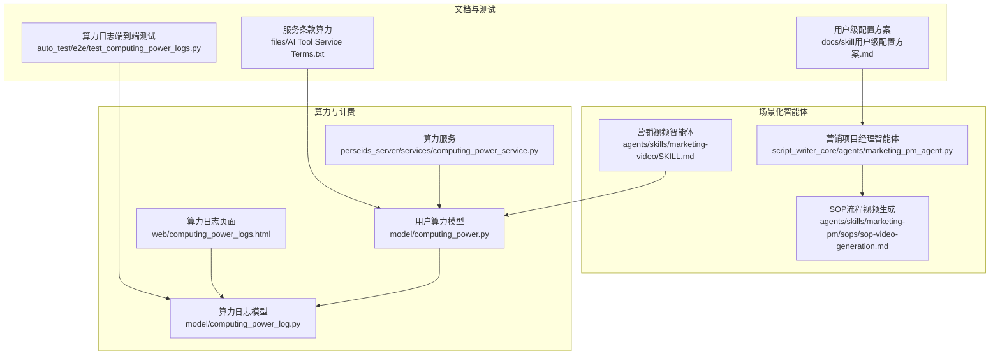
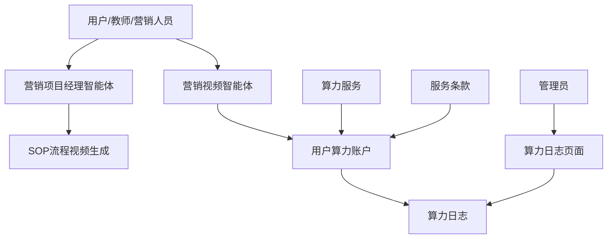
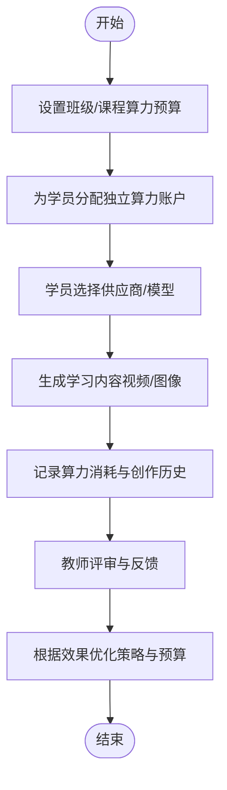
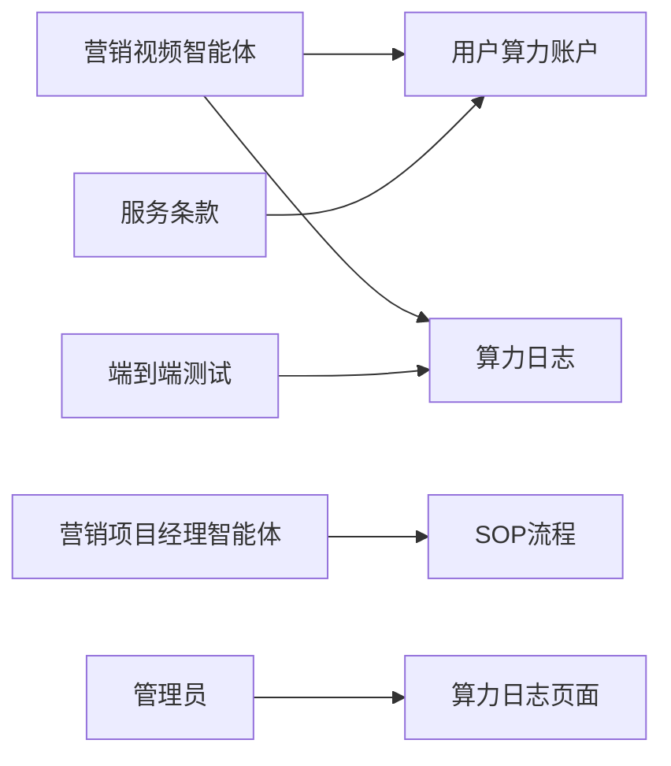

# 应用场景

<cite>
**本文引用的文件**
- [README_EN.md](file://README_EN.md)
- [skill用户级配置方案.md](file://docs/skill用户级配置方案.md)
- [marketing-video SKILL.md](file://agents/skills/marketing-video/SKILL.md)
- [sop-video-generation.md](file://agents/skills/marketing-pm/sops/sop-video-generation.md)
- [marketing_pm_agent.py](file://script_writer_core/agents/marketing_pm_agent.py)
- [computing_power.py](file://model/computing_power.py)
- [computing_power_log.py](file://model/computing_power_log.py)
- [computing_power_service.py](file://perseids_server/services/computing_power_service.py)
- [computing_power_logs.html](file://web/computing_power_logs.html)
- [AI Tool Service Terms.txt](file://files/AI Tool Service Terms.txt)
- [test_computing_power_logs.py](file://auto_test/e2e/test_computing_power_logs.py)
- [marketing_pm_agent.py（单元测试）](file://tests/script_writer_core/test_marketing_pm_agent.py)
</cite>

## 目录
1. [简介](#简介)
2. [项目结构](#项目结构)
3. [核心组件](#核心组件)
4. [架构总览](#架构总览)
5. [详细场景分析](#详细场景分析)
6. [依赖关系分析](#依赖关系分析)
7. [性能与成本控制](#性能与成本控制)
8. [故障排查指南](#故障排查指南)
9. [结论](#结论)
10. [附录](#附录)

## 简介
本指南面向内容创作者、团队协作、企业营销、教育培训等多类用户，系统阐述 ZhiJuTong 在不同场景下的落地方式与最佳实践。重点覆盖以下能力：
- 教育机构：通过“用户级独立算力账户”实现按学生维度的成本控制与学习效果追踪；支持教师端查看创作历史与反馈，便于教学闭环。
- 企业：通过平台化部署实现品牌视频的快速生产与营销内容的自动化生成；支持灵活计费与算力配额管理，保障成本可控与资源高效利用。
- 内容创作者与团队：依托统一的算力与工作流体系，实现跨设备、跨网络的协同创作与版本管理。

## 项目结构
围绕“场景化应用”，平台由以下关键模块构成：
- 场景化智能体：营销视频智能体与营销项目经理智能体，分别负责内容生成与流程编排。
- 算力与计费：用户级算力账户、算力日志、退款与统计，支撑成本控制与审计。
- 部署与运营：文档与页面（如算力日志页面）、测试用例与端到端验证，确保稳定交付与持续优化。
- 合规与定价：服务条款对算力定价与有效期进行规范，保障透明与合规。

图表来源
- [marketing-video SKILL.md:1-158](file://agents/skills/marketing-video/SKILL.md#L1-L158)
- [marketing_pm_agent.py:1-131](file://script_writer_core/agents/marketing_pm_agent.py#L1-L131)
- [sop-video-generation.md:1-40](file://agents/skills/marketing-pm/sops/sop-video-generation.md#L1-L40)
- [computing_power.py](file://model/computing_power.py)
- [computing_power_log.py:227-236](file://model/computing_power_log.py#L227-L236)
- [computing_power_service.py](file://perseids_server/services/computing_power_service.py)
- [computing_power_logs.html](file://web/computing_power_logs.html)
- [skill用户级配置方案.md](file://docs/skill用户级配置方案.md)
- [test_computing_power_logs.py](file://auto_test/e2e/test_computing_power_logs.py)
- [AI Tool Service Terms.txt:26-31](file://files/AI Tool Service Terms.txt#L26-L31)

章节来源
- [README_EN.md:452-495](file://README_EN.md#L452-L495)
- [marketing-video SKILL.md:1-158](file://agents/skills/marketing-video/SKILL.md#L1-L158)
- [marketing_pm_agent.py:1-131](file://script_writer_core/agents/marketing_pm_agent.py#L1-L131)
- [sop-video-generation.md:1-40](file://agents/skills/marketing-pm/sops/sop-video-generation.md#L1-L40)
- [computing_power.py](file://model/computing_power.py)
- [computing_power_log.py:227-236](file://model/computing_power_log.py#L227-L236)
- [computing_power_service.py](file://perseids_server/services/computing_power_service.py)
- [computing_power_logs.html](file://web/computing_power_logs.html)
- [skill用户级配置方案.md](file://docs/skill用户级配置方案.md)
- [test_computing_power_logs.py](file://auto_test/e2e/test_computing_power_logs.py)
- [AI Tool Service Terms.txt:26-31](file://files/AI Tool Service Terms.txt#L26-L31)

## 核心组件
- 场景化智能体
  - 营销视频智能体：提供“文本生成视频/图片生成视频”的工具接口，强调“先查算力再生成”的流程约束，并内置多种提示词模板与风格建议，便于快速产出品牌视频、产品展示、社交媒体短视频等。
  - 营销项目经理智能体：专注于流程编排，支持加载 SOP（标准作业程序），在无剧本上下文的前提下，依据营销目标与 SOP 自动推进任务。
- 算力与计费
  - 用户级算力账户：每个用户拥有独立的算力配额，支持充值、消费与退款；算力日志记录增减行为、时间戳与备注，便于审计与统计。
  - 服务条款：明确算力定价、有效期与变更规则，保障用户知情权与平台合规性。
- 部署与运营
  - 页面与文档：算力日志页面用于管理员审计；用户级配置方案文档指导如何按班级/课程维度进行算力与模型策略的热更新。
  - 测试与验证：端到端测试覆盖算力日志统计逻辑，确保数据准确性与稳定性。

章节来源
- [marketing-video SKILL.md:14-50](file://agents/skills/marketing-video/SKILL.md#L14-L50)
- [marketing_pm_agent.py:18-95](file://script_writer_core/agents/marketing_pm_agent.py#L18-L95)
- [sop-video-generation.md:17-39](file://agents/skills/marketing-pm/sops/sop-video-generation.md#L17-L39)
- [computing_power.py](file://model/computing_power.py)
- [computing_power_log.py:227-236](file://model/computing_power_log.py#L227-L236)
- [computing_power_service.py](file://perseids_server/services/computing_power_service.py)
- [computing_power_logs.html](file://web/computing_power_logs.html)
- [skill用户级配置方案.md](file://docs/skill用户级配置方案.md)
- [AI Tool Service Terms.txt:26-31](file://files/AI Tool Service Terms.txt#L26-L31)

## 架构总览
下图展示了“场景化智能体—算力—运营页面”的交互关系，体现从需求到产出再到审计的完整闭环。

图表来源
- [marketing-video SKILL.md:14-50](file://agents/skills/marketing-video/SKILL.md#L14-L50)
- [marketing_pm_agent.py:18-95](file://script_writer_core/agents/marketing_pm_agent.py#L18-L95)
- [sop-video-generation.md:17-39](file://agents/skills/marketing-pm/sops/sop-video-generation.md#L17-L39)
- [computing_power.py](file://model/computing_power.py)
- [computing_power_log.py:227-236](file://model/computing_power_log.py#L227-L236)
- [computing_power_service.py](file://perseids_server/services/computing_power_service.py)
- [computing_power_logs.html](file://web/computing_power_logs.html)
- [AI Tool Service Terms.txt:26-31](file://files/AI Tool Service Terms.txt#L26-L31)

## 详细场景分析

### 场景一：内容创作者（个人/自由职业者）
- 使用要点
  - 通过“营销视频智能体”快速生成品牌视频、产品展示与社交媒体短视频；遵循“先查算力再生成”的流程，避免因余额不足导致失败。
  - 利用内置提示词模板与风格建议，提升产出质量与效率。
- 实施建议
  - 定期查看算力余额与日志，形成“产出—消耗—补充”的节奏。
  - 将典型提示词与风格沉淀为个人知识库，复用到后续创作中。

章节来源
- [marketing-video SKILL.md:53-74](file://agents/skills/marketing-video/SKILL.md#L53-L74)
- [marketing-video SKILL.md:127-158](file://agents/skills/marketing-video/SKILL.md#L127-L158)

### 场景二：团队协作
- 使用要点
  - 多人实时编辑与版本管理，结合权限体系保障协作安全。
  - 通过 SOP 流程统一营销视频的产出节奏与质量标准。
- 实施建议
  - 为不同角色分配工具权限，避免误操作。
  - 使用算力日志页面监控团队整体消耗，及时预警与补给。

章节来源
- [marketing_pm_agent.py:18-95](file://script_writer_core/agents/marketing_pm_agent.py#L18-L95)
- [sop-video-generation.md:15-39](file://agents/skills/marketing-pm/sops/sop-video-generation.md#L15-L39)
- [computing_power_logs.html](file://web/computing_power_logs.html)

### 场景三：企业营销
- 使用要点
  - 通过平台化部署实现品牌视频的快速生产与营销内容的自动化生成。
  - 结合灵活计费与算力配额管理，实现成本可控与资源高效利用。
- 实施建议
  - 为不同业务线设置独立的算力预算与模型策略，按需启用高性能模型。
  - 使用算力日志进行月度/季度成本归集与复盘。

章节来源
- [README_EN.md:458-462](file://README_EN.md#L458-L462)
- [marketing-video SKILL.md:14-50](file://agents/skills/marketing-video/SKILL.md#L14-L50)
- [computing_power_service.py](file://perseids_server/services/computing_power_service.py)

### 场景四：教育培训（推荐）
- 使用要点
  - “按学生独立账户”：每位学员拥有独立算力配额，便于成本分摊与公平使用。
  - “用户级供应商选择”：不同班级/学员可灵活选择供应商，实现成本优化。
  - “管理员热更新”：机构可动态调整模型配置与价格，适应教学与评测需求。
  - “平台成本管理”：机构可设置总计算预算，防止超支。
  - “创作历史与反馈”：教师可追踪学生作品，开展互动式教学。
  - “跨平台可访问”：支持 Windows/Mac/Linux 设备，满足多样化教学环境。
  - “私有服务器部署”：通过 Docker 自托管，保障数据安全与隐私。
- 实施建议
  - 以“班级/课程”为单位划分算力池，结合用户级配置方案进行策略下发。
  - 建立“创作—评审—反馈”的闭环，结合算力日志进行学习效果与投入产出分析。
  - 通过服务条款明确算力有效期与计费规则，避免争议。

图表来源
- [skill用户级配置方案.md](file://docs/skill用户级配置方案.md)
- [computing_power.py](file://model/computing_power.py)
- [computing_power_log.py:227-236](file://model/computing_power_log.py#L227-L236)
- [computing_power_logs.html](file://web/computing_power_logs.html)
- [AI Tool Service Terms.txt:26-31](file://files/AI Tool Service Terms.txt#L26-L31)

章节来源
- [README_EN.md:464-471](file://README_EN.md#L464-L471)
- [skill用户级配置方案.md](file://docs/skill用户级配置方案.md)
- [computing_power.py](file://model/computing_power.py)
- [computing_power_log.py:227-236](file://model/computing_power_log.py#L227-L236)
- [computing_power_logs.html](file://web/computing_power_logs.html)
- [AI Tool Service Terms.txt:26-31](file://files/AI Tool Service Terms.txt#L26-L31)

## 依赖关系分析
- 组件耦合
  - 营销视频智能体依赖用户算力账户与算力日志，确保“先查后用”的流程约束。
  - 营销项目经理智能体依赖 SOP 流程与工具执行器，负责流程编排与任务推进。
  - 管理员通过算力日志页面与测试用例验证系统稳定性与数据准确性。
- 外部依赖
  - 服务条款明确了算力定价与有效期规则，是成本控制与合规运营的基础。

图表来源
- [marketing-video SKILL.md:14-50](file://agents/skills/marketing-video/SKILL.md#L14-L50)
- [marketing_pm_agent.py:18-95](file://script_writer_core/agents/marketing_pm_agent.py#L18-L95)
- [sop-video-generation.md:17-39](file://agents/skills/marketing-pm/sops/sop-video-generation.md#L17-L39)
- [computing_power.py](file://model/computing_power.py)
- [computing_power_log.py:227-236](file://model/computing_power_log.py#L227-L236)
- [computing_power_logs.html](file://web/computing_power_logs.html)
- [test_computing_power_logs.py](file://auto_test/e2e/test_computing_power_logs.py)
- [AI Tool Service Terms.txt:26-31](file://files/AI Tool Service Terms.txt#L26-L31)

章节来源
- [marketing_pm_agent.py（单元测试）:69-103](file://tests/script_writer_core/test_marketing_pm_agent.py#L69-L103)
- [test_computing_power_logs.py](file://auto_test/e2e/test_computing_power_logs.py)

## 性能与成本控制
- 算力消耗与日志
  - 通过算力日志表记录每次增减行为与时间戳，支持按用户、时间段进行统计与审计。
  - 端到端测试覆盖日志统计逻辑，确保数据准确与性能稳定。
- 成本控制策略
  - 教育机构：以“班级/课程”为单位设置总预算，结合用户级账户实现精细化分摊。
  - 企业：按业务线/项目组划分算力配额，配合灵活计费与模型选择，降低无效消耗。
- 合规与透明
  - 服务条款明确算力定价、有效期与变更规则，保障用户知情权与平台合规性。

章节来源
- [computing_power_log.py:205-224](file://model/computing_power_log.py#L205-L224)
- [test_computing_power_logs.py](file://auto_test/e2e/test_computing_power_logs.py)
- [AI Tool Service Terms.txt:26-31](file://files/AI Tool Service Terms.txt#L26-L31)

## 故障排查指南
- 常见问题
  - 算力不足：在生成前调用“查询用户算力”工具，确认余额后再提交任务。
  - 任务未出结果：确认未手动调用状态查询工具，系统会自动轮询并更新结果。
  - SOP 功能不可用：社区版不包含视频生成能力，需升级至商业版。
- 审计与验证
  - 使用算力日志页面核对消耗明细，必要时结合端到端测试用例验证统计逻辑。
  - 若出现异常退款或计费争议，依据服务条款进行申诉与处理。

章节来源
- [marketing-video SKILL.md:14-50](file://agents/skills/marketing-video/SKILL.md#L14-L50)
- [sop-video-generation.md:35-39](file://agents/skills/marketing-pm/sops/sop-video-generation.md#L35-L39)
- [computing_power_logs.html](file://web/computing_power_logs.html)
- [test_computing_power_logs.py](file://auto_test/e2e/test_computing_power_logs.py)
- [AI Tool Service Terms.txt:26-31](file://files/AI Tool Service Terms.txt#L26-L31)

## 结论
ZhiJuTong 通过“场景化智能体+用户级算力账户+平台化部署”的组合，为内容创作者、团队协作、企业营销与教育培训提供了可落地的解决方案。教育机构可实现“按学生独立账户+热更新策略”的成本与教学闭环；企业可借助“灵活计费+自动化生成”提升品牌视频生产效率与营销内容产出质量。配套的服务条款与审计页面进一步保障了运营的透明与合规。

## 附录
- 成功案例与效果评估
  - 平台已在真实生产环境中部署并通过验证，具备工程品质与稳定性保障。
  - 具体业务指标（如完成率提升）可结合机构内部数据进行评估。
- 参考路径
  - 场景化智能体与流程：[marketing-video SKILL.md:1-158](file://agents/skills/marketing-video/SKILL.md#L1-L158)、[marketing_pm_agent.py:1-131](file://script_writer_core/agents/marketing_pm_agent.py#L1-L131)、[sop-video-generation.md:1-40](file://agents/skills/marketing-pm/sops/sop-video-generation.md#L1-L40)
  - 算力与计费：[computing_power.py](file://model/computing_power.py)、[computing_power_log.py:227-236](file://model/computing_power_log.py#L227-L236)、[computing_power_service.py](file://perseids_server/services/computing_power_service.py)、[computing_power_logs.html](file://web/computing_power_logs.html)、[AI Tool Service Terms.txt:26-31](file://files/AI Tool Service Terms.txt#L26-L31)
  - 教育场景配置：[skill用户级配置方案.md](file://docs/skill用户级配置方案.md)
  - 端到端验证：[test_computing_power_logs.py](file://auto_test/e2e/test_computing_power_logs.py)