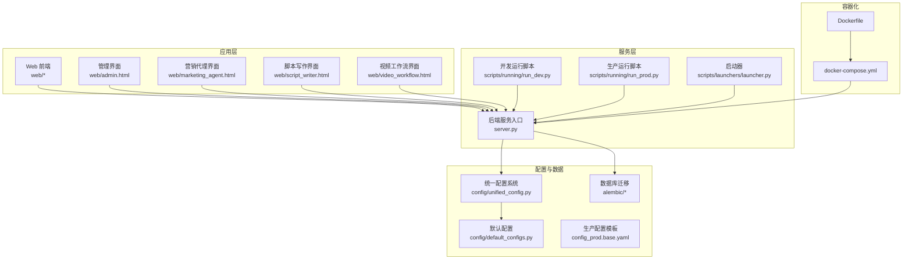
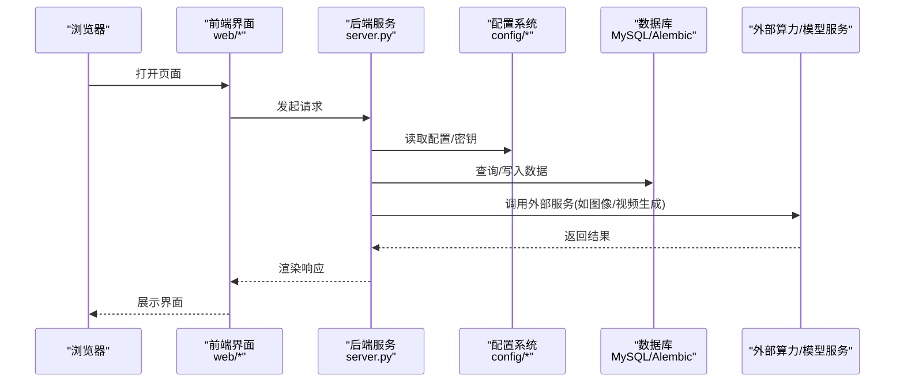
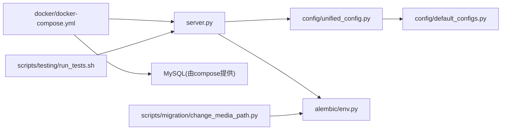

# 快速开始

<cite>
**本文引用的文件**
- [server.py](file://server.py)
- [requirements.txt](file://requirements.txt)
- [docker-compose.yml](file://docker/docker-compose.yml)
- [Dockerfile](file://docker/Dockerfile)
- [start.bat](file://start.bat)
- [start.command](file://start.command)
- [stop.bat](file://stop.bat)
- [stop.command](file://stop.command)
- [首次安装-Mac.command](file://首次安装-Mac.command)
- [Windows启动文件说明.txt](file://Windows启动文件说明.txt)
- [scripts/running/run_dev.py](file://scripts/running/run_dev.py)
- [scripts/running/run_prod.py](file://scripts/running/run_prod.py)
- [scripts/launchers/launcher.py](file://scripts/launchers/launcher.py)
- [scripts/launchers/start_windows.py](file://scripts/launchers/start_windows.py)
- [scripts/launchers/start_mac.py](file://scripts/launchers/start_mac.py)
- [scripts/tools/create_shortcuts.vbs](file://scripts/tools/create_shortcuts.vbs)
- [scripts/tools/start_silent.vbs](file://scripts/tools/start_silent.vbs)
- [config/default_configs.py](file://config/default_configs.py)
- [config/unified_config.py](file://config/unified_config.py)
- [config/version.py](file://config/version.py)
- [config/required_binaries.yml](file://config/required_binaries.yml)
- [docs/Windows启动开发说明.md](file://docs/Windows启动开发说明.md)
- [docs/backend/README.md](file://docs/backend/README.md)
- [docs/backend/统一配置系统.md](file://docs/backend/统一配置系统.md)
- [docs/数据库迁移.md](file://docs/数据库迁移.md)
- [docs/e2e测试.md](file://docs/e2e测试.md)
- [docs/dev_debug_guide.md](file://docs/dev_debug_guide.md)
- [scripts/testing/run_docker_tests.sh](file://scripts/testing/run_docker_tests.sh)
- [scripts/testing/run_tests.sh](file://scripts/testing/run_tests.sh)
- [scripts/migration/change_media_path.py](file://scripts/migration/change_media_path.py)
- [alembic/env.py](file://alembic/env.py)
- [alembic/script.py.mako](file://alembic/script.py.mako)
- [config_prod.base.yaml](file://config_prod.base.yaml)
- [config_unit.base.yml](file://config_unit.base.yml)
</cite>

## 目录
1. [简介](#简介)
2. [项目结构](#项目结构)
3. [核心组件](#核心组件)
4. [架构总览](#架构总览)
5. [详细组件分析](#详细组件分析)
6. [依赖关系分析](#依赖关系分析)
7. [性能考虑](#性能考虑)
8. [故障排除指南](#故障排除指南)
9. [结论](#结论)
10. [附录](#附录)

## 简介
本指南面向首次接触 ZhiJuTong 的用户与开发者，提供在 Windows、macOS、Linux 三大操作系统上的安装与启动步骤，涵盖一键启动程序、Docker 容器化部署、开发环境搭建等多种方式。文档同时给出每种部署方式的适用场景、优缺点与注意事项，并提供常见问题的解决方案、首次使用的配置建议以及基本操作演示，帮助您快速上手并体验平台核心功能。

## 项目结构
该项目采用后端服务（Python Flask/FastAPI）、前端静态资源、数据库迁移（Alembic）与容器化部署（Docker）相结合的架构。核心入口为后端服务脚本，配合配置系统、任务调度与可视化工作流模块，形成完整的媒体内容生成与管理工作流。

**图表来源**
- [server.py](file://server.py)
- [scripts/running/run_dev.py](file://scripts/running/run_dev.py)
- [scripts/running/run_prod.py](file://scripts/running/run_prod.py)
- [scripts/launchers/launcher.py](file://scripts/launchers/launcher.py)
- [config/unified_config.py](file://config/unified_config.py)
- [config/default_configs.py](file://config/default_configs.py)
- [alembic/env.py](file://alembic/env.py)
- [docker/Dockerfile](file://docker/Dockerfile)
- [docker/docker-compose.yml](file://docker/docker-compose.yml)
- [config_prod.base.yaml](file://config_prod.base.yaml)

**章节来源**
- [server.py](file://server.py)
- [config/unified_config.py](file://config/unified_config.py)
- [config/default_configs.py](file://config/default_configs.py)
- [alembic/env.py](file://alembic/env.py)
- [docker/docker-compose.yml](file://docker/docker-compose.yml)
- [docker/Dockerfile](file://docker/Dockerfile)

## 核心组件
- 后端服务入口：负责路由分发、业务处理与对外 API 暴露。
- 统一配置系统：集中管理运行参数、模型配置与外部服务密钥。
- 数据库迁移：基于 Alembic 的版本化数据库演进机制。
- 容器化部署：通过 Dockerfile 与 docker-compose.yml 提供一键部署能力。
- 启动器与脚本：跨平台一键启动、停止与静默启动支持。

**章节来源**
- [server.py](file://server.py)
- [config/unified_config.py](file://config/unified_config.py)
- [alembic/env.py](file://alembic/env.py)
- [docker/docker-compose.yml](file://docker/docker-compose.yml)
- [scripts/launchers/launcher.py](file://scripts/launchers/launcher.py)

## 架构总览
下图展示了从浏览器到后端服务、数据库与外部算力服务的整体交互流程。

**图表来源**
- [server.py](file://server.py)
- [config/unified_config.py](file://config/unified_config.py)
- [alembic/env.py](file://alembic/env.py)

## 详细组件分析

### 一键启动程序（Windows）
- 启动方式
  - 双击桌面快捷方式或开始菜单项启动。
  - 使用命令行执行启动脚本，便于查看日志与调试。
- 适用场景
  - 本地开发调试、快速验证功能。
- 优缺点
  - 优点：简单快捷，无需额外依赖；适合新手。
  - 缺点：无法与系统服务集成，关闭终端即停止。
- 注意事项
  - 首次运行会检查必要二进制依赖，确保网络可访问。
  - 如需后台运行，可使用静默启动脚本。
- 相关文件
  - [start.bat](file://start.bat)
  - [scripts/tools/start_silent.vbs](file://scripts/tools/start_silent.vbs)
  - [scripts/tools/create_shortcuts.vbs](file://scripts/tools/create_shortcuts.vbs)
  - [scripts/launchers/start_windows.py](file://scripts/launchers/start_windows.py)
  - [Windows启动文件说明.txt](file://Windows启动文件说明.txt)
  - [docs/Windows启动开发说明.md](file://docs/Windows启动开发说明.md)

**章节来源**
- [start.bat](file://start.bat)
- [scripts/tools/start_silent.vbs](file://scripts/tools/start_silent.vbs)
- [scripts/tools/create_shortcuts.vbs](file://scripts/tools/create_shortcuts.vbs)
- [scripts/launchers/start_windows.py](file://scripts/launchers/start_windows.py)
- [Windows启动文件说明.txt](file://Windows启动文件说明.txt)
- [docs/Windows启动开发说明.md](file://docs/Windows启动开发说明.md)

### 一键启动程序（macOS）
- 启动方式
  - 双击“首次安装-Mac.command”完成初始化与启动。
  - 使用命令行脚本进行开发或生产模式启动。
- 适用场景
  - macOS 开发者快速验证与演示。
- 优缺点
  - 优点：一键安装与启动，适合非技术用户。
  - 缺点：对系统权限与依赖有要求。
- 注意事项
  - 首次运行可能需要授予终端与自动启动权限。
  - 如遇权限问题，请参考 macOS 安全与隐私设置。
- 相关文件
  - [首次安装-Mac.command](file://首次安装-Mac.command)
  - [start.command](file://start.command)
  - [stop.command](file://stop.command)
  - [scripts/launchers/start_mac.py](file://scripts/launchers/start_mac.py)

**章节来源**
- [首次安装-Mac.command](file://首次安装-Mac.command)
- [start.command](file://start.command)
- [stop.command](file://stop.command)
- [scripts/launchers/start_mac.py](file://scripts/launchers/start_mac.py)

### 一键启动程序（Linux）
- 启动方式
  - 使用开发/生产模式脚本启动服务。
  - 可结合系统服务（如 systemd）实现开机自启。
- 适用场景
  - Linux 服务器或容器环境。
- 优缺点
  - 优点：灵活性高，易集成自动化运维。
  - 缺点：需要手动配置环境变量与依赖。
- 注意事项
  - 确保 Python 虚拟环境已激活，依赖已安装。
  - 如需后台运行，建议使用系统服务或进程管理器。
- 相关文件
  - [scripts/running/linux_start_prod.sh](file://scripts/running/linux_start_prod.sh)
  - [scripts/running/run_dev.py](file://scripts/running/run_dev.py)
  - [scripts/running/run_prod.py](file://scripts/running/run_prod.py)

**章节来源**
- [scripts/running/linux_start_prod.sh](file://scripts/running/linux_start_prod.sh)
- [scripts/running/run_dev.py](file://scripts/running/run_dev.py)
- [scripts/running/run_prod.py](file://scripts/running/run_prod.py)

### Docker 容器化部署
- 部署方式
  - 使用 docker-compose 一键拉起服务与数据库。
  - 可通过 Dockerfile 自定义镜像构建。
- 适用场景
  - 需要隔离环境、快速复制部署、CI/CD 集成。
- 优缺点
  - 优点：环境一致、易于扩展与回滚。
  - 缺点：网络与卷挂载配置较为复杂。
- 注意事项
  - 首次运行会自动执行数据库迁移。
  - 如需持久化数据，请正确配置卷映射。
- 相关文件
  - [docker/docker-compose.yml](file://docker/docker-compose.yml)
  - [docker/Dockerfile](file://docker/Dockerfile)
  - [docker/docker-entrypoint.sh](file://docker/docker-entrypoint.sh)
  - [scripts/testing/run_docker_tests.sh](file://scripts/testing/run_docker_tests.sh)

**章节来源**
- [docker/docker-compose.yml](file://docker/docker-compose.yml)
- [docker/Dockerfile](file://docker/Dockerfile)
- [docker/docker-entrypoint.sh](file://docker/docker-entrypoint.sh)
- [scripts/testing/run_docker_tests.sh](file://scripts/testing/run_docker_tests.sh)

### 开发环境搭建
- 环境准备
  - 安装 Python 与虚拟环境，安装依赖包。
  - 准备数据库（MySQL），确保可连接。
- 启动方式
  - 使用开发脚本启动，便于热更新与调试。
  - 或使用统一配置系统加载开发参数。
- 相关文件
  - [requirements.txt](file://requirements.txt)
  - [scripts/running/run_dev.py](file://scripts/running/run_dev.py)
  - [config/default_configs.py](file://config/default_configs.py)
  - [config/unified_config.py](file://config/unified_config.py)
  - [config/version.py](file://config/version.py)
  - [config/required_binaries.yml](file://config/required_binaries.yml)
  - [docs/backend/README.md](file://docs/backend/README.md)
  - [docs/backend/统一配置系统.md](file://docs/backend/统一配置系统.md)
  - [docs/dev_debug_guide.md](file://docs/dev_debug_guide.md)

**章节来源**
- [requirements.txt](file://requirements.txt)
- [scripts/running/run_dev.py](file://scripts/running/run_dev.py)
- [config/default_configs.py](file://config/default_configs.py)
- [config/unified_config.py](file://config/unified_config.py)
- [config/version.py](file://config/version.py)
- [config/required_binaries.yml](file://config/required_binaries.yml)
- [docs/backend/README.md](file://docs/backend/README.md)
- [docs/backend/统一配置系统.md](file://docs/backend/统一配置系统.md)
- [docs/dev_debug_guide.md](file://docs/dev_debug_guide.md)

## 依赖关系分析
- 后端服务依赖统一配置系统与数据库迁移。
- 前端界面通过 API 与后端交互。
- Docker 部署依赖 compose 文件与入口脚本。
- 测试与升级脚本辅助开发与运维。

**图表来源**
- [server.py](file://server.py)
- [config/unified_config.py](file://config/unified_config.py)
- [config/default_configs.py](file://config/default_configs.py)
- [alembic/env.py](file://alembic/env.py)
- [docker/docker-compose.yml](file://docker/docker-compose.yml)
- [scripts/testing/run_tests.sh](file://scripts/testing/run_tests.sh)
- [scripts/migration/change_media_path.py](file://scripts/migration/change_media_path.py)

**章节来源**
- [server.py](file://server.py)
- [config/unified_config.py](file://config/unified_config.py)
- [config/default_configs.py](file://config/default_configs.py)
- [alembic/env.py](file://alembic/env.py)
- [docker/docker-compose.yml](file://docker/docker-compose.yml)
- [scripts/testing/run_tests.sh](file://scripts/testing/run_tests.sh)
- [scripts/migration/change_media_path.py](file://scripts/migration/change_media_path.py)

## 性能考虑
- 启动性能
  - 使用生产模式脚本与容器化部署可减少冷启动时间。
  - 预热数据库连接与外部服务连接池。
- 运行性能
  - 合理配置并发与队列大小，避免阻塞。
  - 对大文件上传与压缩进行异步处理。
- 资源占用
  - 在容器中限制 CPU/内存配额，防止资源争用。
  - 使用持久化卷与备份策略保障数据安全。

## 故障排除指南
- 无法启动服务
  - 检查端口占用与防火墙设置。
  - 查看启动脚本输出与日志文件。
- 数据库连接失败
  - 确认数据库地址、端口、账号与密码。
  - 首次运行时执行数据库迁移。
- 外部服务调用异常
  - 检查 API 密钥与网络连通性。
  - 查看统一配置中的相关参数。
- Docker 部署问题
  - 确认 compose 文件与镜像构建成功。
  - 检查卷挂载与环境变量。
- 单元测试与 E2E 测试
  - 使用提供的测试脚本定位问题。
  - 参考测试文档与调试指南。

**章节来源**
- [scripts/testing/run_tests.sh](file://scripts/testing/run_tests.sh)
- [scripts/testing/run_docker_tests.sh](file://scripts/testing/run_docker_tests.sh)
- [docs/e2e测试.md](file://docs/e2e测试.md)
- [docs/dev_debug_guide.md](file://docs/dev_debug_guide.md)
- [docs/数据库迁移.md](file://docs/数据库迁移.md)

## 结论
通过本指南，您可以在 Windows、macOS、Linux 上快速完成 ZhiJuTong 的安装与启动，并根据实际需求选择一键启动程序、Docker 容器化部署或开发环境搭建。遇到问题时，可依据故障排除指南与相关文档进行定位与修复。建议在正式使用前完成基础配置与数据迁移，以便顺利体验平台核心功能。

## 附录
- 在线演示链接与离线安装包获取方式请参考项目 README 与官方发布页（如存在）。
- 首次使用建议
  - 完成数据库初始化与迁移。
  - 配置统一配置系统中的关键参数（如外部服务密钥）。
  - 创建管理员账户并登录管理界面进行初始设置。
- 基本操作演示
  - 登录管理界面 → 创建工作区/世界 → 新建角色/场景 → 使用脚本写作与视频工作流 → 查看生成结果与日志。