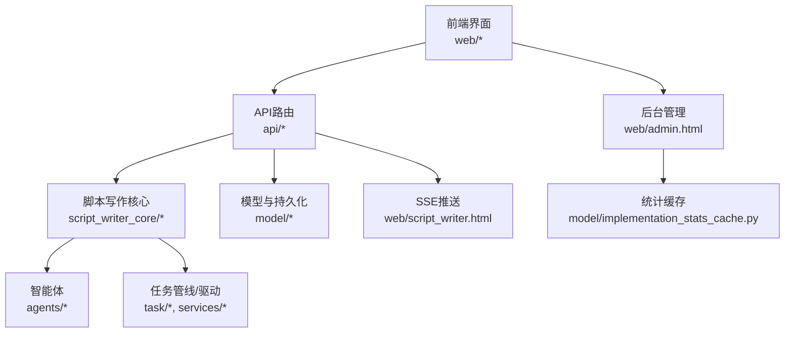
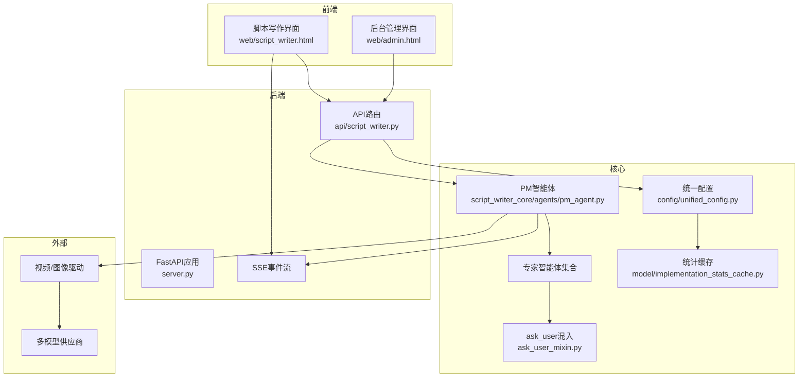
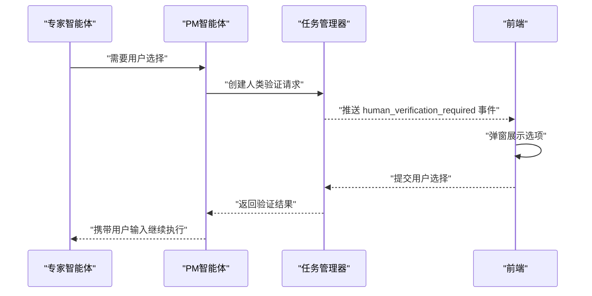
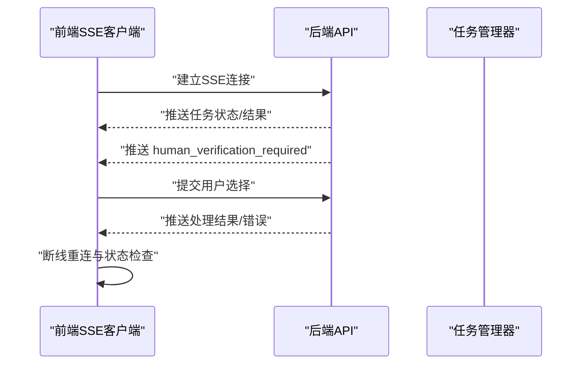
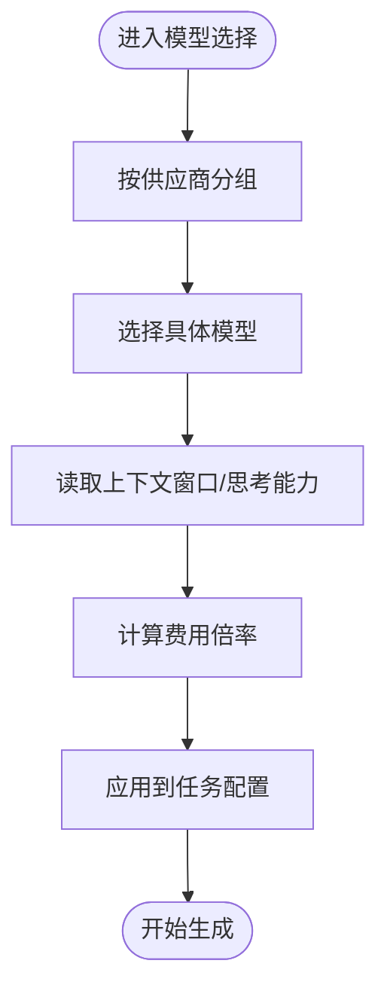
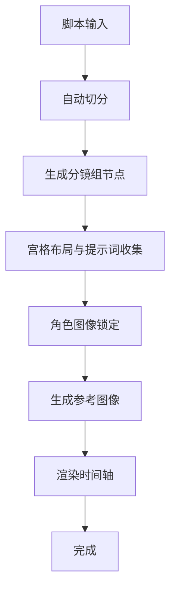
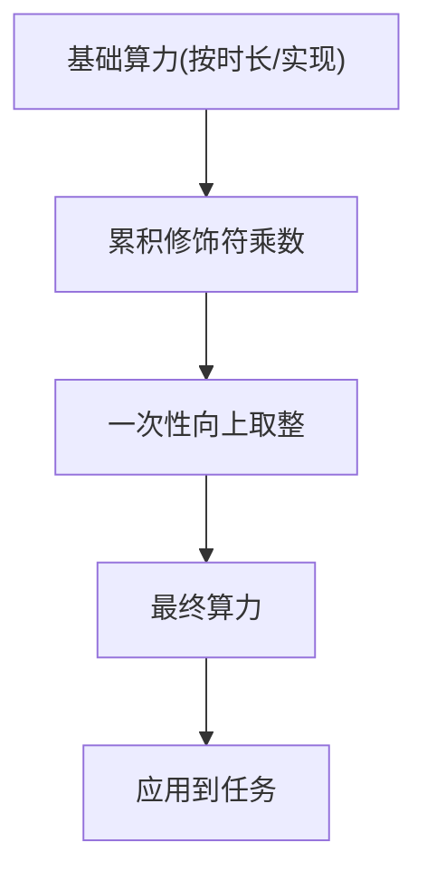
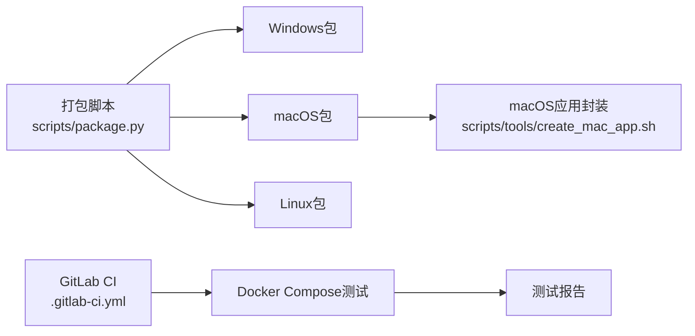
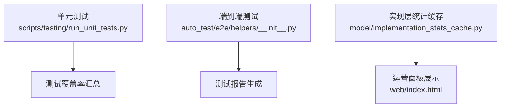
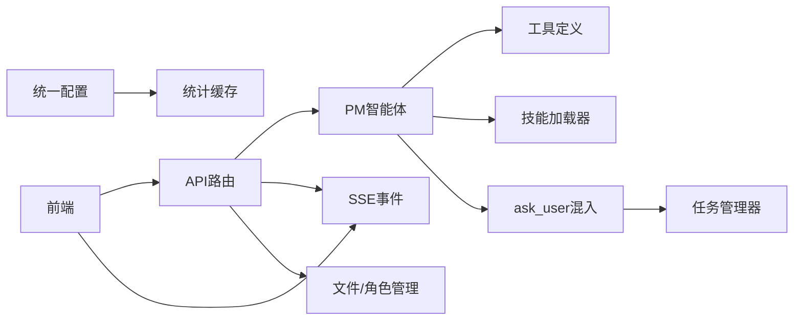

# 技术亮点

<cite>
**本文引用的文件**
- [README_EN.md](file://README_EN.md)
- [script_writer_core/agents/pm_agent.py](file://script_writer_core/agents/pm_agent.py)
- [script_writer_core/agents/marketing_pm_agent.py](file://script_writer_core/agents/marketing_pm_agent.py)
- [script_writer_core/agents/ask_user_mixin.py](file://script_writer_core/agents/ask_user_mixin.py)
- [script_writer_core/agents/tool_definitions.py](file://script_writer_core/agents/tool_definitions.py)
- [web/script_writer.html](file://web/script_writer.html)
- [web/js/nodes.js](file://web/js/nodes.js)
- [api/script_writer.py](file://api/script_writer.py)
- [server.py](file://server.py)
- [docs/backend/算力多维度计算方案.md](file://docs/backend/算力多维度计算方案.md)
- [config/unified_config.py](file://config/unified_config.py)
- [alembic/versions/20260406_create_agent_tasks.py](file://alembic/versions/20260406_create_agent_tasks.py)
- [docs/script/script_auto_split_improvement.md](file://docs/script/script_auto_split_improvement.md)
- [web/index.html](file://web/index.html)
- [model/implementation_stats_cache.py](file://model/implementation_stats_cache.py)
- [web/admin.html](file://web/admin.html)
- [web/js/admin.js](file://web/js/admin.js)
- [scripts/package.py](file://scripts/package.py)
- [scripts/tools/create_mac_app.sh](file://scripts/tools/create_mac_app.sh)
- [.gitattributes](file://.gitattributes)
- [.gitlab-ci.yml](file://.gitlab-ci.yml)
- [scripts/testing/run_unit_tests.py](file://scripts/testing/run_unit_tests.py)
- [auto_test/e2e/helpers/__init__.py](file://auto_test/e2e/helpers/__init__.py)
- [script_writer_core/session_storage.py](file://script_writer_core/session_storage.py)
</cite>

## 目录
1. [引言](#引言)
2. [项目结构](#项目结构)
3. [核心组件](#核心组件)
4. [架构总览](#架构总览)
5. [详细组件分析](#详细组件分析)
6. [依赖分析](#依赖分析)
7. [性能考量](#性能考量)
8. [故障排查指南](#故障排查指南)
9. [结论](#结论)
10. [附录](#附录)

## 引言
本文件聚焦于ZhiJuTong的技术亮点，围绕多智能体协同、ask_user工具、实时SSE推送、多模型支持、自动故事板生成、角色锁定、管理员热更新、跨平台支持、Docker部署、完整测试覆盖与生产验证等主题，系统阐述实现原理、技术挑战、解决方案与价值提升，并辅以架构图与实现示例路径，帮助开发者快速理解技术决策与设计。

## 项目结构
ZhiJuTong采用前后端分离与多模块协作的工程化组织方式：
- 后端服务：FastAPI应用入口与API路由，负责业务编排、任务调度、SSE推送与文件/角色管理。
- 前端界面：HTML/JS/Vue片段构成的单页应用，提供脚本写作、角色管理、后台配置与统计面板。
- 智能体与脚本写作核心：PM Agent与专家智能体协同，结合ask_user工具与SOP/技能体系。
- 配置与算力：统一配置系统、算力修饰符、实现层统计缓存与前端展示。
- 部署与测试：跨平台打包脚本、macOS应用封装、GitLab CI流水线、单元与端到端测试框架。

图表来源
- [server.py:8518-8546](file://server.py#L8518-L8546)
- [api/script_writer.py:2732-2848](file://api/script_writer.py#L2732-L2848)
- [script_writer_core/agents/pm_agent.py:36-143](file://script_writer_core/agents/pm_agent.py#L36-L143)
- [web/script_writer.html:2444-2612](file://web/script_writer.html#L2444-L2612)

章节来源
- [README_EN.md:188-260](file://README_EN.md#L188-L260)

## 核心组件
- 多智能体协同：PM Agent协调8位专家智能体，结合ask_user工具与SOP/技能体系，形成“协调者-专家”的协作范式。
- ask_user工具：统一的跨智能体用户交互工具，支持阻塞等待、超时控制与失败抑制，保障创作流程稳定。
- 实时SSE推送：前端通过SSE订阅任务流，支持断线重连、状态同步与人类验证事件处理。
- 多模型支持：前端模型选择器按供应商分组，支持上下文窗口、思考能力标记与费用倍率计算。
- 自动故事板生成：脚本自动切分、分镜节点生成、宫格布局与参考图像锁定，解决“人脸漂移”问题。
- 角色锁定：角色卡文件化管理，支持创建、查询、保存与删除，配合SSE事件与前端交互。
- 管理员热更新：后台可在线调整实现层算力配置，实时生效并回滚保护。
- 跨平台支持：统一打包脚本与macOS应用封装，保证Windows/macOS/Linux一致性。
- Docker部署：CI中集成Docker Compose测试环境，确保部署一致性与可验证性。
- 完整测试覆盖：单元测试与端到端测试框架，覆盖驱动、LLM、模型、任务与企业特性。
- 生产验证：实现层统计缓存与成功率/耗时展示，支撑运营与优化闭环。

章节来源
- [README_EN.md:188-260](file://README_EN.md#L188-L260)
- [script_writer_core/agents/tool_definitions.py:1-29](file://script_writer_core/agents/tool_definitions.py#L1-L29)
- [web/script_writer.html:2444-2612](file://web/script_writer.html#L2444-L2612)
- [web/js/nodes.js:6126-6158](file://web/js/nodes.js#L6126-L6158)
- [docs/script/script_auto_split_improvement.md:286-293](file://docs/script/script_auto_split_improvement.md#L286-L293)
- [api/script_writer.py:2761-2848](file://api/script_writer.py#L2761-L2848)
- [web/admin.html:591-605](file://web/admin.html#L591-L605)
- [web/js/admin.js:2544-2575](file://web/js/admin.js#L2544-L2575)
- [scripts/package.py:327-465](file://scripts/package.py#L327-L465)
- [scripts/tools/create_mac_app.sh:1-44](file://scripts/tools/create_mac_app.sh#L1-L44)
- [.gitlab-ci.yml:44-199](file://.gitlab-ci.yml#L44-L199)
- [scripts/testing/run_unit_tests.py:486-512](file://scripts/testing/run_unit_tests.py#L486-L512)
- [model/implementation_stats_cache.py:1-85](file://model/implementation_stats_cache.py#L1-L85)

## 架构总览
ZhiJuTong采用“前端SPA + FastAPI后端 + 多智能体核心 + 任务驱动执行”的整体架构。前端通过SSE与后端保持实时通信；后端聚合LLM与第三方API，驱动任务执行与状态回传；智能体通过ask_user与SOP/技能体系实现高效协作；配置与统计模块支撑运营与优化。

图表来源
- [server.py:8518-8546](file://server.py#L8518-L8546)
- [api/script_writer.py:2732-2848](file://api/script_writer.py#L2732-L2848)
- [script_writer_core/agents/pm_agent.py:36-143](file://script_writer_core/agents/pm_agent.py#L36-L143)
- [script_writer_core/agents/ask_user_mixin.py:52-137](file://script_writer_core/agents/ask_user_mixin.py#L52-L137)
- [config/unified_config.py:328-362](file://config/unified_config.py#L328-L362)
- [model/implementation_stats_cache.py:1-85](file://model/implementation_stats_cache.py#L1-L85)

## 详细组件分析

### 多智能体协同与ask_user工具
- 协作模式：PM Agent负责系统提示构建、技能加载与任务编排；专家智能体专注各自领域；营销智能体可自定义基础提示词。
- ask_user工具：统一工具定义，支持问题、选项与上下文；后端通过任务管理器创建人类验证请求，前端阻塞等待用户选择，具备超时与失败抑制策略。
- 价值提升：减少反复修改与返工，提高创作确定性与效率。

图表来源
- [script_writer_core/agents/tool_definitions.py:1-29](file://script_writer_core/agents/tool_definitions.py#L1-L29)
- [script_writer_core/agents/ask_user_mixin.py:52-137](file://script_writer_core/agents/ask_user_mixin.py#L52-L137)
- [web/script_writer.html:2444-2612](file://web/script_writer.html#L2444-L2612)

章节来源
- [script_writer_core/agents/pm_agent.py:36-143](file://script_writer_core/agents/pm_agent.py#L36-L143)
- [script_writer_core/agents/marketing_pm_agent.py:73-105](file://script_writer_core/agents/marketing_pm_agent.py#L73-L105)
- [script_writer_core/agents/ask_user_mixin.py:52-137](file://script_writer_core/agents/ask_user_mixin.py#L52-L137)
- [script_writer_core/agents/tool_definitions.py:1-29](file://script_writer_core/agents/tool_definitions.py#L1-L29)
- [README_EN.md:188-220](file://README_EN.md#L188-L220)

### 实时SSE推送
- 前端SSE客户端：监听任务事件，解析不同类型消息（状态、错误、人类验证、超时），支持断线重连与任务状态检查。
- 后端事件：结合任务状态与验证流程，向前端推送增量结果，确保用户体验流畅。

图表来源
- [web/script_writer.html:2444-2612](file://web/script_writer.html#L2444-L2612)

章节来源
- [web/script_writer.html:2444-2612](file://web/script_writer.html#L2444-L2612)

### 多模型支持与前端模型选择器
- 前端模型分组：按供应商分组展示，支持上下文窗口、思考能力标记与费用倍率计算。
- 价值提升：简化模型切换与成本估算，提升创作灵活性与成本控制能力。

图表来源
- [web/js/nodes.js:6126-6158](file://web/js/nodes.js#L6126-L6158)
- [web/script_writer.html:3005-3032](file://web/script_writer.html#L3005-L3032)

章节来源
- [web/js/nodes.js:6126-6158](file://web/js/nodes.js#L6126-L6158)
- [web/script_writer.html:3005-3032](file://web/script_writer.html#L3005-L3032)

### 自动故事板生成与角色锁定
- 自动切分：脚本自动切分为若干分镜组，前端渲染时间轴与分镜节点。
- 宫格布局与参考图像：生成多面板布局，角色图像锁定避免“人脸漂移”，提升一致性。
- 角色卡管理：后端提供角色卡列表、查询与保存接口，前端支持创建/删除与实时校验。

图表来源
- [docs/script/script_auto_split_improvement.md:286-293](file://docs/script/script_auto_split_improvement.md#L286-L293)
- [web/js/nodes.js:7001-7034](file://web/js/nodes.js#L7001-L7034)
- [api/script_writer.py:2761-2848](file://api/script_writer.py#L2761-L2848)

章节来源
- [docs/script/script_auto_split_improvement.md:286-293](file://docs/script/script_auto_split_improvement.md#L286-L293)
- [api/script_writer.py:2761-2848](file://api/script_writer.py#L2761-L2848)

### 管理员热更新与算力修饰符
- 算力修饰符：在基础算力之上叠加乘数修饰符，支持按模式、分辨率等属性动态调整，最后一次性向上取整，避免精度损失。
- 热更新：后台可在线调整实现层算力配置，前端展示成功率与平均耗时，便于运营决策。

图表来源
- [docs/backend/算力多维度计算方案.md:1-150](file://docs/backend/算力多维度计算方案.md#L1-L150)
- [config/unified_config.py:328-362](file://config/unified_config.py#L328-L362)
- [web/admin.html:591-605](file://web/admin.html#L591-L605)
- [web/js/admin.js:2544-2575](file://web/js/admin.js#L2544-L2575)
- [web/index.html:8016-8056](file://web/index.html#L8016-L8056)
- [model/implementation_stats_cache.py:1-85](file://model/implementation_stats_cache.py#L1-L85)

章节来源
- [docs/backend/算力多维度计算方案.md:1-150](file://docs/backend/算力多维度计算方案.md#L1-L150)
- [config/unified_config.py:328-362](file://config/unified_config.py#L328-L362)
- [web/admin.html:591-605](file://web/admin.html#L591-L605)
- [web/js/admin.js:2544-2575](file://web/js/admin.js#L2544-L2575)
- [web/index.html:8016-8056](file://web/index.html#L8016-L8056)
- [model/implementation_stats_cache.py:1-85](file://model/implementation_stats_cache.py#L1-L85)

### 跨平台支持与Docker部署
- 跨平台：统一shell脚本换行规范，跨平台兼容；打包脚本支持多平台产物生成；macOS应用封装脚本一键生成.app。
- Docker：CI中使用Docker Compose启动MySQL与测试容器，执行测试并产出Junit报告，确保部署一致性。

图表来源
- [scripts/package.py:327-465](file://scripts/package.py#L327-L465)
- [scripts/tools/create_mac_app.sh:1-44](file://scripts/tools/create_mac_app.sh#L1-L44)
- [.gitattributes:1-3](file://.gitattributes#L1-L3)
- [.gitlab-ci.yml:44-199](file://.gitlab-ci.yml#L44-L199)

章节来源
- [scripts/package.py:327-465](file://scripts/package.py#L327-L465)
- [scripts/tools/create_mac_app.sh:1-44](file://scripts/tools/create_mac_app.sh#L1-L44)
- [.gitattributes:1-3](file://.gitattributes#L1-L3)
- [.gitlab-ci.yml:44-199](file://.gitlab-ci.yml#L44-L199)

### 完整测试覆盖与生产验证
- 测试框架：单元测试与端到端测试，覆盖驱动、LLM、模型、任务与企业特性；自动测试包含导航器与报告生成。
- 生产验证：实现层统计缓存记录成功率与平均耗时，前端按版本区分展示，支撑持续优化。

图表来源
- [scripts/testing/run_unit_tests.py:486-512](file://scripts/testing/run_unit_tests.py#L486-L512)
- [auto_test/e2e/helpers/__init__.py:1-1](file://auto_test/e2e/helpers/__init__.py#L1-L1)
- [model/implementation_stats_cache.py:1-85](file://model/implementation_stats_cache.py#L1-L85)
- [web/index.html:8016-8056](file://web/index.html#L8016-L8056)

章节来源
- [scripts/testing/run_unit_tests.py:486-512](file://scripts/testing/run_unit_tests.py#L486-L512)
- [auto_test/e2e/helpers/__init__.py:1-1](file://auto_test/e2e/helpers/__init__.py#L1-L1)
- [model/implementation_stats_cache.py:1-85](file://model/implementation_stats_cache.py#L1-L85)
- [web/index.html:8016-8056](file://web/index.html#L8016-L8056)

## 依赖分析
- 模块耦合：PM智能体依赖技能加载器与工具定义；ask_user混入依赖任务管理器；前端SSE依赖后端API；配置系统贯穿任务与统计。
- 外部依赖：多模型供应商、视频/图像驱动；CI依赖Docker与Compose；前端依赖Vue与marked渲染。
- 潜在风险：SSE断线重连与验证超时处理；ask_user失败抑制防止资源浪费；算力修饰符计算精度与一致性。

图表来源
- [script_writer_core/agents/pm_agent.py:36-143](file://script_writer_core/agents/pm_agent.py#L36-L143)
- [script_writer_core/agents/tool_definitions.py:1-29](file://script_writer_core/agents/tool_definitions.py#L1-L29)
- [script_writer_core/agents/ask_user_mixin.py:52-137](file://script_writer_core/agents/ask_user_mixin.py#L52-L137)
- [api/script_writer.py:2732-2848](file://api/script_writer.py#L2732-L2848)
- [web/script_writer.html:2444-2612](file://web/script_writer.html#L2444-L2612)
- [config/unified_config.py:328-362](file://config/unified_config.py#L328-L362)
- [model/implementation_stats_cache.py:1-85](file://model/implementation_stats_cache.py#L1-L85)

## 性能考量
- 算力修饰符：先累积乘数再一次性向上取整，避免多次取整导致的精度损失与性能波动。
- SSE断线重连：前端在连接异常时检查任务状态，避免重复消耗资源；合理重试次数与延迟。
- ask_user失败抑制：连续失败达到阈值后直接返回错误，减少无效调用与成本。
- 统计缓存：实现层统计缓存按天聚合，降低查询压力，前端按需展示。

章节来源
- [docs/backend/算力多维度计算方案.md:1-150](file://docs/backend/算力多维度计算方案.md#L1-L150)
- [script_writer_core/agents/ask_user_mixin.py:52-137](file://script_writer_core/agents/ask_user_mixin.py#L52-L137)
- [web/script_writer.html:2444-2612](file://web/script_writer.html#L2444-L2612)
- [model/implementation_stats_cache.py:1-85](file://model/implementation_stats_cache.py#L1-L85)

## 故障排查指南
- SSE连接失败：检查后端任务状态，确认是否已完成；前端会自动重连并提示状态。
- ask_user超时：前端显示验证超时错误，建议用户重新发起消息；后端记录失败次数并抑制后续提问。
- 角色卡管理：确认用户ID与世界ID参数正确；检查文件系统权限与命名冲突。
- 管理员热更新：确认实现层配置项存在且格式正确；失败时回滚并提示错误原因。

章节来源
- [web/script_writer.html:2444-2612](file://web/script_writer.html#L2444-L2612)
- [script_writer_core/agents/ask_user_mixin.py:52-137](file://script_writer_core/agents/ask_user_mixin.py#L52-L137)
- [api/script_writer.py:2761-2848](file://api/script_writer.py#L2761-L2848)
- [web/js/admin.js:2544-2575](file://web/js/admin.js#L2544-L2575)

## 结论
ZhiJuTong通过多智能体协同、ask_user工具、实时SSE推送、多模型支持、自动故事板生成、角色锁定、管理员热更新、跨平台支持、Docker部署与完整测试覆盖，构建了高效、稳定、可运维的创作平台。算力修饰符与统计缓存进一步提升了成本控制与运营效率，为规模化生产提供了坚实基础。

## 附录
- 任务与消息持久化：agent_tasks与agent_task_messages表用于跨进程共享与追踪。
- 前端静态资源缓存：cache_bust开关控制静态资源版本注入与缓存策略，便于开发调试与生产加速。

章节来源
- [alembic/versions/20260406_create_agent_tasks.py:34-56](file://alembic/versions/20260406_create_agent_tasks.py#L34-L56)
- [server.py:249-8546](file://server.py#L249-L8546)