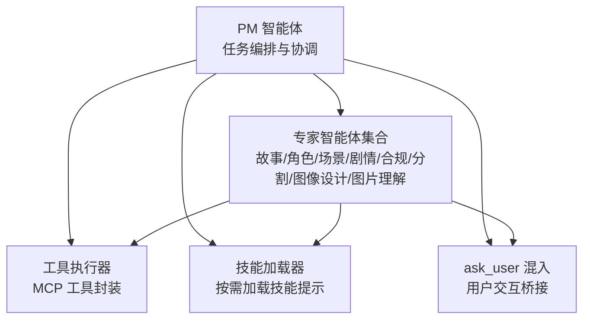
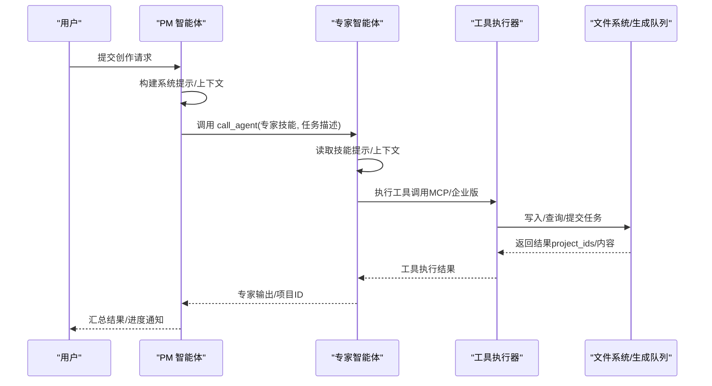
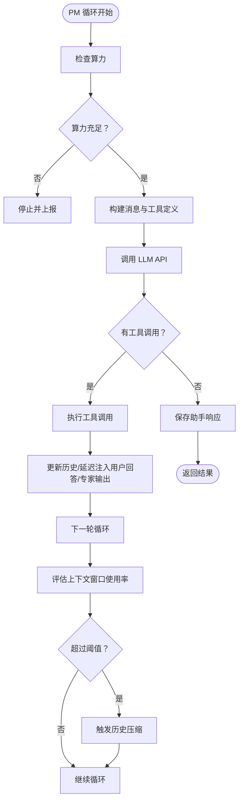
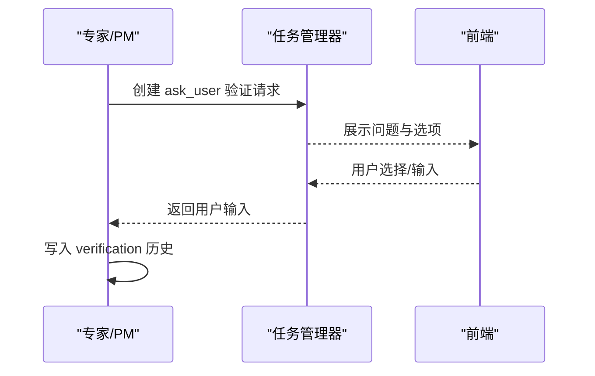
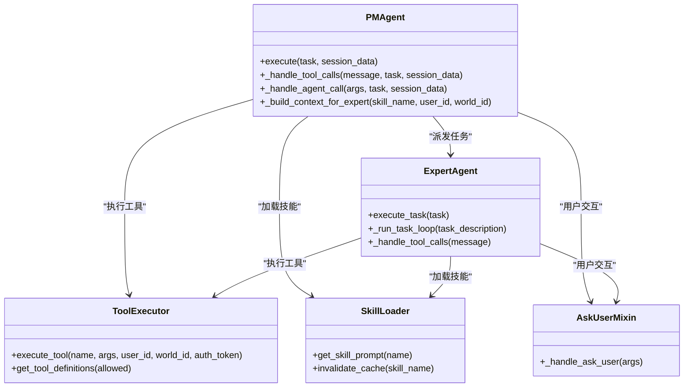

# 多智能体协作机制

<cite>
**本文引用的文件**
- [script_writer_core/agents/pm_agent.py](file://script_writer_core/agents/pm_agent.py)
- [script_writer_core/agents/marketing_pm_agent.py](file://script_writer_core/agents/marketing_pm_agent.py)
- [script_writer_core/agents/expert_agent.py](file://script_writer_core/agents/expert_agent.py)
- [script_writer_core/agents/ask_user_mixin.py](file://script_writer_core/agents/ask_user_mixin.py)
- [script_writer_core/agents/tool_executor.py](file://script_writer_core/agents/tool_executor.py)
- [script_writer_core/agents/base_agent.py](file://script_writer_core/agents/base_agent.py)
- [script_writer_core/agents/tool_definitions.py](file://script_writer_core/agents/tool_definitions.py)
- [script_writer_core/skill_loader.py](file://script_writer_core/skill_loader.py)
- [script_writer_core/config/agents_config.json](file://script_writer_core/config/agents_config.json)
- [agents/skills/marketing-pm/SKILL.md](file://agents/skills/marketing-pm/SKILL.md)
- [script_writer_core/skills/story-writer/SKILL.md](file://script_writer_core/skills/story-writer/SKILL.md)
- [script_writer_core/skills/character-creator/SKILL.md](file://script_writer_core/skills/character-creator/SKILL.md)
- [script_writer_core/skills/location-creator/SKILL.md](file://script_writer_core/skills/location-creator/SKILL.md)
</cite>

## 目录
1. [简介](#简介)
2. [项目结构](#项目结构)
3. [核心组件](#核心组件)
4. [架构总览](#架构总览)
5. [详细组件分析](#详细组件分析)
6. [依赖关系分析](#依赖关系分析)
7. [性能考量](#性能考量)
8. [故障排查指南](#故障排查指南)
9. [结论](#结论)
10. [附录](#附录)

## 简介
本文件系统性阐述多智能体协作机制，聚焦“项目管理”（PM）与八个“专家智能体”的职责分工、任务分配与结果整合流程。文档还深入解析 ask_user 工具的实现原理与用户交互闭环，涵盖选项生成、用户选择、结果反馈等环节；同时说明智能体间的通信协议、任务调度策略、上下文传递与历史压缩机制，并给出技能加载器与工具执行器的工作原理与最佳实践。

## 项目结构
围绕脚本创作与营销内容生成，系统采用“PM 协调 + 专家执行 + 工具链支撑”的分层架构：
- PM Agent：负责任务拆分、串行派发、专家协调、结果汇总与异常处理
- 专家 Agent：面向具体技能域（故事、角色、场景、剧情分析、内容合规、小说分割、角色/场景图像设计、图片理解）执行任务
- 工具执行器：统一封装 MCP 工具与企业版扩展工具，提供统一的工具定义与执行接口
- 技能加载器：按需加载技能提示词，支持用户级自定义覆盖与渐进式披露
- ask_user 混入：提供跨 Agent 的用户提问与等待机制，保障交互一致性

图表来源
- [script_writer_core/agents/pm_agent.py](file://script_writer_core/agents/pm_agent.py)
- [script_writer_core/agents/expert_agent.py](file://script_writer_core/agents/expert_agent.py)
- [script_writer_core/agents/tool_executor.py](file://script_writer_core/agents/tool_executor.py)
- [script_writer_core/skill_loader.py](file://script_writer_core/skill_loader.py)
- [script_writer_core/agents/ask_user_mixin.py](file://script_writer_core/agents/ask_user_mixin.py)

章节来源
- [script_writer_core/agents/pm_agent.py](file://script_writer_core/agents/pm_agent.py)
- [script_writer_core/agents/expert_agent.py](file://script_writer_core/agents/expert_agent.py)
- [script_writer_core/agents/tool_executor.py](file://script_writer_core/agents/tool_executor.py)
- [script_writer_core/skill_loader.py](file://script_writer_core/skill_loader.py)
- [script_writer_core/agents/ask_user_mixin.py](file://script_writer_core/agents/ask_user_mixin.py)

## 核心组件
- PM 智能体（项目管理）
  - 职责：任务编排、串行派发、专家协调、结果汇总、异常与上下文管理
  - 关键能力：系统提示构建、工具定义聚合、历史压缩、算力同步检查、与前端的消息推送
- 专家智能体（八位专家）
  - 职责：依据技能提示与上下文，执行具体创作或设计任务
  - 能力：多模态消息格式化、工具调用处理、历史管理、生成任务的 project_ids 记录
- 工具执行器
  - 职责：统一管理 MCP 工具与企业版扩展工具，提供工具定义与执行接口
  - 能力：工具映射、参数适配、错误捕获、Gemini API 格式转换
- 技能加载器
  - 职责：按需加载技能提示词，支持用户级自定义覆盖与渐进式披露
  - 能力：元数据解析、DB 与文件系统双源加载、缓存与失效
- ask_user 混入
  - 职责：跨 Agent 的用户提问与等待机制，保障交互一致性与稳定性
  - 能力：验证请求创建、超时等待、失败计数与禁用保护

章节来源
- [script_writer_core/agents/pm_agent.py](file://script_writer_core/agents/pm_agent.py)
- [script_writer_core/agents/expert_agent.py](file://script_writer_core/agents/expert_agent.py)
- [script_writer_core/agents/tool_executor.py](file://script_writer_core/agents/tool_executor.py)
- [script_writer_core/skill_loader.py](file://script_writer_core/skill_loader.py)
- [script_writer_core/agents/ask_user_mixin.py](file://script_writer_core/agents/ask_user_mixin.py)

## 架构总览
多智能体系统遵循“PM 协调 + 专家执行 + 工具链支撑”的分层设计。PM 作为协调者，负责将用户意图分解为一系列专家任务，并串行派发给专家智能体。专家在各自技能域内执行任务，必要时通过 ask_user 与用户交互，或通过工具执行器访问外部系统（如文件系统、生成任务队列、算力检查等）。PM 与专家均具备历史管理与上下文压缩能力，确保在长对话与大规模内容场景下的稳定性。

图表来源
- [script_writer_core/agents/pm_agent.py](file://script_writer_core/agents/pm_agent.py)
- [script_writer_core/agents/expert_agent.py](file://script_writer_core/agents/expert_agent.py)
- [script_writer_core/agents/tool_executor.py](file://script_writer_core/agents/tool_executor.py)

## 详细组件分析

### PM 智能体（项目管理）
- 系统提示构建
  - 基础提示词 + 技能加载器按需加载的技能内容拼接，支持用户级自定义覆盖
  - 环境上下文注入：PM 初始化时加载世界设定、剧本、角色、场景、道具等上下文，限制字符长度并进行截断
- 任务循环与工具调用
  - 每轮循环构建消息列表与工具定义，调用 LLM 客户端获取响应
  - 支持并行/串行工具调用，统一处理 tool_calls、reasoning_content、thought_signature
  - 对 ask_user 的 QA 对话进行抽取与合并，避免专家重复提问
- 专家派发与结果整合
  - call_agent 工具：构建专家上下文（含环境上下文与 PM 已有交互），实例化 ExpertAgent 并执行
  - 专家返回的 project_ids 通过任务管理器推送至前端轮询
  - 成功/失败均记录到 completed_tasks，便于审计与恢复
- 上下文压缩与算力检查
  - 基于上下文窗口阈值估算当前 token 使用率，超过阈值触发历史压缩
  - 同步检查用户算力，不足时停止任务并上报

图表来源
- [script_writer_core/agents/pm_agent.py](file://script_writer_core/agents/pm_agent.py)

章节来源
- [script_writer_core/agents/pm_agent.py](file://script_writer_core/agents/pm_agent.py)

### 营销项目经理智能体（营销 PM）
- 与剧本 PM 的差异
  - 不加载环境上下文，直接使用营销专用基础提示词
  - 支持 load_sop 工具动态加载 SOP 流程
  - 不包含剧本相关的文件操作工具
- 专家上下文构建
  - 营销 PM 的专家不需要世界设定等环境上下文，仅提供任务上下文或摘要模式

章节来源
- [script_writer_core/agents/marketing_pm_agent.py](file://script_writer_core/agents/marketing_pm_agent.py)
- [agents/skills/marketing-pm/SKILL.md](file://agents/skills/marketing-pm/SKILL.md)

### 专家智能体（八位专家）
- 系统提示构建
  - 基于技能加载器按需加载技能提示词，支持语言指令追加
  - 专家上下文由 PM 提供，包含环境上下文与 PM 已有 ask_user 交互
- 任务执行循环
  - 与 PM 类似，每轮构建消息与工具定义，调用 LLM 客户端
  - 支持 fetch_image_as_base64 注入多模态图片，以及生成任务 project_ids 的收集
- 历史管理与会话保存
  - 专家历史管理器保存会话执行记录、工具调用与输出，便于审计与恢复

章节来源
- [script_writer_core/agents/expert_agent.py](file://script_writer_core/agents/expert_agent.py)
- [script_writer_core/skill_loader.py](file://script_writer_core/skill_loader.py)

### ask_user 工具与用户交互流程
- 工具定义
  - 统一的 ask_user 工具定义，包含 question、options、context 参数
- 交互流程
  - PM/专家调用 ask_user，创建验证请求并阻塞等待用户响应（最长 300 秒）
  - 成功：返回用户输入与元数据，写入 verification 历史
  - 失败：记录失败计数，达到阈值后禁用 ask_user，避免浪费算力
- 显示名称映射
  - 为不同智能体提供中文显示名，提升前端交互友好度

图表来源
- [script_writer_core/agents/ask_user_mixin.py](file://script_writer_core/agents/ask_user_mixin.py)
- [script_writer_core/agents/tool_definitions.py](file://script_writer_core/agents/tool_definitions.py)

章节来源
- [script_writer_core/agents/ask_user_mixin.py](file://script_writer_core/agents/ask_user_mixin.py)
- [script_writer_core/agents/tool_definitions.py](file://script_writer_core/agents/tool_definitions.py)

### 工具执行器（ToolExecutor）
- 工具映射
  - 统一管理 MCP 工具与企业版扩展工具，提供工具名称到函数的映射
- 执行策略
  - 对 MCP 工具：自动注入 user_id、world_id、auth_token 作为前三个参数
  - 对企业版工具：通过注册函数注入，动态扩展工具集
- 工具定义
  - 将 MCP_TOOLS 转换为 Gemini API 格式，供 LLM 工具调用

章节来源
- [script_writer_core/agents/tool_executor.py](file://script_writer_core/agents/tool_executor.py)

### 技能加载器（SkillLoader）
- 元数据与内容加载
  - 解析技能文件的 YAML front matter，提取名称、描述与提示词
  - 支持用户级自定义覆盖：优先加载用户自定义技能，回退到文件系统默认值
- 渐进式披露
  - 提供技能摘要，仅展示元数据，避免泄露完整提示词
- 缓存与失效
  - 按需加载完整技能内容，支持缓存与失效刷新

章节来源
- [script_writer_core/skill_loader.py](file://script_writer_core/skill_loader.py)

### 专家技能与职责分工
- 故事写手（story-writer）
  - 基于规划生成具体剧集内容，强调“爽点具体化”、“多视角呈现”、“节奏控制”
  - 自动检测新角色并引导创建角色卡，保存到暂存区
- 角色创建（character-creator）
  - 通过问答收集角色基本信息、性格、行为习惯、背景故事与关系
  - 使用 MCP 工具创建标准化角色 JSON 文件
- 场景创建（location-creator）
  - 通过问答收集场景与道具的外观、功能、剧情意义与象征意义
  - 使用 MCP 工具创建标准化场景/道具 JSON 文件
- 剧情分析（plot-analyzer）
  - 基于世界设定与剧本进行剧情一致性与问题识别
- 内容合规（content-compliance-checker）
  - 基于世界设定与剧本进行合规性检查与问题标注
- 小说分割（novel-episode-splitter）
  - 将长篇内容按集/章进行拆分，保持连贯性与完整性
- 角色图像设计（character-image-designer）
  - 基于角色 JSON 生成角色参考图与语音素材
- 场景/道具图像设计（location-prop-image-designer）
  - 基于场景/道具 JSON 生成图像素材
- 图片理解（image-understanding）
  - 基于图片 URL 获取图片内容，辅助创作与审核
- 营销图像/视频（marketing-image/video）
  - 基于用户需求生成营销图像/视频，支持编辑与状态查询

章节来源
- [script_writer_core/config/agents_config.json](file://script_writer_core/config/agents_config.json)
- [script_writer_core/skills/story-writer/SKILL.md](file://script_writer_core/skills/story-writer/SKILL.md)
- [script_writer_core/skills/character-creator/SKILL.md](file://script_writer_core/skills/character-creator/SKILL.md)
- [script_writer_core/skills/location-creator/SKILL.md](file://script_writer_core/skills/location-creator/SKILL.md)
- [agents/skills/marketing-pm/SKILL.md](file://agents/skills/marketing-pm/SKILL.md)

## 依赖关系分析
- PM 与 Expert 的耦合
  - PM 通过 call_agent 工具派发任务，Expert 通过工具执行器访问外部系统
  - PM 维护失败计数与上下文压缩，降低耦合带来的风险
- 工具执行器的集中化
  - 统一管理 MCP 与企业版工具，避免各专家重复实现
- 技能加载器的可插拔性
  - 支持用户级自定义覆盖，便于业务扩展与个性化
- ask_user 的跨模块复用
  - 通过混入提供一致的用户交互体验，减少重复代码

图表来源
- [script_writer_core/agents/pm_agent.py](file://script_writer_core/agents/pm_agent.py)
- [script_writer_core/agents/expert_agent.py](file://script_writer_core/agents/expert_agent.py)
- [script_writer_core/agents/tool_executor.py](file://script_writer_core/agents/tool_executor.py)
- [script_writer_core/skill_loader.py](file://script_writer_core/skill_loader.py)
- [script_writer_core/agents/ask_user_mixin.py](file://script_writer_core/agents/ask_user_mixin.py)

章节来源
- [script_writer_core/agents/pm_agent.py](file://script_writer_core/agents/pm_agent.py)
- [script_writer_core/agents/expert_agent.py](file://script_writer_core/agents/expert_agent.py)
- [script_writer_core/agents/tool_executor.py](file://script_writer_core/agents/tool_executor.py)
- [script_writer_core/skill_loader.py](file://script_writer_core/skill_loader.py)
- [script_writer_core/agents/ask_user_mixin.py](file://script_writer_core/agents/ask_user_mixin.py)

## 性能考量
- 上下文窗口管理
  - 基于模型上下文窗口与历史字符估算，超过阈值（如 90%）触发历史压缩，减少 token 使用
- 算力同步检查
  - 在关键节点检查用户算力，不足时立即停止，避免无效调用
- 工具调用批量化与延迟注入
  - 对 ask_user 的用户回答与专家输出进行延迟注入，避免 API 报错与消息顺序问题
- 多模态注入优化
  - fetch_image_as_base64 成功后通过 user 消息注入多模态图片，避免工具结果消息不支持图片

## 故障排查指南
- 算力不足
  - 现象：任务执行停止并上报“算力不足”
  - 处理：检查用户算力状态，充值后重试
- ask_user 超时或禁用
  - 现象：ask_user 多次失败后被禁用，不再创建验证请求
  - 处理：等待用户主动发送消息，或调整交互策略
- 工具执行失败
  - 现象：工具返回错误信息
  - 处理：检查工具参数与权限，必要时重试或更换工具
- 历史截断与压缩
  - 现象：对话历史被截断或压缩
  - 处理：合理控制上下文长度，避免过长历史导致压缩

章节来源
- [script_writer_core/agents/base_agent.py](file://script_writer_core/agents/base_agent.py)
- [script_writer_core/agents/ask_user_mixin.py](file://script_writer_core/agents/ask_user_mixin.py)
- [script_writer_core/agents/tool_executor.py](file://script_writer_core/agents/tool_executor.py)
- [script_writer_core/agents/pm_agent.py](file://script_writer_core/agents/pm_agent.py)

## 结论
多智能体协作机制通过 PM 的统一编排与专家的垂直深耕，实现了高质量、高准确性的创作与设计流程。ask_user 工具确保了人机交互的稳定与高效，工具执行器与技能加载器提供了强大的可扩展性与可定制性。在大规模内容与长对话场景下，上下文压缩与算力检查进一步保障了系统的稳定性与性能。

## 附录
- 使用案例
  - 剧本创作：PM 派发“故事写手”，专家生成剧集内容并保存到暂存区，PM 汇总结果
  - 角色/场景/道具创建：PM 派发“角色创建/场景创建”，专家通过 MCP 工具生成标准化 JSON
  - 营销内容：营销 PM 判断意图并加载 SOP，协调图像/视频生成专家完成创作
- 最佳实践
  - 合理设置专家 allowed_tools，避免权限过大
  - 使用技能加载器的渐进式披露，避免泄露提示词
  - 在长对话中启用上下文压缩，控制 token 使用率
  - 对 ask_user 的失败进行监控与告警，避免长时间禁用