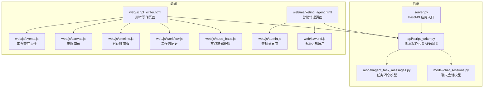
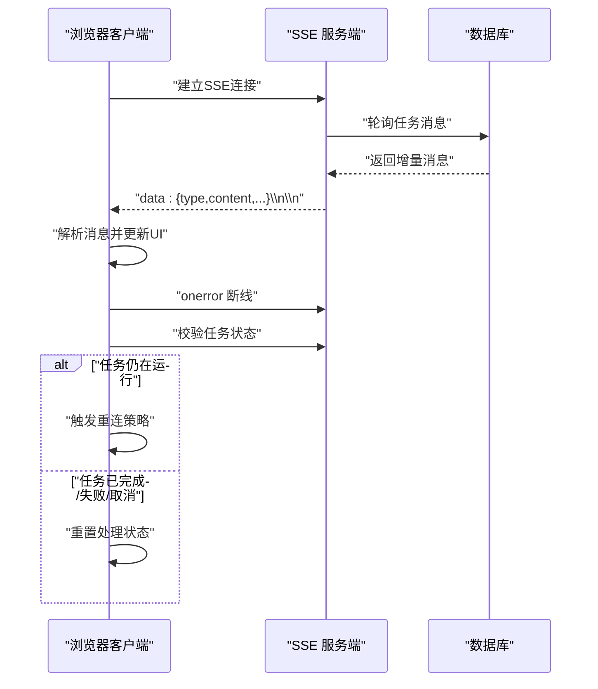
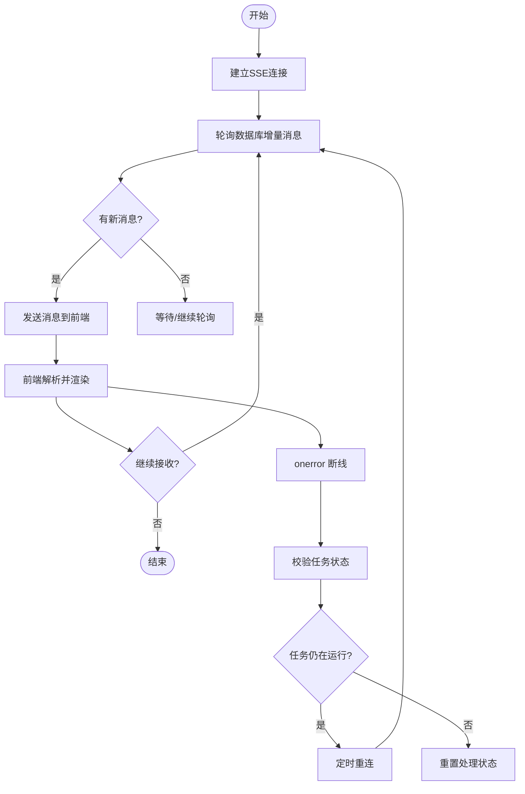
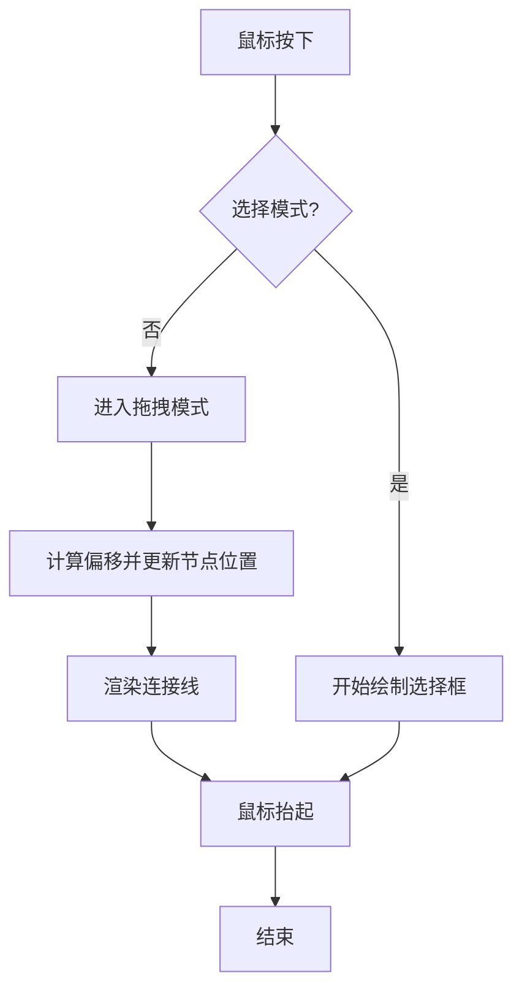
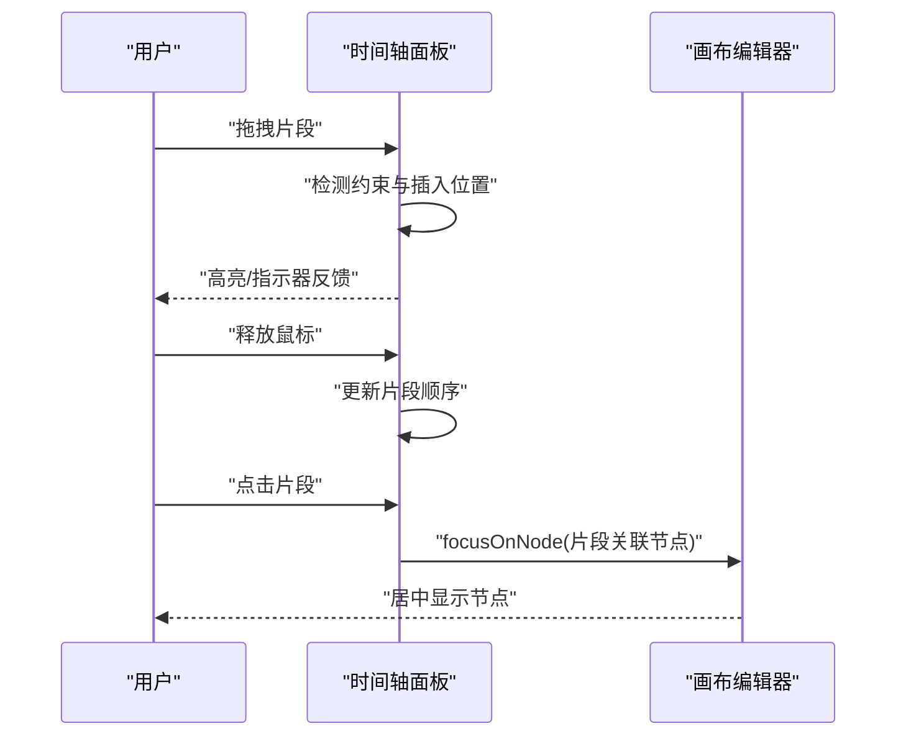
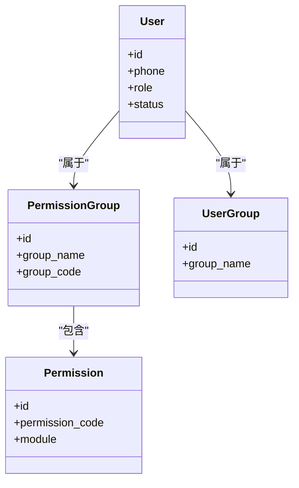
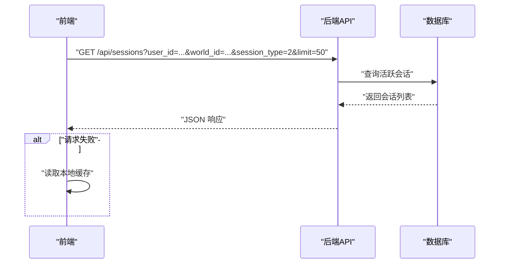
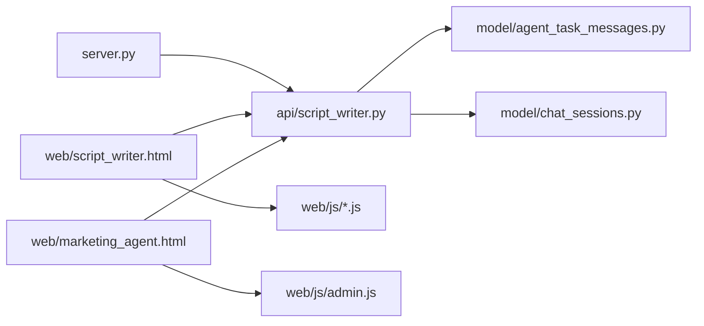

# 实时协作编辑系统

<cite>
**本文引用的文件**
- [server.py](file://server.py)
- [script_writer.py](file://api/script_writer.py)
- [events.js](file://web/js/events.js)
- [canvas.js](file://web/js/canvas.js)
- [timeline.js](file://web/js/timeline.js)
- [workflow.js](file://web/js/workflow.js)
- [node_base.js](file://web/js/node_base.js)
- [agent_task_messages.py](file://model/agent_task_messages.py)
- [chat_sessions.py](file://model/chat_sessions.py)
- [test_chat_sessions_crud.py](file://tests/crud/test_chat_sessions_crud.py)
- [权限系统设计.md](file://docs/权限系统/权限系统设计.md)
- [常量使用示例.md](file://docs/常量使用示例.md)
- [20260322_create_chat_sessions.py](file://alembic/versions/20260322_create_chat_sessions.py)
- [20260519_add_edition_shared_space_config.py](file://alembic/versions/20260519_add_edition_shared_space_config.py)
- [script_writer.html](file://web/script_writer.html)
- [marketing_agent.html](file://web/marketing_agent.html)
- [admin.js](file://web/js/admin.js)
- [world.js](file://web/js/world.js)
</cite>

## 目录
1. [引言](#引言)
2. [项目结构](#项目结构)
3. [核心组件](#核心组件)
4. [架构总览](#架构总览)
5. [详细组件分析](#详细组件分析)
6. [依赖关系分析](#依赖关系分析)
7. [性能考虑](#性能考虑)
8. [故障排查指南](#故障排查指南)
9. [结论](#结论)
10. [附录](#附录)

## 引言
本技术文档面向“实时协作编辑系统”，聚焦于以下目标：
- 基于服务器推送事件（SSE）的实时通信架构，涵盖连接建立、消息传递、断线重连等机制
- 浏览器端的实时编辑实现，包括无限画布编辑器、多面板故事板设计、拖拽调整等
- 权限管理系统设计，包括管理员与普通用户的权限差异、版本控制机制
- 聊天会话管理与状态同步的具体实现细节
- 局域网与公网环境下的零延迟团队协作实践建议

## 项目结构
该仓库是一个基于 FastAPI 的后端与前端混合工程，实时协作能力主要体现在以下方面：
- 后端：SSE 流式传输、任务消息持久化、权限与版本控制、聊天会话模型与迁移
- 前端：无限画布、节点连接与拖拽、时间轴面板、工作流历史、SSE 客户端与重连策略

图表来源
- [server.py](file://server.py)
- [script_writer.py](file://api/script_writer.py)
- [agent_task_messages.py](file://model/agent_task_messages.py)
- [chat_sessions.py](file://model/chat_sessions.py)
- [events.js](file://web/js/events.js)
- [canvas.js](file://web/js/canvas.js)
- [timeline.js](file://web/js/timeline.js)
- [workflow.js](file://web/js/workflow.js)
- [node_base.js](file://web/js/node_base.js)
- [marketing_agent.html](file://web/marketing_agent.html)
- [admin.js](file://web/js/admin.js)
- [world.js](file://web/js/world.js)

章节来源
- [server.py](file://server.py)
- [script_writer.py](file://api/script_writer.py)

## 核心组件
- SSE 实时通信：后端以 SSE 流持续推送任务消息，前端以 EventSource 接收并处理，具备断线重连与任务状态校验
- 无限画布与节点系统：支持节点拖拽、连线、选择、缩放与平移，配合最小化视窗与历史快照
- 时间轴面板：支持片段拖拽排序、替换与插入，联动画布节点定位
- 权限与版本控制：基于权限组与用户组的权限模型，结合版本模式（社区/企业）与共享空间配置
- 聊天会话管理：会话创建、软删除、过期清理、按用户查询等

章节来源
- [script_writer.py](file://api/script_writer.py)
- [events.js](file://web/js/events.js)
- [canvas.js](file://web/js/canvas.js)
- [timeline.js](file://web/js/timeline.js)
- [workflow.js](file://web/js/workflow.js)
- [权限系统设计.md](file://docs/权限系统/权限系统设计.md)
- [20260519_add_edition_shared_space_config.py](file://alembic/versions/20260519_add_edition_shared_space_config.py)

## 架构总览
系统采用“后端SSE + 前端事件驱动”的协作架构。后端负责任务状态持久化与消息推送，前端负责渲染与交互，并在断线时主动校验任务状态以决定是否重连。

图表来源
- [script_writer.py](file://api/script_writer.py)
- [script_writer.html](file://web/script_writer.html)

## 详细组件分析

### SSE 实时通信与断线重连
- 连接建立：后端通过 SSE 流输出消息，前端以 EventSource 订阅
- 消息传递：后端从数据库轮询增量消息，按类型与内容推送
- 断线重连：前端在 onerror 时关闭连接并校验任务状态，若仍在运行则定时重连，否则重置状态
- 任务状态校验：前端在重连前调用后端接口检查任务状态，避免误判

图表来源
- [script_writer.py](file://api/script_writer.py)
- [script_writer.html](file://web/script_writer.html)

章节来源
- [script_writer.py](file://api/script_writer.py)
- [script_writer.html](file://web/script_writer.html)

### 无限画布与节点系统
- 无限画布：动态扩展画布尺寸，保证节点可见性与最小尺寸约束
- 节点拖拽：支持单节点与多节点拖拽，记录原始位置与移动状态，渲染连接线
- 选择模式：通过快捷键切换选择模式，绘制选择框批量选择
- 最小化视窗：根据缩放与平移计算可视区域，限制节点放置边界

图表来源
- [events.js](file://web/js/events.js)
- [canvas.js](file://web/js/canvas.js)
- [node_base.js](file://web/js/node_base.js)

章节来源
- [events.js](file://web/js/events.js)
- [canvas.js](file://web/js/canvas.js)
- [node_base.js](file://web/js/node_base.js)

### 时间轴面板与多面板故事板
- 片段拖拽：支持同列内移动、Shift 替换与插入位置指示
- 与画布联动：点击片段跳转到对应画布节点，聚焦显示
- 面板布局：多轨道面板支持不同类型的媒体片段

图表来源
- [timeline.js](file://web/js/timeline.js)
- [canvas.js](file://web/js/canvas.js)

章节来源
- [timeline.js](file://web/js/timeline.js)

### 权限管理系统与版本控制
- 权限模型：用户-权限组-权限三层结构，支持管理员与普通用户差异
- 权限组与用户组：加强版权限系统引入用户组，便于批量授权
- 版本模式：社区版与企业版，企业版可启用共享空间配置
- 系统配置：通过 Alembic 迁移维护版本相关配置项

图表来源
- [权限系统设计.md](file://docs/权限系统/权限系统设计.md)

章节来源
- [权限系统设计.md](file://docs/权限系统/权限系统设计.md)
- [20260519_add_edition_shared_space_config.py](file://alembic/versions/20260519_add_edition_shared_space_config.py)

### 聊天会话管理与状态同步
- 会话模型：包含会话ID、用户ID、世界ID、过期时间、对话历史等
- CRUD 行为：创建、软删除、过期清理、按用户查询
- 状态同步：前端通过 API 从后端拉取会话列表，失败时回退到本地缓存

图表来源
- [marketing_agent.html](file://web/marketing_agent.html)
- [chat_sessions.py](file://model/chat_sessions.py)
- [test_chat_sessions_crud.py](file://tests/crud/test_chat_sessions_crud.py)

章节来源
- [marketing_agent.html](file://web/marketing_agent.html)
- [chat_sessions.py](file://model/chat_sessions.py)
- [test_chat_sessions_crud.py](file://tests/crud/test_chat_sessions_crud.py)

### 工作流历史与自动保存
- 历史快照：序列化当前工作流状态，限制历史长度，支持撤销/重做
- 自动保存：节点连接、拖拽等关键操作后触发安全自动保存
- 状态恢复：撤销时从历史栈恢复指定快照，避免丢失中间状态

章节来源
- [workflow.js](file://web/js/workflow.js)
- [node_base.js](file://web/js/node_base.js)

## 依赖关系分析
- 后端依赖：FastAPI 应用通过 include_router 注册脚本写作与聊天会话相关路由
- 前端依赖：页面通过 API 与 SSE 与后端交互，事件驱动更新 DOM
- 数据层依赖：SSE 消息与聊天会话均依赖数据库模型与迁移

图表来源
- [server.py](file://server.py)
- [script_writer.py](file://api/script_writer.py)
- [agent_task_messages.py](file://model/agent_task_messages.py)
- [chat_sessions.py](file://model/chat_sessions.py)
- [script_writer.html](file://web/script_writer.html)
- [marketing_agent.html](file://web/marketing_agent.html)
- [admin.js](file://web/js/admin.js)

章节来源
- [server.py](file://server.py)
- [script_writer.py](file://api/script_writer.py)

## 性能考虑
- SSE 轮询策略：后端按固定批次轮询数据库增量消息，减少一次性大查询开销
- 前端渲染优化：拖拽与连线渲染采用最小必要更新，避免全量重绘
- 历史管理：工作流历史限制长度，撤销/重做时仅加载必要快照
- 任务状态校验：断线重连前先校验任务状态，避免无效重连与资源浪费

## 故障排查指南
- SSE 连接失败
  - 检查后端 SSE 路由是否正确注册
  - 查看前端 EventSource 的 onerror 回调与重连日志
  - 使用任务状态校验接口确认任务是否仍在运行
- 画布渲染异常
  - 检查缩放与平移参数，确保节点坐标在可视范围内
  - 确认最小画布尺寸与节点尺寸约束
- 时间轴拖拽无效
  - 确认片段在同一轨道内移动
  - 检查 Shift 替换与插入指示器逻辑
- 权限问题
  - 核对用户角色与权限组分配
  - 检查版本模式与共享空间配置
- 聊天会话异常
  - 校验会话软删除与过期清理逻辑
  - 检查前端回退到本地缓存的条件

章节来源
- [script_writer.html](file://web/script_writer.html)
- [canvas.js](file://web/js/canvas.js)
- [timeline.js](file://web/js/timeline.js)
- [权限系统设计.md](file://docs/权限系统/权限系统设计.md)
- [test_chat_sessions_crud.py](file://tests/crud/test_chat_sessions_crud.py)

## 结论
本系统通过 SSE 实现实时消息推送，结合前端事件驱动与历史快照机制，实现了高效的协作编辑体验。权限与版本控制体系为不同用户与部署模式提供了灵活的治理能力，聊天会话管理保障了沟通与状态的持久化。在局域网与公网环境下，建议结合 CDN、反向代理与合理的超时/重连策略，进一步降低延迟并提升稳定性。

## 附录
- 局域网部署要点
  - 内网直连 SSE，减少代理层级
  - 合理设置断线重连间隔与最大重试次数
- 公网部署要点
  - 使用反向代理（Nginx/Caddy）支持长连接
  - 配置健康检查与超时参数，避免中间设备断开
  - 对静态资源启用缓存与压缩，减轻后端压力
- 开发调试建议
  - 使用浏览器开发者工具观察 SSE 事件流
  - 在后端开启详细日志，追踪消息轮询与推送
  - 前端记录断线与重连次数，辅助定位网络问题