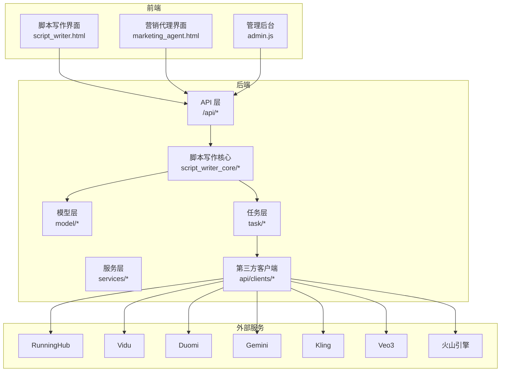
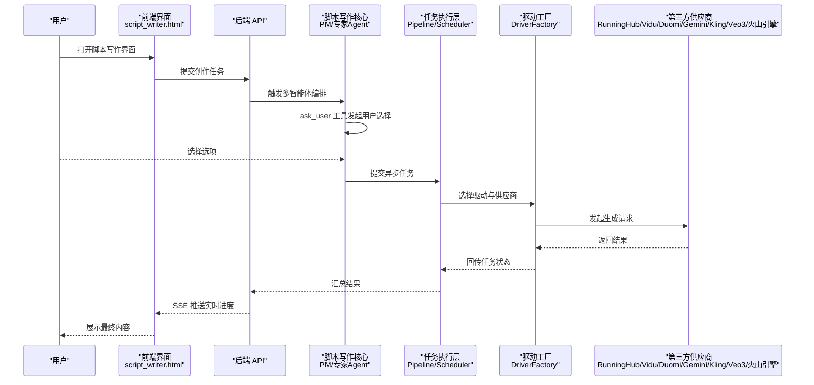
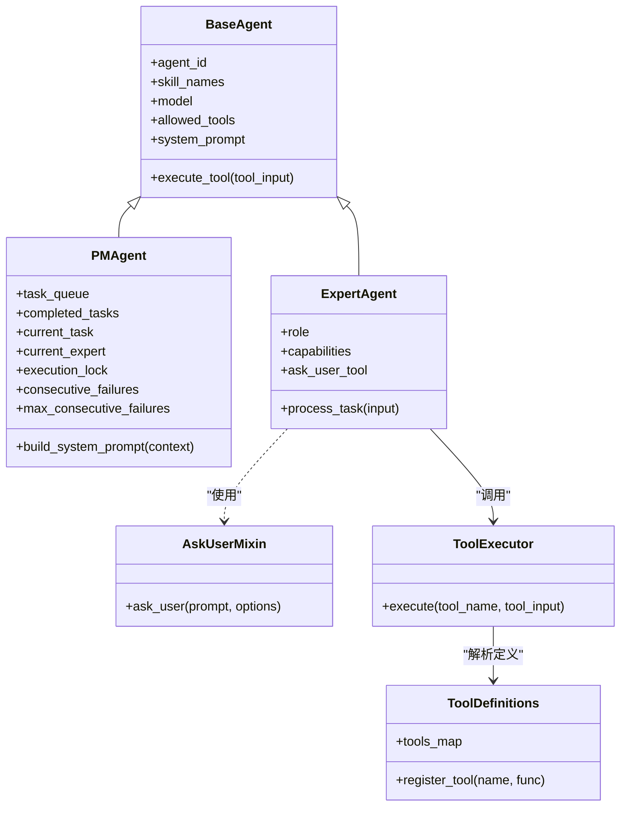
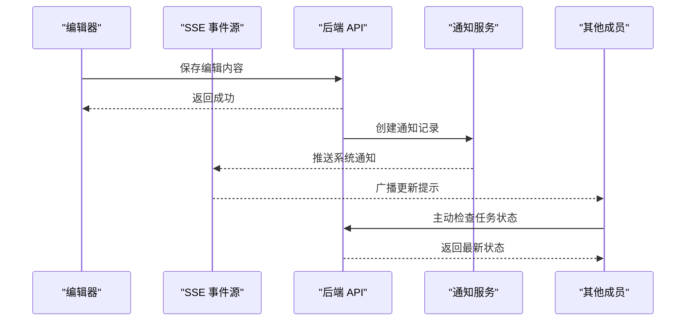
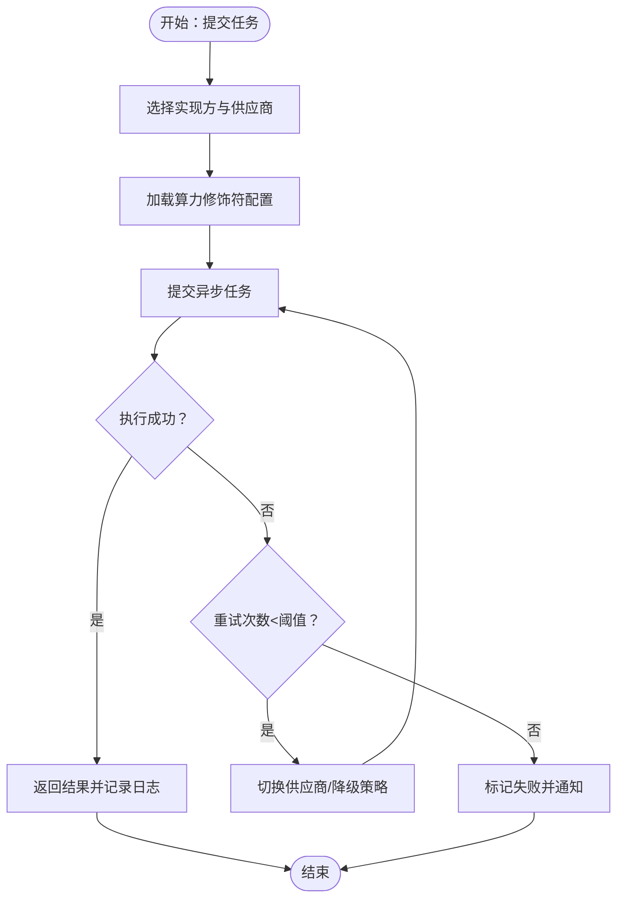
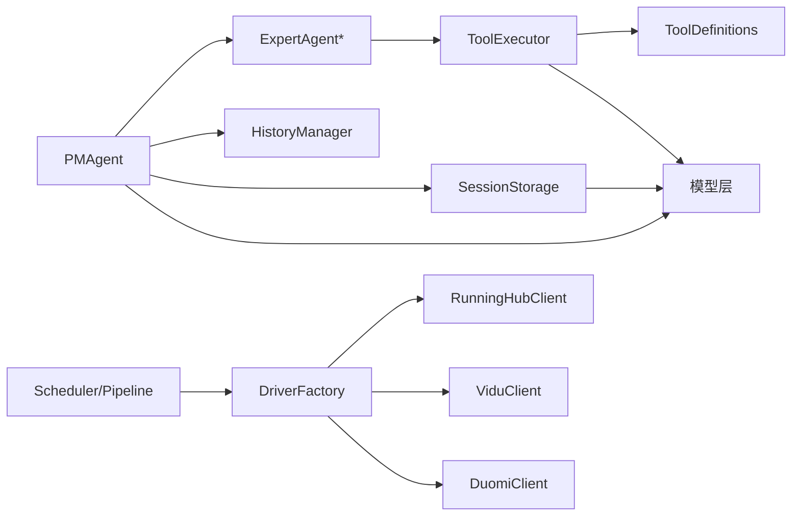

# 核心功能特性

<cite>
**本文引用的文件**
- [README_EN.md](file://README_EN.md)
- [pm_agent.py](file://script_writer_core/agents/pm_agent.py)
- [marketing_pm_agent.py](file://script_writer_core/agents/marketing_pm_agent.py)
- [expert_agent.py](file://script_writer_core/agents/expert_agent.py)
- [ask_user_mixin.py](file://script_writer_core/agents/ask_user_mixin.py)
- [tool_executor.py](file://script_writer_core/agents/tool_executor.py)
- [tool_definitions.py](file://script_writer_core/agents/tool_definitions.py)
- [base_agent.py](file://script_writer_core/agents/base_agent.py)
- [history_manager.py](file://script_writer_core/agents/history_manager.py)
- [session_storage.py](file://script_writer_core/session_storage.py)
- [script_writer.html](file://web/script_writer.html)
- [admin.js](file://web/js/admin.js)
- [marketing_agent.html](file://web/marketing_agent.html)
- [implementation_power.py](file://model/implementation_power.py)
- [implementation_power_config.py](file://model/implementation_power_config.py)
- [runninghub_client.py](file://api/clients/runninghub_client.py)
- [vidu_client.py](file://api/clients/vidu_client.py)
- [duomi_client.py](file://api/clients/duomi_client.py)
- [grid_image_tasks.py](file://model/grid_image_tasks.py)
- [location_multi_angle_tasks.py](file://model/location_multi_angle_tasks.py)
- [async_tasks.py](file://model/async_tasks.py)
- [runninghub_async_task.py](file://task/runninghub_async_task.py)
- [scheduler.py](file://task/scheduler.py)
- [pipeline_processor.py](file://task/pipeline_processor.py)
- [base_pipeline_driver.py](file://task/pipeline_drivers/base_pipeline_driver.py)
- [driver_factory.py](file://task/visual_drivers/driver_factory.py)
- [gemini_duomi_v1_driver.py](file://task/visual_drivers/gemini_duomi_v1_driver.py)
- [kling_common_v1_driver.py](file://task/visual_drivers/kling_common_v1_driver.py)
- [veo3_common_v1_driver.py](file://task/visual_drivers/veo3_common_v1_driver.py)
- [seedance_volcengine_v1_driver.py](file://task/visual_drivers/seedance_volcengine_v1_driver.py)
- [notification_service.py](file://services/notification_service.py)
- [notifications.py](file://model/notifications.py)
- [media_file_mapping.py](file://model/media_file_mapping.py)
- [media_cache.py](file://utils/media_cache.py)
- [media_mapping_util.py](file://utils/media_mapping_util.py)
- [computing_power.py](file://utils/computing_power.py)
- [computing_power_service.py](file://perseids_server/services/computing_power_service.py)
- [user_tokens.py](file://model/user_tokens.py)
- [user_preferences.py](file://model/user_preferences.py)
- [user_preferences.py](file://model/user_preferences.py)
- [user_tokens.py](file://model/user_tokens.py)
- [user_tokens.py](file://model/user_tokens.py)
- [user_tokens.py](file://model/user_tokens.py)
- [user_tokens.py](file://model/user_tokens.py)
- [user_tokens.py](file://model/user_tokens.py)
- [user_tokens.py](file://model/user_tokens.py)
- [user_tokens.py](file://model/user_tokens.py)
- [user_tokens.py](file://model/user_tokens.py)
- [user_tokens.py](file://model/user_tokens.py)
- [user_tokens.py](file://model/user_tokens.py)
- [user_tokens.py](file://model/user_tokens.py)
- [user_tokens.py](file://model/user_tokens.py)
- [user_tokens.py](file://model/user_tokens.py)
- [user_tokens.py](file://model/user_tokens.py)
- [user_tokens.py](file://model/user_tokens.py)
- [user_tokens.py](file://model/user_tokens.py)
- [user_tokens.py](file://model/user_tokens.py)
- [user_tokens.py](file://model/user_tokens.py)
- [user_tokens.py](file://model/user_tokens.py)
- [user_tokens.py](file://model/user_tokens.py)
- [user_tokens.py](file://model/user_tokens.py)
- [user_tokens.py](file://model/user_tokens.py)
- [user_tokens.py](file://model/user_tokens.py)
- [user_tokens.py](file://model/user_tokens.py)
- [user_tokens.py](file://model/user_tokens.py)
- [user_tokens.py](file://model/user_tokens.py)
- [user_tokens.py](file://model/user_tokens.py)
- [user_tokens.py](file://model/user_tokens.py)
- [user_tokens.py](file://model/user_tokens.py)
- [user_tokens.py](file://model/user_tokens.py)
- [user_tokens.py](file://model/user_tokens.py)
- [user_tokens.py](file://model/user_tokens.py)
- [user_tokens.py](file://model/user_tokens.py)
- [user_tokens.py](file://model/user_tokens.py)
- [user_tokens.py](file://model/user_tokens.py)
- [user_tokens.py](file://model/user_tokens.py)
- [user_tokens.py](file://model/user_tokens.py)
- [user_tokens.py](file://model/user_tokens.py)
- [user_tokens.py](file://model/user_tokens.py)
- [user_tokens.py](file://model/user_tokens......)
</cite>

## 目录
1. [简介](#简介)
2. [项目结构](#项目结构)
3. [核心组件](#核心组件)
4. [架构总览](#架构总览)
5. [详细组件分析](#详细组件分析)
6. [依赖关系分析](#依赖关系分析)
7. [性能考量](#性能考量)
8. [故障排查指南](#故障排查指南)
9. [结论](#结论)
10. [附录](#附录)

## 简介
本文件面向不同技术背景的用户，系统化阐述 ZhiJuTong AI 短剧生产平台的核心功能特性，重点覆盖：
- 多智能体协作系统（PM Agent + 8 位专家 Agent）的工作原理与协同机制，包含故事创作、角色设计、场景构建、内容合规等专业能力
- 实时团队协作功能（浏览器实时编辑、权限管理、SSE 实时推送）
- 用户级独立算力管理（独立账户、供应商选择、热更新配置）
- 典型使用场景与效果对比，量化效率提升与成本节约

## 项目结构
平台采用前后端分离与模块化服务架构，核心由以下子系统构成：
- 脚本写作核心（script_writer_core）：多智能体编排、对话历史、会话存储、工具执行
- 后端 API 与模型层：用户、令牌、算力、任务、通知、媒体映射等
- 任务执行层：异步任务调度、流水线处理、可视化驱动适配
- 客户端界面：脚本写作、营销代理、管理后台、实时协作与 SSE 推送
- 第三方算力供应商客户端：RunningHub、Vidu、Duomi、Gemini、Kling、Veo3、火山引擎等

**图表来源**
- [script_writer.html](file://web/script_writer.html)
- [marketing_agent.html](file://web/marketing_agent.html)
- [admin.js](file://web/js/admin.js)
- [api/clients/runninghub_client.py](file://api/clients/runninghub_client.py)
- [api/clients/vidu_client.py](file://api/clients/vidu_client.py)
- [api/clients/duomi_client.py](file://api/clients/duomi_client.py)

**章节来源**
- [README_EN.md:188-220](file://README_EN.md#L188-L220)

## 核心组件
- 多智能体系统：PM Agent 协调 8 位专家 Agent，支持 ask_user 工具实现“主动询问-用户选择-精准产出”的闭环
- 实时协作：浏览器内嵌编辑器 + SSE 推送 + 通知广播，保障多人实时同步
- 独立算力：用户级算力额度、供应商选择、动态配置热更新
- 任务编排：异步任务 + 流水线处理器 + 驱动工厂，统一调度多供应商视觉/音频生成

**章节来源**
- [pm_agent.py:88-118](file://script_writer_core/agents/pm_agent.py#L88-L118)
- [expert_agent.py](file://script_writer_core/agents/expert_agent.py)
- [ask_user_mixin.py](file://script_writer_core/agents/ask_user_mixin.py)
- [tool_executor.py](file://script_writer_core/agents/tool_executor.py)
- [tool_definitions.py](file://script_writer_core/agents/tool_definitions.py)
- [base_agent.py](file://script_writer_core/agents/base_agent.py)
- [history_manager.py](file://script_writer_core/agents/history_manager.py)
- [session_storage.py](file://script_writer_core/session_storage.py)

## 架构总览
下图展示了从用户请求到多供应商生成的端到端流程，以及 PM Agent 对专家 Agent 的编排与工具调用。

**图表来源**
- [script_writer.html](file://web/script_writer.html)
- [pm_agent.py](file://script_writer_core/agents/pm_agent.py)
- [expert_agent.py](file://script_writer_core/agents/expert_agent.py)
- [ask_user_mixin.py](file://script_writer_core/agents/ask_user_mixin.py)
- [scheduler.py](file://task/scheduler.py)
- [pipeline_processor.py](file://task/pipeline_processor.py)
- [driver_factory.py](file://task/visual_drivers/driver_factory.py)
- [runninghub_client.py](file://api/clients/runninghub_client.py)
- [vidu_client.py](file://api/clients/vidu_client.py)
- [duomi_client.py](file://api/clients/duomi_client.py)

## 详细组件分析

### 多智能体协作系统
- PM Agent：负责全局规划、任务队列管理、失败重试控制、环境上下文增强提示词构建
- 专家 Agent：各司其职，覆盖故事创作、角色设计、场景构建、内容合规、分镜/节奏分析、小说拆分、图像设计等
- ask_user 工具：在关键决策点主动向用户发起选择，减少反复修改，提高一次命中率
- 工具执行与定义：统一的工具注册与执行框架，确保 Agent 可组合、可扩展

**图表来源**
- [base_agent.py](file://script_writer_core/agents/base_agent.py)
- [pm_agent.py](file://script_writer_core/agents/pm_agent.py)
- [expert_agent.py](file://script_writer_core/agents/expert_agent.py)
- [ask_user_mixin.py](file://script_writer_core/agents/ask_user_mixin.py)
- [tool_executor.py](file://script_writer_core/agents/tool_executor.py)
- [tool_definitions.py](file://script_writer_core/agents/tool_definitions.py)

**章节来源**
- [README_EN.md:188-220](file://README_EN.md#L188-L220)
- [pm_agent.py:88-118](file://script_writer_core/agents/pm_agent.py#L88-L118)
- [expert_agent.py](file://script_writer_core/agents/expert_agent.py)
- [ask_user_mixin.py](file://script_writer_core/agents/ask_user_mixin.py)
- [tool_executor.py](file://script_writer_core/agents/tool_executor.py)
- [tool_definitions.py](file://script_writer_core/agents/tool_definitions.py)

### 实时团队协作与权限管理
- 浏览器内嵌编辑器：支持角色卡、场景、道具、剧本、世界设定等文件的在线编辑
- SSE 实时推送：通过事件流持续推送任务状态与进度，具备断线重连与错误恢复逻辑
- 权限管理：基于用户身份与令牌校验，编辑行为触发系统通知广播，提醒其他成员刷新最新内容
- 通知系统：统一的通知实体与服务，支持消息级别、时间窗口与链接跳转

**图表来源**
- [script_writer.html](file://web/script_writer.html)
- [notification_service.py](file://services/notification_service.py)
- [notifications.py](file://model/notifications.py)

**章节来源**
- [script_writer.html:2444-2607](file://web/script_writer.html#L2444-L2607)
- [script_writer.html:5460-5486](file://web/script_writer.html#L5460-L5486)
- [notification_service.py](file://services/notification_service.py)
- [notifications.py](file://model/notifications.py)

### 用户级独立算力管理
- 独立账户与额度：每个用户拥有独立的算力额度与令牌，支持充值与消费日志追踪
- 供应商选择：支持多家供应商（RunningHub、Vidu、Duomi、Gemini、Kling、Veo3、火山引擎），按任务类型自动或手动选择
- 动态配置热更新：管理员可对实现方（Implementation）的算力修饰符进行即时调整，无需重启
- 任务执行与回退：异步任务在供应商侧执行，失败时可重试或切换供应商；支持网格图像与多角度场景任务

**图表来源**
- [implementation_power.py](file://model/implementation_power.py)
- [implementation_power_config.py](file://model/implementation_power_config.py)
- [runninghub_client.py](file://api/clients/runninghub_client.py)
- [vidu_client.py](file://api/clients/vidu_client.py)
- [duomi_client.py](file://api/clients/duomi_client.py)
- [grid_image_tasks.py](file://model/grid_image_tasks.py)
- [location_multi_angle_tasks.py](file://model/location_multi_angle_tasks.py)
- [async_tasks.py](file://model/async_tasks.py)
- [runninghub_async_task.py](file://task/runninghub_async_task.py)
- [scheduler.py](file://task/scheduler.py)
- [pipeline_processor.py](file://task/pipeline_processor.py)
- [base_pipeline_driver.py](file://task/pipeline_drivers/base_pipeline_driver.py)
- [driver_factory.py](file://task/visual_drivers/driver_factory.py)
- [gemini_duomi_v1_driver.py](file://task/visual_drivers/gemini_duomi_v1_driver.py)
- [kling_common_v1_driver.py](file://task/visual_drivers/kling_common_v1_driver.py)
- [veo3_common_v1_driver.py](file://task/visual_drivers/veo3_common_v1_driver.py)
- [seedance_volcengine_v1_driver.py](file://task/visual_drivers/seedance_volcengine_v1_driver.py)

**章节来源**
- [implementation_power.py:173-211](file://model/implementation_power.py#L173-L211)
- [admin.js:2603-2632](file://web/js/admin.js#L2603-L2632)
- [marketing_agent.html:1119-1155](file://web/marketing_agent.html#L1119-L1155)
- [grid_image_tasks.py](file://model/grid_image_tasks.py)
- [location_multi_angle_tasks.py](file://model/location_multi_angle_tasks.py)
- [async_tasks.py](file://model/async_tasks.py)
- [runninghub_async_task.py](file://task/runninghub_async_task.py)
- [scheduler.py](file://task/scheduler.py)
- [pipeline_processor.py](file://task/pipeline_processor.py)
- [base_pipeline_driver.py](file://task/pipeline_drivers/base_pipeline_driver.py)
- [driver_factory.py](file://task/visual_drivers/driver_factory.py)
- [gemini_duomi_v1_driver.py](file://task/visual_drivers/gemini_duomi_v1_driver.py)
- [kling_common_v1_driver.py](file://task/visual_drivers/kling_common_v1_driver.py)
- [veo3_common_v1_driver.py](file://task/visual_drivers/veo3_common_v1_driver.py)
- [seedance_volcengine_v1_driver.py](file://task/visual_drivers/seedance_volcengine_v1_driver.py)

## 依赖关系分析
- 组件耦合与内聚：PM Agent 与 Expert Agent 通过工具接口解耦；工具定义集中管理，便于扩展
- 外部依赖：第三方供应商客户端封装统一接口，驱动工厂根据任务类型选择具体实现
- 数据一致性：媒体映射与缓存策略保证资源复用与一致性；通知系统确保跨端同步

**图表来源**
- [pm_agent.py](file://script_writer_core/agents/pm_agent.py)
- [expert_agent.py](file://script_writer_core/agents/expert_agent.py)
- [tool_executor.py](file://script_writer_core/agents/tool_executor.py)
- [tool_definitions.py](file://script_writer_core/agents/tool_definitions.py)
- [history_manager.py](file://script_writer_core/agents/history_manager.py)
- [session_storage.py](file://script_writer_core/session_storage.py)
- [scheduler.py](file://task/scheduler.py)
- [pipeline_processor.py](file://task/pipeline_processor.py)
- [driver_factory.py](file://task/visual_drivers/driver_factory.py)
- [runninghub_client.py](file://api/clients/runninghub_client.py)
- [vidu_client.py](file://api/clients/vidu_client.py)
- [duomi_client.py](file://api/clients/duomi_client.py)

**章节来源**
- [pm_agent.py](file://script_writer_core/agents/pm_agent.py)
- [expert_agent.py](file://script_writer_core/agents/expert_agent.py)
- [tool_executor.py](file://script_writer_core/agents/tool_executor.py)
- [tool_definitions.py](file://script_writer_core/agents/tool_definitions.py)
- [history_manager.py](file://script_writer_core/agents/history_manager.py)
- [session_storage.py](file://script_writer_core/session_storage.py)
- [scheduler.py](file://task/scheduler.py)
- [pipeline_processor.py](file://task/pipeline_processor.py)
- [driver_factory.py](file://task/visual_drivers/driver_factory.py)
- [runninghub_client.py](file://api/clients/runninghub_client.py)
- [vidu_client.py](file://api/clients/vidu_client.py)
- [duomi_client.py](file://api/clients/duomi_client.py)

## 性能考量
- 任务并发与节流：通过调度器与流水线处理器控制并发度，避免供应商限流与资源争用
- 缓存与复用：媒体缓存与映射工具降低重复生成与传输成本
- 断线重连：SSE 连接具备指数退避与状态回查，减少无效重试
- 算力修饰符：动态调整不同模式与供应商的算力权重，平衡速度与质量

[本节为通用指导，不直接分析具体文件]

## 故障排查指南
- SSE 连接失败：检查任务状态，若仍在执行则重连；若已完成则安全重置状态
- 任务执行异常：查看异步任务与供应商返回日志，必要时切换供应商或降级策略
- 通知未送达：确认通知实体与服务配置，检查时间窗口与用户权限
- 算力不足：检查用户余额与实现方配置，必要时充值或调整修饰符

**章节来源**
- [script_writer.html:2444-2607](file://web/script_writer.html#L2444-L2607)
- [async_tasks.py](file://model/async_tasks.py)
- [notification_service.py](file://services/notification_service.py)
- [notifications.py](file://model/notifications.py)
- [implementation_power.py:173-211](file://model/implementation_power.py#L173-L211)

## 结论
ZhiJuTong 将多智能体协作、实时团队协作与用户级独立算力管理有机结合，形成“规划-创作-生成-协作-优化”的完整闭环。相比传统创作方式，平台显著缩短创作周期、降低沟通成本，并通过供应商弹性与动态配置实现更优的成本控制。

[本节为总结性内容，不直接分析具体文件]

## 附录
- 使用场景建议
  - 快速短剧：PM Agent + 故事写手 + 场景/角色设计 + 内容合规，一键生成初稿
  - 多人协作：编辑器 + SSE + 通知广播，保障实时同步与变更可见
  - 成本优化：按任务类型选择最优供应商，动态调整算力修饰符，实现性价比最大化

[本节为概念性内容，不直接分析具体文件]