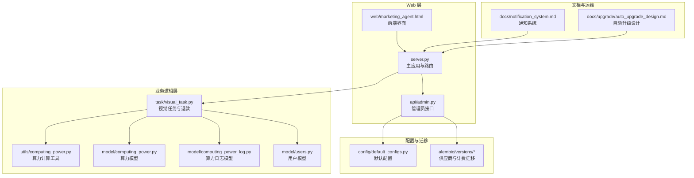
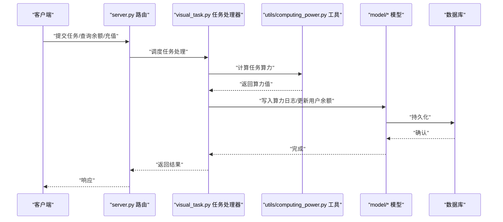
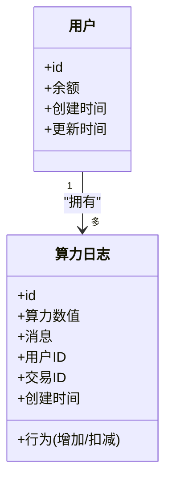
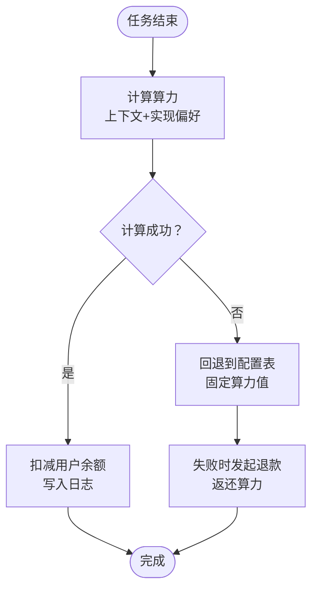
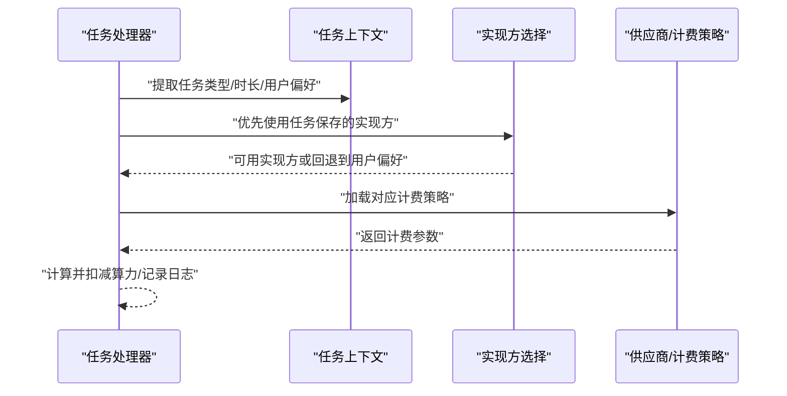
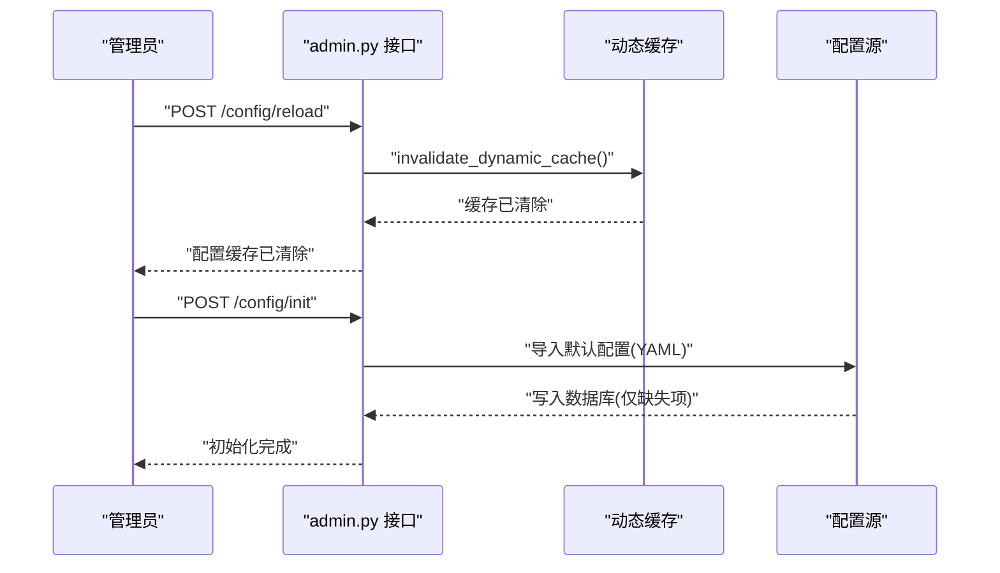
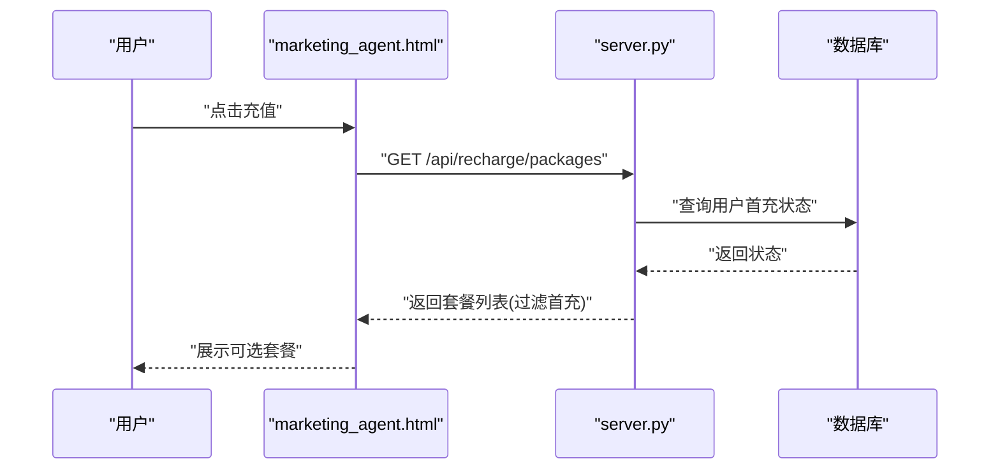
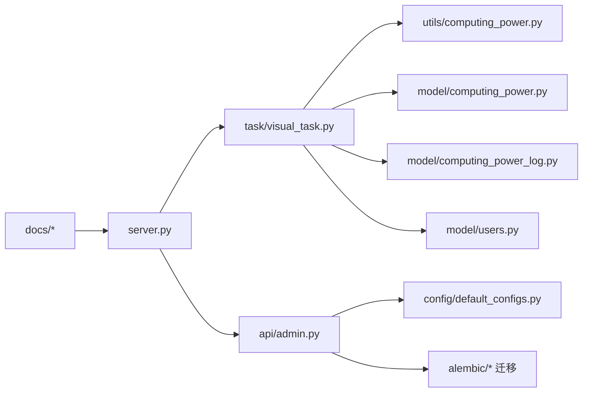

# 算力管理与计费系统

<cite>
**本文引用的文件**
- [server.py](file://server.py)
- [admin.py](file://api/admin.py)
- [computing_power.py](file://model/computing_power.py)
- [computing_power_log.py](file://model/computing_power_log.py)
- [users.py](file://model/users.py)
- [visual_task.py](file://task/visual_task.py)
- [utils_computing_power.py](file://utils/computing_power.py)
- [default_configs.py](file://config/default_configs.py)
- [notification_system.md](file://docs/notification_system.md)
- [auto_upgrade_design.md](file://docs/upgrade/auto_upgrade_design.md)
- [marketing_agent.html](file://web/marketing_agent.html)
- [20260421_rename_vendor_jiekou_to_google.py](file://alembic/versions/20260421_rename_vendor_jiekou_to_google.py)
- [20260428_add_zjt_api_gpt55_model.py](file://alembic/versions/20260428_add_zjt_api_gpt55_model.py)
</cite>

## 目录
1. [简介](#简介)
2. [项目结构](#项目结构)
3. [核心组件](#核心组件)
4. [架构总览](#架构总览)
5. [详细组件分析](#详细组件分析)
6. [依赖关系分析](#依赖关系分析)
7. [性能考量](#性能考量)
8. [故障排查指南](#故障排查指南)
9. [结论](#结论)
10. [附录](#附录)

## 简介
本系统围绕“用户级独立算力管理”构建，提供完整的用户账户体系、算力余额与消费记录、供应商多实现与自动故障转移、以及管理员配置热更新能力。系统支持按任务类型、时长、实现方（供应商）等维度进行精细化算力计费，并在任务失败或异常时执行退款流程。同时，系统提供充值套餐、首充优惠、以及面向教育、企业、创意工作室等场景的成本控制方案。

## 项目结构
系统采用分层架构：Web API 层负责对外接口与权限校验；业务逻辑层处理算力计算、退款、配置热更新；模型层负责数据库表结构与持久化；工具层提供通用算法与策略；任务层封装异步与可视化生成任务；配置与迁移层支撑统一配置与数据库演进。

**图表来源**
- [server.py](file://server.py)
- [admin.py](file://api/admin.py)
- [visual_task.py](file://task/visual_task.py)
- [utils_computing_power.py](file://utils/computing_power.py)
- [computing_power.py](file://model/computing_power.py)
- [computing_power_log.py](file://model/computing_power_log.py)
- [users.py](file://model/users.py)
- [default_configs.py](file://config/default_configs.py)
- [notification_system.md](file://docs/notification_system.md)
- [auto_upgrade_design.md](file://docs/upgrade/auto_upgrade_design.md)

**章节来源**
- [server.py](file://server.py)
- [admin.py](file://api/admin.py)
- [visual_task.py](file://task/visual_task.py)

## 核心组件
- 用户账户与余额
  - 用户模型提供账户基础信息与余额字段，支持外部充值与内部消费扣减。
  - 算力日志模型记录每次余额变动的明细，便于审计与对账。
- 算力计费与退款
  - 任务完成后根据任务类型、时长、实现方（供应商）计算消耗算力。
  - 失败或异常时触发退款，向用户账户返还相应算力。
- 供应商与实现方
  - 支持多供应商（如 Google、ZJT 等）与多实现（实现方）组合，按实现偏好与任务上下文动态选择。
  - 数据库迁移脚本维护供应商与模型映射及计费策略。
- 管理员热更新
  - 提供配置热加载接口，清除动态缓存后即时生效，无需重启服务。
- 充值与套餐
  - 提供充值套餐列表，支持首充优惠过滤，前端引导用户完成充值。

**章节来源**
- [users.py](file://model/users.py)
- [computing_power_log.py](file://model/computing_power_log.py)
- [visual_task.py](file://task/visual_task.py)
- [20260421_rename_vendor_jiekou_to_google.py](file://alembic/versions/20260421_rename_vendor_jiekou_to_google.py)
- [20260428_add_zjt_api_gpt55_model.py](file://alembic/versions/20260428_add_zjt_api_gpt55_model.py)
- [admin.py](file://api/admin.py)
- [marketing_agent.html](file://web/marketing_agent.html)

## 架构总览
系统以 Flask/FastAPI 应用为核心，通过 API 路由接收请求，调用任务处理器与工具层进行算力计算与退款，最终写入数据库并返回结果。管理员可通过后台接口进行配置热更新与初始化。

**图表来源**
- [server.py](file://server.py)
- [visual_task.py](file://task/visual_task.py)
- [utils_computing_power.py](file://utils/computing_power.py)
- [computing_power.py](file://model/computing_power.py)
- [computing_power_log.py](file://model/computing_power_log.py)

## 详细组件分析

### 用户级独立账户与余额管理
- 账户创建与信息
  - 用户模型包含基础字段与余额字段，用于承载用户级算力余额。
- 余额变更记录
  - 算力日志模型记录每次余额变动（增加/扣减）、原因、交易号、时间戳等，支持审计与统计。
- 余额查询与消费
  - API 层提供余额查询与消费接口，结合任务处理器在任务完成后更新用户余额与日志。

**图表来源**
- [users.py](file://model/users.py)
- [computing_power_log.py](file://model/computing_power_log.py)

**章节来源**
- [users.py](file://model/users.py)
- [computing_power_log.py](file://model/computing_power_log.py)

### 算力计费策略与退款机制
- 计费策略
  - 优先基于任务上下文与实现偏好计算算力，支持按任务类型、时长、实现方等参数动态调整。
  - 若无法计算，则回退到预设配置表中的固定值。
- 退款机制
  - 任务失败或异常时，系统自动发起退款，向用户账户返还对应算力。
  - 退款通过外部服务接口完成，确保一致性与幂等性。

**图表来源**
- [visual_task.py](file://task/visual_task.py)
- [utils_computing_power.py](file://utils/computing_power.py)
- [computing_power.py](file://model/computing_power.py)

**章节来源**
- [visual_task.py](file://task/visual_task.py)
- [utils_computing_power.py](file://utils/computing_power.py)
- [computing_power.py](file://model/computing_power.py)

### 供应商选择机制与多实现冗余
- 供应商与实现方
  - 系统支持多供应商与多实现组合，按任务创建时保存的实现方优先，若不可用则回退到用户当前偏好。
  - 数据库迁移脚本维护供应商名称变更与模型计费配置，确保计费策略随实现方变化而更新。
- 自动故障转移
  - 当首选实现方不可用时，系统自动选择备选实现方，保障任务可用性与成本可控。

**图表来源**
- [visual_task.py](file://task/visual_task.py)
- [20260421_rename_vendor_jiekou_to_google.py](file://alembic/versions/20260421_rename_vendor_jiekou_to_google.py)
- [20260428_add_zjt_api_gpt55_model.py](file://alembic/versions/20260428_add_zjt_api_gpt55_model.py)

**章节来源**
- [visual_task.py](file://task/visual_task.py)
- [20260421_rename_vendor_jiekou_to_google.py](file://alembic/versions/20260421_rename_vendor_jiekou_to_google.py)
- [20260428_add_zjt_api_gpt55_model.py](file://alembic/versions/20260428_add_zjt_api_gpt55_model.py)

### 管理员热更新功能
- 配置热加载
  - 管理员通过后台接口触发缓存失效，系统重新加载配置，实现无重启更新。
- 初始化默认配置
  - 支持从 YAML 文件导入默认配置到数据库，仅插入缺失项，避免覆盖现有设置。

**图表来源**
- [admin.py](file://api/admin.py)

**章节来源**
- [admin.py](file://api/admin.py)

### 充值套餐与首充优惠
- 套餐列表
  - 后台提供充值套餐接口，返回不同算力与价格的套餐。
- 首充过滤
  - 对于已完成首充的用户，自动过滤掉首充优惠套餐，避免重复享受。
- 前端引导
  - 前端页面在非本地部署环境下引导用户打开充值弹窗并加载套餐列表。

**图表来源**
- [marketing_agent.html](file://web/marketing_agent.html)
- [server.py](file://server.py)

**章节来源**
- [marketing_agent.html](file://web/marketing_agent.html)
- [server.py](file://server.py)

### 使用场景与成本控制
- 教育环境
  - 可设置批量充值套餐与预算上限，按任务类型与时长进行精细化计费，避免超支。
- 企业团队
  - 支持部门级配额与审批流程，结合实现偏好控制成本，自动故障转移保障稳定性。
- 创意工作室
  - 提供高性价比实现方组合与首充优惠，配合退款机制降低试错成本。

[本节为概念性说明，不直接分析具体文件]

## 依赖关系分析
系统各模块之间存在清晰的职责边界与依赖关系：API 层依赖任务层与工具层；任务层依赖模型层与工具层；配置层与迁移层为系统提供运行期参数与数据库演进能力。

**图表来源**
- [server.py](file://server.py)
- [admin.py](file://api/admin.py)
- [visual_task.py](file://task/visual_task.py)
- [utils_computing_power.py](file://utils/computing_power.py)
- [computing_power.py](file://model/computing_power.py)
- [computing_power_log.py](file://model/computing_power_log.py)
- [users.py](file://model/users.py)
- [default_configs.py](file://config/default_configs.py)

**章节来源**
- [server.py](file://server.py)
- [admin.py](file://api/admin.py)
- [visual_task.py](file://task/visual_task.py)

## 性能考量
- 动态缓存与热更新
  - 通过缓存失效实现配置快速生效，减少重启带来的停机时间。
- 批量退款与幂等
  - 退款流程保证同一交易号幂等，避免重复退款导致的余额异常。
- 任务上下文计算
  - 优先使用任务上下文与实现偏好计算算力，减少回退路径，提升计算效率。

[本节提供一般性指导，不直接分析具体文件]

## 故障排查指南
- 退款失败
  - 检查外部服务接口连通性与鉴权头；确认交易号唯一且未重复退款。
- 配置未生效
  - 确认已调用配置热加载接口并完成缓存失效；检查默认配置导入是否成功。
- 供应商计费异常
  - 核对迁移脚本是否正确执行；验证实现方与供应商映射关系。

**章节来源**
- [server.py](file://server.py)
- [admin.py](file://api/admin.py)
- [20260421_rename_vendor_jiekou_to_google.py](file://alembic/versions/20260421_rename_vendor_jiekou_to_google.py)
- [20260428_add_zjt_api_gpt55_model.py](file://alembic/versions/20260428_add_zjt_api_gpt55_model.py)

## 结论
本系统通过用户级独立账户、精细化算力计费与退款、多供应商实现方选择与自动故障转移、以及管理员配置热更新，实现了灵活的成本控制与资源管理。结合充值套餐与首充优惠，可在教育、企业、创意工作室等场景中满足多样化的算力需求与预算约束。

[本节为总结性内容，不直接分析具体文件]

## 附录
- 远程通知与自动升级
  - 系统支持远程通知拉取与版本升级流程，前端通过 SSE 或轮询获取状态，保障运维体验。

**章节来源**
- [notification_system.md](file://docs/notification_system.md)
- [auto_upgrade_design.md](file://docs/upgrade/auto_upgrade_design.md)