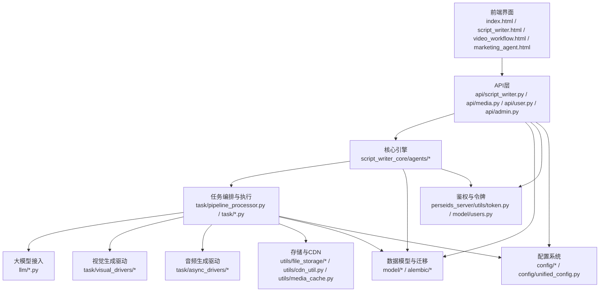
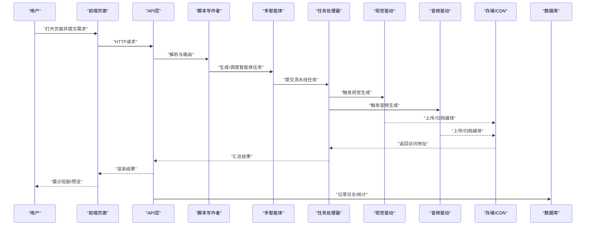
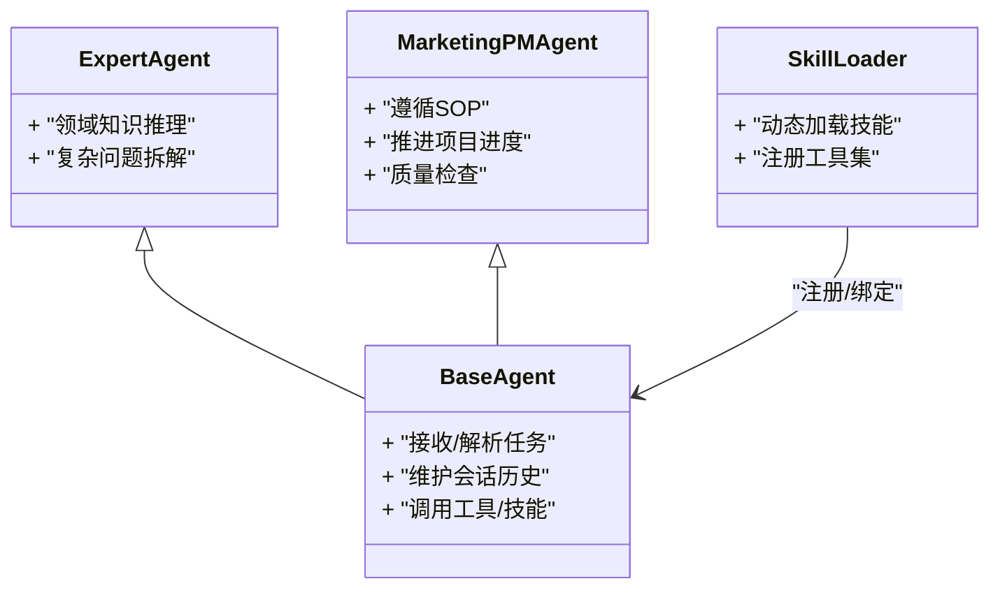
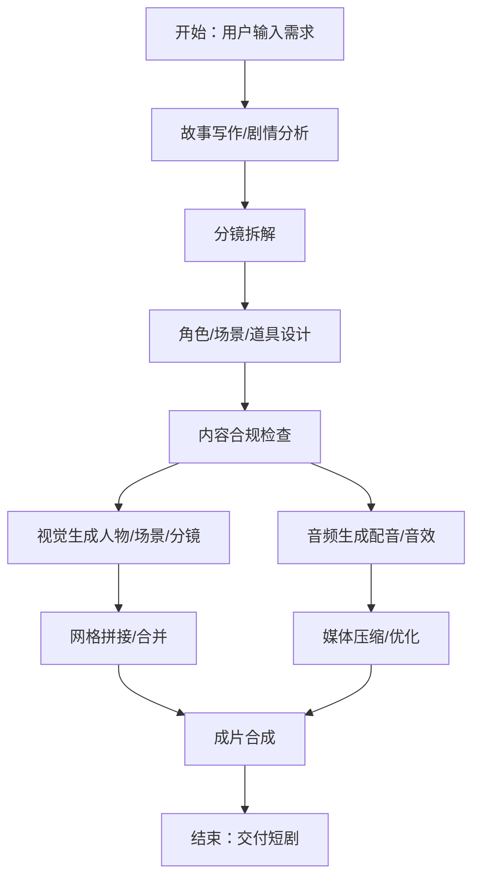
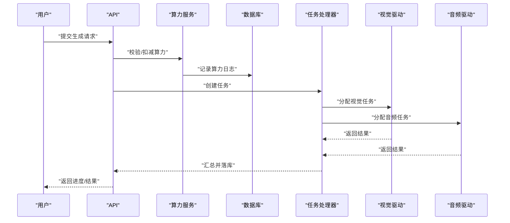
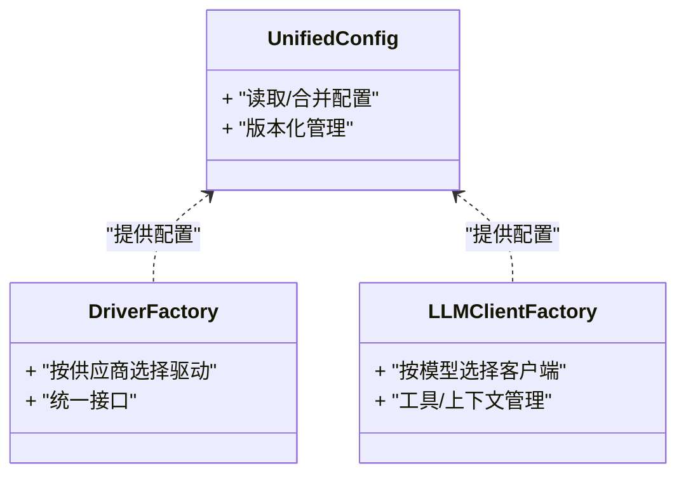
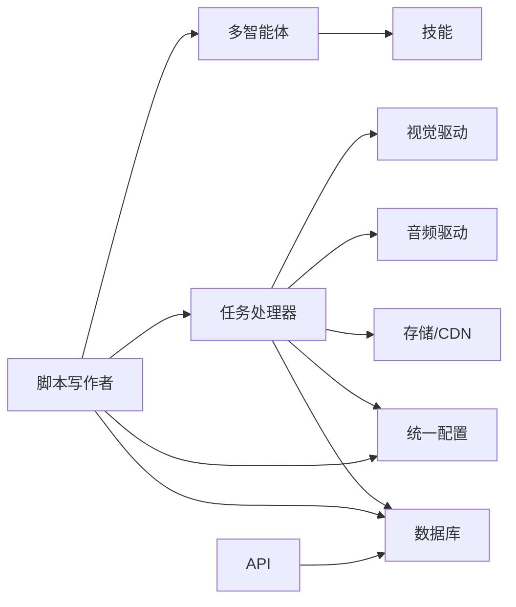

# 项目概述

<cite>
**本文引用的文件**
- [server.py](file://server.py)
- [README_EN.md](file://README_EN.md)
- [script_writer_core/agents/base_agent.py](file://script_writer_core/agents/base_agent.py)
- [script_writer_core/agents/expert_agent.py](file://script_writer_core/agents/expert_agent.py)
- [script_writer_core/agents/marketing_pm_agent.py](file://script_writer_core/agents/marketing_pm_agent.py)
- [script_writer_core/skills/story-writer/SKILL.md](file://script_writer_core/skills/story-writer/SKILL.md)
- [script_writer_core/skills/plot-analyzer/SKILL.md](file://script_writer_core/skills/plot-analyzer/SKILL.md)
- [script_writer_core/skills/location-creator/SKILL.md](file://script_writer_core/skills/location-creator/SKILL.md)
- [script_writer_core/skills/character-creator/SKILL.md](file://script_writer_core/skills/character-creator/SKILL.md)
- [script_writer_core/skills/novel-episode-splitter/SKILL.md](file://script_writer_core/skills/novel-episode-splitter/SKILL.md)
- [script_writer_core/skills/content-compliance-checker/SKILL.md](file://script_writer_core/skills/content-compliance-checker/SKILL.md)
- [script_writer_core/skills/script-orchestrator/SKILL.md](file://script_writer_core/skills/script-orchestrator/SKILL.md)
- [agents/skill_loader.py](file://agents/skill_loader.py)
- [agents/skills/marketing-pm/sops/sop-video-generation.md](file://agents/skills/marketing-pm/sops/sop-video-generation.md)
- [model/agent_tasks.py](file://model/agent_tasks.py)
- [task/pipeline_processor.py](file://task/pipeline_processor.py)
- [task/audio_task.py](file://task/audio_task.py)
- [task/visual_task.py](file://task/visual_task.py)
- [task/grid_image_task.py](file://task/grid_image_task.py)
- [task/location_multi_angle_task.py](file://task/location_multi_angle_task.py)
- [task/runninghub_async_task.py](file://task/runninghub_async_task.py)
- [perseids_server/services/computing_power_service.py](file://perseids_server/services/computing_power_service.py)
- [perseids_server/utils/token.py](file://perseids_server/utils/token.py)
- [api/script_writer.py](file://api/script_writer.py)
- [api/media.py](file://api/media.py)
- [api/user.py](file://api/user.py)
- [api/admin.py](file://api/admin.py)
- [web/index.html](file://web/index.html)
- [web/script_writer.html](file://web/script_writer.html)
- [web/video_workflow.html](file://web/video_workflow.html)
- [web/marketing_agent.html](file://web/marketing_agent.html)
- [docs/backend/pipeline_steps.md](file://docs/backend/pipeline_steps.md)
- [docs/backend/runninghub_concurrency_control.md](file://docs/backend/runninghub_concurrency_control.md)
- [docs/backend/unified_config_system.md](file://docs/backend/unified_config_system.md)
- [docs/算力多维度计算方案.md](file://docs/后台/算力多维度计算方案.md)
- [docs/权限系统/权限系统设计.md](file://docs/权限系统/权限系统设计.md)
- [docs/媒体文件缓存管理方案.md](file://docs/媒体文件缓存管理方案.md)
- [docs/Windows启动开发说明.md](file://docs/Windows启动开发说明.md)
- [requirements.txt](file://requirements.txt)
- [config/default_configs.py](file://config/default_configs.py)
- [config/unified_config.py](file://config/unified_config.py)
- [config/constant.py](file://config/constant.py)
- [config/version.py](file://config/version.py)
- [llm/script_parser.py](file://llm/script_parser.py)
- [llm/qwen.py](file://llm/qwen.py)
- [llm/gemini_client.py](file://llm/gemini_client.py)
- [llm/ollama_client.py](file://llm/ollama_client.py)
- [llm/zjt_openai_client.py](file://llm/zjt_openai_client.py)
- [task/async_drivers/runninghub_audio_driver.py](file://task/async_drivers/runninghub_audio_driver.py)
- [task/visual_drivers/digital_human_runninghub_v1_driver.py](file://task/visual_drivers/digital_human_runninghub_v1_driver.py)
- [task/visual_drivers/seedance_volcengine_v1_driver.py](file://task/visual_drivers/seedance_volcengine_v1_driver.py)
- [task/visual_drivers/veo3_common_v1_driver.py](file://task/visual_drivers/veo3_common_v1_driver.py)
- [task/visual_drivers/kling_common_v1_driver.py](file://task/visual_drivers/kling_common_v1_driver.py)
- [task/visual_drivers/gpt_image_common_v1_driver.py](file://task/visual_drivers/gpt_image_common_v1_driver.py)
- [task/visual_drivers/ltx2_runninghub_v1_driver.py](file://task/visual_drivers/ltx2_runninghub_v1_driver.py)
- [task/visual_drivers/sora2_duomi_v1_driver.py](file://task/visual_drivers/sora2_duomi_v1_driver.py)
- [task/visual_drivers/vidu_default_driver.py](file://task/visual_drivers/vidu_default_driver.py)
- [task/visual_drivers/wan22_runninghub_v1_driver.py](file://task/visual_drivers/wan22_runninghub_v1_driver.py)
- [utils/computing_power.py](file://utils/computing_power.py)
- [utils/media_cache.py](file://utils/media_cache.py)
- [utils/image_grid_merger.py](file://utils/image_grid_merger.py)
- [utils/image_grid_splitter.py](file://utils/image_grid_splitter.py)
- [utils/audio_utils.py](file://utils/audio_utils.py)
- [utils/video_compressor.py](file://utils/video_compressor.py)
- [utils/cdn_util.py](file://utils/cdn_util.py)
- [utils/file_storage/factory.py](file://utils/file_storage/factory.py)
- [utils/file_storage/runninghub_storage.py](file://utils/file_storage/runninghub_storage.py)
- [utils/file_storage/qiniu_storage.py](file://utils/file_storage/qiniu_storage.py)
- [model/computing_power.py](file://model/computing_power.py)
- [model/computing_power_log.py](file://model/computing_power_log.py)
- [model/implementation_power.py](file://model/implementation_power.py)
- [model/implementation_power_config.py](file://model/implementation_power_config.py)
- [model/runninghub_slots.py](file://model/runninghub_slots.py)
- [model/ai_tools.py](file://model/ai_tools.py)
- [model/ai_audio.py](file://model/ai_audio.py)
- [model/world.py](file://model/world.py)
- [model/character.py](file://model/character.py)
- [model/location.py](file://model/location.py)
- [model/props.py](file://model/props.py)
- [model/script.py](file://model/script.py)
- [model/notifications.py](file://model/notifications.py)
- [model/system_config.py](file://model/system_config.py)
- [model/user_preferences.py](file://model/user_preferences.py)
- [model/chat_sessions.py](file://model/chat_sessions.py)
- [model/tokens.py](file://model/tokens.py)
- [model/users.py](file://model/users.py)
- [model/vendor.py](file://model/vendor.py)
- [model/vendor_model.py](file://model/vendor_model.py)
- [model/token_log.py](file://model/token_log.py)
- [model/uncalculated_power.py](file://model/uncalculated_power.py)
- [model/uncalculated_token.py](file://model/uncalculated_token.py)
- [model/async_tasks.py](file://model/async_tasks.py)
- [model/tasks.py](file://model/tasks.py)
- [model/agent_verifications.py](file://model/agent_verifications.py)
- [model/agent_task_messages.py](file://model/agent_task_messages.py)
- [model/video_workflow.py](file://model/video_workflow.py)
- [model/skill_definitions.py](file://model/skill_definitions.py)
- [model/skill_definitions.py](file://model/skill_definitions.py)
- [model/skill_definitions.py](file://model/skill_definitions.py)
- [model/skill_definitions.py](file://model/skill_definitions.py)
- [model/skill_definitions.py](file://model/skill_definitions.py)
- [model/skill_definitions.py](file://model/skill_definitions.py)
- [model/skill_definitions.py](file://model/skill_definitions.py)
- [model/skill_definitions.py](file://model/skill_definitions.py)
- [model/skill_definitions.py](file://model/skill_definitions.py)
- [model/skill_definitions.py](file://model/skill_definitions.py)
- [model/skill_definitions.py](file://model/skill_definitions.py)
- [model/skill_definitions.py](file://model/skill_definitions.py)
- [model/skill_definitions.py](file://model/skill_definitions.py)
- [model/skill_definitions.py](file://model/skill_definitions.py)
- [model/skill_definitions.py](file://model/skill_definitions.py)
- [model/skill_definitions.py](file://model/skill_definitions.py)
- [model/skill_definitions.py](file://model/skill_definitions.py)
- [model/skill_definitions.py](file://model/skill_definitions.py)
- [model/skill_definitions.py](file://model/skill_definitions.py)
- [model/skill_definitions.py](file://model/skill_definitions.py)
- [model/skill_definitions.py](file://model/skill_definitions.py)
- [model/skill_definitions.py](file://model/skill_definitions.py)
- [model/skill_definitions.py](file://model/skill_definitions.py)
- [model/skill_definitions.py](file://model/skill_definitions.py)
- [model/skill_definitions.py](file://model/skill_definitions.py)
- [model/skill_definitions.py](file://model/skill_definitions.py)
- [model/skill_definitions.py](file://model/skill_definitions.py)
- [model/skill_definitions.py](file://model/skill_definitions.py)
- [model/skill_definitions.py](file://model/skill_definitions.py)
- [model/skill_definitions.py](file://model/skill_definitions.py)
- [model/skill_definitions.py](file://model/skill_definitions.py)
- [model/skill_definitions.py](file://model/skill_definitions.py)
-......
</cite>

## 目录
1. [引言](#引言)
2. [项目结构](#项目结构)
3. [核心组件](#核心组件)
4. [架构总览](#架构总览)
5. [详细组件分析](#详细组件分析)
6. [依赖分析](#依赖分析)
7. [性能考虑](#性能考虑)
8. [故障排查指南](#故障排查指南)
9. [结论](#结论)
10. [附录](#附录)

## 引言
ZhiJuTong AI短剧生产平台是一个面向教育、企业与内容创作领域的多智能体协作型AI短剧生成系统。其核心价值在于通过“用户级独立算力管理”“实时协作编辑”“多供应商异构算力统一调度”等能力，将从“剧本创作—角色/场景设计—图像/视频生成—音频合成—最终成片”的全流程自动化与可视化，显著降低内容生产的门槛与成本。

平台以“脚本写作者（Script Writer）”为核心引擎，结合营销项目经理（Marketing PM Agent）、专家智能体（Expert Agent）与通用工具（Skills），形成可编排、可扩展的多智能体工作流；后端通过统一配置与算力计量体系，对接多家视觉/音频生成服务（如RunningHub、Veo3、Kling、Seedance、GPT Image、Sora2、Vidu等），实现跨模型、跨供应商的高效协同与成本优化。

## 项目结构
项目采用前后端分离与模块化分层架构：前端Web页面负责交互与可视化编辑；后端以Flask风格的服务入口为中心，围绕任务编排、多智能体、算力与媒体管理、LLM集成、驱动适配等模块组织；数据库迁移与模型定义由Alembic与ORM模型支撑；测试覆盖单元测试、端到端测试与驱动集成测试；文档涵盖后端流水线、并发控制、统一配置、权限系统、媒体缓存等主题。

图表来源
- [server.py](file://server.py)
- [api/script_writer.py](file://api/script_writer.py)
- [api/media.py](file://api/media.py)
- [api/user.py](file://api/user.py)
- [api/admin.py](file://api/admin.py)
- [script_writer_core/agents/base_agent.py](file://script_writer_core/agents/base_agent.py)
- [task/pipeline_processor.py](file://task/pipeline_processor.py)
- [llm/script_parser.py](file://llm/script_parser.py)
- [task/visual_drivers/digital_human_runninghub_v1_driver.py](file://task/visual_drivers/digital_human_runninghub_v1_driver.py)
- [task/visual_drivers/veo3_common_v1_driver.py](file://task/visual_drivers/veo3_common_v1_driver.py)
- [task/visual_drivers/kling_common_v1_driver.py](file://task/visual_drivers/kling_common_v1_driver.py)
- [task/visual_drivers/sora2_duomi_v1_driver.py](file://task/visual_drivers/sora2_duomi_v1_driver.py)
- [task/visual_drivers/vidu_default_driver.py](file://task/visual_drivers/vidu_default_driver.py)
- [task/async_drivers/runninghub_audio_driver.py](file://task/async_drivers/runninghub_audio_driver.py)
- [utils/file_storage/factory.py](file://utils/file_storage/factory.py)
- [utils/cdn_util.py](file://utils/cdn_util.py)
- [utils/media_cache.py](file://utils/media_cache.py)
- [model/agent_tasks.py](file://model/agent_tasks.py)
- [config/unified_config.py](file://config/unified_config.py)
- [perseids_server/utils/token.py](file://perseids_server/utils/token.py)

章节来源
- [server.py](file://server.py)
- [web/index.html](file://web/index.html)
- [web/script_writer.html](file://web/script_writer.html)
- [web/video_workflow.html](file://web/video_workflow.html)
- [web/marketing_agent.html](file://web/marketing_agent.html)

## 核心组件
- 脚本写作者（Script Writer）：作为多智能体编排中枢，负责将用户输入转化为可执行的技能调用序列，并协调各Agent完成故事、角色、场景、分镜与合规检查等任务。
- 多智能体系统：包含基础Agent、专家Agent、营销项目经理Agent等，分别承担对话记忆、专业推理、项目推进与SOP执行等职责。
- 技能（Skills）：面向具体任务的可插拔能力集合，如“故事写作”“剧情分析”“角色创建”“场景设计”“分镜拆解”“内容合规检查”“脚本统筹”等。
- 任务编排与执行：通过流水线处理器对视觉/音频生成任务进行调度、重试、并发控制与结果聚合。
- 统一配置与算力管理：支持按站点/实现/模型/供应商的多维配置，结合用户级算力额度与计费日志，实现精细化成本控制。
- 存储与CDN：提供本地/云端存储抽象与媒体缓存策略，保障大规模素材的高效访问与复用。
- 前后端接口：提供脚本写作者、媒体处理、用户与管理员相关API，配合权限系统与令牌机制保障安全。

章节来源
- [script_writer_core/agents/base_agent.py](file://script_writer_core/agents/base_agent.py)
- [script_writer_core/agents/expert_agent.py](file://script_writer_core/agents/expert_agent.py)
- [script_writer_core/agents/marketing_pm_agent.py](file://script_writer_core/agents/marketing_pm_agent.py)
- [script_writer_core/skills/story-writer/SKILL.md](file://script_writer_core/skills/story-writer/SKILL.md)
- [script_writer_core/skills/plot-analyzer/SKILL.md](file://script_writer_core/skills/plot-analyzer/SKILL.md)
- [script_writer_core/skills/location-creator/SKILL.md](file://script_writer_core/skills/location-creator/SKILL.md)
- [script_writer_core/skills/character-creator/SKILL.md](file://script_writer_core/skills/character-creator/SKILL.md)
- [script_writer_core/skills/novel-episode-splitter/SKILL.md](file://script_writer_core/skills/novel-episode-splitter/SKILL.md)
- [script_writer_core/skills/content-compliance-checker/SKILL.md](file://script_writer_core/skills/content-compliance-checker/SKILL.md)
- [script_writer_core/skills/script-orchestrator/SKILL.md](file://script_writer_core/skills/script-orchestrator/SKILL.md)
- [agents/skill_loader.py](file://agents/skill_loader.py)
- [agents/skills/marketing-pm/sops/sop-video-generation.md](file://agents/skills/marketing-pm/sops/sop-video-generation.md)
- [task/pipeline_processor.py](file://task/pipeline_processor.py)
- [config/unified_config.py](file://config/unified_config.py)
- [utils/media_cache.py](file://utils/media_cache.py)

## 架构总览
下图展示了从用户输入到最终成片的关键路径：前端发起请求→API路由→脚本写作者编排→多智能体执行→任务调度→视觉/音频生成→媒体存储与缓存→返回结果。

图表来源
- [api/script_writer.py](file://api/script_writer.py)
- [script_writer_core/agents/base_agent.py](file://script_writer_core/agents/base_agent.py)
- [task/pipeline_processor.py](file://task/pipeline_processor.py)
- [task/visual_drivers/digital_human_runninghub_v1_driver.py](file://task/visual_drivers/digital_human_runninghub_v1_driver.py)
- [task/visual_drivers/veo3_common_v1_driver.py](file://task/visual_drivers/veo3_common_v1_driver.py)
- [task/visual_drivers/kling_common_v1_driver.py](file://task/visual_drivers/kling_common_v1_driver.py)
- [task/visual_drivers/sora2_duomi_v1_driver.py](file://task/visual_drivers/sora2_duomi_v1_driver.py)
- [task/visual_drivers/vidu_default_driver.py](file://task/visual_drivers/vidu_default_driver.py)
- [task/async_drivers/runninghub_audio_driver.py](file://task/async_drivers/runninghub_audio_driver.py)
- [utils/file_storage/factory.py](file://utils/file_storage/factory.py)
- [utils/cdn_util.py](file://utils/cdn_util.py)
- [model/agent_tasks.py](file://model/agent_tasks.py)

## 详细组件分析

### 多智能体协作与技能系统
- 智能体基类与专家智能体：提供通用对话记忆、历史管理与推理能力，支持复杂任务分解与回溯。
- 营销项目经理智能体：基于SOP（标准作业程序）执行视频生成流程，确保质量与效率。
- 技能定义与加载：每个技能封装特定任务域的知识与工具，通过加载器注册到系统，便于扩展与维护。

图表来源
- [script_writer_core/agents/base_agent.py](file://script_writer_core/agents/base_agent.py)
- [script_writer_core/agents/expert_agent.py](file://script_writer_core/agents/expert_agent.py)
- [script_writer_core/agents/marketing_pm_agent.py](file://script_writer_core/agents/marketing_pm_agent.py)
- [agents/skill_loader.py](file://agents/skill_loader.py)

章节来源
- [script_writer_core/agents/base_agent.py](file://script_writer_core/agents/base_agent.py)
- [script_writer_core/agents/expert_agent.py](file://script_writer_core/agents/expert_agent.py)
- [script_writer_core/agents/marketing_pm_agent.py](file://script_writer_core/agents/marketing_pm_agent.py)
- [agents/skill_loader.py](file://agents/skill_loader.py)
- [agents/skills/marketing-pm/sops/sop-video-generation.md](file://agents/skills/marketing-pm/sops/sop-video-generation.md)

### 从剧本到视频的完整工作流
- 故事与剧情：由“故事写作”“剧情分析”等技能产出大纲与分镜；“分镜拆解”将长篇内容切分为可执行片段。
- 角色与场景：通过“角色创建”“场景创建”“道具设计”等技能生成视觉资产；多角度任务支持同一对象的多视角生成。
- 合规检查：在生成前/后执行“内容合规检查”，确保符合平台与监管要求。
- 视觉与音频：流水线驱动视觉生成（人物、场景、分镜帧）与音频（配音、音效）；支持网格拼接与压缩。
- 成片合成：将生成的视频与音频整合，输出最终短剧。

图表来源
- [script_writer_core/skills/story-writer/SKILL.md](file://script_writer_core/skills/story-writer/SKILL.md)
- [script_writer_core/skills/plot-analyzer/SKILL.md](file://script_writer_core/skills/plot-analyzer/SKILL.md)
- [script_writer_core/skills/location-creator/SKILL.md](file://script_writer_core/skills/location-creator/SKILL.md)
- [script_writer_core/skills/character-creator/SKILL.md](file://script_writer_core/skills/character-creator/SKILL.md)
- [script_writer_core/skills/novel-episode-splitter/SKILL.md](file://script_writer_core/skills/novel-episode-splitter/SKILL.md)
- [script_writer_core/skills/content-compliance-checker/SKILL.md](file://script_writer_core/skills/content-compliance-checker/SKILL.md)
- [task/grid_image_task.py](file://task/grid_image_task.py)
- [task/visual_task.py](file://task/visual_task.py)
- [task/audio_task.py](file://task/audio_task.py)
- [utils/image_grid_merger.py](file://utils/image_grid_merger.py)
- [utils/video_compressor.py](file://utils/video_compressor.py)

章节来源
- [script_writer_core/skills/script-orchestrator/SKILL.md](file://script_writer_core/skills/script-orchestrator/SKILL.md)
- [task/grid_image_task.py](file://task/grid_image_task.py)
- [task/visual_task.py](file://task/visual_task.py)
- [task/audio_task.py](file://task/audio_task.py)
- [utils/image_grid_merger.py](file://utils/image_grid_merger.py)
- [utils/video_compressor.py](file://utils/video_compressor.py)

### 用户级独立算力管理与实时协作
- 独立算力额度：每个用户拥有独立的算力配额与计费日志，支持多站点/实现/模型的差异化定价与用量统计。
- 并发与槽位：通过运行槽位与异步任务机制，控制供应商侧资源占用，避免超卖与拥塞。
- 实时协作：聊天会话与任务消息持久化，支持多人在同一工作流中协同编辑与审阅。

图表来源
- [perseids_server/services/computing_power_service.py](file://perseids_server/services/computing_power_service.py)
- [model/computing_power.py](file://model/computing_power.py)
- [model/computing_power_log.py](file://model/computing_power_log.py)
- [model/implementation_power.py](file://model/implementation_power.py)
- [model/implementation_power_config.py](file://model/implementation_power_config.py)
- [model/runninghub_slots.py](file://model/runninghub_slots.py)
- [task/pipeline_processor.py](file://task/pipeline_processor.py)
- [task/visual_drivers/digital_human_runninghub_v1_driver.py](file://task/visual_drivers/digital_human_runninghub_v1_driver.py)
- [task/async_drivers/runninghub_audio_driver.py](file://task/async_drivers/runninghub_audio_driver.py)

章节来源
- [perseids_server/services/computing_power_service.py](file://perseids_server/services/computing_power_service.py)
- [model/computing_power.py](file://model/computing_power.py)
- [model/computing_power_log.py](file://model/computing_power_log.py)
- [model/implementation_power.py](file://model/implementation_power.py)
- [model/implementation_power_config.py](file://model/implementation_power_config.py)
- [model/runninghub_slots.py](file://model/runninghub_slots.py)
- [docs/后台/算力多维度计算方案.md](file://docs/后台/算力多维度计算方案.md)
- [docs/backend/runninghub_concurrency_control.md](file://docs/backend/runninghub_concurrency_control.md)

### 统一配置与多供应商驱动适配
- 统一配置系统：集中管理站点、实现、模型、供应商等参数，支持热更新与版本化。
- 视觉/音频驱动：针对不同供应商（RunningHub、Veo3、Kling、Seedance、GPT Image、Sora2、Vidu等）提供标准化驱动接口，屏蔽差异。
- LLM客户端：集成Qwen、Gemini、Ollama、ZJT OpenAI等，支持多模态与工具调用。

图表来源
- [config/unified_config.py](file://config/unified_config.py)
- [task/visual_drivers/driver_factory.py](file://task/visual_drivers/driver_factory.py)
- [llm/llm_client_factory.py](file://llm/llm_client_factory.py)
- [llm/qwen.py](file://llm/qwen.py)
- [llm/gemini_client.py](file://llm/gemini_client.py)
- [llm/ollama_client.py](file://llm/ollama_client.py)
- [llm/zjt_openai_client.py](file://llm/zjt_openai_client.py)

章节来源
- [config/unified_config.py](file://config/unified_config.py)
- [docs/backend/unified_config_system.md](file://docs/backend/unified_config_system.md)
- [task/visual_drivers/driver_factory.py](file://task/visual_drivers/driver_factory.py)
- [llm/llm_client_factory.py](file://llm/llm_client_factory.py)

### 媒体文件管理与缓存
- 存储抽象：支持本地与多家云存储（如RunningHub、七牛）的统一工厂模式，便于切换与扩展。
- 缓存策略：媒体缓存与标签管理，减少重复生成与网络开销。
- CDN集成：加速素材分发，提升大规模并发下的用户体验。

章节来源
- [utils/file_storage/factory.py](file://utils/file_storage/factory.py)
- [utils/file_storage/runninghub_storage.py](file://utils/file_storage/runninghub_storage.py)
- [utils/file_storage/qiniu_storage.py](file://utils/file_storage/qiniu_storage.py)
- [utils/cdn_util.py](file://utils/cdn_util.py)
- [utils/media_cache.py](file://utils/media_cache.py)
- [docs/媒体文件缓存管理方案.md](file://docs/媒体文件缓存管理方案.md)

### 权限系统与安全
- 权限设计：基于功能权限码与装饰器，控制API与页面访问范围。
- 令牌与鉴权：统一令牌生成与校验机制，保障接口安全。
- 审计与日志：用户登录、操作与算力使用均有记录，便于审计与追踪。

章节来源
- [docs/权限系统/权限系统设计.md](file://docs/权限系统/权限系统设计.md)
- [perseids_server/utils/token.py](file://perseids_server/utils/token.py)
- [model/users.py](file://model/users.py)
- [model/login_log.py](file://model/login_log.py)

## 依赖分析
- 组件耦合：脚本写作者与多智能体高度内聚，通过技能接口解耦；任务处理器与驱动层松耦合，便于扩展新供应商。
- 外部依赖：LLM客户端、视觉/音频驱动、存储与CDN、数据库与迁移工具链。
- 配置与模型：统一配置贯穿任务执行全链路；数据模型覆盖业务实体与流水线状态。

图表来源
- [script_writer_core/agents/base_agent.py](file://script_writer_core/agents/base_agent.py)
- [agents/skill_loader.py](file://agents/skill_loader.py)
- [task/pipeline_processor.py](file://task/pipeline_processor.py)
- [task/visual_drivers/digital_human_runninghub_v1_driver.py](file://task/visual_drivers/digital_human_runninghub_v1_driver.py)
- [task/visual_drivers/veo3_common_v1_driver.py](file://task/visual_drivers/veo3_common_v1_driver.py)
- [task/async_drivers/runninghub_audio_driver.py](file://task/async_drivers/runninghub_audio_driver.py)
- [utils/file_storage/factory.py](file://utils/file_storage/factory.py)
- [config/unified_config.py](file://config/unified_config.py)
- [model/agent_tasks.py](file://model/agent_tasks.py)

章节来源
- [requirements.txt](file://requirements.txt)
- [config/default_configs.py](file://config/default_configs.py)
- [config/constant.py](file://config/constant.py)
- [config/version.py](file://config/version.py)

## 性能考虑
- 并发与限流：通过运行槽位与异步任务控制供应商侧并发，避免超卖与抖动。
- 缓存与CDN：媒体缓存与CDN加速显著降低重复生成与传输成本。
- 算力计量：按实现/模型/站点的多维计费与额度控制，避免资源滥用。
- 压缩与网格：视频与图像压缩、网格拼接减少存储与带宽压力。
- 配置热更新：统一配置支持热更新，降低变更带来的停机风险。

## 故障排查指南
- 日志与审计：检查登录日志、令牌日志、算力日志与任务状态，定位异常环节。
- 任务重试：查看任务重试次数与错误信息，确认是否为临时性失败。
- 供应商状态：核对视觉/音频驱动的供应商可用性与配额情况。
- 存储与CDN：确认存储工厂配置与CDN开关，验证媒体访问路径。
- 权限与令牌：核对权限装饰器与令牌生成/校验逻辑，确保接口安全。

章节来源
- [model/login_log.py](file://model/login_log.py)
- [model/token_log.py](file://model/token_log.py)
- [model/computing_power_log.py](file://model/computing_power_log.py)
- [task/runninghub_async_task.py](file://task/runninghub_async_task.py)
- [utils/cdn_util.py](file://utils/cdn_util.py)
- [perseids_server/utils/token.py](file://perseids_server/utils/token.py)

## 结论
ZhiJuTong以“多智能体+统一配置+算力管理+驱动适配”为核心，构建了从剧本到成片的一体化AI短剧生产体系。通过用户级独立算力与实时协作，平台在保证质量的同时提升了规模化与成本可控性，适用于教育课件、企业宣传、短视频创作等多种场景。

## 附录
- 开发环境与启动：参考Windows启动说明与文档目录中的开发指南。
- 文档索引：后端流水线、并发控制、统一配置、权限系统、媒体缓存等专题文档提供了深入的技术细节。

章节来源
- [docs/Windows启动开发说明.md](file://docs/Windows启动开发说明.md)
- [docs/backend/pipeline_steps.md](file://docs/backend/pipeline_steps.md)
- [docs/backend/runninghub_concurrency_control.md](file://docs/backend/runninghub_concurrency_control.md)
- [docs/backend/unified_config_system.md](file://docs/backend/unified_config_system.md)
- [docs/权限系统/权限系统设计.md](file://docs/权限系统/权限系统设计.md)
- [docs/媒体文件缓存管理方案.md](file://docs/媒体文件缓存管理方案.md)