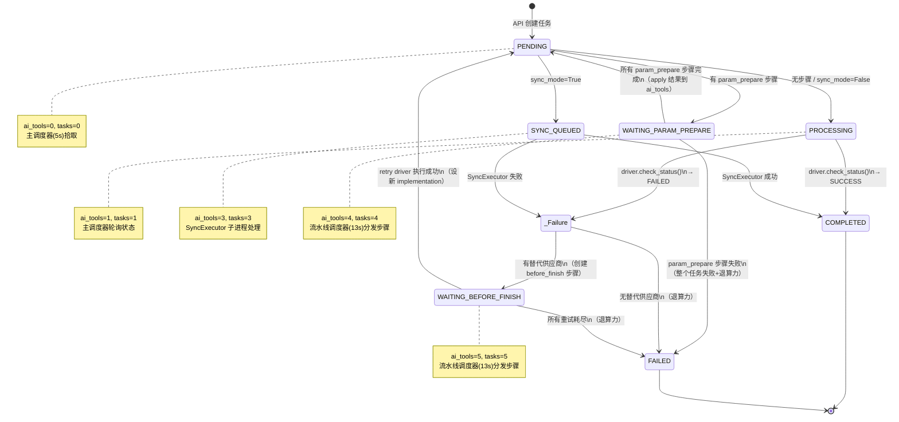
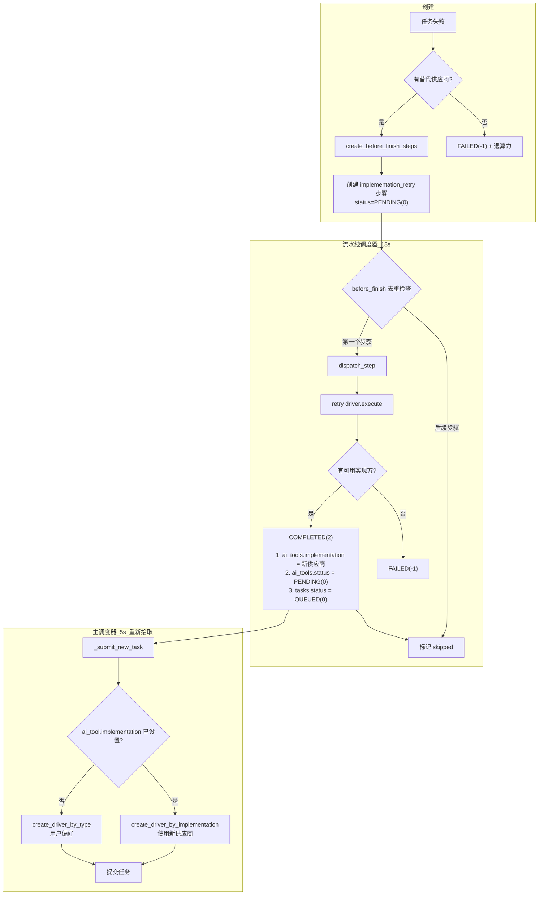
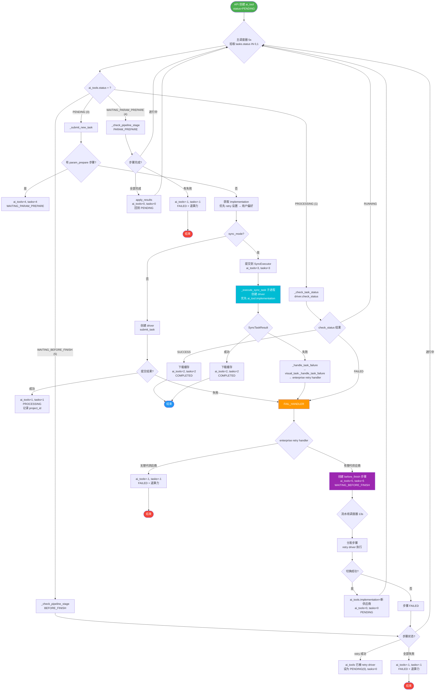
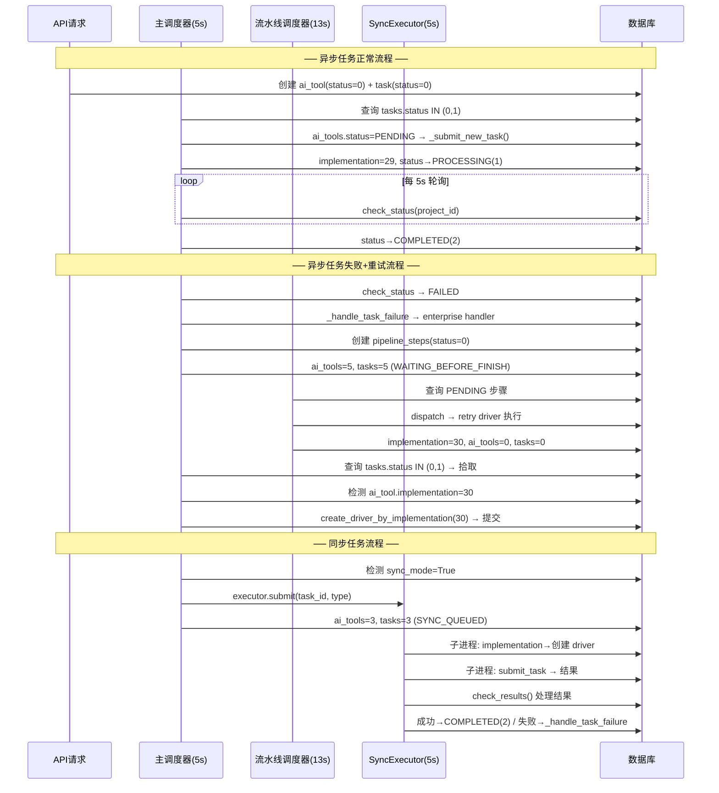

# AI Tools 任务状态与流水线步骤完整流转文档

## 1. ai_tools 状态流转图



## 2. 双表状态对照

系统使用 `ai_tools` 和 `tasks` 两张表跟踪任务状态，**两者必须保持同步**。主调度器仅查询 `tasks.status IN (0, 1)` 来获取待处理任务。

| ai_tools.status | tasks.status | 常量名 | 说明 |
|:-:|:-:|---|---|
| 0 | 0 | PENDING / QUEUED | 待处理 |
| 1 | 1 | PROCESSING | 处理中（已提交到外部 API） |
| 2 | 2 | COMPLETED | 处理完成 |
| -1 | -1 | FAILED | 处理失败 |
| 3 | 3 | SYNC_QUEUED | 已提交到同步任务进程池 |
| 4 | 4 | WAITING_PARAM_PREPARE | 等待参数预处理流水线完成 |
| 5 | 5 | WAITING_BEFORE_FINISH | 等待失败重试流水线完成 |

## 3. Pipeline Step 生命周期



### 步骤状态

| 状态值 | 常量名 | 说明 |
|:-:|---|---|
| 0 | PENDING | 待处理 |
| 1 | PROCESSING | 处理中 |
| 2 | COMPLETED | 完成 |
| -1 | FAILED | 失败 |
| -2 | TIMEOUT | 超时 |

### 流水线阶段与步骤类型

| 阶段 | 步骤类型 | 说明 |
|---|---|---|
| param_prepare | face_mask | 人脸遮盖预处理（任务提交前） |
| before_finish | implementation_retry | 切换供应商重试（任务失败后） |

### 关键逻辑

- **只取后续供应商**：`create_before_finish_steps()` 只选择排序在失败实现方**之后**的供应商，到达队列末尾即停止，不会循环回开头
- **跳过不可用的供应商**：创建步骤时检查 `is_enabled()` 和 `create_driver_by_implementation()` 能否成功
- **仅分发第一个步骤**：`process_all_pending_steps()` 对 `before_finish` 阶段只分发第一个 PENDING 步骤，剩余标记 `skipped`
- **双表同步**：retry driver 执行时同时更新 `ai_tools.status` 和 `tasks.status`

## 4. 完整任务处理流程（含同步/异步分流）



## 5. 三个调度器协作时序



## 6. 调度器体系

| 调度器 | 间隔 | 功能 | 入口函数 |
|---|---|---|---|
| 主任务调度器 | 5s | 查询 `tasks.status IN (0,1)` 的任务，根据 `ai_tools.status` 分发处理 | `process_task_with_retry` → `process_generate_video` |
| 流水线步骤调度器 | 13s | 分发 PENDING 步骤、检查 PROCESSING 步骤、推进 ai_tools 状态 | `PipelineProcessor.process_all_pending_steps` |
| 同步任务结果检查器 | 5s | 检查同步进程池中已完成任务的结果 | `SyncTaskExecutor.check_results` |
| 孤儿任务恢复 | 20min | 重置卡在 PROCESSING 的超时任务 | `_reset_orphan_processing_tasks` |
| RunningHub 异步轮询 | 10s | 轮询 RunningHub 异步任务状态 | `process_runninghub_async_tasks` |
| 异步任务提交重试 | 7s | 槽位满时重试提交 | `process_pending_async_task_submissions` |
| RunningHub 槽位清理 | 30min | 清理超时槽位 | `cleanup_runninghub_slots` |

## 7. 各状态下调度器行为

| ai_tools.status | 主调度器(5s) | 流水线调度器(13s) | SyncExecutor(5s) |
|---|---|---|---|
| PENDING (0) | `_submit_new_task()` | - | - |
| PROCESSING (1) | `_check_task_status()` | - | - |
| SYNC_QUEUED (3) | 不处理 | - | `check_results()` |
| WAITING_PARAM_PREPARE (4) | `_check_pipeline_stage(PARAM_PREPARE)` | 分发/轮询步骤 | - |
| WAITING_BEFORE_FINISH (5) | `_check_pipeline_stage(BEFORE_FINISH)` | 分发/轮询步骤 | - |
| COMPLETED (2) | 不进入调度 | - | - |
| FAILED (-1) | 不进入调度 | - | - |

> **注意**：主调度器通过 `tasks.status IN (0, 1)` 查询，因此 WAITING_PARAM_PREPARE(4)、WAITING_BEFORE_FINISH(5)、SYNC_QUEUED(3) 的任务**不会**被主调度器拾取。它们由各自的专用处理器推进。

## 8. 核心代码路径索引

| 场景 | 文件 | 函数 |
|---|---|---|
| 任务提交 | `task/visual_task.py` | `_submit_new_task()` |
| 任务状态轮询 | `task/visual_task.py` | `_check_task_status()` |
| 流水线阶段检查 | `task/visual_task.py` | `_check_pipeline_stage()` |
| 统一失败处理 | `task/visual_task.py` | `_handle_task_failure()` |
| 任务成功处理 | `task/visual_task.py` | `_handle_task_success()` |
| 任务调度入口 | `task/visual_task.py` | `process_task_with_retry()` → `process_generate_video()` |
| 流水线编排 | `task/pipeline_processor.py` | `PipelineProcessor.process_all_pending_steps()` |
| 步骤创建规则 | `task/pipeline_drivers/__init__.py` | `PipelineDriverFactory.create_before_finish_steps()` |
| 供应商重试驱动 | `task/pipeline_drivers/implementation_retry_driver.py` | `ImplementationRetryPipelineDriver.execute()` |
| 企业版失败处理 | `enterprise/task/retry_handler.py` | `handle_failure_with_retry()` |
| 同步任务执行 | `task/sync_task_executor.py` | `_execute_sync_task()` / `SyncTaskExecutor.check_results()` |

## 9. 故障恢复机制

| 机制 | 间隔 | 说明 |
|---|---|---|
| 孤儿任务恢复 | 20min | 重置 `tasks.status=PROCESSING` 的超时任务为 PENDING |
| WAITING_BEFORE_FINISH 恢复 | 每次调度 | `process_task_with_retry()` 末尾检测卡在 WAITING_BEFORE_FINISH 的任务，根据 ai_tools.status 修复 tasks.status |
| 流水线步骤完成检测 | 13s | `_check_ai_tool_stage_completion()` 检测所有步骤完成后推进 ai_tools 状态 |
| 同步任务兜底 | 5s | `check_results()` 异常时强制标记 FAILED，防止永久卡住 |
| 无 project_id 的 PROCESSING 任务 | 5s | `_check_task_status()` 检测孤儿任务并重置 |

## 10. 监控 SQL

```sql
-- 1. 查看任务状态分布
SELECT a.status, COUNT(*) as cnt
FROM ai_tools a
WHERE a.created_at > DATE_SUB(NOW(), INTERVAL 24 HOUR)
GROUP BY a.status;

-- 2. 查看双表状态不一致
SELECT t.task_id, t.status as task_status, a.status as ai_tool_status
FROM tasks t
JOIN ai_tools a ON t.task_id = a.id
WHERE t.status != a.status
  AND a.created_at > DATE_SUB(NOW(), INTERVAL 24 HOUR);

-- 3. 查看 WAITING_BEFORE_FINISH 卡住的任务
SELECT a.id, a.status, a.implementation, a.message, t.status as task_status
FROM ai_tools a
JOIN tasks t ON t.task_id = a.id
WHERE a.status = 5
  AND a.created_at > DATE_SUB(NOW(), INTERVAL 24 HOUR);

-- 4. 查看流水线步骤状态分布
SELECT stage, step_type, status, COUNT(*) as cnt
FROM ai_tool_pipeline_steps
WHERE created_at > DATE_SUB(NOW(), INTERVAL 24 HOUR)
GROUP BY stage, step_type, status;

-- 5. 查看某 ai_tool 的所有流水线步骤
SELECT id, stage, step_type, step_order, status,
       JSON_EXTRACT(params, '$.target_implementation') as target,
       JSON_EXTRACT(result_data, '$.new_implementation') as new_impl,
       created_at, updated_at
FROM ai_tool_pipeline_steps
WHERE ai_tool_id = ?
ORDER BY id;

-- 6. 查看实现方重试成功率
SELECT
    JSON_EXTRACT(params, '$.failed_implementation') as failed_impl,
    JSON_EXTRACT(params, '$.target_implementation') as target_impl,
    status,
    COUNT(*) as cnt
FROM ai_tool_pipeline_steps
WHERE stage = 'before_finish'
  AND step_type = 'implementation_retry'
  AND created_at > DATE_SUB(NOW(), INTERVAL 7 DAY)
GROUP BY failed_impl, target_impl, status
ORDER BY cnt DESC;
```
